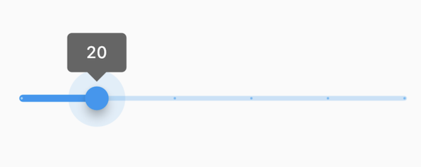
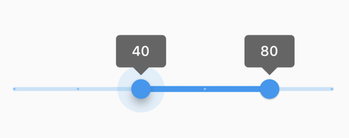

# 基础组件

[TOC]

runApp负责初始化WidgetsFlutterBinding等核心服务，并与Flutter引擎配合，将组件渲染到屏幕上。调用runApp函数时只需传入一个参数，就是一个组件。Flutter会将这个组件当作组件树（Widget Tree）的根，再继续一层层嵌套其他组件，最终满足各式复杂的布局需求和程序效果。

## 文本

### Text

若需要渲染的字体尺寸不符合父级约束，那么Text控件的尺寸强制被修正。注意，Text控件的尺寸并不会影响到需要渲染字体的尺寸。

~~~dart
  const Text(
    String this.data, {
    this.style,
    this.textAlign,
    this.softWrap,
    this.overflow,
    this.textScaleFactor,
    this.maxLines,
    this.semanticsLabel,
  })
~~~

- `textAlign`：只有 Text 宽度大于文本内容长度时指定此属性才有意义

  ~~~dart
  Text("Hello world "*6,  //字符串重复六次
    textAlign: TextAlign.center,
  );
  ~~~

  

- `maxLines`：指定文本显示的最大行数

- `overflow`：指定截断方式。clip（裁剪）、fade（渐淡）、ellipsis（省略号）、visible（可见）

- `textScaleFactor`：默认值由操作系统决定。设用户在安卓或苹果系统中设置了将全局文字放大至150%，则Flutter中所有Text组件的textScaleFactor默认值都会是1.5。这属性适用在某部分布局需要固定文字大小的情景。

- `semanticsLabel`：语义标签是辅助功能的一部分，用来协助第三方软件为有障碍人士提供无障碍功能。例如，盲人一般会通过某些软件将屏幕上的内容朗读出来，而这里的语义标签就可以帮助屏幕朗读软件，以提供更友好的用户体验

  ~~~dart
  Text("$5.00",semanticsLabel: "五元整")
  ~~~


### 文本修饰

`TextStyle`用于指定文本显示的样式如颜色、字体、粗细、背景等

~~~dart
TextStyle({
    this.inherit = true,
    this.color,
    this.backgroundColor,
    this.fontSize,
    this.fontWeight,
    this.fontStyle,
    this.letterSpacing,
    this.wordSpacing,
    this.textBaseline,
    this.height,
    this.leadingDistribution,
    this.locale,
    this.foreground,
    this.background,
    this.shadows,
    this.fontFeatures,
    this.fontVariations,
    this.decoration,
  })
~~~

- `height`：该属性用于指定行高。这里接受一个比例因子，即具体的行高等于`fontSize `* `height`。


可以通过DefaultTextStyle组件为多个Text组件应用统一的样式。当Text组件遇到Text组件多个DefaultTextStyle组件嵌套时，只有最近的那个样式会生效。

可以使用DefaultTextStyle.merge()函数继承父级DefaultTextStyle，并在此基础上扩展或覆盖一些样式。

~~~dart
DefaultTextStyle(
  style: TextStyle(
      color: Colors.grey, fontSize: 24, fontWeight: FontWeight.bold),
  child: Column(
    children: <Widget>[
      DefaultTextStyle(
        style:
            TextStyle(color: Colors.black, fontStyle: FontStyle.italic),
        child: Text("落霞与孤鹜齐飞"),
      ),
      DefaultTextStyle.merge(
        style:
            TextStyle(color: Colors.black, fontStyle: FontStyle.italic),
        child: Text("秋水共长天一色"),
      ),
    ],
  ),
)
~~~


### 使用自定义字体

在`pubspec.yaml`中配置：

~~~yaml
flutter:
  fonts:
    - family: Raleway
      fonts:
        - asset: assets/fonts/Raleway-Regular.ttf
        - asset: assets/fonts/Raleway-Medium.ttf
          weight: 500
        - asset: assets/fonts/Raleway-SemiBold.ttf
          weight: 600
    - family: AbrilFatface
      fonts:
        - asset: assets/fonts/abrilfatface/AbrilFatface-Regular.ttf
~~~

~~~dart
TextStyle(
  fontFamily: 'Raleway',
);
~~~

如果使用了某一款自定义字体，但是没有参数所要求的粗体、斜体等版本。那么Flutter会模拟出对应的字体效果。

### RichText & TextSpan

RichText与TextSpan配合使用，可以很方便地为不同的字体片段应用不同的样式。下面是一个基本结构

~~~dart
RichText(
	text: TextSpan(
    	style : TextStyle(),
        text : "晋太元中",
        children : [
            TextSpan(
            	text : "武陵",
                style : TextStyle(),
            ),
            TextSpan(text : "人捕鱼为业"),
            TextSpan(
            	style : TextStyle()
                text : "缘溪行，忘路之远近",
                children : [
                    TextSpan("忘路之远近")
                ]
            ),
            TextSpan(text : "忽逢桃花林")
        ]
    )
)
~~~

这里TextSpan形成一个树状结构，文本内容的生成遵循深度优先遍历顺序。文本内容从代码结构上来看就是从上到下的。

下级TextSpan会自动继承上级的style，并且可以覆写或扩展上级TextSpan的style。但是RichText组件中的TextSpan并不会继承上级DefaultTextStyle组件提供的默认样式。如需使用DefaultTextStyle组件统一设置样式，则可以考虑使用Text组件的Text.rich（）构造函数。

~~~dart
RichText(
	text : TextSpan(...)
)
    
Text.rich(TextSpan(...))
~~~


TextSpan中的recognizer参数支持传入一个GestureRecognizer类以便完成TextSpan树中某一片段的交互

~~~dart
Text.rich(
	TextSpan(
    	children : [
            TextSpan(
                text: "使用条款",
                recongizer: TapGestureRecongnizer()..onTap;
            ),
            TextSpan(
                text: "隐私政策",
                recongizer: TapGestureRecongnizer()..onTap;
            ),
        ]
    )
);
~~~


## 图片 & Icon

### Icon

Icon组件可以表示小图标。图标的本质是一些相对特殊的字体，属于矢量图形，可以支持无限缩放且不会失真。

Flutter框架中已经自带了一些图标，分别由Icons和CupertinoIcons两个类提供。前者包含常用的Material设计风格（常见于安卓系统）的图标，后者含有Cupertino风格（常见于iOS系统）的图标

~~~dart
Icon(
	IconData? icon, {		
    double? size,			//设置大小
    Color? color,			//设置图标的前景颜色
        
})
    
Icon(Icons.share);
~~~


IconTheme与DefaultTextStyle组件用法几乎相同，这里不再介绍。


### Image

`Image`组件有1个必传的参数image，类型为`ImageProvider`。实际上，`ImageProvider`是一个抽象类，而Flutter框架提供了4种已知继承，分别为**NetworkImage（网络图片）**、**FileImage（文件图片）**、**AssetImage（资源包图片）**及**MemoryImage（内存图片）**。下面分别介绍它们是如何使用的：

- `NetworkImage`：Image组件将根据URL链接地址，自动完成下载、解码、渲染等一系列动作

  ~~~dart
  Image(image : NetworkImage('https://flutter.github.io/assets-for-api-docs/assets/widgets/ owl.jpg');
        
  Image.network('https://flutter.github.io/assets-for-api-docs/assets/widgets/ owl.jpg');
  ~~~

  因为这里需要访问网络，记得检查是否已经打开相关权限，如安卓App模块需要在原生manifest文件内添加android.permission.INTERNET申请网络权限。

  

- `FileImage`：用来加载文件系统中的图片资源文件

  ~~~dart
  Image(image : FileImage(File("path/...")));
  
  Image.file(File("Path/...."));
  ~~~

  记得检查是否打开相关权限，安卓模块可能需要在原生manifest里添加android.permission.READ_EXTERNAL_ STORAGE权限。

  

- `AssetImage`：用于加载在打包时放入资源包（AssetBundle）中的图片资源。

  图片资源的文件路径需要写入pubspec.yaml文件中

  ~~~yaml
  flutter:
  	assets:
  		- images/cat.jpg
          - images/icon/			#images/icon下的所有资源，但是不包括子目录的
  ~~~

  ~~~dart
  Image(image : AssetImage("images/cat.jpg"));
  ~~~

  

- `MemoryImage`：可以从内存中的一个Uint8List字节序列中加载图片。

  在实践中，一般使用convert包里的base64Decode函数，它base64编码转换成Uint8List类型，并传给MemoryImage使用。

  ~~~dart
  final String data = r'iVBORwOKGgoAAAAANsu....';
  final bytes = base64Decode(data);
  Image(image : MemoryImage(bytes));
  Image.memory(bytes);
  ~~~


Image大小受父约束、Widget参数、素材大小的影响。

~~~dart
const Image({
  ...
  this.width, 							//图片的宽
  this.height, 							//图片高度
  this.color, 							//图片的混合色值
  this.colorBlendMode, 					//混合模式
  this.fit,								//缩放模式
  this.alignment = Alignment.center, 	//对齐方式
  this.repeat = ImageRepeat.noRepeat, 	//重复方式
  ...
})
~~~

- `width`、`height`：用于设置图片的宽、高。如果只设置`width`、`height`的其中一个，那么另一个属性默认会按比例缩放

- `alignment`：设置图片的对齐方式。与`fit`一起决定如何渲染不匹配Image控件尺寸的图片。

- `fit`：该属性用于在图片的显示空间和图片本身大小不同时指定图片的适应模式。BoxFit

  当图片过小时的适应模式

  - `none`（默认）：什么也不做。

  - `fill`：会拉伸填充满显示空间，图片本身长宽比会发生变化，图片会变形。
  - `cover`：会按图片的长宽比放大后填满显示空间，图片不会变形，超出显示空间部分会被剪裁。

  当图片过大时的适应模式

  - `contain`（默认）：图片会在保证图片本身长宽比不变的情况下缩放以适应当前显示空间，图片不会变形。
  - `fitWidth`：图片的宽度会缩放到显示空间的宽度，高度会按比例缩放，然后居中显示，图片不会变形，超出显示空间部分会被剪裁。
  - `fitHeight`：图片的高度会缩放到显示空间的高度，宽度会按比例缩放，然后居中显示，图片不会变形，超出显示空间部分会被剪裁。
  - `none`：什么也不做

  

- `errorBuilder`，如果图片加载的过程中发生错误，则Image组件会将errorBuilder方法返回的Widget渲染到屏幕上，并且Image的父组件约束会传递给这个Widget。

  ~~~dart
  Image.network(
  	'https://file.not.found/404.png',
      errorBuilder : (context, exception, stackTrace) {
          return Widget();
      }
  )
  ~~~

- `loadingBuilder`

### FadeInImage

在图片加载过程中暂时使用另一张图片来代替，并在加载完成时平滑地过渡成新的图片。

~~~dart
FadeInImage.assetNetwork(
	image : "https://.../owl.jpg",
    placeholer : "assets/loading.gif",
    fadeOutDuration : Duration(seconds : 2),
    fadeOutCurve : null
    fadeInDuration : Duration(seconds : 3),
)
~~~


## 按钮

这些按钮都是在满足父约束的情况下，尽可能地匹配子组件的尺寸。


`ElevatedButton`、`TextButton`、`OutlinedButton`、`IconButton`，它们的动画效果都是涟漪动画。而`ElevatedButton`、`TextButton`、`OutlinedButton`都有一个`icon` 构造函数，通过它可以轻松创建带图标的按钮。

~~~dart
ElevatedButton(onPressed: () {},child: Text("ElevatedButton"),)
    
TextButton(child: Text("normal"),onPressed: () {},)
    
OutlinedButton(child: Text("normal"),onPressed: () {},)
    
IconButton(icon: Icon(Icons.thumb_up),onPressed: () {},)
    
ElevatedButton.icon(icon: Icon(Icons.send),label: Text("发送"),onPressed: () {},)
    
OutlinedButton.icon(icon: Icon(Icons.add),label: Text("添加"),onPressed: () {},)

TextButton.icon(icon: Icon(Icons.info),label: Text("详情"),onPressed: () {},)
~~~


## 进度条

`LinearProgressIndicator`和`CircularProgressIndicator`，它们都可以同时用于精确的进度指示和模糊的进度指示。精确进度通常用于任务进度可以计算和预估的情况，比如文件下载；而模糊进度则用户任务进度无法准确获得的情况，如下拉刷新，数据提交等。


它们都是尽可能地扩展到父组件的尺寸。

### LinearProgressIndicator

~~~dart
LinearProgressIndicator({
  double value,
  Color backgroundColor,
  Animation<Color> valueColor,
  ...
})
~~~

- `value`：`value`表示当前的进度，取值范围为[0,1]；当`value`为`null`时则指示器会执行一个循环动画（模糊进度）
- `backgroundColor`：指示器的背景色。
- `valueColor`: 指示器的进度条颜色；


### CircularProgressIndicator

~~~dart
 CircularProgressIndicator({
  double value,
  Color backgroundColor,
  Animation<Color> valueColor,
  this.strokeWidth = 4.0,
  ...   
}) 
~~~

- `strokeWidth` 表示圆形进度条的粗细

## 其他

### Placeholder

它可以方便开发者在屏幕上画出一个占位框，表示这块内容暂时还没完成。一般而言，它会试图占满全部可用空间。基本代码如下：

~~~dart
Placeholder()
~~~

## 输入框

### TextField

`TextField`一共有五种状态：无焦点、无焦点且错误、有焦点、有焦点且错误、禁用。

TextField会尽量扩展到父组件尺寸的。但是如果父组件的高度不足以放下TextField，那么就会抛出异常。同时如果宽度是double.infinite，那么也会抛出异常。


~~~dart
const TextField({
  ...
  TextEditingController controller, 
  FocusNode focusNode,
  InputDecoration decoration = const InputDecoration(),
  TextInputType keyboardType,
  TextInputAction textInputAction,
  TextStyle style,
  TextAlign textAlign = TextAlign.start,
  bool autofocus = false,
  bool obscureText = false,
  int maxLines = 1,
  int maxLength,
  this.maxLengthEnforcement,
  ToolbarOptions? toolbarOptions,
  ValueChanged<String> onChanged,
  VoidCallback onEditingComplete,
  ValueChanged<String> onSubmitted,
  List<TextInputFormatter> inputFormatters,
  bool enabled,
  this.cursorWidth = 2.0,
  this.cursorRadius,
  this.cursorColor,
  this.onTap,
  ...
})
~~~

- `InputDecoration`：用于控制`TextField`的外观显示，如提示文本、背景颜色、边框等。如果设置为null，那么什么样式都没有。

- `keyboardType`：用于设置该输入框默认的键盘输入类型，取值如下：

  | TextInputType枚举值 | 含义                                                |
  | ------------------- | --------------------------------------------------- |
  | text                | 文本输入键盘                                        |
  | number              | 数字；会弹出数字键盘                                |
  | phone               | 优化后的电话号码输入键盘；会弹出数字键盘并显示“* #” |
  | datetime            | 优化后的日期输入键盘；Android上会显示“: -”          |
  | emailAddress        | 优化后的电子邮件地址；会显示“@ .”                   |
  | url                 | 优化后的url输入键盘； 会显示“/ .”                   |

- `textInputAction`：键盘动作按钮图标(即回车键位图标)。下面是当值为`TextInputAction.search`时，原生Android系统下键盘样式如图所示：

  

- `style`：正在输入的文本样式。

- `cursorWidth`、`cursorRadius`和`cursorColor`：这三个属性是用于自定义输入框光标宽度、圆角和颜色的。

- `enable`：如果为`false`，则输入框会被禁用，禁用状态不能响应输入和事件，同时显示禁用态样式。程序在运行时可随时通过`enabled`属性设置启用或禁用文本框。

- `maxLines`：默认值为`1`，此时输入框不会换行（水平溢出，有滚动条）。若值为`null`，则无限行。而值为`x`，那么最多显示`x`行，但不会阻止用户输入超过`x`行（垂直溢出，有滚动条）。若需要允许用户超出长度后依然输入，则可通过传入`maxLengthEnforced`：`false`，使`TextField`不强行停止用户输入。但是超出限制后，`TextField`状态被设置为错误的

- `obscureText`、`obscureText`：决定是否将内容遮挡，并且用什么字符遮挡。默认为“U+2022 BULLET”字符。

- `maxLength`：设置TextField可允许的最长字符数。`

- `buildCounter`：设置计数器。当设置maxLength属性时，会自动应用默认计数器。如果不想使用计数器，那么在InputDecoration中的counterText属性设置为空字符串即可。buildCounter的定义如下：

  ~~~dart
  TextField（
      buildContext : (BuildContext context, {
          required int currentLength,
          required int? maxLength,
          required bool isFocused,
      }) {
          return Text(`${maxLength! - currentLength}`);
      }
  ）
  ~~~

  注意，InputDecoration中有一个counter属性也可以设置计数器，但是它不能自动计数，而buildCounter确是可以的。若两边都设置，InputDecoration中的counter属性则有优先权，覆盖这里的自动计数器。

- `inputFormatters`：自动过滤器

  ~~~dart
  TextField(
  	inputFormatters : [
          FilteringTextInputFormatter.deny(
          	"zzz",								//当用户输入zzz时，自动替换成ZZZZ
              replacementString: "ZZZZ",
          ),
          FilteringTextInputFormatter.deny(
              RegExp(r"[aeiou]"),					
              replacementString : "*",
          ),
          FilteringTextInputFormatter.allow(RegExp("[0-9.]"))	//只允许用户指定字符，其他字符会被忽略掉
      ]
  )
  ~~~

- `onSubmitted`：当用户单击屏幕软键盘上的“完成”等表示结束的按钮时，软键盘会被收起，同时onSubmitted事件会被触发

- `onChanged`：每当用户对TextField的内容做出改动，如添加或删除文字时，onChangd事件都会被触发。但若用户没有直接修改TextField，而是通过controller导致文本内容发生变动的，则不会触发onChanged事件。

- `onEditingComplete`。当用户完成输入时，onEditingComplete事件会在onSubmitted事件之前触发。它的主要作用是处理与焦点相关的逻辑。

  默认情况下，当用户单击软键盘上的done、go、send、search等表示结束的按键时，TextField会自动放弃焦点并收起软键盘。例如，在即时通信软件中，开发者通常会通过textInputAction属性将软键盘右下角修改为“发送”按键，但用户发送完一条短消息后很可能希望立即开始编辑下一条消息，因此不应该放弃焦点。此时可通过向onEditingComplete传入一个空函数来覆盖默认行为

- `onTap`：每当用户单击一次TextField组件，它的onTap事件就会被触发一次

- `autofocus`: 是否自动获取焦点。


### InputDecoration

`InputDecoration`有三类前缀：

- `icon`
- `prefixIcon`、`prefixIconConstraints`
- `prefix`、`prefixText`、`prefixStyle`。注意：`prefix`与`prefixText`只能二选一。只有在获得焦点时才渲染出，而且不可被用户删除

~~~dart
TextField(
	decoration : InputDecoration(
    	icon : Icon(Icons.add),
        prefixIcon : Icon(Icons.lock),
        prefixText : "https://",
    )
)
~~~


`InputDecoration`也有三类后缀，

- `counter`、`counterText`、`counterStyle`
- `suffixIcon`、`sufficIconConstraints`
- `suffixText`、`suffixStyle`、`suffix`。


`labelText`、`labelStyle`、`floatingLabelBehavior`属性用于设置标签

而`hintText`、`hintStyle`用于设置提示信息，当用户输入时，这些信息就会消失。


`TextField`组件共有5种状态，因此`InputDecoration`也有5个相应的定义边框样式的属性，分别为`enabledBorder`（无焦点时的边框）、`errorBorder`（无焦点且错误）、`focusedBorder`（有焦点时的边框）、`focusedErrorBorder`（有焦点且错误）、`disabledBorder`（禁用时的边框）。另外它还提供简单的`border`属性，用于定义默认边框，一般情况下通过`border`属性即可同时设置5种状态。注意，如果要自定义边框，那么必须设置`enabledBorder`等五个属性，否则在对应状态时，会显示`border`属性所设置边框的状态。


`InputDecoration`支持为文本框填充背景色，先将`filled`属性设置为`true`，启用填充色，再通过`fillColor`属性设置一种颜色。此外还可以通过`hoverColor`属性设置鼠标悬浮时的填充色。注意，`fillColor`与`hoverColor`会混色。


### 控制器

~~~dart
class _HyHomePageState extends State<MyHomePage> {
  TextEditingController _controller = TextEditingController();

  @override
  void dispose() {
    _controller.dispose();
    super.dispose();
  }

  @override
  Widget build(BuildContext context) {
    return TextField(
        controller: _controller,
        onChanged: (_) => {log("onChange")},
      ),
    );
  }
}
~~~

~~~dart
controller.text;		//获取并修改文本
controller.clear();		//清除文本
controller.section;		//获取并修改选中的区域
~~~


## From

Flutter提供了一个`Form` 组件，它可以对输入框进行分组，然后进行一些统一操作，如输入内容校验、输入框重置以及输入内容保存。

`Form`继承自`StatefulWidget`对象，它对应的状态类为`FormState`。它的定义如下：

~~~dart
Form({
  required Widget child,
  bool autovalidate = false,
  WillPopCallback onWillPop,
  VoidCallback onChanged,
})
~~~

- `autovalidate`：是否自动校验输入内容；当为`true`时，Form中的每一个 FormField 内容发生变化时都会调用`FormField`的`validate`方法。
- `onChanged`：`Form`的任意一个`FormField`内容发生变化时会调用此回调


`TextFormField`组件，它继承自`FormField`类，除了`FormField`定义的属性之外，它还包括`TextField`的属性。`FormField`部分定义如下：

~~~dart
const FormField({
  ...
  FormFieldSetter<T> onSaved, //保存回调
  FormFieldValidator<T>  validator, //验证回调
  bool autovalidate = false, //是否自动校验。
})
~~~


`FormState`为`Form`的`State`类，可以通过`Form.of()`或`GlobalKey`获得，我们可以通过它来对FormField进行统一操作

- `FormState.validate()`：调用`FormField的validate`回调，如果有一个校验失败，则返回false。所有校验失败项都会返回用户返回的错误提示。
- `FormState.save()`：调用`FormField`的`save`回调，用于保存表单内容
- `FormState.reset()`：将子孙`FormField`的内容清空。

## Material Widget

实战中如有相关需求，就可以正确地选择与目标功能接近的组件入手，**避免重复造轮子**。

官网示例：https://docs.flutter.dev/ui/widgets/material

### Chip

该组件用于实现标签：

~~~dart
Chip(
    label: Text("Chip"),
),
Chip(
    label: Text("Chip"),
    onDeleted: () {},
),
FilterChip(
    selected: true,
    label: Text("FilterChip"),
    onSelected: (bool _) {},
)
~~~


### DatePickerDialog

~~~dart
ElevatedButton(
    child: Text("请选择日期!"),
    onPressed: () async {
      var result = await showDatePicker(
          context: context,
          initialDate: DateTime.now(),			//初始化时间，通常情况下设置为当前时间
          firstDate: DateTime(2020),			//表示开始时间，不能选择此时间前面的时间
          lastDate: DateTime(2030));			//lastDate表示结束时间，不能选择此时间之后的时间
      log('$result');
    },
  ),
);
~~~


### TimePickerDialog

~~~dart
showTimePicker(
    context: context,
    initialTime: TimeOfDay.now(),
    errorInvalidText: "errorInvalidText",
    cancelText: "cancelText",
    confirmText: "confirmText",
    hourLabelText: "hourLabelText",
    minuteLabelText: "minuteLabelText",
    helpText: "HelpText",
);
~~~


### DropdownButton

```dart
class _MenuAnchorExampleState extends State<MenuAnchorExample> {
  int? selected_value = null; 		//记录选择的哪一个item
  
    @override
  Widget build(BuildContext context) {
    return Scaffold(
      appBar: AppBar(title: const Text('MenuAnchorButton')),
      body: DropdownButton(
          value: selected_value,		
          isExpanded: true,				//扩展到父组件的最大尺寸。
          hint:Text("请选择地区"),		//提示文字，当value的初始值为null时才会显示
          items: [
            DropdownMenuItem(child: Text('北京'), value: 1,),
            DropdownMenuItem(child: Text('天津'), value: 2,),
            DropdownMenuItem(child: Text('河北'), value: 3,)
          ],
          
          //在回调函数中必须设置value，以及调用setState来刷新UI
          //value参数是所选择的DropdownMenuItem组件的value属性
          onChanged: (value) {
            setState(() {
              selected_value = value!;
            });
          })
    );
  }
}
```


### ExpansionTile

```java
const ExpansionTile({
    Key? key,
    this.leading,						// 标题左侧的 Widget 组件
    required this.title,				// 展示的列表标题 Widget 
    this.subtitle,						// 子标题 
    this.onExpansionChanged,			// 列表 展开/折叠 回调函数
    this.children = const <Widget>[],	// 列表展示时显示的 Widget 组件集合
    this.trailing,						// 标题右侧的 Widget 组件
    this.initiallyExpanded = false,		// 默认状态下是否展开 , 默认不展开 
    this.backgroundColor,				// 展开时子列表背景色
    this.expandedAlignment,
    this.expandedCrossAxisAlignment,
    this.controller,
    //其他属性
}
```

children事实上就是一个Column，expandedAlignment设置这个Column在ExpansionTile中的对齐方式。而expandedCrossAxisAlignment设置子组件在这个Column中的对齐方式。

~~~dart
const ExpansionTile(
    title: Text('展开闭合demo'),
    leading: Icon(Icons.ac_unit, color: Colors.green),
    backgroundColor: Colors.white,
    initiallyExpanded: true, // 是否默认展开
    expandedAlignment: Alignment.center,
    expandedCrossAxisAlignment: CrossAxisAlignment.end,
    children: const <Widget>[
      ColoredBox(color: Colors.red, child: SizedBox(height: 100, width: 100,),),
      ColoredBox(color: Colors.green, child: SizedBox(height: 100, width: 200,),),
      ColoredBox(color: Colors.orange, child: SizedBox(height: 100, width: 300,),),
    ],
  )
~~~


此外，ExpansionTile还可以接受一个ExpansionTileController控制器，它有两个方法`collapse()`、`expand()`


### Radio


~~~dart
Radio(
    value : 1,
    groupValue: _groupValue,
    onChanged: (value) { 
        setState(() {
      		_groupValue = value!;
    	});
    },
)
~~~

当groupValue与value匹配时，该Radio显示为选中状态。

### Slider



~~~dart
Slider(
    value: _currentSliderValue,	
    min: 0
    max: 100,
    divisions: 5,				
    onChanged: (double value) {
      setState(() {
        _currentSliderValue = value;
      });
    },
  ),
~~~


Slider中的secondaryTrackValue使用：

~~~dart
Slider(
    value: _currentSliderPrimaryValue,
    secondaryTrackValue: _currentSliderSecondaryValue,
    onChanged: (double value) {
        setState(() {
        _currentSliderPrimaryValue = value;
        });
    },
),
Slider(
    value: _currentSliderSecondaryValue,
    onChanged: (double value) {
        setState(() {
        _currentSliderSecondaryValue = value;
        });
    },
),
~~~


### RangeSlider



~~~dart
RangeSlider(
  values: _currentRangeValues,			//这个类型为RangeValues
  max: 100,
  divisions: 5,
  onChanged: (RangeValues values) {
    setState(() {
      _currentRangeValues = values;
    });
  },
);
~~~


### Switch


~~~dart
Switch(
  // This bool value toggles the switch.
  value: light,
  activeColor: Colors.red,
  onChanged: (bool value) {
    // This is called when the user toggles the switch.
    setState(() {
      light = value;
    });
  },
);
~~~


~~~dart
final MaterialStateProperty<Color?> trackColor =
    MaterialStateProperty.resolveWith<Color?>(
  (Set<MaterialState> states) {
    // Track color when the switch is selected.
    if (states.contains(MaterialState.selected)) {
      return Colors.amber;
    }
    
    // Otherwise return null to set default track color
    // for remaining states such as when the switch is
    // hovered, focused, or disabled.
    return null;
  },
);
final MaterialStateProperty<Color?> overlayColor =
    MaterialStateProperty.resolveWith<Color?>(
  (Set<MaterialState> states) {
    // Material color when switch is selected.
    if (states.contains(MaterialState.selected)) {
      return Colors.amber.withOpacity(0.54);
    }
      
    // Material color when switch is disabled.
    if (states.contains(MaterialState.disabled)) {
      return Colors.grey.shade400;
    }
      
    // Otherwise return null to set default material color
    // for remaining states such as when the switch is
    // hovered, or focused.
    return null;
  },
);

return Switch(
  // This bool value toggles the switch.
  value: light,
  overlayColor: overlayColor,
  trackColor: trackColor,
  thumbColor: const MaterialStatePropertyAll<Color>(Colors.black),
  onChanged: (bool value) {
    // This is called when the user toggles the switch.
    setState(() {
      light = value;
    });
  },
);
~~~


~~~dart
final MaterialStateProperty<Icon?> thumbIcon =MaterialStateProperty.resolveWith<Icon?>(
    (Set<MaterialState> states) {
      if (states.contains(MaterialState.selected)) {
        return const Icon(Icons.check);
      }
      return const Icon(Icons.close);
    },
  );

Switch(
  thumbIcon: thumbIcon,
  value: light1,
  onChanged: (bool value) {
    setState(() {
      light1 = value;
    });
  },
),
~~~


