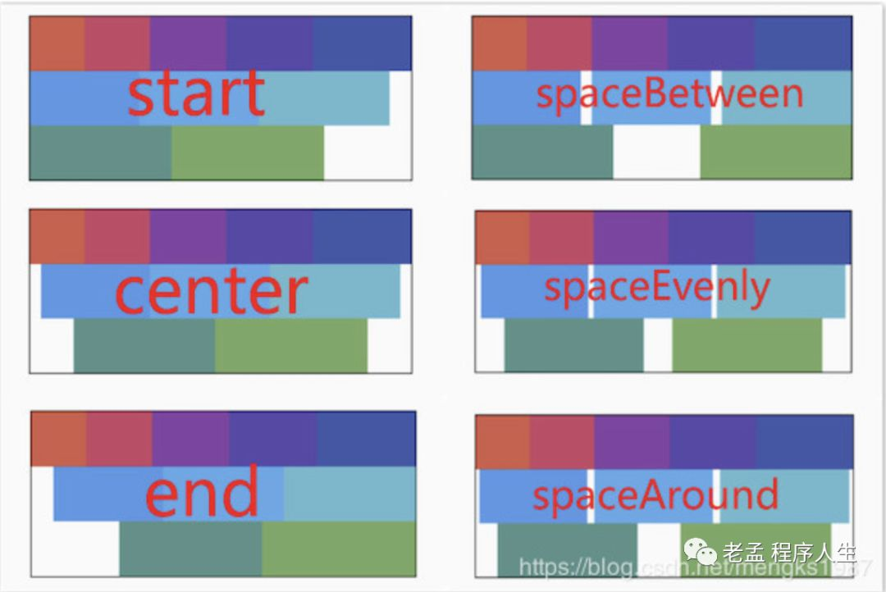

# Layout

[TOC]

**组件（Widget）**是Flutter框架的基石。Flutter作为现代的UI框架，从React框架获得灵感，通过定义一个个相对独立的小组件，再利用组件与组件之间的嵌套与配合，逐步搭建出复杂的用户界面。

在Flutter框架中，组件**不可变（immutable）**,即一旦组件被创建就不可以再修改其中的内容。因此每当程序内部数据发生改变或因动画效果而导致用户界面需要更新时，所有涉及的组件都会被摧毁并重制。Flutter框架对组件摧毁和重制的过程优化到极致，所以并不需要过度3担心性能问题。

Flutter框架中的尺寸或位置信息，例如高度、宽度等，一般都以**逻辑像素**作为单位。由于每个物理像素的规格不同。运行时，Flutter程序会根据当前的设备信息自动提供逻辑像素到物理像素的转换，最终提供统一的“每38像素约为1cm”的接口。这样开发者在处理页面布局时，就不需要考虑不同设备屏幕的像素密度问题了。

 ## 布局原理 & 约束

Flutter 中有两种布局模型：

- 基于 RenderBox 的盒模型布局。
- 基于 Sliver ( RenderSliver ) 按需加载列表布局。

这两种模型的布局流程如下：

1. 父Widget向其传递约束
2. Widget向子级传递约束。这个约束值是可以根据其他因素重新计算出来的。只要符合布局语义，任何计算策略都是可以接受的。
3. 子级将所需的大小回传给Widget，结合父级约束以及相关参数（height、width），来确定自身的大小。也就是说Widget的大小由以下三个因素来决定：
   - 父级约束
   - 子组件的大小
   - 相关参数（mainAxisSize、height、width等）
4. 然后Widget 就会对子Widget逐个进行布局。如果子Widget溢出，可以直接裁剪掉，或者什么也不做直接绘制出来。
5. Widget 将会把它的大小信息向上传递至父 widget


**在任何时候，子组件都必须先遵守父组件的约束**。也就是说，当子组件的大小不满足约束时，那么必须将大小设置为约束的范围内（通常是临界值处），或者抛出一个异常（例如TextField控件，这种情况很少见）。

~~~dart
Row(
  children: [TextField()],			//TextField会尽可能的大，但是Row给它一个double,infinity约束。因此TextField选择抛出异常并不渲染。大部分组件对此情景的解决方法是尽可能的小。
)
~~~

这是所有Widget对于布局的假设，在自己自定义布局时，要满足这条不变式。但是要注意的是，**这个不变式仅仅在父子之间成立**。假设有一个A，它的子组件是B，B 的子组件是C。当B向C传递约束时，可以将A的约束考虑进来，与自身约束一起，计算出一个新的约束传递给C。下面来看两个例子：

~~~dart
ConstrainedBox(
  constraints: BoxConstraints(minWidth: 60.0, minHeight: 60.0), //父
  child: ConstrainedBox(
    constraints: BoxConstraints(minWidth: 90.0, minHeight: 20.0),//子
    child: redBox,
  ),
)
~~~

此时，redBox的最终显示效果是宽90，高60。而

~~~drat
UnconstrainedBox(
  alignment: Alignment.topLeft,
  child: Padding(
    padding: const EdgeInsets.all(16),
    child: Row(children: [Text('xx' * 100)]),
  ),
),
~~~

直接就溢出：


第一个例子就是将父约束考虑进来，而第二次例子直接将父约束忽略掉，而是传递一个无约束给子Widget。**只要符合布局语义，任何计算策略都是可以接受的**。这里**无约束**的意思是，约束的最大宽度或最大高度为 [`double.infinity`](https://api.flutter-io.cn/flutter/dart-core/double/infinity-constant.html)。


## Layout Widget


### Column & Row

~~~dart
Row({
  ...  
  TextDirection 		textDirection,    									//子组件的布局顺序(是从左往右还是从右往左)
  MainAxisSize 			mainAxisSize = MainAxisSize.max,    				//在主轴(水平)方向占用的空间
  MainAxisAlignment 	mainAxisAlignment = MainAxisAlignment.start,		
  VerticalDirection 	verticalDirection = VerticalDirection.down,  
  CrossAxisAlignment 	crossAxisAlignment = CrossAxisAlignment.center,
  List<Widget> 			children = const <Widget>[],
})
~~~

- MainAxisAlignment：只有当`mainAxisSize`的值为`MainAxisSize.max`时，此属性才有意义。

  - start、end、center
  - spaceBetween：在相邻的子组件之间插入空白，但不在第一个和最后一个子组件外围插入留白
  - spaceEvenly：在子组件周围统一插入留白
  - spaceAround：在相邻的子组件之间插入留白，并在第一个和最后一个子组件外围插入一半的留白

- CrossAxisAlignment

  - start、end、center
  - stretch：在纵轴上尽量拉伸
  - baseline：按组件文字的基准线对齐

- mainAxisSize：

  - MainAxisSize.max：表示尽可能多的占用水平方向的空间
  - MainAxisSize.min：表示尽可能少的占用水平空间，当子组件没有占满水平剩余空间，则`Row`的实际宽度等于所有子组件占用的水平空间；

  

Column & Row组件在主轴上会根据父级约束、children的总尺寸，以及mainAxisSize属性，来确定自身尺寸。而它们的副轴的大小则取决于他们所有子元素在纵轴方向上的最大大小以及父级约束。

注意，由于Column & Row在主轴方向上给子组件传递的是无约束，此时要小心溢出的情况。在副轴上直接传递父约束的最大值，而最小值设置为0。

如果`Row`里面嵌套`Row`，或者`Column`里面再嵌套`Column`，那么只有最外面的`Row`或`Column`会占用尽可能大的空间，里面`Row`或`Column`所占用的空间为实际大小。如果不这么做，其他元素将会被挤出去。


### Wrap

Wrap的行为与Row类似，但是Wrap对于在主轴上溢出的处理是自动换行，而不是像Row那样直接裁剪掉。副轴上的溢出是直接裁剪掉的。

```dart
Wrap({
  ...
  this.direction = Axis.horizontal,
  this.alignment = WrapAlignment.start,
  this.spacing = 0.0,
  this.runAlignment = WrapAlignment.start,
  this.runSpacing = 0.0,
  this.crossAxisAlignment = WrapCrossAlignment.start,
  List<Widget> children = const <Widget>[],
})
```

- `direction`：确定主轴的方向

- `spacing`：主轴方向子widget的间距

- `runSpacing`：纵轴方向的间距

- `runAlignment`：它是控制多个副轴的对齐，而crossAxisAlignment控制的是一个副轴上多个元素的对齐。此外crossAxisAlignment在此不能使用`stretch`参数

- `alignment`：

  


### Stack & Positioned

层叠布局和 Web中的绝对定位是相似的。Flutter中使用`Stack`和`Positioned`这两个组件来配合实现绝对定位。`Stack`允许子组件堆叠，而`Positioned`用于根据`Stack`的四个角来确定子组件的位置。


Stack里的子组件在布局时会被分为“有位置”和“无位置”这2大类，而其中“有位置”特指被Positioned包裹的子组件。

```dart
Stack({
  this.alignment = AlignmentDirectional.topStart,
  this.fit = StackFit.loose,
  this.clipBehavior = Clip.hardEdge,
  List<Widget> children = const <Widget>[],
})
```

- `clipBehavior`：决定对超出`Stack`显示空间的部分如何剪裁。
  - Clip.hardEdge 表示直接剪裁，不应用抗锯齿。
  - Clip. none，要求不裁剪
- `fit`：控制Stack如何将自己的父级组件的尺寸约束传达给“无位置”的子组件。
  - StackFit. loose（宽松，默认值）：Stack可以允许其children在不违背父级最大约束（maxHeight、maxWidth）的前提下，自由选择尺寸
  - StackFit.expand（扩张）：要求所有“无位置”的children必须占满父级约束的最大空间
  - StackFit.passthrough（穿透）：Stack会将自己父级组件的尺寸约束直接传给子组件
- `alignment`：对于以下两种子Widget，会应用该属性：
  - “无位置”Widget，子组件的尺寸小于Stack本身
  - “有位置”Widget，但并未设置水平或垂直方向的对齐方式，此时先应用alignment，再应用position


Stack的布局算法

1. Stack首先会找到所有“无位置”的子组件，并向它们传入fit属性所设置的布局约束
2. 在得到全部“无位置”子组件所确定的最终尺寸后，Stack会把自身尺寸匹配到其中最大的子组件的尺寸
3. 再把子组件按照alignment属性设置的对齐方式摆放。默认为左上角
4. 如果Stack里不存在“无位置”的子组件，则Stack会尽量将自身尺寸设置为父级布局约束所允许的最大尺寸。

Stack在渲染时，会按照children属性里的列表顺序，依次绘制子组件并覆盖叠放。因此列表里第一个组件会首先被绘制，于是出现在最底层。

```dart
const Positioned({
  Key? key,
  this.left, 
  this.top,
  this.right,
  this.bottom,
  this.width,
  this.height,
  required Widget child,
})
```

同一维度的3个属性（横轴left、right、width属性，以及纵轴top、bottom、height属性）最多只可以传入2个，否则会产生运行时错误。


### Align

~~~dart
Align({
  Key key,
  this.alignment = Alignment.center,
  this.widthFactor,
  this.heightFactor,
  Widget child,
})
~~~

- alignment：它有两个常用的子类：`Alignment`和 `FractionalOffset`（不推荐）
- `widthFactor`和`heightFactor`：它们是两个缩放因子，会分别乘以子元素的宽、高，最终的结果就是`Align` 组件的宽高。

在不设置widthFactor与heightFactor的情况下，Align组件的自身尺寸会尽量占满父级约束的上限。如果父级传递一个无约束，那么它会尽可能地小！


### Center

Center是Align的一个特例！

~~~dart
class Center extends Align { 
    const Center({
        double widthFactor,
        double heightFactor, 
        Widget child
    }) : super(widthFactor:widthFactor,heightFactor: heightFactor, child: child); 
}
~~~


## Constraints Widget

### UnconstrainedBox

通过UnconstrainedBox，可以去除掉父约束的限制。

在debug模式下，如果UnconstrainedBox下的子组件大小超过其祖父组件约束时，会导致溢出报错。


### ConstrainedBox

`ConstrainedBox`在满足父约束的前提下，对子组件添加额外的约束。下面给出一个例子

~~~dart
Container(
	Width : 400,
    Height : 400,
    child : SizedBox(
    	width : 200,
        height : 200,
        child : FlutterLogo()
    )
)
~~~

运行后，Logo的大小为400 * 400。这是因为SizedBox无法满足父约束，因此被修正为400 * 400。

它的大小与子Widget的大小一样。如果孩子为空，那么ConstrainedBox的大小则根据自身约束与父约束来设置。

### SizedBox

实际上，SizeBox是ConstrainedBox的一个特例：

~~~java
SizedBox(
  width: 80.0,
  height: 80.0,
  child: ...
)
    
ConstrainedBox(
  constraints: BoxConstraints.tightFor(width: 80.0,height: 80.0),
  child: ...
)
~~~
