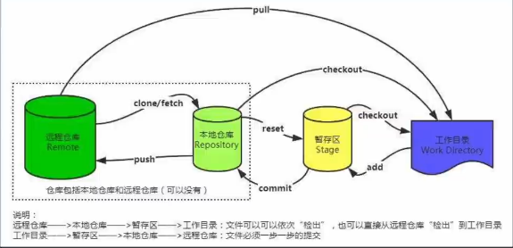
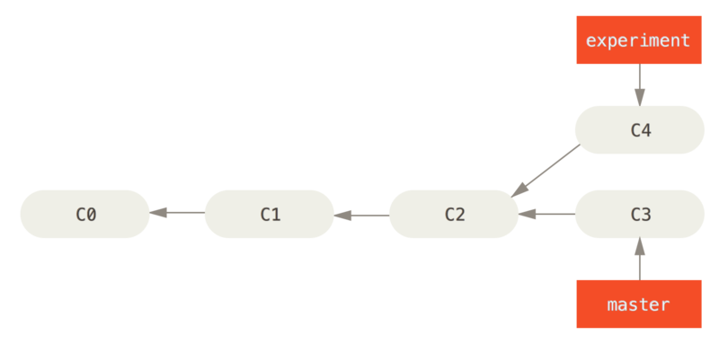

# Git

[TOC]

## 基本概念

Git 保存的不是文件的变化或者差异，而是一系列不同时刻的 **快照** 。

Git的四大部分：

- **工作目录（Work Directory）**
- **暂存区（Stage）**
- **本地仓库（Repository）**
- **远程仓库（Remote）**

你工作目录下的每一个文件都不外乎这两种状态：

- **已跟踪** ：那些被纳入了版本控制的文件。
- **未跟踪** ：未被Git跟踪的文件。

Git中主要的对象分为以下四种类型

- `Blob`
- `Tree `
- `Commit`
- `Tag`

它们具有Immutable（不可修改）特性。在构建对象时，先将对象使用`Zlib`进行压缩，再用对象的内容作为`SHA-1`算法的输入，将该算法输出40个字符长度的`SHA-1`值作为该对象的引用，在不冲突情况下，可以用至少6个字符长度的`SHA-1`作为引用。然后Git把对象存储在Git Object Database中，一般按以下规则组织存储：对象的`SHA-1`的前2位作为目录名，而后38位作为文件名。

## 基本命令

Git下载地址：https://git-scm.com/download/win

~~~Shell
git config --global user.name "Your Name"
git config --global user.email "email@example.com"
git config --global -l		 #查看全局配置
~~~

`git init`在当前目录下创建一个Git本地仓库，即隐藏的`.git`文件夹，并且当前目录作为Git的工作目录。若在创建仓库时，当前目录下有文件或者子目录，那么Git将这些标记为未跟踪的。

`git add `命令将文件更新到暂存区。如果文件处于特殊状态（未跟踪、冲突），那么相应地Git将其标记为已跟踪的或者冲突已解决的。

~~~Shell
git add
git add . 				#将工作目录下的所有文件以及文件夹添加到暂存区中
git add 1.c 2.c			#add多个文件
git add Note/ 			#add目录
~~~

`git reflog`查看命名历史，可以用来查看各个提交后Commit的`SHA`。例如

~~~shell
0de69d9 (HEAD -> master) HEAD@{0}: reset: moving to HEAD^
05ab3d8 HEAD@{1}: commit: append GPL
0de69d9 (HEAD -> master) HEAD@{2}: commit: add distributed
2092838 HEAD@{3}: commit (initial): wrote a readme file
~~~

`git commit`：

- `--amend`：重新提交一次。避免修补小错误时而使提交记录混乱

- `-m`：必须要有的，说明提交信息

- `-a`：将工作区中所有已跟踪文件提交，相当于跳过git add。

	

要删除文件时，不要简单的在工作目录中执行本地删除命令，否则暂存区中的文件得不到删除。使用`git rm`命令，Git会同时在工作区以及暂存区中删除该文件。文件移动或者重命名也是如此，要使用`git mv`命令，`git mv`指令当于运行了下面三条命令：

~~~shel
$ mv README.md README
$ git rm README.md
$ git add README
~~~

`git rm --cached`命令将文件从暂存区中删除，并且不再跟踪该文件

`git log`打印当前仓库的提交记录

-  `--graph`打印当前分支到根节点的所有提交 。`--all`与`--graph`配合使用，以图的形式打印全部提交，不仅仅打印出当前分支到根节点的所有提交。
-  `--pretty=oneline` or `--oneline`：精简输出

`git reset`可以进行撤回操作。git reset有三种工作模式，即`--soft`、`--mixed`（默认方式）与`--hard`

-  --soft：仅仅移动当前 Head 指针以及它所指向的分支的指向，不会改变工作目录和暂存区的内容。

	

- --mixed：是git reset 的默认参数，移动 HEAD 指针以及它所指向的分支的指向，改变暂存区内容，但不会改变工作目录。

	

- --hard：当前 HEAD 指针以及它所指向的分支的指向、工作目录和暂存区内容全部改变 。

	

其中 HEAD指向当前版本，`HEAD^`  `HEAD~1`上一个版本， `HEAD^^`  `HEAD~2`上上个版本，以此类推。

我们可以在工作目录下创建一个`.gitignore`文件，说明要忽略的**未跟踪**文件。

~~~
*.txt			# 匹配工作目录中（包括子文件夹中的）所有以txt结尾的文件（夹）
/*.txt			# 在工作目录中（不包括子文件夹中的）所有以txt结尾的文件（夹）
!666.txt		# 不排除666.txt文件（夹）
test/			 # 也可以直接指定一个文件夹，文件夹下的所有文件将全部忽略
xxx/*.txt		 # xxx目录中所有以txt结尾的文件，但不包括子目录
xxx/**/*.txt 	 # 目录中所有以txt结尾的文件，包括子目录

~~~

`git checkout -- <file>`用暂存区中的文件覆写工作目录中的，而`git reset HEAD <file> `是用本地仓库中的文件覆写暂存区中的。

> `git`又引入了`git restore`命令来分担`git checkout`恢复文件的职责。

## 分支

- **创建分支**

	- `git branch <name>`在本地仓库上HEAD位置上创建一个本地分支。

	- `git checkout -b <name>`创建并切换，它是以下两条命令的缩写：

		~~~shell
		$git branch iss53
		$git checkout iss53
		~~~

- **切换分支**

	- `git checkout <name>`。**切换分支时，工作目录以及暂存区都替换为当时的版本快照**。

- **查看分支**

  - `git branch`：查看本地分支
  - `git branch -a`：查看所有的本地分支以及远程分支。

- **更名分支**

  - `git branch -M <oldname> <newname>`，可省略`oldname`，就对当前分支更名。
  
- **删除分支**

  - `git branch -d <name>`：删除指定分支。`-D`强制删除。
  
- **合并分支**

  - `git merge <name>`，将当前分支与指定分支合并。如果指定分支与当前分支是直接祖先关系，那么将会执行一次快速合并，即只修改指定分支的指向。

  	
  	
  	
  	
  	
  	
  	
  	
  	~~~shell
  	git checkout master
  	git merge iss53
  	~~~
  	
  	
  	
  	
  	
  	解决 Git 的合并冲突：在手动解决完冲突后，在手动解决完冲突后需要调用 `git commit`。
  	
  	

- **变基**：将当前分支变基到指定分支上。

  它的原理是首先找到这两个分支（即当前分支 `experiment`、变基操作的目标基底分支 `master`）的最近共同祖先 `C2`，然后对比当前分支相对于该祖先的历次提交，提取相应的修改并存为临时文件，然后将当前分支指向目标基底 `C3`, 最后以此将之前另存为临时文件的修改依序应用。注意：此时`C4`提交会被删除。

  

  解决 Git 变基后的合并冲突：在手动解决完冲突后调用 `git rebase --continue`，以便 Git 继续处理变基的其余部分。

  一个例子：

  

  

  

- **优选分支**

  - `git cherry-pick <name>`：将指定分支所指向的版本复制到当前分支上。原理与`git rebase`类似

  例子：

  ~~~
           Master
  		   |
  a - b - c - d 
  	\ 
  	  e - f - g
  	  
  git checkout Master
  git cherry-pick f
  
               Master
                  |
  a - b - c - d - f'
  	\ 
  	  e - f - g
  ~~~

  出现冲突后，可使用`git cherry-pick --continue`或者`git cherry-pick --abort` 

## 远程仓库

使用命令`git clone <url> `下载服务器的远程仓库到本地中。`git clone -o <name>`更改默认仓库名。

> “本地仓库”：本地上远程仓库的副本。一个不同步到服务器上的仓库是没有任何意义的。可以建立本地分支，来引用这些仓库的某个commit。

通过`git remote add <shortname> <url>`创建一个远程仓库。注意还没有该仓库的数据，必须通过`git fetch`来下载数据。

`git remote`查看所有本地远程仓库的名称，`-v` 同时列出对应的URL以及权限。

`git remote rename <old_name> <new_name>`重命名。

`git remote remove <name>`删除本地远程仓库所有数据以及相关信息。

注意：**本地上的各个仓库之间是隔离的，都拥有自己的对象（本地分支、文件数据等）**。

通过`git checkout`切换分支来切换到对应的仓库。而且**远程分支是不可修改**的，除非使用`git fetch`以及`git pull`命令与服务器远程仓库同步。

~~~shell
git checkout master				#切换回本地分支
git checkout origin/master		 #切换回本地的远程仓库
~~~

`git fetch <shortname>`从服务器下载数据到对应的本地远程仓库。

`git pull` 其实就是 `git fetch` 和 `git merge FETCH_HEAD`的简写。

- `git pull <远程主机名> <远程分支名>:<本地分支名>` 从服务器中下载数据后直接进行合并。
- `git pull origin master`将远程分支`origin/master`与当前分支合并。

解决冲突：使用`git commit`命令。

`git push <远程仓库名> <本地分支名>`将本地分支推送到服务器上。`git push <远程仓库名> <本地分支名>:<远程分支名>`创建远程分支并同步到服务器上。

`git push origin :<远程分支名>` or `git push origin --delete <远程分支名>`都可以删除掉远程分支并同步到服务器上。

### 跟踪分支（上游分支）

如果当前分支与远程分支之间存在追踪关系，那么

~~~shell
git push origin      #当前分支推送到服务器上
git pull			#自动拉取
~~~

如何创建

- `git checkout -b <branch> <remote>/<branch>`。创建一个跟踪分支

- `git branch -u <remove>/<branch>`或者`git branch --set-upstream-to <remove>/<branch>`，令当前分支跟踪某个远程分支

- 当克隆一个仓库时，它通常会自动地创建一个跟踪 `origin/defualt` 的 `defualt` 分支

	

查看所有跟踪分支

- `git branch -vv`

## 问题汇编

### 本地仓库与远程仓库合并

情景：远程仓库已经建立，将本地代码上传至远程仓库。

~~~shell
git init
git add .
git commit -m "commit"
git remote add origin
git pull --rebase origin master        #远程仓库不为空必须做这一步
git push -u origin master
~~~

### 合并两个远程仓库

~~~shell
git clone A
git remote add B 
git checkout A/master
git merge B/master --allow-unrelated-histories	#这里--allow-unrelated-histories仅仅是提示作用
~~~

