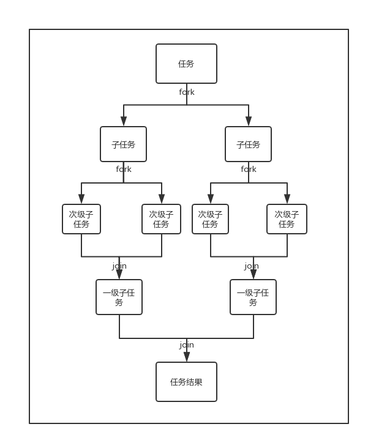

# 异步

**当 JVM 中不存在任何一个正在运行的非守护线程时，则 JVM 进程即会退出**。

**并发**同时执行多个任务，解决的是**阻塞**问题。

**并行**同时**在多处**执行多个任务，解决的是**计算密集型**问题。

从上述定义可以看出术语易混淆的原因：两者都是“同时执行多个任务”，而并行则额外包括了多处理器分布式处理的概念。这两者解决的是不同类型的问题：对于I/O密集型问题，并行可能起不到什么明显的作用，因为性能瓶颈不在于执行速度，而在于阻塞；而对于计算密集型问题，如果想用并发在单处理器上解决，则多半会徒劳无功。

很多编程语言（包括Java）使用了相同的机制——**线程**——来同时实现并发和并行。

## Future 

Future接口在Java5中被引入，设计初衷是表示将来某个时刻会产生的结果。它建模了一种异步运算。

## CompletableFuture

|                             | Future | CompletableFuture | RxJava | Reactor |
| :-------------------------- | :----- | :---------------- | :----- | ------- |
| Composable（可组合）        | ❌      | ✔️                 | ✔️      | ✔️       |
| Asynchronous（异步）        | ✔️      | ✔️                 | ✔️      | ✔️       |
| Operator fusion（操作融合） | ❌      | ❌                 | ✔️      | ✔️       |
| Lazy（延迟执行）            | ❌      | ❌                 | ✔️      | ✔️       |
| Backpressure（回压）        | ❌      | ❌                 | ✔️      | ✔️       |

> RxJava与Reactor显然更加强大，但同时也带来了更大的学习成本。

### 实例化CompletableFuture

~~~java
//supplyAsync用于有返回值的任务
public static <U> CompletableFuture<U> supplyAsync(Supplier<U> supplier);
public static <U> CompletableFuture<U> supplyAsync(Supplier<U> supplier, Executor executor);

//runAsync则用于没有返回值的任务
public static CompletableFuture<Void> runAsync(Runnable runnable);
public static CompletableFuture<Void> runAsync(Runnable runnable, Executor executor);
~~~

CompletableFuture默认使用公共线程池ForkJoinPool，而且线程池里面的线程都是守护线程

### 获取结果

~~~java
public T get() throws InterruptedException, ExecutionException			//同步阻塞获取结果
    
public T get(long timeout, TimeUnit unit) throws InterruptedException, ExecutionException, TimeoutException 									//同步阻塞获取结果，并设置一个等待时间

public T getNow(T valueIfAbsent)				//如果结果未计算完成，那么返回valueIfAbsent。它会抛出Throws:CancellationException或CompletionException
    
public T join()					//同步阻塞获取结果。与get唯一不同的是，它会抛出Throws:CancellationException或CompletionException
~~~

### 回调

~~~java
public CompletableFuture<T>     whenComplete(BiConsumer<? super T,? super Throwable> action)
public CompletableFuture<T>     whenCompleteAsync(BiConsumer<? super T,? super Throwable> action)
public CompletableFuture<T>     whenCompleteAsync(BiConsumer<? super T,? super Throwable> action, Executor executor)

    
public <U> CompletableFuture<U>     handle(BiFunction<? super T,Throwable,? extends U> fn)
public <U> CompletableFuture<U>     handleAsync(BiFunction<? super T,Throwable,? extends U> fn)
public <U> CompletableFuture<U>     handleAsync(BiFunction<? super T,Throwable,? extends U> fn, Executor executor) 
    

~~~

handle与whenComplete唯一区别就是是否有返回值。

下面给出一个使用回调链的例子

~~~java

~~~

### 组合

~~~java

public <U> CompletableFuture<U>     thenApply(Function<? super T,? extends U> fn)
public <U> CompletableFuture<U>     thenApplyAsync(Function<? super T,? extends U> fn)
public <U> CompletableFuture<U>     thenApplyAsync(Function<? super T,? extends U> fn, Executor executor)
    
    
    
public CompletableFuture<Void>  thenAccept(Consumer<? super T> action)
public CompletableFuture<Void>  thenAcceptAsync(Consumer<? super T> action)
public CompletableFuture<Void>  thenAcceptAsync(Consumer<? super T> action, Executor executor)

~~~

## 并行流

并行流就是一个把内容分成多个数据块，并用不同的线程分别处理每个数据块的流。

~~~java
Stream.generate().parallel();
~~~

每个并行流内部所使用的线程池是**同一个**`ForkJoinPool`，它默认的线程数量就是你的处理器数量，即`Runtime.getRuntime().availableProcessors();`。你可以通过系统属性`java.util.concurrent.ForkJoinPool.common. parallelism`来改变线程池大小

~~~java
System.setProperty("java.util.concurrent.ForkJoinPool.common.parallelism", "12");
~~~

注意：整个JVM中只允许设置一次ForkJoinPool.common. parallelism。此外，由于多个parallelStream之间默认使用的是同一个线程池，所以IO操作尽量不要放进parallelStream中，否则会阻塞其他parallelStream。

ForkJoinPool使用了Fork/Join框架。Fork/Join框架是一个实现了ExecutorService接口的多线程处理器，它专为那些可以通过递归分解成更细小的任务而设计**（分而治之）**。Fork/Join的运行流程大致如下所示：

此外Fork/Join框架在执行任务时使用了**工作窃取算法**

值得注意的是，当一个线程窃取另一个线程的时候，为了减少两个任务线程之间的竞争，该框架使用**双端队列**来存储任务。每个任务线程都有自己的双端队列，当任务线程想要窃取其他线程中的任务时，就会从被窃取线程的队列尾部偷取。

### 陷阱

ParallelStream一定比Stream快吗？为了回答这个问题，下面我们来看几个例子。

~~~java
LongStream.rangeClosed(0, SZ).sum()
LongStream.rangeClosed(0, SZ).parallel().sum()
LongStream.iterate(0, i -> i + 1).limit(SZ+1).sum()
    
/**
Sum Stream: 48ms
Sum Stream Parallel: 24ms
Sum Iterated: 105ms
*/
~~~

在第一个例子中，ParallelStream是符合我们的预期的，的确比Stream快。

~~~java
long[] la = new long[SZ+1];
Arrays.parallelSetAll(la, i -> i);

Arrays.stream(la).sum();
Arrays.stream(la).parallel().sum();
basicSum(la);
Arrays.parallelPrefix(la, Long::sum);

long basicSum(long[] ia) {
    long sum = 0;
    int size = ia.length;
    for(int i = 0; i < size; i++)
        sum += ia[i];
    return sum;
}

/**
Array Stream Sum: 13ms
Parallel: 22ms
Basic Sum: 9ms
parallelPrefix: 76ms
*/
~~~

但是在第二个例子中，我们将LongStream.range替换成Arrays.stream()后发现此时ParallelStream竟然比Stream的慢！这是因为ParallelStream了使用的Fork-Join框架，它的基本思想就是分而治之。由于对Arrays.stream()不合理地划分，从而导致ParallelStream性能较差

~~~java
Long[] aL = new Long[SZ + 1];
Arrays.parallelSetAll(aL, i -> (long) i);

Arrays.stream(aL).reduce(0L, Long::sum);
basicSum(aL);
Arrays.parallelPrefix(aL, Long::sum);
Arrays.stream(aL).parallel().reduce(0L,Long::sum);

/**
Long Array Stream Reduce: 75ms
Long Basic Sum: 12ms
Long parallelPrefix: 213ms
Long Parallel: 63ms
*/
~~~

紧接着我们将long[]替换称Long[]后发现，ParallelStream仍然比Stream慢，甚至比第二个例子中的ParallelStream更慢。处理器的缓存机制是导致耗时增加的主要原因之一。

下面我们来看在ParallelStream中的limit()行为。

~~~java
IntGenerator implements Supplier<Integer> {
    //...
}

List<Integer> x = Stream.generate(new IntGenerator())
    .limit(10)
    .parallel()                     
    .collect(Collectors.toList());
System.out.println(x);

/**
[0, 3, 6, 8, 11, 14, 17, 20, 23, 26]
*/
~~~

可以发现结果并不是我们预期的那样`[0, 1, 2, ...]`。如果进一步挖掘，我们发现IntGenerator的get方法竟然调用了1000多次！这还是Fork-Join框架惹的祸。

此外使用ParallelStream时，还要注意线程安全问题！

~~~java
List<Integer> array = new ArrayList<>();
IntStream.range(0, 100).parallel().forEach((item) -> array.add(item));
~~~

由于ArrayList不是线程安全的，因此上述代码会导致竞态问题。解决方案使用collect终结方法，或者使用线程安全集合。

~~~java
stream().parallel().collect(Collectors.toList());
~~~

### Spliterator

`spliterator`是java1.8引入的一种并行遍历的机制，`Iterator`提供也提供了对集合数据进行遍历的能力，但一个是顺序遍历，一个是并行遍历。
