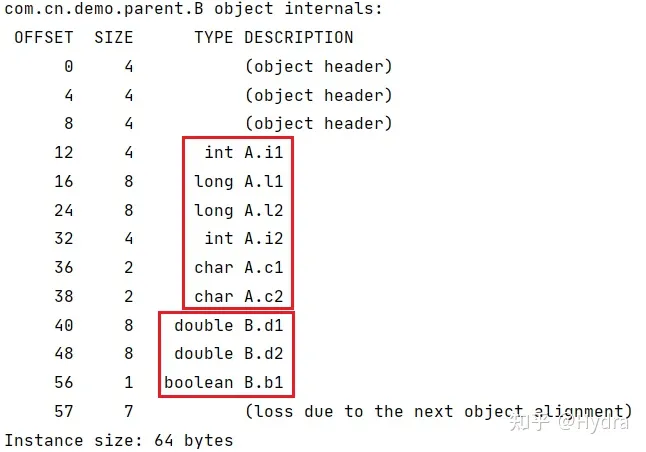

# 内存管理模块

> Java与C++之间有一堵由内存动态分配和垃圾收集技术所围成的高墙，墙外面的人想进去，墙里面的人却想出来。

[TOC]

## Java内存区域

在Java中，每个对象的所有权由虚拟机掌控。根据《Java虚拟机规范》，Java虚拟机所管理的内存将包括以下几个运行时数据区域：

### 程序计数器

程序计数器是程序控制流的计数器，字节码解释器就是通过改变这个计数器的值，来获取下一条需要执行的字节码指令。每条线程都需要有一个独立的程序计数器。如果线程正在执行的是一个Java方法，这个计数器记录的是正在执行的虚拟机字节码指令的地址；如果正在执行的是本地方法，这个计数器值则应为空（Undefined）

### 虚拟机栈

**Java虚拟机栈（Java Virtual Machine Stack）**也是线程私有的，它的生命周期与线程相同。每个方法被执行的时候，Java虚拟机都会同步创建一个**栈帧（Stack Frame）**，用于存储局部变量表等信息。其中局部变量表存放了

- Java虚拟机基本数据类型（boolean、byte、char、short、int、float、long、double）
- 对象引用（reference类型，相当于C/C++中的指针）
- returnAddress类型（保存了一条字节码指令的地址）

这些数据类型在局部变量表中的存储空间以**局部变量槽（Slot）**来表示，局部变量表所需的槽的个数在编译期间就计算完成，而变量槽的大小取决于虚拟机的具体实现。

在《Java虚拟机规范》中，对这个内存区域规定了两类异常状况：如果线程请求的栈深度大于虚拟机所允许的深度，将抛出StackOverflowError异常；如果Java虚拟机栈容量可以动态扩展，当栈扩展时无法申请到足够的内存会抛出OutOfMemoryError异常。实际上HotSpot虚拟机的栈容量是不可以动态扩展的。

### 本地方法栈

本地方法栈则是为虚拟机所使用到的本地方法服务的。它也是也是线程私有的

### 堆

Java堆是被所有线程共享的一块内存区域。在《Java虚拟机规范》中对Java堆的描述是：“所有的对象实例以及数组都应当在堆上分配。但由于对值类型的支持、栈上分配、标量代替等新兴技术的诞生，这种描述也不是这么绝对了。

> Java堆是垃圾收集器管理的内存区域，因此一些资料中它也被称作**GC堆（Garbage Collected Heap）**。对于“Java虚拟机的堆内存分为新生代、老年代、永久代、Eden、Survivor……”这样的说法，笔者认为是不准确的。因为主流的虚拟机采用分代理论来设计垃圾收集管理器，故堆才有这种划分。但是对于不采用分代设计的垃圾收集器，上面的提法就有很多需要商榷的地方了。

根据《Java虚拟机规范》的规定，Java堆可以处于物理上不连续的内存空间中，但在逻辑上它应该被视为连续的。Java堆既可以被实现成固定大小的，也可以是可扩展的，不过当前主流的Java虚拟机都是按照可扩展来实现的（通过参数-Xmx和-Xms设定）。如果在Java堆中没有内存完成实例分配，并且堆也无法再扩展时，Java虚拟机将会抛出OutOfMemoryError异常。

### 方法区

方法区（Method Area）与Java堆一样，是各个线程共享的内存区域，它用于存储已被虚拟机加载的类型信息、常量、静态变量、即时编译器编译后的代码缓存等数据。

> 《Java虚拟机规范》中把方法区描述为堆的一个逻辑部分。事实上将永久代（Permanent）于方法区混为一谈是错误的，因为仅仅是当时（JDK8之前）的HotSpot虚拟机设计团队选择把收集器的分代设计扩展至方法区，或者说使用永久代来实现方法区而已，这样使得HotSpot的垃圾收集器能够像管理Java堆一样管理这部分内存，省去专门为方法区编写内存管理代码的工作。但是对于其他虚拟机实现，譬如BEA JRockit、IBM J9等来说，是不存在永久代的概念的。原则上如何实现方法区属于虚拟机实现细节，不受《Java虚拟机规范》管束。但是这种用永久代来实现方法区的设计，导致了Java应用更容易遇到内存溢出的问题（永久代有-XX：MaxPermSize的上限，即使不设置也有默认大小）。在JDK8之后，HotShot在本地内存中实现的**元空间（Metaspace）**，来实现方法区。

相对而言，垃圾收集行为在这个区域的确是比较少出现的，回收效果比较难令人满意，但是又是有必要的。这区域的内存回收目标主要是针对常量池的回收和对类型的卸载。

**运行时常量池（Runtime Constant Pool）**是方法区的一部分，用于存放编译期生成的各种字面量与符号引用，以及在运行时产生的常量（例如，String的intern()方法）。当常量池无法再申请到内存时会抛出OutOfMemoryError异常。

自JDK 7起，原本存放在方法区常量池中的字符串常量被移至Java堆之中。下面看一个关机字符串常量的例子：

~~~java
String str1 = new StringBuffer("计算机").append("软件").toString();
System.out.println("str1 : " + (str1.intern() == str1));	
String str2 = new StringBuffer("ja").append("va").toString();
System.out.println("str2 : " + (str2.intern() == str2));
/**
str1 : true
str2 : false
*/
~~~

由于字符串常量的存储就在Java堆中，所以intern只需在字符串常量池中记录（引用）这个常量即可。并返回这个常量的引用。“计算机”是第一次加载的所以返回true，而“java”是在加载sun.misc.Version这个类的时候记录在常量池的，所以才会返回false。

### 直接内存

直接内存（Direct Memory）并不是虚拟机运行时数据区的一部分，也不是《Java虚拟机规范》中定义的内存区域

在JDK 1.4中新加入了NIO（New Input/Output）类，引入了一种基于通道（Channel）与缓冲区（Buffer）的I/O方式，它可以使用Native函数库直接分配堆外内存，然后通过一个存储在Java堆里面的DirectByteBuffer对象作为这块内存的引用进行操作。这样能在一些场景中显著提高性能，因为避免了在Java堆和Native堆中来回复制数据。

## HotSpot虚拟机对象揭秘

### 对象的创建

在语言层面上，通过new关键字就可以创建出一个对象。而在虚拟机中，对象的创建又是一个怎么样的过程呢？本节暂不考虑数组和Class对象等对象的创建。

在解释器执行到new指令时，会检查指令操作数是否能在常量池中定位到一个符号引用，并且检查这个符号引用代表的类是否已被加载、解析和初始化过。如果没有，那必须先执行相应的类加载过程。在类加载检查通过后，接下来虚拟机将为新生对象在堆中分配内存，有两种分配方式：

- **“指针碰撞”（Bump The Pointer）**，类似操作系统中的sbrk()函数
- **“空闲列表”（Free List）**

选择哪种分配方式由Java堆是否规整决定，而Java堆是否规整又由所采用的垃圾收集器是否带有空间压缩整理（Compact）的能力决定。

此外还需要考虑线程安全的问题。拿指针碰撞来说，有两种可选的解决方案：

- 指针由一个锁保护着
- 每个线程在Java堆中预先分配一小块内存，称为**本地线程分配缓冲（Thread Local Allocation Buffer，TLAB）**。只有本地缓冲区用完了，才尝试获取锁并修改指针。虚拟机可以通过`-XX：+/-UseTLAB`参数来设定是否使用TLAB，

内存分配完成之后，虚拟机必须将分配到的内存空间（但不包括对象头）都初始化为零值。这步操作保证了对象的实例字段在Java代码中可以不赋初始值就直接使用，使程序能访问到这些字段的数据类型所对应的零值。然后Java虚拟机还要设置对象的对象头，它保存了一些元信息，例如GC分代年龄、所属的类等。最后再执行对象的构造函数，即Class文件中的`<init>`()方法

### 对象的内存布局

对象在堆内存中的存储布局可以划分为三个部分：**对象头（Header）**、**实例数据（Instance Data）**和**对齐填充（Padding）**。

#### 对象头

HotSpot虚拟机对象的对象头部分包括两类信息：

- **Mark Word**：用于存储对象自身的运行时元数据，如哈希码（HashCode）、GC分代年龄、锁状态标志、线程持有的锁、偏向线程ID、偏向时间戳等。在64位HotShot虚拟机中，用64个bit存储这些信息。实际上Mark Word被设计成一个有着动态定义的数据结构。它会根据对象的状态（锁标志位），复用自己的存储空间来存储不同信息：

  

  

- **类型指针**：即对象指向它的类型元数据的指针。Java虚拟机通过这个指针来确定该对象是哪个类的实例。并不是所有的虚拟机实现都必须在对象数据上保留类型指针，换句话说，查找对象的元数据信息并不一定要经过对象本身，这点我们会在下一节具体讨论

#### 实例数据

实例数据就是Java对象中的字段部分。如果有继承关系存在，子类还会包含从父类继承过来的字段。

jvm会采用**字段重排序**技术，对字段进行重新排序，以达到内存对齐的目的。具体规则遵循如下：

- 按照longs/doubles、ints、shorts/chars、bytes/booleans、oops（Ordinary Object Pointers，OOPs）顺序（这是默认策略，可以通过虚拟机分配策略参数（`-XX：FieldsAllocationStyle`参数）。），以及字段在Java源码中定义顺序来进行排序。
- 如果一个字段的长度是L个字节，那么这个字段的偏移量（`OFFSET`）需要对齐至`nL`（n为整数）
- 在满足这个前提条件的情况下，在父类中定义的变量会出现在子类之前。

~~~java
public class A {
    int i1,i2;
    long l1,l2;
    char c1,c2;
}
public class B extends A{
    boolean b1;
    double d1,d2;
}
~~~

#### 对齐填充

对齐填充就是满足对象的起始地址必须是8字节整数倍的要求而设计的。

### 对象的定位

Java程序会通过栈上的reference类型数据来操作堆上的具体对象。《Java虚拟机规范》并没有定义如何通过这个引用来访问对象。主流的访问方式有两种：**句柄**、**直接指针**。

如果使用句柄访问的话，Java堆中将可能会划分出一块内存来作为句柄池，reference中存储的就是对象的句柄地址，而句柄中包含了对象实例数据与类型数据各自具体的地址信息，结构如图：

·如果使用直接指针访问的话，reference中存储的直接就是对象地址。

句柄访问的优势就是在对象被移动只会改变句柄中的实例数据指针，而reference本身不需要被修改。使用直接指针来访问最大的好处就是速度更快，它节省了一次指针定位的时间开销。HotSpot主要使用直接指针的方式来进行对象访问。

## 垃圾收集（Garbage Collection）

### 概述

> 在1960年诞生于麻省理工学院的Lisp是第一门开始使用内存动态分配和垃圾收集技术的语言

为什么我们要了解垃圾回收呢：当需要排查各种内存溢出、内存泄漏问题时，当垃圾收集成为系统达到更高并发量的瓶颈时，我们就必须对这些“自动化”的技术实施必要的监控和调节。

垃圾收集器只回收对象的内存资源。而一般由try-finally来负责回收其他类型的资源（文件句柄、网络资源、本地内存等），

栈帧随着函数执行而创建，随着函数的返回而销毁。而且为每一个栈帧分配多少内存，基本上在编译期时就能计算出来。这部分的内存分配和回收具备确定性，因此无需考虑这一部分垃圾回收。而堆与方法区具有明显的不确定性，我们讨论的重点也在此上面。

下面我们要回答以下三个问题：

- 哪些内存要回收
- 什么时候回收
- 如何回收

### 引用计数法

在对象中添加一个引用计数器，每当有一个地方引用它时，计数器值就加一；当引用失效时，计数器值就减一。但是HotSpot没有采用引用计数算法来管理内存。因为它有很多例外情况要考虑（例如，对象之间相互循环引用），要配合大量额外处理才能确保其正确工作。

### 可达性分析

这个算法的基本思路就是通过称为“GC Roots”的根对象作为起始节点集，从这些节点开始，根据引用关系向下搜索，搜索过程所走过的路径称为“引用链”（Reference Chain），如果某个对象到GC Roots间没有任何引用链相连，则此对象是不可能再被使用的。

在Java技术体系里面，固定可作为GC Roots对象包括但不限于：

- 栈中的reference类型数据
- 静态字段
- 常量池中的引用
- 持有同步锁的对象
- JNI handles

除了这些固定的GC Roots集合以外，根据用户所选用的垃圾收集器以及当前回收的内存区域不同，还可以有其他对象“临时性”地加入，共同构成完整GC Roots集合。

### 引用

在Java中，引用分为以下四种：

- **强引用（Strongly Re-ference）**：无论任何情况下，只要强引用关系还存在，垃圾收集器就永远不会回收掉被引用的对象。
- **软引用（Soft Reference）**：描述一些还有用，但非必须的对象。在系统将要发生内存溢出异常前，会把这些对象考虑仅回收范围内
- **弱引用（Weak Reference）**：被弱引用关联的对象只能生存到下一次垃圾收集发生为止
- **虚引用（Phantom Reference）**：一个对象是否有虚引用的存在，完全不会对其生存时间构成影响。为一个对象设置虚引用关联的唯一目的只是为了能在这个对象被收集器回收时收到一个系统通知。

### finalize

如果类没有覆写finalize()或者虚拟机之前没有调用过一次finalize，那么直接回收。否则将对象将会被放置在一个名为F-Queue的队列之中。而有一个有虚拟机创建的、调度优先级的Finalizer线程负责去执行它们的finalize()方法。

注意：程序员手动调用finalize()方法并不会视为虚拟机调用的

它并不是C++里的析构函数。因为

- JVM会延迟执行终结方法，执行时间点是非常不稳定的。
- 还不保证一定会执行finalizer方法。例如当程序终止时，有可能一些对象的finalizer方法还没有执行。
- 如果未捕获的异常在finalizer方法中抛出来，这个异常可以被忽略（警告都不会打印出来），且finalizer方法会终止。

如果在finalize中重新将一个引用指向被回收对象，那么该对象就不会被回收

~~~java
public class FinalizeEscapeGC {
    public static FinalizeEscapeGC SAVE_HOOK = null;
    public void isAlive() {
        System.out.println("yes, i am still alive :)");
    }
    
    @Override
    protected void finalize() throws Throwable {
        System.out.println("finalize method executed!");
        super.finalize();
		//故意让finalize执行时间长一点。
        for (int i = 0; i < Integer.MAX_VALUE; i++) 
            for (int j = 0; j < 100; j++) 
            	;
        
        FinalizeEscapeGC.SAVE_HOOK = this;
        System.out.println("finalize method finished!");
    }

    public static void main(String[] args) throws Throwable{
        SAVE_HOOK = new FinalizeEscapeGC();
        SAVE_HOOK = null;
        System.gc();				//进行第一次标记
        Thread.sleep(500);
        if (SAVE_HOOK != null) {
            SAVE_HOOK.isAlive();
        } else {
            System.out.println("no, i am dead :(");
        }

        SAVE_HOOK = null;
        System.out.println("开始第二次回收");
        System.gc();                //这里GC会被finalize方法阻塞。
        Thread.sleep(500);
        if (SAVE_HOOK != null) {
            SAVE_HOOK.isAlive();
        } else {
            System.out.println("no, i am dead :( 2");
        }
    }
}

/**
finalize method executed!
no, i am dead :( 1
开始第二次回收
finalize method finished!
yes, i am still alive :)
*/
~~~

### 回收方法区

《Java虚拟机规范》中提到过可以不要求虚拟机在方法区中实现垃圾收集。因为相对于堆，方法区垃圾收集的“性价比”通常也是比较低的。在大量使用反射、动态代理、CGLib等字节码框架，动态生成JSP以及OSGi这类频繁自定义类加载器的场景中，通常都需要Java虚拟机具备类型回收的能力，以保证不会对方法区造成过大的内存压力。

方法区的垃圾收集主要回收两部分内容：废弃的常量和不再使用的类类型。

HotSpot虚拟机对常量池的回收策略是很简明的,只要常量池中的常量没有被任何地方引用（推测使用了引用计数技术），就可以被回收。

而对类类型的回收策略是比较苛刻的：

- 该类所有的实例都已经被回收，也就是Java堆中不存在该类及其任何派生子类的实例

- 加载该类的类加载器已经被回收

- 该类对应的java.lang.Class对象没有在任何地方被引用，无法在任何地方通过反射访问该类的方法。

满足上述三个条件的无用类**允许**被回收，是否回收还不一定。关于是否要对类型进行回收，HotSpot虚拟机提供了-Xnoclassgc参数进行控制，还可以使用-verbose：class以及-XX：+TraceClass-Loading、-XX：+TraceClassUnLoading查看类加载和卸载信息

## 垃圾回收算法

### 概述

从如何判定对象消亡的角度出发，垃圾收集算法可以划分为**“引用计数式垃圾收集”（ReferenceCounting GC）**和**“追踪式垃圾收集”（Tracing GC）**两大类。这里我们只研究Tracing GC。

当前商业虚拟机的垃圾收集器，大多数都遵循了**分代收集（Generational Collection）**的理论，它建立在两个分代假说之上（经验准则）：

- **弱分代假说（Weak Generational Hypothesis）**：绝大多数对象都是朝生夕灭的。
- **强分代假说（Strong Generational Hypothesis）**：熬过越多次垃圾收集过程的对象就越难以消亡。

根据分代收集理论，收集器应该将Java堆划分出不同的区域，然后将回收对象根据其年龄（即对象经过垃圾收集过程的次数）分配到不同的区域之中存储。而每一个区域采用不同的、与对象特征相匹配的垃圾收集算法。

设计者一般至少会把Java堆划分为**新生代（Young Generation）**和**老年代（Old Generation）**两个区域。分代收集并非只是简单划分一下内存区域那么容易，它至少存在一个明显的困难：对象不是孤立的，对象之间会存在跨代引用。假设现在要对新生代进行收集，但是某些新生代被老年代对象所持有，因此还需要额外地遍历整个老年代对象来确保可达性分析结果的正确性。而这种遍历会带来很大的性能负担。

其中从上述两条假说中我们可以推出**跨代引用假说（Intergenerational Reference Hypothesis）**：跨代引用相对于同代引用来说仅占极少数。因为如果某个新生代对象存在跨代引用，由于老年代对象难以消亡，所以该引用会使得新生代对象在收集时同样得以存活。进而在年龄增长之后晋升到老年代中，这时跨代引用也随即被消除了。

依据这条假说，我们可以维护一个名为**记忆集（Remembered Set）**的数据结构，它把老年代划分成若干小块，标识出老年代的哪一块内存会存在跨代引用。此后当发生Minor GC时，只有包含了跨代引用的小块内存里的对象才会被加入到GCRoots进行扫描。虽然这种方法需要在对象改变引用关系时维护记录数据的正确性，会增加一些运行时的开销，但比起收集时扫描整个老年代来说仍然是划算的。

- **部分收集（Partial GC）**：不是完整收集整个Java堆
  - **新生代收集（Minor GC/Young GC）**：新生代的垃圾收集
  - **老年代收集（Major GC/Old GC）**：老年代的垃圾收集
  - **混合收集（Mixed GC）**：整个新生代以及部分老年代的垃圾收集
- **整堆收集（Full GC）**：收集整个Java堆和方法区

### 标记清除算法

该算法分为“标记”和“清除”两个阶段：

- 标记：标记存活对象（可达性分析或引用计数）
- 清除：回收未标记对象

它的主要缺点：

- 对象数量越多，标记过程越慢。回收对象越多，清理过程越慢。
- 内存空间的碎片化

称为“半区复制”（Semispace Copying）的垃圾收集算法，它将可用

### 标记复制算法

为了解决标记-清除算法**面对大量可回收对象时执行效率低**的问题，1969年Fenichel提出了一种称为“半区复制”（Semispace Copying）的垃圾收集算法。其基本思想：将内存按容量划分为大小相等的两块，每次只使用其中的一块。当这一块的内存用完了，就将还存活着的对象复制到另外一块上面，然后再把这一块已使用过的内存空间一次清理掉。但是该算法面对少量可回收对象的场景（大部分对象存活）时，执行效率低下，因此标记复制算法一般用在新生代的回收中。此外可用内存缩减到一半，空间利用率低。

IBM公司曾有一项专门研究对新生代“朝生夕灭”的特点做了更量化的诠释——新生代中的对象有98%熬不过第一轮收集。因此并不需要按照1∶1的比例来划分新生代的内存空间。在1989年，Andrew Appel针对具备“朝生夕灭”特点的对象，提出了一种更优化的半区复制分代策略，现在称为**Appel式回收**。HotSpot虚拟机的Serial、ParNew等新生代收集器均采用了这种策略来设计新生代的内存布局。Appel式回收的具体做法是把新生代分为一块较大的Eden空间和两块较小的Survivor空间，每次分配内存只使用Eden和其中一块Survivor。发生垃圾搜集时，将Eden和Survivor中仍然存活的对象一次性复制到另外一块Survivor空间上，然后直接清理掉Eden和已用过的那块Survivor空间。HotSpot虚拟机默认Eden和Survivor的大小比例是8∶1，也就是说每次新生代中可用内存空间为整个新生代容量的90%。

每次GC流程:

1. Eden区和其中一个Survivor区 (From) 进行回收
2. 将还存活的对象复制到另一个Survivor区 (To)
3. 交换From和To的角色（这也是两块Survivor区的意义，实现高效回收）

当然，没有任何人可以保证每次回收都只有不多于10%的对象存活。对此，Appel式回收还有一个“逃生门”的安全设计，当Survivor空间不足以容纳一次Minor GC之后存活的对象时，就需要依赖其他内存区域（实际上大多就是老年代）进行**分配担保（Handle Promotion）**。

### 标记整理算法

标记-复制算法在对象存活率较高时就要进行较多的复制操作，效率将会降低。针对老年代对象的存亡特征，1974年Edward Lueders提出了另外一种有针对性的**“标记-整理”（Mark-Compact）**算法。它的基本原理是:

1. 标记阶段:扫描堆内存,标记正在使用的对象。
2. 整理阶段:把所有存活的对象向一端移动,然后直接清理掉端边界以外的内存。

注意：对象在内存中的复制操作必须要暂停用户线程的执行（Stop the World），延迟高；而标记清除算法不涉及复制操作，因此无需暂停用户线程，延迟低。但是标记清除算法需要复杂的内存分配器来缓解内存碎片的问题，而内存的访问是用户程序最频繁的操作，清除算法在这一环节增加了负担，这势必会影响程序的吞吐量。

HotSpot虚拟机里面关注吞吐量的ParallelScavenge收集器是基于标记-整理算法的，而关注延迟的CMS收集器则是基于标记-清除算法的。其实还可以将整理与清除两种算法结合起来：让虚拟机平时多数时间都采用标记-清除算法，暂时容忍内存碎片的存在，直到内存空间的碎片化程度已经大到影响对象分配时，再采用标记-整理算法收集一次，以获得规整的内存空间。

### HotSpot实现

## 垃圾收集器

