# From Zero to One

[TOC]

## Abstract

本书的主线就是**如何管理复杂度（how to manage complexity）**。管理复杂度的三板斧：abstaction、discipline、three "-y's"。其中关键技术就是**抽象（abstraction）**——隐藏不必要的细节。下面就给出一个在计算机系统中抽象的例子

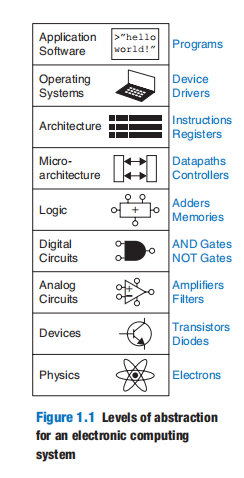

- 物理层： the motion of electrons. The behavior of electrons is described by quantum mechanics and Maxwell’s equations.
- 器件层：such as transistors or vacuum tubes. 
- 模拟电路：devices are assembled to create components such as amplifiers. Analog circuits input and output a continuous range of voltages
- 数字电路：such as logic gates, restrict the voltages to discrete ranges
- 体系结构层：describes a computer from the programmer’s perspective. Microarchitecture involves combining logic elements to execute the instructions defined by the architecture. A particular architecture can be implemented by one of many different microarchitectures with different price/performance/power trade-offs. For example, the Intel Core i7, the Intel 80486, and the AMD Athlon all implement the x86 architecture with different microarchitectures.
- 操作系统：handles low-level details, such as accessing a hard drive or managing memory

**Discipline** is the act of intentionally restricting your design choices so that you can work more productively at a higher level of abstraction.（可以通俗地理解为总结的经验技巧） Using interchangeable parts is a familiar application of discipline. 

 three “-y’s”  means：

- **Hierarchy** involves dividing a system into modules, then further subdividing each of these modules until the pieces are easy to understand.
- **Modularity** states that modules have well-defined functions and interfaces so that they connect easily without unanticipated side effects.
- **Regularity** seeks uniformity among modules. Common modules are reused many times, reducing the number of distinct modules that must be designed. 

Modularity teaches that each component should have a well-defined function and interface. Regularity teaches that interchangeable parts are a good idea

## Number System

在具有N个状态的离散变量中，其所携带的信息量D以bit为单位进行测量。N与D的关系如下：
$$
D = log_2Nbits
$$

> 理论上，连续信号可以携带任意大的信息量，毕竟其状态的取值为连续的，即有无限多个状态。但是在实际中，由于受到噪音以及测量错误的影响，连续信号只能携带10 - 16bits的信息量。

The beauty of the **digital abstraction** is that digital designers can focus on 1’s and 0’s, ignoring whether the Boolean variables are physically represented with specific voltages, rotating gears, or even hydraulic fluid（液压机） levels。（与物理实现无关）

**离散信号的本质就是对连续物理量做了抽象**

A group of eight bits is called a **byte**. It represents one of $2^8 = 256$ possibilities. 

Microprocessors handle data in chunks called **words**. The size of a word depends on the architecture of the microprocessor. 

within a word, the bytes are identified as **least significant byte(LSB)** through **most significant byte (MSB)**

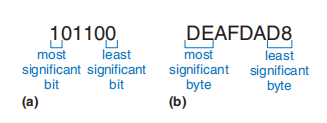

1024 bytes is called a **kilobyte (KB)** or **kibibyte (KiB).** 1024 bits is called a **kilobit (Kb or Kbit)** or **kibibit (Kib or Kibit)**。 Similarly, **MB/MiB**, **Mb/Mib**, **GB/GiB**, and **Gb/Gib**. Memory capacity is usually measured in bytes. Communication speed is usually measured **in powers of ten bits/second**（$1000B = 1KB$）. and storage capacity is measured **in powers of ten Byte**（$1000B = 1KB$）

**unsigned binary numbers** that represent positive quantities. Several schemes exist to represent **signed binary numbers**. The two most widely employed are called **sign/magnitude** and **two’s complement**.

**sign/magnitude**：

- the main idea of sign/magnitude number is that A sign bit of 0 indicates positive and a sign bit of 1 indicates negative. for example 4-bit  sign/magnitude numbers：$5_{10} = 0101_2$，$-5_{10} = 1101_2$.

-  An *N*-bit sign/magnitude number spans the range$ [−2^{N−1} + 1, 2^{N−1} − 1]$​. 

- Sign/magnitude numbers are slightly odd in that both +0 and −0 exist. 

- Unfortunately, ordinary binary addition does not work for sign/magnitude numbers

**two’s complement**：

- the main idea of two’s complement number is that the most significant bit position has a weight of $−2^{N−1}$instead of $ 2^{N−1}$ . 

- They overcome the shortcomings of sign/magnitude numbers: zero has a single representation, and ordinary addition works.

- $01...111_2 = 2^{N-1} -1$，$10...000 = -2^{N-1}$. In general, the range of an *N*-bit two’s complement number spans$ [−2^{N−1} , 2^{N−1} − 1]$。注意到补码的最大负数$10...0000=-2^{N-1}$是没有对应的正数，它的补码相反数仍是它自己。

- 计算补码相反数的步骤：

  -  inverting the bits in the number
  - adding 1 to the least significant bit position

  例子：$5 = 0101_2$ -> $1010_2$ -> $1011_2 = -5$；    $-17 = 101111_2$ -> $010000_2$ -> $010001_2 = 17$

- 补码的减法$a - b$ $(a > 0, b>0)$：先计算$b$的相反数$-b$，然后$a$、$b$直接相加即可。

- 符号位的扩展：When a two’s complement number is extended to more bits, the sign bit must be copied into the most significant bit positions

## Logic Gates

### NOT

$Y = A'$、$Y = \neg A$、$Y = !A$

### BUF

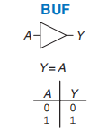

从逻辑电路视角来说，这个buffer是无用的。但是从模拟电路的角度来说，它可以向电机传输大量的电流，以及快速地将输出$Y$送到其他逻辑门上。

> This is an example of why we need to consider multiple levels of abstraction to fully understand a system; the digital abstraction hides the real purpose of a buffer

### AND

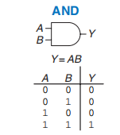

$Y = AB$、$Y = A \cap B$

### OR

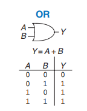

$Y = A + B$、$Y = A \cup B$

### Other Two-Input Gates

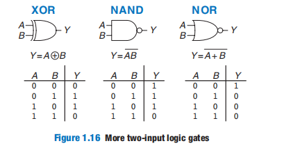

## Logic levels

Suppose the lowest voltage in the system is 0V, also called **ground** or **GND**. 

The highest voltage in the system comes from the power supply and is usually called $V_{DD}$

> In 1970’s and 1980’s technology, $V_{DD}$ was generally 5V. As chips have progressed to smaller transistors, $V_{DD}$ has dropped to 3.3V, 2.5V, 1.8V, 1.5V, 1.2V, or even lower to save power and avoid overloading the transistors.

The mapping of a continuous variable onto a discrete binary variable is done by  **defining logic levels**。（就是将某个连续取值区间视为一个离散量，这反映出了离散量就是物理连续量的一种抽象）

The driver produces a LOW (0) output in the range of 0 to *$V_{OL}$* or a HIGH (1) output in the range of *$V_{OH}$* to $V_{DD}$. If the receiver gets an input in the range of 0 to$ V_{IL}$, it will consider the input to be LOW. If the receiver gets an input in the range of $V_{IH}$ to $V_{DD}$, it will consider the input to be HIGH. If, for some reason such as noise or faulty components, the receiver’s input should fall in the *forbidden zone* between $V_{IL}$ and $V_{IH}$, the behavior of the gate is unpredictable. 

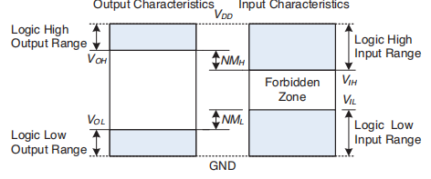

 The **noise margin(NM) **is the amount of noise that could be added to a worst-case output 
$$
NM_L = V_{IL} - V_{OL} \\
NM_H = V_{OH} - V_{IH}
$$

The **DC(Direct Current) transfer characteristics of a gate** describe the output voltage as a function of the input voltage when the input is **changed slowly** enough that the output can keep up.

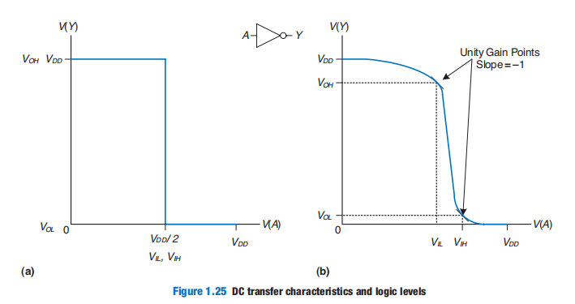

A reasonable place to choose the logic levels is where the slope of the transfer characteristic $\frac{dV(Y)}{dV(A)}$ is −1. These two points are called the **unity gain points**，Choosing logic levels at the unity gain points usually maximizes the noise margins.

To avoid inputs falling into the forbidden zone, digital logic gates are designed to conform to the **static discipline**. The static discipline requires that, given logically valid inputs, every circuit element will produce logically valid outputs.By conforming to the static discipline, digital designers sacrifice the freedom of using arbitrary analog circuit elements in return for the simplicity and robustness of digital circuits.

The choice of $V_{DD}$ and logic levels is arbitrary, but all gates that communicate must have compatible logic levels. Therefore, gates are grouped into **logic families**

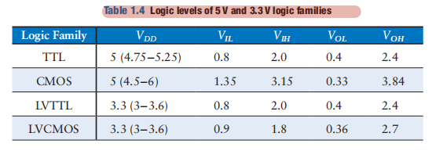

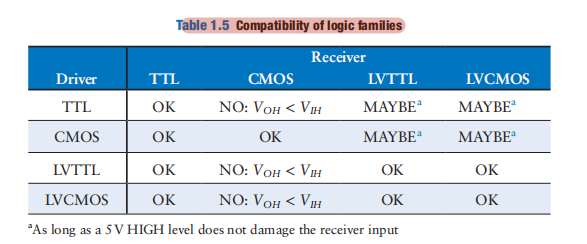

## CMOS Transistors

### Semiconductor & Diodes

 The two main types of transistors are **bipolar junction transistors**（双极结晶体管） and **metal-oxide-semiconductor field effect transistors **（金属氧化物半导体场效应晶体管）

MOS transistors are built from **silicon**,  Silicon (Si) is a group IV atom, so it has four electrons in its valence shell and forms bonds with four adjacent atoms, resulting in a **crystalline lattice（晶格）**.

 By itself, silicon is a poor conductor because all the electrons are tied up in covalent bonds. However, it becomes a better conductor when small amounts of impurities, called **dopant atoms（掺杂原子）**, are carefully added

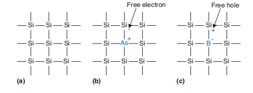

>  Figure  shows the lattice in two dimensions for ease of drawing, but remember that the lattice actually forms a cubic crystal. 

If a group V dopant such as arsenic (As) is added, the dopant atoms have an extra electron that is not involved in the bonds. That electron can easily move about the lattice, leaving an ionized dopant atom (As+) behind, as shown in Figure 1.26(b). The electron carries a negative charge, so we call arsenic an **n-type** dopant. 

On the other hand, if a group III dopant such as boron (B) is added, the dopant atoms are missing an electron, as shown in Figure 1.26(c). This missing electron is called a *hole*. An electron from a neighboring silicon atom may move over to fill the missing bond, forming an ionized dopant atom (B−) and leaving a hole at the neighboring silicon atom. In a similar fashion, the hole can migrate around the lattice. The hole is a lack of negative charge, so it acts like a positively charged particle. Hence, we call boron a **p-type** dopant. 

Because the conductivity of silicon changes over many orders of magnitude depending on the concentration of dopants, silicon is called a **semiconductor**.

The junction between p-type and n-type silicon is called a **diode**（二极管）. The p-type region is called the **anode** and the n-type region is called the **cathode**, as illustrated in Figure 1.27. When the voltage on the anode rises above the voltage on the cathode, the diode is **forward biased**（正向偏置）, and current flows through the diode from the anode to the cathode. But when the anode voltage is lower than the voltage on the cathode, the diode is **reverse biased**（反向偏置）, and no current flows. The diode symbol intuitively shows that current only flows in one direction.

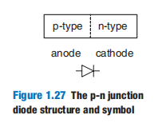

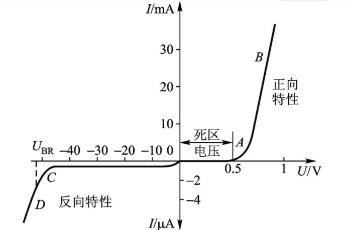

> 正向特性的起始部分，正向电压很小，外电场不足以客服内电场对多数载流子的阻碍作用，正向电流几乎为零。当反向电压继续增大到某一数值时，二极管的反向电流会突然增大，我们称此时二极管发生了反向击穿

### Capacitance

A **capacitor** consists of two conductors separated by an insulator.When a voltage *V* is applied to one of the conductors, the conductor accumulates electric *charge Q* and the other conductor accumulates the opposite charge −*Q*. The *capacitance C* of the capacitor is the ratio of charge to voltage: *C* = *Q/V*. In fact, The capacitance is proportional to the size of the conductors and inversely proportional to the distance between them
$$
C = \frac{\epsilon S}{4 \pi kd}
$$
Capacitance is important because charging or discharging a conductor takes time and energy. More capacitance means that a circuit will be slower and require more energy to operate.

### nMOS and pMOS Transistors

> 如何制造nMOS晶体管是属于EE范畴的，CS专业无需考虑。有兴趣请自行了解

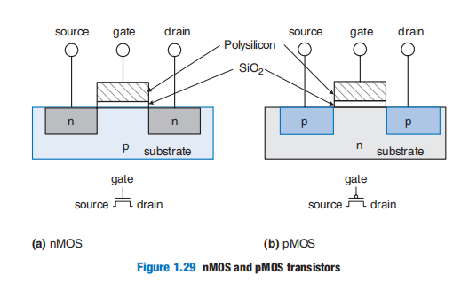

There are two flavors of **MOSFET**s: **nMOS** and **pMOS**。

> source：源极 	drain：漏极	gate：栅极

 Let us start by exploring the operation of an nMOS transistor

The substrate of an nMOS transistor is normally tied to GND. First, consider the situation when the gate is also at 0V, as shown in Figure 1.30(a).The diodes between the source or drain and the substrate are reverse biased because the source or drain voltage is nonnegative（注：通常源极与漏极只有一极处于高电压，而另一极为GND）. Hence, there is no path for current to flow between the source and drain, so the transistor is OFF

Now, consider when the gate is raised to $V_{DD}$, as shown in Figure 1.30(b). When a positive voltage is applied to the top plate of a capacitor, it establishes an electric field that attracts positive charge on the top plate and negative charge to the bottom plate. If the voltage is sufficiently large, so much negative charge is attracted to the underside of the gate that the region *inverts* from p-type to effectively become n-type. This inverted region is called the **channel**.Now the transistor has a continuous path from the n-type source through the n-type channel to the n-type drain, so electrons can flow froms ource to drain. The transistor is ON.

 The gate voltage required to turn on a transistor is called the *threshold voltage*, $V_t$, and is typically 0.3 to 0.7V

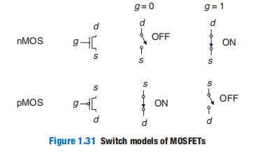

pMOS transistors work in just the opposite fashion, as might be guessed from the bubble on their symbol shown in Figure 1.31. The substrate is tied to $V_{DD}$. When the gate is also at $V_{DD}$, the pMOS transistor is OFF. When the gate is at GND, the channel inverts to p-type and the pMOS transistor is ON.

Unfortunately, MOSFETs are not perfect switches. In particular, nMOS transistors pass 0’s well but pass 1’s poorly. Specifically, when the gate of an nMOS transistor is at $V_{DD}$, the source（输出端） will only swing between 0 and *$V_{DD}$* − $V_{t}$ when its drain（输入端） ranges from 0 to$V_{DD}$. Similarly, pMOS transistors pass 1’s well but 0’s poorly

下面我们看如何用MOSFET构建NOT：

构建Two-input NAND：

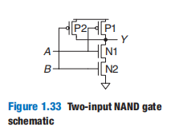

构建Two-input NOR：

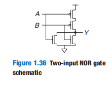

Figure 1.34 shows the general form used to construct any inverting logic gate, such as NOT, NAND, or NOR. nMOS transistors are good at passing 0’s, so a pull-down network of nMOS transistors is placed between the output and GND to pull the output down to 0. pMOS transistors are good at passing 1’s, so a pull-up network of pMOS transistors is placed between the output and $V_{DD}$ to pull the output up to 1

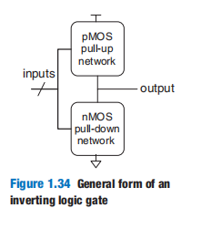

If both the pull-up and pull-down networks were ON simultaneously, a **short circuit** would exist between $V_{DD}$ and GND. The output of the gate might be in the forbidden zone and the transistors would consume large amounts of power, possibly enough to burn out. 

On the other hand, if both the pull-up and pull-down networks were OFF simultaneously, the output would be connected to neither $V_{DD}$ nor GND. We say that the output **floats**. Its value is again undefined. 

In a properly functioning logic gate, one of the networks should be ON and the other OFF at any given time, so that the output is pulled HIGH or LOW but not shorted or floating. We can guarantee this by using the rule of **conduction complements**. When nMOS transistors are in series, the pMOS transistors must be in parallel. When nMOS transisors are in parallel, the pMOS transistors must be in series.

At times, designers find it convenient to use an ideal switch that can pass both 0 and 1 well. Figure 1.38 shows such a circuit, called a **transmission gate** or **pass gate**.When $EN = 1$ and $\overline{EN} = 0$, the transmission gate is ON or enabled, and any logic value can flow between *A* and *B*.

 *N*-input CMOS NOR gate uses *N* nMOS transistors in parallel and *N* pMOS transistors in series. Transistors in series are slower than transistors in parallel, just as resistors in series have more resistance than resistors in parallel. Moreover, pMOS transistors are slower than nMOS transistors because holes cannot move around the silicon lattice as fast as electrons. Therefore, the parallel nMOS transistors are fast and the series pMOS transistors are slow.

Pseudo-nMOS logic replaces the slow stack of pMOS transistors with a single weak pMOS transistor that is always ON, as shown in Figure 1.39. This pMOS transistor is often called a **weak pull-up**. The physical dimensions of the pMOS transistor are selected so that the pMOS transistor will pull the output *Y* HIGH weakly（翻译：选择pMOS晶体管的物理尺寸，使pMOS晶体管将微弱地拉动输出Y）—that is, only if none of the nMOS transistors are ON. But if any nMOS transistor is ON, it overpowers the weak pull-up and pulls *Y* down close enough to GND to produce a logic 0.

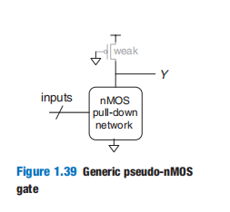

The advantage of pseudo-nMOS logic is that it can be used to build fast NOR gates with many inputs. The disadvantage is that a short circuit exists between $V_{DD}$​ and GND when the output is LOW. The short circuit draws continuous power, so pseudo-nMOS logic must be used sparingly

## Power Consumption

**Power consumption** is the amount of energy used per unit time.

Digital systems draw both **dynamic** and **static power**. 

- Dynamic power is the power used to charge capacitance as signals change between 0 and 1
- Static power is the power used even when signals do not change and the system is idle.

.

If the system operates at **frequency f** and the fraction of the cycles on which the capacitor charges and discharges is α (called the **activity factor**), the dynamic power consumption is 
$$
P_{dynamic} = \alpha CV_{DD}^2f
$$
The **clock period** from one rising edge to the next is called $T_c$ (the **cycle time**), and is the reciprocal of the clock frequency *f*

 Real digital systems often have idle components that are not switching, so an activity factor of 0.1 is more typical.

When transistors are OFF, they leak a small amount of current. Some circuits, such as the pseudo-nMOS gate discussed in Section 1.7.8, have a path from $V_{DD}$ to GND through which current flows continuously. The total static current, $I_{DD}$, is also called the **leakage current** or the **quiescent supply current** flowing between $V_{DD}$ and GND. The static power consumption is proportional to this static current:
$$
P_{static} = I_{DD}V_{DD}
$$
