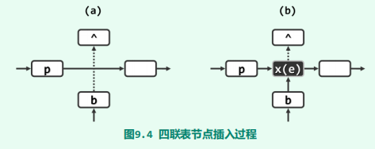
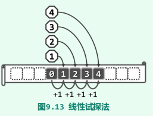
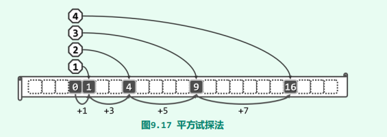

# 词典

[TOC]

## 概述

**词典（dictionary）**是**词条（entry）**集合，其中词条是由关键码和数据项组成的。**映射（map）**与词典结构一样，也是词条的集合。二者的差别仅仅在于，映射要求不同词条的关键码互异，而词典则允许多个词条拥有相同的关键码。二者统称作**符号表（symbol table）**。符号表并不强制要求词条之间能够根据关键码比较大小！

~~~java
public abstract class Map<K, V> {
    abstract public int getSize();
    abstract public boolean put(K key, V value);
    abstract public V get(K key);
    abstract public boolean remove(K key);
}
~~~

不难发现，基于此前介绍的任何一种平衡二叉搜索树，都可便捷地实现词典结构。比如，Java语言的java.util.TreeMap类即是基于红黑树实现的词典结构。然而这类实现方式都假设“关键码可以比较大小”。

有的编程语言甚至将符号表作为基本的数据类型，并称之作**关联数组（associative array）**。

## 跳转表

平衡二叉搜索树其查找、插入和删除操作均可在$\Omicron(logn)$​时间内完成。尽管如此，这些结构的相关算法往往较为复杂，代码实现和调试的难度较大，其正确性、鲁棒性和可维护性也很难保证。设计并引入跳转表（skip list）结构的初衷，正是在于试图找到另外一种简便直观的方式，来完成这一任务。

每一水平列表称作**层（level）**，其中$S_0$和$S_h$分别称作**底层（bottom）**和**顶层（top）**。层次不同的节点可能沿纵向组成**塔（tower）**，同一塔内的节点以高度为序也可定义前驱与后继关系。高层列表总是低层列表的子集，其中特别地，$S_0$包含词典中的所有词条

它的基本思想：节点$n$有$p$的概率向高层增长。显然，$p$的取值对整个跳转表的性能起到至关重要的作用。这里我们采用“生长概率逐层减半”的策略，即$S_0$中任一关键码仍然在$S_k$出现的概率为$\frac{1}{2^k}$。现在我们来计算在这一策略下的空间复杂度与时间复杂度。

命题：生长概率逐层减半下的空间复杂度为$\Omicron(n)$

证明：

1. 第k层所含节点的期望数目为：$E(|S_k|) = \frac{n}{2^k}$

2. 那么高度为h的跳转表所含节点的期望数目为

   $E(S) = E(\sum_k|S_k|) = \sum_kE(|S_k|) = (1 + \frac{1}{2} + \frac{1}{4} + ... + \frac{1}{2^{h - 1}})*n < 2n = \Omicron(n)$

命题：生长概率逐层减半下的空间复杂度为$\Omicron(logn)$

1. 先来计算跳转表的期望高度，考虑第k+1层。

2. 若$S_k$非空，那么至少有一个节点出现在第k+1层，那么有
   $$
   \begin{align}
   
   Pr(|S_k| > 0) &= C_n^1(\frac{1}{2^k})(1 - \frac{1}{2^k})^{n-1} + C_n^2(\frac{1}{2^k})^2(1 - \frac{1}{2^k})^{n-2} + ... + C_n^n(\frac{1}{2^k})^n \\
   &=1 - C_n^0(1 - \frac{1}{2^k})^n \\
   &\leq \frac{n}{2^k}
   \end{align}
   $$
   注：最后一步令$f(n) = 1 - (1 - \frac{1}{2^k})^n, \quad g(n) = \frac{n}{2^k}$，那么$g(1) = f(1)$。而$f(n)$递减，$g(n)$递增。第二步是二项式展开公式。

3. 那么$S_k$为空的概率为$Pr(|S_k| = 0) \geq 1 - \frac{n}{2^k}$。

4. 考虑$k = 3log_2n$的情况，那么$\Pr(h < k) = \Pr(|S_k| = 0) \geq 1 - \frac{n}{2^k} = 1 - 1/n^2$。当n增大时，这一概率迅速接近100%。故高度的期望值为$E(h) = \Omicron(logn)$。

5. 再来计算横向跳转的期望。显然横向跳转所经过的节点必然是他们所属塔的塔顶（除最后一次跳转）。那么横向跳转k次的概率为$Pr(Y = k) = (1 - \frac{1}{2})^{k - 1} * \frac{1}{2}$。这是一个几何分布，故$E(Y) = \frac{1 - \frac{1}{2}}{\frac{1}{2}} = 1$。也就是说在同一高度上，平均做常数次横向跳转。

6. 综上，生长概率逐层减半下的空间复杂度为$\Omicron(logn)$

### 数据结构

.png)

~~~java
public class SkipList<K extends Comparable<K>, V> extends Map<K, V> {
    final double probability;                                       //生长概率
    final List<QuadList<Entry<K, V>>> list = new List<>();         //垂直层面上的List
	//...
}
~~~

~~~java
class QuadList<T extends Comparable<T>> {
    int size;
    QuadListNode<T> header;     //哨兵节点
    QuadListNode<T> trailer;    //哨兵节点

    public QuadList() {
        header = new QuadListNode<>();
        trailer = new QuadListNode<>();
        header.succ = trailer;
        trailer.prev = header;
    }
    
    QuadListNode<T> insertAfterAbove(T data,QuadListNode<T> p,QuadListNode<T> b) { ... }
    
    public boolean isValid(QuadListNode<T> p) {
        return p != null && trailer != p && header != p;
    }
    
    QuadListNode<T> last() { return isEmpty() ? null : trailer.prev; }
    QuadListNode<T> first() { return isEmpty() ? null : header.succ; }
}
~~~

~~~java

class QuadListNode<T> {
    T data;
    QuadListNode<T> prev;
    QuadListNode<T> succ;
    QuadListNode<T> above;
    QuadListNode<T> below;

    public QuadListNode(
            T data,
            QuadListNode<T> prev,
            QuadListNode<T> succ,
            QuadListNode<T> above,
            QuadListNode<T> below
    ) {
        this.data = data;
        this.prev = prev;
        this.succ = succ;
        this.above = above;
        this.below = below;
    }

    public QuadListNode() {
        this(null, null, null, null, null);
    }
    QuadListNode<T> insertAsSuccAbove(T data,QuadListNode<T> node) { ... }
}
~~~

### Search

~~~java
/**
 * 返回不大于key的节点，
 * 若key比任何QuadList中节点的key小，那么p此时为header
 * 若key比任何QuadList中节点的key大，那么p此时为last()
 * 如果key命中了，那么就返回命中节点, 调用者需要对last再做一次判断
 * @param nodeOfQuadList    开始搜索的水平层，一般从顶层开始
 * @param p                 开始搜索的节点
 * @param key               待查询的key
 * @return                  不大于key的节点，如果nodeOfQuadList为null或者p为null，那么返回null
 */
protected QuadListNode<Entry<K, V>> skipSearch(
        List.ListNode<QuadList<Entry<K, V>>> nodeOfQuadList,
        QuadListNode<Entry<K, V>> p,
        K key
) {
    if (nodeOfQuadList == null || p == null) {
        //异常情况
        return null;
    }

    while (true) {
        //在当前水平层 从前往后查找，直至溢出至trailer或者出现更大的key
        while (p.succ != null && p.data.key.compareTo(key) <= 0) {
            p = p.succ;
        }
        p = p.prev;
        
        //若key比任何QuadList中节点的key小，那么p此时为header，故要判断p.prev != null
        //若key比任何QuadList中节点的key大，那么p此时为last()
        if (p.prev != null && p.data.key.compareTo(key) == 0) {
            return p;      //命中
        }
        //未命中
        nodeOfQuadList = nodeOfQuadList.getNext();				//跳转至下一层的链表
        if (nodeOfQuadList == null || nodeOfQuadList.data() == null) {
            //因为无法获取到List的尾哨兵，所以只能通过data() == null的方式来判断
            //已经到达了底层，无法继续向下
            return p;
        }
        //p如果是头哨兵，那么将它设置为下一层链表的第一个元素
        //否则，直接向下即可
        p = p.prev == null ? nodeOfQuadList.data().first() : p.below;
    }
}
~~~

### Put

~~~java
@Override
public boolean put(K key, V value) {
    Entry<K, V> entry = new Entry<>(key, value);
    if (list.empty()) {
        list.insertAsFirst(new QuadList<>());
    }

    List.ListNode<QuadList<Entry<K, V>>> nodeOfQuadList = list.first();
    QuadListNode<Entry<K, V>> p = nodeOfQuadList.data().first();

    //将p设置为底层的节点，且要作为key的前驱
    if ((p = skipSearch(nodeOfQuadList, p, key)) != null) {
        while (p.below != null)
            p = p.below;                                    //p到最底层
    } else {
        //此时，skipList为空。
        p = nodeOfQuadList.data().header;                   //将p设置为头哨兵
    }
    assert p != null;

    QuadList<Entry<K, V>> quadList = list.last().data();
    nodeOfQuadList = list.last();                           //跳转到底层
    QuadListNode<Entry<K, V>> newNode = quadList.insertAfterAbove(entry, p, null);      //作为p的后续

    while (random.nextInt(100) <= 100 * probability) {
        while (quadList.isValid(p) && p.above == null) {
            p = p.prev;
        }
        if (quadList.isValid(p)) {						 //p是普通的节点
            p = p.above;
        } else {                                            //若p为头哨兵header
            if (quadList == list.first().data()) {          //已经到达顶部，不能再向上
                list.insertAsFirst(new QuadList<>());      
            }
            p = nodeOfQuadList.getPrev().data().header;     //p设置为上一层的header
        }

        nodeOfQuadList = nodeOfQuadList.getPrev();
        quadList = nodeOfQuadList.data();                   //上升一层
        assert quadList != null;
        newNode = quadList.insertAfterAbove(entry, p, newNode);
    }
    return true;
}
~~~

~~~java
//QuadList
QuadListNode<T> insertAfterAbove(
        T data,
        QuadListNode<T> p,
        QuadListNode<T> b
) {
    size++;
    return p.insertAsSuccAbove(data, b);
}
~~~

~~~java
//QuadListNode
QuadListNode<T> insertAsSuccAbove(
        T data,
        QuadListNode<T> node
) {
    QuadListNode<T> newNode = new QuadListNode<>(data, this, succ, null, node);
    if (node != null)
        node.above = newNode;
    this.succ.prev = newNode;
    this.succ = newNode;
    return newNode;
}
~~~

### Get

~~~java
/**
 * 获取指定key的value
 * @param key
 * @return 如果未查询到key，那么返回null
 */
@Override
public V get(K key) {
    if (list.empty()) {
        return null;
    }

    assert list.first() != null;
    List.ListNode<QuadList<Entry<K, V>>> nodeOfQuadList = list.first();
    QuadList<Entry<K, V>> quadList = nodeOfQuadList.data();
    //从顶部开始搜索
    Entry<K, V> entry = skipSearch(
            nodeOfQuadList,
            quadList.first(),
            key
    ).data;
    //如果key比任何节点小，那么返回就是header，此时数据域为null
    //如果key比任何节点大，那么返回就是last(),此时必须做一次特判
    return entry != null ?
            (entry.key.compareTo(key) == 0 ?
                    entry.value
                    : null)
            : null;
}
~~~

### Remove

~~~java
@Override
public boolean remove(K key) {
    List.ListNode<QuadList<Entry<K, V>>> nodeOfQuadList = list.first();
    QuadListNode<Entry<K, V>> p = nodeOfQuadList.data().first();
    //这里判空操作处理了空skipList的边界情况
    if ((p = skipSearch(nodeOfQuadList, p, key)) == null
            || p.data.key.compareTo(key) != 0) {     //目标节点不存在
        return false;
    }

    //拆除对应的tower
    do {
        QuadListNode<Entry<K, V>> belowNode = p.below;
        nodeOfQuadList.data().remove(p);
        p = belowNode;
        nodeOfQuadList = nodeOfQuadList.getNext();
    } while (p != null);

    //塔顶没有key了。那么就删除塔顶
    while (!list.empty() && list.first().data().isEmpty()) {
        //由于先list.empty() 所以data()并不会返回null
        list.remove(list.first());
    }
    return true;
}
~~~

## 散列表

### 概述

**散列表（hashtable）**是根据对象的键（Key），直接将其保存到对应地址的数据结构。

由于键的类型各种各样，所以一般是先通过hashCode()的函数对键进行预处理，将键的类型转换为散列函数所接受的类型。然后再通过散列函数，将这些键映射为存储地址（索引）。

对于字符串类型的关键码，可以使用多项式散列码进行转换。即对于字符串$x_0x_1....x_n$，其散列码为$x_0 + x_1 * a^1 + .... + x_n*a^n$。实验表明，对于英语单词之类的字符串，a = 33、37、39或41都是不错的选择。

为了在$\Omicron(1)$的时间内完成查找，我们牺牲了在空间上的性能。为了衡量这种牺牲，我们引入了**装载因子（load factor）**的概念，即散列表的空间利用率。

对于一个好的散列函数，它应该具体以下条件：

- 对于任何输入集合，其映射值的随机性很强，规律性较弱。

  实际上，这种条件是很难满足的，我们只能事先尽可能地消除导致关键码分布不均匀的因素，最大限度降低发生冲突的概率。

- 计算速度快，一般是$\Omicron(1)$，从而保证高效地查找。

下面介绍一些散列函数，假设关键码已经转换为Int类型的散列码

- 除余法：设散列表的大小为M，那么地址为$hash(key) = key \% M$。这里M应当取素数，这样素因子只有一个。

- MAD（multiply-add-divide）法：除余法在某些特定的输入下出现**聚集现象（clustering）**，例如

  

  为了避免这种情况，我们定义$hash(key) = (a * key + b) \% M$

  

- 随机数法：定义$hash(key) = rand(key) \% M$，其中rand(key)是第k个伪随机序列中的元素。

在实际中，输入空间往往大于散列地址空间。所以对于一个散列函数来说，是几乎不可能满足单射性质的。这也就是说，一定会有冲突的情况。如何解决冲突，也是设计散列表时需要考虑的关键因素。

根据散列表是否引入次级数据结构来解决冲突问题，我们可以把散列表分为：**开散列（封闭定址策略）**与**闭散列（开放定址策略）**。

### 开散列

多槽位

独立链

公共溢出区

### 闭散列

开散列虽然直观容易理解，但是因需要引入次级关联结构，因不能保证物理上的关联性，对于稍大规模的词条集，查找过程中将需做更多的I/O操作。

采用开放地址策略时，记关键码$key$的第$i$次探测所计算出来的地址为$a_i$，那么称$a_1, a_2, ..., a_n$为$key$的查找链。需要注意的是，同一查找链上的关键码未必冲突，而冲突的关键码必定在这查找链上。下面举例来说明这一点。

2079在2082的查找链上，但是它们两并不冲突。究其原因在于，多组各自冲突的关键码所对应的查找链，有可能相互交织和重叠。此时，各组关键码的查找长度将会进一步增加。

查找链对于探测过程至关重要。查找链中任何一环的缺失，都会导致后续词条因无法抵达而丢失。因此，需要对删除操作做特别的调整。我们采用**懒惰删除（lazy removal）**法，即对于删除的元素仅仅打上标记即可。

采用“懒惰删除”策略之后，插入、查找操作也需做相应的调整。具体来说就是，对于插入操作，遇到空或者懒惰删除的单元直接插入即可；而对于查找来说，遇到懒惰删除的单元，跳过继续探测。

当频繁地执行删除、插入操作时，带有删除标记的单元会增多，这势必增加查找失败的代价。这对查找成功的情况、插入操作无影响。

- **线性探测策略**：第$i$次探测的地址为$hash(key) = (hash_1(key) + i) \% M$。

- **平方探测策略**：$hash(key) = (hash_1(key) + i^2)\%M$

- **随即试探法**：$hash(key) = random(hash_1(key)) % M$，其中$random(hash_1(key))$是系统伪随机序列中的第$hash_1(key)$个元素。

- **再散列法**：$hash(key) = [hash_1(key) + i * hash_2(key)] % M$

尽管线性探测会在一定程度上增加冲突发生的可能。但是，它在物理上保持一定的连续性，具有良好的数据局部性，探测过程中几乎无需I/O操作。

如果你对线性探测中的聚集现象有些担忧，那么还可以使用**平方探测策略**：$hash(key) = (hash_1(key) + i^2)\%M$，这一函数的效果是冲突的词条加速逃离聚集区，有效地缓解聚集现象。只要查找链的长度适中，那么数据局部性就不会失效。下面我们看一个例子：假设页面大小$4KB$，一个关键码的大小为$8B$，那么一个页面可以放置$512$个单元。那么查找链的最大长度约为$\sqrt{512} = 22$。

请看下一个例子：假设从0开始平方探测

在这一个例子中，探测过程是永远不会结束的。但是只要散列表长度M为素数且装填因子$\lambda \leq 0.5$，则平方试探迟早必将终止于某个空桶。下面我们证明这句话。

命题：任意关键码所对应的查找链中，前$\lceil M / 2\rceil = (M + 1) / 2$次探测所对应的桶必然互异。其中M为素数

证明：

1. 假设$\exist a, b \quad 0 \leq a < b < \lceil M / 2\rceil$，使得第$a$次探测对应的桶与第$b$次探测对应的桶相同
2. 那么有$ (hash(key) + a^2) \%M= (hash(key) + b^2) \%M$，即$a^2 \equiv b^2 \quad(mod M)$
3. 于是$a^2 - b^2 = (a-b)(a+b) \equiv 0 \quad (mod M)$。这说明$a - b$或者$a + b$是可以被M整除
4. 但是$(a-b)$或$(a+b)$的绝对值都小于M，与条件矛盾。

推论：但是只要散列表长度M为素数且装填因子$\lambda \leq 0.5$，则平方试探迟早必将终止于某个空桶

当装载因子过大时，需要**重散列**。先将容量扩大，然后将词条重新插入到散列表中即可。

