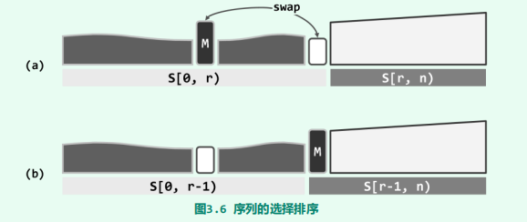
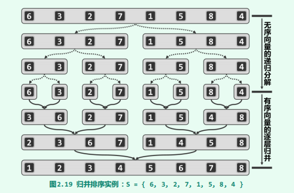
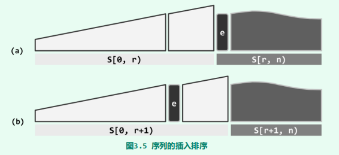

# 统计

[TOC]

## 排序

排序算法是个庞大的家族，可从多个角度对其中的成员进行分类：

- 根据其处理数据的规模与存储的特点不同，可分为

  - **内部排序算法**：数据规模相对不大，内存足以容纳
  - **外部排序算法**：数据规模很大，必须将借助磁盘，在排序计算过程的任一时刻，内存中只能容纳其中一小部分数据。

- 根据输入形式的不同，可分为：

  - **离线算法（offline algorithm）** ：需要事先知道全部输入数据
  - **在线算法（online algorithm）**：an **online algorithm** is one that can process its input piece-by-piece in a serial fashion, i.e., in the order that the input is fed to the [algorithm](https://en.wikipedia.org/wiki/Algorithm), without having the entire input available from the start.

  

我们在此讨论的是的内部排序算法。

**稳定性（stability）**是对排序算法更为细致的要求，重在考查算法对重复元素的处理效果。具体地，在将向量A转换为有序向量S之后，设$A[i]$对应于$S[ki]$。若对于A中每一对重复元素$A[i] = A[j]$（相应地$S[k_i]$ =$ S[k_j]$），都有$i < j$当且仅当$k_i < k_j$，则称该排序算法是**稳定算法（stable algorithm）**。简而言之，稳定算法的特征是，重复元素之间的相对次序在排序前后保持一致。反之，不具有这一特征的排序算法都是**不稳定算法（unstable algorithm）**。

### 排序问题的复杂度下界

我们接下来讨论，排序问题的**复杂度下界（lower bound）**$\Omega$是什么（注意，不是算法的复杂度下界）。

设问题P有$n$个算法，分别记为$s_1, s_2, ... s_n$，这些算法$s_i$的复杂度上界记为$u_i$，那么问题P的复杂度下界为$min\{u_1, u_2, ... u_n\}$。

通过比较树模型，我们可以提供一种计算问题复杂度下界的一种重要方法。**比较树（Comparison Tree）**的定义如下：

- 内部节点对应于一次比对操作
- 内部节点的左、右分支，分别对应于在两种比对结果下的执行方向
- 算法的每一运行过程都对应于从根到某一叶节点的路径。

只要算法所有可能的执行过程都可表示和概括为一棵比较树，那么我们称该算法为**比较式算法（comparison-based algorithm，CBA）**

命题：在使用CBA式排序算法的范围中，排序问题的复杂度下界为$\Omicron(log_2N)$

1. 考查CBA式排序算法A，设CT(A)是与之对应的排序树

2. 算法A在最坏情况下的运行时间，取决于比较树中所有叶节点的最大深度，即该树的高度。那么将树高记为$h(CT(A))$

3. 就$n$个元素的排序问题而言，至少需要比较$n * (n - 1) * ... * 2 * 1 = n!$，才能确定每个元素与其他元素之间的大小关系。这也就是说，比较树至少有$n!$个叶节点

4. 因为元素之间可以进行`==`、`<`、 `>` 比较运算，所以排序算法的比较树属于三叉树，进而任一CBA式排序算法所对应比较树的高度应为
   $$
   h \geq \lceil log_3(n!) \rceil = \lceil log_3e*ln(n!)\rceil = \Omega(nlogn)
   $$
   其中用到了`Stirling`逼近公式$n! \approx \sqrt{2\pi n}*(\frac{n}{e})^n$

   

### 气泡排序

不变式：在任何时刻，后缀$S[r,n)$已经有序，且不小于前缀$S[0, r]$

~~~java
public static <T extends Comparable<T>>
void bubbleSort(Vector<T> vector, int left, int right) {
    while (++left < right) {                //自左向右，逐一检查各对相邻元素
        boolean sorted = true;              //整体有序的标志
        int rank = left;
        while (rank < right) {
            if (vector.data[rank - 1].compareTo(vector.data[rank]) > 0) {   //发现逆序对
                swap(vector, rank - 1, rank);       //通过交换使得局部有序
                sorted = false;
            }
            rank += 1;
        }
        if (sorted) break;
        right -= 1;
    }
}
~~~

### 选择排序

不变式：在任何时刻，后缀$S[r,n)$已经有序，且不小于前缀$S[0, r]$

基本思路从前缀中找出最大者$M$，只需将$M$从前缀中取出并作为首元素插入后缀

~~~java
public static <T extends Comparable<T>>
ListNode<T> selectMax(List<T> list, ListNode<T> p, int n) {
    ListNode<T> max = p;
    //n > 1是因为跳过了对p的考察，直接从p.next开始
    for (ListNode<T> currentNode = p.next; n > 1; n--, currentNode = currentNode.next) {
        if (currentNode.data.compareTo(max.data) > 0) {
            max = currentNode;
        }
    }
    return max;
}

public static <T extends Comparable<T>>
void selectionSort(List<T> list, ListNode<T> p, int n) {
    ListNode<T> left = p.prev;
    ListNode<T> right = p;
    for (int i = 0; i < n; i++) {
        right = right.next;
    }
    //待排序区间(left, right)
    while (n > 1) {
        ListNode<T> max = selectMax(list, left.next, n);
        list.insertPrev(list.remove(max), right);       //一定要注意删除操作，否则链表中有两个相同的节点
        right = right.prev;
        n--;
    }
}
~~~

### 归并排序

~~~java
public static <T extends Comparable<T>>
void mergeSort(Vector<T> vector, int left, int right) {
    if (right - left < 2) return;       //元素个数小于2个
    int mid = (left + right) / 2;
    mergeSort(vector, left, mid);
    mergeSort(vector, mid, right);
    merge(vector, left, right);
}

@SuppressWarnings("unchecked")
public static <T extends Comparable<T>>
void merge(Vector<T> vector, int left, int right) {
    int mid = (left + right) / 2;
    T[] tempArray = (T[])new Object[right - left];
    int leftIndex = left;
    int rightIndex = mid;
    int index = 0;
    while (leftIndex < mid && rightIndex < right) {
        T leftElement = vector.data[leftIndex];
        T rightElement = vector.data[rightIndex];
        if (leftElement.compareTo(rightElement) <= 0) {
            tempArray[index++] = leftElement;
            leftIndex += 1;
        } else {
            tempArray[index++] = rightElement;
            rightIndex += 1;
        }
    }
    while (leftIndex < mid) tempArray[index++] = vector.data[leftIndex++];
    while (rightIndex < right) tempArray[index++] = vector.data[rightIndex++];
    System.arraycopy(tempArray, 0, vector.data, 0, right - left);
}
~~~

我们可以得到以下递推式
$$
T(n) = 2T(\frac{n}{2}) + \Omicron(n)
$$
解得
$$
T(n) = \Omicron(nlogn)
$$

基于列表的实现

~~~java
/**
 * 将src中的节点有序合并到des，并且在src中删除这些节点。用于归并排序中
 * @param des 目标链表
 * @param p 起始位置
 * @param n 合并的范围设置为n个节点（包括节点p）
 * @param src 源链表
 * @param q 起始位置
 * @param m 合并的范围设置为m个节点（包括节点q）
 * @return 通过参数p返回合并后链表的新的起始位置
 */
public static <T extends Comparable<T>>
void merge(List<T> des, ListNode<T> p, int n, List<T> src, ListNode<T> q, int m) {
    //在归并排序中 this = L && rank(p) + n = rank(q)
    ListNode pp = p.prev;
    while (m > 0) {
        if (n > 0 && p.data.compareTo(q.data) <= 0) {
            p = p.next;
            if (q == p) {
                //这里处理的是 des = src 而且要合并的两个链表的范围是重合的
                break;
            }
            n--;
        } else {
            q = q.next;
            //删除是有必要的，因为这两个列表des、src都是list的子列表
            des.insertPrev(src.remove(q.prev), p);
            m--;
        }
    }
}

public static <T extends Comparable<T>>
void mergeSort(List<T> list, ListNode p, int n) {
    if (n < 2) return;
    int m = n / 2;
    ListNode q = p;
    for (int i = 0; i < m; i++) q = q.next;
    mergeSort(list, p, m);
    mergeSort(list, q, n - m);
    merge(list, p, m, list, q, n - m);
}
~~~

### 插入排序

不变式：对于当前节点$e = S[r]$，前缀$S[0, r)$已有序

~~~java
public static <T extends Comparable<T>>
void insertSort(List<T> list, ListNode<T> p, int n) {
    for (int rank = 0; rank < n; rank++) {
        //找到小于或等于p.data的节点，然后在它的next处插入一份新的节点p
        list.insertNext(p.data, search(list, p.data, rank, p));
        p = p.next;
        list.remove(p.prev);        //因为在链表中插入了一个新的节点，因此要删除这多余的节点
    }
}
~~~

