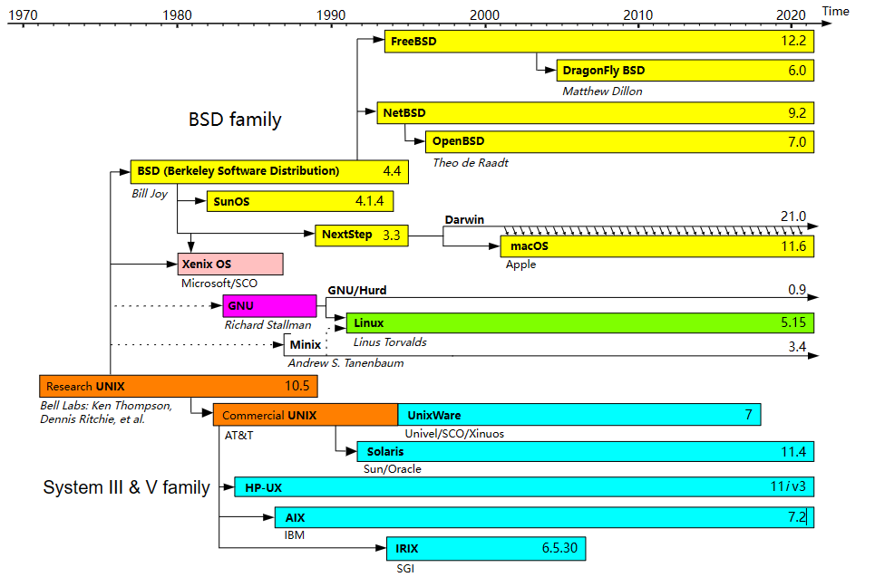
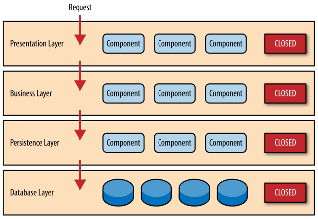
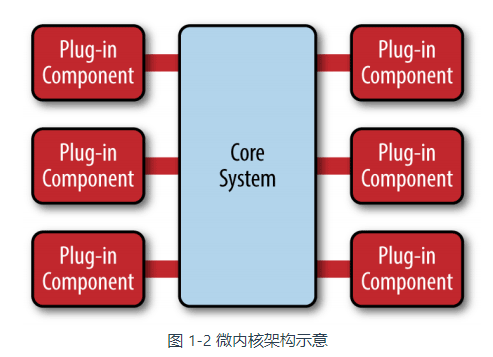
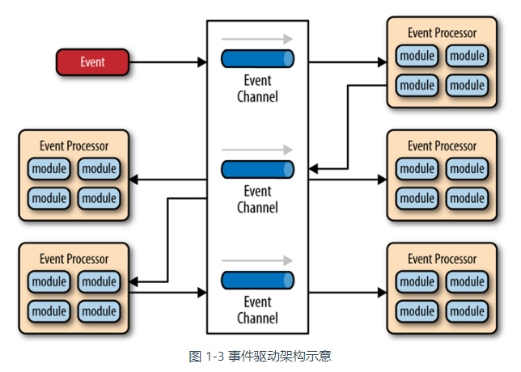
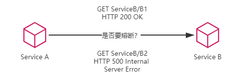
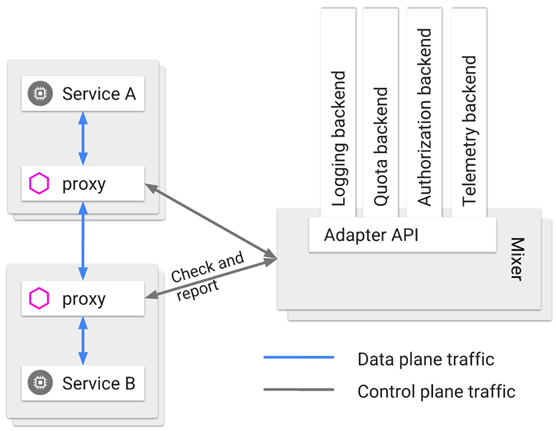
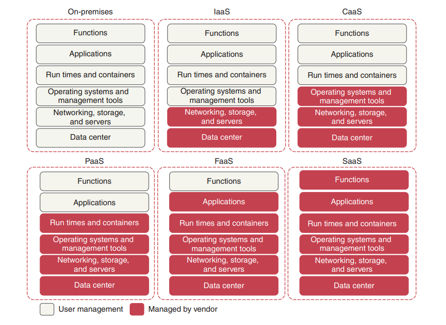
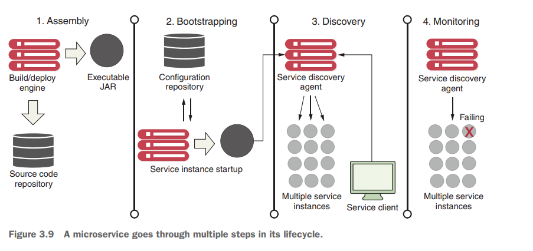

# 探索起步

[TOC]

## 概述

https://icyfenix.cn/introduction/about-the-fenix-project.html

构建一个大规模但依然可靠的软件系统，是否是可行的？在墨菲定律的支配下，这一目标仿佛不可能实现。

> Anything that can go wrong will go wrong.
>
> 如果事情可能出错，那么总会出错。

但是，John von Neumann的「Theory of Self-Reproducing Automata」这篇论文给出了答案。它回答了一个理论问题，即**如何用一些不可靠的部件来构造出一个可靠的系统**。以生命系统为例，由于热力学扰动、生物复制差错等因素干扰，细胞本身是不可靠的，但是由大量不稳定的细胞所构建的有机生命体却是稳定的。这种构建的关键在于遗传迭代，也就是说，尽管每个细胞都会消亡，但新生细胞总是源源不断地补充过来。

软件架构风格从大型机（Mainframe），到[原始分布式](https://icyfenix.cn/architecture/architect-history/primitive-distribution.html)（Distributed），到[大型单体](https://icyfenix.cn/architecture/architect-history/monolithic.html)（Monolithic），到[面向服务](https://icyfenix.cn/architecture/architect-history/soa.html)（Service-Oriented），到[微服务](https://icyfenix.cn/architecture/architect-history/microservices.html)（Microservices），到[服务网格](https://icyfenix.cn/architecture/architect-history/post-microservices.html)（Service Mesh），到[无服务](https://icyfenix.cn/architecture/architect-history/serverless.html)（Serverless）持续演进。这种演进的核心理念便是让某个服务更好地**涅槃重生**。

## 架构演进史

架构并不是被发明出来的，而是持续演进的结果

### 原始分布式时代

UNIX 的设计哲学：

>Simplicity of both the interface and the implementation are more important than any other attributes of the system — including correctness, consistency, and completeness

为突破硬件算力的限制（16 位寄存器、不足 5MHz 时钟频率的处理器，不超过 1 MB 的最大内存和 64KB 单段偏移地址），各个高校、厂商开始探索使用多台计算机共同协作来支撑同一套软件系统运行的可行方案。

这一阶段是对分布式架构最原始的探索，从结果来看，历史局限决定了它不可能一蹴而就地解决分布式的难题。然而从过程来看，这个阶段的探索称得上成绩斐然。研究过程的很多中间成果都对今天计算机科学的诸多领域产生了深远的影响：

- 惠普公司提出的 [网络运算架构](https://en.wikipedia.org/wiki/Network_Computing_System)（Network Computing Architecture，NCA）是远程服务调用（RPC）的雏形

  > 它与后来 Sun 公司向互联网工程任务组（Internet Engineering Task Force，IETF）提交的基于通用 TCP/IP 协议的远程服务标准 [ONC RPC](https://zh.wikipedia.org/wiki/開放網路運算遠端程序呼叫)，共同被认为是现代 RPC 的鼻祖

- 卡内基·梅隆大学提出的 [AFS 文件系统](https://en.wikipedia.org/wiki/Andrew_File_System)（Andrew File System）是分布式文件系统的最早实现

- 麻省理工学院提出的 [Kerberos 协议](https://en.wikipedia.org/wiki/Kerberos_(protocol)) ，是服务认证和访问控制的基础性协议，是分布式服务安全性的重要支撑

为了避免[UNIX 系统的版本战争](https://en.wikipedia.org/wiki/Unix_wars)在分布式领域中重演，负责制定 UNIX 系统技术标准的“[开放软件基金会](https://zh.wikipedia.org/wiki/開放軟體基金會)（Open Software Foundation，OSF）制订了名为“[分布式运算环境](https://en.wikipedia.org/wiki/Distributed_Computing_Environment)”（Distributed Computing Environment，DCE）的分布式技术体系。

当时设计一个分布式系统所要面临的问题有：

- 远程的服务在哪里（服务发现）
- 有多少个（负载均衡）
- 网络出现分区、超时或者服务出错了怎么办（熔断、隔离、降级）
- 方法的参数与返回结果如何表示（序列化协议）
- 服务权限如何管理（认证、授权）
- 如何令调用不同机器的服务返回相同的结果（分布式数据一致性）等一系列问题
- ...

DCE 回答了其中大部分问题，构建出大量的分布式基础组件与协议。由于 OSF 本身的 UNIX 背景，当时这些技术都带着浓厚的 UNIX 设计风格，即简单透明。

由于远程调用所引入的网络因素，使得远程和本地两者的速度往往有着数量级上的差距，完全不可调和。开发者必须用各种奇技淫巧来抹平两者之间的性能鸿沟，此时，开发人员必须每时每刻都意识到自己是在编写分布式程序，不可轻易踏过本地与远程的界限。设计向性能做出的妥协，令 DCE“尽量简单透明”的努力几乎全部付诸东流。**原始分布式时代的教训**：

> Just because something **can** be distributed doesn’t mean it **should** be distributed. Trying to make a distributed call act like a local call always ends in tears
>
> 某个功能**能够**进行分布式，并不意味着它就**应该**进行分布式，强行追求透明的分布式操作，只会自寻苦果

20 世纪 80 年代正是[摩尔定律](https://zh.wikipedia.org/wiki/摩尔定律)开始稳定发挥作用的黄金时期，硬件算力束缚软件规模的链条很快变得松动，寻求如何更完美地构建分布式系统的道路已变得明确清晰。

### 单体系统时代

「单体」只是表明系统中主要的过程调用都是进程内调用，不会发生进程间通信，仅此而已。

单体系统的不足，必须基于软件的性能需求超过了单机，软件的开发人员规模明显超过了“[2 Pizza Team](https://wiki.mbalib.com/wiki/两个披萨原则)”范畴的前提下，才有讨论的价值。对于小型系统，单体系统大有可为，因为它易于开发、测试、部署。

尽管“Monolithic”这个词语（巨石）确实带有一些“不可拆分”的隐含意味，但是它其实更接近于**「自给自足」（Self-Contained）**。

> Monolith means composed all in one piece. The Monolithic application describes a single-tiered software application in which different components combined into a single program from a single platform.
>
> 单体意味着自包含。单体应用描述了一种由同一技术平台的不同组件构成的单层软件。

从纵向角度来看，单体结构采用分层架构（Layered Architecture）设计方法。实际上无论哪种架构风格，都会对代码进行纵向层次划分。

从横向角度来看，单体架构也可以支持按照技术、功能、职责等维度，将软件拆分为各种模块。

单体系统的真正缺陷不在如何拆分，而在拆分之后的隔离与自治能力上的欠缺。单体系统中的所有代码都运行在同一个进程空间内，这意味着：

- **简单、高效**：所有模块、方法的调用都无须考虑网络分区、对象复制等麻烦的事。
- **难以阻断错误传播**：如果任何一部分代码出现了缺陷，过度消耗了进程空间内的资源，所造成的影响也是全局性的、难以隔离的。譬如内存泄漏、线程爆炸、阻塞、死循环等问题。
- **不便于动态更新程序**：无法做到单独停止、更新、升级某一部分代码（可以使用 OSGi 这种运行时模块化框架，但是很复杂）
- **难以技术异构**：每个模块的代码都通常需要使用一样的程序语言。 JNI 就可以让 Java 混用 C 或 C++，但这通常是迫不得已的，不优雅的方案。

以上列举的这些问题都还不是今天微服务取代单体系统的根本原因，笔者认为最重要的理由是：单体系统很难兼容“[Phoenix](https://icyfenix.cn/introduction/about-the-fenix-project.html#架构的演进)”的特性。

如本书的前言开篇《[什么是"凤凰架构"](https://icyfenix.cn/introduction/about-the-fenix-project.html)》所说，正是随着软件架构演进，**构筑可靠系统从“追求尽量不出错”，到正视“出错是必然”的观念转变**，才是微服务架构得以挑战并逐步开始取代运作了数十年的单体架构的底气所在。

### SOA时代

为了对大型的单体系统进行拆分，让每一个子系统都能独立地部署、运行、更新，开发者们曾经尝试过多种方案，这里列举以下三种较有代表性的架构模式：

- [烟囱式架构](https://en.wikipedia.org/wiki/Information_silo)（Information Silo Architecture）：信息烟囱又名信息孤岛（Information Island），它指的是一种完全不与其他相关信息系统进行互操作或者协调工作的设计模式，这显然是不现实的

- [微内核架构](https://en.wikipedia.org/wiki/Microkernel)（Microkernel Architecture）：微内核架构也被称为插件式架构（Plug-in Architecture），在烟囱式架构基础上，将各子系统使用到的公共服务、数据、资源集中到一块，成为一个被所有业务系统共同依赖的核心（Kernel，也称为 Core System），具体的业务系统以插件模块（Plug-in Modules）的形式存在

  

  微内核架构假设各个插件模块之间是互不认识，即不可预知系统将安装哪些模块。这样插件之间不能顺畅地互相调用通信

- [事件驱动架构](https://en.wikipedia.org/wiki/Event-driven_architecture)（Event-Driven Architecture）：在子系统之间建立一套事件队列管道（Event Queues），来自系统外部的消息将以事件的形式发送至管道中，各个子系统从管道里获取自己感兴趣、能够处理的事件消息：

> SOA 的概念最早由 Gartner 公司在 1994 年提出，当时的 SOA 还不具备发展的条件，直至 2006 年情况才有所变化，由 IBM、Oracle、SAP 等公司共同成立了 OSOA 联盟（Open Service Oriented Architecture），用于联合制定和推进 SOA 相关行业标准。2007 年，在[结构化资讯标准促进组织](https://en.wikipedia.org/wiki/OASIS_(organization))（Organization for the Advancement of Structured Information Standards，OASIS）的倡议与支持下，OSOA联合 OASIS 共同新成立了的[Open CSA](http://www.oasis-opencsa.org/)组织（Open Composite Services Architecture），这便是 SOA 的官方管理机构。

尽管 SOA 本身还是属抽象概念，而不是特指某一种具体的技术，但它比单体架构和前面所列举的三种架构模式的操作性要更强，已经不能简单视其为一种架构风格，而是可以称为一套软件设计的基础平台了：

- 拥有领导制定技术标准的组织 Open CSA
- 有清晰软件设计的指导原则，譬如服务的封装性、自治、松耦合、可重用、可组合、无状态，等等
- 明确了采用 SOAP 作为远程调用的协议，依靠 SOAP 协议族来完成服务的发布、发现和治理
- 利用一个被称为[企业服务总线](https://zh.wikipedia.org/zh-hans/企业服务总线)（Enterprise Service Bus，ESB）的消息管道来实现各个子系统之间的通信交互
- 使用[服务数据对象](https://zh.wikipedia.org/wiki/服务数据对象)（Service Data Object，SDO）来访问和表示数据
- 使用[服务组件架构](https://zh.wikipedia.org/wiki/服务组件架构)（Service Component Architecture，SCA）来定义服务封装的形式和服务运行的容器

 SOA 的终极目标是希望总结出一套自上而下的软件研发方法论。SOA 不仅关注技术，还关注研发过程中涉及到的需求、管理、流程和组织。如果这个目标真的能够达成，软件开发就有可能从此迈进工业化大生产的阶段，写出符合客户需求的软件会像写八股文一样有迹可循、有法可依，那对软件开发者来说也许是无趣的，但对整个社会**实施信息化的效率**肯定会有大幅的提升。

过于严格的规范定义带来过度的复杂性，所以在 SOA 诞生的那一天起，就已经注定了它只能是少数系统阳春白雪式的精致奢侈品，它可以实现多个异构大型系统之间的复杂集成交互，却很难作为一种具有广泛普适性的软件架构风格来推广。

### 微服务时代

微服务”这个技术名词是由 Peter Rodgers 博士在 2005 年度的云计算博览会（Web Services Edge 2005）上首次提出，这一阶段的微服务是作为一种 SOA 的轻量化的补救方案而被提出的。

现代微服务的概念是由 Martin Fowler 与 James Lewis 合写的文章《[Microservices: A Definition of This New Architectural Term](https://martinfowler.com/articles/microservices.html)》中给出：

微服务是一种通过多个小型服务组合来构建单个应用的架构风格，这些服务围绕业务能力而非特定的技术标准来构建。各个服务可以采用不同的编程语言，不同的数据存储技术，运行在不同的进程之中。服务采取轻量级的通信机制实现通信，以及自动化的部署机制实现运维。

此外，文中列举了微服务的九个核心的业务与技术特征：

- **围绕业务能力构建**（Organized around Business Capability）。这里再次强调了康威定律的重要性，有怎样结构、规模、能力的团队，就会产生出对应的产品。
- **分散治理**（Decentralized Governance）：一方面，团队要为自己所开发的服务负责，另一方面，有权利做技术选型。
- **通过服务来实现独立自治的组件**（Componentization via Services）：类库在编译期静态链接到程序中，通过本地调用来提供功能，而服务是进程外组件，通过远程调用来提供功能。
- **产品化思维**（Products not Projects）：并非仅仅将软件研发看作为一个项目，即完成特定的功能就结束，而是要将其看作为一种产品，需要持续不断地改进和提升。
- **数据去中心化**（Decentralized Data Management）：数据应该按领域分散管理、更新、维护、存储
- **强终端弱管道**（Smart Endpoint and Dumb Pipe）：这个特征就是在旗帜鲜明地反对SOA中SOAP、SEB等复杂的通信机制，ESB 可以处理消息的编码加工、业务规则转换等；而SOAP 有几十个 WS-*协议族在处理事务、一致性、认证授权等一系列工作。这些构建在通信管道上的功能，对于很多服务而言，是强加进来的负担。这些工作就应该在服务自身的 Endpoint 上完成，而不是在通信管道上一揽子处理。
- **容错性设计**（Design for Failure）：有自动的机制对其依赖的服务能够进行快速故障检测，在持续出错的时候进行隔离，在服务恢复的时候重新联通。
- **演进式设计**（Evolutionary Design）：容错性设计承认服务会出错，演进式设计则是承认服务会被报废淘汰。假如系统中出现不可更改、无可替代的服务，这并不能说明这个服务是多么的优秀、多么的重要，反而是一种系统设计上脆弱的表现
- **基础设施自动化**（Infrastructure Automation）：基础设施自动化，如 CI/CD 的长足发展，显著减少了构建、发布、运维工作的复杂性。

> This common manifestation of SOA has led some microservice advocates to reject the SOA label entirely, although others consider microservices to be one form of SOA , perhaps service orientation done right. Either way, the fact that SOA means such different things means it's valuable to have a term that more crisply defines this architectural style
>
> 由于与 SOA 具有一致的表现形式，这让微服务的支持者更加迫切地拒绝再被打上 SOA 的标签，尽管有一些人坚持认为微服务就是 SOA 的一种变体形式，也许从面向服务方面这个方面来说是对的，但无论如何，SOA 与微服务都是两种不同的东西，正因如此，使用一个别的名称来简明地定义这种架构风格就显得更有必要。

在微服务中，提倡以灵活的「实践标准」代替繁琐的「规范标准」。因此对于服务的注册发现、跟踪治理、负载均衡、故障隔离、认证授权等等问题，不再会有统一的解决方案。微服务并不能解决所有的分布式系统的问题，它只是寻求一个平衡点，让架构师能够更为简单、容易地构建分布式系统。

例如，光一个服务发现问题，就有以下解决方案：Eureka（Netflix）、Consul（HashiCorp）、Nacos（阿里巴巴）、ZooKeeper（Apache）、Etcd（CoreOS）、CoreDNS（CNCF），等等

微服务时代饱含着无限的自由，同时也充斥着迷茫的抉择。

### 后微服务时代（云原生）

注册发现、跟踪治理、负载均衡、传输通信等这些问题，一定要由软件系统自己来解决吗？实际上，这些问题都可以在硬件层面来解决，例如，如果需要解决服务发现问题，通常会设置 DNS 服务器；如果某个系统需要解决负载均衡问题，通常会布置负载均衡器；某个系统需要伸缩扩容，通常会购买新的服务器。

之所以在软件层面解决这些问题，是因为硬件的可扩展性差而应对不了应用服务的变化。而用于虚拟化基础设施（例如，操作系统）的容器技术，为我们提供了了一条全新的、前途更加广阔的解题思路。

当虚拟化的基础设施从单个容器，扩展至由多个容器构成的集群时（k8s），软件与硬件的界限便已经模糊。一旦虚拟化的基础设施能够跟上业务的变化，那些与业务无关的技术性问题（例如，注册发现、跟踪治理、负载均衡等）便有可能业务层面剥离。

表 1-1 传统 Spring Cloud 与 Kubernetes 提供的解决方案对比

|          | Kubernetes              | Spring Cloud          |
| -------- | ----------------------- | --------------------- |
| 弹性伸缩 | Autoscaling             | N/A                   |
| 服务发现 | KubeDNS / CoreDNS       | Spring Cloud Eureka   |
| 配置中心 | ConfigMap / Secret      | Spring Cloud Config   |
| 服务网关 | Ingress Controller      | Spring Cloud Zuul     |
| 负载均衡 | Load Balancer           | Spring Cloud Ribbon   |
| 服务安全 | RBAC API                | Spring Cloud Security |
| 跟踪监控 | Metrics API / Dashboard | Spring Cloud Turbine  |
| 降级熔断 | N/A                     | Spring Cloud Hystrix  |

但 Kubernetes 仍然没有能够完美解决全部的分布式问题。

举个例子，微服务 A 调用了微服务 B 的两个服务，称为 B1和 B2，假设 B1表现正常但 B2 出现了持续的 500 错，那在达到一定阈值之后就应该对 B2 进行熔断，以避免产生[雪崩效应](https://en.wikipedia.org/wiki/Snowball_effect)。如果仅在基础设施层面来处理，这会遇到一个两难问题，切断 A 到 B 的网络通路则会影响到 B1的正常调用，不切断的话则持续受 B2的错误影响。

可见，k8s 所提供的管理粒度太粗，只能到容器层面，对单个远程服务就很难有效管控。这种问题还在服务的监控、认证、授权等方面出现。

为了解决这一类问题，虚拟化的基础设施很快完成了第二次进化，即引入了「[服务网格](https://en.wikipedia.org/wiki/Service_mesh)」（Service Mesh）的**「边车代理模式」（Sidecar Proxy）**。它在服务容器（通常是指 Kubernetes 的 Pod）中注入一个通信代理服务器，在应用毫无感知的情况下，悄然接管应用所有对外通信。这个代理除了实现正常的服务间通信外（称为数据平面通信），还接收来自控制器的指令（称为控制平面通信），根据控制平面中的配置，对数据平面通信的内容进行分析处理，以实现熔断、认证、度量、监控、负载均衡等各种附加功能。

笔者相信，**未来 Kubernetes 将会成为服务器端标准的运行环境；服务网格将会成为微服务之间通信交互的主流模式**，凡是有关选择通信协议、决定流量分配、和确定认证授权等这类技术性的麻烦问题，都将被隔离在软件代码之外，从而取代今天 Spring Cloud 全家桶中大部分组件的功能。微服务只需要考虑业务本身的逻辑，这才是最理想的 [Smart Endpoints](https://martinfowler.com/articles/microservices.html#SmartEndpointsAndDumbPipes) 解决方案。

上帝的归上帝，凯撒的归凯撒，业务与技术完全分离，也许这就是最好的时代了吧？

## 无服务时代（云计算）

人们谈及微服务的时候，总是把它和云计算关联起来。那么它们俩之间存在何种关系呢？首先我们来认识一下云计算。

**「Cloud computing 」**is the delivery of computing and virtualized IT services—databases, networking, software, servers, analytics, and more—through the internet to provide a flexible, secure, and easy-to-use environment

The cloud computing models let the user choose the level of control over the information and services that these models provide. These models are known by their acronyms, and are generically referred to as **XaaS**—an acronym that means anything as a service.The following lists the most common cloud computing models：

- 「**Infrastructure as a Service (IaaS)**」—The vendor provides the infrastructure that lets you access computing resources such as servers, storage, and networks. In this model, the user is responsible for everything related to the maintenance of the infrastructure and the scalability of the application. 

  > IaaS platforms include AWS (EC2), Azure Virtual Machines, Google Compute Engine, and Kubernetes

- **「Container as a Service (CaaS)」**—Unlike an IaaS model, where a developer manages the virtual machine to which the service is deployed, with CaaS, you deploy your microservices in a lightweight, portable virtual container (such as Docker) to a cloud provider. The cloud provider runs the virtual server the container is running on, as well as the provider’s comprehensive tools for building, deploying, monitoring, and scaling containers

  > CaaS platforms include Google Container Engine (GKE) and Amazon’s Elastic Container Service (ECS）

- **「Platform as a Service (PaaS)」**— This model provides a platform and an environment that allow users to focus on the development, execution, and maintenance of the application. Service Provider gives you the ability to deploy your services without having to know about the underlying application container. These provide a web interface and command-line interface (CLI) to allow you to deploy your application as a WAR or JAR file. 

  > PaaS platforms include Google App Engine, Cloud Foundry, Heroku, and AWS Elastic Beanstalk.

- **「Function as a Service (FaaS)」**— Serverless architecture allows us to focus only on the development of services without having to worry about scaling, provisioning（配置）, and server administration. Instead, we can solely concentrate on uploading our functions without handling any administration infrastructure. 

  > NOTE：If you’re not careful, FaaS-based platforms can lock your code into a cloud vendor platform because your code is deployed to a vendor-specific runtime engine. With a FaaS-based model, you might be writing your service using a general programming language (Java, Python, JavaScript, and so on), but you’re still tying yourself to the underlying vendor’s APIs and runtime engine that your function will be deployed to.

  > FaaS platforms include AWS (Lambda), Google Cloud Function, and Azure functions

- **「Software as a Service (SaaS)」**：Also known as software on demand, this model allows users to use a specific application without having to deploy or to maintain it. In most cases, the access is through a web browser（RESTful request）. Everything is managed by the service provider: application, data, operating system, virtualization, servers, storage, and network

  > SaaS platforms include Salesforce, SAP, and Google Business.

云基础微服务的优势主要围绕**「弹性（elasticity）」**这一概念来展开的。

- Server elasticity means that your applications can be more resilient. 如果微服务由于Bug导致下线，那么我们可以迅速再次启动该微服务来保证服务的可用性，同时争取到足够长的时间来修复Bug

- 弹性可以让我们动态地使用服务器资源（横向扩展），避免资源的浪费。

## 分布式系统

「分布式系统」由为了完成共同任务而协调工作的计算机节点组成，它们通过网络来进行通信。

- 高性能：因为大量请求被合理地分摊到各个节点，使每一台 Web 服务器的压力减小

- 高可用：在分布式系统中，如果某个节点出现故障，系统会自动发现这个故障，不再向这个节点转发请求。

- 可伸缩性：当现有机器的性能不能满足业务的发展时，我们需要更多的机器提供服务。只要改造路由算法，就能够路由到新的机器，从而将更多的机器容纳到系统中

使用分布式系统，就意味着需要将系统按照不同的维度（如业务、数据等）切分给各个不同节点的机器

- 水平切分：将同一个系统部署到多台机器上

  - 简单：只需要实现一个路由算法，将请求合理地分配到各个节点即可。目前能够快速方便地实现这个功能的网关包括 Nginx、Netflix Zuul 和 Spring Cloud Gateway 等
  - 独立：每个节点都有完整的运算功能，不需要依赖其他节点，因此系统之间不需要太多的交互。
  - 高性能：因为都是在单机内完成，不需要做外部调用，因此可以得到很高的性能。

  但是所有业务都会耦合到一套系统里，不便于维护。

- 垂直切分：按照业务的维度进行拆分，将各个业务独立出来，单独开发和维护

  - 提高业务独立性：只要根据业务把系统划分成高内聚、低耦合的模块，就能极大地降低开发难度。
  - 增加了系统之间的协作：系统之间往往需要协作完成任务，也就是说，系统之间是相互依赖的。现今流行的系统交互有
    - 远程过程调用（RPC）
    - 面向服务的架构（SOA）
    - REST风格请求
  - 降低了可用性：因为系统之间存在依赖，所以任何一个系统出现问题，都会影响其他系统
  - 数据一致性难以保证

分布式系统只能通过网络来完成协作，但网络存在许多不确定性。早在1994年，Peter Deutsch就提出了分布式计算的七大谬论，后来被James Gosling（Java之父）等人完善为八大谬论。

- 网络是可靠的。（The network is reliable.）
- 网络是没有延迟的。（Latency is zero.）
- 带宽是无限的。（Bandwidth is infinite.）
- 网络是安全的。（The network is secure.）
- 网络拓扑不会改变。（Topology doesn't change.）
- 肯定至少有一个（在值班的）管理员。（There is oneadministrator.）
- 传输开销为零。（Transport cost is zero.）
- 网络是同质的。（The network is homogeneous.）

网络的不可靠性（如丢包、延时等）、拓扑结构的差异和传输速率大小等因素对分布式系统都存在很多的限制。此外，在分布式系统中，机器的配置、架构、性能、系统等都是不一样的。在不同的网络之间，通信带宽、延时、丢包率也是不一样的。那么在多机的分布式系统中，如何才能让所有的机器齐头并进，为同一个业务目标服务，这是一个相当复杂的问题。

在Andrew S. Tanenbaum创作的《分布式系统：原理与范例》中，指出了如何衡量一个分布式系统

- 透明性：所谓透明性，就是指一个分布式系统对外来说如同一个单机系统，使用者不需要知道其内部的实现，只需要知道其参数、功能和返回结果即可。
- 可伸缩性：当分布式系统的全部现有节点都无法满足业务膨胀的需求时，可以根据需要加入新的节点来应对业务数据的增加。当业务缩减时，又可以根据需要减少节点来达到节省资源的效果。
- 可用性：一般来说，分布式系统可全天候不间断地提供服务，即使在出现故障的情况下，也尽可能对外提供服务
- 可靠性：主要是针对数据来说的，数据要计算正确且不丢失地存储。
- 高性能：因为有多个节点分摊请求，所以能更快地处理请求。
- 一致性

## Restful

**“REST”（**Re**presentational **S**tate **T**ransfer）实际上是“HTT”（**H**yper**t**ext **T**ransfer）的进一步抽象，两者就如同接口与实现类的关系一般。

REST （Representational State Transfer）在 Roy Thomas Fielding 在 2000 年发表的博士论文《[Architectural Styles and the Design of Network-based Software Architectures](https://www.ics.uci.edu/~fielding/pubs/dissertation/top.htm)》中提出，其中的关键概念有：

- **资源**（Resource）：例如，一篇文章
- **表征**（Representation）：资源的表示形式。例如文章的 PDF 格式、HTML 格式、JSON
- **状态**（State），有关资源的上下文信息。如果状态在客户端维护，那么就是无状态。例如，用户正在阅读的文章。
- **转移**（Transfer）：无论状态是由服务端还是客户端来提供的，状态转移这个行为逻辑必然只能由服务端来实现，因为只有服务端拥有该资源及其表征形式。例如，将“用户当前阅读的文章”转变成“下一篇文章”
- **统一接口**（Uniform Interface）：URI 是统一资源标识符，是一个名词。而 HTTP 中的请求方法，是一个动词，同时这也是一套统一接口，它包括GET、HEAD、POST、PUT、DELETE、TRACE、OPTIONS 七种基本操作。任何一个支持 HTTP 协议的服务器都会遵守这套规定，对特定的 URI 采取这些操作，服务器就会触发相应的表征状态转移。
  - `GET` ：请求数据
  - `DELETE`：删除指定的资源
  - `HEAD`：该请求方法的一个使用场景是在下载一个大文件前先通过 `HEAD` 请求读取其 [`Content-Length`](https://developer.mozilla.org/zh-CN/docs/Web/HTTP/Headers/Content-Length) 标头的值获取文件的大小，而无需实际下载文件。
  - `PUT` ：创建一个新的资源，或用请求的有效载荷替换目标资源，它是幂等的。
  - `POST`：发送数据给服务器，非幂等的，也就是说，如果发送两次完全相同的POST请求，服务器会创建两个独立的资源。
  - `PATCH`：对现有资源进行局部更新，非幂等的。
- **超文本驱动**（Hypertext Driven）：页面的导航行为都不可能是预置于浏览器代码之中，而是由服务器所发出的请求响应信息（超文本）来驱动的。这与有专门的页面控制器的客户端软件，有着十分本质的区别。
- **自描述消息**（Self-Descriptive Messages）：由于资源的表征可能存在多种不同形态，在消息中应当有明确的信息，来告知客户端该消息的类型以及应如何处理这条消息。一种被广泛采用的自描述方法是在名为 Content-Type 的 HTTP Header 中，标识出互联网媒体类型（MIME type）。譬如 `Content-Type : application/json; charset=utf-8` ，则说明该资源会以 JSON 的格式来返回，请使用 UTF-8 字符集进行处理。

几个常见的设计错误的例子：

~~~bash
# 这里的 URI 是只存在名词的，而get是动作，所以不符合REST风格的规则
GET /fund/account/get/{id}

# 这里的 v1 代表版本，我们之前论述过，在REST风格中，一个资源只对应一个 URI，所以这里也是不符合REST风格的。
# 关于版本，我们可以使用请求头参数来设置，如Accept: version = v1，这样就可以把URI设计为GET /fund/account/{id}，
GET /fund/account/v1/{id}

# 这里的请求参数在URI中，也是不符合 REST 风格的，为此可以修改为：
# PUT /fund/account/1/account_1，后端只需要从请求路径中获取参数即可 
PUT /fund/account?Id=1&accountName=account_1
~~~

**RESTful 只能说是风格，而不是规范、协议。**

  Fielding 认为完全满足 REST 风格的系统应该满足以下六大原则：

  - **服务端与客户端分离**（Client-Server）

  - **无状态**（Stateless）：每一次从客户端发送的请求中，应包括所有的必要的上下文信息，会话信息也由客户端负责保存维护，服务端依据客户端传递的状态来执行业务处理逻辑，驱动整个应用的状态变迁。但在大型系统中，请求中所携带的上下文数量完全有可能膨胀到不切实际的程度。

  - **可缓存**（Cacheability）：无状态服务虽然提升了系统的可见性、可靠性和可伸缩性，但降低了系统的网络性，即需要多次请求来完成功能。为了缓解这个问题，REST 允许客户端或者代理将服务端的应答缓存起来。

  - **分层系统**（Layered System）：客户端无需知道是否直接到服务器，还是连接到代理。代理服务器可以通过负载均衡和共享缓存的机制提高系统的可扩展性

  - **统一接口**（Uniform Interface）：系统设计的重点放在抽象系统该有哪些资源上，而不是抽象系统该有哪些行为（服务）上。

    像 login、logout 这样的行为性服务，我们可以抽象出 Session 资源，那么 login 就对应 PUT Session，而 logout 对应 DELETE Session

  - **按需代码**（[Code-On-Demand](https://en.wikipedia.org/wiki/Code_on_demand)）：这是一条可选原则。它是指按照客户端的请求，将可执行的软件程序从服务器发送到客户端的技术。[Java Applet](https://en.wikipedia.org/wiki/Java_applet) 与 [WebAssembly](https://en.wikipedia.org/wiki/WebAssembly) 都是典型代表

### RMM 成熟度

  这个模型将实现 REST 方法的主要元素分解为三个步骤，包括：资源（Resources）、HTTP 动词（HTTP Verbs，如 GET 、 POST 等）和超媒体控制（Hypermedia Controls）。

  0. 使用 http 作为传输协议。但是 level0 并没有规定如何使用 http 协议，这会有许多设计上的问题，例如

     - 不同的接口访问同一个资源

       ~~~url
        http://example.com/createUser?name=foo
        http://example.com/getOrder?id=bar
       ~~~

     - 对资源的处理方式与 http 的动作语义产生冲突

       ~~~
        GET http://example.com/createUser?name=foo  404
        GET http://example.com/getOrder?id=bar      200
       ~~~

  1. Resources：以资源为中心。在设计接口时，首先考虑的要对外暴露什么资源

  2. HTTP Verbs：将对资源的操作映射到 HTTP 协议的方法上。

  3. Hypermedia Controls： introduces Hypertext as the Engine of Application State **(HATEOAS)**. By implementing HATEOAS, we can make our API respond with additional information about possible next steps

### HATEOAS

**HATEOAS** stands for **Hypermedia as the Engine of Application State**.  The HATEOAS principle states that an API should provide a guide to the client by returning information about possible next steps with each service response.

~~~json
"_links": {
    "self" : {
    	"href" : "http://localhost:8080/v1/organization/optimaGrowth/license/0235431845"
    },
    "createLicense" : {
    	"href" : "http://localhost:8080/v1/organization/optimaGrowth/license"
    },
    "updateLicense" : {
    	"href" : "http://localhost:8080/v1/organization/optimaGrowth/license"
    },
    "deleteLicense" : {
    	"href" : "http://localhost:8080/v1/organization/optimaGrowth/license/0235431845"
    }
}
~~~

### 不足与争议

1. 问题一：**面向资源的编程思想只适合做 CRUD，面向过程、面向对象编程才能处理真正复杂的业务逻辑**

   HTTP 的四个最基础的命令 POST、GET、PUT 和 DELETE 很容易让人直接联想到 CRUD 操作。而且我们还可以去扩展方法，按 Google 推荐的 REST API 风格，[自定义方法](https://cloud.google.com/apis/design/custom_methods)应该放在资源路径末尾，嵌入冒号加自定义动词的后缀

     ~~~http
   POST /user/user_id/cart/book_id:undelete
     ~~~

2. REST 与 HTTP 完全绑定，不适合应用于要求高性能传输的场景中

   这是有一定的道理的。主要原因在于

   1. 过于笨重的协议头部
   2. 文本传输格式（JSON）序列化的开销

3. REST 没有传输可靠性支持

   这是正确的，最简单的解决方式就是把消息再重发一遍，但这样做的前提是服务应具有[幂等性](https://zh.wikipedia.org/wiki/冪等)（Idempotency）

4. REST 缺乏对资源进行“部分”和“批量”的处理能力

   这也是正确的。HTTP协议完全没有对请求资源的结构化描述能力（但有非结构化的部分内容获取能力，即用于断点续传的 [Range Header](https://developer.mozilla.org/zh-CN/docs/Web/HTTP/Range_requests)），我们必须专门设计一些抽象资源才能去应对这种问题。

### 与 RPC 的关系

**RPC 并不是一种协议，它是一种技术机制**。REST 可以视为 RPC 的一种实现。但是，REST 与 HTTP 完全绑定，不适合应用于要求高性能传输的场景中（协议头部 + 文本传输格式）。因此，许多 RPC 框架在 TCP 上封装自定义的二进制传输协议来实现 RPC。

像 Google 框架的 gRPC，采用 HTTP2.0（有压缩头部特性）协议，但传输内容是二进制传输格式（protocol buffers），减轻序列化的负担

从思想上来说，**REST 是面向资源来抽象问题；而 RPC 是面向过程来抽象问题**。它们只是在抽象问题时所处的立场不同，并没有高下之分。人们以面向方法的思想来设计 RPC API，随着时间推移，接口与方法越来越多却又各不相同，开发人员必须了解每一个方法才能正确使用它们，这样既耗时又容易出错。但 REST 可以缓解这种问题：

  - 降低服务接口的学习成本。统一接口（Uniform Interface）将对资源的标准操作都映射到了标准的 HTTP 方法上去。

  - 资源天然具有集合与层次结构，这对应着 URI 的结构。以方法为中心抽象的接口，由于方法是动词，逻辑上决定了每个接口都是互相独立的；但以资源为中心抽象的接口，由于资源是名词，天然就可以产生集合与层次结构。

    ~~~xml
    GET /posts - 获取所有文章
    GET /posts/{postId} - 获取特定文章
    POST /posts - 创建一篇文章
    PUT /posts/{postId} - 更新特定文章
    DELETE /posts/{postId} - 删除特定文章
    GET /posts/{postId}/comments - 获取特定文章的所有评论
    GET /posts/{postId}/comments/{commentId} - 获取特定文章的特定评论
    POST /posts/{postId}/comments - 创建一条评论
    PUT /posts/{postId}/comments/{commentId} - 更新特定评论
    DELETE /posts/{postId}/comments/{commentId} - 删除特定评论
    ~~~

    注意，虽然两个资源在URL上表现为嵌套关系，但是它们却对应不同的微服务。

## CI/CD

**持续集成（CI）**和**持续部署（CD）**是DevOps实践的一部分。它们以自动化的方式提高了软件发布的速度和质量。CI/CD流程一般如下：

1. 开发人员在本地编写代码。
2. 开发人员将代码提交到版本控制系统（例如：Git）中。
3. CI 服务器定期（或在每次代码提交后）从版本控制系统中拉取代码，并进行构建和测试。（CI）
4. 如果所有测试通过，系统将自动将新代码部署到生产环境。（CD）

这样做有以下几个好处

- **自动化**
- **错误识别**：尽早的测试可以帮助我们尽快发现和修复错误
- **快速反馈**：当代码从开发环境提升到生产环境后，可以使得开发者得到更快的客户反馈。

## 运维

