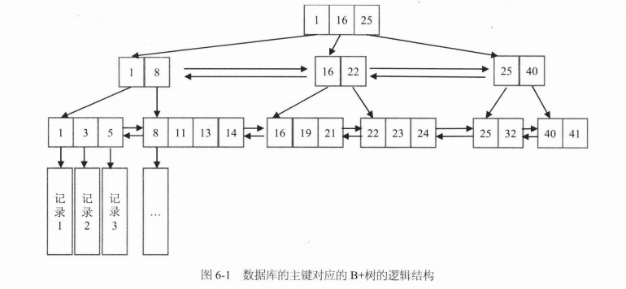
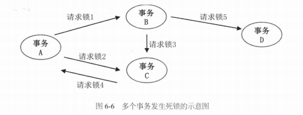
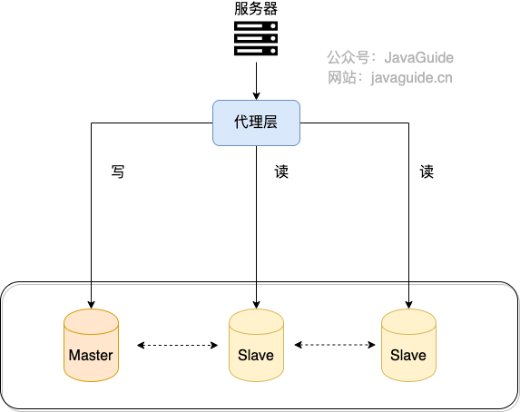

# 数据库

[TOC]

## B+ Tree

关系型数据库在查询方面有一些重要特性：

1. 范围查询
2. 前缀匹配模糊查询
3. 排序和分页

这得益于  B+ 树这种数据结构，它的逻辑结构如下：



- 在叶子节点一层，所有记录的主键按照从小到大的顺序排列，并且形成了一个双向链表。
- 非叶子节点取的是叶子节点里面 Key 的最小值。

以上图为例，我们说明如何实现上述特性：

- 范围查询。比如要查主键在`[1,17]`之间的记录。二次查询，先查找 1 所在的叶子节点的记录位置，再查找 17 所在的叶子节点记录的位置（就是16所处的位置），然后顺序地从 1 遍历链表直到 16 所在的位置。
- 前缀匹配模糊查询。假设主键是一个字符串类型，要查询 `where Key like abc%` 其实可以转化成一个范围查询 `Key in [abc,abcz]`。当然，如果是后缀匹配模糊查询，或者诸如 where Key like %c% 这样的中间匹配，则没有办法转化成范围查询，只能挨个遍历。
- 叶子节点天然是排序好的，支持排序和分页。

对于 `select xxxwhere xxx limit 1000,10`，需要遍历前面 1000 个叶子节点，才能获取数据。我们将 `offset=1000` 的位置换算成某个`max_id`，然后可以使用 `select xxx where xxx and id>max_id limit 10`，这样就可以利用 B+  树的特性，快速定位到 `max_id` 所在的位置，即是 `offset=1000` 所在的位置。

在 InnoDB 的实践里面，其中一个建议是按主键的自增顺序插入记录，就是为了避免节点分裂现象。

## 索引

索引常用的数据结构有：

- 哈希表：由于不是存储有序的，在区间查询时，需要全部扫描一遍。**只适用于等值查询的场景**
- 有序数组：插入删除操作很费时。**在等值查询或者范围查询的场景中，性能就非常优秀。**
- B+树：兼顾了插入、查询的性能。


索引的类型有：

1. 普通索引（由关键字 KEY 或 INDEX 定义），值可以重复
2. 唯一索引（由关键字 UNIQUE 定义）要求值必须唯一，但允许有空值
3. 主键索引（由关键字 PRIMARY 定义）
4. 全文索引


每个索引都有一颗 B+ 树。按叶子节点如何存储数据，索引可以分为：

- 聚簇索引：叶子节点存放的是实际数据，所有完整的用户记录都存放在聚簇索引的叶子节点；
- 二级索引：叶子节点存放的是主键值，而不是实际数据。

下面我们来看一个二级索引的例子：

~~~sql
create table T(
    id int primary key, 
    k int not null, 
    name varchar(16),
    index (k));
~~~


InnoDB 在创建聚簇（主键）索引时，会根据不同的场景选择不同的列作为索引：

- 如果有主键，默认会使用主键作为聚簇索引的索引键；
- 如果没有主键，就选择第一个不包含 NULL 值的唯一列作为聚簇索引的索引键；
- 在上面两个都没有的情况下，InnoDB 将自动生成一个隐式自增 id 列作为聚簇索引的索引键；

注意：一张表只能有一个聚簇（主键）索引。


如果某个查询语句使用了二级索引，在二级索引找到主键值后，需要去聚簇索引中获得数据行，这个过程就叫作「回表」。所以基于回表的情况，非主键索引的查询需要多扫描一棵索引树。因此，在应用中应该尽量使用主键查询。

**覆盖索引**是指直接从非主键索引中就能查到的记录，而不需要查询主键索引中的记录，避免了回表的产生减少了树的搜索次数，显著提升性能。如果查询的字段都在某个索引上，MySQL可以直接从索引中获取所需数据，而无需回表。

下面我们来看一个覆盖索引的例子：

~~~sql
create table T (
ID int primary key,
k int NOT NULL DEFAULT 0, 
s varchar(16) NOT NULL DEFAULT '',
index k(k));
insert into T values(100,1, 'aa'),(200,2,'bb'),(300,3,'cc'),(500,5,'ee'),(600,6,'ff'),(700,7,'gg');
~~~

对应索引树的结构如下：


当执行 `select * from T where k between 3 and 5;`时：

1. 会在 k 二级索引树上，找到 k=3 的记录，获取 ID=300.
2. 然后在 ID 索引树上，查找 300 对应的行 R3.
3. 在 K 索引树上，取得 ID=500.
4. 然后在 ID 索引树上，查找 500 对应的行 R4.
5. 在 K 索引树上，取 k=6，发现无法取到，退出。

但当我们执行 `select ID from T where between 3 and 5;` 时，由于想要查询的 ID 列，已经在 K 二级索引上了，索引就省去了再去搜索主键索引的步骤。


下面几种情况会导致索引失效，从而走了全表扫描：

- 对索引使用左或者左右模糊匹配，`like %xx` 或者 `like %xx%`
- 对索引使用函数
- 对索引进行表达式计算
- 对索引隐式类型转换
- 联合索引非最左匹配


只包含一个字段的索引叫做**单列索引**，包含两个或以上字段的索引叫做**复合索引**（或组合索引）。在 MySQL 建立联合索引时，会遵守最左前缀匹配原则，下面这个 SQL 语句在 列 X，列 Y，列 Z 上建立了一个复合索引。

```mysql
CREATE INDEX 索引名 ON 表名(列名X, 列名Y, 列名Z);
```

其实这**等价于**建立了三个索引，分别是：

1. 单列索引（列 X）
2. 复合索引（列 X, 列 Y）：索引结构是先按 X 排序，再按 Y 排序。
3. 复合索引（列 X，列 Y，列 Z）

推荐在检索数据时遵循索引的最左前缀匹配原则，否则索引会失效

~~~sql
SELECT * FROM XXX WHERE X = 1 AND Y = 2	-- 使用了索引
SELECT * FROM XXX WHERE Y = 2 		    -- 未使用索引
~~~


索引下推：当查询的内容大于索引的内容，无法利用覆盖索引时。会根据最左前缀原则，根据查找的条件先过滤，然后再回表，从而减少回表的次数。达到性能的提升。举个例子，我们有联合索引（name，age），现在查询 `select * from tuser where name like '张%' and age=10 and ismale=1;`。那么根据 name 与 age


有两种给字符串类型的字段建立索引的方式：

1. 全字段索引：直接给 `email` 字段建立索引，`alter table t add index index1(email);`
2. 前缀索引：建立 `email` 的前缀索引：`alter table t add index index2(email(6));`

全字段索引的优势在于它可以避免回表，而前缀索引还要回到主键索引树查询数据，但是它占用的空间更小。

假设在 user 表中存在`zhangsp1234@gmail.com`, `zhangs1pzxyz@qq.com` , `zhangssxyz@xxx.com`, 三条记录。

有这样一条语句 `select id,name,email from SUser where email='zhangssxyz@xxx.com';`

使用 index1 索引时，流程如下：

1. 在 index1 中，找到名字是 `zhangssxyz@xxx.com` 的记录，获取 ID.
2. 在主键索引上对应 ID的行，判断 email 是否正确，将记录加入结果集。
3. 接着取 index1 索引的下一条记录，发现不满足 email 格式，结束循环。

使用 index2 索引：

1. 在 index2 中，找到名字是 `zhangs` 的记录，获取 ID.
2. 在主键索引上对应 ID 的行，这时拿到的是 `zhangss1234@gmail.com` 的行， 发现不符合，丢弃。
3. 接着在 index2 循环，拿到下一条记录 ID。
4. 在主键索引上对应 ID的行，这时拿到的是 `zhangsspzxyz@qq.com` 的行， 发现不符合，丢弃。
5. 接着在 index2 循环，拿到下一条记录 ID。
6. 在主键索引上对应 ID的行，这时拿到的是 `zhangssxyz@xxx.com` 的行， 发现符合，纳入结果集。
7. 接着在 index2 循环，发现记录格式不符合，结束循环。

但是如果能合适的设置前缀索引的长度，就能减少回表的次数，从而在空间和效率上取得平衡。这其中的关键就在于前缀的区分度，我们可以执行以下语句来判断不同前缀长度下的区分度

~~~sql
select
    count(distinct left(email,4)) as L4,
    count(distinct left(email,5)) as L5,
    count(distinct left(email,6)) as L6,
    count(distinct left(email,7)) as L7,
from t;
~~~

对于身份证号这种的前缀大量重复的，我们可以采用以下方式来处理：

- 倒叙：`select field_list from t where id_card = reverse('input_id_card_string');`

- crc32：`select field_list from t where id_card_crc = crc32('input_id_card_string') and id_card='input_id_card_string'`

  创建一个整数字段，来保存字符串的哈希值, 并为该字段创建索引。但由于 `crc32()` 只有 32 位的特性，容易发生 hash 碰撞，因此我们还要做进一步判断 `id_card='input_id_card_string'`

## 事务

事务是指一组读写操作的逻辑单元。**事务往往会被赋予AID属性**，来保证数据的一致性（**C**onsistency）：

- **原子性**（**A**tomic）：，事务保证了在同一项业务处理过程中，对多个数据的修改，要么同时成功，要么同时被撤销。
- **隔离性**（**I**solation）：事务保证了在不同的业务处理过程中，各自业务正在读、写的数据互相独立，不会彼此影响。
- **持久性**（**D**urability）：事务应当保证所有成功被提交的数据修改都能够正确地被持久化，不丢失数据。
- **一致性**（**C**onsistency）：数据库完整性约束，例如外键约束、Check 约束、Unique 约束等等

**可见，A、I、D 是手段，C 是目的**。

- **内部一致性**：一个服务只使用一个数据源时的事务间一致性。

  通过 A、I、D 来获得一致性是最经典的做法。此时，多个并发事务所读写的数据能够**由数据源感知是否存在冲突**，并发事务的读写在时间线上的最终顺序是由数据源来确定的。

- **外部一致性**：一个服务使用到多个不同的数据源时的事务间一致性

  外部一致性问题通常很难再使用 A、I、D 来解决，但是外部一致性是分布式系统中必然会遇到的问题。为此，我们要转变观念，即从「是或否」的二元属性转变为可以按不同强度分开讨论的多元属性。在确保代价可承受的前提下，获得强度尽可能高的一致性保障。

**数据源是指提供数据的逻辑设备**

>如今要研究事务的实现原理，必定会追溯到**ARIES 理论（Algorithms for Recovery and Isola tion Exploiting Semantics，ARIES，基于语义的恢复与隔离算法）**。
>
>在 20 世纪 90 年代，[IBM Almaden 研究院](http://www.research.ibm.com/labs/almaden/)总结了研发原型数据库系统“IBM System R”的经验，发表了 ARIES 理论中最主要的三篇论文，其中《[ARIES: A Transaction Recovery Method Supporting Fine-Granularity Locking and Partial Rollbacks Using Write-Ahead Logging](https://cs.stanford.edu/people/chrismre/cs345/rl/aries.pdf)》着重解决了 ACID 的其中两个属性：原子性（A）和持久性（D）在算法层面上应当如何实现。而另一篇《[ARIES/KVL: A Key-Value Locking Method for Concurrency Control of Multiaction Transactions Operating on B-Tree Indexes](http://vldb.org/conf/1990/P392.PDF)》则是现代数据库隔离性（I）奠基式的文章

## 隔离性

数据库通过锁机制来实现隔离性：

- **写锁**（Write Lock，也叫作排他锁，eXclusive Lock，简写为 X-Lock）：如果数据被加上写锁，其他事务不能施加读锁或者写锁。

- **读锁**（Read Lock，也叫作共享锁，Shared Lock，简写为 S-Lock）：多个事务可以对同一个数据添加多个读锁，数据被加上读锁后就不能再被加上写锁。

- **范围锁**（Range Lock）：加了范围锁后，**约定**其他事务无法修改该范围内已有的数据，也不能在该范围内新增或删除任何数据


下面是不同级别的隔离性，依次从强到弱：

- **可串行化**：对事务所有读、写的数据全都加上写锁和范围锁，或者读锁和范围锁，一直持续到事务结束。串行化访问提供了强度最高的隔离性。但是[并发控制理论](https://en.wikipedia.org/wiki/Concurrency_control)（Concurrency Control）阐述了隔离程度与并发能力是负相关的，即隔离程度越高，并发访问时的吞吐量就越低。

- **可重复读（Repeatable Read）**：对事务所涉及的数据加读锁或者写锁，一直持续到事务结束。

  它存在[幻读问题](https://en.wikipedia.org/wiki/Isolation_(database_systems)#Phantom_reads)（Phantom Reads），例如：

  ~~~sql
  SELECT count(1) FROM books WHERE price < 100					/* 时间顺序：1，事务： T1  暂不提交*/
  INSERT INTO books(name,price) VALUES ('深入理解Java虚拟机',90)	/* 时间顺序：2，事务： T2  提交*/
  SELECT count(1) FROM books WHERE price < 100					/* 时间顺序：3，事务： T1 提交*/
  ~~~

  两次相同的查询就会得到不一样的结果，原因是可重复读没有范围锁，来禁止在该范围内插入新的数据。

- **读已提交（Read Committed）**：对事务涉及的数据加的写锁，一直持续到事务结束，但加在查询操作上的读锁，在查询完成后就马上会释放。

  它存在[不可重复读问题](https://en.wikipedia.org/wiki/Isolation_(database_systems)#Non-repeatable_reads)（Non-Repeatable Reads），例如：

  ~~~sql
  SELECT * FROM books WHERE id = 1;   						/* 时间顺序：1，事务： T1 */
  UPDATE books SET price = 110 WHERE id = 1; COMMIT;			/* 时间顺序：2，事务： T2 提交*/
  SELECT * FROM books WHERE id = 1; COMMIT;   				/* 时间顺序：3，事务： T1 提交*/
  ~~~

  这两次重复执行的查询结果就会不一样，原因是读已提交的隔离级别缺乏贯穿整个事务周期的读锁，无法禁止读取过的数据发生变化。

- **读未提交（Read Uncommitted）**：只对事务涉及的数据加上写锁，会一直持续到事务结束，但完全不加读锁。

  它存在[脏读问题](https://en.wikipedia.org/wiki/Isolation_(database_systems)#Dirty_reads)（Dirty Reads），例如：

  ```sql
  SELECT * FROM books WHERE id = 1;   						/* 时间顺序：1，事务： T1 */
  
  UPDATE books SET price = 90 WHERE id = 1;					/* 时间顺序：2，事务： T2 暂不提交*/
  
  SELECT * FROM books WHERE id = 1;		
  /* 时间顺序：3，事务： T1 */
  /* 如果这里是读已提交，那么 T1 因要施加读锁而一直被阻塞，直到 T2 提交了事务 */
  
  ROLLBACK;			  										/* 时间顺序：4，事务： T2 */
  ```

脏写问题（Dirty Write），即一个事务的没提交之前的修改，可以被另外一个事务的修改覆盖掉。脏写已经不单纯是隔离性上的问题了，它连事务的原子性都无法实现，所以在谈论隔离级别时，不会将它纳入讨论范围内。


针对这种「一个事务读 + 另一个事务写」的隔离问题，近年来有一种名为**[多版本并发控制](https://en.wikipedia.org/wiki/Multiversion_concurrency_control)（Multi-Version Concurrency Control，MVCC）**的无锁优化方案被业界广泛采用。**它的「无锁」是特指读取时不需要加锁。**  **读不阻塞写，写不阻塞读**。我们称由多版本并发控制实现的隔离为**快照隔离**

 **MVCC 是典型的 CopyOnWrite 方案。**基本思路是对数据库的任何修改，都不会直接覆盖之前的数据，而是产生一个新版副本与老版本共存，以此达到读取时可以完全不加锁的目的。其中版本可以理解为每一行记录都存在两个不可见的字段：`CREATE_VERSION` 和 `DELETE_VERSION`，这两个字段记录的值都是事务 ID，事务 ID 是一个全局严格递增的数值，然后根据以下规则写入数据：

- 插入数据时：CREATE_VERSION 记录插入数据的事务 ID，DELETE_VERSION 为空。
- 删除数据时：DELETE_VERSION 记录删除数据的事务 ID。当确定没有事务可以再访问已删除的数据时，数据库中的垃圾收集器会将所有带有删除标记的行移除，并释放其空间
- 修改数据时：将修改数据视为「删除旧数据，插入新数据」的组合，即先将原有数据复制一份，原有数据的 DELETE_VERSION 记录修改数据的事务 ID。复制出来的新数据的 CREATE_VERSION 记录修改数据的事务 ID，DELETE_VERSION 为空。

可见性规则如下：

- 由具有较晚事务ID（即，在当前事务开始之后开始的）的事务所做的任何写入都被忽略，而不管这些事务是否已经提交。
- 在每次事务开始时，数据库列出当时所有其他（尚未提交或中止）的事务清单，即使之后提交了，这些事务的写入也都会被忽略。
- 所有其他写入，对应用都是可见的。


如果是两个事务同时修改数据，即“写+写”的情况，那就没有多少优化的空间了，此时加锁几乎是唯一可行的解决方案。


此外，加锁的策略可以分为

- **“乐观加锁”（Optimistic Locking）**：认为事务之间数据存在竞争是偶然情况，没有竞争才是普遍情况，这样就不应该在一开始就加锁，而是应当在出现竞争时再找补救措施。
- **“悲观加锁”（Pessimistic Locking）**：认为不先做加锁再访问数据，就肯定会出现问题。

如果竞争剧烈的话，乐观锁反而更慢。


死锁检测就是发现有向图中存在着环。



检测到死锁后，数据库可以强制让其中某个事务回滚，释放掉锁，把环断开，死锁就解除了。

## MySQL 锁

MySQL 中的锁可以按照粒度分为**锁定整个表的表级锁**（table-level locking）和**锁定数据行的行级锁**（row-level locking）。InnoDB 存储引擎默认情况下采用行级锁。

InnoDB 实现了以下两种类型的 **行锁**：

- **共享锁**（S）：**阻止其他事务**取得该数据行上的排他锁。允许多个共享锁同时存在
- **排他锁**（X）：**阻止其他事务**取得该数据行上的共享锁和排他锁。


下面我们通过一个例子来说明 MySQL 中的锁机制。首先创建一个表：

~~~sql
create table t(
  id int auto_increment primary key,
  c1 int,
  c2 int,
  c3 int
);
create unique index idx_t_c1 on t(c1);
create index idx_t_c2 on t(c2);
~~~

在默认隔离级别下 Repeatable read，对于 Update、Delete、Insert 语句，会自动加行锁。**如果 Update 的 Where 子句所涉及到的字段没有索引的话，那么就添加表锁。这对于 Delete 也同样成立。**而对于 Select，需要手动加锁。

- 设置共享锁：

  ~~~sql
  select * from t where id = 1 for share;
  ~~~

- 设置排他锁：

  ~~~sql
  select * from t where id = 1 for update;
  ~~~

`rollback` 或者 `commit` 会释放这些行锁（包括下面的表锁）。

注意 InnoDB 中的自动提交 autocommit 默认设置为 ON，即每个查询都被当做一个单独的事务自动执行。要使用事务特性，那么就要将 autocommit 设置为 OFF。

实际上，InnoDB 表存在两种表级锁，一种是`LOCK TABLES`语句手动指定的表级锁，另一种是由 InnoDB 自动添加的意向锁。

~~~sql
lock tables t read; 		-- 为表 t 加上表级共享锁
lock tables ... write; 		 -- 为表 t 加上表级排他锁
unlock tables;				-- 释放锁
~~~

如果一个表要添加表级锁，出于并发安全性考虑，那么它必须遍历每行，查看是否添加了行级锁，这种方式效率很低。因此，MySQL 引入了意向锁。**意向锁属于表级锁**，由 InnoDB 自动添加

- **意向共享锁**（IS）：事务在添加行级共享锁之前，必须先取得该表的 IS 锁。
- **意向排他锁**（IX）：事务在添加行级排他锁之前，必须先取得该表的 IX 锁。

​	

以下是两个不同事务之间的**表级锁**（不是行级锁）和**意向锁**的兼容性：


简单来说，**意向锁和表锁之间只有共享锁兼容，意向锁和意向锁之间都可以兼容**。

注意：在本事务的表级锁加锁过程中，如果发现表上**只有本事务的意向锁**，那么就无视上述兼容性规则，并且在获取到表级锁后，会尝试释放本事务的所有行级锁。


具体来说，InnoDB 实现了四种行级锁（为例简化讨论，以下均假设为写锁）

- **记录锁（Record Lock）**：锁住某个记录行
- **间隙锁（Gap Lock）**：当隔离级别为`Repeatable Read`和`Serializable`时，才会启用间隙锁。锁定一个左开右开的区间，这可以避免幻读问题。
- **Next-key 锁（Next-key Lock）**：锁定一个左开右闭的区间。假如一个索引有 2、4、5、9、12 五个值，那该索引的邻键锁范围为：(-∞ , 2]，(2 , 4]，(4 , 5]，(5 , 9]，(9 , 12]，(12 , +∞)
- **插入意向锁**：它并非是意向锁，而是一种特殊的间隙锁，它表示一种插入的意图，但是如果插入到相同间隙中的多个事务没有插入相同记录行，则不需要互相等待。假设存在索引记录 4 和 7。两个事务分别尝试插入 5 和 6，它们在获取行排他行锁之前，分别使用插入意向锁来锁定 4 到 7 之间的间隙；但是不会相互阻塞，因为插入的是不同的行。

实际上，Next-Key 才是基本的加锁单位，只有在满足特定情况下，才退化为间隙锁或者记录锁。注意，对于普通索引的加锁，除了在普通索引项本身上加锁外，还会在对应的主键索引项上加锁。

实际在 Innodb 存储引擎中，会用特殊的记录来标识最小以及最大一条记录，该特殊的记录的名字叫 infimum record、supremum pseudo-record，分别代表 -∞、∞

下面通过一个案例来总结一下加锁规则：

|  ID  | age  | name |
| :--: | :--: | :--: |
|  1   |  19  |      |
|  5   |  21  |      |
|  10  |  22  |      |
|  15  |  20  |      |
|  20  |  39  |      |

id 是主键索引（唯一索引），age 是普通索引（非唯一索引），name 是普通的列。


对于唯一索引的等值查询

- 若记录存在，那么索引中的 next-key lock 会退化成「记录锁」

  

- 若记录不存在，那么索引中的 next-key lock 会退化成「间隙锁」

  

在唯一索引范围查询中，在范围内的记录都会加上一个 Next-Key，

1. 但是如果条件值正好是一个记录，且是 `<` 或者 `>`，那么该条件值对应的 Next-key 将退化为间隙锁
2. 但是如果条件值正好是一个记录，且是 `>=`，那么条件值对应的 Next-key 将退化为记录锁
3. 如果条件值并不是一个记录，那么再加上一个包括条件值的间隙锁

1、2 确保了加锁的粒度尽可能小，下面是各个查询条件对应的锁：


- `<5`：(-∞, 1)、(1,5)
- `<=5`：(-∞, 1)、(1,5]
- `<6`：(-∞, 1)、(1,5]、(5, 10)
- `>15`：(15,20]、(20, +∞)
- `>=15`：15、(15,20]、(20, +∞)


普通索引等值查询：

- 若记录不存在，那么索引中的 next-key lock 会退化成「间隙锁」

  以上面例子来说，如果查询 age = 25，那么就加上  (22, 39) 这个间隙锁。

  二级索引树是按 age 列的顺序存放，在相同的二级索引值情况下， 再按主键 id 的顺序存放。所以在这个例子中，插入一条 age = 22，id = 3 的记录，该位置的下一条是 id = 10、age = 22 的记录，该记录的二级索引并没有加锁，所以这条插入语句可以执行成功。

  但是当其他事务插入一条 age = 22，id = 12 的记录的时候，该位置的下一条是 id = 20、age = 39 的记录，正好该记录的二级索引上有间隙锁  (22, 39) ，所以这条插入语句会被阻塞，无法插入成功。

- 若记录存在，除了会加 next-key lock 外，还额外加下一个区间的间隙锁。

  以上面例子来说，如果查询 age = 22，那么加上(21, 22] 的 next-key 锁以及  (22, 39)这个间隙锁


普通索引的范围查询，在范围内的记录都会加上一个 Next-Key，如果条件值并不是一个记录，那么再加上一个包括条件值的 Next-Key。可见它与唯一索引的范围查询的差别是，它并不会退化。下面是各个查询条件对应的锁：

- `>=22`：(21,22]、(22,39], (39, +∞)


没有使用索引列作为查询条件，或者查询语句没有走索引查询，从而导致全表扫描。那么，每一条记录的索引上都会加 next-key 锁，这样就相当于锁住的全表（并不是加了表锁），这时如果其他事务对该表进行增、删、改操作的时候，都会被阻塞。解决方案：

- 如果发现即使在 where 条件中带上了索引列，优化器走的还是全标扫描，这时我们就要使用 `force index([index_name])` 可以告诉优化器使用哪个索引。

- 我们可以启动 MySQL sql_safe_updates 参数，这样可以预防 update 操作时 where 条件没有带上索引列。

  


需要补充的是：

- **写锁间隙锁与写锁间隙锁之间是兼容的**，间隙锁的意义只在于阻止区间被插入，因此是兼容的。
- **插入意向锁与间隙锁是冲突的**
-  **next-key 锁之间并不是兼容的**


下面我们来看一到场景题：


这是因为 time1 的 update 与 time2 的 update 都获取了在 (20, 30) 的间隙锁。然后事务 A 在 time3 执行 insert 时，会被事务 B 的间隙锁阻塞。而然后事务 B 在 time4 执行 insert 时，会被事务 A 的间隙锁阻塞。


## 原子性和持久性

由于写入中间状态与崩溃都是无法避免的，为了保证原子性和持久性，就只能在崩溃后采取恢复的补救措施——「崩溃恢复」。

### Commit Logging

通过「Commit Logging」（提交日志）来实现事务的原子性和持久性是当今的主流方案，基本思路是

1. 将修改数据这个操作所需的全部信息，包括修改什么数据、数据位于哪个磁盘块中、从什么值改成什么值，等等，以日志的形式（在文件末尾顺序追加）记录到磁盘中
2. 写入完成后，会追加「提交记录」（Commit Record），表示事务成功提交。
3. 然后根据日志上的信息对真正的数据进行修改，并持久化到位于磁盘的数据结构中
4. 修改完成后，再往日志中加入一条「结束记录」（End Record），表示事务已完成持久化。

日志一旦成功写入 Commit Record，那整个事务就是成功的，即使真正修改数据时崩溃了，重启后根据已经写入磁盘的日志信息恢复现场即可，这保证了持久性；其次，如果日志没有成功写入 Commit Record 就发生崩溃，那整个事务就是失败的，系统重启后会看到没有 Commit Record 的日志，那将这部分日志标记为回滚状态即可，这保证了原子性。

> 还有另外一种称为 [Shadow Paging](https://en.wikipedia.org/wiki/Shadow_paging) 的事务实现机制。大体思路是当写入数据时，先复制一份副本，保留原数据，修改副本数据。当事务成功提交后，去修改引用数据的指针，现代磁盘的写操作可以保证这个修改指针的操作是原子性的。
>
> Shadow Paging 实现事务要比 Commit Logging 更加简单，但涉及隔离性与并发锁时，Shadow Paging 实现的事务并发能力就相对有限，因此在高性能的数据库中应用不多。

Commit Logging 存在一个先天缺陷，所有对数据的真实修改都必须发生在事务提交以后，即日志写入了 Commit Record 之后，即使之前你的磁盘 I/O 足够空闲。

### Write-Ahead Logging

ARIES 提出了「Write-Ahead Logging」的日志改进方案，它将写入数据的时机，按照事务提交时点为界，划分为 FORCE 和 STEAL 两类情况

- **FORCE**：在事务提交前，强制将所有的脏页写到磁盘上。这样就不需要 Redo Log 了。**这里我们有个不切实际的假设，就是冲刷到磁盘的操作是原子的。**
- **NO FORCE**：当页从 buffer pool 中驱逐出去的时候，才会写回磁盘。为了保证持久性，先把 Redo Log 写入日志文件。
- **STEAL**：允许将在缓冲池中未提交的页提前冲刷到磁盘中。有利于利用空闲 I/O 资源，也有利于节省数据库缓存区的内存。为了保证原子性，先把 Undo Log 写入日志文件。
- **NO STEAL**：禁止 STEAL，这样就不需要 Undo Log 了。

可以两两组合出四种情况


显然 Commit Logging 是 NO-FORCE，NO-STEAL 的；而接下来介绍的 Write-Ahead Logging 是 NO-FORCE，STEAL。从优化磁盘 I/O 的角度看，NO-FORCE + STEAL 组合的性能无疑是最高的，但复杂度无疑也是最高的。这也是业界的主流方案。

Write-Ahead Logging 在崩溃恢复时会执行以下三个阶段的操作：

- **分析阶段**（Analysis）：该阶段从最后一次检查点开始扫描日志，找出所有没有 End Record 的事务，组成待恢复的事务集合
- **重做阶段**（Redo）：找出所有包含 Commit Record 的日志，将这些日志修改的数据写入磁盘，写入完成后在日志中增加一条 End Record，然后移除出待恢复事务集合。
- **回滚阶段**（Undo）：此时剩下的都是需要回滚的事务，根据 Undo Log 中的信息，将已经提前写入磁盘的信息重新改写回去

重做阶段和回滚阶段的操作都应该设计为幂等的。

## Binlog 

|  redo log  |   binlog    |
| :--------: | :---------: |
| InnoDB引擎 | MySQL Serve |
|  物理日志  |  逻辑日志   |
|  循环写入  |  追加写入   |

Binlog 全局只有一份，每个事务都要串行地写入，这就要求每个事务在写 Binlog 之前要拿一把锁。这在性能上存在很大问题。MySQL 5.6 中引入了 Group Commit 来解决这个问题，思想就是 HTTP 1.1 中的 pipeline 机制。  

一个事务的提交既要写 Binlog，也要写 Redo Log，通过内部分布式事务管理器 XA 来解决它们的数据一致性问题。它保证：

1. 从库只有在主库提交之后，才能读到主库写入的 binlog 日志。
2. 事务回滚之后 binlog 并不会写入磁盘。


MySQL 的三种主从复制方式


另外，还有一个参数 `rpl_semi_sync_master_wait_slave_count`可以设置在半同步复制模式下，需要等待几个（默认是 1 个） Slave 的 ACK，才认为事务提交成功。


## MySQL 为什么要用 B+ Tree 

红黑树：任一节点左、右子树的高度，相差不得超过两倍。在某些场景下，IO 性能较差。

B 树中每个节点（包括叶节点和非叶节点）都存储真实的数据，B+ 树中只有叶子节点存储真实的数据，非叶节点只存储键。并且B+树的叶节点之间通过双向链表链接。这就导致：

- **更少的 IO 次数：** B+树的非叶节点只包含键，而不包含真实数据，因此每个节点存储的记录个数比 B 数多很多（即阶 m 更大），因此 B+ 树的高度更低，访问时所需要的 IO 次数更少
- **更适于范围查询：** 在 B 树中进行范围查询时，首先找到要查找的下限，然后对 B 树进行中序遍历，直到找到查找的上限；而 B+ 树的范围查询，只需要对链表进行遍历即可。

## MySQL 故障转移

在使用 ShardingSphere 插件的情况下，推荐采用 VIP 的方式来实现 MySQL 故障转移。

不推荐使用 DNS 解析域名的方式，因为如果运营商强制设置了更长的 TTL，DNS 记录对用户来说并不会立即生效。

## 分库分表

根据数据的访问频率和业务重要性，将数据分为冷数据和热数据，冷数据一般存储在存储在低成本、低性能的介质（机器硬盘）中，热数据高性能存储介质（固态硬盘）中。

冷数据迁移方案：

1. 业务层代码实现：当有对数据进行写操作时，触发冷热分离的逻辑。这种方式入侵度太高，不建议使用。
2. 任务调度：可以利用 xxl-job 或者其他分布式任务调度平台定时去扫描数据库，找出满足冷数据条件的数据，然后批量地将其复制到冷库中，并从热库中删除。
3. 人工迁移


读写分离的方案：

- 代理方式：

  

  在应用和数据中间加了一个代理层，应用程序所有的数据请求都交给代理层处理。提供类似功能的中间件有 **MySQL Router**、**Atlas**

-  **组件方式**：引入第三方组件来代理我们的读写请求。例如 shardingsphere


**分库**就是将数据库中的多张表分散到不同的数据库上，可以垂直分库，也可以水平分库。这些数据库一般在不同的主机上。

- **垂直分库**：把多张表按照业务进行划分，不同的业务使用不同的数据库
- **水平分库**：同一个表按一定规则拆分到不同的数据库中

**分表**就是对单表的数据进行拆分，可以是垂直拆分，也可以是水平拆分。

- 对数据表列的拆分，把一张列比较多的表拆分为多张表。
- 对数据表行的拆分，把一张行比较多的表拆分为多张表，可以解决单一表数据量过大的问题。

分库解决了数据库读写QPS过高，连接数不足的问题；而分表解决了单表数据量过大，存储性能遇到瓶颈问题。但是引入分库分表后，又出现了新的问题：

1. **join 操作**：原本在同一个数据库中的表分布在了不同的数据库中，导致无法使用 join 操作。这样就导致我们需要手动进行数据的封装。
2. **分布式事务问题**
3. **分布式 ID 问题**
4. 分库分表会导致常规聚合查询操作，如 group by，order by 等变得异常复杂。


如何进行数据迁移（库的迁移）呢？

**停机迁移**：在流量较小的时间段中暂停服务（通常为凌晨 4 点），写个脚本将老库的数据写到新库中。

双写方案

0. 首先要明确的一点是，根据阿里开发手册，表必备三个字段：`id`、`gmt_create`、`gmt_modified`。

1. 在把数据写入到旧库时，同时写入到新库。实现方式如下：

   1. 修改业务代码，业务与迁移过度耦合，并不推荐
   2. 捕获旧库上修改数据的日志（Canal 工具），并投送到消息队列中，然后按序消费队列里面的所有消息。通过消费者，我们可以将数据格式化，同步到异构的数据源中（ES）

2. 开一个线程，将旧库中的数据按 ID 顺序迁移到新库中。

   假设已经迁移数据的范围是 [start, current]，而未迁移的数据为 [current, latest]，那么考虑以下情况：

   - **insert**：旧库新库都插入了数据，数据一致性没有被破坏

   - **delete**：
     - 数据属于 [start, current] 范围，那么旧库新库都删除了该条数据，数据一致性没有被破坏。
     - 数据属于 [current, latest] 范围，直接 delete，此时 affect row = 0。在后续数据迁移中，这条被删除的数据并不会被迁移，所以数据一致性仍没有被破坏。
   - **update**：
     1. 数据属于 [start, current] 范围，旧库新库都更新了该条数据，数据一致性没有被破坏。
     2. 数据属于 [current, latest] 范围，此时新库将这条 update 操作改为 insert 操作即可保证数据一致性；

   总之，迁移过程中的 insert、delete、update 对数据一致性无影响。但是当数据重复时（由双写与迁移操作导致的数据不一致），如果 gmt_modified 小于新库中的数据，那么就不再写入，确保旧数据不会覆盖新数据。

   同时为了避免消息的重复投递，我们可以给消息维护一个版本号，与新库中数据的  gmt_modified 做对比。下面给出一个示例：

   

3. 将全部数据写入完成后，可能出现数据不一致的情况。例如：

   1. 数据迁移工具刚好从旧库中将某一条数据 X 取出，准备迁移到新库；
   2. 在 X 插入到新库中之前，旧库发生了 delete 操作，删除了这条数据，但是新库中尚未有迁移后的数据，故 affect rows 为 0；
   3. 双写完成后，数据迁移工具再将 X 插入到新库中；此时数据不一致发生了。

   保险起见，通过定时任务做多轮新老库的数据校验，具体思路是在新老库各选一个分块，然后聚合列数据并对比其特征值。在校验时候，建议上行锁，禁止对数据进行修改。如果校验不通过，那么以旧库中的数据为准，更新新库中对应的数据。
   
   或者直接禁写，然后对整张表进行对比。


基于行的迁移，在基于库的迁移上，进行 2N 平滑扩容。然后在校验完成之后，就按照正常的分片逻辑进行读写，并且在新旧数据库中，删除不符合分片规则的历史数据，与迁移期间的增量数据。


redo log 和 binlog 的差异如下表：

|  redo log  |   binlog    |
| :--------: | :---------: |
| InnoDB引擎 | MySQL Serve |
|  物理日志  |  逻辑日志   |
|  循环写入  |  追加写入   |

MySQL 会将 redo log 和 binlog 写入到内存中，在执行 commit 命令之后，进行两段提交操作，将 redo log 和 binlog 写入磁盘。因此在事务提交（commit 命令和 commit 事务状态要区分）之前，不会读取到 binlog 日志。同时，事务回滚一般发生在 commit 命令之前，所以事务回滚之后， binlog 并不会写入磁盘。

## SQL 优化

EXPLAIN 命令可以对 SQL 语句进行性能分析。

~~~shell
mysql> explain select * from user_info where id = 2\G
*************************** 1. row ***************************
           id: 1
  select_type: SIMPLE
        table: user_info
   partitions: NULL
         type: const
possible_keys: PRIMARY
          key: PRIMARY
      key_len: 8
          ref: const
         rows: 1
     filtered: 100.00
        Extra: NULL
1 row in set, 1 warning (0.00 sec)
~~~

- id: SELECT 查询的标识符。每个 SELECT 都会自动分配一个唯一的标识符。
- select_type：每个 select 的查询类型：

  - SIMPLE：简单 select，不使用 union 和子查询
  - PRIMARY：子查询中外层的 select 被标记为 PRIMARY
  - UNION：union 中后面的 select 语句
  - ...
- table: 查询涉及的表或衍生表
- type：它提供了查询是否高效的重要依据。不同的 type 类型的性能关系如下：
  `ALL < index < range ~ index_merge < ref < eq_ref < const < system`
  - **system：** 表只有一行记录

  - **const：** 针对主键或唯一索引的等值查询扫描

  - **eq_ref：** 通常出现在多表的 join 查询，表示对于前表的每一个结果，都只能匹配到后表的一行结果.

  - **ref：** 通常出现在多表的 join 查询，针对于非唯一或非主键索引,，或者是使用了最左前缀规则索引的查询.

  - **range：** 表示使用索引范围查询,

  - **index：** 全索引扫描。所要查询的数据直接在索引树中就可以获取到，而不需要扫描数据。

  - **all：** 全表扫描

 - key：此次查询中确切使用到的索引。
 - key_len：表示查询优化器使用了索引的字节数。
- rows：执行 SQL 语句所要读取的大致行数。注意这个不是结果集里的行数。
- extra: 额外的信息
  -  `Using filesort` ：, 表示 MySQL 需额外的排序操作
  -  `Using index`：覆盖索引扫描（type = index）, 表示查询在索引树中就可查找所需数据, 不用扫描表数据文件
  -  `Using temporary`：查询有使用临时表


以下几种情况导致数据库引擎放弃索引而进行全表扫描

- **在字段开头模糊查询**

  ~~~sql
  SELECT * FROM t WHERE username LIKE '%陈%'		# Error
  SELECT * FROM t WHERE username LIKE '陈%'		# OK
  ~~~

- 在 Where 语句中

  - 使用 in 和 not in

    ~~~sql
    -- 不走索引
    select * from A where A.id in (select id from B);
    
    -- 走索引
    select * from A where exists (select * from B where B.id = A.id);
    
    SELECT * FROM t WHERE id IN (2,3)		# Error
    SELECT * FROM t WHERE id BETWEEN 2 AND 3 # OK
    ~~~
  
  - 进行 null 值的判断
  
  - 用 <> 或者 !=
  
  - 隐式类型转换
  
  - order by 不与 where 中条件一致
  
    ~~~sql
    -- 不走age索引
    SELECT * FROM t order by age;
    
    -- 走age索引
    SELECT * FROM t where age > 0 order by age;
    -- 根据 where 条件生成执行计划
    -- 当执行 order by 时，先查看第一步的执行计划，如果 order by 的字段匹配到执行计划中的索引，那么利用索引顺序直接取得已经排好序的数据
    ~~~
  
  
  
  尽量批量插入：
  
  ~~~sql
  insert into T values(1,2); 
  insert into T values(1,3); 
  insert into T values(1,4);
  
  -- 批量插入 OK
  Insert into T values(1,2),(1,3),(1,4);
  ~~~

## MySQL/Mybatis 分页

Mybatis 内部使用 RowBounds 对象进行分页，需要注意的是，它是针对 ResultSet 结果集执行的内存分页，而非数据库分页。所以，在生产环境中，推荐使用如下两种方案：

- 原生 SQL

  ~~~sql
  select * from t_user limit #{start}, #{pageSize}
  ~~~

- 插件 `Mybatis-PageHelper`

查询偏移量过大的场景我们称为深度分页，这会导致查询性能较低，例如：

```sql
# MySQL 在无法利用索引的情况下跳过1000000条记录后，再获取10条记录
SELECT * FROM t_order ORDER BY id LIMIT 1000000, 10
```

通常有下面几种解决方案：

1. 根据 ID 范围进行分页，要求 ID 是连续的

   ~~~sql
   # 查询指定 ID 范围的数据
   SELECT * FROM t_order WHERE id > 100000 AND id <= 100010 ORDER BY id
   
   # 也可以通过记录上次查询结果的最后一条记录的ID进行下一页的查询：
   SELECT * FROM t_order WHERE id > 100000 LIMIT 10
   ~~~

2. 先查询出 limit 第一个参数对应的主键值，再根据这个主键值再去过滤并 limit，这样效率会更快一些。

   ~~~sql
   SELECT * FROM t_order WHERE id >= (SELECT id FROM t_order limit 1000000, 1) LIMIT 10;
   ~~~

   子查询的结果会产生一张新表，会影响性能。这种方案要求 ID 是正序的

3. 延迟关联：优化思路跟子查询的是一样的，都是把条件转移到主键索引树，减少回表的次数。

   ~~~sql
   SELECT t1.* FROM t_order t1
   INNER JOIN (SELECT id FROM t_order limit 1000000, 10) t2
   ON t1.id = t2.id;
   ~~~

4. 覆盖索引

   ~~~sql
   SELECT id, code, type FROM t_order
   ORDER BY code
   LIMIT 1000000, 10;
   ~~~

   
