# 分布式理论

[TOC]

## 概述

分布式系统是一个其组件分布在各种异构的计算机上，组件之间通过传递消息进行通信和协调，来共同完成某项任务的系统。

构建分布式系统的必然性：

- 高性能
- 可扩展性
- 高可用性

分布式系统必然面对的问题：

- 网络延迟问题
- 部分失效问题：单机系统上的程序要么正常工作，要么彻底出错。但在分布式系统中，系统的某些部分可能会以某种不可预知的方式宕机，这被称为部分失效（Partial Failure）。这种不可预知（不确定性）使得分布式系统难以捉摸和调试
- 时钟问题：在单机系统中，每个进程都有一个共同的时间。而在分布式系统中，每台机器都有自己的时钟，这使得节点之间的协调可能出现问题。

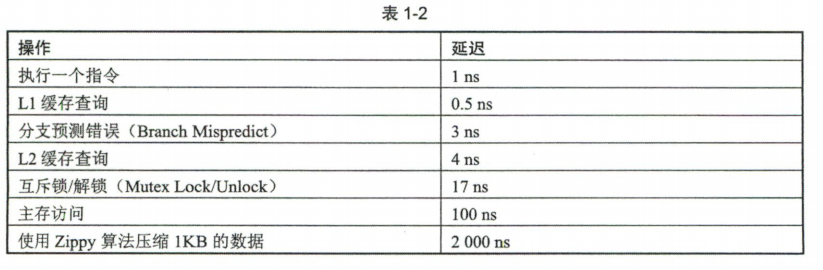

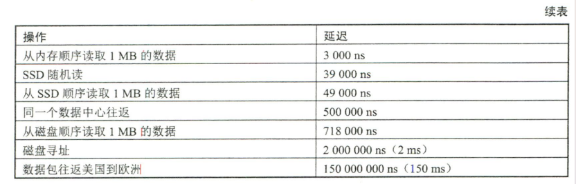

## 分布式系统模型

下面两个思想实验告诉我们，现实中的分布式系统，节点和网络都可能出现各种各样的故障，而我们的系统模型就是根据不同种类的故障抽象出来的。

### 两将军问题

两位将军必须通过信使沟通并约定攻击时间，并且他们都必须确保另一位将军知道自己已同意了进攻计划。但由于传递确认消息的信使可能被俘虏造成消息丢失，即使双方不断确认已收到对方的上一条信息，也无法确保对方已与自已达成共识。这也就是说两将军问题已被证明无解。

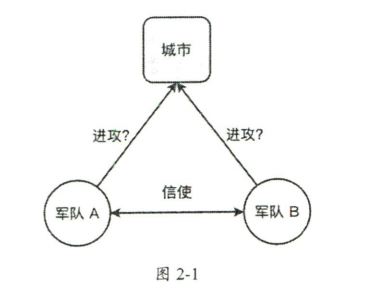

但计算机科学家们仍然找到了工程上的解决方案，我们熟悉的传输控制协议（TCP）的「三次握手」就是两将军问题的一个工程解。

### 拜占庭将军问题

拜占庭将军是两将军问题的扩展

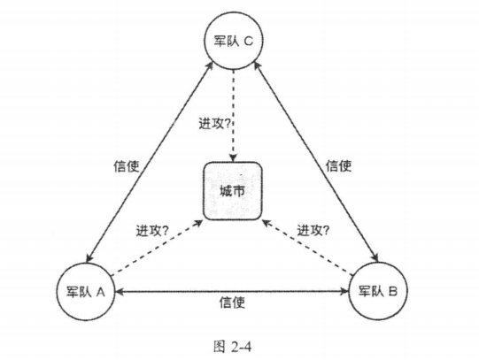

拜占庭将军问题的挑战在于，将军中可能出现叛徒，他们会试图故意误导和迷惑其他将军来破坏整个军事行动。上述故事映射到分布式系统里，将军便是计算机信使就是通信系统，而拜占庭故障模型描述的就是系统中某些成员计算机不仅会发生故障，甚至会故意篡改系统的系统模型

### 系统模型

在设计一个分布式系统的时候，我们必须清楚系统会发生哪种故障，然后寻找对应的解。不同的系统模型有着不同的算法和架构。我们按网络、节点故障和时间三种类型划分系统模型。

#### 网络链路模型

在分布式系统中，网络出错常导致的问题称为**网络分区 (Network Partition)** ，网络分区是指由于网络设备故障，导致网络分裂为多个独立的组。也就是节点仍然正常工作，但它们之间的通信连接已经中断 。

我们将网络链路分为以下几种：

- 可靠链路（Reliable Link）：不会丢失消息，也不会凭空捏造消息，但它可能对消息重新排序
- 公平损失链路（Fair-Loss Link）：消息可能会丢失、重复或重新排序，但消息最终总会到达。
  - **公平损失**：如果发送方和接收方都是正常运行的，且发送方不断重复发送消息 ，消息最终会被送达。这意味着任何网络分区（网络中断）只会持续有限时间。
  - **有限重复**：消息只会重复发送有限的次数
- **任意链路**（Arbitrary Link）：允许任意的网络链路执行任何操作，可能有恶意软件修改网络数据包和流量

这三种网络模型是可以互相转换的，例如，使用加密技术可以将任意链路变成公平损失链路。

#### 节点故障类型

故障类型主要分为以下三种：

- **崩溃一停止**：一个节点停止工作后永远不会恢复。这可能是不可恢复的硬件故障
- **崩溃一恢复**：允许节点重新启动，并继续执行剩余的步骤，
- **拜占庭故障**：故障的节点可能不只会宅机，还可能以任意方式偏离算法，甚至恶意破坏系统。

一般情况下，公司内部的大多数分布式系统都部署在私有和安全的环境中，我们只需考虑崩溃—XX 模型即可。

#### 时间划分系统模型

基于时间或者是否同步（Synchronous），我们可以将系统分为：

- 同步系统：一个消息的响应时间在一个有限且已知的时间范围内。
- 异步系统：一个消息的响应时间是无限的，即无法知道一条消息什么时候会到达。

同步系统更容易描述、编程和推理。然而，异步系统才是更接近现实的系统，我们无法确保整个系统的所有组件都正常运行，因此在两地之间发送消息便得不到有限时间内响应的保证。

此外还有部分同步系统模型，我们假设系统在大部分时间都是同步的，但偶尔会因为故障转变为异步系统。

### 消息传递语义

按照消息传递次数，有如下几种可能的消息传递语义：

- 最多一次 (At Most Once) ：消息最多传递一次。消息可能丢失，但不会重复
- 至少一次 (At Least Once）： 系统保证每条消息至少会发送一次。消息不会丢失，但在有故障的情况下可能导致消息重复发送。
- 精确一次 (Exactly Once） ：消息只会被精确传递一次，即消息不丢失不重复。

我们可以给每条消息一个唯一的标识符，重复的标识符忽略掉，这样我们可以保证操作的幂等性。

## 分布式数据

### 分区

分区是指将一个数据集拆分为多个较小的数据集，同时将存储和处理这些较小数据集的责任分配给分布式系统中的不同节点。分区增加了系统的可扩展性

分区类型有

- **垂直分区 (Vertical Partitioning)** ：对表的列进行拆分
- **水平分区（Horizontal Partitioning)**： 对表的行进行拆分

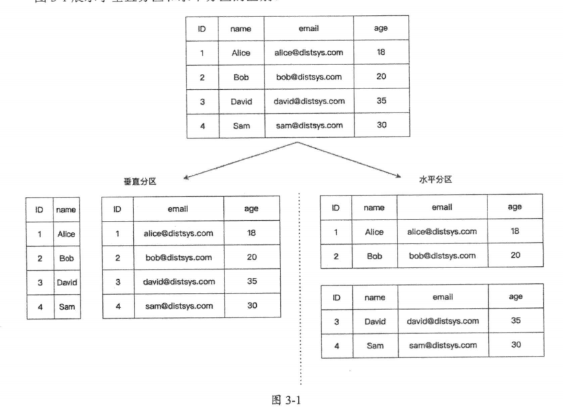

在分布式系统领域，水平分区常称为**分片（Sharding）**。

水平分区算法用来计算某个数据应该划分到哪个分区上：

- 范围分区
- 哈希分区
- 一致性哈希

首先介绍范围分区，它根据指定的关键字将数据集拆分为若干连续的范围

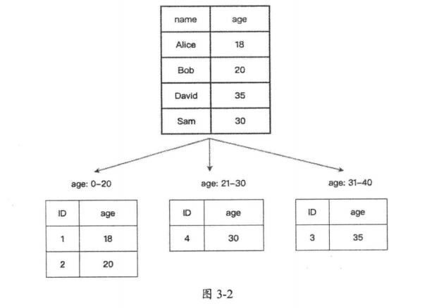

实现起来简单，但是有以下缺点：

- 数据分布不均或请求流量不均
- 无法使用分区键之外的其他关键字进行范围查询

哈希分区 (Hash Partitioning）是将指定的关键字经过哈希函数的计算，根据计算得到的值，来决定该数据集的分区

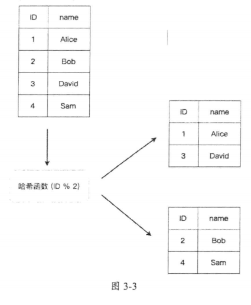

哈希分区的优点是，数据的分布几乎是随机的，所以分布相对均匀，能够在一定程度上避免热点问题。但是缺点如下：

- 在不额外存储数据的情况下，无法执行范围查询。
- 在添加或删除节点时，需要修改哈希函数，这会导致许多现有的数据都要重新映射，引起数据大规模迁移。

**一致性哈希 (Consistent Hashing)** 是一种特殊的哈希分区算法，用来缓解哈希分区增加或删除节点时所引起的大规模数据迁移问题。

一致性哈希一般要求哈希函数的输出值在 0 ~ $2^{32} - 1$上，这些输出值均匀地映射到哈希环边上。接下来同时将分布式系统的节点映射到圆环上。

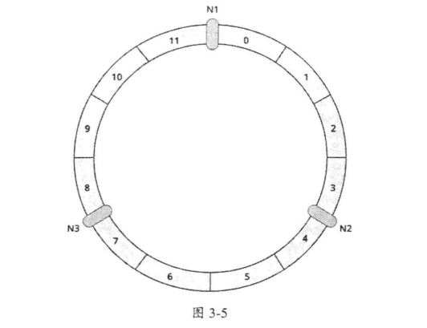

数据按照计算出的哈希值，存储在顺时针方向所遇到的第一个节点上。

以下图为例，如果要添加一个节点 N4。那么，按照顺时针计算的方法，原本存储在节点N2 上的关键字 a 要将转移到 N4 上，其他数据保持不动。

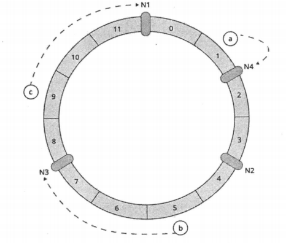

这样，数据迁移的范围就限定在了新节点与其相邻的节点之间。

考虑这种情况，当一个节点发生异常需要下线时，该节点的数据全部转移到顺时针方向的节点 A 上，从而大量负载会倾斜到节点 A。我们引入虚拟节点（Virtual Node）来解决这个问题。将原来的一个物理节点转换为多个虚拟节点：

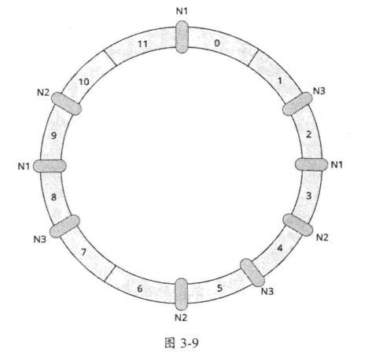

这样当某个节点下线时，数据会分摊给其余的节点，避免某个节点独自承担处理数据的压力。此外，使用虚拟节点，我们还可以划分流量。例如，系统中有机器的性能是其他机器的两倍，那么我们可以让这台机器映射出两倍于其他机器的节点数，让它来承担更多的负载。

分区对 Join 等聚合操作以及分布式事务提出了挑战。

### 复制

复制是指将同一份数据冗余存储在多个节点上，节点间通过网络来同步数据，使之保持一致。

#### 单主复制

「单主复制」也叫「主从复制」或「主从同步」，即指定系统中的一个副本为主节点，客户端的写请求必须发送到主节点；其余的副本称为从节点，从节点只能处理读请求。主节点要负责将数据变更同步给所有从节点，以确保所有的副本保持数据一致。

根据系统以何种方式同步数据，又可以将单主复制分为三类，分别为

1. 同步复制：主节点执行完一个写请求后，必须等待所有的从节点都执行完毕，并收到确认信息后，才可以回复客户端写入成功

   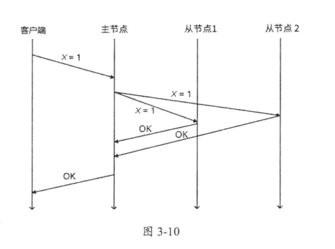

2. 异步复制：主节点执行完写请求后，会立即将结果返回给客户端，无须等待其他副本是否写入完成。

   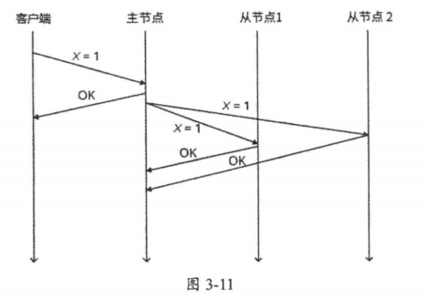

   

3. 半同步复制：主节点只需要等待至少一个从节点返回完成信息即可，不需要等待所有的节点都完成。

单主复制的主要缺点有：

1. 写请求的性能瓶颈由单个节点（主节点）决定。
2. 主节点的单点故障

对于缺点（2），我们可以使用自动故障机制。当从节点通过心跳超时检测到主节点已经宕机，然后尝试成为整个集群的主节点。如果自动故障机制的实现有缺陷，那么就会产生严重的「脑裂」问题，即由于从节点因网络分区误以为主节点下线，或者多个从节点同时检测到主节点失效，而错误地导致集群中有多个主节点，这可能造成数据损坏。可以通过分布式共识算法来避免这种问题。

#### 多主复制

在多主复制中，不止一个节点处理客户端的写请求，而且又存在着网络延迟，这就意味着节点可能会对某些请求的正确顺序产生分歧，导致多个节点上的数据不一致，这种现象简称为**数据冲突**。

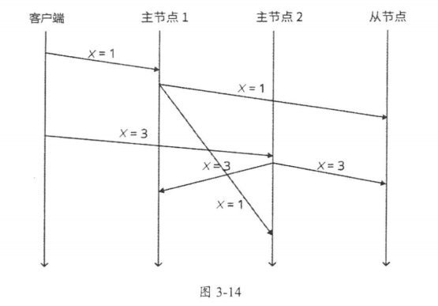

其实数据冲突在单主复制中也会出现，只不过单主复制的数据冲突通常直接以主节点的数据作为最终数据，不需要很复杂的逻辑。

在一个数据中心的内部，使用多主复制是没有意义的，它所带来的复杂性远远超出了它的好处。但是在以下场景中可以发挥作用：

1. 多数据中心的同步。 在每个数据中心内使用常规的主从复制；在数据中心之间，每个数据中心的主库都会将其更改复制到其他数据中心的主库中。

   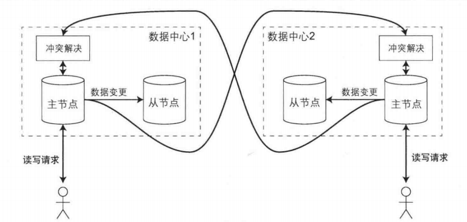

2. 多个离线设备之间的同步，此时一个设备就视为一个主节点。

3. 实时协作编辑

有时冲突无法避免，根据系统特性，解决冲突的办法有多种（假设能够检测到冲突）：

1. **客户端解决冲突** 。在客户端下次读取系统中冲突数据的时候，将冲突的数据全部返回给客户端，客户端选择合适的数据并返回给存储系统，存储系统以此数据作为最终确认的数据，覆盖所有冲突的数据。
2. **最后写入胜利 LWW, Last Write Wins** 。给用户的写入请求标记上唯一时间戳，或者唯一全局自增 ID。挑选最高ID的写入作为胜利者，并丢弃其他写入。但实际上全局序是几乎不可能保证的。
3. **因果关系跟踪**。系统使用一种算法来跟踪不同请求之间的因果关系，并以此判断请求的先后顺序。
4. **「无冲突复制数据类型」（Conflict-Free Replicated Data Type, CRDT）**。根据一定规则自动解决冲突，副本之间不需要额外的协调和冲突处理。常用于在线聊天系统和协作式文本编辑系统。

在工业界，解决冲突的思路很简单，就是避免冲突。把用户的请求路由到同一数据中心，并在一个机房中完成同一用户的所有相关请求，避免跨机房调用。

由于多主复制带来的复杂性远超它的好处，它一般用于多个数据中心的存储系统

#### 无主复制

无主复制的基本思想是，客户端向多个节点发送请求。一旦得到一定数量的确认响应，就认为这次写成功了，然后继续发送下一个请求。同时，读请求也会同时发送给多个节点，然后获取节点上的数据和其版本号，然后决定是否哪个值。

识别出旧数据后，我们要去修复它。有两种数据修复方法：

1. 读修复 (Read Repair)：当客户端从多个节点读取到数据后，它可以检测到其中有的节点的数据是旧的，此时客户端会发送一个带有最新值的写请求到旧数据所在的节点，以此更新节点的数据。
2. 反熵过程（Anti-Entropy Process) 。反墒过程会新建一个后台进程来修复数据，该进程找出错误的数据，并从存储最新的数据的节点中将数据复制到错误的节点。

为了减少反熵过程修复时所要对比的数据量，可以使用 Merkle Tree，它把数据按关键字分为几个范围，每个范围计算出一个哈希值并作为树的叶子节点，然后自底向上一层层合并到根节点。通过从 Merkle Tree 的根节点开始比较哈希值，就能快速找到哪些范围的哈希值发生了变化，快速定位不一致的数据，并且只传输较少的数据进行比较。

基于 Quorum 的数据冗余机制保证了在一个由 N 个节点组成的系统中，我们要求至少 W 个节点写入成功，并且需要同时从 R 个节点中读取数据，只要 W+R>N 且 W>N/2 ，则读取的 R 个返回值中至少包含一个最新的值。

W 值越大，R 值越小，系统的读操作性能就越好。反之，写操作的性能越好。例如，如果一个应用程序的写请求较少，但读请求非常频繁，那么可以设置 W=N 与 R = 1。这种参数配置会让应用程序的写入速度变慢，可用性降低，因为一个节点故障就会阻塞整个写操作的完成。

### CAP 定理

CAP 定理（Consistency、Availability、Partition Tolerance Theorem），也称为 Brewer 定理。这个定理描述了：在网络分区时，以下三个特性最多只能同时满足其中两个：

- **一致性**（**C**onsistency）：所有节点访问同一份最新的数据副本

- **可用性**（**A**vailability）：代表系统不间断地提供服务的能力。

- **分区容忍性**（**P**artition Tolerance）：代表分布式环境中，当部分节点因网络原因而彼此失联（即与其他节点形成“网络分区”）时，系统仍能正确地提供服务的能力。

  

AP 系统目前是设计分布式系统的主流选择。 因为 P 是分布式网络的天然属性，这是无法放弃的；而 A 通常是建设分布式的目的。下面分析分别舍弃 C、A、P 时所带来的不同影响：

- **CA without P**：不可能选择 CA 架构的，这是因为若系统出现“分区”，系统中的某个节点在进行写操作。为了保证C，必须要禁止其他节点的读写操作，这就和 A 发生冲突了。如果为了保证 A，其他节点的读写操作正常的话，那就和 C 发生冲突了。
- **CP without A：**为了保证一致性，节点之间的写操作采用同步策略，或者 Raft 协议。同时当发生分区现象后（同步节点失败），那么就拒绝用户的写操作，但是各个节点仍可以提供读服务。
- **AP without C：**当发生分区现象后，N1 节点上的数据已经更新到 y，但由于 N1 和 N2 之间的复制通道中断，数据 y 无法同步到 N2，N2 节点上的数据还是 x。这时客户端 C 访问 N2 时，N2 将当前自己拥有的数据 x 返回给客户端 C 了，而实际上当前最新的数据已经是 y 了，这就不满足一致性（Consistency）的要求了

PACELC 定理是 CAP 定理的一个扩展定理，其主要论点是 「CAP 定理忽略分布式系统中的延迟影响是 个重大疏忽，因为延迟在系统运行过程中时刻存在，而网络分区不会一直存在」。PACELC 定理指出，在分布式系统存在网络分区（P）的情况下，必须在可用性（A）和一致性 （C）之间做出选择；否则（E），系统在没有网络分区且正常运行的情况下，必须在延迟（L）和一致性（C）之间做出选择。

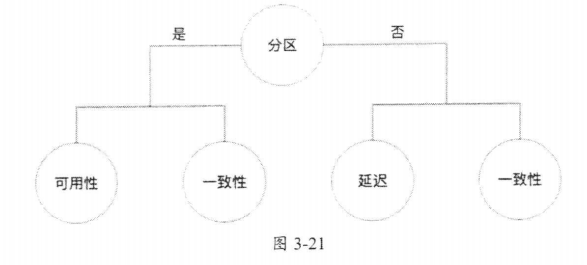

大多数系统往往属于 PA/EL 或 PC/EC 类型。

BASE（Basically Available, Soft State, Eventually Consistent）也是对 CAP 定理的扩展。 

- **Basic Availability**：系统在出现不可预知的故障时候，允许损失部分可用性，保证核心服务可用。
- **Soft-state**：允许系统在不同节点的数据副本之间进行数据同步的过程中存在延时（允许系统中的数据存在中间状态，不会影响系统的整体可用性）。
- **Eventual Consistency**：系统中所有的数据副本，在进过一段时间的同步后，最终能够达到一个一致的状态。

### 一致性模型

一致性模型可以理解为系统和开发者之间的一种约定，如果开发者遵循某些规则，那么开发者执行读操作或写操作的结果是**可预测的**。如果系统的读写操作是无法返回可预测结果的，那么这样的系统是很难使用的 。

**一致性模型本质上定义了写操作的顺序和可见性**，即并发写操作执行的顺序是怎样的，写操作的结果何时能够被别的进程看见。

> 分布式系统中的一致性与数据库中的一致性是完全不同的两个概念。
>
> 分布式一致性与隔离性有一些相似，它们的关注点是各有侧重的。

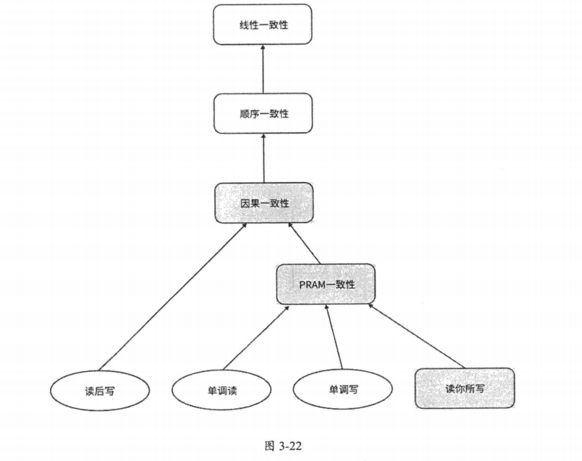

一致性模型根据可用性可以分为三类：

- **不可用（Unavailable）**：当系统发生网络分区时，为了保证数据一致性和正确性，系统会不可用。例如线性一致性、顺序一致性
- **基本可用（Sticky Available）**：可以容忍部分节点发生故障。例如因果一致性、PRAM 一致性等
- **高可用（Total Available）**：即使网络发生严重分区，在没有发生故障的节点上，仍然保证可用

#### 线性一致性

**线性一致性（Linearizable Consistency）**也被称为强一致性、严格一致性、原子一致性等等。

> Maurice P. Herlihy 与 Jeannette M. Wing 在 1987 年的论文[2]中形式化的给出了 Linearizability 的概念。

线性一致性的非严格定义是，分布式系统的所有操作**看起来**都是原子的，整个分布式系统**看起来**好像只有一个节点。下面通过一个例子来认识这一点：

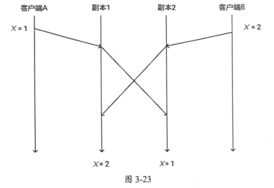

两个客户端同时执行写操作，但由于于副本之间同步数据存在延迟，导致两个副本的 X 值不相同。根据非严格定义，这个系统应该看起来像这样：

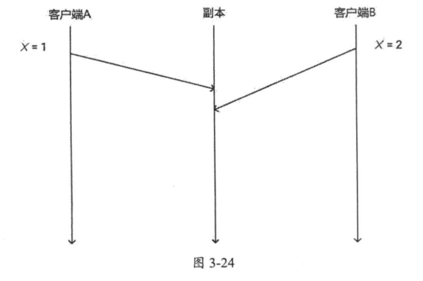

这样，系统行为就从一个不可预测的转变成可预测的。

用户向线性一致性系统发送写请求后，必须等待系统内部完成一致性工作后，才能得到响应。显然，这牺牲了系统的性能。

我们再来介绍线性一致性的严格定义。首先，发生在系统上的所有事件可以建模为一个并发程序的执行历史，简称为**历史（History）**，常用 H 来表示。我们假设系统只有读操作或写操作，一个操作可以分为**调用（Invocation）**和**响应（Response）**两个事件。调用表示读操作或写操作的开始，响应可以理解为操作结束。

举个最简单的例子 一个写操作如下图所示：

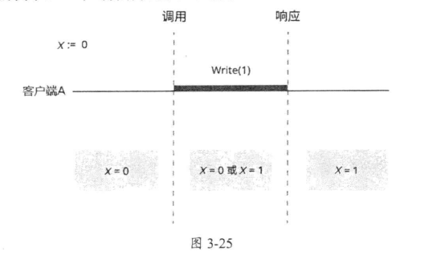

线段的长度表示 Write(1) 写操作实际持续的时间。这个写操作的结果可以很容易预测，调用事件发生之前 X 的值为 0，响应事件结束之后 X 的值为 1，而处于调用事件和响应事件之间的这段时间，无法确认写操作到底发生在哪个具体的时间，所以客户端读到 X = 0 或 X = 1 都认为是合法的。

考虑更复杂的情况，如果有多个客户端同时执行操作，那么执行历史就可以建模为下图所示的情况。

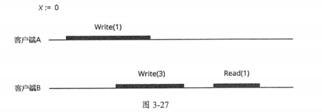

了解了这些基本概念后，我们给出线性一致性的严格定义。给定一个执行历史，执行历史根据井发操作可以扩展为多个**顺序历史 (Sequential History)** ，只要从中找到一个**合法**的顺序历史，即**任何一次读必须读到最近一次要写入的数据**，那么该执行历史就是线性一致性的。

线性一致性主要有两个约束条件：

1. 顺序记录中的任何一次读，必须读到最近一次写入的数据
2. 读写操作的顺序由一个全局时钟确定

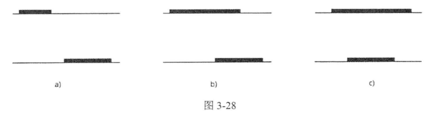

1.  一个操作明显在另一个操作之前发送，这两个操作是顺序关系
2. 两个操作之间有重叠，这两个操作是并发关系。

在将执行历史转变成顺序历史的过程中，如果两个操作是顺序关系，那么它们的先后关系必须保持相同；如果两个操作是并发关系，则它们可以按任何顺序排列。

以图 3- 27 为例，我们可以扩展出两个顺序历史：

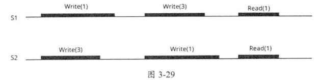

可以推断出，顺序历史 S1 是不合法的， S2 是符合条件的顺序历史。所以图 3-27 中的执行历史是满足线性一致性的。

下面给出一个练习，H1 与 H2 是否满足线性一致性

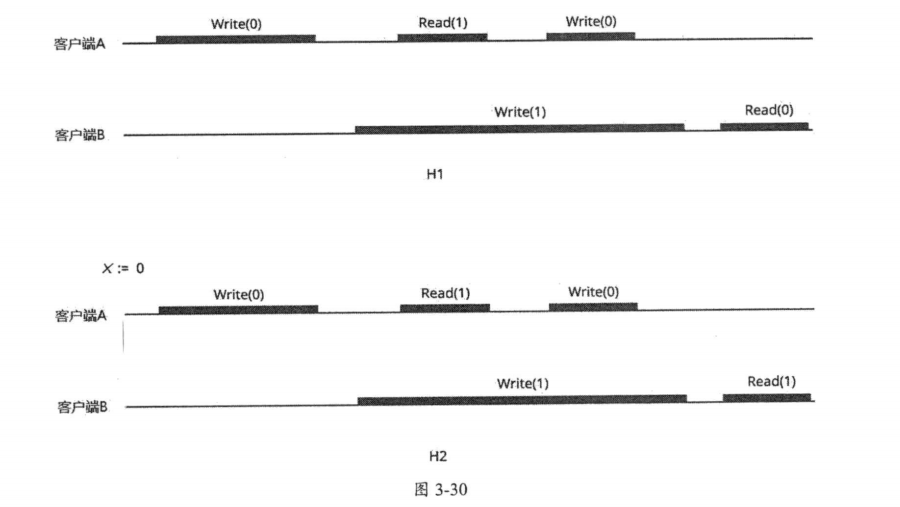

H1 满足，但 H2 不满足

满足线性一致性的分布式系统，可以通过分布式共识算法来真正实现它。分布式系统中的线性一致性最困难的是需要一个全局时钟，这样才能知道每个节点事件发生的时间和全局顺序，但分布式系统中准确的全局时钟是非常难以实现的。

> 分布式锁侧重于隔离性的讨论

默认情况下，现代 CPU 在访问内存时不保证线性一致性。这是因为同步指令开销大、速度慢，并且涉及跨节点 CPU 缓存失效问题。

#### 顺序一致性

顺序一致性同样允许对并发操作历史进行重新排列，但它的约束比线性一致致性要弱，顺序一致性只要求同一个客户端（或进程）的操作在排序后保持先后顺序不变，但不同客户端（或进程）之间的先后顺序是可以任意改变的。

我们还是通过一个例子来认识一下：

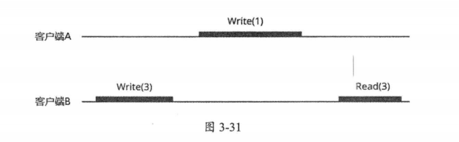

显然不满足线性一致性，但是满足顺序一致性（见下图）

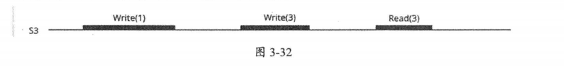

顺序一致性和线性一致性的主要区别在于没有全局时间的限制，只关注局部顺序。

有时顺序一致性往往更实用。例如，在一个社交网络应用中，一个人通常不关心他看到的所有朋友的帖子的顺序，但对于具体的某个朋友，仍然以正确的顺序显示该朋友发的帖子会更符合逻辑。

与线性一致性一样，现代 CPU 在默认情况下也不保证顺序一致性，因为顺序一致性严格限制了程序的执行顺序。现代编译器和 CPU 通常都会优化指令的执行顺序。

#### 因果一致性

因果一致性 (Causal Consistency）性要求必须以相同的顺序看到因果相关的操作。它与顺序一致性一样，都不依赖千全局操作的顺序。

#### 最终一致性

在某个阶段，系统各节点处理客户端的操作顺序可以不同，读操作也不需要返回最新的写操作的结果。在最终的状态下，只要不再执行写操作，读操作将返回相同的最新结果，这就是最终一致性 Eventual Consistency 模型。

#### 以客户端为中心的一致性模型

Tanenbaum 等人将我们前面讨论的四种一致性模型归为**「以数据为中心的一致性模型」** (Data-Centric Consistency Models) 。它为数据存储系统提供全局一致性视图。

还有另一类**「以客户端为中心的一致性模型」**，不再从系统的角度考虑每个副本的数据是否一致，而是考虑客户端的读写请求的结果，从而推断出系统的一致性。

一句话来对比就是，以「数据为中心的一致性模型」常常考虑多个客户端时的系统状态，而以「客户端为中心的一致性模型」聚焦于单个客户端观察到的系统状态。

- **单调读（Monotonic Read）**：如果客户端读到关键字 x 的值为 V, 那么该客户端对于 x 的任何后续的读操作必须返回 v 或比 v 更新的值，即保证客户端不会读到旧的值。
- **单调写（Monotonic Write）**：同一个客户端（或进程）的写操作，在所有副本上都以同样的顺序执行，即保证客户端的写操作是串行的
- **读你所写（Read Your Write）**：当写操作完成后，在同一副本或其他副本上的读操作必须能够读到写入的值

下面这个例子就违反了读你所写：

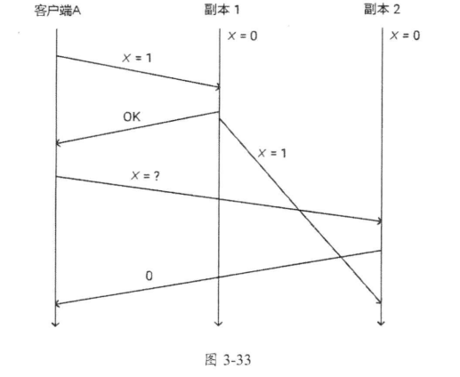

PRAM ( Pipelined RAM）一致性也称为 FIFO 一致性 ，它由单调读、单调写和读你所写三个一致性模型组成。 

PRAM 一致性要求：同一个客户端的多个写操作，将被所有的副本按照同样的执行顺序观察到，但不同客户端发出的写操作可以以不同的执行顺序被观察到。一个违反 PRAM 的示例（实际上就是数据冲突）

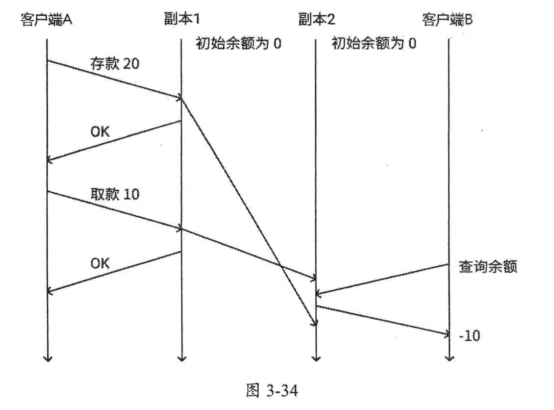

### 隔离级别

- **脏写**：一个事务覆盖了另一个尚未提交的事务所写入的值。脏写最重要的问题是它会破坏数据的完整性约束，使系统无法正确回滚事务。因此大多数情况下都需要防止脏写。例如下面这个脏写破坏 x = y 完整性约束

  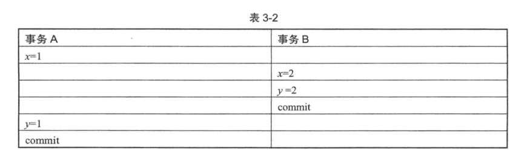

- **脏读**：一个事务读到了另一个尚未提交（可能回滚了）的事务所写入的值

- **不可重复读**：在一个事务中查询一个值两次，但两次查询返回的值不同。它与脏读的区别是，它读取到了一个已提交事务所写入的值，并不会读取到未提交事务所写入的值。

- **幻读**：当一个事务进行条件查询时，另一个事务在中间插入或删除了匹配该条件的数据，这时事务再去读，就会发生幻读。简而言之，幻读就是再次读到的数据项变多或变少了 

- **更新丢失**：当两个事务读取同一个值，然后都试图将其更新为新的不同的值时 就会发生更新丢失。

- **读偏斜**：读到了数据一致性约束被破坏的数据

- **写偏斜**：两个并发事务都读到了相同的数据集，但随后各自修改了不相干的数据栠，导致数据的一致性约束被破坏

  以下图为例，就破坏了 X + Y < 100 的约束

  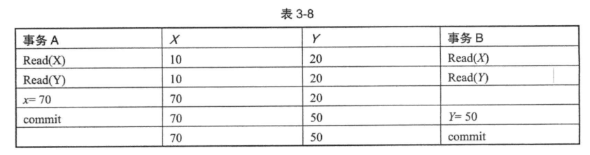

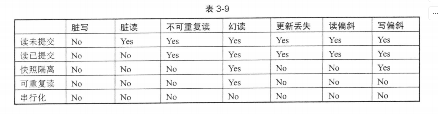

### 一致性与隔离性的对比

一致性模型和隔离级别的相同点是 ，它们本质上都是用来描述系统能够容忍哪些行为，不能容忍哪些异常行为。

一致性模型和隔离级别的一个主要区别是，一致性模型适用于单个操作对象，比如单个数据项或单个变量的读写，该数据可能存在多个副本；而隔离级别通常涉及多个操作对象，比如在并发事务中修改多个数据。

它们还有一个区别是，线性一致性提供了实时保证，而串行化则没有。这意味着线性一致性保证操作在客户端调用和客户端收到响应之间的某个时刻生效，而串行化只保证多个并发事务的效果，以及它们以串行的顺序运行，至于串行的顺序是否与实时的顺序一样，它并没有保证。

一个数据存储系统可以同时保证线性一致性和串行化，这类系统称为**严格串行化**。这个模型保证了多个事务执行的结果等同千它们的串行执行结果 ，同时执行顺序与实时排序 一致——就像单机单线程程序那样。

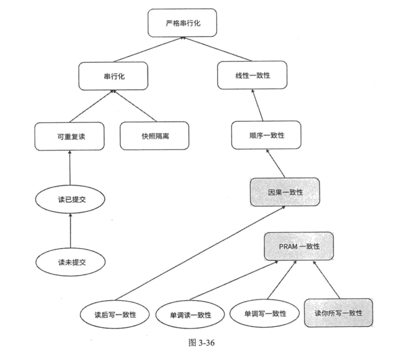
