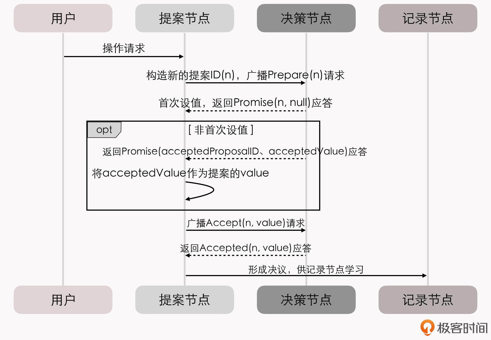
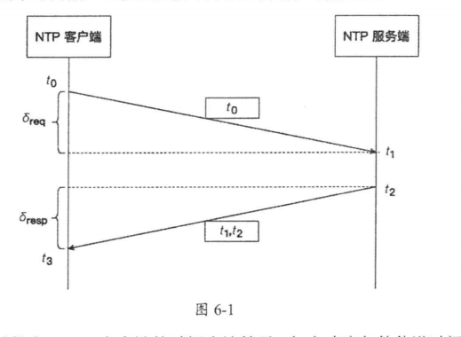

# 分布式理论

[TOC]

## 分布式共识

可靠性保障有一种以同步为代表的数据复制方法，叫做**状态转移（State Transfer）**。但通常要以牺牲可用性为代价。

还有一种是以**操作转移（Operation Transfer）**为基础的。就是通过某种操作，把源状态转换为目标状态（状态机思想）。将一连串的操作日志正确地广播给各个分布式节点。广播指令与指令执行期间，允许系统内部状态存在不一致的情况。只要求在此期间的内部状态不能被外部观察到，且当操作指令序列执行完成的时候，所有节点的最终的状态是一致的。这种模型，就是**状态机复制（State Machine Replication）。**

在分布式环境下，考虑到网络分区现象是不可能消除的，所以不要求在任何情况下的数据状态都一致，而是采用「少数服从多数」的原则。也就是说，一旦系统中超过半数的节点完成了状态的转换，就可以认为数据的变化已经被正确地存储在了系统当中。在分布式中，这种思想被叫做 **Quorum 机制**。这在一定程序上保证了可用性，缓解了可靠性与可用性之间的矛盾。

共识指的是系统中的多个节点对某个值达成一致。

**「共识不等于一致性」**，一致性指的是多个副本对外呈现的稳定状态。一种常见的误解是，使用了 Raft 或者 Paxos 的系统都是线性一致的。其实不然，共识算法只能提供基础，要实现线性一致还需要在算法之上做出更多的努力。

在共识所提供语义的基础上，我们可以解决：

- 互斥
- 选主

共识就是在多个值当中，协商出一个值，抛弃其他所有值。这与多主复制是相违背的，因为用户的每个写请求都是有效的，不允许抛弃。

 由 Fischer，Lynch 和 Patterson 三位科学家发表的《Impossibility of Distributed Consensus with One Faulty Process》论文中提出，在网络可靠，但允许节点失效（即便只有一个）的最小化异步模型系统中，不存在一个可以解决一致性问题的确定性共识算法。因此，我们主要研究同步系统中的分布式共识问题。

### Paxos

Paxos 系统的核心点：如果用户次只对系统进行串行访问，那单纯地应用 Quorum 机制，就已经足以保证值被正确地读写了。**Paxos 算法来解决 Quorum 机制中并发操作所带来的竞争问题**，即可能没有超过半数的节点持有同一个值。

- **提案节点：称为 Proposer**，提出对某个值进行设置操作（提案）的节点
- **决策节点：称为 Acceptor**，是应答提案的节点，决定该提案是否可被接受。提案一旦得到过半数决策节点的接受，就意味着这个提案被批准（Accept）。
- **记录节点：被称为 Learner**，不参与提案，也不参与决策，只是单纯地学习已经达成共识的提案。比如，节点从网络分区中恢复时，将会进入这种状态。

在使用 Paxos 算法的分布式系统里：

- 所有的节点都是平等的，它们都可以承担以上某一种或者多种角色。
- 决策节点的数量应该被设定为奇数个
- 网络中每个节点都知道整个网络所有决策节点的数量、地址等信息

如果用户次只对系统进行串行访问，那单纯地应用 Quorum 机制，就已经足以保证值被正确地读写了。**Paxos 算法通过「准备（Prepare）」和「批准（Accept）」两个阶段 来解决并发操作所带来的竞争问题**：

1. 如果某个提案节点准备发起提案，必须先向所有的决策节点广播一个许可申请（称为 Prepare 请求）。Prepare 请求中会附带一个全局唯一、递增的 n 作为提案 ID。决策节点收到后，会给提案节点两个承诺和一个应答：

   1. 承诺不会再接受提案 ID 小于或等于 n 的 Prepare 请求
   2. 承诺不会再接受提案 ID 小于 n 的 Accept 请求。
   3. 如果违反此前做出的承诺，那就直接不理会这个 Prepare 请求。
   4. 在不违背以前作出的承诺的前提下，回复已经批准过的提案中 ID 最大的提案（提案 ID 与所设置的 Value）。

2. 在提案节点收到了多数派决策节点的应答后，就开始第二阶段「批准」（Accept）过程。

   1. 如果提案节点发现所有响应的决策节点，此前都没有批准过这个值（即为空），就说明它是第一个设置值的节点，可以随意地决定要设定的值；并将自己选定的值与提案 ID，构成一个二元组(id, value)，再次广播给全部的决策节点（称为 Accept 请求）。
   2. 如果提案节点发现响应的决策节点中，已经有至少一个节点的应答中包含有值了，那它就不能够随意取值了，必须无条件地从应答中找出提案 ID 最大的那个值并接受，构成一个二元组(id, maxAcceptValue)，然后再次广播给全部的决策节点（称为 Accept 请求）。
   3. 当每一个决策节点收到 Accept 请求时，都会在不违背此前作出承诺的前提下，接收当前提案。

   

### Gossip

## 分布式事务

见「 Seata 事务」笔记

## 时间和时间顺序

开发者在设计软件时，默认状态和流程的演进是随着时间流动方向进行的。UTC 是最主要的世界时间标准，通过不规则地加上正或负闰秒来抵消地球自转变化的影响。

NTP 是目前主流的时钟同步协议，它是一个典型的 C/S 架构。

显然，往返延迟 $\delta = (t_3 - t_0) - (t_2 - t_1)$。 那么， NTP 把 NTP 客户端应该设置的时间称为时间偏移，用 $\theta$ 来表示
$$
\theta = t_2 + \frac{\delta}{2}
$$
具体的算法会更复杂一些。 NTP 客户端通常会定期轮询一个或更多服务器，然后使用一个统计算法得到一个最优时间偏移。然后调整时钟频率以逐渐减小时间误差。