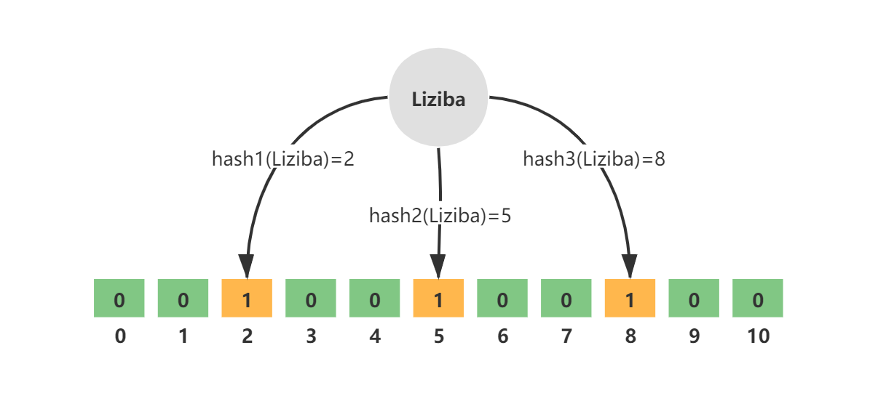
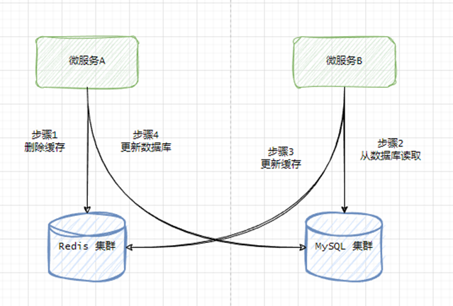
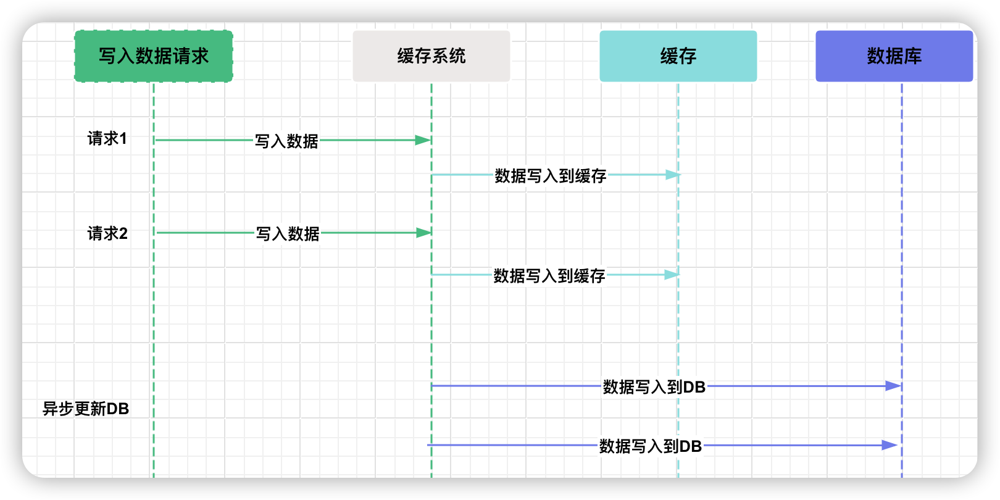

# 透明多级分流系统

[TOC]


## 客户端缓存

HTTP 协议是无状态协议，每次请求是独立的。这简化了 HTTP 服务器的设计，但是由于服务端不保存此前请求的状态，所以也不可避免地导致其携带有重复的数据，而造成网络性能降低。

根据约定，强制缓存在浏览器的地址输入、页面链接跳转、新开窗口、前进和后退中均可生效，但在用户主动刷新页面时应当自动失效。HTTP 协议中的两个 Header 可以实现强制缓存：

- **Expires**：当服务器返回某个资源时带有该 Header 的话，意味着服务器承诺截止时间之前资源不会发生变动，浏览器可直接缓存该数据，不再重新发请求。但客户端修改了本地时间，将时间前后调整几分钟，就可能会造成缓存提前失效或超期持有。

  ~~~htpp
  HTTP/1.1 200 OK
  Expires: Wed, 8 Apr 2020 07:28:00 GMT
  ~~~

- **Cache-Control**：它的语义比起 Expires 来说就丰富了很多，如果 Cache-Control 和 Expires 同时存在，并且语义存在冲突（譬如 Expires 与 `max-age` / `s-maxage` 冲突）的话，那么以 Cache-Control 为准

  - `max-age` 和 `s-maxage`：`max-age` 后面跟随一个以秒为单位的数字，表明相对于请求 时间（在 Date Header 中会注明请求时间）多少秒以内缓存是有效的，资源不需要重新从服务器中获取。相对时间避免了 Expires 中采用的绝对时间可能受客户端时钟影 响的问题。`s-maxage` 中的“s”是“Share”的缩写，意味“共享缓存”的有效时间，即允许被 CDN、代理等持有的缓存有效时间，用于提示 CDN 这类服务器应在何时让缓存失效。
  - `public` 和 `private`：指明是否涉及到用户身份的私有资源，如果是 `public`，则可以被代理、CDN 等缓存，如果是 `private`，则只能由用户的客户端进行私有缓存。
  - `no-cache` 和 `no-store`
  - `no-transform`：禁止资源被任何形式地修改。譬如，某些 CDN、透明代理支持自动 GZip 压缩图片或文本，以提升网络性能
  - `min-fresh` 和 `only-if-cached`
  - `must-revalidate` 和 `proxy-revalidate`


在多数情况下，都并没有什么把握去承诺某项资源多久不会发生变化。协商缓存是一种基于变化检测的缓存机制，在一致性上会有比强制缓存更好的表现，但需要一次变化检测的交互开销，性能上就会略差一些。根据约定，协商缓存不仅在浏览器的地址输入、页面链接跳转、新开窗口、前进、后退中生效，而且在用户主动刷新页面（F5）时也同样是生效的。只有用户强制刷新（Ctrl+F5） 或者明确禁用缓存（譬如在 DevTools 中设定）时才会失效，此时客户端向服务端发出的请求会自动携带“Cache-Control: no-cache”。

协商缓存有两种变动检查机制：

- `Last-Modified` 和 `If-Modified-Since`：`Last-Modified` 是服务器的响应 Header，用于告诉客户端这个资源的最后修改时间。当客户端需要再次请求时，会通过 `If-Modified-Since` 把之前收到的最后修改时间发送回服务端。 
- `Etag` 和 `If-None-Match`：Etag 是服务器的响应 Header，用于告诉客户端这个资源的唯一标识。HTTP 服务器可以自行决定如何生成这个标识。当客户端需要再次请求时，会通过 `If-None-Match` 把之前收到的资源唯一标识发送回服务端。

服务器对于客户端 `If-Modified-Since` 或者 `If-None-Match` 的响应：

- 如果服务端发现资源没有变动，就只要返回一个 `304/Not Modified` 的响应即可，无须附带消息体。
- 否则，就会返回 200/OK 的完整响应，在消息体中包含最新的资源


Etag 是 HTTP 中一致性最强的缓存机制，而 Last-Modified 只能支持到秒级。Etag 却又是 HTTP 中性能最差的缓存机制。因为每次请求时，服务端都必须对资源进行哈希计算，这比起简单获取一下修改时间，开销要大了很多。

Etag 和 Last-Modified 是允许一起使用的，服务器会优先验证 Etag，在 Etag 一致的情况下，再去对比 `Last-Modifie d`。这是为了防止有一些 HTTP 服务器没有将文件修改日期纳入到哈希计算策略中。


为了支持一个URL获取多份不同版本的资源（一段文字的不同语言版本，一个文件的不同编码格式版本等），HTTP 协议设计了内容协商机制，该机制包括以下 Headers：

- 以 Accept*（Accept、Accept-Language、Accept-Charset、Accept-Encoding）请求 Header 
- 对应的以 Content-*（Content-Language、Content-Type、Content-Encoding）响应 Header


缓存机制通过 Vary Header，来获知根据什么内容，对同一个 URL 返回给用户正确的资源：

~~~http
HTTP/1.1 200 OK
Vary: Accept, User-Agent
~~~

以上响应的含义是，应该根据 MIME 类型和浏览器类型来缓存资源

## 服务端缓存

相比起内存中读写的速度，网络传输、数据复制、序列化和反序列化等操作所导致的延迟要比其高得多。所以对分布式缓存来说，处理与网络有相关的操作是对吞吐量影响更大的因素。有两种分布式缓存形式：

- **复制式缓存**：数据在分布式集群的每个节点里面都存在有一份副本，读取数据时无须网络访问，直接从当前节点的进程内存中返回。当数据发生变化时，就必须遵循复制协议，将变更同步到集群的每个节点中。只适合甚少更新但频繁读取的数据
- **集中式缓存**：集中式缓存的读、写都需要网络访问。典型代表是 Redis。集中式缓存与使用缓存的应用分处在独立的进程空间中，其好处是它能够为异构语言提供服务。

如有需要，完全可以同时把进程内缓存和分布式缓存互相搭配，构成多级缓存（Transparent Multilevel Cache，TMC），即使用进程内缓存做一级缓存，分布式缓存做二级缓存


如何做到透明呢？一种常见的设计原则是**变更以分布式缓存中的数据为准**。大致做法是当数据发生变动时，在集群内发送推送通知（简单点的话可采用 Redis 的 PUB/SUB，求严谨的话引入 ZooKeeper 或 Etcd 来处理），让各个节点的一级缓存自动失效掉相应数据。当访问缓存时，提供统一封装好的一、二级缓存联合查询接口，接口外部是只查询一次，接口内部自动实现优先查询一级缓存，未获取到数据再自动查询二级缓存的逻辑。

**实际上，分布式缓存集群通常设计为 AP，并不追求数据一致性。**

## 缓存风险

### 缓存穿透

缓存穿透是指查询一个根本不存在的数据，在缓存层和存储层中都不会命中。缓存穿透将导致不存在的数据每次请求都要到存储层去查询，失去了缓存的意义。基本原因是：

- 一些恶意攻击、爬虫等造成大量空命中。
- 自身业务代码或者数据出现了问题

解决方案：

- 对于恶意攻击导致的缓存穿透，在缓存之前设置一个布隆过滤器。布隆过滤器是用最小的代价来判断某个元素是否存在于集合的数据结构
- 对于业务逻辑本身就不能避免的缓存穿透，可以正常查询结果为空的 Key 值依然进行缓存，使得在一段时间内缓存最多被穿透一次。如果后续业务在数据库中对该 Key 值插入了新记录，那应当在插入之后主动清理掉缓存的 Key 值。


布隆过滤器实际上是一个很长的二进制向量和一系列随机映射函数。布隆过滤器可以用于检索一个元素是否在一个集合中，存在着一定误识别率。


添加的 key 需要根据 k 个无偏 hash 函数，计算得到多个 hash 值。然后分别取模 hash 得到数组下标。最后将对应的 bit 设置为 1。



当查询元素时，根据 k 个无偏 hash 函数，计算得到多个 hash 值。然后分别取模 hash 得到数组下标。如果对应 bit 全都为 1，那么元素就存在，否则不存在。

布隆过滤器对元素的删除不太支持

实际上，可以通过提升误判率来减少布隆过滤器的空间占用。公式 4.6. 1给出了误判率、空间占用等参数之间的关系式。假设有以下参数：

- n：过滤器中有多少个元素
- p：误判率
- m：过滤器需要占用的空间（单位为Bit）
- k：要使用的哈希函数的个数

$$
m = -\frac{n * ln(p)}{(ln2)^2}
$$

$$
k = \frac{m}{n} * ln2
$$

这里取 n = 2,0000,0000 以及p = 0.1 。计算出 k = 3.32 以及m = 958505838 bits (117005.10 KB)


添加 Redission 依赖：

```xml
<dependency>
  <groupId>org.redisson</groupId>
  <artifactId>redisson-spring-boot-starter</artifactId>
  <version>3.16.7</version>
</dependency>
```

创建布隆过滤器

```java
@Service
public class BloomFilterService {

    @Autowired
    private RedissonClient redissonClient;

    /**
     * 创建布隆过滤器
     * @param filterName 过滤器名称
     * @param expectedInsertions 预测插入数量
     * @param falseProbability 误判率
     * @param <T>
     * @return
     */
    public <T> RBloomFilter<T> create(String filterName, long expectedInsertions, double falseProbability) {
        RBloomFilter<T> bloomFilter = redissonClient.getBloomFilter(filterName);
        bloomFilter.tryInit(expectedInsertions, falseProbability);
        return bloomFilter;
    }

}
```

单元测试如下：

```java
@Autowired
private BloomFilterService bloomFilterService;

@Test
public void testBloomFilter() {
    // 预期插入数量
    long expectedInsertions = 10000L;
    // 错误比率
    double falseProbability = 0.01;
    RBloomFilter<Long> bloomFilter = bloomFilterService.create("ipBlackList", expectedInsertions, falseProbability);

    // 布隆过滤器增加元素
    for (long i = 0; i < expectedInsertions; i++) {
        bloomFilter.add(i);
    }
    long elementCount = bloomFilter.count();
    log.info("elementCount = {}.", elementCount);

    // 统计误判次数
    int count = 0;
    for (long i = expectedInsertions; i < expectedInsertions * 2; i++) {
        if (bloomFilter.contains(i)) {
            count++;
        }
    }
    log.info("误判次数 = {}.", count);
    bloomFilter.delete();
}
```

### 缓存击穿

**缓存击穿**：缓存中某些热点数据忽然因某种原因（譬如超期而失效）失效了，此时又有多个针对该数据的请求同时发送过来，这些请求将全部未能命中缓存，都到达真实数据源中去，导致其压力剧增，这种现象被称为缓存击穿。原因分析：

- 系统有专门的缓存预热功能，这样都可能出现由此载入缓存的大批数据具有相同的过期时间
- 缓存服务由于某些原因崩溃后重启，此时也会造成大量数据同时失效


要避免缓存击穿问题，通常会采取下面的办法：

- 加锁同步，以请求该数据的 Key 值为锁，使得只有第一个请求可以流入到真实的数据源中，其他线程采取阻塞或重试策略。

  ~~~java
  String get(String key) {
      // 从Redis中获取数据
      String value = redis.get(key);
      // 如果value为空，则开始重构缓存
      if(value == null) {
          // 只允许一个线程重构缓存，使用nx，并设置过期时间ex
          // 这里就是使用一个锁
          String mutexKey = "mutext:key:" + key;
          if(redis.set(mutexKey, "1", "ex 180", "nx")) {
              // 从数据源获取数据
              value = db.get(key);
              // 回写 Redis,并设置过期时间
              redis.setex(key, timeout, value);
              // 删除 key_mutex
              redis.delete(mutex_key);
          }
          // 其他线程休息 50 毫秒后重试
          else {
              Thread.sleep(50);
              get(key);
          }
      }
      return value;
  }
  ~~~

  有人认为这种方案的性能太差，然而笔者却不这么认为。原因在于要考虑到具体的场景，请求都打到 DB 层了，随时可能有崩溃问题，此时首要义务就是保证 DB 层存活，而不是考虑什么性能问题。

- 热点数据由代码来手动管理：一方面在 Redis 中并不设置过期时间，另一方面，在客户端实现逻辑过期时间

  ~~~java
  String get(String key) {
      V v = redis.get(key);
      String value = v.getValue();
      
      long logicTimeout = v.getLogicTimeout();
  	// 如果逻辑过期时间小于当前时间，开始后台构建
  	if (v.logicTimeout <= System.currentTimeMillis()) {
  		String mutexKey = "mutex:key:" + key;
          // 设置一个名为 mutexKey 的键，并为其赋予值 1，过期时间为 180 秒，nx 表示只有当给定的键未存在时，才会设置这个键。
  		if (redis.set(mutexKey, "1", "ex 180", "nx")) {
  			// 重构缓存
  			threadPool.execute(new Runnable() {
                  public void run() {
                      String dbValue = db.get(key);
                      redis.set(key, (dbvalue,newLogicTimeout));
                      redis.delete(mutexKey);
                  }
              });
  		}
  	}
  	return value;
  }
  ~~~

  此方法有效地杜绝了热点 key 产生的问题，但唯一不足的就是重构缓存期间，会出现数据不一致的情况，这取决于应用方是否容忍这种不一致

  

  

- 将缓存的生存期从固定时间改为一个时间段内的随机时间


### 缓存雪崩

**缓存雪崩**：缓存雪崩的英文原意是 stampeding herd（奔逃的野牛），指的是缓存层宕掉后，流量会像奔逃的野牛一样，打向后端存储。可以从以下三方面入手

- 保证缓存层服务高可用性
- 依赖隔离组件，为后端限流并降级。

### 缓存污染

缓存污染：缓存中的数据与真实数据源中的数据不一致的现象。缓存污染多数是由开发者更新缓存不规范而造成，现在业界总结了一些设计模式，譬如  Cache Aside、Read/Write Through、Write Behind Caching 等。这些设计模式仍会出现数据不一致的情况，但概率是很低的

## 缓存设计

加入缓存是为了获得高性能、高吞吐。如果要设计 CP 系统，就不适合用缓存。如果要为 CP 系统强行引入缓存，那么就需要引入分布式锁。这是个低性能方案，与缓存的设计目标相违背。

由于引入 Redis 框架作为缓存层的解决方案，那么必须处理持久化层与缓存层写同步的问题，否则有丢失数据的风险，即数据一致性问题。有三种实现缓存更新的方案，但是它们都不能完美地解决一致性问题，但是出现问题的概率在不同场景下是有所不同的。

**旁路缓存（Cache-Aside Pattern）模式**：读取缓存、更新缓存的操作都在应用程序中完成

- 读操作流程
  1. 应用程序优先从缓存中查找数据
  2. 如果缓存命中，则从缓存中直接查询出来
  3. 如果缓存未命中，则从数据库中查询数据，并写入到缓存中。
- 写操作流程
  1. 先写入数据库
  2. 然后直接删除 cache 


对于写操作流程，还有其他的双写策略，这些双写策略都不能完全避免不一致问题。但是它们在各个场景下出现不一致问题的概率是有所不同的。不一致性问题主要由两方面原因：

- 高并发环境
- 第一个操作成功，第二个操作失败。


- **先更新缓存，再更新数据库**：

  如果更新缓存成功，而更新数据库失败，此时会发生回滚，但是缓存操作无法回滚，因此出现不一致问题。

- **先更新数据库，再更新缓存**。

  如果更新数据库成功，而更新缓存失败，造成数据库回滚，保证了一致性。

  但是由于更新缓存超时（504），但实际上已经更新完成了，那么仍会有不一致性问题。但是这种情况发生的概率极小。

  考虑这样一个操作序列：微服务 A、B 同时更新数据，具体过程见下图：

  

  这样当操作序列执行完毕后，在数据库中的数据是 Provider B 的，而在缓存中的数据是 Provider A 的。

- **先删除缓存，再更新数据库**。

  如果删除缓存成功，而更新数据库失败，由于缓存的读策略，一致性可以保证

  考虑这样一个操作序列，微服务 A 更新数据，而微服务B 读取数据，具体过程见下图：

  

  这样当操作序列执行完毕后，缓存中是旧的数据，而数据库中是新的数据。

- **先更新数据库，再删除缓存**。

  如果更新数据库成功，而删除缓存失败，此时数据库会回滚，一致性可以保证。

  考虑这样一个操作序列，微服务A更新数据，而微服务B 读取数据，具体过程见下图：

  

  微服务 B 在读取缓存时，有极小概率，也就是在 A 更新数据与删除缓存这个短暂的时间窗口中，读取到不一致的数据。但是如果 B 在 A 更新完缓存后再去读取，一定能读取到最新的数据。
  
  此外，如果是微服务 B 先查询缓存，发现没有数据，于是要从数据库中读取出数据。但是此时微服务 A 更新了数据库，并删除缓存。最后微服务 B 将旧值写入到了缓存中。
  
  

特别注意，如果缓存的是一个集合，那么向其中添加元素是一个追加操作，而不是一个覆盖操作，在绝大场景下，直接添加元素即可。如果考虑到下游服务不可用的情况下，还是不推荐「先更新缓存，再更新数据库」的策略。

我们可以通过「延迟双删」策略来保证双写策略的最终一致性。

~~~java
// 删除缓存
redisTemplate.delete(key);

// 更新数据库...
updateDatabase(key, value);

// 延迟执行第二次删除
taskScheduler.schedule(() -> {
    redisTemplate.delete(key);
}, new CronTrigger("0/1 * * * * ?")); // 假设 1 秒后执行，实际应根据需求设置定时表达式
~~~


**读/写穿透（Read/Write Through）模式**：它实际只是在缓存旁路模式（Cache-Aside）之上，抽象出来了一层 Cache Provider，将缓存逻辑从业务逻辑中剥离出来，使得应用程序无需关心数据是从缓存还是数据库中获取

- 读流程：
  1. 从 cache 中读取数据，读取到就直接返回 。
  2. 读取不到的话，先从 db 加载，写入到 cache 后返回响应。
  
- 写流程
  1. **同步更新 cache 和 db**。
  
  


**异步回写（Write Behind）模式**：异步回写模式和读/写穿透模式很相似，但它在写入时，只更新缓存，不同步更新数据库，而改为异步批量的方式来写入数据库，而读/写穿透模式是同步更新缓存和数据库的。该模式是弱一致性方案，且有丢数据的风险（持久化失败）



写入缓存的时机有两种：

1. **懒汉模式**，使用时加载缓存。具体来说，当需要使用数据时，从数据库中把它查询出来，然后写入缓存
2. **饿汉模式**，提前预加载缓存。具体来说，在项目启动时，预加载数据到缓存


## 多级缓存架构


多级缓存如何保证一致性，对于写操作：

1. 对各级缓存主动执行删除操作。
2. 对于读操作未命中，那么从下一级缓存中加载。

##  Big keys

Big Keys：

- 对于 String 类型的 Value 值，值超过 10MB（数据值太大）。
- 对于 Set 类型的 Value 值，含有的成员数量为 10000 个（成员数量多）。
-  对于 Hash 格式的 Value 值，所有成员变量的总 Value 值大小为 1000MB（成员总的体积过大），数量不再关心。

Big Keys 可能导致：

- 内存使用不均匀
- Redis 是单线程架构，操作大 Key 耗时较长，可能造成请求阻塞。

解决：优化 Key 的设计思路

## Hot keys

Hot Keys：

- 一段时间内某个 Key 的访问量远远超过其他的 Key，导致大量访问流量集中在某一个 Redis 实例中的特定 Key 上。

Hot Keys 可能导致：

- 请求分配不均
- 某个节点流量高度集中，超出 Redis 的承受能力，从而引发系统雪崩。
- HotKeys 失效引起的缓存击穿问题


处理方法：

- 二级缓存 HotKeys ，具体做法有：
  - 在本地 JVM 中二级缓存 HotKeys，需手动探测热点 Key
  - 在缓存层上抽象出 Cache Proxy，它在内部自动探测缓存中的热点 Key，并缓存这些 HotKeys

  由于 HotKeys 的体量一般很小，可以在各个节点中的二级缓存里保存 HotKeys
  
- 如果 HotKeys 是集合结构，那么可以在设计上做进一步拆分


HotKeys 不仅仅可以预防数据倾斜问题，而且还可以避免无条件地将一些冷数据加载到缓存中，从而浪费缓存资源（实际上，根据时间局部性原理，给这些冷数据设置较短 TTL 即可，而 HotKeys 设置长 TTL）。

HotKeys 探测思路很简单，无非就是监听操作，并做一些统计工作而已。Redis 还自带探测热点 Key 的命令 `redis-cli --hotkeys`。此外，我们可以使用 JD Hotkey 框架来完成探测，它由以下三部分构成：

1. dockers：微服务实例
2. worker：docker 将查询的 Key 上报给 worker，做 Hotkey 的统计工作。docker 与 worker 之间维护着一条长连接。
3. etcd：存储热点 Key 的探测规则，以及做 worker 实例的服务发现。

当 JD Hotkeys 探测到热点 Key 后，就将 Key （不包括 Value）推送到每个 JVM 内存中。然后完成相应的热点 Key 处理工作。


