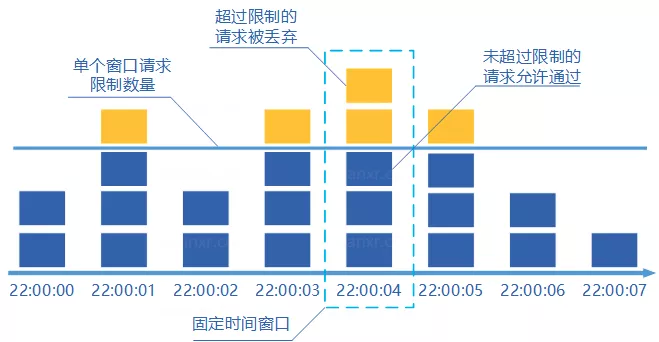
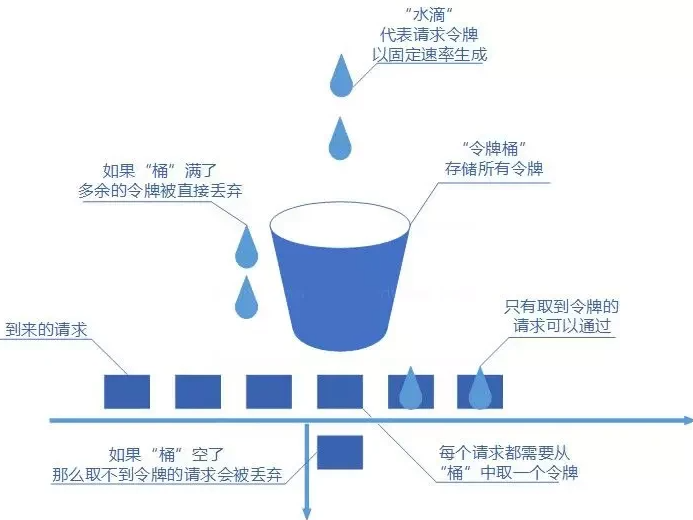

[TOC]

## 负载均衡

负载均衡器，对外暴露统一的接口以提供服务，对内调度后方的多台机器。

从 DNS 解析开始，通过域名 → CNAME → 负载调度服务 → 就近的数据中心入口的路径，根据 IP 地址将用户请求分配到一个合适的数据中心中。然后我们探讨数据中心内部的负载均衡。它可以分为两种，四层负载均衡（传输层）七层负载均衡（应用层）

- 四层负载均衡的优势是性能高，七层负载均衡的优势是功能强
- 做多级混合负载均衡，通常应是低层的负载均衡在前，高层的负载均衡在后

四层负载均衡实际上是多种均衡器工作模式的统称，这些工作模式的共同特点是维持着同一个 TCP 连接，而不是说负载均衡在第四层工作。事实上，这些模式是在二层（数据链路层，改写 MAC 地址）和三层（网络层，改写 IP 地址）上工作


数据链路层负载均衡修改请求的数据帧中的 MAC 目标地址。使用这种负载均衡模式时，需要把真实物理服务器集群所有机器的**虚拟 IP 地址（Virtual IP Address，VIP）**，配置成负载均衡器的虚拟 IP 。这种负载均衡模式也常被很形象地称为**「三角传输模式」（Direct Server Return，DSR）**，也有叫**「直接路由」（Direct Routing）**。


网络层负载均衡修改请求的数据帧中的 IP 目标地址。有两种修改方式：

- 均衡器在原本数据包的基础上，添加额外的 Header，其中目标地址写入真实服务器的 IP。服务器接收到该新数据包后，将负载均衡器自动添加的那层 Headers 扔掉

  

  这种模式要求：

  - 服务器集群中的所有机器的虚拟 IP 地址，配置成负载均衡器的虚拟 IP 。因为回复该数据包时，需要使用这个虚拟 IP 作为响应数据包的源地址，这样客户端收到这个数据包时才能正确解析。
  - 服务器必须支持 IP 隧道协议（IP Encapsulation）

- 均衡器需要分别修改用户请求中的目标地址，以及服务器响应中的源地址：

  

  在流量压力比较大的时候，NAT 模式的负载均衡会带来较大的性能损失


  工作在四层之后的负载均衡模式就无法再进行转发了，只能进行代理。此时真实服务器、负载均衡器、客户端三者之间由两条独立的 TCP 通道来维持通信


  代理根据哪一方能感知到，可以分为

- 正向代理：在客户端设置的、代表客户端与服务器通信的代理服务，它是客户端可知，而对服务器透明的
- 反向代理：客户端来说是透明的
- 透明代理：对于双方是透明的

很显然，七层负载均衡器就属于反向代理中的一种。只论网络性能，七层均衡器肯定是无论如何比不过四层均衡器的，它比四层均衡器至少多一轮 TCP 握手，有着跟 NAT 转发模式一样的带宽问题。但可用的解析规则远比四层丰富，更加灵活


均衡策略与实现：

- **轮循均衡**（Round Robin）：每一次来自网络的请求轮流分配给内部中的服务器。
- **权重轮循均衡**（Weighted Round Robin）：根据服务器的不同处理能力，给每个服务器分配不同的权值，使其能够接受相应权值数的服务请求
- **随机均衡**（Random）：把来自客户端的请求随机分配给内部中的多个服务器
- **一致性哈希均衡**（Consistency Hash）：根据请求中某一些数据（可以是 MAC、IP 地址，也可以是更上层协议中的某些参数信息）作为特征值来计算需要落在的节点上
- **响应速度均衡**（Response Time）：负载均衡设备对内部各服务器发出一个探测请求（例如 Ping），然后根据内部中各服务器对探测请求的最快响应时间来决定哪一台服务器来响应客户端的服务请求。
- **最少连接数均衡**（Least Connection）
- ...

负载均衡器的实现分为：

- 软件均衡器
  - 操作系统内核的均衡器：LVS（Linux Virtual Server）
  - 应用程序形式的均衡器：Nginx、HAProxy、KeepAlived 等


## 分布式锁

分布式锁可以用在以下场景：

1. **防止缓存击穿**，在从数据库加载数据到缓存期间，如果不加锁，那么流量会打进数据库中。此时加锁保证了只会有一个请求同时打到数据库中

2. **保证接口幂等性**：提交接口添加分布式锁，第一次提交的时候会锁住，然后第二次提交发现有锁，就不会执行业务逻辑了。

3. **秒杀减库存等类似业务防止超卖的情况**

   

   

注意：Redis 客户端 Redisson 以及 Zookeeper 的客户端 Curator 都为我们提供了各种锁。我们要善于使用它们，而不是重复造轮子。

### MySQL

在 MySQL 中实现分布式锁的关键技术就是索引的唯一性，它的工作流程如下：

1. 加锁时，向表 Insert 一条数据
2. 如果抛出 Key 重复异常，那么就说明有其他客户端持有该锁。此时我们只能重新执行 Insert 语句来重试加锁。
3. 持有锁的客户端在释放锁时，直接 Delete 表中的数据

下面设计一张分布式表：

~~~json
DROP TABLE IF EXISTS `common_lock`;
CREATE TABLE `common_lock` (
    `id` int NOT NULL,
    `entry_count` int NOT NULL,
    `thread_id` int NOT NULL,	
    `host_ip` varchar(30) NOT NULL,
     PRIMARY KEY (`id`),
) ENGINE=InnoDB DEFAULT CHARSET=utf8mb4;
~~~

- `id`：表示在 id 的资源上，有没有加锁
- `entry_count`：用于记录可重入次数的
- `thread_id` & `host_ip`：用于标识可重入的客户端。这里假定某台主机上竞争该锁的 多个 `thread_id` 都不相同

### Redis

#### 互斥锁

Redisson 客户端提供了完善的分布式锁解决方案，我们先看一个 Demo

~~~java
Config config = new Config();
config.useClusterServers()
       // use "rediss://" for SSL connection
      .addNodeAddress("redis://127.0.0.1:7181")
      .addNodeAddress("redis://127.0.0.1:7182")
      .addNodeAddress("redis://127.0.0.1:7183");

RedissonClient redisson = Redisson.create(config);
RLock lock = redisson.getLock("myLock");

// 3.加锁
lock.lock();
try {
  ...
} finally {
    // 4.解锁
    lock.unlock();  
}
~~~

下面我们来底层剖析一下加锁的逻辑，它执行一段 Lua 脚本，通过该脚本来保证多个命令的原子性。该脚本的命令序列如下：

~~~lua
-- 如果不存在锁 KEYS[1]
if (redis.call('exists', KEYS[1]) == 0) then
    -- 使用 Hash 结构
    -- 这里的 ARGV[2] 是由 uuid:threadId 组成的一个唯一的数值
    -- 不能只使用 threadId，因为它在不同机器上是可以重复的
    -- 这里的 1，表示增加一次可重入次数
    redis.call('hincrby', KEYS[1], ARGV[2], 1);
    -- 设置过期时间为 ARGV[1]
    redis.call('pexpire', KEYS[1], ARGV[1]);
    -- 返回null代表成功
    return nil;
end;
-- 如果存在锁 KEYS[1] 并且 锁的[uuid:threadId]和请求中的相同，也就是说持有锁的线程是自己
if (redis.call('hexists', KEYS[1], ARGV[2]) == 1) then 
    redis.call('hincrby', KEYS[1], ARGV[2], 1);
    redis.call('pexpire', KEYS[1], ARGV[1]);
    return nil;
end;

-- 锁的[uuid:threadId]和请求中的不相同
-- 返回剩余过期时间，用于重试获取锁。
return redis.call('pttl', KEYS[1]);
~~~

在集群中，先根据这个锁的 key 算出 hash 值，看看落在哪个 slot 槽上，也就找到了那台机器，然后只在那一台机器加锁。在 Redisson 中，锁的存储结构如下：

~~~redis
key: {
    [uuid:threadId]:锁次数
}
~~~

- key：用来标识一个锁
- [uuid:threadId]：用来标识持有锁的线程
- 锁次数：支持可重入


我们再来看释放锁的逻辑：

~~~lua
-- 如果线程并不持有锁，那么直接返回
if (redis.call('hexists', KEYS[1], ARGV[3]) == 0) then
    return nil;
end;

-- 给锁的可重入次数减一
local counter = redis.call('hincrby', KEYS[1], ARGV[3], -1);
if (counter > 0) then
    -- 如果还有可重入次数，那么就续期
    redis.call('pexpire', KEYS[1], ARGV[2]);
    return 0;
else 
    -- 直接释放掉锁
    redis.call('del', KEYS[1]);
    redis.call('publish', KEYS[2], ARGV[1]);
    return 1;
end;
return nil;
~~~


等待获取锁的逻辑：如果获取锁失败了，那么给客户端返回一个超时时间，客户端等待这段时间后，再去重新获取该锁。


Redisson 内部有个 watchDog（看门狗）的机制来解决锁续期的问题。核心工作流程是定时监测业务，如果业务尚未执行结束，且锁的到期时间小于 2/3，那么就续期。值得一提的是，如果用户显式设置了过期时间，那么就不会开启看门狗机制。下面我们来看如何实现的：

~~~java
private void renewExpiration() {
    Timeout task = commandExecutor.getConnectionManager().newTimeout(new TimerTask() {
        @Override
        public void run(Timeout timeout) throws Exception {
            // 调用 lua 脚本进行续期
            RFuture<Boolean> future = renewExpirationAsync(threadId);
            future.onComplete((res, e) -> {
                // 报异常就移除 key
                if (e != null) {
                    // 省略 remove 的代码
                }
                // 续期成功的话就调用自己，进行下一轮续期。
                if (res) {
                    renewExpiration();
                } else {
                    // 续期失败的话就取消续期，移除 key 等操作
                    cancelExpirationRenewal(null);
                }
            });
        }
        // 这里是个知识点，续期线程在过期时间达到三分之一的时候工作，比如9s 过期时间，那么续期会在第 3 秒的时候工作
    }, internalLockLeaseTime / 3, TimeUnit.MILLISECONDS);
    ee.setTimeout(task);
}
~~~

下面是实现续期逻辑的 Lua 脚本：

~~~lua
if (redis.call('hexists', KEYS[1], ARGV[2]) == 1) then
    redis.call('pexpire', KEYS[1], ARGV[1]);
    return 1;
end;
	return 0;
~~~

当锁释放时，立即取消 watchDog，防止重新续期。同时 Redisson 通过时间轮（`io.netty.util.HashedWheelTimer`）来维护 watchDog，避免了创建昂贵的线程。

#### 分布式公平锁

Redisson 提供了公平锁机制，使用方式如下：

```java
RLock fairLock = redisson.getFairLock("anyLock");
fairLock.lock();
```

公平锁的核心就是三个数据结构：

- hash：存储锁以及重入次数
- list：线程的等待队列
- zset ：分数 score 用来存储等待线程的超时时间戳。

而对于非公平锁，无需 list 进行排队，就用一个 hash 结构来存储锁即可。

下面我们来看一下实现公平锁加锁的 Lua 脚本，它的参数如下：

- KEYS[1]：加锁的名字，`anyLock`；
- KEYS[2]：加锁等待队列，`redisson_lock_queue:{anyLock}`；
- KEYS[3]：等待队列中线程锁时间的 set 集合，`redisson_lock_timeout:{anyLock}`，是按照锁的时间戳存放到集合中的；
- ARGV[1]：锁超时时间，用在 Hash 中的；
- ARGV[2]：UUID:ThreadId 组合 `a3da2c83-b084-425c-a70f-5d9a08b37f31:1`；
- ARGV[3]：threadWaitTime 默认 300000。当要添加到队列时，之前队尾的超时时间戳 + threadWaitTime 就是当前线程在队列中的超时时间戳。
- ARGV[4]：currentTime 当前时间戳。

代码如下：

~~~lua
-- 在其他锁争夺资源时，会先从移除超时的线程
-- 这样做的目的是及时清理超时线程，避免堆积，以及确保下面的执行逻辑正确执行
while true do
    -- 从等待队列 redisson_lock_queue:{anyLock} 中获取第一个等待线程；
    local firstThreadId2 = redis.call("lindex", KEYS[2], 0)
    if firstThreadId2 == false then
        -- 等待队列为空，直接退出循环
        break;
    end
    
    -- 从等待线程超时集合 redisson_lock_timeout:{anyLock} 中获取第一个等待线程的分数；
    local timeout = tonumber(redis.call("zscore", KEYS[3], firstThreadId2));
    if timeout <= tonumber(ARGV[4]) then
        -- 超时了，则直接移除
        redis.call("zrem", KEYS[3], firstThreadId2);
        redis.call("lpop", KEYS[2]);
    else 
        -- 没有超时，直接退出循环
        break
    end
end


-- 锁 anyLock 不存在
-- 或者，等待队列 redisson_lock_queue:{anyLock} 为空，或者当前线程在队首
if (redis.call('exists', KEYS[1]) == 0)
    and ((redis.call('exists', KEYS[2]) == 0)
        or (redis.call('lindex', KEYS[2], 0) == ARGV[2])) then
    
    -- 从等待队列和超时集合中删除当前线程
    -- 这时候等待队列和超时集合都是空的，不执行操作；
    redis.call('lpop', KEYS[2]);
    redis.call('zrem', KEYS[3], ARGV[2]);
    
    -- 这里也不执行操作
    local keys = redis.call('zrange', KEYS[3], 0, -1);
    for i = 1, #keys, 1 do
        redis.call('zincrby', KEYS[3], -tonumber(ARGV[4]), keys[i]);
    end;

    -- 加锁并设置超时时间
    redis.call('hset', KEYS[1], ARGV[2], 1);
    redis.call('pexpire', KEYS[1], ARGV[1]);
    return nil;
end;


-- 处理可重入的逻辑
if (redis.call('hexists', KEYS[1], ARGV[2]) == 1) then
    redis.call('hincrby', KEYS[1], ARGV[2], 1);
    redis.call('pexpire', KEYS[1], ARGV[1]);
    return nil;
end;

-- 走到这里的话，就说明获取锁失败了
local timeout = redis.call("zscore", KEYS[3], ARGV[2]);
if timeout ~= false then
    -- 返回前一个等待线程的剩余超时时间
    return timeout - tonumber(ARGV[3]) - tonumber(ARGV[4]);
end


--  走到这里的话，就说明这是新来的线程，要放在队列中等待
-- 从线程等待队列 redisson_lock_queue:{anyLock} 中获取最后一个线程；
local lastThreadId = redis.call('lindex', KEYS[2], -1);
local ttl;


if lastThreadId ~= false and lastThreadId ~= ARGV[2] then 
    -- 最后一个线程存在，且不是自己，那么获取它的超时时间
    ttl = tonumber(redis.call('zscore', KEYS[3], lastThreadId)) - tonumber(ARGV[4]);
else
    ttl = redis.call('pttl', KEYS[1]);
end;

-- 最后一个线程的超时时间 + 当前时间戳 + threadWaitTime 就是它的超时时间
local timeout = ttl + tonumber(ARGV[3]) + tonumber(ARGV[4]);

-- 使用 zadd 将 Thread3 放到等待线程有序集合，然后使用 rpush 将 Thread3 再放到等待队列中。
if redis.call('zadd', KEYS[3], timeout, ARGV[2]) == 1 then
    redis.call('rpush', KEYS[2], ARGV[2]);
end;
return ttl;
~~~


公平锁释放锁的 Lua 脚本：

- `KEYS[1]`：加锁的名字，`anyLock`；
- `KEYS[2]`：加锁等待队列，`redisson_lock_queue:{anyLock}`；
- `KEYS[3]`：等待队列中线程锁时间的 set 集合，`redisson_lock_timeout:{anyLock}`，是按照锁的时间戳存放到集合中的；
- `KEYS[4]`：`redisson_lock__channel:{anyLock}`；
- `ARGV[1]`：LockPubSub.UNLOCK_MESSAGE；
- `ARGV[2]`：锁在 Hash 中的超时时间
- `ARGV[3]`：UUID:ThreadId 组合 `58f6c4a2-9908-4957-b229-283a45359c4b:47`；
- `ARGV[4]`：currentTime 当前时间戳。

~~~lua
-- 和在加锁中的逻辑一样，这里就不再介绍
while true do
    local firstThreadId2 = redis.call("lindex", KEYS[2], 0)
    if firstThreadId2 == false then
        break;
    end
   
    local timeout = tonumber(redis.call("zacore", KEYS[3], firstThreadId2));
    if timeout <= tonumber(ARGV[4]) then
        redis.call("zrem", KEYS[3], firstThreadId2);
        redis.call("lpop", KEYS[2]);
    else 
        break
    end
end

-- 锁不存在
if (redis.call("exists", KEYS[1] == 0)) then
    local nextThreadId = redis.call("lindex", KEYS[2], 0);
    if nextThreadId ~= false then
        -- 通知队列中的第一个线程来获取锁
        redis.call("publish", KEYS[4].. ":"..nextThreadId, ARGV[1]);
    end
    return 1;
end

-- 锁存在，但不是自己持有的锁，直接退出
if (redis.call("hexists", KEYS[1], ARGV[3]) == 0) then
    return nil;
end

-- 处理可重入的逻辑
local counter = redis.call("hincrby", KEYS[1], ARGV[3], -1);
if (counter > 0) then 
    redis.call("pexpire", KEYS[1], ARGV[2]);
    return 0;
end

-- 删除，并通知队列中的第一个线程来获取锁
redis.call("del", KEY[1]);
local nextThreadId = redis.call("lindex", KEY[2], 0);
if nextThreadId ~= false then
    redis.call("publish", KEYS[4] .. ":" .. nextThreadId, ARGV[1]);
end
return 1;
~~~


#### 分布式读写锁

读写锁在互斥锁的基础上，添加 mode 字段就可以了：

~~~json
"readWriteLock": {
    "mode": write,
    // 写锁下，只能有一个持有该锁的客户端
    "UUID:ThreadId:write": 1
}

"readWriteLock": {
    "mode": read,
    "uuid:threadId1": 2,
    "uuid:threadId2": 1
}
~~~

并不能直接在读锁上设置 hash 的过期时间，因为每个线程的共享锁的过期时间都不一致。因此，我们还要单独为每个线程维护一个超时时间，这对读锁的 watchDog 有所影响。而写锁就没有这个问题。

~~~shell
# 给 hash 结构续期
pexpire readWriteLock 30000

# 给单独读锁续期
pexpire {readWriteLock}:aaa:rwlock_timeout 30000
~~~


下面是一个使用 Demo：

~~~java
Config config = new Config();
config.useClusterServers()
	.addNodeAddress("redis://127.0.0.1:7001")
    .addNodeAddress("redis://127.0.0.1:7002")

RedissonClient redisson = Redisson.create(config);
RReadWriteLock rwlock = redisson.getReadWriteLock("anyRWLock");

rwlock.readLock().lock();
rwlock.writeLock().lock();
~~~


读锁的源码地址：`org.redisson.RedissonReadLock#tryLockInnerAsync`。参数列表：

1. KEYS[1]：锁名字 anyRWLock
2. KEYS[2]：当前线程在锁上的超时 key `{anyRWLock}:UUID:ThreadId:rwlock_timeout` 
3. ARGV[1]：锁在超时 Key 上的超时时间，默认 30s
4. ARGV[2]：当前线程，`UUID:ThreadId` 组成的字符串
5. ARGV[3]：写锁名字，`UUID:ThreadId:write` 

~~~lua
local mode = redis.call("hget", KEYS[1], "mode");

-- 如果锁不存在，那么就创建一个
if (mode == false) then
    redis.call('hset', KEYS[1], "mode", "read");
    redis.call("hset", KEYS[1], ARGV[2], 1);
    redis.call("set", KEYS[2], ..":1", 1);
    redis.call("pexpire", KEYS[2], .. ":1", ARGV[1]);
    redis.call("pexpire", KEYS[1], ARGV[1]);
    return nil;
end

-- 如果锁是读锁，或者，是写锁而且 Hash 中 UUID:ThreadId:write 存在
if (mode == "read") or (mode == "write" and redis.call("hexists", KEYS[1], ARGV[3]) == 1) then 
    -- 多个线程可以同时持有读锁，所以这里没必要做读锁的互斥判断
    -- 如果当前锁持有写锁，那么就执行降级操作
    local ind = redis.call("hincrby", KEYS[1], ARGV[2], 1);
    local key = KEYS[2] ..":".. ind;
    redis.call("set", key, 1);
    redis.call("pexpire", key, ARGV[1]);
    
    local remainTime = redis.call("pttl", KEYS[1]);
    redis.call("pexpire", KEYS[1], math.max(remainTime, ARGV[1]));
    return nil;
end

return reids.call("pttl", KEYS[1]);
~~~


写锁的源码地址：`org.redisson.RedissonWriteLock#tryLockInnerAsync`。参数列表：

1. KEYS[1]：当前锁 anyRWLock
2. ARGV[1]：锁在超时 Key 上的超时时间，默认 30s
3. ARGV[2]：写锁名字，`UUID:ThreadId:write` 组成的字符串

~~~lua
local mode = redis.call("hget", KEYS[1], "mode");
-- 如果没有锁，那么就创建一个
if (mode == false) then
    redis.call("hset", KEYS[1], "mode", "write");
    redis.call("hset", KEYS[1], ARGV[2], 1);
    redis.call("pexpire", KEYS[1], ARGV[1]);
    return nil;
end

-- 处理可重入的逻辑
if (mode == "write") then
    if (redis.call("hexisys", KEYS[1], ARGV[2]) == 1) then
        redis.call("hincrby", KEYS[1], ARGV[2], 1);
        local currentExpire = redis.call("pttl", KEYS[1]);
        redis.call("pexpire", KEYS[1], currentExpire + ARGV[1]));
        return nil;
    end
end

return reids.call("pttl", KEYS[1]);
~~~

读锁的 watchDog 不仅要续期 hashKey，还要单独为每个线程进行续期

#### 联锁 MultiLock

联锁把多把锁合并成一个锁，然后它会保证所有锁都上锁成功后，才算成功。

~~~java
RLock lock1 = redissonInstance1.getLock("lock1");
RLock lock2 = redissonInstance2.getLock("lock2");
RLock lock3 = redissonInstance3.getLock("lock3");

RedissonMultiLock lock = new RedissonMultiLock(lock1, lock2, lock3);
// 同时加锁：lock1 lock2 lock3
// 所有的锁都上锁成功才算成功。
lock.lock();
...
lock.unlock();
~~~

RedissonMultiLock 的原理就是内部维护一个锁的集合，加锁/解锁的时候就通过遍历集合，调用每把锁自己的 lock/unlock 方法，至于底层是如何实现互斥、可重入等逻辑细节都是每把锁自己实现的。

在加锁过程中，如果有一个失败的加锁操作，那么 unlock 所有已经持有的锁。然后就会执行外部的 `while (true)` 逻辑，然后重新再走一遍 `RedissonMultiLock#tryLock`。

#### 红锁

它是基于 Redis 的高可用分布式锁。直接说结论，**Redisson RedLock 已经被弃用**。了解其思想即可，下面就不给出实现了。推荐大家阅读两篇文章：

- Martin Kleppmann：How to do distributed locking[2] https://martin.kleppmann.com/2016/02/08/how-to-do-distributed-locking.html
- Salvatore（Redis 作者）：Is Redlock safe?[3] http://antirez.com/news/101

它在 N 个 Master 个上依次加锁，如果至少有 $ N / 2 + 1$ 个成功加锁，那么就视为加锁成功。在保证高可用性的同时，也解决了主从模式下同步延迟的问题。

在实现上，它复用联锁的逻辑。它俩的唯一区别就是联锁允许失败0 个，而红锁就允许失败`锁总数 - (n/2)+1`个

### ZooKeeper

假设有 n 个客户端争相获取一个锁。为了获取锁，一个进程试着创建 /lock 节点，如果 该节点存在了，客户端就会监视这个 znode 节点的删除事件。当  /lock 被删除时，所有监视 /lock节点的客户端收到通知。但这会有羊群效应，就是说当删除时，会产生大量的事件流量。

让客户端创建一个有序的节点 `/lock/lock-XXX`。客户端通过 `getChildren` 方法来获取所有 `/lock`下的子节点，并判断自己创建的节点是否是最小的序列号。如果客户端创建的节点不是最小序列号，就根据序列号确定序列， 在前一个节点上设置监视点。这样，每个节点上设置的监视点只有最多一个客户端。避免了监控点的羊群效应。

设置一个监视点会使服务端在内存消耗上增加大约 250 到 300 个字节。如果存在一百万个监视点，估计会消耗 0.3GB 的内存。因此，开发者必须时刻注意所设置的监视点数量。

### 事务与锁

下面我们来看一个例子：

~~~java
@Transactional(rollbackFor = Exception.class)
public Result func(seckillId, long userId) {
    lock.lock();
    lock.unlock();
}
~~~

这样事务的提交在解锁之后，在这段时间，很可能产生线程安全问题。因此我们要这样写，把整个事务放在锁的工作范围之内：

~~~java
public void lockProduct() {
    try {
        lock.lock();
        sellProduct();
    } finally {
        lock.unlock();
    }
}

@Transactional(rollbackFor = Exception.class)
public Result sellProduct() {
    
}
~~~

## 限流

### 固定窗口

将单位时间段当做一个窗口，计数器记录这个窗口接收请求的次数。



缺点：

- **限流不够平滑**。例如，我们限制某个接口每分钟只能访问 30 次，假设前 30 秒就有 30 个请求到达的话，那后续 30 秒将无法处理请求
- **无法保证限流速率，因而无法应对突然激增的流量**。例如，我们限制某个接口 1 分钟只能访问 1000 次，该接口的 QPS 为 500，前 55s 这个接口 1 个请求没有接收，后 1s 突然接收了 1000 个请求。

### 滑动窗口

它将单位时间周期分为 n 个小周期，分别记录每个小周期内接口的访问次数，并且根据时间滑动，删除过期的小周期。

### 漏桶算法

我们往桶中以任意速率流入水，以一定速率流出水。当水超过桶流量则丢弃，因为桶容量是不变的，保证了整体的速率。


- 只能以固定的速率处理请求，对系统资源利用不够友好
- 桶流入水（发请求）的速率如果一直大于桶流出水（处理请求）的速率的话，那么桶会一直是满的，一部分新的请求会被丢弃，导致服务质量下降。

### 令牌桶算法

令牌桶算法是对漏斗算法的一种改进，除了能够起到限流的作用外，还允许一定程度的流量突发。



- 可以限制平均速率和应对突然激增的流量。
- 可以动态调整生成令牌的速率。

可以通过 Redisson 的 RRateLimiter 对象来实现分布式限流逻辑。

~~~java
RRateLimiter rateLimiter = redissonClient.getRateLimiter("LIMITER_NAME");
// 每 10 秒钟生成 5 个令牌
rateLimiter.trySetRate(RateType.OVERALL, 5, 10, RateIntervalUnit.SECONDS);

// 请求 num 个令牌。当请求不到时阻塞，最大阻塞时间为1分钟。
rateLimiter.tryAcquire(num,1,TimeUnit.MINUTES);
~~~

### Redis 限流原理

使用 Redis 也可以实现简单的限流，常见的限流方法有：

1. **基于计数器和过期时间实现的计数器算法**：使用一个计数器存储当前请求量（每次使用 incr 方法相加），并设置一个过期时间，让计数器在过一段时间自动清零。计数器未到达限流值就可以继续运行

   ~~~java
   public class RedisRateLimiter {
   	private static final String REDIS_KEY = "request_counter";
       private static final int REQUEST_LIMIT = 100; // 限流阈值
       private static final int EXPIRE_TIME = 60; // 过期时间（秒）
       public boolean allowRequest() {
           Jedis jedis = new Jedis("localhost");
           
           try {
               Long counter = jedis.incr(REDIS_KEY);
               // 这里未考虑线程安全问题
               if (counter == 1) {
                   // 第一次设置过期时间
                   jedis.expire(REDIS_KEY, EXPIRE_TIME);
               }
               
               if (counter <= REQUEST_LIMIT) {
                   return true; // 允许请求通过
               } else {
                   return false; // 请求达到限流阈值，拒绝请求
               }
           } finally {
               jedis.close();
           }
       }
   }
   ~~~

2. **基于有序集合（ZSet）实现的滑动窗口算法**：将请求都存入到 ZSet 集合中，在分数（score）中存储当前请求时间。然后再使用 ZSet 提供的 range 方法轻易的获取到 2 个时间戳内的所有请求，通过获取的请求数和限流数进行比较并判断，从而实现限流。

   ~~~java
   private static final String ZSET_KEY = "request_timestamps";
   private static final int WINDOW_SIZE = 60; // 时间窗口大小（单位：秒）
   private static final int REQUEST_LIMIT = 100; // 限流阈值
   
   public boolean allowRequest() {
       Jedis jedis = new Jedis("localhost");
       long currentTimestamp = System.currentTimeMillis() / 1000;
   
       // 添加当前请求的时间戳到有序集合
       jedis.zadd(ZSET_KEY, currentTimestamp, String.valueOf(currentTimestamp));
   
       // 移除过期的请求时间戳，保持时间窗口内的请求
       long start = currentTimestamp - WINDOW_SIZE;
       long end = currentTimestamp;
       jedis.zremrangeByScore(ZSET_KEY, 0, start);
   
       // 查询当前时间窗口内的请求数量
       Set<Tuple> requestTimestamps = jedis.zrangeByScoreWithScores(ZSET_KEY, start, end);
       long requestCount = requestTimestamps.size();
   
       jedis.close();
   
       // 判断请求数量是否超过限流阈值
       return requestCount <= REQUEST_LIMIT;
   }
   ~~~

   

3. **基于列表（List）实现的令牌桶算法**：在程序中使用定时任务给 Redis 中的 List 添加令牌，程序通过 List 提供的 leftPop 来获取令牌，得到令牌继续执行，否则就是限流不能继续运行。

   ~~~java
   @Configuration      // 1.注入到 IoC 中，启动程序时加载
   @EnableScheduling   // 2.开启定时任务
   public class SaticScheduleTask {
       @Autowired
       private RedisTemplate redisTemplate;
       // 3.添加定时任务
       @Scheduled(fixedRate = 1000)
       private void configureTasks() {
           redisTemplate.opsForList().rightPush("limit_list",UUID.randomUUID().toString());
       }
   }
   ~~~

   ~~~java
   public boolean allowRequest(){
       Object result = redisTemplate.opsForList().leftPop("limit_list");
       if(result == null){
           return false;
       }
       return true; 
   }
   ~~~


## 分布式 ID 设计

分布式 ID 需要满足下面这些要求：

- **全局唯一**

- **有序递增**

- **信息安全**：如果 ID 是连续的，恶意用户的扒取工作就非常容易做了。例如，按照顺序下载指定 URL 即可，或者可以根据订单 ID 的递增规律就能推算出每天的订单量。

  

分布式 ID 常见的解决方案：

1. 数据库主键自增

   ~~~sql
   CREATE TABLE `sequence_id` (
     `id` bigint(20) unsigned NOT NULL AUTO_INCREMENT,
     `stub` char(10) NOT NULL DEFAULT '',	-- stub 字段无意义，只是为了占位
     PRIMARY KEY (`id`),
     UNIQUE KEY `stub` (`stub`)
   ) ENGINE=InnoDB DEFAULT CHARSET=utf8mb4;
   ~~~

   ~~~sql
   BEGIN;
   REPLACE INTO sequence_id (stub) VALUES ('stub'); -- replace into 语句会根据唯一键/主键删除原有的一条记录， 并且插入一条新的记录来替换原记录。
   SELECT LAST_INSERT_ID();
   COMMIT;
   ~~~

   这种方式性能极差，可以使用 Redis 来稍微改善一下性能问题。

2. 数据库号段模式：先批量获取，然后存在在内存里面。当号用完了，再从数据库中获取新的号段。

3. UUID，并不推荐，对于索引并不友好，性能差。

4. Snowflake 算法：

   

   - **timestamp（41 bits）**：一共 41 位，用来表示时间戳，单位是毫秒，可以支撑约 69 年
   - **datacenter id + worker id （10 bits）**：一般来说，前 5 位表示机房 ID，后 5 位表示机器 ID
   - **sequence （12 bits）**：一共 12 位，用来表示序列号。每毫秒最多生成 4096 个唯一 ID

   该算法有时钟回拨的问题

## 幂等性

接口幂等性问题通常由以下多种原因引起：

- 用户快速重复点击
- 超时重试：网络通信中延迟等情况，导致客户端未收到服务端的响应，但请求已被服务端处理了。此时客户端可能会重新发送请求，从而接口被重复调用。
- 定时任务或异步处理：定时任务的调度逻辑设计不当，可能会导致同一任务被执行多次。或者在消息队列中，消息可能会因为异常等原因被重复消费。
- 并发控制

有些接口是天然保证幂等性的，比如查询操作、删除操作。 Update 操作在某些情况下是幂等的，但是 ABA 问题下， Update 操作就需要幂等性了。显然，插入操作无幂等性。


可以使用 RPG （POST/Redirect/GET）模式来解决，它是一种前端交互策略，具体的交互流程如下：

1. 并通过 POST 请求将其发送至服务器
2. 服务器通过 HTTP 响应码 302 或 303 实现重定向
3. 当用户在此后刷新页面时，浏览器只会按照常规方式重新发起 GET 请求，而非重新提交 POST 数据


在插入时，可以利用数据库的唯一索引特性来保证幂等性。


Token 机制具体流程如下：

1. 当用户开始执行一个需要确保幂等性的操作（如支付、下单、更新用户信息等）时。客户端向服务端申请一个 Token。
2. 服务端会生成一个唯一的、有时效性的 token。生成的 token 会被存储在服务端的一个临时存储介质中（Redis）
3. 将生成的 token 返回给客户端，客户端在进行 API 调用时，需将此 token 作为请求参数中一并发送给服务端。
4. 服务端在接收到带有 token 的请求时，首先检查 token 是否存在并且有效。检查未通过则不放行此次请求


幂等性的相关代码：

~~~java
@Target(value = ElementType.METHOD)
@Retention(RetentionPolicy.RUNTIME)
public @interface Idempotent {
    String param() default "token";
}

@Aspect
@Component
public class IdempotentAspect {
    private final RedissonClient redissonClient;

    public IdempotentAspect(RedissonClient redissonClient) {
        this.redissonClient = redissonClient;
    }

    @Pointcut("@annotation(cn.atsukoruo.productservice.utils.Idempotent)")
    public void idempotent() {}

    @Around("idempotent()")
    public Object methodAround(ProceedingJoinPoint joinPoint) throws Throwable {
        MethodSignature signature = (MethodSignature) joinPoint.getSignature();
        Method method = signature.getMethod();
        Idempotent idempotent = method.getAnnotation(Idempotent.class);

        String param = idempotent.param();
        String value = null;
        String[] paramNames = ((CodeSignature)joinPoint.getSignature()).getParameterNames();
        Object[] args = joinPoint.getArgs();

        for (int i = 0; i < paramNames.length; i++) {
            if (paramNames[i].toLowerCase().equals(param.toLowerCase())) {
                value = String.valueOf(args[i]);
                break;
            }
        }
        if (value == null) {
            return Response.fail("未携带 Token");
        }
        boolean hasToken = redissonClient.getBucket(value).delete();
        if (hasToken) {
            return joinPoint.proceed();
        }
        return Response.fail("重复的请求");
    }
}


@RestController
public class TokenGeneratorController {
    private final RedissonClient redissonClient;
    public TokenGeneratorController(RedissonClient redissonClient) {
        this.redissonClient = redissonClient;
    }

    @GetMapping("/idempotent")
    public Response<Object> getIdempotentToken() {
        String token = UUID.randomUUID().toString();
        redissonClient.getBucket(token).set(0, 30, TimeUnit.MINUTES);
        return Response.success(token);
    }

    @Idempotent
    @GetMapping("/idempotent/test")
    public Response<Object> testIdempotent(
            @RequestParam("token") String token
    ) {
        return Response.success("OK");
    }
}

~~~


## 网关设计

软件网关是微服务系统的入口，它的作用为：

- 请求处理：做验证请求有效性、身份验证、API 网关等

- 路由分发：做负载均衡策略

  

  > 网关的负载均衡也被称为**服务器负载均衡**，它是针对微服务系统外部请求而言的；而**客户端负载均衡**则是对各个微服务业务系统之间的服务内部调用而言的

**Nginx 是流量网关**。而 **SpringGateway 是业务网关**：如果应用场景需要在 API 层面实现复杂逻辑，如动态路由、细粒度的鉴权和过滤等，Spring Cloud Gateway 能够提供更灵活的解决方案。Nginx 一般作为最外层的反向代理、缓存静态内容和初步的负载均衡。注意，Gateway 可以搭配注册中心一起来使用，自动发现并路由到新增的微服务实例。而 Nginx 却不行，必须手动维护各个微服务实例的地址信息。一般 Nginx 作为 Gateway 上游网关来使用。


当不同的应用（各自包含若干个微服务）需要相互调用服务时，不应该将微服务的所有接口暴露给其他应用，这是因为应用之间的边界应该严格划分。所以，如果存在跨应用之间的协同，需要把不同应用所提供的 API 接口注册到更上层的 API 网关平台上。此时可以从微服务实例接入到 API 网关，也可以从微服务网关来接入。

由于 API 网关是集中化管理模式，因此对于所有接入的流量，我们可以增加一些拦截器（安全、日志、限流、熔断）来处理这些流量。我们甚至可以在 API 网关的基础上，搭建能力开发平台（SDK），将内部服务通过 API 形式对外进行接口暴露和共享。

补充：微服务网关用于应用中各个微服务之间的调用，本身是去中心化的。

## 异地多活

- 冷备：**定期**将主数据中心的数据库文件被分到其他数据中心。冷备不提供实时服务。
- 热备：通过数据库中从复制，对主数据中心进行实时**备份**。热备提供实时服务


「高可用」这个概念通常用 2 个指标来衡量：

- 平均故障间隔 MTBF（Mean Time Between Failure）：表示两次故障的间隔时间，也就是系统「正常运行」的平均时间，这个时间越长，说明系统稳定性越高
- 故障恢复时间 MTTR（Mean Time To Repair）：表示系统发生故障后「恢复的时间」，这个值越小，故障对用户的影响越小

可用性（Availability）= MTBF / (MTBF + MTTR) * 100%。提升高可用的核心是「冗余」


故障分类：

|   类别   |               出现原因               | 概率 | 影响面 |
| :------: | :----------------------------------: | :--: | :----: |
| 主机故障 |             主机硬件故障             |  大  |   小   |
| 机房故障 | 机房网络故障、电力故障、制冷系统故障 |  小  |   大   |
| 地域故障 |              强自然灾害              | 极小 |  极大  |


同城多活架构（活的意思就是机房承载业务流量）


- 应用要做读写分离，因为备机房不支持写操作。
- 无法抵御地域故障
- 当主机房发生故障时，备机房提升为主机房
  - 接入层流量的切换
  - 数据库的 HA


我们介绍异地双活，这里我们仅考虑要求最终一致性的数据。它的核心思想为：


- 请求按照一定的路由规则打到不同的机房中，并且让同一个用户的相关请求，只在一个机房内完成所有业务「闭环」，不再出现「跨机房」访问。这样避免因相关多个请求打到不同机房，而造成的多主复制下数据冲突的问题。（单元化，Set）

- 不排除程序 Bug 导致用户会在两个机房「漂移」的情况。安全起见，每个机房在写存储时，还需要有一套机制，能够检测「数据归属」，避免本不应该写入本机房的情况发生。

- 机房之间的底层存储保持「双向」同步，每个机房都拥有全量数据，当任意机房故障时，另一个机房就可以「接管」全部流量，实现快速切换。

  **要求数据同步中间件具有合并数据，解决冲突的能力。**从根本上来说，要彻底解决这个问题，就要避免同时修改一个数据行的情况发生，这正是上述单元化的体现。

- 但这里还有一个小问题，随着扩展的机房越来越多，当一个机房写入数据后，需要同步的机房也越来越多。主流的优化方案是把「网状」架构升级为「星状」：即设立一个「中心机房」，任意机房写入数据后，都只同步到中心机房，再由中心机房同步至其它机房。

  |  |  |
  | ------------------------------------------------------------ | ------------------------------------------------------------ |


对于强一致性数据的读写请求，例如配置信息，商品库存，一律路由到中心机房中。或者采用 CP 架构的方案，这样保证了读请求的高可用性。

库存要实现单元化部署有两种方案：

- 按照商品维护进行划分，即一部分商品在一个机房进行交易，而库存和商品所在的机房绑定。
- 把商品的库存数拆成多份，每个机房分一部分数量，分别在每个机房扣减，总数等于库存数。

这里我们采用第二种方案：把一个商品的总库存行按照单元机房拆分成多个单元库存行，每个单元机房的交易下单只减自己本单元的库存行，用户交易订单和库存扣减单据在同一个单元内，不需要跨单元调用。每个单元库存行库存数相加等于总库存行的库存数。卖家编辑库存时只编辑中心单元的库存行值，再按照一定的规则分配到其他单元库存行。

当某个单元库存行库存数扣完后，再到中心库存行去调拨。中心单元保存出库数据。


表是双向同步的含义为：

1. 「单元库存行」是「单元」向「中心单元」单向同步的，因为要保证单行的数据只能在一个单元写，例如单元 E 的行数据只能在单元 E 写，这行的数据会单向同步到中心单元 C 的单元 E 行。
2. 「总库存行」是「中心单元」向「其他单元」单向同步的


## 系统设计

这些设计都是微服务架构里经常提到的 **CQRS（Command QueryResponsibility Separation）**。在 C 端，当同时面临读和写的高并发压力时，把系统分成读和写两个视角来设计，各自设计适合高并发读和写的数据结构或数据模型。**这种设计读比写一定有延迟，它保证了最终一致性。**


### 高并发读的策略

- 缓存机制

  - 本地缓存或 Memcached/Redis 集中式缓存
  - MySQL 的主从复制。
  - CDN 静态文件加速（动静分离）

- 并发读

  - 异步 RPC

    如果需要调用 3 个 RPC 接口，则耗时分别是 T1、T2、T3。如果是同步调用，则所消耗的总时间 T=T1+T2+T3; 如果是异步调用，则所消耗的总时间 T=Max(T1,T2,T3)。

  - Google的「冗余请求」

    我们来看这样一个案例，假设一个用户的请求需要 100 台服务器同时联合处理，每台服务器有 1% 概率发生调用延迟（假设定义响应时间大于 1s 为延迟），那么对于 C 端用户来说，响应时间大于 1s 的概率是 63%

    解决方案就是客户端同时向多台服务器发送请求，哪个返回得快就用哪个，其他的丢弃，但这会让整个系统的调用量翻倍。

    经 Google 公司测试，采用这种方法，可以仅用 2% 额外请求将系统 99.9% 请求响应时间从1800ms 降低到 74ms。

- 重写轻读


我们通过 Twitter 的 Feeds 流来认识「重写轻读」的策略。假设：用户关注了 n 个人，每个人都在不断地发帖子，然后系统需要把这 n 个人的帖子按时间排序成一个列表，也就是 Feeds 流并展示给用户。先考虑最原始的方案，如果这个数据存在数据库里面，大概如下表所示：


假设这里只存储帖子 ID，而帖子的内容、发布时间等信息保存在 NoSQL 数据库中。假设要查询 user_id=1 用户的 Feeds 流，则需要下面 SQL 语句：

~~~sql
select followings from Following where user_id= 1; # 获取用户的关注列表
select msg_ids from Msg where user_id in(followings) limit offset, count
~~~

显然，这种**实时聚合的拉取**方案无法满足高并发的查询请求。再来看下面**推送**方案


每个用户都有一个发件箱和收件箱。假设某个用户有 1000 个粉丝，发布 1 条帖子后，只写入自己的发件箱就返回成功。然后后台异步地把这条帖子推送到 1000 个粉丝的收件箱，也就是「写扩散」。这样，每个用户读取 Feeds 流的时，不需要再实时地聚合了，直接读取各自的收件箱即可。这也就是「重写轻读」，把计算逻辑从“读”的一端移到了“写”的一端。

但是，这又有一个新的问题，假设一个用户的粉丝很多，给每个粉丝的收件箱都复制一份，计算量和延迟都很大。这时候，我们要回到最初的方案，即 SQL 实时聚合。

综上，Feeds 流中的帖子，有的是推给他的（粉丝数少于 5000），有的人是需要他去拉的（粉丝数大于5000），需要把两者聚合起来，再按时间排序，然后分页显示，这就是「推拉结合」。

我们再来看一个案例，如果数据分库，那么执行 Join 或者排序操作的代价很大。此时，我们可以提前将计算结果存放在一张宽表中。这也是重写轻读的方案

### 高并发写的策略

- 数据分片
  - 数据库的分库分表
  - Kafka 的 partition
  - JDK 的 ConcurrentHashMap 实现
  - ES 的分布式索引
- 任务分片
  - CPU 的指令流水线
  - Map/Reduce
  - Tomcat 的 1+N+M 网络模型
- 异步化
- 批量化

### 复制与分区

单主复制技术常用于缓解在数据中心内部的读操作负担，而多主复制并不推荐在数据中心内部使用。在单主复制下，强烈不推荐让复制节点承担写入工作。复制技术的示例图


分区技术常用于缓解写操作的负担。下面是结合复制与分区技术的示意图


