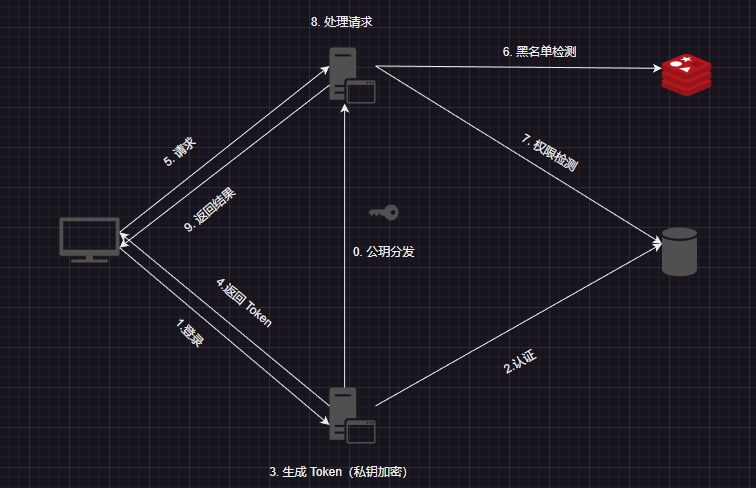
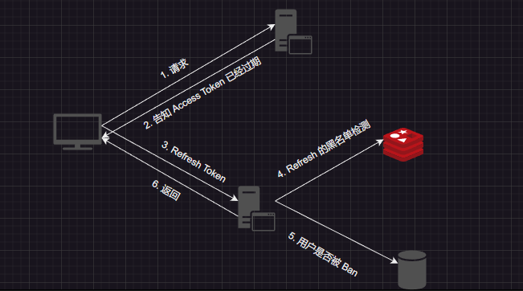
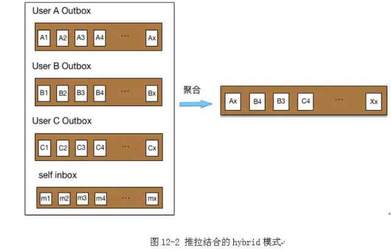
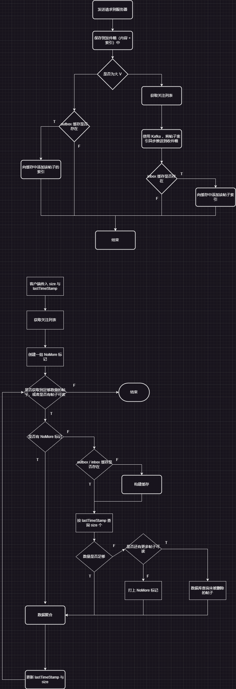
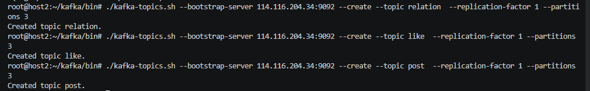

# 系统设计

[TOC]

## 错误码一览

~~~java
public class ErrorCodeConfig {
    public static final int UNKNOWN_ERROR = 0x00000000;
    public static final int USER_NOT_FOUND = 0x00000001;
    public static final int PASSWORD_NOT_CORRECTED = 0x00000002;
    public static final int USER_BANNED = 0x000000003;
    public static final int DUPLICATED_USER = 0x00000004;
    public static final int REG_MATCH_ERROR = 0x00000005;
    public static final int EXPIRED_JWT = 0x00000006;
    public static final int BANNED_REFRESH_TOKEN = 0x00000007;
    public static final int BANNED_ACCESS_TOKEN = 0x00000008;
}
~~~

## 单点登录系统

注：如果权限检测的逻辑简单而且权限几乎无变化，那么可以硬编码在过滤器中，否则就要动态获取数据库中的权限数据来做检测。

Access Token 的 Payload 格式如下：

1. UserID：用户
2. Role：用户所属的角色，用 bitmap 来表示
3. Client：客户端
4. Version：版本
5. Batch：批次
6. ExpireTime：过期时间

Refresh Toekn 的 Payload 格式如下：

1. UserID：用户
2. Client：客户端
3. Version：版本
4. Batch：批次
5. ExpireTime：过期时间

引入 Version 字段的意义在于实现同种类型设备互踢的逻辑。而 Batch 字段的意义在于让所有设备都下线，用于密码修改重新登录、权限变更的场景。

在 Redis 中，用 `UserID:Client:Version` 来存储失效的版本 ，以及用`UserId:Batch` 存储失效的 Batch，使用 Hash 来存储黑名单令牌。如果内存比较紧张，可以使用 MySQL 来代替 Redis。

~~~shell
accessTokenVersion: {
	"user1:client1" : "0"
	"user2:client1" : "0"
}

accessTokenBatch {
	"user1" : "0"
	"user2" : "1"
}

refreshTokenVersion {
	"user1:client1" : "0"
	"user2:client1" : "0"
}

refreshTokenBatch {
	"user1" : "0"
	"user2" : "1"
}

~~~

这种方案无法为单独的 fields 设置过期时间，只能给整个 hash 设置过期时间。 因此，我们可以采用以下方案：

~~~java
"access:user1:client1" : "0"
"access:user1": "1"
"refresh:user1:client1": "0"
"refresh:user1": "1"
~~~

同时在 MySQL 中，维护一张 Token Version 表，来记录 Token 的最新版本，里面有三个字段 UserID、Client、Version。再维护一张 Token Batch 表，来记录 Token 的最新批次。

黑名单校验逻辑如下：先对比 `Batch`，再对比 `Version`。

Access Token 刷新的逻辑：

RefreshToken 刷新的逻辑：当授权服务器发现 RefreshToken 已经过期或者未通过检验，则要求客户端重新登录，获取新的 RefreshToken 以及 AccessToken。

我们依次考察以下场景中 Token 的验证逻辑

1. 设备主动下线
2. 用户注销
3. 用户修改密码
4. 用户账户遭到封禁
5. 用户的权限发生变化

设备主动下线的实现思路：

1. 如果用户在线，那么可以通过 Websocket 连接通知用户下线。
2. 如果用户不在线，那么根据 Version 将该设备的 Access & Refresh Token 加入到黑名单中。在发送请求时，由于 Token 在黑名单中，就强制用户下线重新登录。

如果允许用户同时登录到多台设备，那么 Client 的含义为设备 ID。如果要求用户最多登录到同种类型设备（Android、Chrome、Edge、Windows）中的一台，那么 Client 的含义变为设备类型。

用户注销的场景：

1. 客户端不再持有 Access 与 Refresh，并要求用户重新登录。

用户修改密码的场景：

1. 然后根据当前的 Batch 来封禁 Refresh & Access
2. 将 Batch 自增，然后构建出新的 Refresh & Access Token 给修改密码的客户端。
3. 其他客户端在验证 Token 时，由于Refresh & Access  Batch 版号太小被封禁，因此要求用户重新登录。

用户的权限发生变化：

1. 然后根据当前的 Batch 来封禁  Access

2. Batch 自增

3. 其他客户端在验证 Access Token 时，由于 Batch 版号太小被封禁，因此会拿着 Reresh Token 重新构建出新的 Access Token。

   这里我们看到，多个客户端可能持有不同 Batch 的 RefreshToken，这无关紧要，因为我们只关心最新 Batch 的处理逻辑。

用户封禁的场景：

1. 用户登录时，授权服务器发现用户已经被封禁，则告知客户端用户状态非法
2. 用户遭到封禁时，根据当前的 Batch 来封禁 Refresh & Access

如果用户在 Token 过期后才发起请求。此时 Access Token 被黑名单放行，而且被判定为过期。客户端拿着 Refresh Token 重新获取 Access Token。授权服务器发现 Refresh 已经过期，要求用户重新登录。之后就走 (1) 的逻辑。

密码的要求：

1. 密码长度 6 - 16 位。 

2. 只能包含字母和数字，以及特殊字符（`@`、`#`、`$`、`&`、`.`）。

   

账户名要求：

1. 账户名 4 - 16 位
2. 只能包含字母和数字
3. 账户名不准重复

昵称要求：

1. 昵称 4 - 16 位
2. 只能包含中文、英文、数字
3. 不能是纯数字

## Feed 流系统

outbox 发件箱的索引表

- id：主键
- user
- is_deleted
- create_time

outbox 发件箱的内容表：

- id：对应索引表中的 id
- content
- img_url

这里将索引和内容分离开来，可以优雅地实现一个缓存系统。

inbox 收件箱（就是一张索引表）：

- user：用户
- post：帖子的 ID
- from：表示发帖人
- create_time

outbox 缓存（使用 ZSet 来实现）：

~~~json
userId : {
    "score" : timestamp
    "element": postId
}
~~~

inbox 缓存（使用 ZSet 来实现）：

~~~json
userId : {
	"score": timestamp
    "element": postId
}
~~~

### 推拉

下面这种**实时聚合的拉取**方案无法满足高并发的查询请求。

~~~sql
select id 
from outbox 
where user_id in (		# 获取用户的关注列表
    select to from relationship where from=1 and relation=1) 
limit offset, count 	# 读发件箱
~~~

每个用户都有一个发件箱和收件箱。假设某个用户有 1000 个粉丝，发布 1 条帖子后，只写入自己的发件箱就返回成功。然后后台**异步地**把「这条帖子的索引」，推送到 1000 个粉丝的收件箱，也就是「写扩散」。这样，每个用户读取 Feeds 流的时，**不需要再实时地聚合**了，直接读取各自的收件箱即可。

~~~sql
select id
from inbox
where user_id = 1
limit offset, count
~~~

但是，这又有一个新的问题，假设一个用户的粉丝很多，给每个粉丝的收件箱都复制一份，计算量和延迟都很大。这时候，我们要回到最初的方案，即 SQL 实时聚合。

综上，Feeds 流中的帖子，有的是推给他的（粉丝数少于 5000），有的人是需要他去拉的（粉丝数大于5000），需要把两者聚合起来，再按时间排序，然后分页显示，这就是「推拉结合」。

这里有两个优化的点：

- 对于大 V 用户，可以将帖子推送（写扩散）给那些活跃用户。对于非活跃用户，按照原先「读扩散」策略获取内容即可。
- 为了避免用户关注太多大 V 用户，而使得聚合操作消耗大量计算资源，我们限制用户的关注数。例如，微博就限制一个用户最多关注 2000 名用户。

**特别注意**，在做聚合操作时，无论是 outbox 还是 inbox，都是获取它们的索引表。**根据聚合后的索引结果，再去真正获取帖子的内容**。这样做才能最充分利用到缓存系统，下面会做说明的。

### 分页

当分页拉取时，不推荐使用偏移量，而是使用时间戳来获取，这样可以避免新发表的帖子对偏移量的影响。

Feed 流的用户操作：

1. 下拉加载获取之前的 Feed：在本地持有最旧帖子的时间戳 lastTimestamp，然后从后端获取小于该时间戳的帖子。同时还要指定要获取帖子的 size。
2. 上拉刷新获取最新的 Feed：将 lastTimestamp 设置为 INT.MAX，然后按照（1）思路获取帖子

由于黑名单、删除等过滤操作，可能导致获取到帖子数为 0。为了避免这种情况，后端如果发现聚合后个数不大预期，那么它更新 lastTimestamp 后再重新拉取，直到无更多帖子可读或者达到预期目标。这一切对客户端是无感知的。

### 缓存

为了避免缓存穿透，我们缓存特殊的帖子 `NoMore`，表示没有更多的数据了。

下面考虑各种操作下缓存的行为：

- 发布帖子
  - 用户在**发表帖子**时，先保存到发件箱，然后尝试将帖子索引保存到 outbox 缓存中。
  - 普通用户在**接收帖子索引**时，先保存在收件箱，然后**尝试**将其添加到 inbox 缓存中。
- 删除帖子：由于我们给帖子打上删除标记后，尝试在 outbox 缓存中删除对应的帖子索引。
- 取消关注（拉黑）：对于普通用户，在自己的收件箱删除关注者的帖子即可，然后再从 inbox 缓存中删除对应的帖子索引（这一步开销不可接受的话，直接删除 inbox 也是可以的）。对于大 V 用户，在做聚合时关注列表中没有他了，因此就不再考虑了。
- 关注用户：如果关注的是大 V 用户，无需做任何处理。如果是普通用户，那么在收件箱以及 Cache 中添加他的帖子索引（直接删除 inbox 也是可以的）。

由于帖子的时效性，我们并不缓存时间戳小于 `min_cached_post_timestamp`（一周） 的帖子，这样做的前提时，缓存中的个数大于 `max_cached_post_size`。这样的检查通常在添加缓存中执行。

这里说明一下为什么不做聚合后的缓存，这是因为它极大增加了取消关注、发布帖子等功能下维护缓存的复杂度。这种复杂度所带来的计算开销远远大于缓存的优化。因此，就摒弃了这种缓存。

## 关系系统

~~~sql
DROP TABLE IF EXISTS `relationship`;
CREATE TABLE `relationship`  (
  `from` int NOT NULL,
  `to` int NOT NULL,
  `relation` tinyint NULL DEFAULT NULL,
  INDEX `from_to`(`from` ASC, `to` ASC) USING BTREE
)
~~~

relation 的取值：

~~~java
public class RelationConfig {
    public static final int FOLLOWING = 0;
    public static final int FOLLOWED = 1;
    public static final int BLACKLISTING = 2;
    public static final int BLACKLISTED = 3;
    public static final int BI_FOLLOWING = 4;
    public static final int BI_BLACKLISTING = 5;
}
~~~

有些操作需要被动关系（获取到多条评论，但是发表评论的用户将你拉黑了，此时要过滤掉这些评论），而有些操作需要主动关系（过滤掉在黑名单里的用户的评论）。这样保存双向关系的做法，可以根据操作的性质，按需查询，将复杂度从 O(n) 下降到 O(1)，这里的 n 表示需要查询的用户个数。

关系的状态转移：

~~~java
public void follow(int followerId, int favoriteUserId) throws BlacklistError {
    Integer relation = relationMapper.getRelation(followerId, favoriteUserId);
    switch (relation) {
        case null -> {
            // 和对方暂无关系
            relationMapper.createRelation(
                followerId, favoriteUserId, 
                RelationConfig.FOLLOWING);

            relationMapper.createRelation(
                favoriteUserId, followerId, 
                RelationConfig.FOLLOWED);
        }
        case RelationConfig.BLACKLISTED ->
            // 对方已经拉黑你
            throw new BlacklistError();

        case RelationConfig.FOLLOWED -> {
            // 对方关注了你
            relationMapper.updateRelation(
                followerId, favoriteUserId, 
                RelationConfig.BI_FOLLOWING);

            relationMapper.updateRelation(
                favoriteUserId, followerId, 
                RelationConfig.BI_FOLLOWING);
        }
        default -> {
            // 如果你拉黑了对方，或者你已经关注了对方，那么就直接退出
            return;
        }
    }
}

public void unfollow(int user, int unfollowedUser) {
    Integer relation = relationMapper.getRelation(user, unfollowedUser);
    if (relation != null && 
        (relation == RelationConfig.FOLLOWING 
         || relation == RelationConfig.BI_FOLLOWING)) {
        // 在 FOLLOWING 、BI_FOLLOWING 关系下，才允许进行取关操作
        if (relation == RelationConfig.FOLLOWING) {
            relationMapper.removeRelation(user, unfollowedUser);
            relationMapper.removeRelation(unfollowedUser, user);
        } else {
            relationMapper.updateRelation(
                user,unfollowedUser, 
                RelationConfig.FOLLOWED);
            
            relationMapper.updateRelation(
                unfollowedUser, user, 
                RelationConfig.FOLLOWING);
        }
    }
}

public void blacklist(Integer user, Integer blacklistedUser) {
    Integer relation = relationMapper.getRelation(user, blacklistedUser);
    switch (relation) {
        case null:
            relationMapper.createRelation(
                user, blacklistedUser, 
                RelationConfig.BLACKLISTING);

            relationMapper.createRelation(
                blacklistedUser, user, 
                RelationConfig.BLACKLISTED);
            break;
        case RelationConfig.BLACKLISTED:
            // 已经被拉黑了
            relationMapper.updateRelation(
                user, blacklistedUser, 
                RelationConfig.BI_BLACKLISTING);

            relationMapper.updateRelation(
                blacklistedUser, user, 
                RelationConfig.BI_BLACKLISTING);
            break;
        case RelationConfig.BI_FOLLOWING, RelationConfig.FOLLOWING, RelationConfig.FOLLOWED:
            // 当处于关注关系时，那么自动解除该关系，并设置为拉黑关系
            relationMapper.updateRelation(
                user, blacklistedUser, 
                RelationConfig.BLACKLISTING);
            relationMapper.updateRelation(
                blacklistedUser, user, 
                RelationConfig.BLACKLISTED);
            break;
        case RelationConfig.BLACKLISTING:
            // 已经拉黑了人家，那么什么也不做
            // 触发防御性编程语句
            break;
        default:
            throw new IllegalStateException("Unexpected value: " + relation);
    }
}

public void unblacklist(Integer user, Integer blacklistedUser) {
    Integer relation =  relationMapper.getRelation(user, blacklistedUser);
    if (relation != null
        && (relation == RelationConfig.BI_BLACKLISTING || relation == RelationConfig.BLACKLISTING)) {
        if (relation == RelationConfig.BI_BLACKLISTING) {
            relationMapper.updateRelation(
                user, blacklistedUser, 
                RelationConfig.BLACKLISTED);
            
            relationMapper.updateRelation(
                blacklistedUser, user, 
                RelationConfig.BLACKLISTING);
        } else {
            relationMapper.removeRelation(user, blacklistedUser);
            relationMapper.removeRelation(blacklistedUser, user);
        }
    }
}
~~~

这些状态转移后的后置处理语句就不再给出。例如，在取消关系后，从自己收件箱中删除他的帖子。

## 点赞系统

点赞表：

- id：主键
- subj_id：主题的 ID
- subj_type：主题的类型
- user：点赞的用户 ID
- create_time

再设计缓存系统之前，我们先做出以下假设：

- 被点赞内容的冷热程度与时间成正相关
- ID 与时间成正相关

基于以上两点，我们可以按「时间局部性」来访问内容，就可以做到缓存收益最大化。同时以用户为维度来设计缓存系统：

~~~json
{
    "userId":{
        "ttl": 1653532653,    
        "id1":3640575,            
        "id2":3740575,           
        "idn":3840575,            
        "threshold": 3540575,    
    }
}
~~~

这里我们引入 threshold 字段，来表明 ID 大于 threshold 的内容的用户点赞情况，都进行了缓存。同时，对于 ID 小于 midCid 的内容，不做缓存处理。如果我们不引入该字段，每次缓存未命中后，都要去查询数据库。然而由于点赞行为的特性，未命中的比率可能高达 90%，此时缓存的收益就很低了。

对于评论，它就不满足第一条假设，因此上述这套缓存系统就不适用了。但是我们可以借鉴其思想，并做出以下假设：被点赞评论的冷热程度与点赞数成正比。基于这条假设我们设计出以下系统：

~~~java
{
    "userId": {
        "ttl": 1653532653,    
        "id1":3640575,                       
        "threshold_like": 100,
        "threshold_id" : 3540575
	}
}
~~~

这里的 threshold_like 表示，点赞数大于 threshold 的评论的用户点赞情况，都进行了缓存。而 threshold_id 起到了限制缓存个数的作用。在加载缓存时，按照 like 、id 两个字段排序，然后再执行 limit 操作来限制加载的个数。

## 评论系统

评论主题表（评论区）：

- id：主键
- subj_id：主题的 ID
- subj_type：主题的类型（动态、文章、视频）
- count：评论总数
- status：状态（删除、关闭、精选）
- create_time
- update_time

评论索引表：

- id：主键
- subject_id：主题表的索引
- root：是否为根评论
- parent：父评论的 id
- like_count：点赞数
- deleted
- attrs（bit）：作者顶置、作者点赞、作者回复过
- create_time
- update_time

评论内容表：

- id：主键
- index：评论索引的 id
- content：评论内容
- create_time
- update_time

主题表与索引表之间是一对多关系，而索引表和内容表之间是一对一关系。

提取出索引表后，加快检索的效率，一个内存物理页里可以放更多的数据，减少 IO 次数。

## 购物

### 存储结构

假设我这有一张订单表：

| userID | orderID | vendorId |
| :----: | :-----: | :------: |

一开始先按照 orderID 进行分片。但是随后由于业务需求的变化，要求按照 userID 或者 vendorId 进行查询，如果仍沿用之前的设计，那么必须要全路由。这就是分片键选取后，对于一些普通字段的单条件查询问题。

一种解决策略是使用基因法，思想为将分片键的信息保存在想要查询的列中，一种常见的做法是分片键与普通字段的后 n 位保持相同。这样查用户的订单数据时，根据 userId 的后 n 位做为分片依据即可。**这种方法在以下两个场景不适用：**

- userID 与 vendorID 两个正交维度
- 如果有多个非分片键查询，即使能融入多个基因，但不支持多个非分片键组合条件查询，此时应该交给 ES 来处理

此时一种做法（美团）就是冗余，存储三份数据都相同的表，但是分别基于 userId、orderId、vendorId 进行分片。这样查询性能是相当不错的，但是数据存储的开销就很大了（烧钱呗）。但是当涉及到「多维度的聚合计算」（例如，动态生成报表）时，建议引入 ElasticSearch，作为另一份的数据冗余，专门负责更加复杂的聚合操作。

既然 ES 支持全维度的查询，那么 MySQL 的使用还有必要吗？还是有必要的，这是因为 ES 属于 OLAP (On-Line Analytical Processing) 类型数据库，它不支持 OLTP 类型数据库（MySQL）的事务机制。还有就是，要求 ES 中存储的订单数据是处于最终状态的，这是因为 ES 的 Insert/Delete 操作的开销比较大。 对于 vendorId 与 orderId 的查询走 ES 是不合理的，这是因为 vendorId 的查询要求同步具有高实时性，此时状态尚未稳定下来。

此外，还要有一个定时任务，根据时间维度，做冷热数据的分离。热数据用 SSD （固态硬盘）存储；冷数据用机器硬盘存储，并进行数据压缩，减少存储成本。

下面再介绍下淘宝的做法，它借鉴了覆盖索引的思想，即在订单表上又创建了索引表（全局二级索引），索引表里冗余部分字段，以及分片键到分片的映射关系。假设按照 OrderId  进行分片，那么我们创建如下索引表：

| userId |  db  | orderId | create_time |
| :----: | :--: | :-----: | :---------: |
|   1    |  2   |         |             |
|   1    |  2   |         |             |
|   1    |  3   |         |             |
|   1    |  4   |         |             |

这说明 userId 为 1 的用户，他的订单在 db 为 2、3、4 的数据库中。而如果查询语句所需的字段全都包含在索引表中，那么无需再次路由到实际订单表中，直接从索引表里返回结果即可（回表）。

|    orderId    |  db  |
| :-----------: | :--: |
| 7125660194815 |  1   |
| 1254067014100 |  1   |

这种方案与美团的相比，不是全量冗余，而是冗余部分字段，以及冗余分片键到分片的映射关系，冗余成本比美团的小，但是在性能上比较差。注意，全局索引表是可以进行分片的。

问题：

- 在全局二级索引中添加分页所需的字段，这样就可以解决分片下的分页操作。也可以使用 ES 来解决分页问题。
- 在分片过程中，我们可能遇到大商家问题，即假设我们按照商家 ID 进行分片，那么大商店势必造成数据倾斜问题。单独为这个大商家维护一个数据节点，然后在 DB Proxy 中的权限控制层，设定相应的业务规则，将对大商家的访问路由到特定的节点上。
- Join 问题： DB Proxy（解决一些场景）的 SQL 解析层，如果 Join 操作所涉及的表在同一个节点上，那么直接发送 Join 查询语句。否则，分别向各个分片发送拆分后的查询语句，然后再 Proxy 做 Join 操作。我们可以使用一张广播表（每个节点都有这张表）来优化，但是仅适合小数据量的表（1,000k）

### 事务

这里再谈及一下冗余中的数据同步。一般使用柔性事务，它有两种实现方式：

1. 异步 MQ ：只要消息成功投递到 MQ 当中，那么就认为是成功同步了。之后由 MQ 的「事务 + 幂等 + 重试 + 死信」来保证消息的消费
2. 异步 Canal + 本地消息表（可靠队列）。

## WS 长连接

Provider 仅仅是完成「服务器向 Client 推送消息」的工作而已。具体来说就是，自动做消息路由的工作，找到 ChannelID 对应的长连接，并发送消息。

同一个微服务下的所有实例，共用一个 ServiceID 来向 Netty 注册连接。

|   属性    |  类型   |   说明   |
| :-------: | :-----: | :------: |
|  command  | Integer | 指令类型 |
| channelId |  Long   | 连接标识 |
|   dest    |  Long   |  目的地  |
|  cotent   | String  | 消息内容 |

| ServerId |    服务    |
| :------: | :--------: |
|    1     | 授权服务器 |

|      Command      |      含义      | 标识 |
| :---------------: | :------------: | :--: |
|    DeliveryID     | 下发 ChannelId |  1   |
| RegisterServiceID | 注册 ServiceID |  2   |
|      REPLAY       |  向客户端回复  |  3   |

影响长连接稳定的因素如下：

1. 在 NAT 网关中，它的地址转换表中有一个老化时间字段，如果连接空闲超过这个时间，转换记录就会被删除

   |          地区/网络           | NAT Aging-time |
   | :--------------------------: | :------------: |
   |         中国移动 4G          |     1分钟      |
   |       中国移动 3G、2G        |     5分钟      |
   |     中国联通 2G、3G、4G      |     5分钟      |
   |         中国电信 4G          |     5分钟      |
   |       中国电信 2G、3G        |   大于28分钟   |
   | 台湾和香港各大运营商  4G、3G |   大于28分钟   |
   |    美国各大运营商 4G、3G     |   大于28分钟   |

2. 防火墙会记录一条 tcp 会话数据，这个会话的也是有一个老化时间

**「心跳」**是指不间断的发送一个较小的数据包。通过心跳机制，可以解决因老化问题而导致的长连接丢失的问题。这就是心跳的**保活**作用。此外，心跳还可以用于检测连接是否存活，如果检测到失活，那么就立即**自动重连**。

像由于网络异常而导致的长连接丢失，只能不断尝试重连。如果服务器下线，那么不断的重连也无济于事。此时我们就要引入「智能路由」，将重连请求分发到一台正常运行的服务器上。这里有两种方案：

- 使用 **SLB（Server Load Balancer）**作为网关服务的负载层，例如使用 Nginx 等应用型负载均衡 ALB（Application Load Balancer）作为七层负载，或者使用传统型负载均衡 CLB（Classic Load Balancer）作为四层负载。

- **CLB（Client Load Balancer）**：把节点选择的逻辑放到了客户端，通过配置或者接口返回一批网关地址，由客户端选择一个正常的网关建立连接。

  
