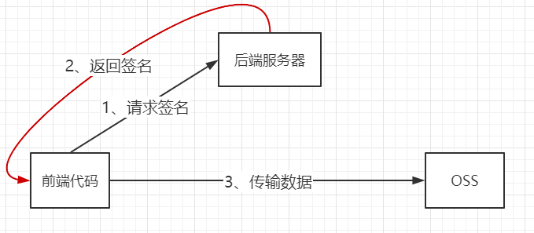

# OSS

OSS 为 Object Storage Service，即对象存储服务。OSS 可以存储文本、图片、音频、视频等非结构化数据。下面介绍几个概念：

1. **存储类型（Storage Class）**
   1. 标准存储
   2. 低频访问存储
   3. 归档存储
2. **地域（Region）**：表示 OSS 存储的物理位置
3. **访问域名（EndPoint）**：表示 OSS 对外服务的访问域名，通过域名去存储、获取对象。默认是 `oss-cn-qingdao.aliyuncs.com`，可以绑定到自己的域名上 `atsukoruo.cn`
4. **访问密钥（AccessKey）**：用于身份验证。
5. **存储空间（Bucket）**：用于存储对象（Object）的容器，它具有地域、访问权限、存储类型等性质
6. **对象/文件（Object）**：存储的基本单位，它包括：
   1. key ：标识对象
   2. Object Meta ：保存对象的属性，比如最后修改时间、大小等。
   3. Data：需要保存的数据

Maven 依赖如下：

~~~xml
<dependency>
    <groupId>com.aliyun.oss</groupId>
    <artifactId>aliyun-sdk-oss</artifactId>
    <version>3.8.0</version>
</dependency>
~~~

使用 Java SDK 访问 OSS

~~~java
String endpoint = "https://oss-cn-qingdao.aliyuncs.com";
String accessKeyId = "LTAI5tACEh51Me9yrBmqMRCc";
String accessKeySecret = "dei2LpygJgOiaDoX3J9P49zLKMadaY";

OSS ossClient = new OSSClientBuilder().build(endpoint, accessKeyId, accessKeySecret);
InputStream inputStream = null;
try {
    inputStream = new FileInputStream("C:\\Users\\AtsukoRuo\\Pictures\\anime\\3.avif");
} catch (FileNotFoundException e) {
    e.printStackTrace();
    return;
}
// 存储空间名与对象名
ossClient.putObject("atsukoruo-oss-demo", "3.avif", inputStream);
ossClient.shutdown();
~~~

Web 端访问 OSS 的方式

Flutter 前端的 OSS 组件：https://pub.dev/packages/flutter_oss_aliyun

防盗链是指通过一些措施，避免非法用户在未经授权的情况下获取到存储在 OSS 中的资源。推荐将 OSS 中的 Bucket 设置为私有的，而在 CDN 中设置防盗链（通过 Refer 请求头的白名单来实现）。

