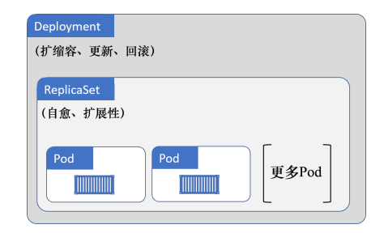
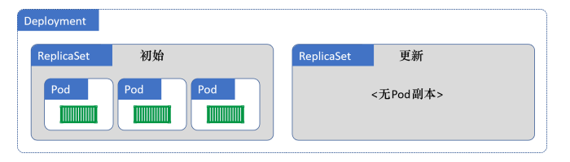
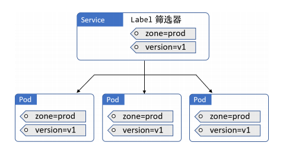
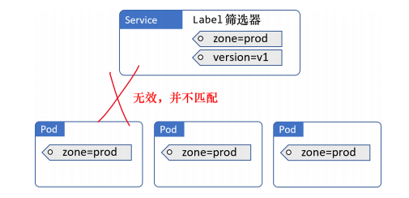
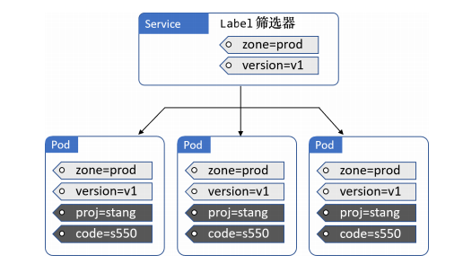

# Controller

## Deployment

Pod 没有自愈能力，不能扩缩容，也不支持方便的升级和回滚。而 Deployment 可以。因此，建议绝大多数情况下采用 Deployment 来部署 Pod。Deployment 在底层利用了另一种名为 ReplicaSet 的对象。并不建议直接操作 ReplicaSet。

ReplicaSet 的底层调谐循环确保当前状态与期望状态保持一致，以提供自愈与扩缩容能力。

下面我们来看看如何在零宕机的情况下实现了一种平滑的滚动升级。

现在假设某人遇到了一个 Bug，并且需要部署一个新的镜像来完成修复。因此，他修改了同一个 Deployment 的 YAML 文件，将镜像版本更新，并重新 POST 到 API Server。为了到达期望状态，Kubernetes 基于新镜像的 Pod 创建了一个新的 ReplicaSet。此时就有两个 ReplicaSet 了：一个是包含基于旧版镜像的 Pod，一个是新版本的 Pod。每次 Kubernetes 增加新 ReplicaSet（新版镜像）中的 Pod 数量的时候，都会相应地减少旧 ReplicaSet（旧版镜像）中的 Pod 数量。这一切只需更新清单文件！

着重需要说明的是，旧版的 ReplicaSet 仍然有完整的配置信息，包括旧版的镜像，这对于回滚功能来说很重要。

下面，我们来创建一个 Deployment。首先创建 manifest 文件

~~~yaml
apiVersion: apps/v1
kind: Deployment
metadata:
  name: hello-deploy
spec:
  replicas: 10		# 需要多少个副本
  selector:			# 表明Deployment 要管理的 Pod 所必须具备的标签
    matchLabels:
      app: hello-world
  revisionHistoryLimit: 5
  progressDeadlineSeconds: 300
  minReadySeconds: 10			# 每个 Pod 的更新操作要间隔 10s
  strategy:
    type: RollingUpdate	# 如何执行更新操作
    rollingUpdate:
      # 下面两个参数表明，在滚动更新的过程中，最多只能同时更新两个 Pod
      maxUnavailable: 1		# 不允许出现比期望状态指定的 Pod 数量少超过一个的情况，即在更新过程中，Pod 数量不能超过 11 个
      maxSurge: 1			# 不允许出现比期望状态指定的 Pod 数量多超过一个的情况，即即在更新过程中，Pod 数量不能少于 9 个
  template:		# Pod 模板
    metadata:
      labels:
        app: hello-world
    spec:
      containers:
      - name: hello-pod
        image: nigelpoulton/k8sbook:1.0
        ports:
        - containerPort: 8080
        resources:
          limits:
            memory: 128Mi
            cpu: 0.1
~~~

然后 POST 到 API Server 中

~~~shell
$ kubectl apply -f deploy.yml
~~~

通过 kubectl get 或者 kubectl describe 命令来查看 Deployment 对象：

~~~shell
$ kubectl get deploy hello-deploy
$ kubectl describe deploy hello-deploy
~~~

现在，我们提供一个 Service 对象，对 Deployment 中的 Pod 对象提供一个稳定的、向外暴露的 IP 地址。

~~~yaml
apiVersion: v1
kind: Service
metadata:
  name: hello-svc
  labels:
    app: hello-world
spec:
  type: NodePort
  ports:
  - port: 8080
    nodePort: 30001
    protocol: TCP
  selector:
    app: hello-world
~~~

~~~shell
$ kubectl apply -f svc.yml
~~~

现在 Service 已经部署好了，可以通过以下任一种方式来访问该应用：

- 在集群内部，通过 DNS 名称 hello-svc 和端口 8080 访问
- 在集群外部，通过集群任一节点和端口号 30001 访问

只要修改 manifest 文件中的 spec.containers.image，即可实现更新操作。执行 kubectl apply 来 POST manifest 文件时，要附带 --record 参数，这对回滚操作很重要。

~~~shell
$ kubectl apply -f deploy.yml --record
~~~

可以执行 `kubectl rollout status`来查看更新过程：

~~~shell
$ kubectl rollout status deployment hello-deploy
Waiting for rollout to finish: 4 out of 10 new replicas... 
Waiting for rollout to finish: 4 out of 10 new replicas... 
Waiting for rollout to finish: 5 out of 10 new replicas...
~~~

由于在升级 Deployment 时使用了 --record 参数。因此，在执行 kubectl rollout history 命令时，可以显示 Deployment 的两个版本：

~~~shell
$ kubectl rollout history deployment hello-deploy
deployment.apps/hello-deploy
REVISION CHANGE-CAUSE 
1		<none> 
2		kubectl apply --filename=deploy.yml --record=true
~~~

下面通过 kubectl rollout 命令来回滚到版本 1：

~~~shell
$ kubectl rollout undo deployment hello-deploy --to-revision=1
~~~

## Service

Pod 的 IP 地址是不可靠的：

- 在某个 Pod 失效之后，它会被一个拥有新的 IP 的 Pod 代替
- Deployment 扩容也会引入拥有新 IP 的 Pod；而缩容则会删除 Pod。

每一个 Service 都拥有固定的 IP 地址、固定的 DNS 名称，以及固定的端口。此外，Service 还可以利用 Label ，来动态选择将流量转发至哪些 Pod

Service 与 Pod 之间是通过 Label 和 Label 筛选器（selector）松耦合在一起的。Deployment和 Pod 之间也是通过这种方式进行关联的，但 Deployment 只会管理由自己创建的 Pod。所有匹配的 Pod 必须拥有 Service Label 筛选器中定义的所有 Label。下面我们通过三个例子来认识这一点

每一个 Service 在被创建的时候，都会得到一个关联的 Endpoint 对象。整个 Endpoint对象其实就是一个动态的列表，包含集群中所有匹配 Label 筛选器的健康Pod。

## 服务发现

## StatefulSet 

