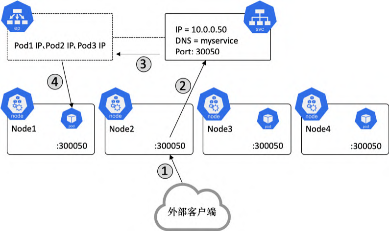
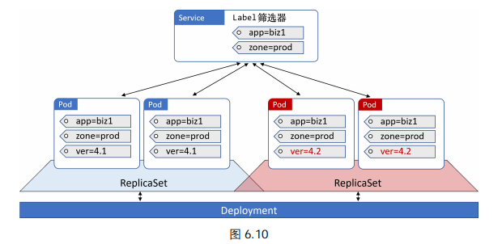
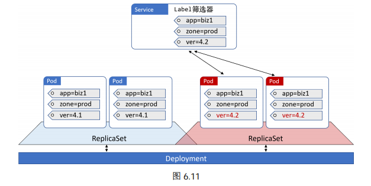

# Controller

## Deployment

Pod 没有自愈能力，不能扩缩容，也不支持方便的升级和回滚。而 Deployment 可以。因此，建议绝大多数情况下采用 Deployment 来部署 Pod。Deployment 在底层利用了另一种名为 ReplicaSet 的对象。并不建议直接操作 ReplicaSet。

ReplicaSet 的底层调谐循环确保当前状态与期望状态保持一致，以提供自愈与扩缩容能力。下面我们来看看如何在零宕机的情况下实现了一种平滑的滚动升级。

现在假设某人遇到了一个 Bug，并且需要部署一个新的镜像来完成修复。因此，他修改了同一个 Deployment 的 YAML 文件，将镜像版本更新，并重新 POST 到 API Server。为了到达期望状态，Kubernetes 基于新镜像的 Pod 创建了一个新的 ReplicaSet。此时就有两个 ReplicaSet 了：一个是包含基于旧版镜像的 Pod，一个是新版本的 Pod。每次 Kubernetes 增加新 ReplicaSet（新版镜像）中的 Pod 数量的时候，都会相应地减少旧 ReplicaSet（旧版镜像）中的 Pod 数量。这一切只需更新清单文件！

着重需要说明的是，旧版的 ReplicaSet 仍然有完整的配置信息，包括旧版的镜像，这对于回滚功能来说很重要。

下面，我们来创建一个 Deployment。首先创建 manifest 文件

~~~yaml
apiVersion: apps/v1
kind: Deployment
metadata: 			# Deployment 自己的 metadata 
  name: hello-deploy
spec:
  replicas: 10		# 需要多少个副本
  selector:			# 表明 Deployment 所要管理的 Pod 必须具备的标签
    matchLabels:
      app: hello-world
  revisionHistoryLimit: 5
  progressDeadlineSeconds: 300
  minReadySeconds: 10			# 每个 Pod 的更新操作要间隔 10s
  strategy:
    type: RollingUpdate	# 如何执行更新操作
    rollingUpdate:
      # 下面两个参数表明，在滚动更新的过程中，最多只能同时更新两个 Pod
      maxUnavailable: 1		# 不允许出现比期望状态指定的 Pod 数量少超过一个的情况，即在更新过程中，Pod 数量不能超过 11 个
      maxSurge: 1			# 不允许出现比期望状态指定的 Pod 数量多超过一个的情况，即即在更新过程中，Pod 数量不能少于 9 个
  template:		# Pod 模板
    metadata:
      labels:
        app: hello-world
    spec:
      containers:
      - name: hello-pod
        image: nigelpoulton/k8sbook:1.0
        ports:
        - containerPort: 8080
        resources:
          limits:
            memory: 128Mi
            cpu: 0.1
~~~

然后 POST 到 API Server 中

~~~shell
$ kubectl apply -f deploy.yml
~~~

通过 kubectl get 或者 kubectl describe 命令来查看 Deployment 对象：

~~~shell
$ kubectl get deploy hello-deploy
$ kubectl describe deploy hello-deploy
~~~

现在，我们提供一个 Service 对象，对 Deployment 中的 Pod 对象提供一个稳定的、向外暴露的 IP 地址。

~~~yaml
apiVersion: v1
kind: Service
metadata:
  name: hello-svc
  labels:
    app: hello-world
spec:
  type: NodePort
  ports:
  - port: 8080
    nodePort: 30001
    protocol: TCP
  selector:
    app: hello-world
~~~

~~~shell
$ kubectl apply -f svc.yml
~~~

现在 Service 已经部署好了，可以通过以下任一种方式来访问该应用：

- 在集群内部，通过 DNS 名称 hello-svc （Service 的名称）和端口 8080 访问
- 在集群外部，通过集群任意一个节点的 IP 和端口号 30001 访问

现在只要修改 manifest 文件中的 spec.containers.image，然后 POST 即可实现更新操作。执行 kubectl apply 来 POST manifest 文件时，要附带 --record 参数，这对回滚操作很重要。

~~~shell
$ kubectl apply -f deploy.yml --record
~~~

可以执行 `kubectl rollout status`来查看更新过程：

~~~shell
$ kubectl rollout status deployment hello-deploy
Waiting for rollout to finish: 4 out of 10 new replicas... 
Waiting for rollout to finish: 4 out of 10 new replicas... 
Waiting for rollout to finish: 5 out of 10 new replicas...
~~~

由于在升级 Deployment 时使用了 --record 参数。因此，在执行 kubectl rollout history 命令时，可以显示 Deployment 的两个版本：

~~~shell
$ kubectl rollout history deployment hello-deploy
deployment.apps/hello-deploy
REVISION CHANGE-CAUSE 
1		<none> 
2		kubectl apply --filename=deploy.yml --record=true
~~~

下面通过 kubectl rollout 命令来回滚到版本 1：

~~~shell
$ kubectl rollout undo deployment hello-deploy --to-revision=1
~~~

## Service

Pod 的 IP 地址是不可靠的：

- 在某个 Pod 失效之后，它会被一个拥有新的 IP 的 Pod 代替
- Deployment 扩容也会引入拥有新 IP 的 Pod；而缩容则会删除 Pod。

每一个 Service 都拥有固定的 IP 地址、固定的 DNS 名称，以及固定的端口。此外，Service 还可以利用 Label ，来动态选择将流量转发至哪些 Pod。

Service 与 Pod 之间是通过 Label 和 Label 筛选器（selector）松耦合在一起的。Deployment 与 Pod 也是这样绑定在一起的，但 Deployment 只会考虑由自己创建的 Pod。所有匹配的 Pod 必须拥有 Service Label 筛选器中定义的所有 Label。下面我们通过三个例子来认识这一点

下面是 Service 如何工作的基本介绍

1. 每一个 Service 在被创建的时候，都会得到一个关联的 Endpoint 对象。整个 Endpoint 对象其实就是一个**动态**列表，其中包含匹配该 Service Label 筛选器的健康 Pod 的 IP。 
2. 当要通过 Service 将流量转发到 Pod 时，首先在集群内部的 DNS 中查询 Service 的 IP。当节点将流量打到 ClusterIP 时，会被内核捕获拦截（具体来说是每个节点都有的 kube-proxy 系统服务），然后将 IP 改写为某个健康 Pod 的 IP 地址。
3. 不过，Kubernetes 原生应用是可以直接查询 Endpoint API，而无须查找 DNS 和使用 Service IP 的。

Kubernetes 支持几种不同类型的 Service：

- ClusterIP Service
- NodePort Service
- LoadBalancer Service

 `ClusterIP Service`（默认）：拥有固定的 IP 地址和端口号，并且仅能够从集群内部访问得到。在创建 ClusterIP Service 时，ClusterIP 与对应的 Service 名称（`metadata.name`）会被动地注册注册在集群内部的 DNS 服务中（下面会解释的）。所以， Pod（应用的微服务）只需知道 Service 的名称，就能够解析到对应的 ClusterIP，然后将流量打到 ClusterIP 上，Service 就自动帮我们转发流量到相应的 Pod 上。

`NodePort Service`：在 ClusterIP Service 的基础上，增加了另一个端口 NodePort，从而可以从集群外部访问到 Service。以下的例子表示一个 NodePort Service

~~~json
Name:magic-sandbox
ClusterIP:172.12.5.17
port:8080
NodePort:30050
~~~

- 在集群内部，可以通过`(Name、ClusterIP、port)`来直接访问这个名为 magic sandbox 的服务。
- 在集群外部，可以发送请求到集群中的任何一个节点上的端口 30050 来访问该服务。

下面给出一个访问 NodePort Service 的例子

1. 来自一个外部客户端的请求到达 Node2 的 30050 端口
2. 请求被转发至 Service 对象
3. 从 Endpoint 中获取健康的 Pod
4. 请求被转发至 Node1 上的 Pod1

`LoadBalancer Service` 基于 NodePort，并且集成了基于云的负载均衡器

Kubernetes 通过以下方式来实现**服务发现**（Service discovery）

- DNS（推荐）
- 环境变量（绝对不推荐）

基于 DNS 的服务发现需要 DNS 集群插件（cluster-add-on），几乎所有的 Service 都使用到了它。Kubelet 为每一个容器都注入了该 DNS（通过/etc/resolv.conf），这也就意味着任何 Pod 都可以通过连接到 `kube-dns` 服务来进行 DNS 解析。这个 DNS 插件（kube-dns）会持续监测 API Server。一旦发现有新创建的 Service 对象，就会创建相应的 DNS 记录。因此，应用和 Service 无须主动执行服务注册。

关于环境变量方式的最大问题在于，环境变量只有在 Pod 最初创建的时候才会被注入。这就意味着，Pod 在创建之后是并不知道新 Service 的。

每一个集群都有一个地址空间，而命名空间为集群的地址空间的分区。

Service 可以用在简单的灰度发布上，我们只需修改该 Label Selector 即可完成流量分配。

## 服务发现

## StatefulSet 

