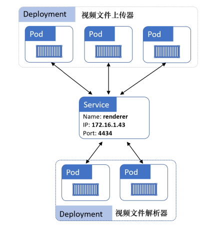

# 初识

Kubernetes 是一个**应用编排器（orchestrator）**，用于对容器化的云原生微服务应用进行编排。就像 Linux 能够对各种硬件进行抽象一样，Kubernetes 能够对云上的资源实现抽象。Kubernetes 包括但不仅限于以下功能：

- 快速部署应用程序
- 根据需要动态扩缩容
- 当出现故障时自愈
- 进行不停机的滚动升级和回滚

Kubernetes 最突出的优点是，它可以在无须人工干预决策的情况下自动完成以上所有任务。

**Docker** 是一种更加偏向底层的技术，它负责诸如启停容器的操作；而 Kubernetes 是一种更加偏向上层的技术，它注重集群范畴的管理，比如决定在哪个节点上运行容器、决定什么适合进行扩缩容或升级。

**容器运行时接口（Container Runtime Interface, CRI）**是 Kubernetes 用来与第三方容器运行时进行对接的标准化的抽象层。这样容器运行时与 Kubernetes 是解耦的，同时又能够以一种标准化的方式予以支持。

## 操作概览

一个 Kubernetes 集群由**主节点（master）**与**工作节点（node）**组成

- 数据平面（工作节点）：应用服务就运行在每个工作节点上。
- 控制平面（主节点）：对外提供 API，对内负责各节点的任务分配与调度，并在持久化存储中记录各节点的状态。

一般在 Kubernetes 上运行应用的过程：

1. 应用以微服务方式实现
2. 通过容器对每个微服务打包
3. 每个容器集成到 Pod
4. 使用 Controller 来在集群中部署 Pod（直接部署 Pod 也是可以的，但满足不了实际需求），Controller 是对 Pod 的更高一层的封装。Controller 包括但不限于：
   - Deployment：提供可扩展性和滚动更新
   - DaemonSet：在集群的每个工作节点中都运行相应服务的实例
   - StatefulSet：有状态应用部署于 StatefulSet
   - CronJob ：需要不定期运行的临时任务则由定时任务（CronJob）来管理

## 控制平面

Kubernetes 的控制平面是系统服务的集合，这些服务包括

- **API Server**：负责所有组件之间的通信，对外提供了 RESTful 风格的 API 接口
- **集群存储**：它持久化地存储了整个集群的配置与状态。它的底层通常选用分布式数据库 etcd
- **controller 管理器**：监听 API Server，并负责创建 controller。这些 controller 包括工作节点 controller、终端 controller，以及副本 controller。每个 controller 都在后台监控 API Server 的变更，以保证集群的*当前状态（*current state*）*可以与*期望状态（*desired state*）*相匹配。**这是实现声明式的关键所在**。
- **调度器**：通过监听 API Server 来启动新的工作任务，并将其分配到适合的且处于正常运行状态的节点中。
- **云 controller 管理器**：如果用户的集群运行在诸如 AWS、Azure、GCP、DO 和 IBM 等类似的公有云平台上，则控制平面会启动一个云 controller 管理器（cloud controller manager）。云 controller 管理器负责集成公有云提供的服务，例如实例、负载均衡以及存储等。

## 工作平面

工作节点的工作流程：

- 监听 API Server 分派的新任务
- 执行新分派的任务
- 向控制平面回复任务执行的结果（通过 API Server）

- Kubelet：它是每个工作节点上的核心部分，是 Kubernetes 中重要的代理端。负责执行由控制平面分配的任务，并且向控制平面反馈信息
- 容器运行时：Kubelet 需要一个容器运行时（container runtime）来执行任务
- kube-proxy：负责本地集群网络，保证了每个工作节点都可以获取到唯一的 IP地址，并且实现了本地 IPTABLE 以及 IPV， 来保障 Pod 间的网络路由与负载均衡

每个 Kubernetes 集群都有自己内部的 DNS 服务。

## 声明式

在 Kubernetes 中，声明式模型的工作方式如下所述：

1. 在 manifest 文件（YAML 格式）中声明一个应用（微服务）期望达到的状态
2. 将 manifest 文件发送到 API Server。最常见的方式是通过 kubectl命令行工具来完成这个操作。它会将 manifest 文件通过 HTTP POST 请求发送到控制平面
3. 在请求经过认证以及授权后，Kubernetes 会检查 manifest 文件，确定需要将该文件发送到哪个控制器（例如 Deployment controller），并将其保存到集群存储当中，作为整个集群的*期望状态（*desired state*）*中的一部分
4. 在上述工作都完成之后，就要在集群中执行相应的调度工作了。调度工作包括拉取镜像、启动容器、构建网络以及启动应用进程。
5. 最终，Kubernetes 通过后台的 reconciliation 循环（由 Controller 负责）来**持续监控集群状态**。如果集群*当前状态（*current state*）*与*期望状态（*desired state*）*存在差异，则 Kubernetes 会执行必要的任务来消除差异点。

k8s 会持续确保当前状态与期望状态保持一致，下面给出两个例子

- 调谐循环能够定期检查集群中 Pod 的副本数是否达标。如果副本数不足，则增加；如果副本数过多，则销毁一些。
- 用户 POST 一个更新的配置，将副本数从 3 调整为 5，那么 5 就会被注册为该应用新的期望状态。当调谐循环的下一轮开始执行时，会注意到数值上的差异，从而再启动两个副本。

## Pod

Pod 本身并不会运行任何东西，只是作为一个承载容器的沙箱而存在。更准确来说， Pod 就是由一个或多个容器共享的运行环境。这个环境包括 IPC 命名空间，内存，磁盘、网络以及其他资源等。

对于存在强绑定关系的多个容器，比如需要共享内存与存储，多容器 Pod 就是一个非常完美的选择。但是，如果容器间并不存在如此紧密的关系，则更好的方式是将容器封装到不同的 Pod，通过网络以松耦合的方式来运行。这样可以在任务级别实现容器间的隔离，降低相互之间的影响。

Kubernetes 中最小的调度单元也是 Pod。但是千万不要选择通过向一个已经存在的 Pod 中增加更多的容器这种方式来完成扩容。

每个 Pod 会创建其自己的网络命名空间。其中包括一个 IP 地址、一组 TCP 和 UDP 端口范围，以及一个路由表。属于同一个 Pod 的两个容器间的通信，可以借助 Pod 的 localhost 接口实现。

**控制组（Control Group, CGroup）**用于限制某个容器使用节点上所有可用的 CPU、RAM 和 IOPS。每个容器有其自己的 CGroup 限额，也就是说，同一个 Pod 中的两个容器可以有不同的 CGroup 限额。

Pod 的生命周期示意图如下：

注意：Pod 的部署是一个原子操作。只有当 Pod 中的所有容器都启动成功且处于运行状态时，Pod 提供的服务才会被认为是可用的。对于部分启动的 Pod，绝对不会响应服务请求。

下面我们来部署一个 Pod。首先提供一个 manifest 文件：

~~~yaml
apiVersion: v1
kind: Pod
metadata:
	name: hello-Pod 
	labels:
		zone: prod
		version: v1
spec:
	containers:
	- name: hello-ctr
        image: nigelpoulton/k8sbook:latest 
        ports:
        - containerPort: 8080
~~~

其中，有四个顶级资源（top-level resource）：

- apiVersion：格式为 `<api-group>/<version>`，用于创建部署对象的 API 组和 API 版本。这里，Pod 对象定义在一个名为 Core 的 API 组（API Group）中，可以忽略 api-group 部分
- kind：告诉 Kubernetes 要部署的对象类型
- metadata：定义名称和标签（label）。这些信息用于在集群中描述所部署的对象
- spec：定义 Pod 所运行的容器

然后，通过执行 kubectl 命令将其 POST 到 API Server：

~~~shell
kubectl apply -f Pod.yml
~~~

执行 `kubectl get Pods` 命令来检查状态。而 `-o yaml` 参数可以返回一份完整的 Pod 清单，包括了期望状态与当前状态的对比：

~~~yaml
$ kubectl get Pods hello-Pod -o yaml
apiVersion: v1
kind: Pod
metadata:
	annotations: 
		kubectl.kubernetes.io/last-applied-configuration: | 
		...
	name: hello-Pod
	namespace: default
spec: #期望状态
	containers:
	- image: nigelpoulton/k8sbook:latest
	imagePullPolicy: Always
	name: hello-ctr
	ports:
	
status: #当前状态
	conditions:
	- lastProbeTime: null
	lastTransitionTime: 2019-11-19T15:24:24Z 
	state:
		running:
			startedAt: 2019-11-19T15:26:04Z
~~~

可以通过 `kubectl describe` 来打印对象的总览信息：

通过 `kubectl exec` 命令登录到容器内部的终端上。

~~~shell
 kubectl exec -it hello-Pod -- sh
~~~

参数 `-it` 的作用在于使 exec 的会话成为交互式（interactive）的，并且把当前终端的 STDIN 和 STDOUT 与 Pod 中第一个容器的 STDIN 和 STDOUT 连接起来。

对于 Pod 中有多个容器的情况，需要 --container 参数指定要登录的容器。如果不指定，则会登录 Pod 中第一个容器

## 服务与稳定的网络 

当 Pod 被替换或者水平扩容/缩容后，Pod 的 IP 地址会发生变化。这其中的关键点是 Pod 是不可靠的。

假设用户需要通过一个由多个 Pod 构成的微服务来完成视频渲染工作。如果这个时候应用的其他部分需要依赖渲染服务，但是由于 Pod 不可靠，又不能直接依赖 Pod 服务，这时候该怎么办呢？此时需要正式介绍 **Service（服务）**机制。Service 为一组 Pod 提供了可靠且稳定的网络，以及 TCP 以及 UDP 负载均衡能力。

Service 使用标签（label）与一个标签选择器（label selector）来决定应当将流量负载均衡到哪一个 Pod 集合。

以上图为例，最右边的 Pod 的标签与 Service 标签选择器中的不匹配，那么着服务不会将请求路由给这个 Pod。

Service 只会将流量路由到健康的 Pod，这意味着如果 Pod 的健康检查失败，那么 Pod 就不会接收到任何流量

## 安装

桌面版 Docker 通过创建一个虚拟机，然后在虚拟机中启动一个单节点的 Kubernetes 集群。

默认情况下，kubectl 的配置文件位于 $HOME/.kube/config。它包含如下配置信息

- clusters：指定 kubectl 可以连接的多个集群的列表
- contexts：定义集群和相关用户的组合。例如，配置中有名为 deploy-prod 的 context，它将名为 deploy 的用户凭证和名为 prod 的集群定义组合起来。此时如果基于这个 context 使用 kubectl，那么该命令将会以 deploy 用户的身份发送至集群 prod 的 API Server。
- users ：定义不同的用户以及对不同集群的不同级别的权限。

配置文件示例：

~~~yaml
apiVersion: v1 
clusters: 
- cluster:
 certificate-authority: C:\Users\nigel\.minikube\ca.crt 
 server: https://192.168.1.77:8443
 name: minikube 
contexts: 
- context: 
 cluster: minikube 
 user: minikube
 name: minikube 
current-context: minikube 
kind: Config 
preferences: {}
users: 
- name: minikube 
 user:
 client-certificate: C:\Users\nigel\.minikube\client.crt 
 client-key: C:\Users\nigel\.minikube\client.key
~~~

执行 kubectl config current-context 命令可以查看当前使用的 context

使用 kubectl config use-context 来改变当前的 context