# 入门

[TOC]

**Elasticsearch 是一个分布式、RESTful 风格的搜索和数据分析引擎**。 它在 Apache Lucene 的基础上进行构建。支持对（非）结构化数据进行几乎实时的**搜索**和**分析**，可以做到高效地处理大量数据。

除了搜索领域外，Elasticsearch 与 Kibana、Logstash 组成的 ELK 系统还可以应用到日志采集、监控等领域。

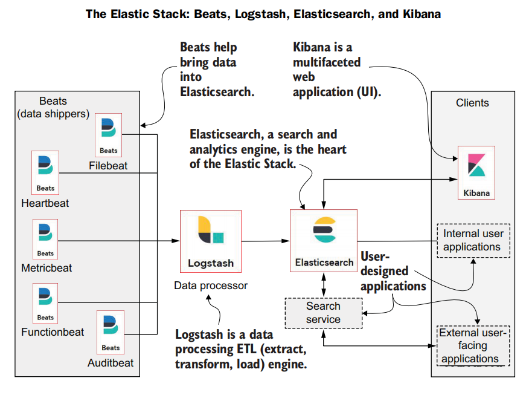

ES 是一个近实时系统，我们写入的数据默认的情况下会在 1 秒后才能被查询到。

## 安装

### ElasticSearch

~~~bash
wget https://artifacts.elastic.co/downloads/elasticsearch/elasticsearch-7.13.0-linux-x86_64.tar.gz
tar -xvf elasticsearch-7.13.0-linux-x86_64.tar.gz
mv elasticsearch-7.13.0 es_node1
~~~

关键的配置文件：

1. `elasticsearch.yml` 是用来配置 ES 服务的各种参数的
2.  `jvm.options` 主要保存 JVM 相关的配置。

`elasticsearch.yml`的主要内容：

~~~yaml
cluster.name: my_app
node.name: my_node_1
path.data: ./data
path.logs: ./logs
http.port: 9211
network.host: 0.0.0.0
discovery.seed_hosts: ["localhost"]
cluster.initial_master_nodes: ["my_node_1"]
~~~

- **discovery.seed_hosts**：指定初始主机节点列表。当有新的节点加入 Elasticsearch 集群时，`discovery.seed_hosts`列表中的节点，将帮助新节点找到并加入到现有的集群中。
- **cluster.initial_master_nodes**：用来设定哪些节点有资格被选举为主节点
- **network.host 和 http.port** 是 ES 提供服务的监听地址和端口
- **cluster.name**：属于同一集群中的所有节点必须有相同的 `cluster.name`

`jvm.options` 的主要内容：

~~~java
-Xms1g
-Xmx1g
~~~

- -Xms 和-Xmx 这两个 JVM 的参数必须配置为一样的数值。服务在启动的时候就分配好内存空间，避免运行时申请分配内存造成系统抖动。
- Xmx 不要超过机器内存的 50%，留下些内存供 JVM 堆外内存使用。
- 并且 Xmx 不要超过 32G。建议最大配置为 30G。接近 32G，可能会是 JVM 压缩指针的功能失效，导致性能下降。具体可以参考：[a-heap-of-trouble](https://link.juejin.cn/?target=https%3A%2F%2Fwww.elastic.co%2Fcn%2Fblog%2Fa-heap-of-trouble)。

启动 es

~~~bash
bin/elasticsearch
# 后台运行
bin/elasticsearch -d
~~~

在浏览器中访问 localhost:9211，如果得到以下结果即运行成功。

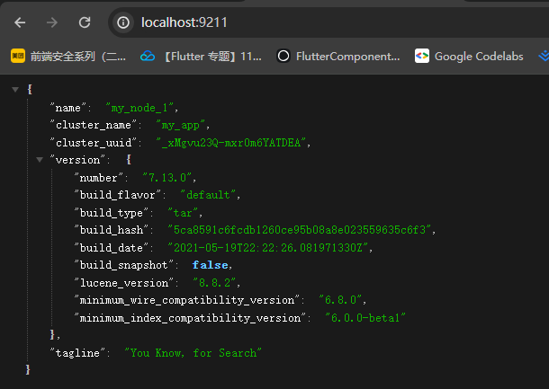

如果报错：

~~~bash
bootstrap check failure [1] of [1]:
max virtual memory areas vm.max_map_count [65530] is too low, increase to at least [262144]
~~~

那么按以下指令修改：

~~~bash
sudo su
echo -e '\nvm.max_map_count=262144' >> /etc/sysctl.conf
sysctl -p
exit;
~~~

### Kibana

**Kibana 是官方的数据分析和可视化平台**

~~~bash
wget https://artifacts.elastic.co/downloads/kibana/kibana-7.13.0-linux-x86_64.tar.gz
tar -xvf kibana-7.13.0-linux-x86_64.tar.gz
mv kibana-7.13.0-linux-x86_64 kibana
~~~

修改配置：

~~~java
echo -e '\nserver.host: "0.0.0.0"' >> config/kibana.yml

echo -e '\nelasticsearch.hosts: ["http://localhost:9211"]' >> config/kibana.yml
~~~

运行：

~~~java
bin/kibana >> run.log 2>&1 &
~~~

在浏览器中访问 localhost:5601


可以使用 [Dev Tools](http://localhost:5601/app/dev_tools#/)  作为 ES 查询的调试工具。我们也可以直接发送 HTTP 请求来进行 ES 操作。

### Cerebro

[Cerebro](https://link.juejin.cn/?target=https%3A%2F%2Fgithub.com%2Flmenezes%2Fcerebro) 是一个简单的 ES 管理工具，其安装如下：

~~~bash
wget https://github.com/lmenezes/cerebro/releases/download/v0.9.4/cerebro-0.9.4.tgz

tar -xvf cerebro-0.9.4.tgz
mv cerebro-0.9.4 cerebro
~~~

配置指令

~~~bash
cd cerebro
sed -i 's/server.http.port = ${?CEREBRO_PORT}/server.http.port = 9800/g' conf/application.conf

echo -e '\nhosts = [
    {
        host = "http://localhost:9211"
        name = "my_app"
    }
]' >> conf/application.conf
~~~

配置完成后，运行以下指令启动 cerebo：

~~~bash
bin/cerebro >> run.log 2>&1 &
~~~

如果启动成功，在浏览器中访问 localhost:9800 即可访问 cerebro。


## 集群

得益于分布式系统的架构设计，使得 ES 拥有高可用性和可扩展性。


单个 ES 的服务实例就是一个节点，节点类型有：

- **主节点（Master）**。主节点在整个集群是唯一的，主要负责管理集群变更、元数据的更改
- **数据节点（Data Node）**，负责保存数据，同时执行数据相关的操作，如：搜索、聚合、CURD 等
- **协调节点（Coordinating Node）**，接受客户端的请求，将请求路由到对应的节点进行处理，并且把最终结果汇总到一起返回给客户端。
- **预处理节点（Ingest Node）**，预处理操作允许在写入文档前通过定义好的一些 processors（处理器）和管道对数据进行转换。
- **部落节点（Tribe Node）**，在未来的版本中将会被弃用。
- **Hot & Warm Node**，在硬件资源好的机器中部署 Hot 类型的数据节点，而在硬件资源一般的机器上部署 Warm Node 节点。


**旧版本（7.8 及之前）各个节点类型的配置方式**：

| 节点类型          | 配置        | 默认值 |
| ----------------- | ----------- | ------ |
| Master Eligible   | node.master | true   |
| Data Node         | node.data   | true   |
| Ingest Node       | node.ingest | true   |
| Coordinating Node | 不需要配置  |        |

新版本的配置方式

~~~bash
node.roles: [ master, data ] # 设置节点为 master 候选节点和数据节点
~~~

node.roles 的可选项如下：

- **master**，master 候选节点，master 将会从这些节点中选取出来。
- **voting_only**，参与 master 选举的节点，只有投票权限，没有选举权。
- **data**，数据节点。保存文档数据的 shard 将分配到 data 节点中保存。
- **data_content**，处理文档的 CRUD、数据搜索和聚合等。
- **data_hot**
- **data_warm**，data_warm 节点会存储不会经常更新但是仍然被查询的数据，相对于 data_hot，其查询的频率要低。
- **data_cold**，很少再被读取的数据可以存储在 data_cold，**此类节点的数据是只读的**。
- **ingest，** 预处理数据的节点。
- **ml，** 提供机器学习的功能，此类节点运行作业并处理机器学习 API 请求。
- **transform**，运行 transforms 并处理 transform API 请求。
- ...


注意，每个节点本身就是一个协调节点。

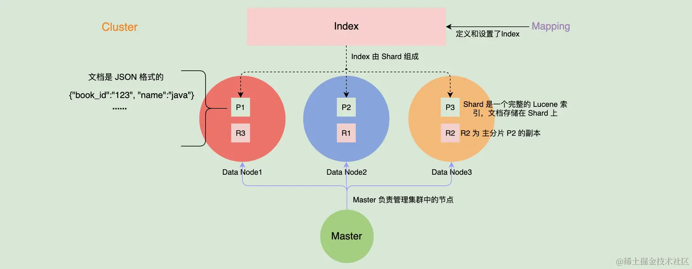

集群的健康状态有三种：

- **Green**，集群处于健康状态，所有的主分片和副本分片都正常运行。
- **Yellow**，所有的主分片都运行正常，但是有部分副本分片不正常
- **Red**，有部分主分片没有正常运行。

需要注意的是，每个索引也有这三种状态，如果索引丢失了一个副本分片，那么这个索引和集群的状态都变为 Yellow 状态，但是其他索引的的状态仍为 Green。

## 文档

ES 是面向文档的，并且以文档为单位进行搜索的。文档以 JSON 格式进行序列化存储。每个文档都有任意个字段。每个字段都有指定的类型，常见的有：keyword、text、数字类型（integer、long、float、double等）、对象类型等。keyword 类型适合存储简短、结构化的字符串，例如产品 ID、产品名字等。而 text 类型的字段适合存储全文本数据，如短信内容、邮件内容等。


## 分片

ES 先分割巨大的索引数据（也就是接下来介绍的文档），按照路由算法将它们分摊多台机器上，从而提高系统的吞吐量，这些分割后的数据就是一个个分片。分片在底层上就是多个在 Apache Lucene 中实现的段（索引）。行业最佳实践是将单个分片的大小控制在 50 GB 以内。

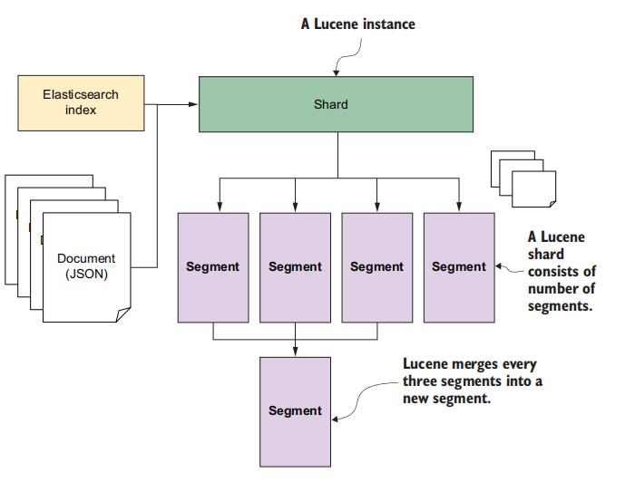

ES 将分片副本分为主从两类型：**主分片（primary shard）**和**副分片（replica shard）**。在写入的过程中，先写主分片，成功后并发写副分片，在数据恢复时以主分片为主。

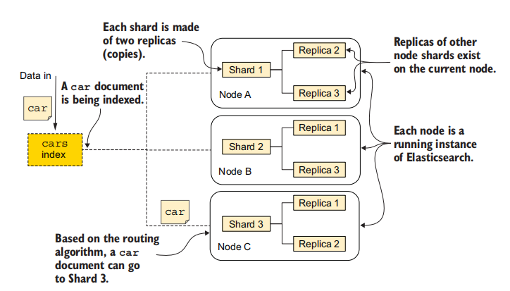

## 路由算法

路由算法决定了文档应当在哪个分片上保存。ES 使用下面的路由公式：
$$
shardID = hash(id) \% \#shards
$$
该公式直接取决于 `#shards`。这意味着我们一旦创建了索引，就无法更改分片的数量。想要更改，只能 reindex 重新索引。


## 索引

索引从本质来讲，就是一种为了加快检索数据的存储结构。正排索引是 ID 到「数据对象」的一对一映射，而倒排索引是「数据对象某些特征」到 「数据对象」 的一对多映射。

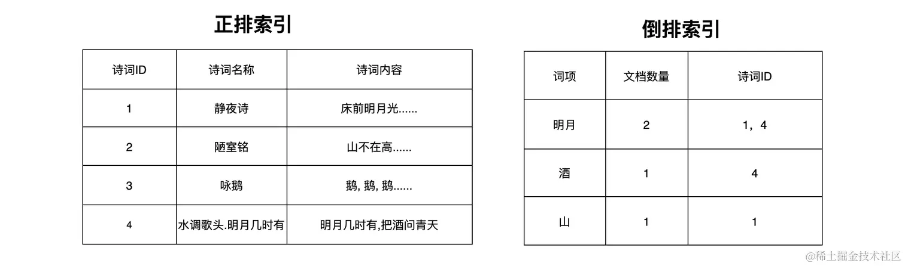

在 ES 中，「索引」可以理解为一类文档的集合，而这些文档可以分布在不同的分片上。它类似于数据库中的表。


倒排索引的组成主要有 3 个部分（如下图）：

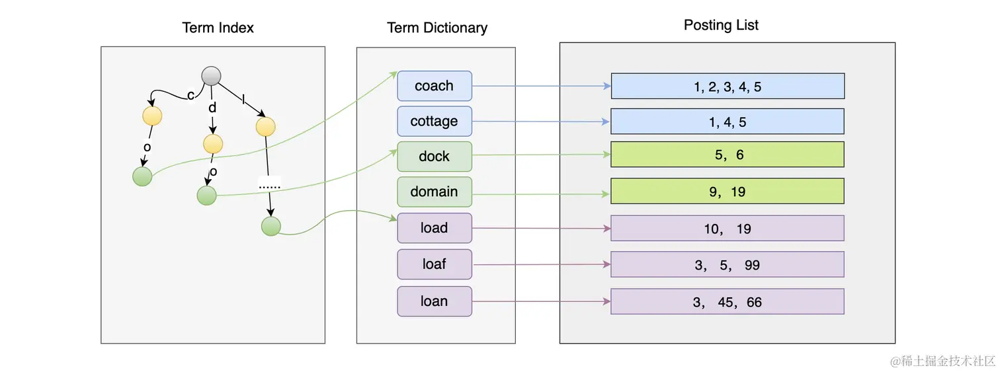

- **Term Index**： Term Dictionary 的索引
- **Term Dictionary**： 保存着词项
- **Posting List**：保存着每个词项所对应的文档 ID 列表


逻辑上，一个 Lucene Segment 上会有多个文档，一个文档有多个字段（Field）。这些字段的内容会被分词器形成多个 Term，然后以块的形式保存在 Term Dictionary 中，并且系统会对 Term Dictionary 的内容做索引形成 Term Index。在搜索的时候，通过 Term Index 找到 Block 后，进一步找到 Term 对应的 Posting List 中的文档 ID，然后计算出符合条件的文档 ID 列表进行返回。

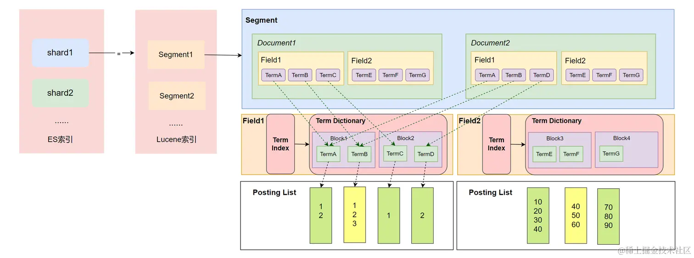

需要注意的是，Segment 中的每个字段（Field）都会有自己的 Term Index、Term Dictionary、Posting List 结构

Term Index 使用各个 Term 的公共前缀做索引。

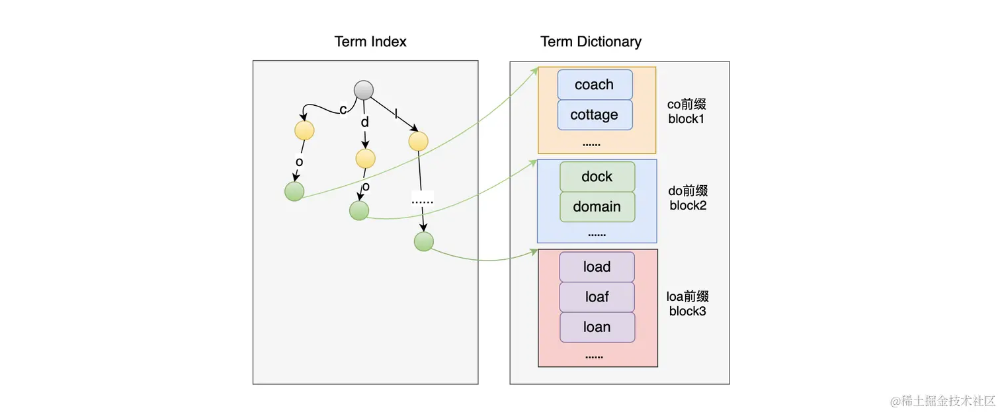

这样实现的索引只能找到公共前缀所在的块的地址，所以它既无法判断这个 Term 是否存在，也不知道这个 Term 保存在 Term Dictionary（.tim）文件的具体位置。因为 Block 中的数据是有序的，所以可以使用二分法来在 Block 中搜索 Term 是否存在。

**对于前缀索引的实现，业界使用了 FST 算法来解决**。FST（Finite State Transducers）是一种 FSM（Finite State Machines，有限状态机），并且有着类似于 Trie 树的结构。

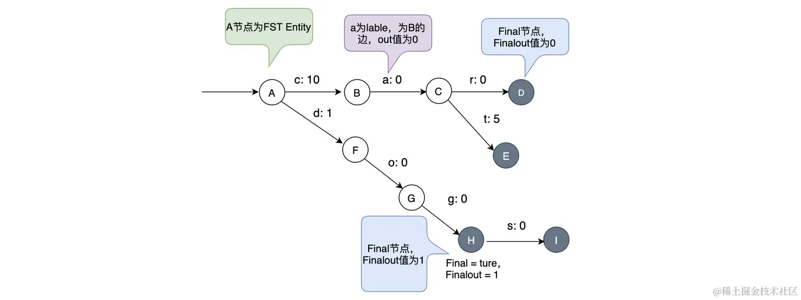

从图中可以看出，一条边有两个元素 label 和 out。图中灰黑色的为 Final 节点，它还有 Finalout，代表 Final 节点的值。当访问 cat 的时候，读取 c、a、t 的值作和， 再加上 Final 节点的 Finalout 值即可：10 + 0 + 5 + 0 = 15；

FST 可以简单理解为 Key-Value 数据结构。Term Index 使用 FST 做实现带来了两个基本功能：

1. 快速试错，如果在 FST 上不存在，不需要再遍历整个 Term Dictionary；
2. 快速定位到 Block 的位置，经过 FST 的输出，可以算出 Block 在文件中的位置。


在对 Term Dictionary 做索引的时候

1. 先将所有的 Term 进行排序
2. 然后将 Term Dictionary 中有共同前缀的 Term 抽取出来进行分块存储
3. 再对共同前缀做索引
4. 最后通过索引就可以找到公共前缀对应的块在 Term Dictionary 文件中的偏移地址。

由于每个块中都有共同前缀，所有不需要再保存每个 Term 的全部内容，只需要保存其后缀即可，而且这些后缀都是排好序的。


Lucene 把 Posting List 数据分成 3 个文件进行存储：

- .doc 文件，记录了：
  - 文档 ID 信息和 Term 的词频
  - 跳跃表的信息，用来加速文档 ID 的查询
  - Term 在 pos 和 pay 文件中的位置，有助于进行快速读取。
- .pay 文件，记录了 Payload 信息和 Term 在 doc 中的偏移信息；
- .pos文件，记录了 Term 在 doc 中的位置信息。


.doc 文件的数据结构：

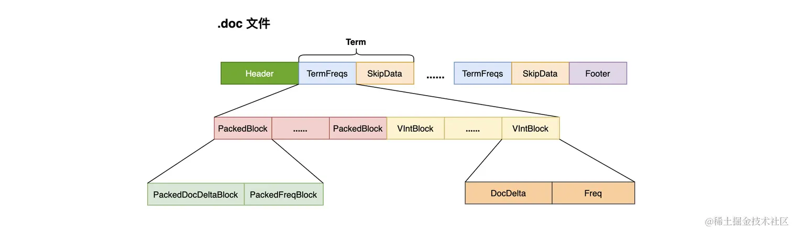

Lucene 在 Posting List 中使用了 2 种编码格式，来对整数类型的数据进行压缩：

- `PackedBlock`：在 Lucene 中，每当处理完 128 个包含某个 Term 的文档时，就会将这些文档的 ID 和词频使用 PackedInts 进行压缩存储，生成一个 PackedBlock。PackedBlock 中有两个数组，一个是存储文档 ID 的，一个是存储词频的。PackedInts 的压缩方式是将每个元素所占的位数与占用最多的保持一致。例如：

  ~~~bash
  # Int数组
  [8, 12, 100, 120]
  ~~~

  最大数 120 的有效位数为 7，所以数组中所有数据都可以使用 7 位来表示。

  

  在生成 PackedBlock 的时候，会生成跳表（SkipData），使得在读取数据时可以快速跳到指定的 PackedBlock。此外，在数组中存储文档 ID时，还使用差值存储的方式，来对数据做进一步的压缩处理。

- `VIntBlock`：Lucene 在 PackedBlock 基础上，把最后不足 128 篇文档的数据采用 VIntBlock 来存储。VIntBlock 采用 VInt 来对 Int 类型进行压缩，VInt 采用可变长的字节来表示一个整数，每个字节只使用第 1 到第 7 位来存储数据，第 8 位用来作为是否需要读取下一个字节的标记。


当我们同时检索多个词项时，会返回每个词项的文档 ID 列表。此时我们要交集求解，获取同时具有这多个词项的文档。

最简单的实现就是使用位图，但它有以下限制：


- 可能会消耗大量的空间
- 只适合于数据稠密的场景
- 只适合存储简单整型类型的数据，对于复杂的对象类型无法处理


业界中为了解决位图空间消耗大的问题，会使用一种压缩位图技术—— `Roaring Bitmap`。它会把一个 32 位的整数分成两个部分：高 16 位和低 16 位。然后将高 16 位作为一个数值存储到有序数组里。而低 16 位则存储到 2^16 的位图中：


确认一个数是否在 Roaring Bitmaps 中

1. 先以高 16 位在有序数组中进行二分查找，其复杂度为 O(log n)
2. 再拿低 16 位在对应的 Bitmaps 中查找，判断对应的位置是否为 1 即可，此时复杂度为 O(1)

当数据比较稀疏时（少于 4096 个），用 8K 大小 Bitmaps存储比较浪费，此时我们可以使用 short 类型的有序数组存储数据。


我们可以归并排序中合并思想，来合并 Roating Bitmap 中的有序数组部分：


我们来考虑这样一个情景：


此时 p1 要从 10 开始找直到多次才能找到 1000 这个大于或者等于 p2 的元素。我们可以使用跳表来优化这种情景。


此时，将p2（1000）作为 key，在链表A的跳表中快速做查找。

## 相关性评分

相关性是指搜索内容和结果的相关性，是用来描述文档与查询语句的匹配程度的。通过计算相关性，可以得出一个相关性评分，然后根据评分对结果集进行排序，返回最符合的数据给用户。

数据的相关性，可以由词项在文档中出现的频率高低来决定。但是在业界，很多著名的算法模型都是基于概率统计的，例如：TF-IDF、BM25。

TF-IDF 模型的核心思想：一个词的重要程度跟它在一篇文章中出现的频率成正比，跟它在语料库中出现的频率成反比。TF-IDF 模型的公式中，主要包含

- **TF** （Term Frequency On Per Document）表示一个词在一篇文档中出现的频率
  $$
  TF = \frac{词项在文档中出现的次数}{文档中词项总数}
  $$

- **DF**（Document Frequency）表示词项在语料库中出现的频率
  $$
  DF = \frac{包含词项的文档数}{文档总数}
  $$

- **IDF**（Inverse Document Frequency）表示逆文档频率
  $$
  IDF = log(\frac{文档总数}{包含词项w的文档数 + 1})
  $$
  如果词项的 IDF 越高，说明词项在语料库中越稀有

  

TF-IDF 算分公式：
$$
TF-IDF(tremA) = TF(termA) * IDF(termA)
$$
tf-idf 本质上是对 TF 进行了加权计算，而这个权重就是 IDF。

  

Lucene 的 TF-IDF 算分公式：

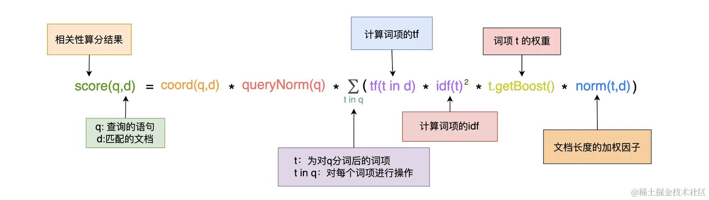


BM25 算分模型：

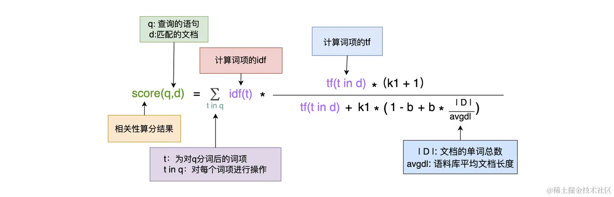

该模型中有两个自由参数：

- k1：当词频增大时，如果 k1 较高，那么接近饱和的速度会较慢。
- b：定义了文档长度对评分的影响。如果 b 设置的较高，长文档的分数会比短文档的分数降低较多


相对于 TF-IDF 来说，BM25 降低了 TF 对算分的影响力。当 TF 无限增加时，TF-IDF 模型的算分也会无限增加，而 BM25 则会趋于一个值 $k1 + 1$。

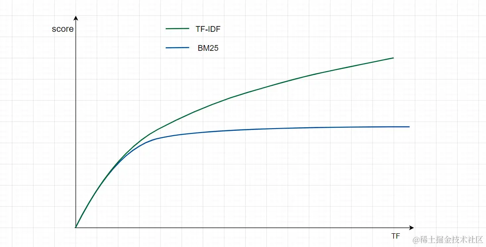


可以在创建 Mapping 的时候指定一个 similarity 的 k1 和 b 值，并应用到每个字段中：

```bash
PUT test_similarity_index
{
  "settings": {
    "index": {
      "similarity": {
        "my_similarity": {
          "type": "BM25",
          "k1": 1.3,
          "b": 0.76
        }
      }
    }
  },
  "mappings": {
    "properties" : {
        "title" : { "type" : "text", "similarity" : "my_similarity" }
    }
  }
}
```

可以使用 explain API 来查看算分的过程：

~~~bash
POST your_index/_search
{
    "explain": true, # 开启 explain
    "query": .....
}
~~~

 

## 分词器

将全文本的内容进行分词后，得到的词语就是词项（Token）了，它是 ES 中表达语义的最小单位。得到词项后，我们可以进行**规范化（Normalization）**，即对这些此词项创建同义词，或者将其转换为一个词根等等操作。

分词是通过**分词器（Analyzer）** 来实现的，它主要由 3 部分组成：

- **Character Filter**：主要对原文本进行格式处理
- **Tokenizer**：按照指定的规则对文本进行切分
- **Token Filter**：对切分后的单词进行处理，如转换为小写、删除停用词、增加同义词、词干化等。

除了在数据写入的时候对数据进行分词，在对全文本进行查询时，也需要使用相同的分词器对检索内容进行分析

ES 为用户提供了多个内置的分词器，常见的有以下 8 种：

- **Standard Analyzer** **：** 这个是默认的分词器，使用 Unicode 文本分割算法，将文本按单词切分并且转为小写。
- **Simple Analyzer** **：** 按照非字母切分并且进行小写处理
- **Stop Analyzer** **：** 与 Simple Analyzer 类似，但增加了停用词过滤（如 a、an、and、are、as、at、be、but 等）。
- **Whitespace Analyzer** **：** 使用空格对文本进行切分，并不进行小写转换。
- **Patter** **n** **Analyzer** **：** 使用正则表达式切分，默认使用 \W+ (非字符分隔)。支持小写转换和停用词删除。
- **Keyword Analyzer** **：** 不进行分词。
- **Language Analyzer** **：** 提供了多种常见语言的分词器。如 Irish、Italian、Latvian 等。
- **Customer Analyzer**：自定义分词器。

中文内容索引常用的分词器：

1. ik
2. [拼音](https://link.juejin.cn/?target=https%3A%2F%2Fgithub.com%2Fmedcl%2Felasticsearch-analysis-pinyin)

_analyze API 的使用：

~~~bash
GET _analyze
{
  "analyzer": "standard",
  "text": "Your cluster could be accessible to anyone."
}

# 结果
{
  "tokens": [
    {
      "token": "your",
      "start_offset": 0,
      "end_offset": 4,
      "type": "<ALPHANUM>",
      "position": 0
    },
    {
      "token": "cluster",
      "start_offset": 5,
      "end_offset": 12,
      "type": "<ALPHANUM>",
      "position": 1
    }
    ......
  ]
}
~~~

~~~bash
GET _analyze 
{
  "tokenizer": "standard", # 指定一个tokenizer
  "filter":  [ "lowercase", "asciifolding" ], # 可以组合多个token filter
  "text": "java app"
}
~~~


## 时序数据

在 ES 中，多个保存时序数据的索引统称为**数据流（data stream）**

each data stream has a set of indexes for each time point. These indexes are auto-generated by Elasticsearch and are hidden.

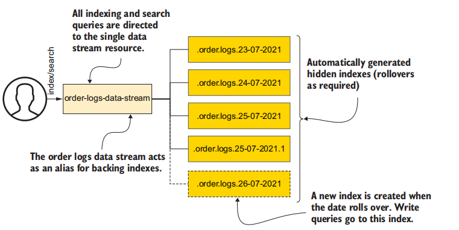

我们可以用索引的滚动操作来维护时序数据。
