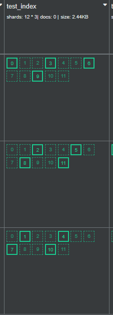
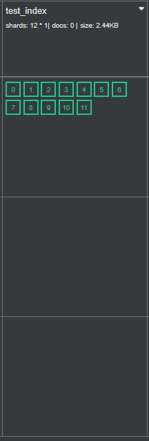
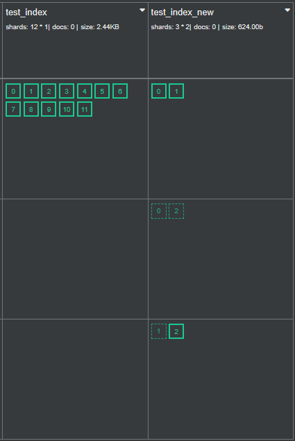
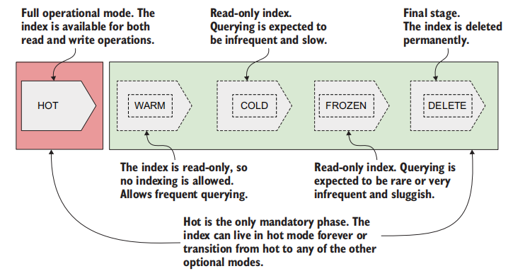

# 索引

[TOC]

## 基本操作

我们在 Mapping 中提及过：如果在索引中插入第一个文档时， 索引不存在，Elasticsearch 会动态地推导和确定字段的数据类型，并为我们创建 Mapping。如果想要禁用自动创建索引的特性，需要设置 `action.auto_create_index:false`。但是我们不推荐这样做，因为 Kibana 经常隐式地创建索引。好在  `action.auto_create_index` 可以指定被允许的隐式创建索引名：

~~~json
action.auto_create_index: [".admin*, cars*, "*books*", "-x*","-y*","+z*"]
//减号（-）表示自动索引创建被禁止。 
~~~

使用 `GET API` 来获取索引的详细信息：

~~~json
GET <index_name1>, <index_name2>
GET <index_name>/_settings
GET <index_name>/_mapping
GET <index_name>/_alias
~~~

使用 `DELETE API` 来删除索引

~~~bash
DELETE <index_name1>, <index_name2>
~~~

使用 `_close API` 和 `_open API` 来关闭或者打开索引。关闭索引意味着拒绝对文档进行索引，或搜索和分析查询（拒绝读写操作）。

~~~bash
# 关闭索引
POST /test_index/_close

# 打开索引
POST /test_index/_open
~~~

使用 `Exists API` 来判断索引是否存在

~~~bash
HEAD test_index
~~~

## Setting

setting 字段可以设置索引的特性，这里我们做一个总结：

~~~json
PUT cars_with_custom_settings
{
    "settings":{
        "number_of_shards":3,		// 主分片数
        "number_of_replicas":5,		// 副本分片数
        "codec": "best_compression",// 压缩方式
        "max_script_fields":128,	
        "refresh_interval": "60s"	// 冲刷间隔
        // ...
    }
}
~~~

- `number_of_shards`：设置主分片数量。默认为 1
- `number_of_replicas`：设置副本分片数量。默认为 1
- `codec`：设置所使用的编解码器
- `routing.allocation.total_shards_per_node`：设置每个节点最多可以容纳的主分片和副本分片总数
- `routing.allocation.require`：设置需要符合的节点筛选条件
- `lifecycle.name`：设置要使用的生命周期策略
- `refresh_interval`：设置刷新间隔时间
- `max_result_window`：设置可返回的最大搜索结果数
- `mapping.ignore_malformed`：设置是否忽略在文档中出现的字段映射错误
- `analysis.analyzer`：设置分析器
- `analysis.filter`：设置分析过滤器

我们可以 `PUT _settings` 来动态修改一些索引特性：

~~~json
PUT cars_with_custom_settings/_settings
{
    "settings": {
        "number_of_replicas": 2
    }
}
~~~

## 别名

如果您的应用程序与现有索引紧密耦合，迁移到新索引可能需要代码更改。 避免这种情况的理想方式是使用别名。别名是给索引指定的替代名称。 使用别名可以在零停机时间下无缝切换索引。

创建别名：

~~~bash
POST /_aliases
{
  "actions" : [
  	 # 为 test1 索引创建了 "alias1" 别名
    { "add" : { "index" : "test1", "alias" : "alias1" } }
  ]
}
~~~

别名关联多个索引：

~~~bash
POST /_aliases
{
  "actions" : [
    { "add" : { "indices" : ["test1", "test2"], "alias" : "alias1" } }
  ]
}
~~~

当一个别名关联多个索引时，会同时在多个索引中查找符合条件的数据。可以通过搜索结果的 `_index` 字段来确定文档来自哪个索引。

删除别名与索引之间的关联：

~~~bash
POST /_aliases
{
  "actions" : [
    { "remove" : { "index" : "test1", "alias" : "alias1" } }
  ]
}
~~~

如果别名仅仅指向一个索引，那么对别名的写入操作是允许的。但是如果指向多个，那么写入操作是禁止的。此时，可以最多在一个索引上指明 `is_write_index : true`，来告知别名在多个索引的情况下，仅仅写入该索引。

~~~json
// 先创建一个别名
POST _aliases
{
    "actions": [
        {"add": {"index": "cars_2021-000001","alias": "latest_cars_a","is_write_index": true}},
        {"add": {"index": "cars_2021-000001","alias": "latest_cars_a"}}
    ]
}
~~~

## 副本

索引的分片和副本

~~~bash
PUT test_index
{
  "settings": {
    "number_of_shards": 3, # 指定了 3 个主分片
    "number_of_replicas": 1 # 指定了一个副本分片
  }
}
~~~

可以动态修改索引的副本数：

~~~bash
PUT /test_index/_settings
{
  "number_of_replicas": 2
}
~~~

一旦创建了索引，就无法更改分片的数量。想要更改，只能使用 reindex 、split、shrink 这三种方式来间接达到这一目的。

## Reindex

Reindex 是一种将数据从一个或多个索引迁移到一个新的索引的操作。

~~~bash
# 执行 reindex 操作
POST _reindex
{
  "source": { "index": "test_index" },
  "dest": { "index": "test_index_reindex" }
}
~~~

如果索引中的数据很多，同步操作可能会发生超时。可以使用 `wait_for_completion=false` 参数来进行异步操作

~~~bash
# 异步地执行 _reindex
POST _reindex?wait_for_completion=false {}
# 结果
{ "task" : "26d0dAjcRYygigd0shfz5w:35995695"}
~~~

使用 Task API 查看这个任务的情况

~~~bash
GET /_tasks/26d0dAjcRYygigd0shfz5w:35995695
~~~

## _split

除了使用 Reindex 来间接增加某个索引的主分片数，我们也可以使用 _split API 来做到这一点，下面给出一个例子：

~~~json
// 关闭索引的写入操作
PUT all_cars/_settings
{
    "settings":{
        "index.blocks.write":"true"
    }
}
~~~

~~~json
// 将索引 all_cars 拆分成新的索引 all_cars_new
POST all_cars/_split/all_cars_new
{
    "settings": {
        "index.number_of_shards": 12
    }
}
~~~

该操作具有以下几个限制：

- 在此操作之前，目标索引不能存在
- 目标索引中的主分片数必须是源索引的倍数

在拆分操作期间，所有配置（settings、mapping 和 alias）都会从源索引复制到新创建的目标索引中。

## _shrink

使用收缩索引的 API， 将索引收缩为具有较少主分片的新索引。收缩后的新索引的主分片数量，必须为源索引主分片数量的一个因子，例如，源索引的主分片分配了 12 个，那么收缩后的新索引的主分片数只能为 1、2、3、4、6。在进行索引收缩前，需要进行以下操作：

1. 源索引必须只读（通过 `_close API` 可以做到这一点）。
2. **源索引所有的副本，必须在同一个节点上**，需要数据迁移工作。
3. 源索引的状态必须为健康状态（green）

示例：将拥有 12 个主分片、2 个副本分片的索引（test_index）收缩为拥有 3 个主分片和 1 个副分片的索引（test_index_new）

~~~bash
# 如果存在的话，先删除索引
DELETE test_index

# 创建索引
PUT test_index
{
  "mappings": {
    "properties": { "test_name": { "type": "keyword"} }
  },
  "settings": {
    "number_of_shards": 12, 
    "number_of_replicas": 2
  }
}
~~~

~~~bash
PUT /test_index/_settings
{
    # 分片分配到 my_node_1 节点
    "index.routing.allocation.require._name": "my_node_1",
    "index.number_of_replicas": 0,
    "index.blocks.write": true  		# 关闭写操作
}
~~~

~~~bash
POST /test_index/_shrink/test_index_new
{
  "settings": {
    "index.number_of_replicas": 1,
    "index.number_of_shards": 3,
    "index.routing.allocation.require._name": null, # 系统随机分配分片
    "index.blocks.write": null # 不阻塞写操作
  }
}
~~~

## 刷新

为了避免频繁的 IO 操作，当文档路由到节点后，先存储在内存缓冲区中， Lucene 线程定期（默认为 1s）将其冲刷到磁盘上，此时我们才能搜索到这个文档（ES 近实时的体现）。我们可以配置这个冲刷周期。

~~~json
PUT movies/_settings
{
    "index":{
        "refresh_interval":"60s"		
    }
}
~~~

如果要关闭冲刷操作，我们可以将值设置为 `-1`。然后通过 `POST <index>/_refresh` 来手动执行一次冲刷操作。

在执行 `index`，`delete`，`update`、`_bulk` API 时，可以携带 `refresh` 参数，用于控制刷新策略，它的取值如下：

- refresh=false ：按 `refresh_interval` 参数来执行刷新
- refresh=true：立即执行一次刷新策略，不受 `refresh_interval` 参数的影响
- refresh=wait_for：阻塞客户端，直到刷新操作完成，才返回请求。

## 滚动

与拆分操作不同，在滚动中，文档不会从旧索引复制到新索引中，而是将旧索引变为只读，任何新文档都从现在开始都索引到这个新索引中。

滚动操作在处理时间序列数据时经常使用。创建滚动索引的步骤：

1. Elasticsearch 创建一个指向索引的别名。我们必须确保别名是可写的，通过将 is_write_index 设置为 true 来保证这一点
2. Elasticsearch 在别名上调用 _rollover API ，下面是在幕后发生的事：
   1. 创建一个新的索引，与旧索引具有相同的配置
   2. 将别名重新指向新索引
   3. 删除当前索引上的别名，并使当前索引只读

注意，第一个索引的后缀必须是一个正整数，ES 会在滚动时，自动递增这个正整数作为其他滚动索引的后缀。

下面给出一个例子：

~~~json
// 先创建一个别名
POST _aliases
{
    "actions": [
        {
            "add": {
                "index": "cars_2021-000001",
                "alias": "latest_cars_a",
                // 确保是可写的
                "is_write_index": true
            }
        }
    ]
}

// 开始创建滚动索引
POST latest_cars_a/_rollover
~~~

触发滚动索引的参数：

~~~json
POST latest_cars_a/_rollover 
{
  "conditions": {
    "max_docs":  1
  }
}
~~~

- `max_docs`: 索引中文档的最大数量，超过该数量将触发 rollover
- `max_age`: 索引的最大存储时间，超过该时间将触发 rollover（30d / 12h 等）
- `max_size`: 索引的最大存储大小，超过该大小将触发 rollover（5gb / 100mb 等）
- `max_primary_shard_size`: 主分片的最大存储大小，超过该大小将触发 rollover
- `max_num_segments`: 索引的最大段数，超过该数量将触发 rollover
- `min_index_age`: 索引的最小存储时间，必须等待一段时间后才能 rollover
- `min_doc_count`: 索引中文档的最小数量，必须达到一定数量后才能 rollover

## 生命周期

> 了解即可

索引具有以下五个生命周期：

- *Hot*：索引处于完全运行模式。 可用于读取和写入
- *Warm*：索引处于只读模式
- *Cold*：索引处于只读模式，只不过性能有所下降
- *Frozen*：索引处于只读模式，只不过性能大幅下降
- *Delete*：索引被永久删除

可以通过 `_ilm/policy/<index_policy_name>` 来定义生命周期策略。下面是

| 参数        | 说明                                                         |
| ----------- | ------------------------------------------------------------ |
| rollover    | 滚动，用于`Hot`阶段。                                        |
| shrink      | 收缩，可用于`Warm`阶段。                                     |
| force merge | 可触发一个索引分片的 segment merge，同时释放掉被删除文档的占用空间。用于`Warm`阶段。 |
| allocate    | 可指定一个索引的副本数，用于`warm, cold`阶段。               |
| delete      | 删除索引，用户 delete 阶段                                   |

~~~json
PUT _ilm/policy/my_policy
{
    "policy": {
        "phases": {
            "hot": {
                "actions": {
                    "rollover": {
                        // rollover 前，距离索引的创建时间最大为7天
                        "max_age": "7d",
                        // rollover 前，索引的最大大小不超过50G
                        "max_size": "50G",
                        // rollover 前，索引的最大文档数不超过1个（测试用）
                        "max_docs": 1
                    }
                }
            },
            "warm": {
                // 当 hot 阶段的动作都完成，并且 index 创建达到 30 天，进入 warm 阶段，执行 actions
                "min_age": "30d",
                "actions": {
                    "forcemerge": {
                        //强制分片 merge 到 segment 为1
                        "max_num_segments": 1
                    },
                    "shrink": {
                        //收缩分片数为 1
                        "number_of_shards": 1
                    },
                    "allocate": {
                        //副本数为 2
                        "number_of_replicas": 2
                    }
                }
            },
            "cold": {
                // rollover 之后，进入 cold 阶段的时间不小于 60 天
                "min_age": "60d",
                "actions": {
                    "allocate": {
                        "require": {
                            //分配到cold 节点，ES可根据机器资源配置不同类型的节点
                            "type": "cold"
                        }
                    }
                }
            },
            "delete": {
                // 当 hot ，warm，cold 阶段的动作都完成，并且 index 创建达到 90 天，删除 index。
                "min_age": "90d",
                "actions": {
                    "delete": {}
                }
            }
        }
    }
}
~~~

下面我们将一个索引与生命周期策略关联起来：

~~~json
PUT hot_delete_policy_index
{
    "settings": {
        "index.lifecycle.name": "hot_delete_policy" # 策略的名称
    }
}
~~~

下面讲解如何将 ILM 与 滚动索引联系在一起：

1. 创建一个索引策略

   ~~~JSON
   PUT _ilm/policy/my_policy
   {
     "policy": { // .... 
      }
   }
   ~~~

2. 创建一个索引模版，指定使用的索引策略

   ~~~json
   PUT _template/my_template
   {
   // 模版匹配的索引名以"index-"开头
     "index_patterns": ["myindex-*"],                 
     "settings": {
   // 索引分片数为2
       "number_of_shards":2 ,
   // 索引副本数为1 
       "number_of_replicas": 1,
   // 索引使用的索引策略为my_policy
       "index.lifecycle.name": "my_policy",    
   // 索引rollover后切换的索引别名为  myindex
       "index.lifecycle.rollover_alias": "myindex"    
     }
   }
   ~~~

3. 创建一个符合上述索引模版的索引（在 logstash 中，这一步就不需要了，它会按规则创建的）

   ~~~json
   PUT index-000001
   {
     "aliases": {
       "myindex": { //别名为 myindex
          //允许索引被写入数据
         "is_write_index": true 
       }
     }
   }
   ~~~

当发生 rollover 时，老索引的别名 myindex 将被去掉，新创建的索引别名为 myidex，同时索引名自动在索引名上自增，变为 myindex-0002。

Logstash 的`Elasticsearch output plugin`插件自从9.3.1版本之后就支持ILM了

~~~json
output {
    elasticsearch {
        hosts => ["localhost:9200"]
		//发生 rollover 时的写入索引的别名
        ilm_rollover_alias => "myindex"
        //将会附在 ilm_rollover_alias 的值后面共同构成索引名，myindex-00001
        ilm_pattern => "00001"
        //使用的索引策略
        ilm_policy => "my_policy"
        //使用的索引模版名称
        template_name => "my_template"
    }
}
~~~

