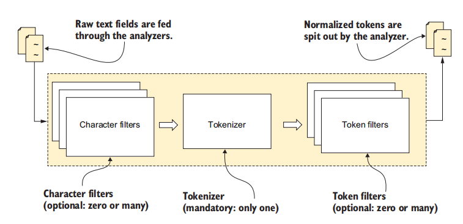
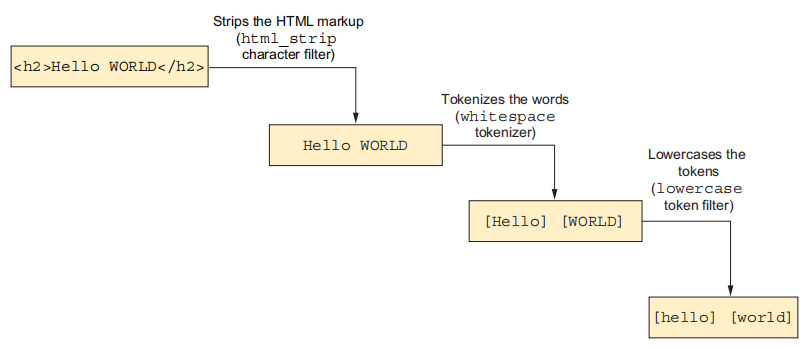
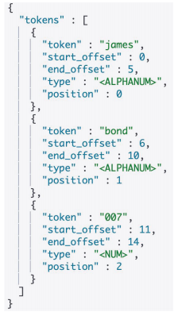
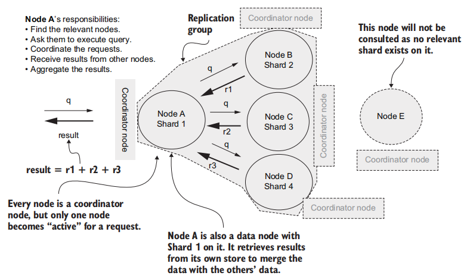
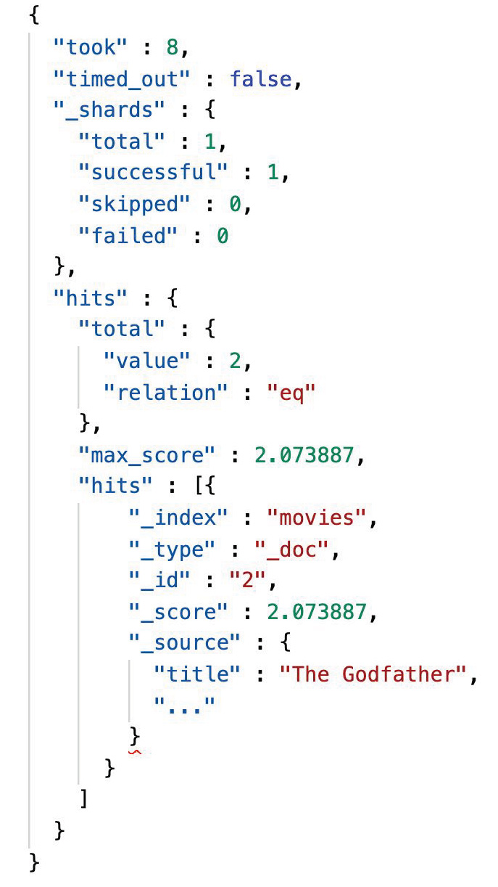
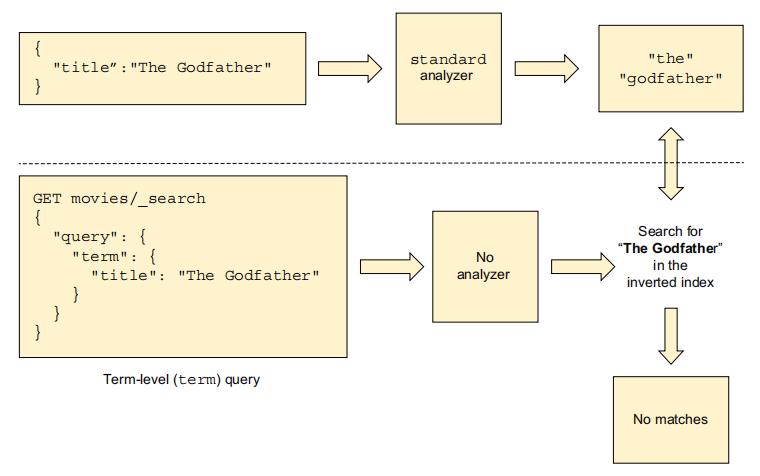
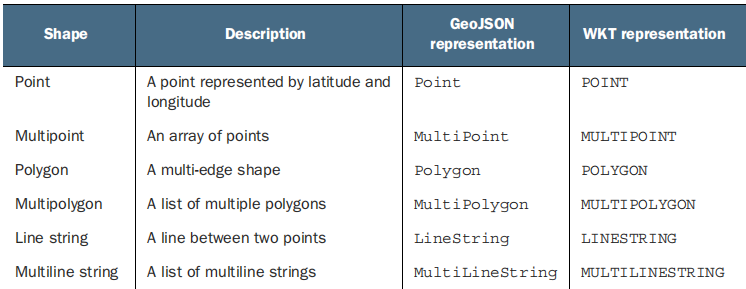

[TOC]

## 分析器

像 ES 这样的搜索引擎的强大之处在于，它不仅可以搜索单个词语，还可以搜索同义词、缩写、词根等，甚至可以搜索到拼写错误的词。这些都归功于分析器。

在 ES 中，只有文本类型的字段（`text`）会被分词。分词，顾名思义，是按照一定规则将句子分割成单词的过程，这些单词称为 **term 或者 token**。分词是通过**分词器（Analyzer）** 来实现的，它主要由 3 部分组成：

- **Character Filter**：主要对原文本进行格式处理
- **Tokenizer**：按照指定的规则对文本进行切分
- **Token Filter**：对切分后的单词进行处理，如转换为小写、删除停用词、增加同义词、词干化等

除了在数据写入的时候对数据进行分词，在对全文本进行查询时，也需要使用相同的分词器对检索内容进行分析





经分词器处理后的 Token，将会在倒排索引中使用。


使用 `_analyze` 端点来获知分词的过程，下面给出一个例子：

~~~json
GET _analyze
{
    "tokenizer": "path_hierarchy",	// 指定一个分词器
    "filter": ["uppercase"],		// 指定一个过滤器
    "text": "James Bond 007"
}
~~~

返回结果如下图所示：



我们可以在不同的级别（索引、字段、查询）上指定分析器，下面请看例子：

~~~json
PUT authors_with_field_level_analyzers
{
    "mappings": {
        "properties": {
            "name":{
                "type": "text"
                // 指定一个分词器
                "analyzer": "english"	
                // 指定一个在搜索时用的分词器
                "search_analyzer": "simple"
            },
        }
    },
    "settings": {
        "analysis": {
            "analyzer": {
                "default":{
                    // 指定一个默认分词器
                    "type":"keyword"		
                },
                // 指定一个在搜索时用的分词器
                "default_search":{
                    "type":"simple"
                },
            }
        }
    },
    
}

GET authors_index_for_search_analyzer/_search
{
    "query": {
        "match": { 
            "author_name": {
                "query": "M Konda",
                // 在查询级别定义一个分词器
                "analyzer": "simple" 
            }
        }
    }
}
~~~

它们之间的优先级如下（优先级最高的在前面）;

1. 在查询级别定义的
2. 在 Mapping 中定义的
3. 在 Settings 中定义的

## 全文搜索



ES 支持全文搜索的 API 主要有：

- **match**（匹配查询）：全文本字段检索
- **match phrase**（短语匹配），会将检索内容分词，这些词语必须全部出现在**被检索内容**中，并且顺序必须一致，默认情况下这些词都必须连续。
- **match phrase prefix**（短语前缀匹配），与 match phrase 类似，但最后一个词项会作为前缀，并且匹配这个词项开头的任何词语。
- **multi match**，通过 multi match 可以在多个字段上执行相同的查询语句。

### match

match 的示例： 

~~~json
POST books/_search
{
  "query": {
      // 这是一个非结构化查询
    "match": {
    // 在 books 索引中，匹配这样一个文档，它的 name 字段出现 linux 或者 architecture 。
      "name": "linux architecture"
    }
  }
}
~~~

下面是所返回的结果：



- `took`：执行搜索操作所花费的时间
- `timed_out`：查询是否超时
- `_shards.total`：查询所涉及的分片数
- `hits`：有关结果的信息

在进行全文本字段检索的时候， match API 提供了 operator 和 minimum_should_match 参数：

- **operator**，参数值可以为 "or" 或者 "and" 来控制检索词项间的关系，默认值为 "or"。
- **minimum_should_match**，可以指定词项的最少匹配个数，可以是具体的数字，也可以是百分比。当我们无法预估检索内容的词项数量时，一般设置为百分比

~~~bash
POST books/_search
{
  "query": {
    "match": {
      "name" : {
        "query": "Dive linux kernea architecture",
        "operator": "or",
        "minimum_should_match": "75%"
      }
    }
  }
}
~~~


可以通过 `from` 与 `size` 字段来实现**分页**功能：

~~~json
GET movies/_search
{
    "size": 100, 
    "from": 3, 
    "query": {
        "match_all": {}
    }
}
~~~

`max_result_window`是一个索引级别的设置，它限制了`from`和`size`参数获取到的最大结果数，默认值是10000。这主要目的是防止深度分页造成的内存消耗问题。如果结果数超出 `max_result_window`，那么就要考虑使用 `scroll API`。

~~~json
PUT movies/_settings
{
    "max_result_window":20000 
}
~~~


`highlight` 字段可以**高亮显示**匹配到的词项。这里的高亮无非就是添加前缀和后缀

```json
GET /books/_search
{
  "query": {
    "match": { "title": "javascript" }
  },
  "highlight": {
    "fields": {
        // 在匹配到的 title 字段周围，添加 <strong> 标签
      "title": {
        "pre_tags": ["<strong>"],
        "post_tags": ["</strong>"]
      }
    }
  }
}
```


如果我们想知道搜索时的相关性分数是怎么计算的，那么就要添加 `explain` 字段：

~~~json
GET movies/_search
{
    "explain": true,	// ** 
    "_source": false, 
    "query": {
        "match": {
            "title": "Lord"
        }
    }
}
~~~


通过 `sort` 字段，我们可以对结果中的文档进行排序：

~~~json 
GET movies/_search
{
    "query": {},
    "sort": [
        // 以 rating 字段进行降序排序
        {"rating":{"order":"asc"}},
        // 如果 rating 相同，那么再依据 release_date 排序
        {"release_date":{"order":"asc"}}
    ]
}
~~~


使用 `fields` 字段，指明应该返回文档中的哪些字段。

~~~json
GET movies/_search
{
    "_source": false, 
    "query": {},
    "fields": [
        "title",
        "rating"
    ]
}
// 返回的结果
{
    "_index" : "movies",
    "_type" : "_doc",
    "_id" : "1",
    "_score" : 0.58394784,
    "fields" : {		// 注意在 fields 字段中，而不是 _source 字段里
        "rating" : [
            9.296875
        ],
        "title" : [		
            "肖申克的救赎"
        ]
    }
}
~~~

可以使用 `script_fields` 字段，在`fields` 字段所提供的功能基础上，执行一些逻辑：

~~~json
GET movies/_search
{
    "_source": ["title*","synopsis", "rating"], 
    "query": {},
    "script_fields": {
        // 创建了一个新字段 top_rated_movie
        "top_rated_movie": {
            "script": {
                "lang": "painless",
                // 如果 rating 大于 0 分，则返回 true
                "source": "if (doc['rating'].value > 9.0) 'true'; else 'false'"
            }
        }
    }
}

// 返回的结果
"hits" : [{
    ...
    "_source" : {
        "rating" : "9.3",
        "synopsis" : "Two imprisoned men bond ...",
        "title" : "The Shawshank Redemption"
    },
    "fields" : {
        "top_rated_movie" : ["true"]
    }
}
~~~

### match phrase

短语匹配的示例：

~~~bash
POST books/_search
{
  "query": {
    "match_phrase": {
      "name": "linux kernel" 
    }
  }
}
~~~

分词默认是必须连续的，我们可以使用 slop 参数来指定词项之间所允许的距离差值

~~~bash
POST books/_search
{
  "query": {
    "match_phrase": {
      "name": {
        "query": "linux architecture",
         "slop": 1
      }
    }
  }
}
~~~

### match phrase prefix

与 match phrase 类似，但最后一个词项会作为前缀，并且匹配这个词项开头的任何词语。

短语前缀匹配的示例：

~~~bash
POST books/_search
{
  "query": {
    "match_phrase_prefix": {
      "name": {
        "query": "linux kerne",
         "max_expansions": 2
      }
    }
  }
}
~~~

可以使用 max_expansions 参数来控制每个分片的匹配数量，此参数默认值为 50。

### multi match

multi-match API的示例：

~~~bash
GET /books/_search
{
  "query": {
    "multi_match": {
      "query": "linux architecture",
      "fields": ["nam*", "intro^2"]
    }
  }
}
~~~

fields 中的值既可以支持以通配符方式匹配文档的字段，又可以支持提升字段的权重。如 "nam*" 就是使用了通配符匹配的方式。而 "intro^2" 就是对书本简介字段（intro）的相关性评分乘以 2，其他字段不变。**注意，只要在任一指定字段上匹配，文档就会被认为是匹配的。**

multi-match API 还提供了多种类型来设置其执行的方式：

- **best_fields**: 默认的类型，会执行 match 查询，并且返回所有与查询匹配的文档。将评分最高的字段的得分作为评分结果
- **most_fields**:  默认的类型，会执行 match 查询，并且返回所有与查询匹配的文档。将所有匹配字段的评分加起来作为评分结果。
- **phrase**: 在 fields 中的每个字段上均执行 match_phrase 查询，将评分最高的字段的得分作为评分结果
- **phrase_prefix**: 在 fields 中的字段上均执行 match_phrase_prefix 查询，将评分最高的字段的得分作为评分结果
- **cross_fields**
- **bool_prefix**：在每个字段上创建一个 [match_bool_prefix ](https://link.juejin.cn/?target=https%3A%2F%2Fwww.elastic.co%2Fguide%2Fen%2Felasticsearch%2Freference%2F7.13%2Fquery-dsl-match-bool-prefix-query.html)查询

可以使用 "type" 字段来指定这些类型，以 best_fields 为例，其示例如下：

~~~bash
# multi match API
GET /books/_search
{
  "query": {
    "multi_match": {
      "query": "linux architecture",
      "fields": ["name", "intro"],
      "type": "best_fields", # 指定对应的类型
      "tie_breaker": 0.3
    }
  }
}
~~~

当指定 "tie_breaker" 的时候，文档算分结果将会由以下算法来决定：
$$
评分最高的字段的得分 + 其他字段评分之和 * tie\_breaker
$$


## Term Query API

Term 是文本经过分词处理后得出来的词项，词项搜索与全文搜索之间的一个关键区别是，**词项搜索不会对输入的检索内容进行分词**，也就是说，Term Level Query 会将输入的内容（检索内容）会作为一个整体来进行检索。**此外，Term Query 所返回的结果中也就没有相关性评分**。




Term Query 的一个简单示例：

~~~json
POST books/_search
{
    "query": {
        "term": {
            // 查询值为 Linux 的 name 字段
            "name": {
                "value": "Linux"
            }
        }
    }
}
~~~

再次强调，**基于 Term 的查询是不会对检索内容进行分词的，输入的文本会作为一个整体进行查询**。所以如果要对 text 类型的字段进行全文搜索，推荐使用 match API 而不是 Term Query API。`match`查询默认是不区分大小写的。而`term` 查询是大小写敏感的。


Terms Query 与 Term Query 类似，不过可以同时检索多个词项：

~~~bash
POST books/_search
{
  "query": {
    "terms": {
      "author": [ 
      	# 数组，可以指定多个作者的名字，只要有一个匹配上即可
        "Stephen Hawking",
        "Wolfgang Mauerer"
      ]
    }
  }
}
~~~


Ids API 可以获取指定 ID 的文档：

~~~json
GET movies/_search
{
    "query": {
        "ids": { 
            "values": [10,4,6,8] 
        }
    }
}
~~~


`Range Query API` 可以查询字段值符合某个范围的文档数据：

~~~bash
# 使用 Range Query 查询书本价格大于等于 10.0 小于 20.0 的书本
POST books/_search
{
  "query": {
    "range": {
      "price": {
        "gte": 10.0,
        "lt": 20.0
      }
    }
  }
}
~~~

- **gt**：表示大于
- **gte**: 表示大于或者等于
- **lt**: 表示小于
- **lte**: 表示小于或者等于


Exist Query API 可以查询那些在指定字段上有值的文档，以下的值被认为是空值：

- 字段的 JSON 值为 null 或者 []
- 一个字段在 Mapping 中设置了 "index" : false。
- 一个字段的值的长度超出了 Mapping 设置的 ignore_above 时。
- 当字段的值不合规，并且 Mapping 设置了 ignore_malformed 时。

~~~bash
# 查询出所有存在 "price" 字段的文档
POST books/_search
{
  "query": {
    "exists": {
      "field": "price"
    }
  }
}
~~~


Prefix Query 可以查询在指定字段中包含特定前缀的文档

~~~bash
# 使用 Prefix Query 查询含有 "linu" 前缀的文档
POST books/_search
{
  "query": {
    "prefix": {
      "name": {
        "value": "linu"
      }
    }
  }
}
~~~

需要注意的是，text 类型的字段会被分词，成为一个个的 term，所以这里前缀匹配的是这些 term！而不是整个 text 。下面的 Wildcard Query 同理。


Wildcard Query 允许使用通配符表达式进行匹配。Wildcard Query 支持两个通配符：

- ?，使用 ? 来匹配任意字符。
- *，使用 * 来匹配 0 或多个字符。

~~~bash
# 使用 Wildcard Query 查询书名中含有 "linu" 开头的文档
POST books/_search
{
  "query": {
    "wildcard": {
      "name": "linu*"
    }
  }
}
~~~

需要注意的是，Prefix Query 和 Wildcard Query 在进行查询时，需要扫描倒排索引中的词项列表，才能找到全部匹配的词项。因此要注意性能问题，要尽量避免使用左通配匹配模式，如 "*linux"、".*linux"。


## 组合查询

带有组合功能的 API 有：

- **Bool Query**
- **Boosting Query**
- **constant_score Query**
- **dis_max Query**
- **function_score Query**


Bool Query 透过组合多个查询子句和逻辑运算（如 AND、OR、NOT）构建更复杂的查询。其中查询子句有：

- **must**，所有在此数组中的查询都必须匹配，并且会进行相关性算分。
- **filter**，所有在此数组中的查询都必须匹配，相关性算分是会被忽略的
- **should**，至少有一个在此数组中的查询要匹配，它有 minimum_should_match 参数，可以指定最少匹配的查询数量或者百分比。
- **must_not**， 所有在此数组中的查询都不得匹配

使用示例：

~~~bash
POST books/_search
{
  "query": {
    "bool": {
      "must": [
        {
          "term": {
            "author": {
              "value": "Wolfgang Mauerer"
            }
          }
        },
        {
          "term": {
            "date": {
              "value": "2010-06-01"
            }
          }
        }
      ]
    }
  }
}
~~~


Boosting Query 可以指定两个块：positive 块和 negative 块。在 negative 块中匹配的文档其相关性算分将会降低。相关性算分降低的程度将由 negative_boost 参数决定。

~~~bash
POST books/_search
{
  "query": {
    "boosting": {
      "positive": {
        "term": {
          "name": {
            "value": "linux"
          }
        }
      },
      "negative": {
        "term": {
          "name": {
            "value": "programming"
          }
        }
      },
      "negative_boost": 0.5
    }
  }
}
~~~


使用 `Constant Score` 可以将 query 转化为 filter，可以忽略相关性算分的环节，并且 filter 可以有效利用缓存，从而提高查询的性能。`constant_score` 是一个查询包装器(Query Wrapper)，它的主要作用是将一个常量分数应用于查询结果

~~~bash
"query": {
    "constant_score" : {
        "filter" : {
            "term" : { "user" : "kimchy"}
        },
        "boost" : 1.2
    }
}
~~~


`disjunction max query` 简称 dis_max，是分离最大化查询的意思：

- **disjunction**（分离）：把查询都分开，分别进行算分操作。
- **max**（最大化）：是将查询得分的最大值作为最终评分返回。

当指定 "tie_breaker" 的时候，算分结果将会由以下算法来决定：
$$
评分最高查询的得分 + 其他查询评分之和 * tie\_breaker
$$

~~~bash
POST books/_search
{
  "query": {
    "dis_max": {
      "queries": [
        {
          "term": {
            "name": {
              "value": "linux"
            }
          }
        },
        {
          "term": {
            "intro": {
              "value": "kernel"
            }
          }
        }
      ],
      "tie_breaker": 0.9
    }
  }
}
~~~


`function_score Query` 允许在查询结束后，修改每一个匹配文档的相关性算分。`function_score Query` 提供了以下几种算分函数：

- **script_score**
- **weight**
- **random_score**：随机产生一个数值作为每个文档的得分
- **field_value_factor**：让某个字段参与计算分数
- **decay functions**：衰减函数，以某个字段的值为标准，距离指定值越近，算分就越高

下面将介绍 `field_value_factor` 和 `random_score` 这两个算分函数

`field_value_factor` 提供了以下几个参数选项：

- **field**：文档的字段。
- **factor**：用于乘以字段值，默认值为 1。
- **modifier**：修改最终值的函数，其值可以为：none、log、log1p、log2p、ln、ln1p、ln2p、square、 sqrt、reciprocal，默认为 none。

~~~bash
POST books/_search
{
  "query": {
    "function_score": {
      "query": {
        "term": {
          "name": {
            "value": "linux"
          }
        }
      },
      "field_value_factor": {
        "field": "price",
        "factor": 1.2,
        "modifier": "reciprocal",
        "missing": 1
      },
      "boost_mode": "multiply"
    }
  }
}
~~~

如上示例，我们使用书本的价格字段来影响相关性算分。新算分 = 匹配过程产生的旧算分 * reciprocal(1.2 * doc['price'].value)


对于 boost_mode 参数，它的值有以下几种：

- **multiply**：算分与函数值的积，默认值。
- **replace**：使用函数值作为最终的算分结果。
- **sum**：算分与函数值的和。
- **avg**：算分与函数值的平均数。
- **min**：在算分与函数值中取最小值。
- **max**：在算分与函数值中取最大值。


random_score 算分函数的使用示例：

~~~bash
POST books/_search
{
  "query": {
    "function_score": {
      "random_score": {
        "seed": 81819,
        "field": "_seq_no"
      }
    }
  }
}
~~~

返回所有的文档，并每个文档的得分赋予一个随机值。一般来说，使用 "seq_no" 作为 field 的值是比较推荐的。这里简单介绍一下 `_seq_no`，在同一个 Index 里，每次文档写入时 `_seq_no`都会自增。

## Suggesters API

当用户在搜索框输入部分内容后，出现对应书本的推荐选项，让用户可以快速选择。


Suggesters 会将输入的文本（检索内容）分解为 token，然后在索引里查找相似的 Term。根据使用场景的不同，ES 提供了以下 4 种 Suggester：

- **Term Suggester**：基于单词的纠错补全。
- **Phrase Suggester**：基于句子的纠错补全。
- **Completion Suggester**：自动补全单词，输入词语的前半部分，自动补全单词。
- **Context Suggester**：基于上下文的补全提示，可以实现上下文感知推荐。


Term Suggester 提供了基于单词的纠错、补全功能，其工作原理是基于编辑距离（edit distance）来运作的，编辑距离的核心思想是一个词需要改变多少个字符就可以和另一个词一致。Term Suggester 工作的时候，会先将输入的文本切分为一个个单词（我们称这个为 token），然后对每个单词提供建议

~~~bash
# Term Suggester，"architture" 是错误的拼写，正确的是 "architecture"
POST books/_search
{
  "query": {
    "match": {
      "name": "kernel architture"
    }
  },
  
  "suggest": {
    "my_suggest": {
      # 一般与 match API 中的内容相同即可
      "text": "kernel architture",
      "term": {
        "suggest_mode": "missing",
        # 根据 name 字段来建议
        "field": "name"
      }
    }
  }
}

# 返回的结果
{
  # ..
  "suggest" : {
    "my_suggest" : [
      {
        # 对于 kernel 的建议
        "text" : "kernel",
        "offset" : 0,
        "length" : 6,
        "options" : [ ]
      },
      {
        # 对于 architture 的建议
        "text" : "architture",
        "offset" : 7,
        "length" : 10,
        "options" : [
          # 建议的内容
          {
            "text" : "architecture",
            "score" : 0.8,
            "freq" : 1
          }
        ]
      }
    ]
  }
}
~~~

Term Suggester API 有很多参数：

- **text**：指定了需要产生建议的文本，一般是用户输入的内容
- **field**：指定从文档的哪个字段中获取建议
- **suggest_mode**：设置建议的模式
  - missing：如果索引中存在就不进行建议，默认的选项。
  - popular：推荐出现频率更高的词。
  - always：不管是否存在，都进行建议。
- **analyzer**：指定分词器来对输入文本进行分词
- **size**：为每个单词提供的最大建议数量。
- **sort**：建议结果排序的方式
  - score：先按相似性得分排序，然后按文档频率排序，最后按词项本身（字母顺序的等）排序。
  - frequency：先按文档频率排序，然后按相似性得分排序，最后按词项本身排序。


Term Suggester 产生的建议是基于每个单词的，可以使用 Phrase Suggester API 获取与用户输入文本相似的内容。

~~~bash
# Phrase Suggester 使用示例
POST books/_search
{
  
  "suggest": {
    "my_suggest": {
      "text": "Brief Hestory Of Tome",
      "phrase": {
        "field": "name",
        "highlight": {
          "pre_tag": "<em>",
          "post_tag": "</em>"
        }
      }
    }
  }
}

# 结果
{
  ......
  "suggest" : {
    "my_suggest" : [
      {
        ......
        "options" : [
          {
            "text" : "brief history of time",
            "highlighted" : "brief <em>history</em> of <em>time</em>",
            "score" : 0.030559132
          },
          {
            "text" : "brief history of tome",
            "highlighted" : "brief <em>history</em> of tome",
            "score" : 0.025060574
          },
          {
            "text" : "brief hestory of time",
            "highlighted" : "brief hestory of <em>time</em>",
            "score" : 0.0236486
          }
        ]
      }
    ]
  }
}
~~~

Phrase Suggester 的参数：

- max_error：指定最多可以拼写错误的词语的个数。
- confidence：如果用户输入的数据（短语）得分为 N，那么返回结果的得分需要大于 N * confidence。confidence 默认值为 1.0。
- highlight：高亮被修改后的词语。


Completion Suggester 提供了自动补全的功能，其应用场景是用户每输入一个字符就需要返回匹配的结果给用户。Completion Suggester 在工作时，会将 analyze 后的数据（将文本分词，并且去除没用的词语，例如 is、at 这样的词语）进行编码，构建为 FST（**[finite-state transducer](https://link.juejin.cn/?target=https%3A%2F%2Fen.wikipedia.org%2Fwiki%2FFinite-state_transducer)**） 并且和索引存放在一起。FST 是一种高效的前缀查询索引。

在使用 Completion Suggester 前需要定义 Mapping，对应的字段需要指定 "completion" type

~~~bash
# 准备数据
PUT books_completion
{
  "mappings": {
    "properties": {
		# ...
        "name_completion": {
          "type": "completion"
        },
		# ...
      }
  },
}

PUT books_completion/_doc/2
{
  # ...
  "name_completion": "A Brief History Of Time",
  # ...
}
~~~

~~~bash
POST books_completion/_search
{
  "suggest": {
    "my_suggest": {
      "prefix": "a brief hist",
      "completion": {
        "field": "name_completion"
      }
    }
  }
}

# 结果
{
  ......
  "suggest" : {
    "my_suggest" : [
      {
        "text" : "a brief hist",
        "offset" : 0,
        "length" : 12,
        "options" : [
          {
            "text" : "A Brief History Of Time",
            "_id" : "2",
            "_source" : {
              "book_id" : "4ee82463",
              "name_completion" : "A Brief History Of Time",
              ......
            }
          }
        ]
      }
    ]
  }
}
~~~


Context Suggester 是 Completion Suggester 的扩展，可以实现上下文感知推荐。例如当我们在编程类型的书籍中查询 "linu" 的时候，可以返回 linux 编程相关的书籍，但在人物自传类型的书籍中，将会返回 linus 的自传。 要实现这个功能，**需要在文档中加入分类信息**，帮助我们做精准推荐。

ES 支持两种类型的上下文：

- **Category**：任意字符串的分类。
- **Geo**：地理位置信息。

首先在 Mapping 中，为字段指定 context

~~~bash

# 导入测试数据
PUT books_context/_doc/4
{
  "book_id": "4ee82465",
  "name": "Linux Programming",
  "name_completion": {
    "input": ["Linux Programming"],
    "contexts": {
      "book_type": "program"
    }
  },
}


PUT books_context
{
  "mappings": {
    "properties": {
    	# ...
    	"name_completion": {
          "type": "completion",
          "contexts": [
            {
              "name": "book_type",
              "type": "category"
            }  
          ]
        },
   # ...
  	}
 }
 
 # 导入测试数据
PUT books_context/_doc/4
{
  "name_completion": {
    "input": ["Linux Programming"],
    "contexts": {
      "book_type": "program"
    }
  },
}

PUT books_context/_doc/5
{
  "name_completion": {
    "input": ["Linus Autobiography"],
    "contexts": {
      "book_type": "autobiography"
    }
  },
}
~~~

~~~bash
POST books_context/_search
{
  
  "suggest": {
    "my_suggest": {
      "prefix": "linu",
      "completion": {
        "field": "name_completion",
        "contexts": {
          "book_type": "program"
        }
      }
    }
  }
}
~~~

## 地理搜索

Elasticsearch 提供了两种数据类型 `geo_point` 与 `geo_shape` 来处理空间数据。下面给出这两个示例：

~~~json
PUT bus_stops
{
    "mappings": {
        "properties": {
            "location":{
                "type": "geo_point"
            }
        }
    }
}

POST bus_stops/_doc
{
    "name": "伦敦桥站",
    "location": "51.07, 0.08"
}

POST bus_stops/_doc
{
    "text": "Leicester Square Station",
    "location" : { 
        "lon":-0.12,
        "lat":51.50
    }
}

POST bus_stops/_doc
{
    "text": "Westminster Station",
    "location" : [51.54, 0.23] 
}

~~~


~~~json
PUT cafes
{
    "mappings": {
        "properties": {
            "address": {
                "type": "geo_shape" 
            }
        }
    }
}

PUT cafes/_doc/1 
{
    "address" : {
        "type" : "Point", 
        // GeoJSON 格式
        "coordinates" : [0.17, 51.57] 
    }
}

PUT /cafes/_doc/2 
{
    // WKT 格式
    "address" : "POINT (0.17 51.57)" 
}
~~~




`geo_bounding_box` 边界框查询：


~~~json
GET restaurants/_search
{
    "query": {
        "geo_bounding_box": {
            "location": {
                "top_left": {
                    "lat": 52,
                    "lon": 0.2
                },
                "bottom_right": {
                    "lat": 49,
                    "lon": 0.1
                }
            }
        }
    }
}
~~~


`geo_distance` 地理距离查询：


~~~json
GET restaurants/_search
{
    "query": {
        "geo_distance": { 
            "location": { 
                "lat": 50.00,
                "lon": 0.10
            }
        }
    }
}
~~~


`geo_shape` 地理形状查询：


~~~json
GET cafes/_search
{
    "query": {
        "geo_shape": {
            "address": {
                "shape": {
                    "type": "envelope",
                    "coordinates": [
                        [0.1,55],
                        [1,45]
                    ]
                },
                "relation": "within"
            }
        }
    }
}
~~~

relation 说明了查询区域与地理对象之间的关系：

- intersects (default)
- within
- contains
- disjoint
