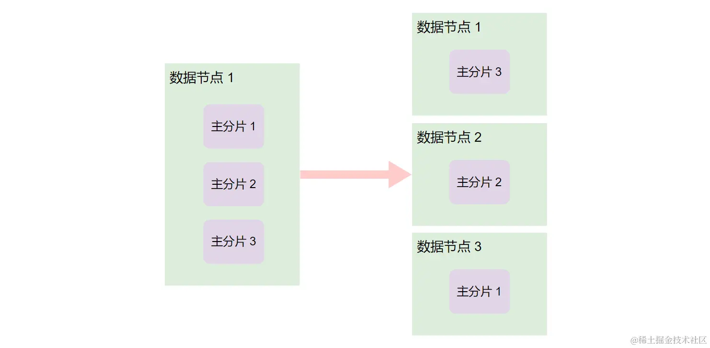
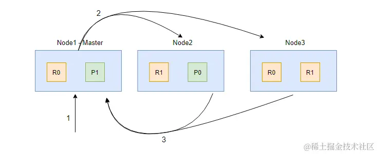
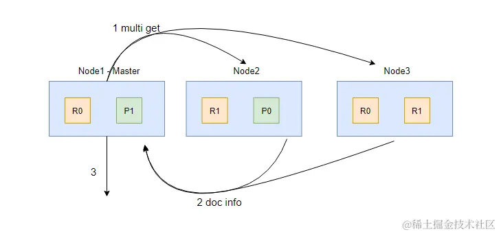

# 分布式

[TOC]

## 分布式

在为系统增加存储空间时，我们只需要为集群添加一个数据节点即可，ES 会为我们自动完成剩下的工作 。下面看一个示例副本保持的示例：

1. 初始状态

2. 添加一个节点，分片副本在新节点上创建

为了保证数据的可靠性，在发生分片故障的时候，ES 是会自动完成数据迁移的：

1. 系统会先在其他节点上恢复主分片
2. 然后再从其他节点上恢复足够多的副本分片。

1. 主节点下线

2. 选取主分片

3. 生成副本

当一个索引的主分片数量比数据节点数量多的时候，如果加入新的数据节点，系统会自动将这些分片分配到其他机器上，以达到一个分片平衡的状态。

ES 的索引是由多个分片组成的，每个分片尽量均匀地分散到各个节点上存储，以避免出现数据倾斜。ES 的数据路由算法是根据 routing key 来确定 Shard ID 的过程，计算公式如下：
$$
shard\_number = hash(\_routing) \% numer\_of\_primary\_shards
$$
**默认的情况下 routing key 为文档 ID**。可以在请求中指定 routing key

~~~bash
PUT books/_doc/doc_id?routing=routing_key
{
    "name": "java",
    "id": "book_id"
}
~~~

整体来说，ES 的搜索过程可以分为两个阶段：

1. Query 阶段：Query 阶段会根据搜索条件遍历每个分片中的数据，返回符合条件的前 N 条数据的 ID 和排序值。然后在协调节点中对所有分片的数据进行排序，获取前 N 条数据的 ID。

   

   1. 客户端发起 search 请求到 Node1
   2. 协调节点 Node1 将查询请求转发到索引的每个主分片或者副分片中，每个分片执行本地查询并且将查询结果打分排序
   3. 每个分片将查询结果返回到 Node1（协调节点）中，Node1 对所有结果进行排序，并且把排序后结果放到一个全局的排序列表中。

   需要注意的是，在协调节点转发搜索请求的时候，如果有 N 个 Shard 位于同一个节点时，并不会合并这些请求，而是发起 N 次请求。

2. Fetch 阶段：根据 Query 阶段所产生的全局排序列表，确定需要取回的文档 ID 列表（此时仅有文档的部分信息，例如文档的 _id 和得分），通过 multi get 的方式到对应的分片上获取文档数据。

   

   1. 协调节点（Node1）确定哪些文档需要获取，然后向相关节点发起 multi get 请求；
   2. 分片所在节点读取文档数据，并且进行 _source 字段过滤、处理高亮参数等，然后把处理后的文档数据返回给协调节点；
   3. 协调节点等待所有数据被取回后返回给客户端。

从 Query 阶段我们知道，文档的评分是在各自的 Shard 上获取的，因为 ES 的每个 Shard 就是 Lucene 的一个索引，所以**每个分片都是基于自己的数据进行相关性算分的**，即分片的相关性算分都是独立的。这样文档的算分只是基于系统中部分数据来计算的，从而会导致打分偏离的情况。有三种解决方式：

1. 如果索引的数据不多的情况下，可以设置主分片数为 1
2. 索引数据量大的情况下，需要保证数据均匀地分布在各个分片中（推荐）
3. 使用 DFS Query Then Fetch， 在 URL 参数中指定：_search?search_type=dfs_query_then_fetch。这样设定之后，系统先会把每个分片的词频和文档频率的数据汇总到协调节点进行处理，然后再进行相关性算分。这样的话会消耗更多的 CPU 和内存资源，效率低下！

数据在主分片写入成功后，再将数据分发到副分片进行存储：

1. 客户端的请求到达 Node1，Node1 根据 routing key 来计算得出文档应该被保存到哪个分片（这里是分片 0），并且从集群状态的内容路由表信息中，获取分片 0 所在的节点为 Node2；
2. Node1 将请求转发到 Node2 处理，Node2 执行写入操作；
3. 如果写入成功，Node2 将写请求并发转发到 Node1 和 Node3，并且执行副本写入操作；
4. 当所有副分片都写入成功后，Node2 会向协调节点（这里的 Node1）返回写入成功的信息，最后协调节点向客户端返回成功

## 对集群的管理

GET _cat  端点查看集群相关的信息

~~~bash
# 使用 _cat API 获取所有可用的目录
GET /_cat/

# 结果
/_cat/allocation
/_cat/shards
/_cat/shards/{index}
/_cat/master
/_cat/nodes
.... 
~~~

_cat APIs 返回了多个 API 的目录，这些 API 都可以添加下面几个参数：

- **v 参数**：每个命令都可以使用 v 参数来打印详细信息。如：GET /_cat/nodes?v。
- **h 参数**：使用 h 参数可以强制只显示某些列。如：GET /_cat/nodes?h=node.role,port,name。
- **help 参数**：使用 help 参数可以输出这个接口可用的列名和其解析。如：GET /_cat/master?help。

查看集群状态：

~~~bash
# 查看集群健康状态
GET /_cat/health?v
GET /_cat/health?v&ts=false # 去除时间戳

# 查看集群状态
GET /_cluster/state

# 查看集群统计信息
GET /_cluster/stats?human&pretty

# 查看集群的设置
GET /_cluster/settings?include_defaults=true
~~~

查看磁盘使用情况

~~~bash
GET /_cat/allocation?v
~~~

节点过滤 API：

- **_all**：返回所有节点的信息
- **_local**：返回本地节点的信息
- **_master**：列出主节点
- **master:true/false**：是否列出主节点
- **data:true/false**：是否列出数据节点
- ...

~~~bash
# 节点类型过滤
GET /_nodes/master:true,data:true,ingest:true,coordinating:true
~~~

查看节点信息：

~~~bash
# 获取节点信息的请求格式
GET /_nodes
GET /_nodes/<node_id>
GET /_nodes/<metric>
GET /_nodes/<node_id>/<metric>

# 获取节点信息的示例
GET /_nodes
GET /_nodes/node_id1,node_id2 # 获取 node_id1 和 node_id2 的信息
GET /_nodes/stats 
GET /_nodes/node_id1,node_id2/stats # 获取 node_id1 和 node_id2 的统计信息
~~~

更新集群设置

~~~bash
PUT /_cluster/settings
{
  "persistent": {
    "indices.recovery.max_bytes_per_sec": "100m"
  }
}
~~~

reroute API 允许用户手动修改集群中分片的分配情况

~~~bash
POST /_cluster/reroute
{
  "commands": [
    {
      "move": {
      	# 将索引 "test" 的分片 0 从节点 "node1" 移动到了 "node2"
        "index": "test", "shard": 0,
        "from_node": "node1", "to_node": "node2"
      }
    },
    {
      # 将索引 "test" 的分片 1 副本分配到节点 "node3"
      "allocate_replica": {
        "index": "test", "shard": 1,
        "node": "node3"
      }
    }
  ]
}
~~~

在执行了任何路由重置指令后，Elasticsearch 会尝试对分片进行重新平衡，以保持各节点上的分片数量大致相等，以达到性能最优。但是这个操作受 [cluster.routing.rebalance.enable](https://link.juejin.cn/?target=https%3A%2F%2Fwww.elastic.co%2Fguide%2Fen%2Felasticsearch%2Freference%2F7.13%2Fmodules-cluster.html%23cluster-shard-allocation-settings)（是否允许重新平衡）参数的影响：

- "none"：禁用重新平衡，所有分片都将保持当前的状态，不会做任何自动的重新平衡。
- "primaries"：只有主分片会被重新平衡。
- "replicas"：只有副本分片会被重新平衡。
- "all"：所有类型的分片（主分片和副本分片）都会被重新平衡。

## 分页

Query + Fetch 的方式，会产生一些问题：

- 每个分片上都要取回 from + size 个文档（不是 from 到 size，而是 from + size）；
- 协调节点需要处理 shard_amount * ( from + size ) 个文档。

这会有深分页问题，举个例子：

当使用 from = 90 和 size = 10 进行分页的时候，ES 会先从每个分片中分别获取 100 个文档，然后把这 300 个文档再汇聚到协调节点中进行排序，最后选出排序后的前 100 个文档，返回第 90 到 99 的文档。

ES 为解决分页的需求提供了 3 种 API：

- **from + size**
- **search after**：只能一页一页地往下翻，不支持跳转到指定页数。
- **scroll API**：会创建数据快照，无法检索新写入的数据，适合对结果集进行遍历的时候使用。

在我们检索数据时，系统会对数据按照相关性算分进行排序，然后默认返回前 10 条数据。我们可以使用 from + size 来指定获取哪些数据

~~~bash
# 简单的分页操作
GET books/_search
{
  "from": 0, # 指定开始位置
  "size": 10, # 指定获取文档个数
  "query": {
    "match_all": {}
  }
}
~~~

将 from 设置大于 10000 或者 size 设置大于 10001 的时候，这个查询将会报错。因为我们要获取的数据集合太大了，系统拒绝了我们的请求。可以使用 "index.max_result_window" 配置项设置这个上限：

~~~bash
PUT books/_settings
{
  "index": {
    "max_result_window": 20000
  }
}
~~~

使用 search after API：

1. 在 sort 中指定需要排序的字段，并且保证其值的唯一性
2. 在下一次查询时，带上返回结果中最后一个文档的 sort 值进行访问

~~~bash
# 第一次调用 search after
POST books/_search
{
  "size": 2,
  "query": { "match_all": {} },
  "sort": [
    { "price": "desc" },
    { "_id": "asc" }
  ]
}

# 返回结果
"hits" : [
  {
    "_id" : "6",
    "_source" : {
      "book_id" : "4ee82467",
      "price" : 20.9
    },
    "sort" : [20.9, "6"]
  },
  {
    "_id" : "1",
    "_source" : {
      "book_id" : "4ee82462",
      "price" : 19.9
    },
    "sort" : [19.9, "1"]
  }
]

# 第二次调用 search after
POST books/_search
{
  "size": 2,
  "query": {
    "match_all": {}
  },
  "search_after":[19.9, "1"], # 设置为上次返回结果中最后一个文档的 sort 值
  "sort": [
    { "price": "desc" },
    { "_id": "asc" }
  ]
}
~~~

因为有了唯一的排序值做保证，所以每个分片只需要返回比 sort 中排序值大的 size 个数据即可。而 from + size 的方式因为没有唯一排序值，所以没法保证每个分片上的排序就是全局的排序，必须把每个分片的 from + size 个数据汇总到协调节点进行排序处理，导致出现了深分页的问题。

使用 scroll API。scroll API 会创建数据快照，后续的访问将会基于这个快照来进行，所以无法检索新写入的数据。这和在 SQL 中使用游标的方式非常相似。通过 size 参数指定每次 scroll API 所获取的文档个数

~~~bash
# 第一次使用 scroll API
# 需要初始化 scroll 搜索并且创建快照
# scroll 参数告诉 Elasticsearch 将 “search context” 保存多久
POST books/_search?scroll=10m
{
  "query": {
    "match_all": {}
  },
  "sort": { "price": "desc" }, 
  "size": 2
}

# 结果
{
  "_scroll_id" : "FGluY2x1ZGVfY29udGV4dF9......==",
  "hits" : {
    "hits" : [
      {
        "_id" : "6",
        "_source" : {
          "book_id" : "4ee82467",
          "price" : 20.9
        }
      },
      ......
    ]
  }
}

# 我们把 _scroll_id 递给 scroll API ，用来取回下一批结果
POST /_search/scroll                                                    
{
  "scroll" : "1m"
  "scroll_id" : "FGluY2x1ZGVfY29udGV4dF9......==" 
}
~~~

在 ES 7.10 中引入了 Point In Time 后，scroll API 就不建议被使用了。PIT 是一个轻量级的数据状态视图，用户可以利用这个视图反复查询某个索引，仿佛这个索引的数据集停留在某个时间点上。也就是说，在创建 PIT 之后更新的数据是无法被检索到的。

~~~bash
# 使用 pit API 获取一个 PID ID
POST /books/_pit?keep_alive=20m

# 结果
{
  "id": "46ToAwMDaWR5BXV1aWQy......=="
}
~~~

建议使用 PIT + search after 代替 scroll API

~~~bash
POST _search
{
  "size": 2,
  "query": { "match_all": {} },
  "pit": {
    "id":  "46ToAwMDaWR5BXV1aWQy......==", # 添加 PIT id
    "keep_alive": "5m" # 视图的有效时长
  },
  "sort": [
    { "price": "desc" } # 按价格倒序排序
  ]
}

# 第二次调用 search after，因为使用了 PIT，这个时候搜索不需要指定 index 了。
POST _search
{
  "size": 2,
  "query": {
    "match_all": {}
  },
  "pit": {
    "id":  "46ToAwMDaWR5BXV1aWQy......==", # 添加 PIT id
    "keep_alive": "5m" # 视图的有效时长
  },
  "search_after": [19.9, 8589934592], # 上次结果中最后一个文档的 sort 值
  "sort": [
    { "price": "desc" }
  ]
}
~~~

## 聚合

Max 聚合请求先达到协调节点，协调节点会将请求转发到所有保存主分片的节点进行处理，然后每个节点在本地分片中求出数据的最大值返回给协调节点，协调节点在各个分片的最大值中得出最大值返回给客户端。上述 Max 聚合的工作原理是不会产生聚合结果不准确的问题。

协调节点会从每个分片的 top n 数据中最终排序出 top n，但每个分片的 top n 并不一定是全量数据的 top n。但就导致结果不准确

解决方案：

1. 数据不要分片存储

2. 每个分片返回足够多的分组：例如查询结果要返回 top 3，我们在每个分片上返回 top 20

   ~~~bash
   GET /my_index/_search
   {
     "aggs": {
       "products": {
         "terms": {
           "field": "product",
           "size": 5,
           "shard_size": 10
         }
       }
     }
   }
   ~~~

而要保证实时性和准确度的话，只能对有限的数据进行计算。而硬件资源只能决定有限数据集合的上限。

