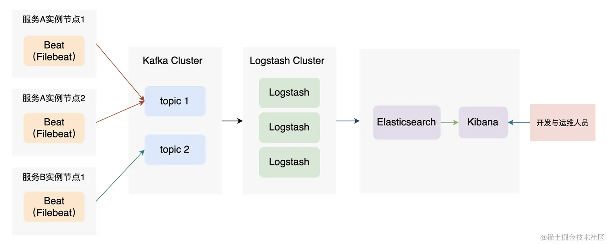
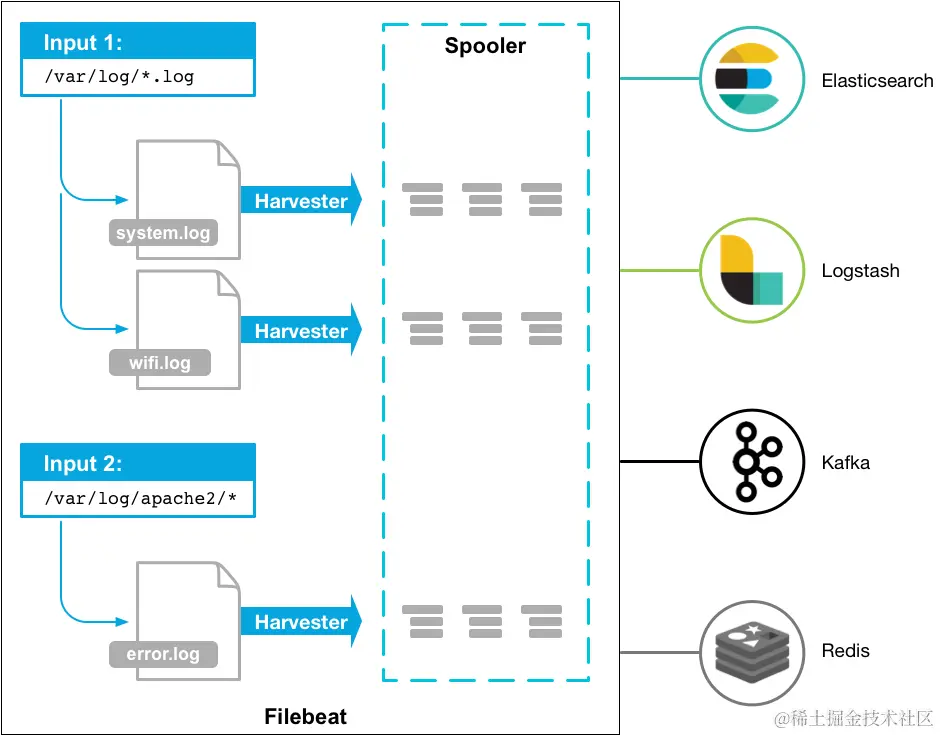
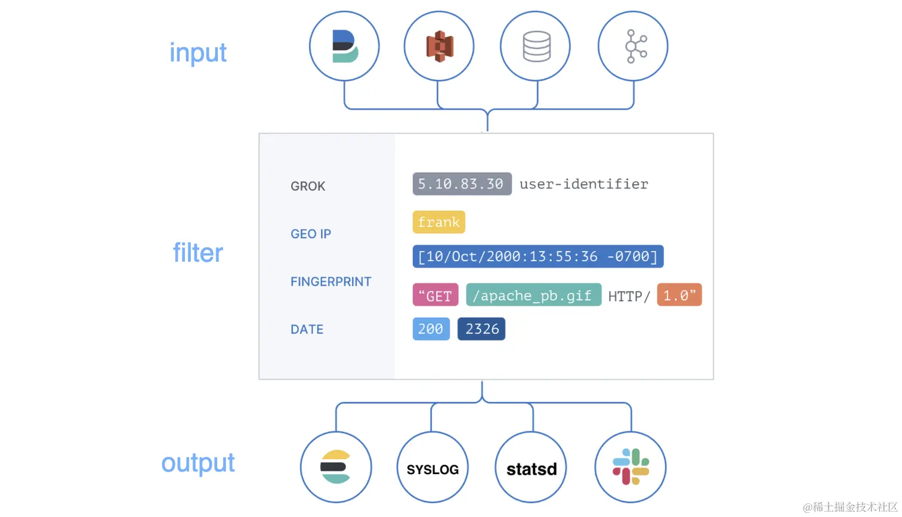

[TOC]

Elasticsearch 与 Kibana、Logstash 组成的 ELK 系统还可以应用到日志采集、监控等领域

- Elasticsearch（ES）：开源分布式搜索引擎
- Logstash：日志搜集、分析、过滤，支持大量数据获取
- Kibana：提供日志分析友好的 Web 界面



在 Beats 与 Logstash 之间可以引入 Kafka，起到削峰、异步操作、日志重放的作用

## Beats

Elastic 其实提供了多个 Beat 来采集各种各样的日志、信息数据，我们把这些 Beats 称为 Beats 系列：


这里我们介绍 Filebeat，Filebeat 主要由三部分组成：

- Input：Filebeat 通过 Input 来查找本地日志文件。
- Harvester：当找到一个需要监听的日志文件后，会启动一个 Harvester 来监听和读取这日志文件，并且发送日志内容到 libbeat。
- libbeat：提供了聚合日志事件，以及聚合数据到指定外部服务的功能。



下载安装 Filebeat：

~~~shell
# 使用 wget 下载
wget https://artifacts.elastic.co/downloads/beats/filebeat/filebeat-7.13.0-linux-x86_64.tar.gz

# 解压
tar xzvf filebeat-7.13.4-linux-x86_64.tar.gz

# 重命名
mv filebeat-7.13.4-linux-x86_64 filebeat
~~~

下面是一份 Filebeat 的配置：

```yaml
filebeat.inputs:
- type: log
  enabled: true
  paths:
    - /home/ubuntu/OrderService.log 

  #fields:
  #  level: debug
  #  review: 1

  multiline.type: pattern
  multiline.pattern: ^\[
  multiline.negate: true
  multiline.match: after

output.kafka:
  # initial brokers for reading cluster metadata
  hosts: ["localhost:9092"]

  # message topic selection + partitioning
  topic: 'order_service'
  partition.round_robin:
    reachable_only: false

  required_acks: 1
  compression: gzip
  max_message_bytes: 1000000
```

- `multiline.type`，定义了使用何种方式聚合数据。
  - `pattern` 是使用正则匹配。
  - `count`，将会聚合指定行数的日志为一个事件。
- `multiline.pattern`，指定匹配日志的正则表达式，支持的正则策略可以参考
- `multiline.negate`，否定 multiline.pattern 定义的正则，默认是 false。
- `multiline.match`，定义如何合并多行日志。可选项为 after 或者 before。
- `multiline.timeout`：After the specified timeout, Filebeat sends the multiline event even if no new pattern is found to start a new event. The default is 5s.

| Setting for `negate` | Setting for `match` | Result                                                       | Example `pattern: ^b`                                        |
| -------------------- | ------------------- | ------------------------------------------------------------ | ------------------------------------------------------------ |
| `false`              | `after`             | Consecutive lines that match the pattern are appended to the previous line that doesn’t match. |  |
| `false`              | `before`            | Consecutive lines that match the pattern are prepended to the next line that doesn’t match. |  |
| `true`               | `after`             | Consecutive lines that don’t match the pattern are appended to the previous line that does match. |  |
| `true`               | `before`            | Consecutive lines that don’t match the pattern are prepended to the next line that does match. |  |

而我们上面的配置的效果就是：使用正则表达式（type: pattern），如果与正则（^[）不匹配（negate: true）的行，会追加到先前的一行后面（match: after）。如果与正则匹配的话，前面所有追加的内容将成为一个完整的日志事件，随后将会被发送到 output 对应的服务中，而当前匹配行将成为一个新日志事件的起始行。

最后我们启动 Filebeat：

```bash
# 修改权限
chmod go-w filebeat.yml

# 前台启动
./filebeat -e

# 后台启动，日志在 logs 目录下
./filebeat -c filebeat.yml >> /dev/null 2>&1 &
```

## Logstash

Logstash 简单来说就是一个数据处理管道（ pipeline） 。既然是数据处理管道，其必定有数据输入、数据处理、数据输出这个三个功能，这些在 Logstash 中对应的概念为 input、filter、output。而在整个管道中流转的数据称为 event



下面我们使用 wget 下载 tar 包进行安装：

```bash
bash复制代码# 下载 tar 包
wget https://artifacts.elastic.co/downloads/logstash/logstash-7.13.0-linux-x86_64.tar.gz

# 解压
tar xvf logstash-7.13.0-linux-x86_64.tar.gz

# 重命名
mv logstash-7.13.0 logstash
```

进入 logstash 的 config 目录，创建 OrderServiceLog.conf 配置文件：

```bash
bash复制代码# 进入配置目录
cd logstash/config

# 创建 OrderServiceLog.conf 配置文件
touch OrderServiceLog.conf

# 将以下内容写入到到 OrderServiceLog.conf 中
input {
    kafka {
        bootstrap_servers => ["localhost:9092"]
        topics => ["order_service"]
        codec => "json"
        auto_offset_reset => "latest"
        decorate_events=> "basic"
        group_id => "logstash01"
    }
}

filter {
    grok {
        match => { "message" => "(?m)^\[(?<log_date>\d{4}-\d{2}-\d{2}\s\d{2}:\d{2}:\d{2},\d{3})\]%{SPACE}\[(?<level>[A-Z]{4,5})\]" }
    }

    mutate {
        lowercase => [ "level" ]
        remove_field => ["beat"]
    }
}

output {
   elasticsearch {
        hosts => ["https://localhost:9211"]
        index =>  "%{[@metadata][kafka][topic]}_%{+YYYY-MM-dd}"
        user => "elastic" 
        password => "123456"
        ssl => true
        ssl_certificate_verification => false
        cacert => "/home/ubuntu/ES/logstash/config/es_ca.pem"
    }
}
```

如上示例，我们使用 kafka input 插件从 kafka 中获取数据，使用 elasticsearch output 插件将处理后的数据保存到 ES 中，使用了 mutate 和 grok 插件对数据进行处理。

下面我们来讲解各个插件

~~~bash
kafka {
    bootstrap_servers => ["localhost:9092"]
    topics => ["order_service"]
    codec => "json"
    auto_offset_reset => "latest"
    decorate_events=> "basic"
    group_id => "logstash01"
}
~~~

- **bootstrap_servers**，指定 Kafka 集群服务地址的
- **topics**，指定要消费的 topics
- **codec**，输入数据的格式，默认是 "plain"
- **auto_offset_reset**，指定如何消费 topic 的消息，"latest" 是消费最新的消息。"earliest" 是消费最早的消息，相当于日志重放了。
- **group_id**，定义一个消费者组的 id


~~~bash
grok {
    match => { "message" => "(?m)^\[(?<log_date>\d{4}-\d{2}-\d{2}\s\d{2}:\d{2}:\d{2},\d{3})\]%{SPACE}\[(?<level>[A-Z]{4,5})\]" }
}
# 输入 [2022-04-07 12:07:50,335] [ERROR] [ActorSystemImpl] [default-dispatcher-4] - 登录异常，账号或者密码错误！
# 输出 "2022-04-07 12:07:50,335" 和 "ERROR"
~~~

**grok** 其提供的功能简单来说就是，可以将非结构化的数据解析为结构化数据。grok 自定义正则语法：`(?<field_name>pattern)`，其中 field_name 是字段名字，会成为 event 的一个字段进行输出，其值为 pattern 正则匹配表达式匹配的内容。


~~~bash
mutate {
    lowercase => [ "level" ]
    remove_field => ["beat"]
}
~~~

mutate 插件允许我们对修改字段的数据，例如执行字段重命名、字段内容替换、字段值大小写转换等功能。


完成了 Logstash 配置后，执行下面指令来启动 Logsatsh：

```bash
bash
nohup ./bin/logstash -f config/OrderServiceLog.conf >> ./run.log 2>&1 &
```

