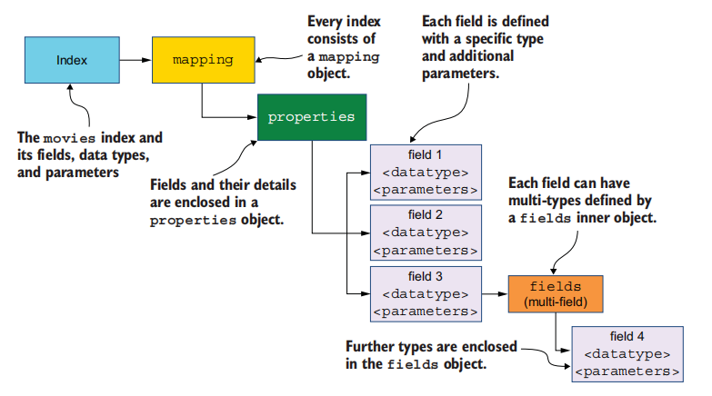
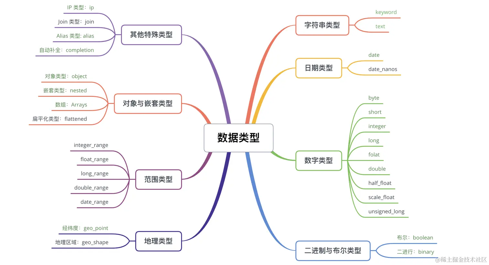

# Mapping

Mapping is a process of defining and developing a schema definition representing adocument’s data fields and their associated data types.  

Mapping 定义了数据模式（scheme，结构化数据），这有助于 ES 分析、搜索、排序、过滤、聚合数据。具体来说它定义了：

1. 索引中的文档有哪些字段及其类型
2. 各个字段的相关设置

如果在第一个文档进行索引时， 索引不存在，Elasticsearch 会动态地推导和确定字段的数据类型，并为我们创建 Mapping。 如果 JSON 文档中的值以 yyyy-MM-dd 或 yyyy/MM/dd 格式提供，Elasticsearch 可以推断字段是一个日期类型。如果想要禁用自动创建索引的特性，需要设置 `action.auto_create_index`：

~~~json
PUT _cluster/settings
{
    "persistent": {
        "action.auto_create_index": "false"
    }
}
~~~

而且如果写入文档中的某个字段在 Mapping 预定字段中不存在时，也会自动创建这个字段，官方把这种功能称为 **Dynamic Mapping**。我们可以禁用这项功能：

~~~bash
PUT books/_mapping
{
    "dynamic": "false"
}
~~~

dynamic 属性的取值：

- **true**（默认值）：一旦有新的字段写入，Mapping 也同时被更新
- **false**：Mapping 不会被更新，新的字段不会被索引（查询、聚合），但是新增的字段数据会出现在 _source 里。可以通过 Reindex API 将这些字段迁移到到新索引中，从而这些新增字段可以被索引到
- **runtime**：...
- **strict**：如果写入不存在的字段，文档数据写入会失败

我们可以通过 create index API 或者 _mapping 端点来显式创建一个 Mapping。在创建完 Mapping 后，还可以继续调用 create index API / PUT _mapping 来向 Mapping 增量添加新的字段。但是不允许修改现有字段的类型，也不能删除现有字段。

~~~json
// 使用 create index API
PUT movies
{
    "mappings": {
        "properties": {
            // 创建一个类型为 text 的、名为 title 的字段
            "title":{		
                "type": "text"
            }
        }
    }
}

// PUT 到 _mapping 端点
PUT movies/_mapping
{
    "properties":{
        "release_date":{
            "type":"date",
            "format":"dd-mm-yyyy"
        }
    }
}
~~~

有时候所要写入的字段的类型与 Mapping 中定义的字段的类型不一致，那么 ES 会尝试进行类型转换。

注意：文本类型默认不支持排序，如果我们想要对其进行排序，那么可以在定义 Mapping 时，将 fielddata 设置为 true。但是启用 fielddata 会导致昂贵的计算，可能会导致集群性能问题。 

~~~json
PUT students_with_fielddata_setting
{
    "mappings": {
        "properties": {
            "age": {
                "type": "text",
                "fielddata": true
            }
        }
    }
}
~~~

## 数据类型

Mapping 支持的数据类型有：

- 字符串类型有

  - `text`：表示一段文本

  - `keyword` ：与 text 类似，但它不会被分词处理的，一般用于存储身份证号、邮箱等

  - `constant_keyword`：在所有文档中，该字段值都是相同的。因此将 PUT 文档时，无需再指明该字段了。

- `date`：由于 JSON 没有日期类型，所以将符合特定格式的字符串（例如 2015-01-01" 或者 "2015/01/01 12:10:30"）解释为日期。我们也可以通过 format 字段来指定日期的解读格式

  ~~~json
  "properties": {
      "departure_date_time":{
          "type": "date",
          // 通过 format 字段来指定日期的解读格式
          "format": "dd-MM-yyyy||dd-MM-yy"
          // "format": "epoch_millis"		时间戳
          // "format": "epoch_second"
      }
  }
  ~~~

  实际上，在底层 ES 都会把日期类型转换为 UTC

- 数字类型分为 byte、short、integer、long、float、double、half_float、scaled_float、unsigned_long。

- Elasticsearch 提供各种范围数据类型， date_range, integer_range, float_range , ip_range。下面给出一个示例：

  ~~~json
  
  "properties": {
      "name":{
          "type": "text"
      },
      "training_dates":{
          "type": "date_range"
      }
  }
      
  
  
  PUT trainings/_doc/1
  {
      "name":"Java函数式编程",
      "training_dates":{
          "gte":"2021-08-07",		// 下限
          "lte":"2021-08-10"		// 上限
      }
  }
  ~~~

  ~~~json
  "properties": {
      "router_ip":{ "type": "ip" } 
  }
  
  GET networks/_search
  {
      "query":{
          "term": { 
              // IP 的范围查询
              "router_ip": { "value": "35.177.0.0/16" } 
          }
      }
  }
  ~~~

- 地理位置

  ~~~json
  "properties": {
      "address":{
          "type": "geo_point"
      }
  }
  
  PUT restaurants/_doc/1
  {
      "address":{
          "lon":"0.1278",
          "lat":"51.5074"
      }
  }
  
  GET restaurants/_search
  {
      "query": {
          // 通过 geo_bounding_box 来范围查询地理位置
          "geo_bounding_box":{
              "address":{
                  "top_left":{
                      "lon":"0",
                      "lat":"52"
                  },
                  "bottom_right":{
                      "lon":"1",
                      "lat":"50"
                  }
              }
          }
      }
  }
  ~~~

- 对象类型

  ~~~bash
  "mappings": {
      "properties": {
          "book_id" : {"type":"keyword" },
          "author": {
              "properties": {
                  "first_name": { "type": "keyword" },
                  "last_name": { "type": "keyword" }
               }
          }
      }
  }
  ~~~

  实际上，ES 在存储的时候会转化为以下格式存储：

  ~~~json
  {
    "book_id": "1234"
    "author.first": "zhang",
    "author.last": "san"
  }
  ~~~

- 数组，在索引查询时，会依次考察数组中的每个元素，而不是合并在一起在考察

  ~~~bash
  PUT books/_doc/3
  {
    "author": ["Neil Matthew","Richard Stones"],
  }
  ~~~

- `flattened`：本字段以及其子字段都不会被文本分析，避免性能损耗。扁平化字段的子字段始终是关键字类型。

  ~~~json
  "properties": {
      "patient_name":{
          "type": "text"
      },
      "doctor_notes":{
          "type": "flattened"
      }
  }
  
  PUT consultations/_doc/1
  {
      "patient_name":"约翰·多伊",
      "doctor_notes": {
          // 扁平化字段可以容纳任意数量的子字段
          // 这些字段都不会被分析
          // 
          "temperature": 103,
          "symptoms": ["发冷","发烧","头痛"],
          "history": "无",
          "medication": ["抗生素","扑热息痛"]
      }
  }
  ~~~

  

## 字段特性

Mapping 参数可以用来控制某个字段的特性，例如这个字段是否被索引、用什么分词器、空值是否可以被搜索到等。

- `index`：当某个字段不需要被索引和查询的时候，可以使用 index 参数进行控制

  ~~~json
  "properties": {
      "name": {
          "type": "text",
          "index": false # name 字段不进行索引操作
      },
  }
  ~~~
  
- `analyzer`：指定 analyzer，注意 search_analyzer 的优先级比 analyzer 的高

  ~~~bash
  "properties": {
  	"name": {
          "type": "text",
          "analyzer": "simple", 
          "search_analyzer": "standard" 
      }
  }
  ~~~
  
- `dynamic`：与 Dynamic Mapping 有关，它可以作用在不同嵌套级别的对象上：

  ~~~json
  "mappings": {
      // # 1，文档级别，表示文档不能动态添加 top 级别的字段
      "dynamic": "strict", 
      "properties": { 
          // # 2，author 对象继承了文档级别的设置。    
          "author": { 
              "properties": {
                  "address": { 
                      // # 3，表示 address 对象可以动态添加字段
                      "dynamic": "true", 
                      "properties":{}
                  },
                  "country": { "properties":{} }
              }
          }
      }
  }
  ~~~

- `null`：该参数允许使用特定值代替空值，以便它可以索引和搜索

  ~~~bash
  PUT null_value_index
  {
    "mappings": {
      "properties": {
        "email": {
          "type": "keyword",
          "null_value": "NULL" # 使用 "NULL" 代替 null 值
        }
      }
    }
  }
  ~~~

- `copy_to` 参数，允许用户聚合多个字段到目标字段

  ~~~bash
  # 创建索引
  PUT users
  {
    "mappings": {
      "properties": {
        "first_name": {
          "type": "text",
          "copy_to": "full_name" 
        },
        "last_name": {
          "type": "text",
          "copy_to": "full_name" 
        },
        "full_name": { "type": "text" }
      }
    }
  }
  
  # 插入数据
  PUT users/_doc/1
  {
    "first_name": "zhang",
    "last_name": "san"
  }
  
  # 查询
  GET users/_search
  {
    "query": {
      "match": {
        "full_name": {
          "query": "zhang san",
          "operator": "and"
        }
      }
    }
  }
  
  # 结果
  "_source" : {
  	"first_name" : "zhang",
  	"last_name" : "san"
  }
  ~~~
  
  需要注意的是，`copy_to` 创建的字段值并不会出现在 `_source` 字段中，因为 `_source` 字段只包含原始的 JSON 文档内容
  
- `doc_values`：除 `text` 类型外，其他类型 Doc values 默认是开启的，保存 Doc values 结构需要很大的空间开销，如果某个字段不需要排序、聚合、使用脚本访问，那么应该禁用此字段的 Doc values 来节省磁盘空间。

  

## 嵌套类型

在 ES 中，要描述一对多关系，可以通过 nested 、 join（Parent/Child） 这两种方式。

### nested 

nested 类型允许数组中的对象整体可以被单独索引，而不是对象的属性被单独索引，下面我们来看一个例子来认识这一点：

~~~bash
# 创建 Mapping
PUT books_index
{
  "mappings": {
    "properties": { 
      "book_id": { "type": "keyword" },
      "author": { 
        "properties": {
          "first_name": { "type": "keyword" },
          "last_name": { "type": "keyword" }
        }
      }
    }
  }
}

# 写入书本数据
PUT books_index/_doc/1
{
  "book_id": "1234",
  "author": [
    { "first_name": "zhang", "last_name": "san" },
    { "first_name": "wang", "last_name": "wu" }
  ]
}

GET books_index/_search
{
  "query": {
    "bool": {
      "must": [
        { "term": { "author.first_name": "zhang" } },
        { "term": { "author.last_name": "wu" } }
      ]
    }
  }
}
~~~

数据中是没有 zhangwu 这个作者的，但是这个查询却可以命中文档。这是因为 object 经扁平化处理后，其丢失了 first_name 和 last_name 之间的关系：

~~~bash
{
    "book_id": "1234",
    "author.first_name": ["zhang", "wang"],
    "author.last_name": ["san", "wu"]
}
~~~

所以我们的查询语句在 author.first_name 中匹配了 "zhang"，在 author.last_name 匹配了 "wu"。此时我们可以 nested 类型来避免这个问题：

~~~bash
# 创建索引，author 类型为 nested
PUT books_index
{
      # ...
      "author": { 
        "type": "nested", # author 定义为 nested 类型的对象
        "properties": {
          "first_name": { "type": "keyword" },
          "last_name": { "type": "keyword" }
        }
      }
}
~~~

nested 数据类型的检索示例如下：

~~~bash
GET books_index/_search
{
  "query": {
    "nested": { # 使用 nested 关键字
      "path": "author", # path 关键字指定对象名字
      "query": {
        "bool": {
          "must": [
            { "term": { "author.first_name": "zhang" } },
            { "term": { "author.last_name": "san" } }
          ]
        }
      }
    }
  }
}
~~~

### join

Elasticsearch 索引中的每个文档都是独立的。但是我们可以使用 join 数据类型来处理文档之间的父子关系。

~~~json
PUT doctors
{
    "mappings": {
        "properties": {
            // 声明了一个 join 类型的属性 relationship
            "relationship":{
                "type": "join",
                "relations": {
                    // 医生和患者之间是父子关系
                    "doctor":"patient"
                }
            }
        }
    }
}
~~~

创建父级文档：

~~~json
PUT doctors/_doc/1
{
    "name":"Dr. Mary Montgomery",
    "relationship":{
        "name": "doctor"		// 指明是父级
    }
}
~~~

创建子级文档：

~~~json
PUT doctors/_doc/3?routing=mary 
{
	"name" : "Mrs. Doe",
	"relationship" : {
    	"name": "patient",		// 指明是子级
    	"parent":1				// 指明父级文档的 ID
	}
}
~~~

这里我们设置了 `routing=mary`，表示父子文档都路由到同一个分片，以避免多分片搜索开销。

同时查询父子文档：

~~~json
GET doctors/_search
{
    "query": {
        // 通过 parent_id 来搜索查询
        "parent_id": {
            "type": "patient",
            "id":1
        }
    }
}
~~~

返回 ID 为 1 的 doctor 父文档，以及所有的 patient 子文档。
