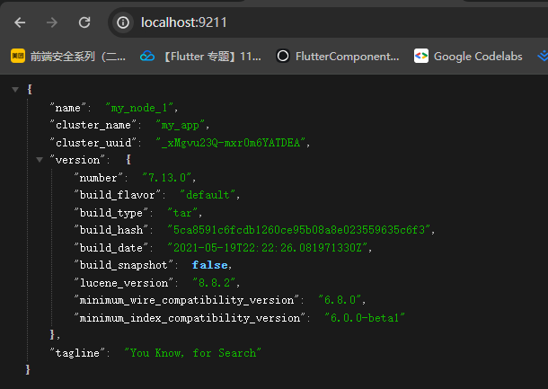
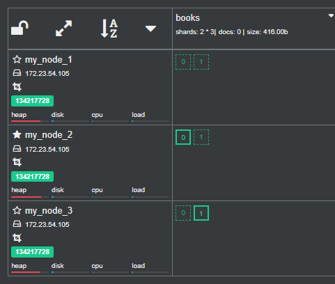
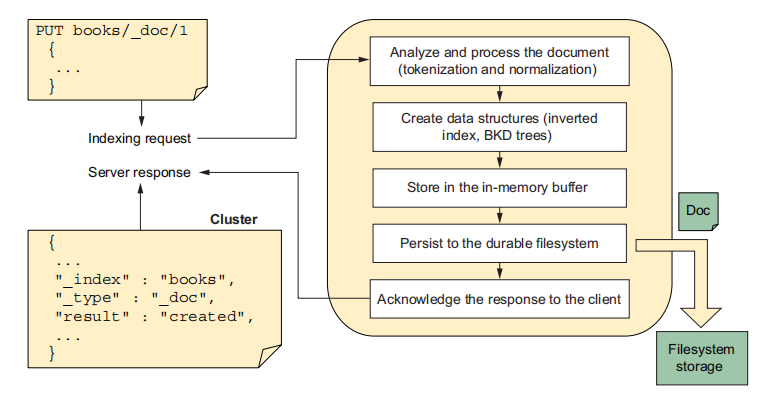

# 入门

[TOC]

**Elasticsearch 是一个分布式、RESTful 风格的搜索和数据分析引擎**。 它在 Apache Lucene 的基础上进行构建。支持对（非）结构化数据进行几乎实时的**搜索**和**分析**，可以做到高效地处理大量数据。

除了搜索领域外，Elasticsearch 与 Kibana、Logstash 组成的 ELK 系统还可以应用到日志采集、监控等领域。

## 安装

### ElasticSearch

~~~bash
wget https://artifacts.elastic.co/downloads/elasticsearch/elasticsearch-7.13.0-linux-x86_64.tar.gz
tar -xvf elasticsearch-7.13.0-linux-x86_64.tar.gz
mv elasticsearch-7.13.0 es_node1
~~~

关键的配置文件：

1. `elasticsearch.yml` 是用来配置 ES 服务的各种参数的
2.  `jvm.options` 主要保存 JVM 相关的配置。

`elasticsearch.yml`的主要内容：

~~~yaml
cluster.name: my_app
node.name: my_node_1
path.data: ./data
path.logs: ./logs
http.port: 9211
network.host: 0.0.0.0
discovery.seed_hosts: ["localhost"]
cluster.initial_master_nodes: ["my_node_1"]
~~~

- **discovery.seed_hosts**：指定初始主机节点列表。当有新的节点加入 Elasticsearch 集群时，`discovery.seed_hosts`列表中的节点，将帮助新节点找到并加入到现有的集群中。
- **cluster.initial_master_nodes**：用来设定哪些节点有资格被选举为主节点
- **network.host 和 http.port** 是 ES 提供服务的监听地址和端口

`jvm.options` 的主要内容：

~~~java
-Xms1g
-Xmx1g
~~~

- -Xms 和-Xmx 这两个 JVM 的参数必须配置为一样的数值。服务在启动的时候就分配好内存空间，避免运行时申请分配内存造成系统抖动。
- Xmx 不要超过机器内存的 50%，留下些内存供 JVM 堆外内存使用。
- 并且 Xmx 不要超过 32G。建议最大配置为 30G。接近 32G，可能会是 JVM 压缩指针的功能失效，导致性能下降。具体可以参考：[a-heap-of-trouble](https://link.juejin.cn/?target=https%3A%2F%2Fwww.elastic.co%2Fcn%2Fblog%2Fa-heap-of-trouble)。

启动es

~~~bash
bin/elasticsearch
# 后台运行
bin/elasticsearch -d
~~~

在浏览器中访问 localhost:9211，如果得到以下结果即运行成功。

如果报错：

~~~bash
bootstrap check failure [1] of [1]:
max virtual memory areas vm.max_map_count [65530] is too low, increase to at least [262144]
~~~

那么按以下指令修改：

~~~bash
sudo su
echo -e '\nvm.max_map_count=262144' >> /etc/sysctl.conf
sysctl -p
exit;
~~~

### Kibana

**Kibana 是官方的数据分析和可视化平台**

~~~bash
wget https://artifacts.elastic.co/downloads/kibana/kibana-7.13.0-linux-x86_64.tar.gz
tar -xvf kibana-7.13.0-linux-x86_64.tar.gz
mv kibana-7.13.0-linux-x86_64 kibana
~~~

修改配置：

~~~java
echo -e '\nserver.host: "0.0.0.0"' >> config/kibana.yml

echo -e '\nelasticsearch.hosts: ["http://localhost:9211"]' >> config/kibana.yml
~~~

运行：

~~~java
bin/kibana >> run.log 2>&1 &
~~~

在浏览器中访问 localhost:5601

可以使用 [Dev Tools](http://localhost:5601/app/dev_tools#/)  作为 ES 查询的调试工具

### Cerebro

[Cerebro](https://link.juejin.cn/?target=https%3A%2F%2Fgithub.com%2Flmenezes%2Fcerebro) 是一个简单的 ES 管理工具，其安装如下：

~~~bash
wget https://github.com/lmenezes/cerebro/releases/download/v0.9.4/cerebro-0.9.4.tgz

tar -xvf cerebro-0.9.4.tgz
mv cerebro-0.9.4 cerebro
~~~

配置指令

~~~bash
cd cerebro
sed -i 's/server.http.port = ${?CEREBRO_PORT}/server.http.port = 9800/g' conf/application.conf

echo -e '\nhosts = [
    {
        host = "http://localhost:9211"
        name = "my_app"
    }
]' >> conf/application.conf
~~~

配置完成后，运行以下指令启动 cerebo：

~~~bash
bin/cerebro >> run.log 2>&1 &
~~~

如果启动成功，在浏览器中访问 localhost:9800 即可访问 cerebro。

### 伪集群

这有一个脚本：https://gitee.com/dgl/es-booklet/blob/master/shells/InstallClusterEs.sh，可以方便的建立伪集群，供测试使用。

## 概念

### 集群层面

得益于分布式系统的架构设计，使得 ES 拥有高可用性和可扩展性。

单个 ES 的服务实例就是一个节点，节点类型有：

- **主节点（Master）**。主节点在整个集群是唯一的，它是从有资格进行选举的节点（Master Eligible）中选举出来。主节点主要负责管理集群变更、元数据的更改
- **数据节点（Data Node）**，负责保存数据，同时执行数据相关的操作，如：搜索、聚合、CURD 等
- **协调节点（Coordinating Node）**，接受客户端的请求，将请求路由到对应的节点进行处理，并且把最终结果汇总到一起返回给客户端。
- **预处理节点（Ingest Node）**，预处理操作允许在写入文档前通过定义好的一些 processors（处理器）和管道对数据进行转换。
- **部落节点（Tribe Node）**，在未来的版本中将会被弃用。
- **Hot & Warm Node**，在硬件资源好的机器中部署 Hot 类型的数据节点，而在硬件资源一般的机器上部署 Warm Node 节点。

**旧版本（7.8 及之前）各个节点类型的配置方式**：

| 节点类型          | 配置        | 默认值 |
| ----------------- | ----------- | ------ |
| Master Eligible   | node.master | true   |
| Data Node         | node.data   | true   |
| Ingest Node       | node.ingest | true   |
| Coordinating Node | 不需要配置  |        |

新版本的配置方式

~~~bash
node.roles: [ master, data ] //设置节点为 master 候选节点和数据节点
~~~

node.roles 的可选项如下：

- **master**，master 候选节点，master 将会从这些节点中选取出来。
- **voting_only**，参与 master 选举的节点，只有投票权限，没有选举权。
- **data**，数据节点。保存文档数据的 shard 将分配到 data 节点中保存。
- **data_content**，处理文档的 CRUD、数据搜索和聚合等。
- **data_hot**，会根据数据写入 ES 的时间存储时序数据，例如日志数据，data_hot 节点对数据读写要求快速，应当使用 SSD 存储。
- **data_warm**，data_warm 节点会存储不会经常更新但是仍然被查询的数据，相对于 data_hot，其查询的频率要低。
- **data_cold**，很少再被读取的数据可以存储在 data_cold，**此类节点的数据是只读的**。
- **data_frozen**，
- **ingest，** 预处理数据的节点。
- **ml，** 提供机器学习的功能，此类节点运行作业并处理机器学习 API 请求。
- **remote_cluster_client**，充当跨集群客户端并连接到其他集群。
- **transform**，运行 transforms 并处理 transform API 请求。

注意，每个节点本身就是一个协调节点。

**分片（Shard）**是 ES 底层基本的读写单元，分片是为了分割巨大的索引数据（简称索引），将读写操作分摊多台机器上，从而提高系统的吞吐量。

ES 将数据副本分为主从两类型：**主分片（primary shard）**和**副分片（replica shard）**。在写入的过程中，先写主分片，成功后并发写副分片，在数据恢复时以主分片为主。

可以在 Kibana 中运行下面指令，来设置索引的分片数量和副本数量：

~~~java
PUT books
{
  "mappings": {
    "properties": {
        // 为 book 这个文档定义 book_id 与 name 两个属性
        "book_id": {
          "type": "keyword"
        },
        "name": {
          "type": "text"
        }
      }
  },
  "settings": {
    "number_of_shards": 2,  // 定义了 2 个分片
    "number_of_replicas": 2  // 定义了每个分片 2 个副分片
  }
}
~~~

集群的健康状态有三种：

- **Green**，集群处于健康状态，所有的主分片和副本分片都正常运行。
- **Yellow**，所有的主分片都运行正常，但是有部分副本分片不正常
- **Red**，有部分主分片没有正常运行。

需要注意的是，每个索引也有这三种状态，如果索引丢失了一个副本分片，那么这个索引和集群的状态都变为 Yellow 状态，但是其他索引的的状态仍为 Green。

### 数据层面

#### 索引

**索引**是一种数据结构，它可以分为两种类型：

- 正排索引：描述「ID」到「实体文档」的关联关系

  

- 倒排索引：描述「词项」到「实体文档」的关联关系

  

在 ES 中，「索引」可以理解为一类文档的集合，而这些文档可以分布在不同的分片上。

下面是创建一个索引的示例：

~~~bash
# 创建一个索引
PUT books
{
  "mappings": {
  	# 为文档创建三个字段 book_id、name 以及 author
    "properties": {
      "book_id": {
        "type": "keyword"
      },
      "name": {
        "type": "text"
      },
      "author": { # 对象类型
        "properties": {
          "first": { "type": "text" },
          "last":  { "type": "text" }
        }
      }
    }
  }
}
~~~

实际上，我们也可以直接发送 HTTP 请求

~~~shell
curl -XPUT "http://localhost:9200/books"
-H 'Content-Type: application/json' -d
{
  "mappings": {
  	# ...
  }
}
~~~

具体流程见下图：

#### 文档

ES 是面向文档的，并且以文档为单位进行搜索的。文档以 JSON 格式进行序列化存储。每个文档都有任意个字段。每个字段都有指定的类型，常见的有：keyword、text、数字类型（integer、long、float、double等）、对象类型等。keyword 类型适合存储简短、结构化的字符串，例如产品 ID、产品名字等。而 text 类型的字段适合存储全文本数据，如短信内容、邮件内容等。

每个文档都有唯一的 ID。如果使用：`POST /books/_doc` 这样插入一个文档的话，ES 会自动生成唯一 ID，这样有利于数据均匀分散到各个分片。也可以使用 `POST /books/_doc/1` 来手动指定 ID。

~~~bash
# 我们指定了文档的 id 为1
POST /books/_doc/1
{
  "book_id":"123",
  "name":"linux 从入门到放弃"
}
~~~

#### 词项

将全文本的内容进行分词后，得到的词语就是词项了。

### 系统层面

ES 是一个近实时系统，我们写入的数据默认的情况下会在 1 秒后才能被查询到。

对于一个搜索引擎来说，对检索出来的数据进行排序是非常重要的功能。而排序以相关性指标作为依据。

## 文档的基本操作

文档基本操作接口有：

- **新建文档**，提供了索引文档（Index doc）和创建文档（create doc）两种方式。
- **通过文档 ID 获取文档**，通过 Get API 来获取文档内容。
- **批量获取文档**，使用 MGET API 来批量获取文档。
- **更新文档**，使用 Update API 来更新文档。
- **删除文档**，使用 Delete API 来删除文档。
- **批量操作文档**，使用 Bulk API 来批量操作文档。

下面我们一一介绍

~~~bash

~~~

使用 Create API 创建文档

~~~bash

~~~

| 语句                | 特性描述                                                     |
| ------------------- | ------------------------------------------------------------ |
| PUT books/_doc/1    | 使用 Index API 索引文档。如果文档存在，会先删除然后再写入，并且增加文档版本号，即有覆盖原内容的功能。 |
| PUT books/_create/2 | Create API 中使用 PUT 的方式创建文档，需要指定文档 ID。如果文档已经存在，则返回 http 409 错误。 |
| POST books/_doc     | Create API 中使用 POST 的方式，不需要指定文档 ID， 系统自动生成。 |

实际上，上面这三种创建方式都是用了 dynamic mapping 特性。更推荐使用 Mapping 来创建索引，之后会介绍这些东西。下面我们给出一个示例：

~~~shell
PUT books/_doc/1
{
  "book_id": "4ee82462",
  "name": "深入Linux内核架构",
  "author": "Wolfgang Mauerer",
  "intro": "内容全面深入，领略linux内核的无限风光。"
}

PUT books/_create/2 
{
  # ...
}

POST books/_doc
{
  # ...
}
~~~

 GET API 来获取文档内容

~~~jbashh
GET books/_doc/1
~~~

GET API 提供了多个查询参数

| 参数             | 简介                                                         |
| ---------------- | ------------------------------------------------------------ |
| preference       | 默认的情况下，GET API 会从多个副本中随机挑选一个，设置 preference 参数可以控制 GET 请求被路由到哪个分片上执行。 |
| realtime         | 控制 GET 请求是实时的还是准实时的，默认为 true。             |
| refresh          | 是否在执行 GET 操作前执行 refresh，默认为 false。            |
| routing          | 自定义 routing key。                                         |
| stored_fields    | 返回在 Mapping 中 store 设置为 true 的字段，而不是 _source。默认为 false。 |
| _source          | 指定是否返回 _source 的字段，或者设置某些需要返回的字段。    |
| _source_excludes | 不返回哪些字段，逗号分割的字符串列表。如果 _source 设置为 false，此参数会被忽略。 |
| _source_includes | 返回哪些字段，逗号分割的字符串列表。如果 _source 设置为 false，此参数会被忽略。 |
| version          | 指定版本号，如果获取的文档的版本号与指定的不一样，返回 http 409。 |

Search API 可以支持更加复杂的查询条件，在全文搜索中会详细介绍。

~~~bash
# 匹配所有文档
POST books/_search
{
  "query": {
    "match_all": {}
  }
}
~~~

MGET API  可以批量获取文档：

~~~bash
# 1：在 body 中指定 index
GET /_mget
{
  "docs": [
    { "_index": "books", "_id": "1" },
    { "_index": "books", "_id": "2" }
  ]
}

# 2：直接在 URL 中指定 index
GET /books/_doc/_mget
{
  "docs": [
    { "_id": "1" },
    { "_id": "2" }
  ]
}

# 3：简写形式
GET /books/_mget
{
  "ids" : ["1", "2"]
}
~~~

Update API 来更新文档信息

~~~bash
POST books/_update/2
{
  "doc": {
    "name":"时间简史（视频版）",
    "intro": "探索时间和空间核心秘密的引人入胜的视频故事。"
  }
}
~~~

索引文档的更新效果是先删除数据，然后再写入新数据。同时版本号也会相应地增加。

我们还可以使用 `update_by_query` 的方式来更新数据，它可以定制一条查询语句，针对满足这个查询条件的所有文档，进行统一的更新操作。

~~~bash
POST books/_update_by_query
{
  "query": {
    "term": {
      "book_id": {
        "value": "4ee82462"
      }
    }
  },
  "script": {
    "source": "ctx._source.name='深入Linux内核架构1'",
    "lang": "painless"
  }
}
~~~

通过`ctx._source`可以拿到匹配到的文档中的字段。如果 query 匹配到的文档数量巨大，推荐使用异步的方式进行处理（查询参数 `wait_for_completion` 为 false）：

~~~bash
POST books/_update_by_query?wait_for_completion=false
{
	// ...
}

# 结果：
{
  "task" : "R8Zd-p4GRXmBovdOQaOyqA:29677918"
}
~~~

异步的方式返回了一个 task id，然后可以用这个 task id 查询任务的执行情况：

~~~bash
GET /_tasks/R8Zd-p4GRXmBovdOQaOyqA:29677918
~~~

Delete API 来删除文档：

~~~bash
# 删除文档 2
DELETE books/_doc/2
~~~

还可以使用 Delete By Query API 进行查询删除。

~~~bash
POST /books/_delete_by_query
{
  "query": {
    "term": {
      "book_id": "4ee82462"
    }
  }
}
~~~

Bulk API 可以批量处理文档，它支持 4 种类型的操作：Index、Create、Update、Delete。它首先指定操作类型和元数据（索引、文档id等），紧接着的一行是这个操作的内容（如果有的话）

~~~bash
POST _bulk
{ "index" : { "_index" : "books", "_id" : "1" } }
{ "book_id": "4ee82462","name": "深入Linux内核架构","author": "Wolfgang Mauerer","intro": "内容全面深入，领略linux内核的无限风光。" }

{ "delete" : { "_index" : "books", "_id" : "2" } }

{ "create" : { "_index" : "books", "_id" : "3" } }
{ "book_id": "4ee82464","name": "深入Linux内核架构第三版","author": "Wolfgang Mauerer","intro": "内容全面深入，再次领略linux内核的无限风光。" }

{ "update" : {"_index" : "books", "_id" : "4"} } # 指定操作类型、索引、文档 id
{ "doc" : {"intro" : "书本的内容非常好，值得一看"} } # 指定文档内容
~~~

如果其中一条操作失败，并不会影响其他操作的执行。

## 全文搜索

ES 支持全文搜索的 API 主要有：

- **match**（匹配查询），可以处理全文本、精确字段
- **match phrase**（短语匹配），会将检索内容分词，这些词语必须全部出现在被检索内容中，并且顺序必须一致，默认情况下这些词都必须连续。
- **match phrase prefix**（短语前缀匹配），与 match phrase 类似，但最后一个词项会作为前缀，并且匹配这个词项开头的任何词语。
- **multi match**，通过 multi match 可以在多个字段上执行相同的查询语句。

匹配查询的示例：

~~~bash
POST books/_search
{
  "query": {
    "match": {
      "name": "linux architecture"
    }
  }
}
~~~

在 books 索引中，匹配这样一个文档，它的 name 字段出现 linux 或者 architecture 。

在进行全文本字段检索的时候， match API 提供了 operator 和 minimum_should_match 参数：

- **operator**，参数值可以为 "or" 或者 "and" 来控制检索词项间的关系，默认值为 "or"。
- **minimum_should_match**，可以指定词项的最少匹配个数，可以是具体的数字，也可以是百分比。当我们无法预估检索内容的词项数量时，一般设置为百分比

~~~bash
POST books/_search
{
  "query": {
    "match": {
      "name" : {
        "query": "Dive linux kernea architecture",
        "operator": "or",
        "minimum_should_match": "75%"
      }
    }
  }
}
~~~

短语匹配的示例：

~~~bash
POST books/_search
{
  "query": {
    "match_phrase": {
      "name": "linux kernel" # 换成 "linux architecture" 是无法匹配的
    }
  }
}
~~~

分词默认是必须连续的，我们可以使用 slop 参数来指定词项间的距离差值

~~~bash
POST books/_search
{
  "query": {
    "match_phrase": {
      "name": {
        "query": "linux architecture",
         "slop": 1
      }
    }
  }
}
~~~

短语前缀匹配的示例：

~~~bash
POST books/_search
{
  "query": {
    "match_phrase_prefix": {
      "name": {
        "query": "linux kerne",
         "max_expansions": 2
      }
    }
  }
}
~~~

可以使用 max_expansions 参数来控制每个分片的匹配数量，此参数默认值为 50。

multi-match API的示例：

~~~bash
GET /books/_search
{
  "query": {
    "multi_match": {
      "query": "linux architecture",
      "fields": ["nam*", "intro^2"]
    }
  }
}
~~~

fields 中的值既可以支持以通配符方式匹配文档的字段，又可以支持提升字段的权重。如 "nam*" 就是使用了通配符匹配的方式。而 "intro^2" 就是对书本简介字段（intro）的相关性评分乘以 2，其他字段不变。

**注意，只要在任一指定字段上匹配，文档就会被认为是匹配的。**

multi-match API 还提供了多种类型来设置其执行的方式：

- **best_fields**: 默认的类型，会执行 match 查询，并且返回所有与查询匹配的文档。将评分最高的字段的得分作为评分结果
- **most_fields**:  默认的类型，会执行 match 查询，并且返回所有与查询匹配的文档。将所有匹配字段的评分加起来作为评分结果。
- **phrase**: 在 fields 中的每个字段上均执行 match_phrase 查询，将评分最高的字段的得分作为评分结果
- **phrase_prefix**: 在 fields 中的字段上均执行 match_phrase_prefix 查询，将评分最高的字段的得分作为评分结果
- **cross_fields**
- **bool_prefix**：在每个字段上创建一个 [match_bool_prefix ](https://link.juejin.cn/?target=https%3A%2F%2Fwww.elastic.co%2Fguide%2Fen%2Felasticsearch%2Freference%2F7.13%2Fquery-dsl-match-bool-prefix-query.html)查询

可以使用 "type" 字段来指定这些类型，以 best_fields 为例，其示例如下：

~~~bash
# multi match API
GET /books/_search
{
  "query": {
    "multi_match": {
      "query": "linux architecture",
      "fields": ["name", "intro"],
      "type": "best_fields", # 指定对应的类型
      "tie_breaker": 0.3
    }
  }
}
~~~

当指定 "tie_breaker" 的时候，算分结果将会由以下算法来决定：
$$
评分最高的字段的得分 + 其他字段评分之和 * tie\_breaker
$$

## Term Query API

Term 是文本经过分词处理后得出来的词项，是 ES 中表达语义的最小单位。词项搜索与全文搜索之间的一个关键区别是，词项搜索不会对输入的检索内容进行分词，也就是说，Term Level Query 会将输入的内容（检索内容）会作为一个整体来进行检索。

注意，这里只不会对Term Query 中的检索内容进行分词，对文档内容仍进行分词处理。

示例：

~~~bash
POST books/_search
{
  "query": {
    "term": {
      "name": {
        "value": "Linux"
      }
    }
  }
}
~~~

再次强调，**基于 Term 的查询是不会对检索内容进行分词的，输入的文本会作为一个整体进行查询**（有点 match phrase 的味道）。所以如果要对 text 类型的字段进行搜索，推荐使用 match API 而不是 Term Query API。

`match`查询默认是不区分大小写的。而`term` 查询是大小写敏感的。

Terms Query 与 Term Query 类似，不过可以同时检索多个词项：

~~~bash
POST books/_search
{
  "query": {
    "terms": {
      "author": [ 
      	# 数组，可以指定多个作者的名字，只要有一个匹配上即可
        "Stephen Hawking",
        "Wolfgang Mauerer"
      ]
    }
  }
}
~~~

Range Query API 可以查询字段值符合某个范围的文档数据：

~~~bash
# 使用 Range Query 查询书本价格大于等于 10.0 小于 20.0 的书本
POST books/_search
{
  "query": {
    "range": {
      "price": {
        "gte": 10.0,
        "lt": 20.0
      }
    }
  }
}
~~~

- **gt**：表示大于
- **gte**: 表示大于或者等于
- **lt**: 表示小于
- **lte**: 表示小于或者等于

Exist Query API 可以查询那些在指定字段上有值的文档，以下的值被认为是空值：

- 字段的 JSON 值为 null 或者 []
- 一个字段在 Mapping 中设置了 "index" : false。
- 一个字段的值的长度超出了 Mapping 设置的 ignore_above 时。
- 当字段的值不合规，并且 Mapping 设置了 ignore_malformed 时。

~~~bash
# 查询出所有存在 "price" 字段的文档
POST books/_search
{
  "query": {
    "exists": {
      "field": "price"
    }
  }
}
~~~

Prefix Query 可以查询在指定字段中包含特定前缀的文档

~~~bash
# 使用 Prefix Query 查询含有 "linu" 前缀的文档
POST books/_search
{
  "query": {
    "prefix": {
      "name": {
        "value": "linu"
      }
    }
  }
}
~~~

需要注意的是，text 类型的字段会被分词，成为一个个的 term，所以这里前缀匹配的是这些 term！而不是整个 text 。下面的 Wildcard Query 同理。

Wildcard Query 允许使用通配符表达式进行匹配。Wildcard Query 支持两个通配符：

- ?，使用 ? 来匹配任意字符。
- *，使用 * 来匹配 0 或多个字符。

~~~bash
# 使用 Wildcard Query 查询书名中含有 "linu" 开头的文档
POST books/_search
{
  "query": {
    "wildcard": {
      "name": "linu*"
    }
  }
}
~~~

需要注意的是，Prefix Query 和 Wildcard Query 在进行查询时，需要扫描倒排索引中的词项列表，才能找到全部匹配的词项。因此要注意性能问题，要尽量避免使用左通配匹配模式，如 "*linux"、".*linux"。

使用 Term Level Query API 进行结构化搜索。结构化数据与 SQL 中的 Table 类似。一般我们会对结构化数据进行精确匹配，而精确匹配的结果为布尔值，这个时候可以考虑跳过相关性算分的步骤，从而提高搜索的性能。使用 Constant Score 可以将 query 转化为 filter，可以忽略相关性算分的环节，并且 filter 可以有效利用缓存，从而提高查询的性能。其示例如下：

~~~bash
# 使用 Range 查询，并且不进行相关性算分
POST /books/_search
{
  "query": {
    "constant_score": {
      "filter": {
        "range": {
          "price": {
            "gte": 10,
            "lte": 20
          }
        }
      }
    }
  }
}
~~~

`constant_score` 是一个查询包装器(Query Wrapper)，它的主要作用是将一个常量分数应用于查询结果

~~~json
"query": {
    "constant_score" : {
        "filter" : {
            "term" : { "user" : "kimchy"}
        },
        "boost" : 1.2
    }
}
~~~

这里先执行 `term` 查询，然后将匹配到的文档的得分设置为 1.2

## 组合查询

带有组合功能的 API 有：

- **Bool Query**
- **Boosting Query**
- **constant_score Query**
- **dis_max Query**
- **function_score Query**

Bool Query 透过组合多个查询子句和逻辑运算（如 AND、OR、NOT）构建更复杂的查询。其中查询子句有：

- **must**，所有在此数组中的查询都必须匹配，并且会进行相关性算分
- **filter**，所有在此数组中的查询都必须匹配，相关性算分是会被忽略的
- **should**，至少有一个在此数组中的查询要匹配，它有 minimum_should_match 参数，可以指定最少匹配的查询数量或者百分比。
- **must_not**， 所有在此数组中的查询都不得匹配

使用示例：

~~~bash
POST books/_search
{
  "query": {
    "bool": {
      "must": [
        {
          "term": {
            "author": {
              "value": "Wolfgang Mauerer"
            }
          }
        },
        {
          "term": {
            "date": {
              "value": "2010-06-01"
            }
          }
        }
      ]
    }
  }
}
~~~

Boosting Query 可以指定两个块：positive 块和 negative 块。在 negative 块中匹配的文档其相关性算分将会降低。相关性算分降低的程度将由 negative_boost 参数决定。

~~~bash
POST books/_search
{
  "query": {
    "boosting": {
      "positive": {
        "term": {
          "name": {
            "value": "linux"
          }
        }
      },
      "negative": {
        "term": {
          "name": {
            "value": "programming"
          }
        }
      },
      "negative_boost": 0.5
    }
  }
}
~~~

使用 Constant Score 可以将 query 转化为 filter，可以忽略相关性算分的环节，并且 filter 可以有效利用缓存，从而提高查询的性能。

~~~bash
"query": {
    "constant_score" : {
        "filter" : {
            "term" : { "user" : "kimchy"}
        },
        "boost" : 1.2
    }
}
~~~

`disjunction max query` 简称 dis_max，是分离最大化查询的意思：

- **disjunction**（分离）：把同一个文档中的每个字段上的查询都分开，分别进行算分操作。
- **max**（最大化）：是将多个字段查询的得分的最大值作为最终评分返回。

当指定 "tie_breaker" 的时候，算分结果将会由以下算法来决定：
$$
评分最高的字段的得分 + 其他字段评分之和 * tie\_breaker
$$

~~~bash
POST books/_search
{
  "query": {
    "dis_max": {
      "queries": [
        {
          "term": {
            "name": {
              "value": "linux"
            }
          }
        },
        {
          "term": {
            "intro": {
              "value": "kernel"
            }
          }
        }
      ],
      "tie_breaker": 0.9
    }
  }
}
~~~

`function_score Query` 允许在查询结束后，修改每一个匹配文档的相关性算分。`function_score Query` 提供了以下几种算分函数：

- **script_score**
- **weight**
- **random_score**：随机产生一个数值作为每个文档的得分
- **field_value_factor**：让某个字段参与计算分数
- **decay functions**：衰减函数，以某个字段的值为标准，距离指定值越近，算分就越高

下面将介绍 `field_value_factor` 和 `random_score` 这两个算分函数

`field_value_factor` 提供了以下几个参数选项：

- **field**：文档的字段。
- **factor**：用于乘以字段值，默认值为 1。
- **modifier**：修改最终值的函数，其值可以为：none、log、log1p、log2p、ln、ln1p、ln2p、square、 sqrt、reciprocal，默认为 none。

~~~bash
POST books/_search
{
  "query": {
    "function_score": {
      "query": {
        "term": {
          "name": {
            "value": "linux"
          }
        }
      },
      "field_value_factor": {
        "field": "price",
        "factor": 1.2,
        "modifier": "reciprocal",
        "missing": 1
      },
      "boost_mode": "multiply"
    }
  }
}
~~~

对于 boost_mode 参数，它的值有以下几种：

- **multiply**：算分与函数值的积，默认值。
- **replace**：使用函数值作为最终的算分结果。
- **sum**：算分与函数值的和。
- **avg**：算分与函数值的平均数。
- **min**：在算分与函数值中取最小值。
- **max**：在算分与函数值中取最大值。

random_score 算分函数的使用示例：

~~~bash
POST books/_search
{
  "query": {
    "function_score": {
      "random_score": {
        "seed": 81819,
        "field": "_seq_no"
      }
    }
  }
}
~~~

返回所有的文档，并每个文档的得分赋予一个随机值。

## Suggesters API

当用户在搜索框输入部分内容后，出现对应书本的推荐选项，让用户可以快速选择。

Suggesters 会将输入的文本（检索内容）分解为 token，然后在索引里查找相似的 Term。根据使用场景的不同，ES 提供了以下 4 种 Suggester：

- **Term Suggester**：基于单词的纠错补全。
- **Phrase Suggester**：基于短语的纠错补全。
- **Completion Suggester**：自动补全单词，输入词语的前半部分，自动补全单词。
- **Context Suggester**：基于上下文的补全提示，可以实现上下文感知推荐。

Term Suggester 提供了基于单词的纠错、补全功能，其工作原理是基于编辑距离（edit distance）来运作的，编辑距离的核心思想是一个词需要改变多少个字符就可以和另一个词一致。Term Suggester 工作的时候，会先将输入的文本切分为一个个单词（我们称这个为 token），然后对每个单词提供建议

~~~bash
# Term Suggester，"architture" 是错误的拼写，正确的是 "architecture"
POST books/_search
{
  "query": {
    "match": {
      "name": "kernel architture"
    }
  },
  
  "suggest": {
    "my_suggest": {
      "text": "kernel architture",
      "term": {
        "suggest_mode": "missing",
        "field": "name"
      }
    }
  }
}

# 返回的结果
{
  # ..
  "suggest" : {
    "my_suggest" : [
      {
        "text" : "kernel",
        "offset" : 0,
        "length" : 6,
        "options" : [ ]
      },
      {
        "text" : "architture",
        "offset" : 7,
        "length" : 10,
        "options" : [
          {
            "text" : "architecture",
            "score" : 0.8,
            "freq" : 1
          }
        ]
      }
    ]
  }
}
~~~

Term Suggester API 有很多参数：

- **text**：指定了需要产生建议的文本，一般是用户输入的内容
- **field**：指定从文档的哪个字段中获取建议
- **suggest_mode**：设置建议的模式
  - missing：如果索引中存在就不进行建议，默认的选项。
  - popular：推荐出现频率更高的词。
  - always：不管是否存在，都进行建议。
- **analyzer**：指定分词器来对输入文本进行分词
- **size**：为每个单词提供的最大建议数量。
- **sort**：建议结果排序的方式
  - score：先按相似性得分排序，然后按文档频率排序，最后按词项本身（字母顺序的等）排序。
  - frequency：先按文档频率排序，然后按相似性得分排序，最后按词项本身排序。

Term Suggester 产生的建议是基于每个单词的，可以使用 Phrase Suggester API 获取与用户输入文本相似的内容。

~~~bash
# Phrase Suggester 使用示例
POST books/_search
{
  
  "suggest": {
    "my_suggest": {
      "text": "Brief Hestory Of Tome",
      "phrase": {
        "field": "name",
        "highlight": {
          "pre_tag": "<em>",
          "post_tag": "</em>"
        }
      }
    }
  }
}

# 结果
{
  ......
  "suggest" : {
    "my_suggest" : [
      {
        ......
        "options" : [
          {
            "text" : "brief history of time",
            "highlighted" : "brief <em>history</em> of <em>time</em>",
            "score" : 0.030559132
          },
          {
            "text" : "brief history of tome",
            "highlighted" : "brief <em>history</em> of tome",
            "score" : 0.025060574
          },
          {
            "text" : "brief hestory of time",
            "highlighted" : "brief hestory of <em>time</em>",
            "score" : 0.0236486
          }
        ]
      }
    ]
  }
}
~~~

Phrase Suggester 的参数：

- max_error：指定最多可以拼写错误的词语的个数。
- confidence：如果用户输入的数据（短语）得分为 N，那么返回结果的得分需要大于 N * confidence。confidence 默认值为 1.0。
- highlight：高亮被修改后的词语。

Completion Suggester 提供了自动补全的功能，其应用场景是用户每输入一个字符就需要返回匹配的结果给用户。Completion Suggester 在工作时，会将 analyze 后的数据（将文本分词，并且去除没用的词语，例如 is、at这样的词语）进行编码，构建为 FST（**[finite-state transducer](https://link.juejin.cn/?target=https%3A%2F%2Fen.wikipedia.org%2Fwiki%2FFinite-state_transducer)**） 并且和索引存放在一起。FST 是一种高效的前缀查询索引。

在使用 Completion Suggester 前需要定义 Mapping，对应的字段需要指定 "completion" type

~~~bash
PUT books_completion
{
  "mappings": {
    "properties": {
		# ...
        "name_completion": {
          "type": "completion"
        },
		# ...
      }
  },
}

PUT books_completion/_doc/2
{
  # ...
  "name_completion": "A Brief History Of Time",
  # ...
}
~~~

~~~bash
POST books_completion/_search
{
  "suggest": {
    "my_suggest": {
      "prefix": "a brief hist",
      "completion": {
        "field": "name_completion"
      }
    }
  }
}

# 结果
{
  ......
  "suggest" : {
    "my_suggest" : [
      {
        "text" : "a brief hist",
        "offset" : 0,
        "length" : 12,
        "options" : [
          {
            "text" : "A Brief History Of Time",
            "_id" : "2",
            "_source" : {
              "book_id" : "4ee82463",
              "name_completion" : "A Brief History Of Time",
              ......
            }
          }
        ]
      }
    ]
  }
}
~~~

Context Suggester 是 Completion Suggester 的扩展，可以实现上下文感知推荐。例如当我们在编程类型的书籍中查询 "linu" 的时候，可以返回 linux 编程相关的书籍，但在人物自传类型的书籍中，将会返回 linus 的自传。 要实现这个功能，**需要在文档中加入分类信息**，帮助我们做精准推荐。

ES 支持两种类型的上下文：

- **Category**：任意字符串的分类。
- **Geo**：地理位置信息。

首先在 Mapping 中，为字段指定 context

~~~bash

# 导入测试数据
PUT books_context/_doc/4
{
  "book_id": "4ee82465",
  "name": "Linux Programming",
  "name_completion": {
    "input": ["Linux Programming"],
    "contexts": {
      "book_type": "program"
    }
  },
}PUT books_context
{
  "mappings": {
    "properties": {
    	# ...
    	"name_completion": {
          "type": "completion",
          "contexts": [
            {
              "name": "book_type",
              "type": "category"
            }  
          ]
        },
   # ...
  	}
 }
 
 # 导入测试数据
PUT books_context/_doc/4
{
  "name_completion": {
    "input": ["Linux Programming"],
    "contexts": {
      "book_type": "program"
    }
  },
}

PUT books_context/_doc/5
{
  "name_completion": {
    "input": ["Linus Autobiography"],
    "contexts": {
      "book_type": "autobiography"
    }
  },
}
~~~

~~~bash
POST books_context/_search
{
  
  "suggest": {
    "my_suggest": {
      "prefix": "linu",
      "completion": {
        "field": "name_completion",
        "contexts": {
          "book_type": "program"
        }
      }
    }
  }
}
~~~

## 聚合

ES 除了提供丰富的搜索功能外，也提供丰富的聚合计算 API。ES 中聚合的类型主要有以下 3 种：

- **Metric Aggregations**: 提供 sum（求总和）、average（求平均数） 等数学运算，可以对字段进行统计分析。
- **Bucket Aggregations**：对满足特定条件的文档进行分组
- **Pipeline Aggregations**：对其他聚合输出的结果进行再次聚合。

~~~json
# 聚合查询的语法
POST your_index/_search
{
  "aggs": { //和query 同级别的关键词
    "aggs_name1": { //自定义的聚合名字，会从聚合结果中返回
      "aggs_type": { //聚合的定义：聚合类型 + 聚合body
          aggs body
      },
      "aggs": { //子聚合
        "aggs_name": {
          "aggs_type": {
            aggs body
          }
        }
      }
    }，
      
    "aggs_name2": { //可以进行多个同级别的聚合查询，同级聚合查询之间是相互独立的。
        ......
    }
  },
  "size": 0 //建议设置为0，这样不会返回 _source
}
~~~

"aggs" 是与 "query" 同级的关键词。当它们一起使用时，aggs的作用就类似于 SQL 里的 where condition group by column。

**Metric Aggregations 分为单值分析和多值分析两类**：

- 单值分析：只输出一个分析结果的聚合操作，例如 min、max、sum、avg、cardinality
- 多值分析：会输出多个分析结果的聚合操作，例如：stats、extended_stats、percentiles、percentile ranks、top hits

~~~bash
# 一个请求里同时获取 最高售价、最低售价、平均售价
POST books/_search
{
  "aggs": {
    "most-expensive": {
      "max": { "field": "price" }
    },
    "cheapest": {
      "min": { "field": "price" }
    },
    "avg-price": {
      "avg": { "field": "price" }
    }
  },
  "size": 0
}

# 结果
{
  ......
  "aggregations" : {
    "cheapest" : { "value" : 9.9 },
    "avg-price" : { "value" : 15.471428571428572 },
    "most-expensive" : { "value" : 20.9 }
  }
}
~~~

通过 stat API，可以同时获取多个分析结果

~~~bash
# 使用 stat 查询 最高售价、最低售价、平均售价
POST books/_search
{
  "aggs": {
    "stat_price": {
      "stats": {
        "field": "price"
      }
    }
  },
  "size": 0
}

# 结果
{
  ......
  "aggregations" : {
    "stat_price" : {
      "count" : 7,
      "min" : 9.9,
      "max" : 20.9,
      "avg" : 15.471428571428572,
      "sum" : 108.3
    }
  }
}
~~~

 cardinality 聚合操作类似于 SQL 中的 distinct count：

~~~bash
# 统计出版社的数量
POST books/_search
{
  "aggs": {
    "cardinality_publisher": {
      "cardinality": {
        "field": "publisher"
      }
    }
  },
  "size": 0
}

# 结果
{
  ......
  "aggregations" : {
    "cardinality_publisher" : {
      "value" : 3
    }
  }
}
~~~

Bucket Aggregations 类似于  SQL 中的 Group By。ES 提供的 Bucket Aggregations 中常用的有以下几个：

- Terms：根据某个字段进行分组，例如根据出版社进行分组。
- Range、Data Range：根据用户指定的范围参数作为分组的依据来进行聚合操作。
- Histogram、Date Histogram：可以指定间隔区间来进行聚合操作。

Terms 使用示例：

~~~bash
POST books/_search
{
  "aggs": {
    "publisher_book_count": {
      "terms": {
        "field": "publisher",
        "size": 3 # 只返回聚合后前三组的结果。
      }
    }
  },
  "size": 0
}

# 结果
{
  ......
  "aggregations" : {
    "publisher_book_count" : {
      "doc_count_error_upper_bound" : 0,
      "sum_other_doc_count" : 0,
      "buckets" : [
        { "key" : "linux publisher", "doc_count" : 3 },
        { "key" : "autobiography publisher", "doc_count" : 2 },
        { "key" : "science publisher", "doc_count" : 2 }
      ]
    }
  }
}
~~~

- "key" 是每个分组字段的值
- "doc_count" 是这个分组中文档的数量

由于算法实现，Terms 聚合统计结果可能会不准确。而"doc_count_error_upper_bound" 和 "sum_other_doc_count"，正是对本次聚合结果的评估指标：

- doc_count_error_upper_bound：在每个分桶中，可能遗漏文档数量之和。
- sum_other_doc_count：表示在此次聚合中没有统计到的文档数量。

~~~bash
# 价格区间统计
POST books/_search
{
  "aggs": {
    "price_range": {
      "range": {
        "field": "price",
        "keyed": true, 
        "ranges": [
          { "key": "cheap", "from": 0.0, "to": 10.0 },
          { "key": "average", "from": 10.0, "to": 20.0 },
          { "key": "expensive", "from": 20.0, "to": 30.0 }
        ]
      }
    }
  },
  "size": 0
}

# 结果
{
  ......
  "aggregations" : {
    "price_range" : {
      "buckets" : {
        "cheap" : { "from" : 0.0, "to" : 10.0, "doc_count" : 1 },
        "average" : { "from" : 10.0, "to" : 20.0, "doc_count" : 5 },
        "expensive" : { "from" : 20.0, "to" : 30.0, "doc_count" : 1 }
      }
    }
  }
}
~~~

- "keyed": true 使得我们可以对每个区间进行命名，否则以区间来命名 key

Histogram Aggregation 也可以对区间进行分组，但这个区间是固定间隔的：

~~~bash
# 使用 Histogram Aggregation
POST books/_search
{
  "aggs": {
    "price_histogram": {
      "histogram": {
        "field": "price",
        "interval": 10
      }
    }
  },
  "size": 0
}

# 结果
{
  "aggregations" : {
    "price_histogram" : {
      "buckets" : [
        { "key" : 0.0, "doc_count" : 1 },
        { "key" : 10.0, "doc_count" : 5 },
        { "key" : 20.0, "doc_count" : 1 }
      ]
    }
  }
}
~~~

我们来看一下子聚合的使用示例，先考虑父聚合，再考虑子聚合。

~~~bash
# 使用子聚合 组合 Terms Aggregation 和 Sum Aggregation 
POST books/_search
{
  "aggs": {
    "publisher_sales_total": {
      "terms": { "field": "publisher" },
      "aggs": {
        "sales_total": {
          "sum": { "field": "sales" }
        }
      }
    }
  },
  "size": 0
}

# 结果
{
  ......
  "aggregations" : {
    "publisher_sales_total" : {
      "doc_count_error_upper_bound" : 0,
      "sum_other_doc_count" : 0,
      "buckets" : [
        {
          "key" : "linux publisher",
          "doc_count" : 3,
          "sales_total" : { "value" : 400.0 }
        },
        {
          "key" : "autobiography publisher",
          "doc_count" : 2,
          "sales_total" : { "value" : 5140.0 }
        },
        {
          "key" : "science publisher",
          "doc_count" : 2,
          "sales_total" : { "value" : 19800.0 }
        }
      ]
    }
  }
}
~~~

Pipeline Aggregations 可以对其他聚合输出的结果进行再次聚合

~~~bash
POST books/_search
{
  "aggs": {
    "publisher": {
      "terms": {
        "field": "publisher",
        "size": 2,
        "order": { "sales_total": "desc" }
      },
      "aggs": {
        "sales_total": {
          "sum": { "field": "sales" }
        },
        "avg_price": {
          "avg": { "field": "price" }
        }
      }
    },
    "min_avg_price": {
      "min_bucket": {
        "buckets_path": "publisher>avg_price"
      }
    }
  },
  "size": 0
}

# 结果
{
  "aggregations" : {
    "publisher" : { ...... },
    "min_avg_price" : {
      "value" : 14.399999999999999,
      "keys" : [ "science publisher" ]
    }
  }
}
~~~

- "min_avg_price" 是我们指定的名字
- "min_bucket" 求出之前结果的最小值
-  "buckets_path" 关键字来指定路径，例子中我们的路径为 "publisher" 下的 "avg_price"。
