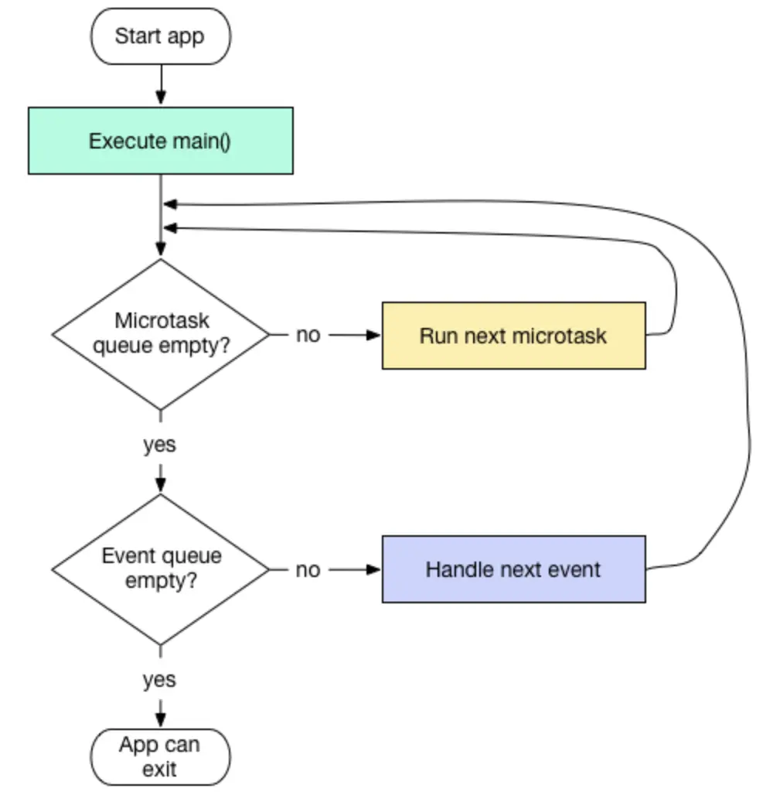

# Dart

[TOC]

## 类型系统

- final变量是在运行时执行初始化，并且状态在运行时不可更改
- const变量是在编译期执行初始化，并且状态在运行时不可更改

~~~dart
var foo = const [];
final bar = const [];
const baz = []; // Equivalent to `const []`
~~~

在 **常量上下文** 场景中，可以省略掉构造函数或字面量前的 `const` 关键字：

~~~dart
const pointAndLine = const {
  'point': const [const ImmutablePoint(0, 0)],
  'line': const [const ImmutablePoint(1, 10), const ImmutablePoint(-2, 11)],
};

const pointAndLine = {
  'point': [ImmutablePoint(0, 0)],
  'line': [ImmutablePoint(1, 10), ImmutablePoint(-2, 11)],
};
~~~


var 关键字根据初始化表达式来自动推断类型。如果没有初始化表达式，那么推断为 dynamic。同时在函数参数列表中没有类型，那么认为是 dynamic。

```
void f(a, b) {}		//type of a and b is dynamic 
```

而 dynamic 相当于 C 语言中的 void * 指针，可以存储任何类型的值


Dart 的语义分析会在使用一个已声明为非空类型的变量前，检查它是否已经被赋值。有时这个分析会失败，可以使用使用 `late` 修饰来解决这个问题

~~~dart
late String description;

void main() {
  description = 'Feijoada!';
  print(description);
}
~~~

若 `late` 标记的变量在使用前没有初始化，在变量被使用时会抛出运行时异常。

~~~dart
late int i;
void main() {
  print(i != null);		//Uncaught Error: LateInitializationError: Field 'i' has not been initialized.
}
~~~

如果一个 `late` 修饰的变量在声明时就指定了初始化方法，那么它实际的初始化过程会发生在第一次被使用的时候


若你想让变量可以赋值为 `null`，只需要在类型声明后加上 `?`：

~~~dart
int? aNullableInt = null;
~~~


`..` 是级联运算符，它用于在同一个对象上进行一系列的操作。

~~~dart
Bike() // 创建一个 Bike 对象
    ..brand = 'Giant' 	//设置 Bike 的 brand 属性
    ..paint('red') 		//调用 Bike 的 paint 方法
    ..ride(); 			//调用 Bike  的 ride 方法
~~~


## 控制流

~~~dart
for (var i = 0; i < 5; i++) {
  message.write('!');
}

for (final c in callbacks) {
  c();
}

~~~


~~~dart
final myList = [  1,  2,  if (condition)    3];
final myList = [1,2,if (condition) 3 else 4];
final myList = [1,2,condition ? 3 : 4];
~~~

~~~dart
final myList = [
  1,
  2,
  for (final num in numbers)
    num
];
~~~


## 异常

~~~dart
try {
    
} on IOException catch (e) {
   
} finally {
    
}
~~~


## 函数

- **Positional**: The position of an argument determines which parameter receives the value

  ~~~dart
  void add(a, b) {
  	print(a + b); 
  }
  add(5, 10); 
  ~~~

- **Named**: The name of an argument determines which parameter receives the value

  ~~~dart
  void add({a, b}) { 
  	print(a + b);
  }
  add(b: 5, a: 10);
  ~~~


Positional arguments can be made optional by wrapping them with square brackets (`[]`):

```dart
void add(a, [b])
```

Once a parameter is optional, you can also assign a **default value** to it

~~~dart
void add(a, [b = 5])
~~~


Default values can also be assigned to named parameters - which are optional by default:

```dart
void add({a, b = 5})
```

You can also make named parameters required by using the built-in `required` keyword:

```dart
void add({required a, required b})
```

如果混用 named 与 position 特性，那么 named 放在参数列表的最后面：

```dart
void add(c, {a, b})
```

## 异步

Dart的事件循环中有两个队列

- **微任务队列（MicroTask queue）**
- **事件队列（Event queue）**



总之，每次事件循环中，**一次性处理完**微任务队列，但**只处理一个**在事件队列中的任务

`scheduleMicrotask`将任务提交到微任务队列中

~~~dart
scheduleMicrotask((){
    print('a microtask');
});
~~~

`Timer.run`将任务提交到事件队列中

~~~dart
Timer.run((){
   print('a event loop’);
});
~~~

`Future((){ });`、`Future.delayed`都是将任务提交到事件队列中


使用 `async` 和 `await` 关键字可以避免回调地狱 (Callback Hell) ，并使代码更具可读性：

~~~dart
Future<void> printWithDelay(String message) async {
  await Future.delayed(oneSecond);
  print(message);
}

Future<void> printWithDelay(String message) {
  return Future.delayed(oneSecond).then((_) {
    print(message);
  });
}
~~~

如果直接 `printWithDelay("Hello")`，那么它提交到微任务队列中，不会立即执行该函数，并直接返回一个 Future 对象。如果是`await printWithDelay("Hello")`，那么当前代码等待函数执行完成，而且 `await` 表达式将自动从 `Future` 对象提取出对应的结果。注意，当前代码会打包成微任务，然后提交到队列中

## 类

在 Dart 中，以下划线 `_` 开头的函数名或者字段名，都是私有的。


- 组成单元：普通类，`abstract`抽象类、`mixin`。
- 关系连接：`implements`实现、`extends`继承、`with`混入。

抽象类：

- 抽象类通过 abstract 关键字来定义
- 没有方法体的方法称为抽象方法
- 抽象类不能被实例化

implements：

- 允许后面接上多个普通或者抽象类
- 使用`B implement A`修饰时，那么`A`中的所有的属性和方法都要在`B`中实现，无论它原来是抽象方法还是普通方法。


`mixin` 和`abstract`类似，该类可以拥有成员变量、普通方法、抽象方法，但是不可以实例化

~~~dart
mixin DrawFunc {
  String content = '..';
  String what();
    
  void draw() {
    print('I can draw ${what()}');  
  }
}

class Teacher with DrawFunc {
  String what() => "car";
}

void main() {
  Teacher().draw();
}
~~~

可以通过 on 来限制可以混入的类型：

~~~dart
mixin SingFunc on Person, DrawFunc {
   	// ...
}
~~~


命名冲突的情况：

- `with`修饰的会覆盖`extends`中修饰的同名方法。
- `with`列表中后一个的会覆盖之前的。

### 构造函数

Dart构造函数有4种格式：

- `ClassName(...) //普通构造函数`
- `Classname.identifier(...) //命名构造函数`
- `const ClassName(...) //常量构造函数`
- `factroy ClassName(...) //工厂构造函数`


普通构造函数：

~~~dart
class Student {
  int age = 0;
  int id = 0;

  Point(int age, int id) {
    this.age = age;
    this.id = id;
  }
}
~~~


命名构造函数：

~~~dart
class Student {
    int age = 0;
    int id = 0;
    Student.fromJson(Map data) {

    }
}

var student = Student.fromJson(...)
~~~


工厂函数与普通构造函数唯一区别就是，它要求返回一个该类型的对象。

~~~dart
class Student {
    factory Student(String name) {
        return Student(...)
    }

    factory Student.fromJson(Map<String, Object> json) {
        return Student(...);
    }
}
~~~


常量构造函数的条件是比较苛刻的：

- 以 const 关键字修饰
- 成员变量都是 final 的
- 不能有函数体

如果常量函数在非常量上下文中使用，它将创建一个普通的实例。否则创建一个编译时常量，此时参数必须是常量

~~~dart
final size = 12.0;
const Text(			// 显式使用 const 函数
  "Hello",
  style: TextStyle(
    fontSize: size,    // error
  ),
)
~~~


构造函数的执行顺序：

1. 调用初始化列表
2. 调用父类的构造函数
3. 调用自己的构造函数


如果父类没有默认的无参构造函数，则需要通过 `super` 来手动指定父类的构造函数。

不能在构造函数方法体中初始化 final 成员，而可以在初始化列表中初始化 final 成员。


语法糖：

~~~dart
const StyledText(this.text, {super.key});

// 等价于
const StyledText(text) text = text, super(key : key);
~~~


### 字段

const 成员必须为 static 的

```dart
static const Alignment topLeft = Alignment(-1.0, -1.0);
```


getter、setter 是 getXXX、setXXX 的语法糖

~~~dart
class A {
    final int _data = 0;
    
    int getData() {
        return _data;
    }
}

class A {
    final int _data = 0;
    
   	int get data {
        return _data;
    }
}
~~~


