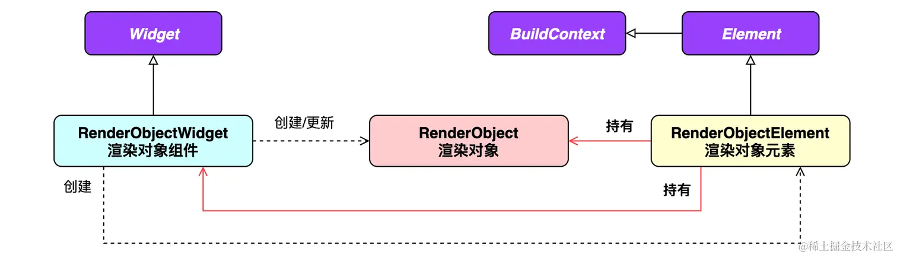
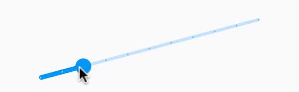
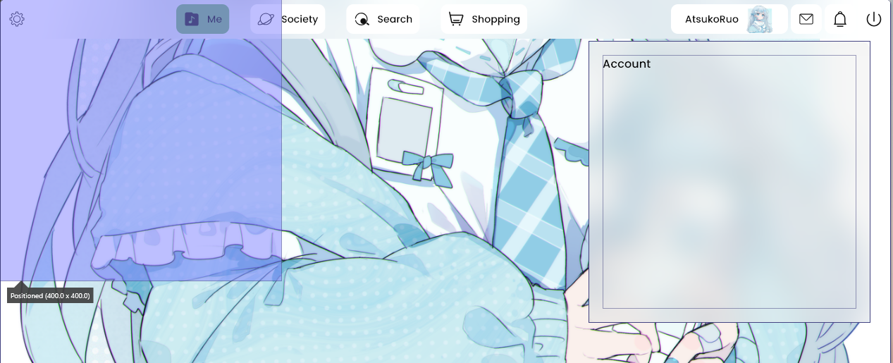
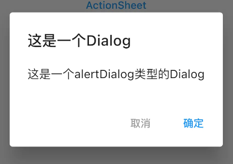
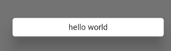
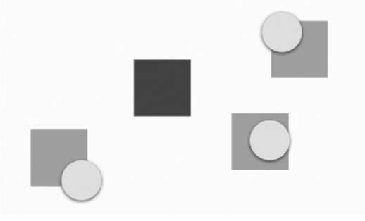
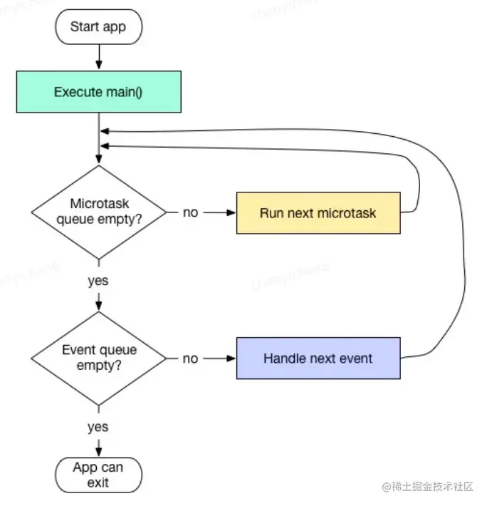

# 功能型组件

[TOC]

## 媒体查询

MediaQuery 是一个帮助开发者获取设备信息的继承式组件（InheritedWidget）。例如是否为横屏状态、是否开启了夜间模式、是否在系统偏好里设置了较大的字号等。

|             查询             |        属性        |
| :--------------------------: | :----------------: |
|       屏幕的宽度和高度       |        size        |
|        是横屏还是竖屏        |    orientation     |
|       是否开启夜间模式       | platformBrightness |
| 设备的交互方式（触屏、手柄） |   navigationMode   |
|    是否调整了默认字体大小    |  textScaleFactor   |

## Builder

Builder 与 StatefulBuilder 是为了解决获取局部 context 的问题。此外 StatefulBuilder 还可以实现局部刷新（控制刷新范围）。

下面我们通过一个例子来学习Builder组件：

~~~dart
void main() => runApp(CustomWidget());

class CustomWidget extends StatelessWidget {
    @Override
    Widget build(BuildContext context) {
        return MaterialApp(
          home: Scaffold(
            body: GestureDetector(
              onTap: () {
                Scaffold.of(context).showSnackBar(SnackBar(
                  content: Text(''),
                ));
              },
              child : child,
            )
          )
       );    
    }
}
~~~

运行后直接抛出了异常。这是因为 context 是 CustomWidget 的，而不是GestureDetector 的。所以 Scaffold.of 无法通过 context 获取到 Scaffold 组件。为了解决这个问题，我们引入 Builder 组件，通过它可以获取局部 context：

~~~diff
class CustomWidget extends StatelessWidget {
  @override
  Widget build(BuildContext context) {
    return MaterialApp(
        home: Scaffold(
+            body: Builder(
+                builder : (context) {
                  return GestureDetector(
                    onTap: () {
                      Scaffold.of(context).showSnackBar(SnackBar(
                        content: Text(''),
                      ));
                    },
                    child : null,
                  );
                }
            )
        )
    );
  }
}
~~~

StatefulBuilder 的作用与 Builder 类似，但是它还可以局部刷新 UI。在不考虑复用性的前提下，可以代替 StatefulWidget：

~~~dart
body: Center(
    child: StatefulBuilder(
        builder: (BuildContext context, StateSetter setState) {
            return Text("clickTimes$clickTimes").gesture(onTap: () {
              setState(() {
                clickTimes++;
              });
            });
        },
    ),
),
~~~


## 悬浮

### Overlay

有时候，我们想要将`Overlay`相对定位于某个组件上，此时我们必须获取这个组件相对屏幕左上角的偏移量，以及组件的尺寸。

- `renderObject.size`获取尺寸
- `renderObject.localToGlobal(Offset.zero)`来获取相对屏幕左上角的偏移量。


可以通过`Element`类中的`renderObject`方法直接获取渲染对象。`Flutter`框架在`Widget`层中通过`BuildContext`接口来暴露`Element`对象，其中`BuildContext` 定义了 `findRenderObject` 接口，`Element`对该接口的实现就是直接返回`renderObject`。




~~~dart
void printInfo(BuildContext context){
  RenderObject? renderObject = context.findRenderObject();
  if(renderObject != null && renderObject is RenderBox){
    // 获取尺寸
    print(renderObject.size);
    // 获取相对屏幕左上角的偏移量
    print(renderObject.localToGlobal(Offset.zero));
  }
}
~~~

如何获取指定组件的`context`，而不是当前`StatelessWidget#build`的`context`参数呢？通过`Builder`组件

~~~dart
Widget build(BuildContext context) {
    return Builder(
      builder: (BuildContext ctx) => {
           RenderBox? renderObject = ctx.findRenderObject() as RenderBox;
           renderObject!.size
           renderObject!.localToGlobal(Offset.zero)
           return Widget(...) 
      	}
    )
}
~~~

一般没有必要直接使用 `Overlay` 组件，因为 `MaterialApp` 中已经集成了 `Overlay` 。我们只需要获取到 `OverlayState` ，然后插入 `OverlayEntry` 节点即可显示浮动组件。

~~~dart
final OverlayState? overlayState = Overlay.of(context);
final entry = OverlayEntry(
	builder : (context) => Container(...)
)
overlayState.insert(entry);
entry.remove()			// 移除该 OverlayEntry
~~~

这里要注意：

- `OverlayEntry#builder` 下的约束是紧约束 ，一般大小为整个屏幕大小
- `Positioned` 可以作为 `builder` 所返回的顶层组件，从而实现相对定位

有时候插入 overlayState 时会报错`Unhandled Exception: setState() or markNeedsBuild() called during build.`此时我们只需这样插入即可：

~~~dart
WidgetsBinding.instance.addPostFrameCallback((_) {
    overlayState?.insert(entry);
    window.scheduleFrame(); 	// 强制刷新一帧
});
~~~

可以通过 CompositedFollower 解决 OverlayEntry 不跟随父组件移动的问题：

### CompositedTransform Target/Follower

`CompositedTransformFollower`组件追踪`CompositedTransformTarget`的位置。

使用时，必须设置`CompositedTransformTarget`组件的`link`属性，其类型为`LayerLink`。当追随者和目标使用同一个`LayerLink`时，追随者会被位移至目标处。这里需要注意的是，“目标”必须在“追随者”之前绘制，否则会导致运行时错误。

~~~dart
const CompositedTransformFollower({
    super.key,
    required this.link,
    this.showWhenUnlinked = true,
    this.offset = Offset.zero,
    this.targetAnchor = Alignment.topLeft,
    this.followerAnchor = Alignment.topLeft,
    super.child,
});
~~~

- `offset`：用于为追随者组件增加额外的位移
- `showWhenUnlinked`：决定是否应继续显示该追随者。默认值为 true，即追随者仍然可见，但不会再有位移。若修改为 false，则当目标不可见时，追随者也会随之被暂时隐藏，直到目标再次出现
- `targetAnchor`、`followerAnchor`：定义跟随的定位点，这样我们就不用像 Overlay 那样手动计算偏移量了。


Transform 作用于 CompositedTransformTarget 后，同时也将 CompositedTransformFollower 做相应的变换。




下面看一个例子：

~~~dart
// 在执行动画时，禁止响应任何事件。
// 在登录时，禁止响应任何事件。
bool isLock = false;

class _UserInfoState extends State<UserInfo> {
    final LayerLink _userInfoLayerLink = LayerLink();
    OverlayEntry? _overlayEntry;
    final GlobalKey<_UserLoginPanelState> _userLoginPanelStateKey =
        GlobalKey<_UserLoginPanelState>();
    bool isOpen = false;  // Overlay 是否打开

    // 用户点击时的回调事件
    Future<void> handleOverlay(BuildContext context) async {
        const LOGIN_PANEL_WIDTH = 400.0;
        const LOGIN_PANEL_HEIGHT = 400.0;

        if (isOpen) {
            isOpen = false;
            await _userLoginPanelStateKey!.currentState!.cancel();
            hideOverlay();
        } else {
            isOpen = true;
            showOverlay(
                UserLoginPanel(
                    key: _userLoginPanelStateKey, onDismissed: () => hideOverlay()),
                context,
                LOGIN_PANEL_WIDTH,
                LOGIN_PANEL_HEIGHT);
        }
    }

    void hideOverlay() {
        _overlayEntry?.remove();
        _overlayEntry = null;
    }

    void showOverlay(
        Widget child, BuildContext context, double width, double height) {
        RenderObject? renderObject = context.findRenderObject();
        if (renderObject == null || !(renderObject is RenderBox)) {
            return;
        }
        var size = renderObject.size;
        var offset = renderObject.localToGlobal(Offset.zero);
        _overlayEntry = OverlayEntry(
            // 这里使用 Positioned 来限制 Overlay 的大小
            // 并没有设置 Positioned 的偏移量，而是通过 CompositedTransformFollower 中的锚点来决定 Overlay 的偏移量。
            builder: (context) => Positioned(
                height: height,
                width: width,
                child: CompositedTransformFollower(
                    offset: Offset(0, 10.0),
                    targetAnchor: Alignment.bottomCenter,
                    followerAnchor: Alignment.topCenter,
                    link: _userInfoLayerLink,
                    child: child),
            ),
        );

        final overlay = Overlay.of(context);
        overlay.insert(_overlayEntry!);
    }

    Widget build(BuildContext context) {
        onTap: () {
            if (!isLock) {
                handleOverlay(context);
            }
        },
    }
}


class UserLoginPanel extends StatefulWidget {
    final VoidCallback onDismissed;

    const UserLoginPanel({super.key, required this.onDismissed});

    @override
    State<StatefulWidget> createState() => _UserLoginPanelState();
}

class _UserLoginPanelState extends State<UserLoginPanel>
    with SingleTickerProviderStateMixin {
    late AnimationController _controller;
    late Animation _animation;

    @override
    void initState() {
        super.initState();

        _controller = AnimationController(
            vsync: this,
            duration: const Duration(milliseconds: 300),
        );
        isLock = true;
        _animation = CurvedAnimation(parent: _controller, curve: Default.easeOut);
        _controller.addStatusListener((status) {
            if (status.isCompleted) {
                isLock = false;
            }
            if (status.isDismissed) {
                isLock = false;
            }
        });
        _controller.forward();
    }

    @override
    void dispose() {
        _controller.dispose();
        super.dispose();
    }

    // 由外部通过 GlobalKey 来调用该函数，来主动关闭 Overlay
    Future<void> cancel() async {
        isLock = true;
        await _controller.reverse();
        widget.onDismissed();
    }

    @override
    Widget build(BuildContext context) {
    }
}
~~~



## 弹窗

### Dialog

`AlertDialog`、`SimpleDialog`以及`Dialog`是`Material`组件库提供的三种对话框，旨在帮助开发者快速构建出符合 Material 设计规范的对话框。




~~~dart
const AlertDialog({
  Key? key,
  this.title, 					// 对话框标题组件
  this.titlePadding, 			// 标题填充
  this.titleTextStyle, 			// 标题文本样式
  this.content, 				// 对话框内容组件
  this.contentPadding = const EdgeInsets.fromLTRB(24.0, 20.0, 24.0, 24.0), //内容的填充
  this.contentTextStyle,		// 内容文本样式
  this.actions, 				// 对话框操作按钮组
  this.backgroundColor, 		 // 对话框背景色
  this.elevation,				// 对话框的阴影
  this.semanticLabel, 			// 对话框语义化标签(用于读屏软件)
  this.shape,				    // 对话框外形
})
~~~

实际上`AlertDialog`和`SimpleDialog`都使用了`Dialog`类。由于`AlertDialog`和`SimpleDialog`中使用了`IntrinsicWidth`来尝试通过子组件的实际尺寸来调整自身尺寸，这就导致他们的子组件不能是延迟加载模型的组件（如`ListView`、`GridView` 、 `CustomScrollView`等）。如下面的代码运行后会报错：

~~~dart
AlertDialog(
  content: ListView(
    children: ...//省略
  ),
);
~~~

如果我们就是需要嵌套一个`ListView`应该怎么做？这时，我们可以直接使用`Dialog`类，如：

~~~dart
Dialog (
  child: ListView(
    children: ...//省略
  ),
);
~~~

此外，Dialog 还可以自定义我们的弹窗：

~~~dart
showDialog(
    context: context,
    builder: (BuildContext context) {
        return Dialog(
            child: Padding(
                padding: const EdgeInsets.all(8.0),
                child: Text(
                    "hello world",
                    textAlign: TextAlign.center,
                ),
            ),
        );
    },
);
~~~




我们通过`Navigator.of(context).pop(…)`方法来关闭对话框的。

通过`showDialog()`弹出对话框，声明如下：

~~~dart
Future<T?> showDialog<T>({
  required BuildContext context,
  required WidgetBuilder builder, // 对话框 UI Widget 的builder
  bool barrierDismissible = true, //点击对话框barrier(遮罩)时是否关闭它
})
~~~

该方法返回一个`Future`，它正是用于接收对话框的返回值：如果我们是通过点击对话框遮罩关闭的，则`Future`的值为`null`，否则为`Navigator.of(context).pop(result)`中的`result`参数

~~~dart
await showDialog<bool>(
	context : context,
    builder : (context) {
		return AlertDialog(...);
    }
)
~~~


`showModalBottomSheet`方法可以弹出一个Material风格的底部菜单列表模态对话框。


为了避免在 `initState()` 阶段无法获取到完整的 `context`，要在 `WidgetsBinding.instance.addPostFrameCallback()` 里调用 `showDialog()` ，这样 `widget` 渲染完毕后才会显示对话框

~~~dart
@override
void initState() {
  super.initState();
  WidgetsBinding.instance.addPostFrameCallback((_) {
    showDialog(...);
  });
}
~~~

### 外部样式

实际上，`showDialog`方法正是`showGeneralDialog`的一个封装，它定制了`Material`风格对话框的遮罩颜色和动画。

外部样式包含对话框遮罩样式、打开动画等。

~~~dart
Future<T?> showGeneralDialog<T>({
  required BuildContext context,
  required RoutePageBuilder pageBuilder, 				//构建对话框内部UI				
  bool barrierDismissible = false, 						//点击遮罩是否关闭对话框				
  Color barrierColor = const Color(0x80000000), 		// 遮罩颜色		
  Duration transitionDuration = const Duration(milliseconds: 200), // 对话框打开/关闭的动画时长
  RouteTransitionsBuilder? transitionBuilder, 				// 对话框打开/关闭的动画
  ...
})
~~~

-  `pageBuilder`：类型为`Widget Function(BuildContext context, Animation<double> animation, Animation<double> secondaryAnimation)`。
- `transitionBuilder`：类型为`Widget Function(BuildContext context, Animation<double> animation, Animation<double> secondaryAnimation, Widget child)`


~~~dart
showGeneralDialog(
  context: context,
  pageBuilder: (BuildContext buildContext, 
                Animation<double> animation,
      			Animation<double> secondaryAnimation) {
    return Container();
  },
  barrierDismissible: barrierDismissible,
  barrierLabel: MaterialLocalizations.of(context).modalBarrierDismissLabel,
  barrierColor: Colors.black87,
  transitionDuration: const Duration(milliseconds: 150),
  transitionBuilder: (BuildContext context, Animation<double> animation,
      Animation<double> secondaryAnimation, Widget child) {
    // 使用缩放动画
    return ScaleTransition(
      scale: CurvedAnimation(
        parent: animation,
        curve: Curves.easeOut,
      ),
      child: child,
    );
  },
);
~~~


## Theme & Color

### Theme

通过定义 `Theme`，我们可以更好地复用颜色和字体样式，从而让整个 app 的设计看起来更一致。 `MaterialApp` 已经事先为你预设了一个全局的 `Theme Widget`。`Theme`组件本身是一个`InheritedWidget`。

`ThemeData`用于保存 `Material` 组件库的主题数据

~~~dart
ThemeData({
  Brightness? brightness, 			// 深色还是浅色
  MaterialColor? primarySwatch, 	// 主题颜色样本
  Color? primaryColor, 				// 主色
  Color? cardColor, 				// 卡片颜色
  Color? dividerColor, 				// 分割线颜色
  ButtonThemeData buttonTheme, 		// 按钮主题
  Color dialogBackgroundColor,		// 对话框背景颜色
  String fontFamily,				// 文字字体
  TextTheme textTheme,				// 字体主题，包括标题、body等文字样式
  IconThemeData iconTheme, 			// Icon的默认样式
  TargetPlatform platform, 			// 指定平台，应用特定平台控件风格
  ColorScheme? colorScheme,			
  ...
})
~~~

注意：**ThemeData 中的颜色属性正逐渐 Deprecated**，推荐使用`ColorScheme`来设置颜色。


下面给出一个例子：

~~~dart
Theme(
  data: ThemeData(
    splashColor: Colors.yellow,
  ),
  child: ...
);
~~~

相比从头开始定义一套样式，从父级 `Theme` 扩展并覆写可能更常规一些，使用 `copyWith()`方法即可。

~~~dart
Theme(
  data: Theme.of(context).copyWith(splashColor: Colors.yellow),
  child: ...
);
~~~

`Theme.of(context)` 会查询 widget 树，并返回其中最近的 `Theme`组件


### Color

> https://rydmike.com/flexcolorscheme/themesplayground-v7-1/#/ 配色网站
>

> https://m2.material.io/design/color/the-color-system.html#color-usage-and-palettes Materail Color

`MaterialColor`是实现`Material Design`中的颜色的类，它包含一种颜色的10个级别的渐变色。`MaterialColor`通过"[]"运算符的索引值来代表颜色的深度，有效的索引有：`50`，`100`，`200`，…，`900`。`MaterialColor`的默认值为索引等于`500`的颜色

~~~dart
Colors.blue.shade50
Colors.blue[50]
~~~


可以通过`ColorScheme`来快速创建应用程序的颜色主题。

~~~dart
final ColorScheme myColorScheme = ColorScheme(
  primary: Colors.blue,
  secondary: Colors.yellow,
  background: Colors.white,
  surface: Colors.grey[100],
  error: Colors.red[800],
  onPrimary: Colors.white,
  onSecondary: Colors.black,
  onBackground: Colors.black,
  onSurface: Colors.black,
);
~~~


Material3将界面中的颜色分为

- 强调色 accent color：突出显示某些界面元素
  - 一级色 Primary Color：用于悬浮按钮、按钮、选中状态、hover 状态
    - Primary：程序的基调颜色。用 invertPrimary 来作为 Primary 空间的背景色
    - OnPrimary：此颜色用于为原色之上的元素（例如文本、图标等）着色。
    - PrimaryContainer：它的强调性比 Primary 稍弱
    - OnPrimaryContainer：PrimaryContainer 上内容的颜色
  - 二级色 Secondary Color：这定义了一种辅助颜色，通常用于不太显眼的元素，如滤镜芯片、切换按钮或背景元素，这些元素需要从主色中脱颖而出，但又不能喧宾夺主。
  - 三级色 Tertiary Color
- 中性色 neutral color：用作背景颜色
  - `surface`：用作卡片、工作表、对话框等高级 UI 元素的基色。

- 辅助色 additional color：展示错误信息
  - `error`：这是用于错误消息或警报的颜色
  - `onError`：这是与 error 颜色相得益彰的文本颜色，例如红色标志上的白色文本，便于阅读。


它还包括从单一种⼦颜⾊⽣成整个配⾊⽅案的能力。你可以使用任意颜色来创建新的 `ColorScheme` 类型：

```dart
final lightScheme = ColorScheme.fromSeed(seedColor: Colors.green);
final darkScheme = ColorScheme.fromSeed(seedColor: Colors.green, brightness: Brightness.dark);
```

`ThemeData` 的构造函数还有一个新的 `colorSchemeSeed` 参数，可以直接从颜色⽣成主题的配⾊⽅案：

~~~dart
final lightTheme = ThemeData(colorSchemeSeed: Colors.orange, ...); 
final darkTheme = ThemeData(colorSchemeSeed: Colors.orange, brightness: Brightness.dark, ...); 
~~~

使用示例：

~~~dart
Theme.of(context).colorScheme.background
~~~


在 Flutter 中，我已经给 MaterialApp 提供了 theme 参数以及 darkTheme 参数，现在的默认主题是亮色模式。如果我想给某个特定的控件指定暗色模式，那么应该怎么做？答：使用一个全局变量来保存

~~~dart
// 1. 用全局变量保存特殊颜色
class GlobalVar {
  static final themeData = FlexThemeData.light(...)
}

// 2. 指定默认颜色
MaterialApp(theme: GlobalVar.themeData)
    
// 3. 用一个 Theme 来包裹哪个特殊的 Widget
Theme(
     data: GlobalVar.themeData, // 提供暗色主题
     child:...
);

// 错误做法
Theme(data: Theme.of(context))
Theme(data: ThemeData.light())
~~~

## 拖放

### Draggable

Draggable组件可为任意组件增添拖动支持，再配合DragTarget（拖放目标）组件，轻松实现拖放功能。

~~~dart
  const Draggable({
    super.key,
    required this.child,
    required this.feedback,
    this.data,
    this.axis,
    this.childWhenDragging,
    this.dragAnchorStrategy = childDragAnchorStrategy,
    this.affinity,
    this.maxSimultaneousDrags,
    this.onDragStarted,
    this.onDragUpdate,
    this.onDraggableCanceled,
    this.onDragEnd,
    this.onDragCompleted,
  })
~~~

- `feedback`：当子组件被拖动时，触点下的反馈组件。

- `childWhenDragging`：在正在被拖动的过程中，代替子组件而留在原地的组件。

- `maxSimultaneousDrags`：限制某组件可被同时拖动的次数。例如在多点触控情况下，用户可先用食指拖动一个Draggable组件，并在保持食指不松开的情况下，再使用其他手指拖动同一个组件

  

- `dragAnchorStrategy`： A strategy that is used by this draggable to get the anchor offset when it is dragged。

  - childDragAnchorStrategy，则在拖动开始的瞬间，feedback会立即将其左上角与用户手指或鼠标光标的位置对齐。可使用Transform组件将中心与光标对齐

- `axis`：限制拖动的方向

- `data`：和DragTarget配合使用的。

- `onDragStarted`：开始拖动时回调

- `onDragEnd`：拖动结束时回调

- `onDragUpdate`：拖动时回调

- `onDraggableCanceled`：当拖动结束后，若组件落在DragTarget外，或者落在DragTarget内但被拒绝了，那么执行该函数。

- `onDragCompleted`：当拖动结束后，若组件落在DragTarget内，而且被接收了，那么就执行该函数。

其中落在的含义是指，拖动组件的指针在`DragTarget`内。


LongPressDraggable（长按拖放）组件，顾名思义，是普通的Draggable组件的“长按”版本。使用该组件可使被拖动的组件只有在用户长按后才进入拖动状态。


实际上，`Draggable`组件就是在用户开始拖放操作时，在`Overlay`中插入了一个`OverlayEntry`，内容为`Positioned`组件和`Draggable`的`feedback`属性所指定的“反馈”组件。在用户拖动的过程中，`Draggable`通过连续调用`markNeedsBuild()`方法不断更新这个`OverlayEntry`中的`Positioned`组件的`top`和`left`属性，以实现`feedback`组件自动跟随光标移动的效果。当拖放操作结束时，`Draggable`会将该`OverlayEntry`撤除。

### DragTarget

`DragTarget`是一个可用于接收`Draggable`的组件，当Draggable落在DragTarget中（触点在DragTarget内），那么就执行以下逻辑

- onWillAccept：当用户拖动进来到DragTarget时
  - 若类型匹配，立即调用`onWillAccept`，根据数据做业务逻辑判断，返回一个布尔值。
  - 如果DragTarget的类型与Draggable中的data属性的类型不匹配，那么直接拒接掉，并且不调用任何回调函数（onMove、onWillAccept、builder等等）
- 无论`onWillAccept`所返回的布尔值为什么，都会调用onMove以及onLeave，其中
  - onMove，用户仍在进行拖动时，并且拖动在DragTarget范围内，那么就会调用
  - onLeave，用户仍在进行拖动时，但从DragTarget中离开
- onAccept：当用户松手后触点在DragTarget中，并且onWillAccept返回true，那么就调用该函数
- builder，当用户拖动进来以及拖动离开后，调用该函数。参数为列表的原因是，用户可能同时拖动多个控件。


## 路由

路由 2.0 个人体验下来是十分糟糕的，并不推荐使用。

`Navigator`是一个路由管理的组件。它在内部维护一个栈以及使用 Overlay 组件，来管理各个页面组件。它提供了打开和退出路由页方法

~~~dart
Future push(BuildContext context, Route route)
    
bool pop(BuildContext context, [ result ])
~~~

打开路由页

~~~dart
Navigator.of(context).push(Route route)
~~~

如果想要给调用页面返回一个值，那么在调用 pop() 方法时设置 result 参数即可。

~~~dart
// 在当前弹出的页面上
Navigator.pop(context, result);	// 向调用页面返回result

// 调用页面
var result = await Navigator.push(...);
~~~

如果想要给新的路由页面传递一个值。那么必须将这个页面封装成一个 Widget，并且在其构造函数中声明这个要传入的值。

~~~dart
val result =  await Navigator.push(
	MaterialRoutePage(builder: (context) => NewPage(value));
)
~~~

下面我们来看看当路由页面时，Widget Tree 会发生怎么样的改变。

~~~plaintext
--> MaterialApp
    --> Navigator
        --> HomePage
~~~

当我们从`HomePage`导航至`SecondPage`时，调用`Navigator.push()`方法，此时`SecondPage`将会被添加到Widget Tree 中：

~~~plaintext
--> MaterialApp
    --> Navigator
        --> HomePage
        --> SecondPage
~~~

要返回到`HomePage`时，可以调用`Navigator.pop()`方法，此时`SecondPage`会从Widget Tree中移除，进行如下变化：

~~~plaintext
--> MaterialApp
    --> Navigator
        --> HomePage
~~~


之前介绍的路由页面都是整个屏幕，如何我们想要在某一个组件中进行路由跳转怎么办？提供一个**Navigator** 组件即可。Navigator.of() 获取最近的 Navigator 组件。

~~~dart
Navigator( // Navigator
    initialRoute: '/abc',
    onGenerateRoute: (val) {
        RoutePageBuilder builder;
        switch (val.name) {
            case '/abc':
                builder = ...;
                break;
            case '/efg':
                builder = ...;
                break;
            default:
                builder = ...;
        }
        return PageRouteBuilder(
            pageBuilder: builder,
            // transitionDuration: const Duration(milliseconds: 0),
        );
    },
)
~~~


现在考虑这种结构：

~~~dart
--> MaterialApp
    --> A
    --> Navigator
~~~

此时，如果我想在 A 中调用 Navigator ，那么可以通过 GolbalKey 获取到 Navigator 的 State 对象，然后在 State 对象中调用 Pop 即可。

### 路由动画

`MaterialPageRoute`继承自`PageRoute`类。而`PageRoute`类是一个抽象类，继承自`Route`，表示占有整个屏幕空间的一个模态路由页面，它还定义了路由构建及切换时过渡动画的相关接口及属性。

而`MaterialPageRoute`定义了`Material`风格的过渡动画、遮罩等

```dart
  MaterialPageRoute({
    WidgetBuilder builder,
    RouteSettings settings,
    bool maintainState = true,
    bool fullscreenDialog = false,
  })
```

- `maintainState`：默认情况下，当入栈一个新路由时，原来的路由仍然会被保存在内存中，如果想在路由没用的时候释放其所占用的所有资源，可以设置`maintainState`为 `false`。
- `builder` 是一个`WidgetBuilder`类型的回调函数，它的作用是构建路由页面的具体内容，返回值是一个`widget`。

使用示例：

~~~dart
Navigator.of(context).push(
    MaterialPageRoute(
        builder: (_) => EnterPage()),
);
~~~


通过`PageRouteBuilder`来自定义路由切换动画。

```dart
Navigator.of(context).push(
    PageRouteBuilder(
        transitionDuration: Duration(milliseconds: 500), //动画时间为500毫秒
        pageBuilder: (BuildContext context, Animation animation,
                      Animation secondaryAnimation) { },

        transitionsBuilder: (context, animation, secondaryAnimation, child) {}
    ),
);
```

- `pageBuilder`：创建这个路由页面的内容。这个 `pageBuilder` 方法仅会在第一次构建路由的时候被调用。

- `transitionsBuilder`
  - `animation`: When the [Navigator](https://api.flutter-io.cn/flutter/widgets/Navigator-class.html) pushes a route on the top of its stack, the new route's primary `animation` runs from 0.0 to 1.0. When the [Navigator](https://api.flutter-io.cn/flutter/widgets/Navigator-class.html) pops the topmost route this animation runs from 1.0 to 0.0.
  - `secondaryAnimation`: When the Navigator pushes a new route on the top of its stack, the old topmost route's `secondaryAnimation` runs from 0.0 to 1.0. When the [Navigator](https://api.flutter-io.cn/flutter/widgets/Navigator-class.html) pops the topmost route, the `secondaryAnimation` for the route below it runs from 1.0 to 0.0.
  - `child`：是 `pageBuilder()` 的返回值。
  


而`PageRouteBuilder`其实只是`PageRoute`的一个封装。我们可以直接继承`PageRoute`类来实现自定义路由，但这样有点麻烦，不太推荐。

~~~dart
class FadeRoute extends PageRoute {
  FadeRoute({
    required this.builder,
    super.transitionDuration = const Duration(milliseconds: 300),
    super.opaque = true,
    super.barrierDismissible = false,
    super.barrierColor,
    super.barrierLabel,
    super.maintainState = true,
  });

  final WidgetBuilder builder;
	
    
  // Override this method to build the primary content of this route.
  
  @override
  Widget buildPage(BuildContext context, Animation<double> animation,
      Animation<double> secondaryAnimation) => builder(context);

  // Override this method to wrap the child with one or more transition widgets that define how the route arrives on and leaves the screen.
  @override
  Widget buildTransitions(BuildContext context, Animation<double> animation,
      Animation<double> secondaryAnimation, Widget child) {
     return FadeTransition( 
       opacity: animation,
       child: builder(context),
     );
  }
}


// 使用
Navigator.push(context, FadeRoute(builder: (context) {
  return PageB();
}));
~~~

### WillPopScope

Flutter中可以通过`WillPopScope`来实现导航返回拦截

```dart
const WillPopScope({
  ...
  required WillPopCallback onWillPop,
  required Widget child
})
```

`onWillPop`：当用户按下 Android 物理返回按钮，或者导航返回（Navigator.pop）时会调用该函数。该回调需要返回一个`Future`对象，如果返回的`Future`最终值为`false`时，则当前路由不出栈（不会返回）；最终值为`true`时，当前路由出栈退出。

### 命名路由

要想使用命名路由，我们必须先提供并注册一个路由表（routing table），它的定义如下：

~~~dart
Map<String, WidgetBuilder> routes;
~~~

~~~dart
MaterialApp(
  //注册路由表
  routes:{
   "new_page":(context) => NewRoute(),
   "/":(context) => MyHomePage(title: 'Flutter Demo Home Page'), //注册首页路由
  } 
);
~~~

通过 `Navigator` 的`pushNamed`方法来根据名字来打开路由，并且还可以传递参数

~~~dart
Navigator.of(context).pushNamed("new_page", arguments: "hi");
~~~

在路由页通过`RouteSetting`对象获取路由参数：

~~~java
class EchoRoute extends StatelessWidget {
    @override
    Widget build(BuildContext context) {
        //  获取路由参数  
        var args = ModalRoute.of(context).settings.arguments;
        // 上面 ModalRoute 有个坑，即多次 rebuild 页面
        // 推荐使用该 ModalRoute 来获取参数（仅限于高于 3.24 的版本）
        var args = ModalRoute.settingsOf(context)?.arguments;
    }
}


MaterialApp(
    ... //省略无关代码
    routes: {
        "tip2": (context) {
            return TipRoute(text: ModalRoute.of(context)!.settings.arguments);
        },
    }, 
);
~~~

如果路由表中没有注册，会调用`onGenerateRoute`来生成路由：

~~~java
MaterialApp(
    ... //省略无关代码
    onGenerateRoute: (RouteSettings settings) {
        return MaterialPageRoute(builder: (context){
            String routeName = settings.name;
        });
    }
);
~~~


## 异步

Dart 是以单线程的消息循环机制来运行的，其中包含两个任务队列：

1. 事件队列，包含所有的外来事件：`I/O`、`mouse events`、`drawing events`、`timers`、`isolate`之间的信息传递。
2. 微任务，表示一个短时间内就会完成的异步任务，通常来源于 Dart 内部

入口函数 main() 执行完后，消息循环机制便启动了。首先会按照先进先出的顺序逐个执行微任务队列中的任务，事件任务执行完毕后程序便会退出。微任务队列的执行优先级高于事件队列。



~~~dart
scheduleMicrotask(() => print('microtask1'));
Future.microtask(() => print('microtask2'));
~~~

向event队列中添加任务

~~~dart
Future(() => print('event task'));
~~~

正常情况下，一个 `Future` 异步任务的执行是相对简单的：

1. 声明一个 `Future` 时，`Dart` 会将异步任务的函数执行体放入`event queue`，然后立即返回，后续的代码继续同步执行。
2. 当同步执行的代码执行完毕后，`event queue`会按照加入`event queue`的顺序（即声明顺序），依次取出事件。


声明一个 `Future` 时，`Dart` 会将异步任务的函数执行体放入`event queue`，然后立即返回，后续的代码继续同步执行。我们可以通过`Future.microtask(…)`方法向微任务队列插入一个任务。

在事件循环中，当某个任务发生异常并没有被捕获时，程序并不会退出，而直接导致的结果是**当前任务**的后续代码就不会被执行了，也就是说一个任务中的异常是不会影响其他任务执行的。

Dart中可以通过`try/catch/finally`来捕获代码块异常

### Future

Dart 语言选择使用 Future 类型并配合 async 、await 关键字实现异步支持。Future有三种状态：uncompleted（未完成）、completed with data、completed with error

~~~dart
Future<String> mockGetName = Future.delayed(
    Duration(seconds:2),
    () => "Alice"
)
~~~

由于 Future 是单线程模型，因此并没有取消 Future 的函数。好在官方提供了 timeout 函数：

~~~dart
void testFuture() async {
    new Future
        .delayed(new Duration(seconds: 2), () {
      		return 1;
    	})
        .timeout(new Duration(seconds:1))
        .then(print)
        .catchError(print);
}
testFuture();
  
print("在testFuture()执行之后打印。");
~~~


### FutureBuilder

FutureBuilder是一个可以自动追踪Future的状态并在其状态改变时自动重绘的组件。

~~~dart
FutureBuilder({
  this.future,
  this.initialData,
  required this.builder,
})
~~~

- `future`：`FutureBuilder`依赖的`Future`，通常是一个异步耗时任务。

- `initialData`：在Future尚未完成之前，initialData属性可提供一个数据的“初始值”供FutureBuilder组件暂时使用。可以通过builder回调函数中的snapshot.data来访问。

  在有初始值的情况下，Future完成前的AsyncSnapshot的hasData会返回值true，此时AsyncSnapshot中的ConnectionState也依然会（正确地）是waiting等候状态，而不是done完成状态。

  Future以异常完成，那么AsyncSnapshot的data属性也会将先前的initialData清空为null，只有error属性保存错误信息。

- `builder`：Widget构建器；该构建器会在`Future`执行的不同阶段被多次调用

  ~~~dart
  Function (BuildContext context, AsyncSnapshot snapshot) 
  ~~~

  `snapshot`会包含当前异步任务的状态信息及结果信息

  - ConnectionState属性描述了Future的状态
    - none：none 状态表示没有追踪 Future，在 future 属性为 null 时出现
    - waiting：等待中。
    - active：在Stream中出现，在 Future 中不使用该属性
    - done：已经完成，可以获取数据或者异常
  - data属性：Future的数据。
  - error属性：Future的异常
  - hasData布尔属性
  - hasError布尔属性


这里有个问题，如果 FutureBuilder 组件销毁时， Future 对象还在等待中，那么当 Future对象执行完成后，将会遇到异常。我们可以通过 async 包中的 CancelableOperation 对象来解决这个问题。

~~~dart
class _ServerAddLoadingState extends State<_ServerAddLoadingWidget> {
  late CancelableOperation operation;

  @override
  void initState() {
    final future = Config.defaultHttpClient
        .get("${Config.serverAddress}/configuration/${widget.proxyID}")
        .timeout(Duration(seconds: Config.networkTimeout));
    operation = CancelableOperation.fromFuture(future);
  }

  @override
  void dispose() {
    // 当 Widget 销毁时，取消操作
    operation.cancel();
    super.dispose();
  }

  @override
  Widget build(BuildContext context) {
    return FutureBuilder(
      future: operation.value,
      builder: (context, snapshot) {
        Widget widget;
        return widget;
      },
    );
  }
}
~~~


### Stream

`Stream`不同于`Future`，它可以在生命周期内释放出任意数量的数据值（正常）或错误信息（异常）。通过`StreamController().stream`获取`Stream`，该流只允许一个监听者，但是可以缓存数据。`StreamController.broadcast().stream`创建一个广播数据流，它允许多个监听者，但是并不缓存数据。

~~~dart
Stream<State> stream = StreamController.broadcast().stream;

StreamBuilder({stream : stream, builder : ...});
stream.add('11');		//发送消息
~~~


### StreamBuilder

`StreamBuilder`对`Stream`对象进行了封装，可以自动跟踪`Stream`（数据流或事件流）的状态，并在`Stream`有变化时自行重构组件。

```dart
StreamBuilder({
  this.initialData,
  Stream<T> stream,
  required this.builder,
}) 
```

- builder：与FutureBuilder中的builder属性类似。但是ConnectionState属性的含义有些不同
  - active则表示Stream当前活跃，可随时释放若干个数据或异常
  - done，表示Stream已经关闭，不再释放任何数据或异常。

### Timer

定时器在Flutter框架中的使用：

~~~dart
class _ImageSliderState extends State<ImageSlider>{
    late Timer timer;
    @override
    void initState() {
        timer = Timer(...)
    }
    
    @override
    void dispose() {
        timer.cancel();
	}
}
~~~


定时执行任务

~~~dart
timer = Timer.periodic(Duration(milliseconds: 5000), (timer) {
      
});
~~~

## 通知

### NotificationListener

在 widget 树中，每一个节点都可以分发通知，通知会沿着当前节点向上传递，可以通过`NotificationListener`来监听通知，通过 `onNotification` 参数注册监听回调函数：

~~~dart
// 监听的通知类型为滚动结束通知(ScrollEndNotification)
NotificationListener<ScrollEndNotification>(
    onNotification: (notification){
        //只会在滚动结束时才会触发此回调
        print(notification);
    },
)
    
NotificationListener() // 若不设置泛型，则监听所有通知类型
~~~


下面我们来自定义通知：

1. 定义一个通知类，要继承自Notification类；

   ~~~dart
   class MyNotification extends Notification {
       MyNotification(this.msg);
       final String msg;
   }
   ~~~

2. 通过`Notification#dispatch(context)`来分发通知

   ~~~dart
   NotificationListener<MyNotification>(
        onNotification: (notification) { ... }
       child: ElevatedButton(
           // 按钮点击时分发通知  
           onPressed: () => MyNotification("Hi").dispatch(context),
           child: Text("Send Notification"),
       );
   )
   ~~~

通知冒泡和用户触摸事件冒泡是相似的，但有一点不同：通知冒泡可以中止，但用户触摸事件不行。回调函数 `onNotification` 如果返回 `false`，那么阻止冒泡。

### ValueListenableBuilder

`ValueListenableBuilder` 组件用于监听一个数据源，如果数据源发生变化，则会重新执行其 builder()

~~~dart
const ValueListenableBuilder({
  Key? key,
  required this.valueListenable, // 数据源，类型为 ValueNotifier<T>
   
  required this.builder, // builder
  this.child,
}
~~~

- builder：数据源发生变化通知时，会重新调用 builder 重新 build 子组件树。


此外，ValueNotifier 还可以注册一个回调函数，以通知 Widget

~~~dart
class ValueNotifierData extends ValueNotifier<String> {
    ValueNotifierData(value) : super(value);
}


class _WidgetOne extends StatefulWidget {
    _WidgetOne({this.data});
    final ValueNotifierData data;

    @override
    _WidgetOneState createState() => _WidgetOneState();
}

class _WidgetOnState extends State<_WidgetOne> {
    @override
    initState() {
        super.initState();
        // 当 Value 发生变化后，就会调用 _handleValueChanged 回调函数
        widget.data.addListener(_handleValueChanged);
        info = 'Initial mesage: ' + widget.data.value;
    }

    void _handleValueChanged() {
        setState(() {
            info = 'Message changed to: ' + widget.data.value;
        });
    }
}

// 触发更新
ValueNotifierData vd = ValueNotifierData('Hello World');
vd.value = 'Yes';
~~~


### InheritedWidget

我们来自定义一个 InheritedWidget

~~~dart
class ShareDataWidget extends InheritedWidget {
  ShareDataWidget({
    Key? key,
    required this.data,
    required Widget child,
  }) : super(key: key, child: child);

  final int data; // 需要在子树中共享的数据，保存点击次数

  // 一般通过 of 来注册依赖关系
  static ShareDataWidget? of(BuildContext context) {
    return context.dependOnInheritedWidgetOfExactType<ShareDataWidget>();
  }

  // 当 ShareDataWidget 被 rebuild 后，通过 updateShouldNotify 来决定是否 rebuild 依赖的组件
  @override
  bool updateShouldNotify(ShareDataWidget old) {
    return old.data != data;
  }
}
~~~

### 全局 Key

我们可以通过全局 Key，来调用 Widget 某个函数，以此达到通知 Widget 的目的：

~~~dart
new SubWidgetA(key: subAkey);

// 调用 SubWidgetA 的 updateBackGroundColors 函数
subAkey.currentState.updateBackGroundColors(Colors.blue);
~~~

