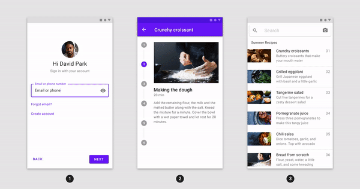

# 动画

[TOC]


一个动画`Animation<T>`包括：

- 控制器：`AnimationController`继承自`Animation<double>`。
- 插值区间：`Tween`继承自`Animatable<T>`
- 插值方式：`CurvedAnimation`继承自`Animation<double>`

`Animation`是一个抽象类，它本身和UI渲染没有任何关系，而它主要的功能是保存动画的插值和状态。**当控件的动画执行完毕后，控件会保持住最后一帧所处的状态。**


## AnimationController

`AnimationController`用于控制动画，它包含动画的启动`forward()`、停止`stop()` 、反向播放 `reverse()`、事件监听等方法。

基本框架

~~~dart
class CustomWidget extends StatefulWidget with SingleTrickerProviderStateMixin {
    late AnimationController _controller;
    
    @override
    void initState() {
        _controller = AnimationController(			//继承自Animation<Double>
        	duration : Duration(seconds : 1),		//动画持续时间
            lowerBound : 3.0,					   //插值的初始值，默认为0.0
            upperBound : 5.0,					   //插值的最终值，默认为1.0
            vsync : this						  
        );
        _controller.addListener((){})			//进行事件监听
        _controller.forward();					//开始执行动画
        super.initState();
    }
    @override
    void dispose(){
        _controller.dispose();		//回收资源
        super.initState();	
    }
    
    @override
  	Widget build(BuildContext context) {
        return RotationTransition(
        	turns : _controller,		//Flutter自带的显式动画控件，通过参数turns传入一个Animation<T>
            child : ...
        )
    }
}
~~~


默认情况下，`AnimationController`在动画执行时间内，线性生成从 0.0 到1.0的数值。可以通过`lowerBound`和`upperBound`来指定`AnimationController`生成数值的区间，例如：

```dart
final AnimationController controller = AnimationController( 
    duration: const Duration(milliseconds: 2000), 
    lowerBound: 10.0,
    upperBound: 20.0,
    vsync: this
);
```

当创建一个`AnimationController`时，需要一个`vsync`参数，它接收一个`TickerProvider`类型的对象。通常我们会将`SingleTickerProviderStateMixin`混型到`State`的定义中，然后将本对象`this`作为`vsync`的值

> Flutter 应用在启动时都会绑定一个`SchedulerBinding`，通过`SchedulerBinding`可以给每一次屏幕刷新添加回调。而Ticker注册到SchedulerBinding中，这样每次屏幕刷新时都会调用Ticker中的TickerCallback回调方法。使用`Ticker`(而不是`Timer`)来驱动动画会防止屏幕外动画（动画的UI不在当前屏幕时，如锁屏时）消耗不必要的资源。


## Curve

动画过程可以是匀速的、匀加速的或者先加速后减速等。Flutter中通过`Curve`（曲线）来描述动画过程。

通过CurvedAnimation将曲线与动画控制器关联起来。

```dart
final CurvedAnimation curve = CurvedAnimation(parent: controller, curve: Curves.easeIn);
```


Curves 类是一个预置的枚举类，定义了许多常用的曲线，下面列几种常用的：

| Curves曲线     | 动画过程                                                     |
| -------------- | ------------------------------------------------------------ |
| linear         | 匀速的                                                       |
| decelerate     | 匀减速                                                       |
| ease           | 开始加速，后面减速                                           |
| easeIn         | 开始慢，后面快                                               |
| easeOut        | 开始快，后面慢                                               |
| easeInOut      | 开始慢，然后加速，最后再减速                                 |
| Interval(a, b) | 假设动画的持续时间为x秒，那么Interval(0.3, 0.4)就在时间$[0.3 * x, 0.4 * x]$内执行完全部动画 |

当然我们也可以创建自己Curve，例如我们定义一个正弦曲线：

```dart
class ShakeCurve extends Curve {
  @override
  double transform(double t) {
    return math.sin(t * math.PI * 2);
  }
}
```


## Tween

Tween将AnimationController的value映射到你所需的数值以及类型。例如`Tween`生成[-200.0，0.0]的值

```dart
final Tween doubleTween = Tween<double>(begin: -200.0, end: 0.0);		//AnimiationController中的值为[0, 1]
final Tween colorTween = ColorTween(begin: Colors.transparent, end: Colors.black54);
```


通过`Tween`的`animate`方法或者`AnimationController`的`drive`方法，可以将动画控制器的插值区间映射到新的插值区间

```dart
final AnimationController controller = AnimationController(
  duration: const Duration(milliseconds: 500), 
  vsync: this,
);

//这样控制器就绑定到了该CurveAnimation上了
final Animation curve = CurvedAnimation(parent: controller, curve: Curves.easeOut);


Animation<int> alpha = IntTween(begin: 0, end: 255).animate(curve);		//Animation默认值为[0, 1],这里IntTween将其映射到[0, 255]
Animation<int> alpha = curve.drive(IntTween(begin: 0, end: 255));
```


~~~dart
Tween(begin: Offset(0, 0), end : Offset(0, 0.1))
      .chain(CurveTween(curve: Curves.elasticInOut))
      .animate(_controller),
~~~

这段代码做了两件事

- 将动画_controller的区间映射到新的区间[begin, end]
- 以曲线的方式来插值


## 隐式动画

Flutter SDK中也预置了很多动画过渡组件，实现方式和大都和`AnimatedDecoratedBox`差不多，如表9-1所示：

| 组件名                   | 功能                                                         |
| ------------------------ | ------------------------------------------------------------ |
| AnimatedPadding          | 在padding发生变化时会执行过渡动画到新状态                    |
| AnimatedPositioned       | 配合Stack一起使用，当定位状态发生变化时会执行过渡动画到新的状态。 |
| AnimatedOpacity          | 在透明度opacity发生变化时执行过渡动画到新状态                |
| AnimatedAlign            | 当`alignment`发生变化时会执行过渡动画到新的状态。            |
| AnimatedContainer        | 当Container属性发生变化时会执行过渡动画到新的状态。          |
| AnimatedDefaultTextStyle | 当字体样式发生变化时，子组件中继承了该样式的文本组件会动态过渡到新样式。 |

这些动画会作用在本Widget的属性上面，并不应用在子Widget上。


通过`TweenAnimationBuilder`可自定义隐式动画

~~~dart
TweenAnimationBuilder(
  duration: Duration(seconds: 1),			
  tween: Tween<double>(begin: 0.0, end : 1.0),  
  builder:(context, value, child) {
    //动画每一帧都会调用builder，并通过参数value传入补间值
    return Opacity(opacity: value, child : child);
  },
  child : ...
)
~~~

- duration：动画持续时间
- tween：线性补间数值。当tween属性值发生变化时，补间数值从current_value到new_end。

如果想改变插值的方式，那么可以使用`Tween.chain()`方法 + `CurveTween`对象。这在Tween一节中有介绍。

## 显示动画

Flutter内置的显式动画控件，相比隐式动画控件来说，除了动画效果相同之外，还可以控制动画的播放行为（暂停、播放、重复）以及进行事件监听。


```dart
FadeTransition(
	opacity : _controller,		//接受一个Animation<T>类型
    child : ...
)
    
ScaleTransition(
	scale : _controller,		//接受一个Animation<T>类型
    child : ...
)
    
SlideTransition(
	position : _controller,		//接受一个Animation<T>类型
)
```


使用`AnimatedBuilder`控件来自定义显式动画：

~~~dart
final CurvedAnimation curve = CurvedAnimation(
    parent: _controller,
    curve: Curves.easeIn
);
Animation<int> heightAnimation = IntTween(begin: 200, end: 400).animate(curve);


AnimatedBuilder(
    animation: heightAnimation,
    builder: (context, child) {
        return Container(
            height: heightAnimation.value.toDouble(),
            width: heightAnimation.value.toDouble(),
            color : Colors.red
        );
    }
);
~~~


AnimatedBuilder、TweenAnimationBuilder以及官网提供的动画控件，实际上都是继承自StatefulWidget。也就是说动画每一帧的刷新都是Ticker回调setState函数。下面来演示如何不用Animation Controller来完成动画效果

```dart
class _MyHomePageState extends State<MyHomePage>
    with SingleTickerProviderStateMixin {
  double _height = 300;

  @override
  void initState() {
    Ticker _ticker = new Ticker((elapsed) {
      setState(() {
        _height--;
        if (_height <=0 ) _height = 300;
      });
    });
    //每次设备屏幕刷新时，就会调用回调函数
    _ticker.start();
    super.initState();
  }

  @override
  Widget build(BuildContext context) {
 
    return Center(
          child: AnimatedContainer(
              duration: Duration(seconds: 1),
              width: 300,
              height: _height,
    );
  }
}
```

实际上不推荐使用这种方案，因为Ticker是根据设备屏幕的刷新率来执行回调函数的，这个动画在60Hz、120Hz的屏幕上有着不同的动画执行时长。

## 动画通知

在动画的每一帧中，我们可以通过`Animation`对象的`value`属性获取动画的当前状态值。

我们可以通过`Animation`来监听动画每一帧以及执行状态的变化，`Animation`有如下两个方法：

1. `addListener()`；它可以用于给`Animation`添加帧监听器，在每一帧都会被调用。
2. `addStatusListener()`；它可以给`Animation`添加“动画状态改变”监听器；动画开始、结束、正向或反向（见`AnimationStatus`定义）时会调用状态改变的监听器。

Flutter中，有四种动画状态，在`AnimationStatus`枚举类中定义，下面我们逐个说明：

| 枚举值      | 含义             |
| ----------- | ---------------- |
| `dismissed` | 动画在起始点停止 |
| `forward`   | 动画正在正向执行 |
| `reverse`   | 动画正在反向执行 |
| `completed` | 动画在终点停止   |

```dart
ontroller = AnimationController(
  duration: const Duration(seconds: 1), 
  vsync: this,
);
//图片宽高从0变到300
animation = Tween(begin: 0.0, end: 300.0).animate(controller);
animation.addStatusListener((status) {
  if (status == AnimationStatus.completed) {
    //动画执行结束时反向执行动画
    controller.reverse();
  } else if (status == AnimationStatus.dismissed) {
    //动画恢复到初始状态时执行动画（正向）
    controller.forward();
  }
});

//启动动画（正向）
controller.forward();
```


## 交织动画

如何让一个动画序列应用在多个Widget上？

可以让多个Animation使用同一个controller，但是要配合Interval一起使用

```
Animation animation1 = CurveTween(curve : Interval(0.0, 0.2)).animate(_controller);
Animation animation2 = CurveTween(curve : Interval(0.2, 0.4)).animate(_controller);
...
Animation animation5 = CurveTween(curve : Interval(0.8, 1.0)).animate(_controller);
```


还可以通过控制时长的方式来完成（笔者在web中就是使用这种方式来进行交织动画的）

~~~dart
controller.duration = Duration(seconds : 4);
controller.forward();
await Future.delayed(Duration(second : 4));		//必须有这么一步，否则可能直接回溯播放7s
controller.duration = Duration(second : 7);
controller.reverse();
~~~


可以通过TweenSequence控件来完成一个动画序列应用在一个Widget


## Hero动画

Hero 动画的原理比较简单，Flutter 框架知道新旧路由页中共享元素的位置和大小，所以根据这两个端点，在动画执行过程中求出过渡时的插值（中间态）即可。

~~~dart
const Hero({
    required this.tag,
    required this.child,
    //...
});
~~~


## Mateiral 转场模式

四种主要的 Material 转场模式如下：

- **容器转换**：用于包含容器的界面元素之间的过渡；通过将一个元素无缝转换为另一个元素，在两个不同的界面元素之间创造可视化的连接。


- **共享轴**：用于具有空间或导航关系的界面元素之间的过渡；让元素在转换时共用 x 轴、y 轴或 z 轴，用以强调元素间的关系。



- **淡出后淡入**：用于彼此之间没有密切关系的界面元素之间的过渡；使用依序淡出和淡入的效果，并会对转入的元素进行缩放。


- **淡出**：用于进入或退出屏幕画面范围的界面元素。

  