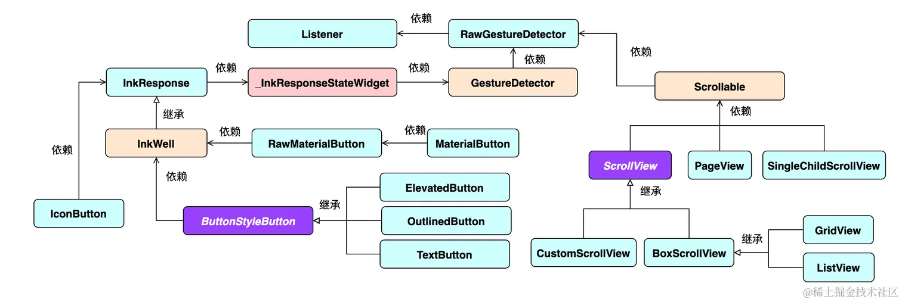
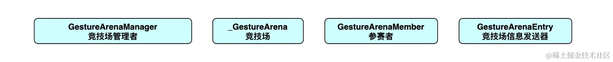
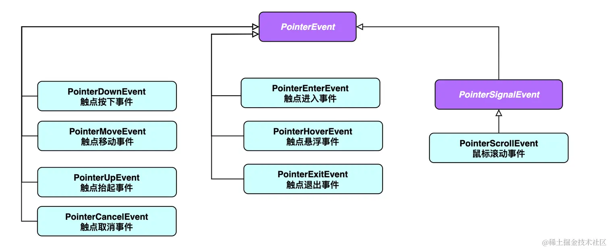
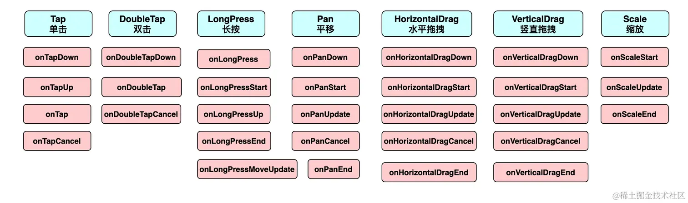
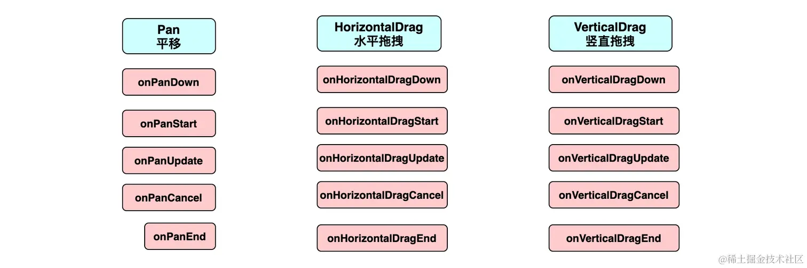

# 手势

[TOC]

## 概述



一个组件可以响应多种手势。如果同时有多个手势可以响应，那么必须只有一个手势胜出。而仲裁逻辑要涉及到以下类型：

- `GestureArenaManager`
- `_GestureArena` 
- `GestureArenaMember` 
- `GestureArenaEntry` 




手势事件由平台接收，然后通过 `GestureBinding` 传递给 Flutter 端。Flutter引擎会解析平台所传入的事件，然后构建出`PointerEvent` 对象，最后分发给手势识别器以及需要被通知的`RenderObject`。



## GestureDetector的手势



### 单击

单击有如下有四个回调事件：

~~~dart
onTap: 	      void Function();
onTapCancel:  void Function();
onTapDown:    void Function(TapDownDetails details);
onTapUp:      void Function(TapUpDetails details);
~~~

其中，`TapDownDetails` 和 `TapUpDetails` 的成员如下：

| 属性名           | 类型                | 介绍                         |
| ---------------- | ------------------- | ---------------------------- |
| `localPosition`  | `Offset`            | 触点相对于组件左上角的偏移量 |
| `globalPosition` | `Offset`            | 触点相对于屏幕左上角的偏移量 |
| `kind`           | `PointerDeviceKind` | 触点设备类型                 |

而`PointerDeviceKind` 是一个枚举类，包括下面五个属性：

~~~dart
enum PointerDeviceKind {
  touch, 			// 点击
  mouse, 			// 鼠标
  stylus, 			// 针尖笔
  invertedStylus, 	// 反向针尖笔
  unknown 			// 未知
}
~~~

单击成功时事件的顺序：`onTapDown`、`onTapUp`、`onTap`

单击失败时事件的顺序：`onTapDown`、`onTapCancel`

### 双击

双击事件有如下有三个回调事件：

~~~dart
onDoubleTap:  		void Function();
onDoubleTapDown: 	void Function(TapDownDetails details);
onDoubleTapCancel:	void Function();
~~~

### 长按

长按有如下有五个回调事件：

~~~dart
onLongPressStart:       void Function(LongPressStartDetails details);
onLongPress: 	        void Function();
onLongPressMoveUpdate:  void Function(LongPressMoveUpdateDetails details);
onLongPressEnd:			void Function(LongPressEndDetails details);
onLongPressUp:			void Function();
~~~

`LongPressStartDetails`的成员如下：

| 属性名           | 类型     | 介绍                         |
| ---------------- | -------- | ---------------------------- |
| `localPosition`  | `Offset` | 触点相对于组件左上角的偏移量 |
| `globalPosition` | `Offset` | 触点相对于屏幕左上角的偏移量 |

`LongPressEndDetails`的成员如下：

| 属性名           | 类型       | 介绍                         |
| ---------------- | ---------- | ---------------------------- |
| `localPosition`  | `Offset`   | 触点相对于组件左上角的偏移量 |
| `globalPosition` | `Offset`   | 触点相对于屏幕左上角的偏移量 |
| `velocity`       | `Velocity` | 结束时的速度信息             |

`LongPressMoveUpdateDetails`的成员如下：

| 属性名                  | 类型     | 介绍                                   |
| ----------------------- | -------- | -------------------------------------- |
| `localPosition`         | `Offset` | 触点相对于`组件左上角`的偏移量         |
| `globalPosition`        | `Offset` | 触点相对于`屏幕左上角`的偏移量         |
| `offsetFromOrigin`      | `Offset` | 长按开始触点开始到当前触点(全局)偏移量 |
| `localOffsetFromOrigin` | `Offset` | 长按开始触点开始到当前触点(相对)偏移量 |

首先 `onLongPressStart` 执行；然后 `onLongPress` 执行；随着触点的移动，会不断执行 `onLongPressMoveUpdate`；最后抬手时，先执行 `onLongPressEnd`，再执行 `onLongPressUp` 标志着一次长按事件的完成。

### 平移

平移有如下有五个回调事件：

~~~dart
onPanDown: 		void Function(DragDownDetails details);
onPanStart: 	void Function(DragStartDetails details);
onPanUpdate:  	void Function(DragUpdateDetails details);
onPanEnd:		void Function(DragEndDetails details);
onPanCancel:	void Function();
~~~

`DragDownDetails`的成员如下：

| 属性名           | 类型     | 介绍                         |
| ---------------- | -------- | ---------------------------- |
| `localPosition`  | `Offset` | 触点相对于组件左上角的偏移量 |
| `globalPosition` | Offset   | 触点相对于屏幕左上角的偏移量 |

`DragStartDetails`的成员如下：

| 属性名            | 类型                | 介绍                         |
| ----------------- | ------------------- | ---------------------------- |
| `localPosition`   | `Offset`            | 触点相对于组件左上角的偏移量 |
| `globalPosition`  | `Offset`            | 触点相对于屏幕左上角的偏移量 |
| `sourceTimeStamp` | `Duration`          | 拖拽开始的时间戳             |
| `kind`            | `PointerDeviceKind` | 触点设备类型                 |

`DragUpdateDetails`的成员如下：

| 属性名            | 类型       | 介绍                                       |
| ----------------- | ---------- | ------------------------------------------ |
| `localPosition`   | `Offset`   | 触点相对于`组件左上角`的偏移量             |
| `globalPosition`  | `Offset`   | 触点相对于`屏幕左上角`的偏移量             |
| `delta`           | `Offset`   | 每次执行时的偏移量                         |
| `sourceTimeStamp` | `Duration` | 移动时的时间戳                             |
| `primaryDelta`    | `double`   | 主方轴向上的初始偏移量(如未指定，默认null) |

DragEndDetails的成员如下：

| 属性名            | 类型       | 介绍                                     |
| ----------------- | ---------- | ---------------------------------------- |
| `velocity`        | `Velocity` | 速度信息                                 |
| `primaryVelocity` | `double`   | 主方轴向上的初始速度(如未指定，默认null) |

首先 `onPanDown` 执行；然后 `onPanStart` 执行；随着触点的移动，会不断执行 `onPanUpdate`；最后抬手时，执行 `onPanUpdate`，标志着一次平移事件的完成。


此外，`HorizontalDrag` 和 `VerticalDrag` 可以视为 `Pan` 事件在水平和竖直方向的特例



需要注意的是：

- 如果只监听某一方向的拖拉（`HorizontalDrag` 或 `VerticalDrag`），那么无论用户的手势是否具有正确的方向性，都会执行回调函数。

- 已经监听了`pan`事件，而又继续监听`HorizontalDrag` 或 `VerticalDrag`事件。

  假设这里监听`HorizontalDrag`事件，若用户的平移手势有明显的水平倾向，则会执行`HorizontalDrag`的回调函数，否则会执行`pan`的回调函数。

- Horizontal and vertical drag callbacks cannot be used simultaneously because a combination of a horizontal and vertical drag is a pan. Use the pan callbacks instead.

### 缩放

缩放有如下有三个回调事件：

~~~dart
onScaleStart: 	void Function(ScaleStartDetails details);
onScaleUpdate: 	void Function(ScaleUpdateDetails details);
onScaleEnd:  	void Function(ScaleEndDetails details);
~~~

`ScaleStartDetails`的成员如下：

| 属性名            | 类型     | 介绍                                 |
| ----------------- | -------- | ------------------------------------ |
| `focalPoint`      | `Offset` | 触点与屏幕接触的焦点(平面左上角)     |
| `localFocalPoint` | `Offset` | 触点与屏幕接触的初始焦点(组件左上角) |
| `pointerCount`    | `int`    | 触点个数                             |

`ScaleUpdateDetails`的成员如下：

| 属性名            | 类型     | 介绍                                 |
| ----------------- | -------- | ------------------------------------ |
| `focalPoint`      | `Offset` | 触点与屏幕接触的焦点(平面左上角)     |
| `localFocalPoint` | `Offset` | 触点与屏幕接触的初始焦点(组件左上角) |
| `pointerCount`    | `int`    | 触点个数                             |
| `scale`           | `double` | 缩放比例                             |
| `horizontalScale` | `double` | 水平缩放比例                         |
| `verticalScale`   | `double` | 竖直缩放比例                         |
| `rotation`        | `double` | 旋转角度(弧度)                       |

`DragEndDetails`的成员如下：

| 属性名         | 类型       | 介绍     |
| -------------- | ---------- | -------- |
| `velocity`     | `Velocity` | 速度信息 |
| `pointerCount` | `int`      | 触点个数 |


需要指出的是，**Pan and scale callbacks cannot be used simultaneously because scale is a superset of pan. Use the scale callbacks instead**

## MouseRegion

鼠标区域组件可用于监听与鼠标相关的事件，用法与Listener相似

~~~dart
const MouseRegion({
    super.key,
    this.onEnter,						//鼠标进入该区域
    this.onExit,						//鼠标退出该区域
    this.onHover,						//鼠标在该区域移动
    this.cursor = MouseCursor.defer,	  //鼠标的图标
    this.opaque = true,
    this.hitTestBehavior,
    super.child,
});
~~~


## 命中测试

一次完整的事件分为三个阶段：

1. 手指按下

2. 手指移动

3. 手指抬起，

更高级别的手势（如点击、双击、拖动等）都是基于这些原始事件的。

当指针按下时

1. Flutter 会对应用程序执行 **命中测试(Hit Test)**，以确定指针与屏幕接触的位置存在哪些组件。
2. 指针按下事件被分发到在命中测试中发现的最内部的组件
3. 事件会在组件树中向上冒泡。在 Flutter 中，并没有取消或停止「冒泡」过程的机制。


Flutter中可以使用`Listener`来监听原始触摸事件

~~~dart
Listener({
    Key key,
    this.onPointerDown, 	//手指按下回调
    this.onPointerMove, 	//手指移动回调
    this.onPointerUp,		//手指抬起回调
    this.onPointerCancel,	//触摸事件取消回调
    this.behavior = HitTestBehavior.deferToChild, //先忽略此参数，后面小节会专门介绍
    Widget child
})
~~~


假如我们不想让某个子树响应`PointerEvent`的话，我们可以使用`IgnorePointer`和`AbsorbPointer`，这两个组件都能阻止子树接收指针事件，不同之处在于`AbsorbPointer`本身会参与命中测试，而`IgnorePointer`本身不会参与。一个简单的例子如下：

~~~dart
Listener(
    child: AbsorbPointer(
        child: Listener(
            child: Container(
                color: Colors.red,
                width: 200.0,
                height: 100.0,
            ),
            onPointerDown: (event)=>print("in"),
        ),
    ),
    onPointerDown: (event)=>print("up"),
)
~~~

点击`Container`时，由于它在`AbsorbPointer`的子树上，所以不会响应指针事件，那么不会输出"in"。但`AbsorbPointer`本身是可以接收指针事件的，所以会输出"up"。如果将`AbsorbPointer`换成`IgnorePointer`，那么两个都不会输出。

## 事件处理与通知

### 命中测试

一个对象是否可以响应事件，取决于在其对命中测试过程中，是否被添加到了 HitTestResult 列表 。如果没有被添加进去，则后续的事件分发将不会分发给自己。

命中测试的流程：

1. 当发生用户事件时，Flutter 会从根节点（`RenderView`）开始调用它`hitTest()`

   ~~~dart
   // RenderBinding#hitTest
   @override
   void hitTest(HitTestResult result, Offset position) {
       //从根节点开始进行命中测试
       renderView.hitTest(result, position: position); 
       super.hitTest(result, position); 
   }
   ~~~

2. `RenderView#hitTest()`

   ~~~dart
   bool hitTest(HitTestResult result, { Offset position }) {
       if (child != null)
           child.hitTest(result, position: position); //递归对子树进行命中测试
   
       // 根节点会始终被添加到 HitTestResult 列表中
       result.add(HitTestEntry(this)); 
       return true;
   }
   ~~~

   `RenderBox#hitTest()`

   ~~~dart
   bool hitTest(HitTestResult result, { @required Offset position }) {
   	// ...
       if (_size.contains(position)) { // 判断事件的触发位置是否位于组件范围内
           if (hitTestChildren(result, position: position) || hitTestSelf(position)) {
               result.add(BoxHitTestEntry(this, position));
               return true;
           }
       }
       return false;
   }
   ~~~

   - hitTestChildren() 功能是判断是否有子节点通过了命中测试，如果有，则会将子组件添加到 HitTestResult 中同时返回 true；如果没有则直接返回false
   - hitTestSelf() 决定自身是否通过命中测试。 可以重写此函数并返回true ，相当于“强行声明”自己通过了命中测试。

   需要注意，节点通过命中测试的标志是它被添加到 HitTestResult 列表中，而不是它 hitTest 的返回值。此外，因为 `hitTestChildren()`中会递归调用子组件的 hitTest 方法，所以组件树的命中测试顺序深度优先的，即如果通过命中测试，子组件会比父组件会先被加入 HitTestResult() 中。

3. hitTestChildren() 与 hitTestSelf() 的默认实现：

   ~~~dart
   @protected
   bool hitTestChildren(HitTestResult result, { Offset position }) => false;
   
   @protected
   bool hitTestSelf(Offset position) => false;
   ~~~

   `hitTestChildren()`直接返回 `false`， 这也就意味着后代节点将无法参与命中测试，相当于事件被拦截了，这也正是 IgnorePointer 和 AbsorbPointer 可以拦截事件下发的原理。

   

   `RenderBoxContainerDefaultsMixin#hitTestChildren()` 的实现逻辑为：

   1. **倒序遍历**兄弟节点，调用它们的 `hitTest()`
   2. 只要有某个子节点的 `hitTest()` 返回了 `true`，那么会终止子节点遍历，并返回 `true`。这意味着该子节点前面的兄弟节点将没有机会通过命中测试。

   下面思考两个问题：

   - 为什么要制定这个中断呢？兄弟节点一般不会重叠
   - 为什么兄弟节点的遍历要倒序？兄弟节点一般不会重叠，而一旦发生重叠的话，往往是后面的组件会在前面组件之上

   

   

### 事件分发

~~~dart
// 事件分发
void dispatchEvent(PointerEvent event, HitTestResult? hitTestResult) {
  ... 
  for (final HitTestEntry entry in hitTestResult.path) {
    entry.target.handleEvent(event.transformed(entry.transform), entry);
  }
}
~~~

 可以覆写 RenderProxyBox#handlerEvent() 方法，来处理事件分发：

~~~dart
class PointerDownListener extends SingleChildRenderObjectWidget {
  PointerDownListener({Key? key, this.onPointerDown, Widget? child})
      : super(key: key, child: child);

  final PointerDownEventListener? onPointerDown;

  @override
  RenderObject createRenderObject(BuildContext context) =>
      RenderPointerDownListener()..onPointerDown = onPointerDown;

  @override
  void updateRenderObject(
      BuildContext context, RenderPointerDownListener renderObject) {
    renderObject.onPointerDown = onPointerDown;
  }
}

class RenderPointerDownListener extends RenderProxyBox {
  PointerDownEventListener? onPointerDown;

  @override
  bool hitTestSelf(Offset position) => true; //始终通过命中测试

  @override
  void handleEvent(PointerEvent event, covariant HitTestEntry entry) {
    //事件分发时处理事件
    if (event is PointerDownEvent) onPointerDown?.call(event);
  }
}


class PointerDownListenerRoute extends StatelessWidget {
  const PointerDownListenerRoute({Key? key}) : super(key: key);

  @override
  Widget build(BuildContext context) {
    return PointerDownListener(
      child: Text('Click me'),
      onPointerDown: (e) => print('down'),
    );
  }
}
~~~


## 手势原理

手势的识别和处理都是在事件分发阶段的。GestureDetector 是一个 StatelessWidget，我们看一下它的 build 方法实现：

~~~dart
// GestureDetector#build()
@override
Widget build(BuildContext context) {
  final  gestures = <Type, GestureRecognizerFactory>{};
    
  // 构建手势识别器 TapGestureRecognizer 
  if (onTapDown != null ||
      onTapUp != null ||
      onTap != null ||
      ... //省略
  ) {
    // 为手势识别器注册一些回调事件
    gestures[TapGestureRecognizer] = GestureRecognizerFactoryWithHandlers<TapGestureRecognizer>(
      () => TapGestureRecognizer(debugOwner: this),
      (TapGestureRecognizer instance) {
        instance
          ..onTapDown = onTapDown
          ..onTapUp = onTapUp
          ..onTap = onTap
          //省略
      },
    );
  }

  
  return RawGestureDetector(
    gestures: gestures, // 传入手势识别器
    behavior: behavior, // 同 Listener 中的 HitTestBehavior
    child: child,
  );
}
~~~

`RawGestureDetector` 中会通过 `Listener` 组件监听 `PointerDownEvent` 事件，相关源码如下：

~~~dart
@override
Widget build(BuildContext context) {
  ... // 省略无关代码
  Widget result = Listener(
    onPointerDown: _handlePointerDown,	 // 当有 onPointerDown 事件后，调用 _handlePointerDown 回调函数
    behavior: widget.behavior ?? _defaultBehavior,
    child: widget.child,
  );
}  
 
void _handlePointerDown(PointerDownEvent event) {
  for (final GestureRecognizer recognizer in _recognizers!.values)
    recognizer.addPointer(event);
}  
~~~

下面我们看一下 `TapGestureRecognizer` 的几个相关方法，由于 `TapGestureRecognizer` 有多层继承关系，笔者合并了一个简化版：

```dart
class CustomTapGestureRecognizer1 extends TapGestureRecognizer {

  void addPointer(PointerDownEvent event) {
    // 首先会调用 isPointerAllowed() 来决定是否将 handleEvent 回调添加到 pointerRouter 中
    GestureBinding.instance!.pointerRouter.addRoute(event.pointer, handleEvent);
  }
  
  @override
  void handleEvent(PointerEvent event) {
    //会进行手势识别，并决定是是调用 acceptGesture 还是 rejectGesture
  }
  
  @override
  void acceptGesture(int pointer) {
    // 竞争胜出会调用
  }

  @override
  void rejectGesture(int pointer) {
    // 竞争失败会调用
  }
}
```

可以看到当 PointerDownEvent 事件触发时，会调用 TapGestureRecognizer 的 addPointer，在 addPointer 中会将 handleEvent 方法添加到 pointerRouter 中保存起来。这样一来当手势发生变化时只需要在 pointerRouter 中取出 GestureRecognizer 的 handleEvent 方法进行手势识别即可。

同一个手势应该只有一个手势识别器生效，为此，手势识别才映入了手势竞技场（Arena）的概念，简单来讲：

1. 每一个手势识别器（GestureRecognizer）都是一个“竞争者”（GestureArenaMember），当发生指针事件时，他们都要在「竞技场」去竞争本次事件的处理权，默认情况最终只有一个「竞争者」会胜出。
2. GestureRecognizer 的 handleEvent 中会识别手势。竞争者可以宣布自己是否胜出，一旦有一个竞争者胜出，竞技场管理者（GestureArenaManager）就会通知其他竞争者失败。
3. 胜出者的 acceptGesture 会被调用，其余的 rejectGesture 将会被调用。


上一节我们说过命中测试是从 RenderBinding 的 hitTest 开始的：

~~~dart
@override
void hitTest(HitTestResult result, Offset position) {
  // 从根节点开始进行命中测试
  renderView.hitTest(result, position: position); 
  // 会调用 GestureBinding 中的 hitTest()方法
  super.hitTest(result, position); 
}

// GestureBinding#hitTest() 
@override // from HitTestable
void hitTest(HitTestResult result, Offset position) {
  result.add(HitTestEntry(this));
}
~~~

可见， GestureBinding 也通过命中测试，那么它的 handleEvent 会被调用

~~~dart
@override 
void handleEvent(PointerEvent event, HitTestEntry entry) {
  // 会调用在 pointerRouter 中添加的 GestureRecognizer 的 handleEvent
  pointerRouter.route(event);
    
  if (event is PointerDownEvent) {
    // 分发完毕后，关闭竞技场
    gestureArena.close(event.pointer);
  } else if (event is PointerUpEvent) {
    gestureArena.sweep(event.pointer);
  } else if (event is PointerSignalEvent) {
    pointerSignalResolver.resolve(event);
  }
}
~~~


当两个 `GestureDetector` 嵌套时，它们的底层的 `Listener` 控件可能同时检测到用户事件。此时，它们当中的所有手势识别器开始竞争。但是判定获胜的规则是「子组件优先」，所以外层 `GestureDetector` 中的所有手势识别器都会竞争失败。

手势是对原始指针的语义化的识别，手势冲突只是手势级别的，也就是说只会在组件树中的多个 GestureDetector 之间才有冲突的场景。对于其他节点来说，它们只要命中测试通过，都能接收到事件。


## 通知

在widget树中，每一个节点都可以分发通知，通知会沿着当前节点向上传递，可以通过`NotificationListener`来监听通知，通过 `onNotification` 参数注册监听回调函数：

~~~dart
// 监听的通知类型为滚动结束通知(ScrollEndNotification)
NotificationListener<ScrollEndNotification>(
    onNotification: (notification){
        //只会在滚动结束时才会触发此回调
        print(notification);
    },
)
    
NotificationListener() // 若不设置泛型，则监听所有通知类型
~~~


下面我们来自定义通知：

1. 定义一个通知类，要继承自Notification类；

   ~~~dart
   class MyNotification extends Notification {
       MyNotification(this.msg);
       final String msg;
   }
   ~~~

2. 通过`Notification#dispatch(context)`来分发通知

   ~~~dart
   NotificationListener<MyNotification>(
        onNotification: (notification) { ... }
       child: ElevatedButton(
           // 按钮点击时分发通知  
           onPressed: () => MyNotification("Hi").dispatch(context),
           child: Text("Send Notification"),
       );
   )
   ~~~

通知冒泡和用户触摸事件冒泡是相似的，但有一点不同：通知冒泡可以中止，但用户触摸事件不行。回调函数 `onNotification` 如果返回 `false`，那么阻止冒泡。


