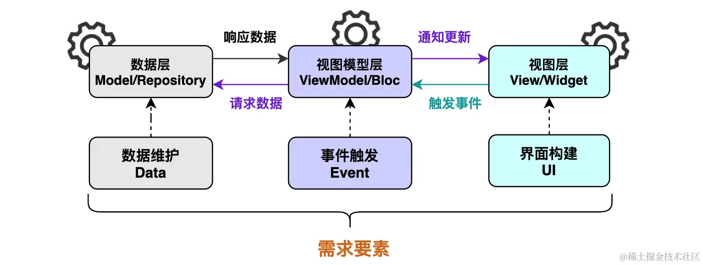
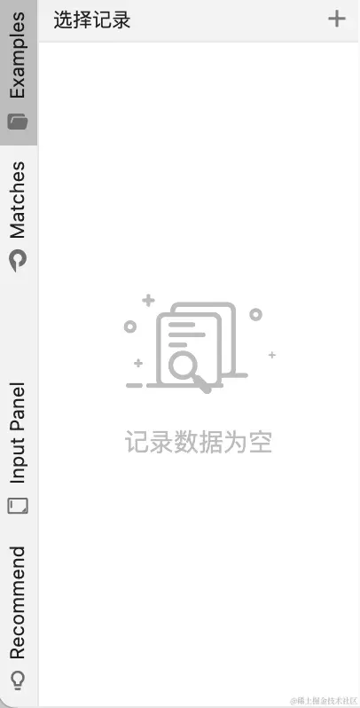
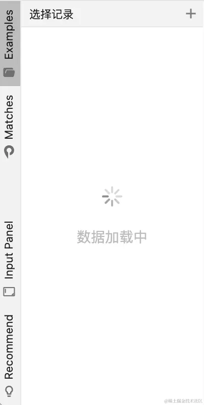
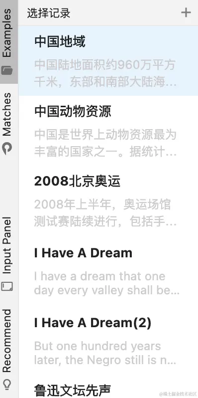
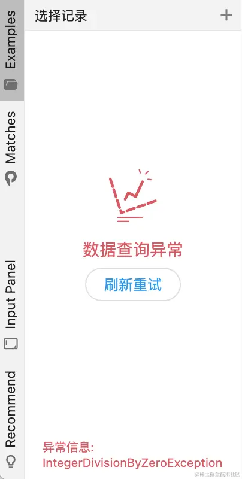
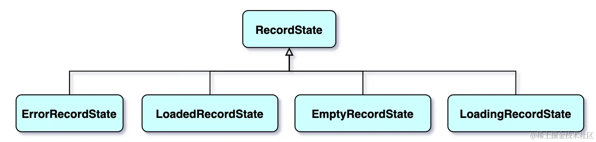
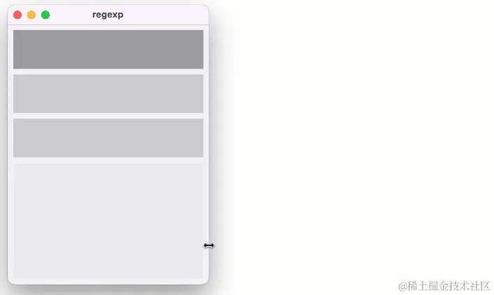
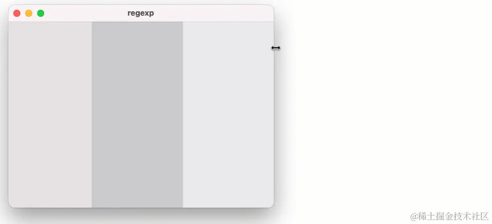
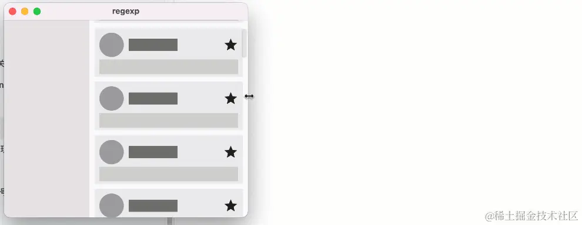

# 构建Flutter应用

[TOC]

## 概述

跨平台的挑战：

- UI元素的差异化
- 性能的差异化
- 平台特性和使用习惯的差异化

对于构建逻辑封装来说，是抽离成 **函数** 还是 **组件** 。

- **函数封装** ，封装的逻辑很难在其他组件的构建逻辑中被复用，但是可以使用本类的成员数据
- **组件封装** ，复用性要强很多，但无法享有其它类中的数据，只能通过构造进行传参。

## 安装

X HTTP host https://[maven](https://links.jianshu.com/go?to=https%3A%2F%2Fso.csdn.net%2Fso%2Fsearch%3Fq%3Dmaven%26spm%3D1001.2101.3001.7020).google.com/ is not reachable 解决

1、找到flutter sdk的文件目录，打开flutter\packages\flutter_tools\lib\src\http_host_validator.dart

2、将[https://maven.google.com/](https://links.jianshu.com/go?to=https%3A%2F%2Fmaven.google.com%2F) 修改为[https://dl.google.com/dl/android/maven2/](https://links.jianshu.com/go?to=https%3A%2F%2Fdl.google.com%2Fdl%2Fandroid%2Fmaven2%2F)

3、关闭cmd命令窗口，重新打开cmd窗口

4、去到flutter\bin目录，删除cache文件夹

5、在cmd命令窗口重新运行flutter doctor，它会重新下载flutter sdk等（时间较长）。

## 项目的分层设计

在自定义Widget类代码中，只实现UI构建的逻辑。对于数据处理的业务逻辑一律在ViewModel层来实现。这里我们使用Bloc框架来实现MVVM结构。

- `Repository`
  - `Model`：数据对象
  - `DaoImpl`：直接与数据源打交道的对象，它们依赖于`LocalDatabase`或者`NetworkDatabase`对象
  - `Dao`：对不同的数据来源提供统一的操作接口
  - `LocalDatabase.dart`：实现DataSource抽象类，表示本地数据库
  - `NetworkDatabase.dart`：实现DataSource抽象类，表示网络数据库
  - `DataSource.dart`：管理Dao对象。提供Dao对象的访问器，需要子类去实现这些访问器。
- `ModelView`
  - XXXXbloc
    - state.dart
    - event.dart
    - bloc.dart
- `View`
  - Component：桌面端与手机端共用的组件，一般是响应式布局
  - Mobile：适配移动端的布局、组件（一个文件夹内，放与内容主题相关的控件，例如footer、header、nav等等）
  - Desktop：适配Windows端布局、组件
- `Util`：工具类
- `Assets`：项目的资源文件
  - images：图片资源
  - font：字体资源
  - config：配置文件
- `main.dart`：应用初始化的代码

## 适配暗黑模式

组件的颜色**都是通过**`MaterialApp`中的`colorScheme`对象来获取，即`Theme.of(context).colorScheme.inversePrimary;` 

如果不是通过 Theme 来获取，那么就会应用 Scafflod 提供的样式，或者 Flutter 自带的默认样式。 

然后再按照`Bloc`思路去更新即可

~~~dart
class AppConfig {			// 对应的Bloc对象为AppConfigBloc
  final Color? colorSchemeSeed;
  final ThemeMode themeMode;
}
~~~

~~~dart
class RootWidget extends StatelessWidget {
  const RootWidget({super.key});

  @override
  Widget build(BuildContext context) {
    Color? color = context
        .select<AppConfigBloc, Color?>((value) => value.state.colorSchemeSeed);
    ThemeMode themeMode = context
        .select<AppConfigBloc, ThemeMode>((value) => value.state.themeMode);

    return MaterialApp(
      theme: ThemeData(colorSchemeSeed: color, brightness: Brightness.light),
      darkTheme: ThemeData(colorSchemeSeed: color, brightness: Brightness.dark),
      themeMode: themeMode,
      routes: routes,
      initialRoute: "splash_page",
      debugShowCheckedModeBanner: false,
    );
  }
}
~~~

其中，ThemeMode 是一个枚举类型，取值如下：

~~~dart
enum ThemeMode {
  /// Use either the light or dark theme based on what the user has selected in
  /// the system settings.
  system,
  /// Always use the light mode regardless of system preference.
  light,
  /// Always use the dark mode (if available) regardless of system preference.
  dark,
}
~~~

或者很简单地跟随系统主题

~~~dart
return MaterialApp(
  theme: ThemeData.light(), // 提供亮色主题
  darkTheme: ThemeData.dark(), // 提供暗色主题
  themeMode: ThemeMode.system, // 根据系统设置选择主题
  home: MyAppHome(),
);
~~~

## 首屏加载页面

定义一个 Cubit 对象，来处理数据的初始化加载：

~~~dart
class AppConfig extends Equatable {
  final bool isInitialized;
  final bool isFailed;
  final ThemeMode themeMode;
  AppConfig({
    required this.isInitialized,
    required this.isFailed,
    required this.themeMode,
  });

  AppConfig copyWith({
    bool? isInitialized,
    bool? isFailed,
    ThemeMode? themeMode,
  }) {
    return AppConfig(
        isInitialized: isInitialized ?? this.isInitialized,
        isFailed: isFailed ?? this.isFailed,
        themeMode: themeMode ?? this.themeMode);
  }

  @override
  List<Object> get props => [isInitialized, isFailed, themeMode];
}
~~~

~~~dart
class AppConfigBloc extends Cubit<AppConfig> {
  AppConfigBloc()
      : super(AppConfig(
            isInitialized: false,
            isFailed: false,
            themeMode: ThemeMode.system));

  void initApp() async {
    late AppConfig newAppConfig;
    try {
      Default.sharedPreference = await SharedPreferences.getInstance();
      // 为了避免发送信号后 Widget 尚未构建完成，我们需要在帧结束后再调用 emit()，
      newAppConfig = state.copyWith(isInitialized: true);
    } on Exception catch (exception) {
      newAppConfig = state.copyWith(isFailed: true);
      Default.logger.e(exception);
    } finally {
      final widgetsBinding = WidgetsBinding.instance;
      widgetsBinding.addPostFrameCallback((_) {
        emit(newAppConfig);
      });
      // 强制触发一帧的更新
      widgetsBinding.scheduleFrame();
    }
  }
}

~~~

然后，定义`Splash Page`即可

~~~dart
/// 启动页
class SplashPage extends StatefulWidget {
  const SplashPage({super.key});

  @override
  State<StatefulWidget> createState() => _SplashPageState();
}

const int minimumLoadTime = 1000000; // 启动页的最小时间，单位毫秒

class _SplashPageState extends State<SplashPage> {
  late int _initTimestamp;

  @override
  void initState() {
    super.initState();
    _initTimestamp = DateTime.now().millisecondsSinceEpoch;
    context.read<AppConfigBloc>().initApp();
  }

  @override
  Widget build(BuildContext context) {
    // 监听数据加载完成的事件
    return BlocListener<AppConfigBloc, AppConfig>(
      listener: _listenInitialization,
      child: buildSplashPage(context),
    );
  }

  // 启动页的构建逻辑
  Widget buildSplashPage(BuildContext context) {
    return Container(color: Colors.green);
  }

  // 错误弹窗的构建逻辑
  Widget buildErrorDialog(BuildContext context) {
    return Container(color: Colors.red);
  }

  void _listenInitialization(BuildContext context, AppConfig state) async {
    // 保证启动页的最小时间
    int now = DateTime.now().millisecondsSinceEpoch;
    int delay = minimumLoadTime - (now - _initTimestamp);
    if (delay > 0) {
      await Future.delayed(Duration(milliseconds: delay));
    }

    if (state.isInitialized && !state.isFailed) {
      // 通过 Navigator 将启动页替换为主界面
      Navigator.of(context).pushReplacement(
        MaterialPageRoute(builder: (_) => const MainPage()),
      );
    } else {
      // 弹出加载失败的界面
      Navigator.of(context)
          .push(MaterialPageRoute(builder: (_) => buildErrorDialog(context)));
    }
  }
}

~~~

最后，创建`Cubit`对象以及订阅者即可

~~~dart
@override
Widget build(BuildContext context) {
    return MultiBlocProvider(
        providers: [
            BlocProvider<AppConfigBloc>(create: (_) => AppConfigBloc()),
        ],
        child: Builder(
            builder: (ctx) => MaterialApp(
                theme: ThemeConfig.theme,
                darkTheme: ThemeConfig.darkTheme,
                themeMode: ctx.read<AppConfigBloc>().state.themeMode,
            ),
        ),
    );
}
~~~

## 异步加载页面（1）

| 数据为空                                                     | 加载中                                                       | 加载完成                                                     | 加载异常                                                     |
| ------------------------------------------------------------ | ------------------------------------------------------------ | ------------------------------------------------------------ | ------------------------------------------------------------ |
|  |  |  |  |

这些不同场景中的数据，彼此之间孤立，但又同属于一个UI组件。

将各种场景下的界面所依赖的数据，分别进行封装。

对于视图层来说，就是常规的处理方案：BlocBuilder + buildWidgetByState

~~~dart
class _RecordPanelState extends State<RecordPanel> with AutomaticKeepAliveClientMixin {

  RecordBloc get bloc => context.read<RecordBloc>();

  @override
  void initState() {
    super.initState();
    bloc.loadRecord(LoadType.load);
  }

  @override
  Widget build(BuildContext context) {
    return BlocBuilder<RecordBloc, RecordState> (
       builder: (_, state) => _buildByState(state),
    )
  }

  // 根据状态来加载相应的页面
  Widget _buildByState(RecordState state) {
    if (state is LoadingRecordState) {
      return const LoadingPanel();
    }
      
    if (state is EmptyRecordState) {
      return const EmptyPanel(
        data: "记录数据为空",
        icon: TolyIcon.icon_empty_panel,
      );
    }
      
    if (state is ErrorRecordState) {
      return ErrorPanel(
        data: "数据查询异常",
        icon: TolyIcon.zanwushuju,
        error: state.error,
        onRefresh: bloc.loadRecord,
      );
    }
      
    if (state is LoadedRecordState) {
      return LoadedPanel(
        state: state,
        onSelectRecord: _selectRecord,
      );
    }
      
    return const SizedBox();
  }
}
~~~

在 ViewModel 层，就是利用 emit 机制来更新页面

~~~dart
class RecordBloc extends Cubit<RecordState> {
  RecordBloc() : super(const EmptyRecordState());		// 页面的初始状态

  void loadRecord({
    LoadType operation = LoadType.load,
  }) async {
    RecordState state;
    try {
      if (operation == LoadType.load) {
        // 触发Loading页面
        emit(const LoadingRecordState());
      }
        
	  // 处理数据
      List<Record> records = [];
      if (operation == LoadType.more) {
        records = await _loadMore();
      } else if (operation == LoadType.load) {
        records = await repository.search();
      } else {
        records = await _loadRefresh();
      }
      
        
      // 根据数据状态来加载页面
      if (records.isNotEmpty) {
        state = LoadedRecordState(
          activeRecordId: _handleActiveId(records, operation),
          records: records,
        );
      } else {
        state = const EmptyRecordState();
      }
    } catch (e) {
      debugPrint(e.toString());
      state = ErrorRecordState(error: e.toString());
    }
      
    emit(state);
  }
}
~~~

## 异步加载页面（2）

在 Flutter 中如何优化异步耗时任务执行期间的界面？在相应UI控件中，维护一个状态，用于指示是否在异步执行任务。并根据这个状态构建相应的UI

~~~dart
class _AsyncButtonState extends State<AsyncButton> {
  bool _loading = false;
  @override
  Widget build(BuildContext context) {
    return ElevatedButton(
        onPressed: _loading ? null : _doTask,		// 加载时，禁用该按钮
        child: _loading							// 根据loading，动态切换UI控件
            ? const CupertinoActivityIndicator(radius: 8)
            : Text(
                widget.conformText,
                style: const TextStyle(fontSize: 12),
              ));
  }
    
  // 这个回调函数是异步的
  void _doTask() async {
    setState(() {
      _loading = true;
    });
    await asyncTask(context);		// 执行一个异步任务
    setState(() {					// 这里有个问题，就是在执行异步任务期间，如果 Widget 被销毁了，那么异步任务执行完成后，执行该 setState 函数就会触发异常
      _loading = false;
    });
  } 
}
~~~

## 平台界面适配

### 响应式布局

响应式布局，即根据区域尺寸大小动态构建组件，是适配各种屏幕的「银弹」。在Flutter中，我们可以通过`LayoutBuilder`组件来动态构建UI。

~~~dart
class MyHomePage extends StatelessWidget{
  const MyHomePage({super.key});

  @override
  Widget build(BuildContext context) {
    return LayoutBuilder(
      builder: (ctx, cts){
        if(cts.maxWidth<400){
          return const SmallWidthLayout();
        }
        if(cts.maxWidth>650){
          return const LargeWithLayout();
        }
        return const MiddleWidthLayout();
      },
    );
  }
}
~~~

可以通过 `Expanded`、`Flexible`、`Spacer` 组件，在 `Column`、`Row` 中利用填充剩余空间，实现某些区域在变化时等分区域。

### 平台适配

对于构建桌面和移动端差异性非常大的界面（动态布局已经满足不了需求了），根据平台来构建定制化界面。我们可以通过 `Platform.isXXX` 来判断当前平台是否是 `XXX`。

~~~dart
if (Platform.isAndroid || Platform.isIOS){
  // 返回移动 UI
} else {
  // 返回桌面 UI
}
~~~

也可以将上述逻辑封装成一个类（可选），来提高复用性：

~~~dart
class PlatformUIAdapter extends StatelessWidget {
  final Widget desktopWidget;
  final Widget mobileWidget;

  const PlatformUIAdapter({
    super.key,
    required this.desktopWidget,
    required this.mobileWidget,
  });

  @override
  Widget build(BuildContext context) {
    if (Platform.isAndroid || Platform.isIOS) {
      return mobileWidget;
    }
    return desktopWidget;
  }
}
~~~

## 调试

可以使用 debugger() 语句来插入编程式断点：

~~~dart
void someFunction(double offset) {
  debugger(when: offset > 30.0);
  // ...
}
~~~

