[TOC]

Flutter 整体分为三层：Framework (dart)、Engine (C/C++)、Embedder (Platform)

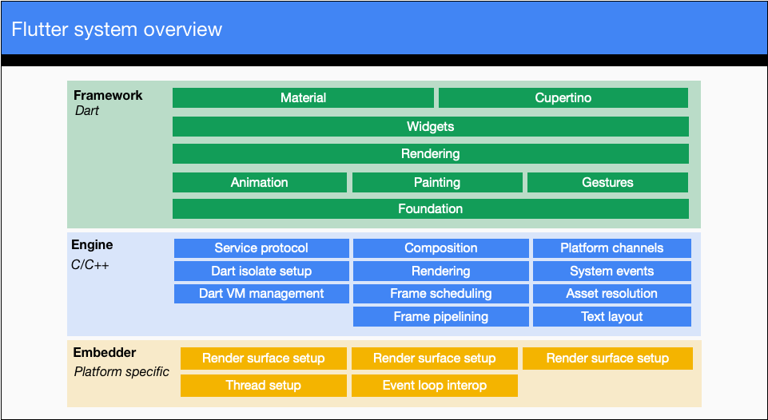

## Widget

Flutter 中万物皆为Widget。**Widget 的功能就是描述一个UI元素的配置信息**：

- 描述 UI 的层级结构 (通过`Widget`嵌套)；
- 定制 UI 的具体样式 (如：`font`、`color`等)；
- 指导 UI 的布局过程 (如：`padding`、`center`等)；

既然 Widget 只是描述一个UI元素的配置信息，那么真正的布局、绘制是由谁来完成的呢？Flutter 框架的处理流程是这样的：

1. 根据 Widget 树生成一个 Element 树，Element 树中的节点都继承自 `Element` 类。
2. 根据 Element 树生成 Render 树（渲染树），渲染树中的节点都继承自`RenderObject` 类。
3. 根据渲染树生成 Layer 树，然后上屏显示，Layer 树中的节点都继承自 `Layer` 类。

真正的布局和渲染逻辑在 Render 树中，Element 是 Widget 和 RenderObject 之间的桥梁。

[](https://github.com/AtsukoRuo/note/blob/47c4a2d257bac7490467abc1978cba4cd4ae0443/框架 中间件/Flutter/assets/2-2.59d95f72.png)


按照功能划分`Widget`大致可以分为 3 类：

- **「Component Widget」** —— 组合类 Widget，这类 Widget 都直接或间接继承于`StatelessWidget`或`StatefulWidget`。这就体现了组合大于继承的原则。如果只是使用 `RenderObjectWidget` 通过子级关系进行构建界面，将会导致代码结构非常复杂，而且难以复用。`StatelessWidget` 和 `StatefulWidget` 两个组件正是为了解决这个的问题，在 `build` 方法中组合其他组件完成构建逻辑。
- **「Proxy Widget」** —— 代理类 Widget，「Proxy Widget」本身并不涉及 Widget 内部逻辑，只是为「Child Widget」提供一些附加的中间功能。典型的如：`InheritedWidget`用于在「Descendant Widgets」间传递共享信息
- **「Render Widget」** —— 渲染类 Widget，是最核心的`Widget`类型，会直接参与后面的「Layout」、「Paint」流程。


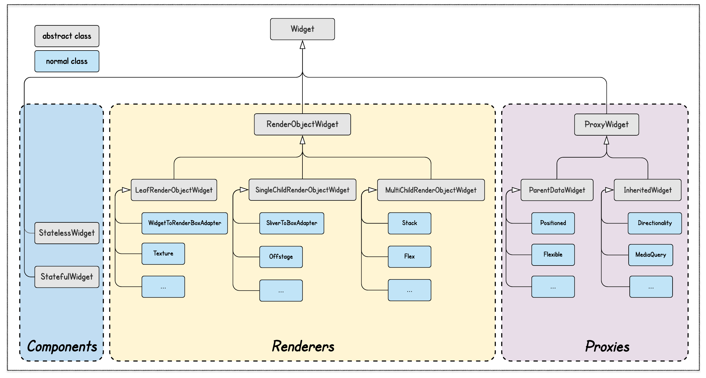

它的核心方法/属性有

- `Key key`：用于标识 widget

- `Element createElement()` ，每个`Widget`都有一个与之对应的`Element`，由该方法负责创建

- `static bool canUpdate(Widget oldWidget, Widget newWidget)`，默认实现如下：

  ~~~dart
  static bool canUpdate(Widget oldWidget, Widget newWidget) {
      return oldWidget.runtimeType == newWidget.runtimeType
          && oldWidget.key == newWidget.key
  }
  ~~~


在 Flutter 中，并不能主动删除或插入一个节点，也就是说，不能主动删除一个 Widget。但可以通过 Visbility 等组件来间接达成这一目的。

### StatelessWidget

~~~dart
abstract class StatelessWidget extends Widget {
  const StatelessWidget({ super.key });
  @override
  StatelessElement createElement() => StatelessElement(this);
  @protected
  Widget build(BuildContext context);
}
~~~

### StatefulWidget

`StatefulWidget`本身还是不可变的，其可变状态存在于`State`中。

~~~dart
abstract class StatefulWidget extends Widget {
  const StatefulWidget({ super.key });
    
  @override
  StatefulElement createElement() => StatefulElement(this);
    
  @protected
  @factory
  State createState();
}
~~~

### State

State 用于处理「Stateful Widget」的业务逻辑以及可变状态。State 的回调函数有：

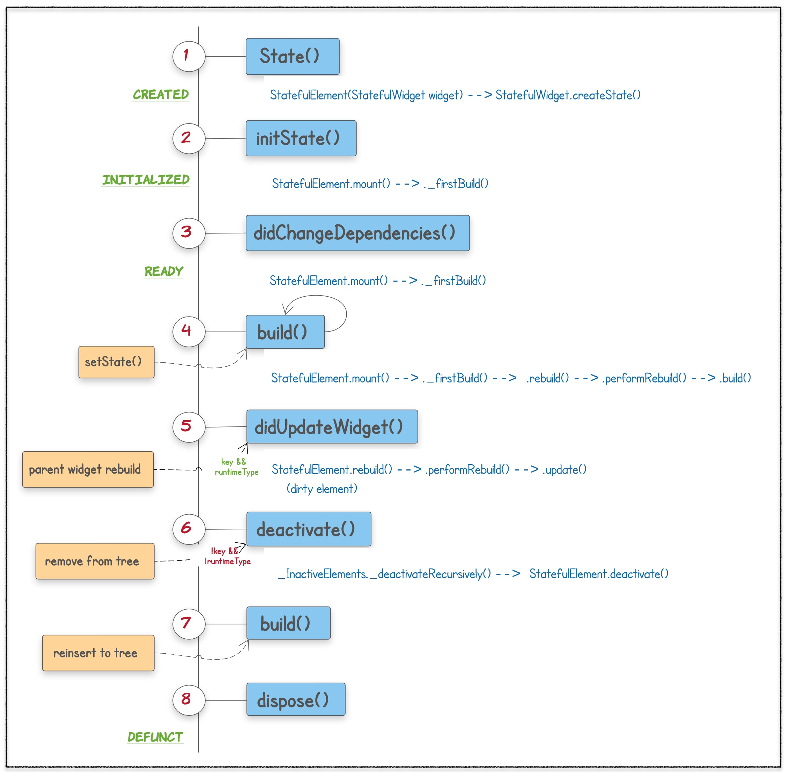

需要说明几点：

- State 实例有两个重要的属性

  - `widget`：指向与该 `State` 实例的`StatefulWidget`实例。注意，这种关联并非永久的

  - `context`：指向与该 State 实例关联的 Element 实例。

    ~~~dart
    Widget build(BuildContext context) {
        // 和参数 context 指向同一个对象
        this.context;				
        return Widget();
    }
    ~~~

- `State`实例与`Element`实例间的绑定关系一经确定，在整个生命周期内不会再变了。Element 对应的 Widget 可能会变，但对应的 State 永远不会变。

- `createState()` 用于创建和 `StatefulWidget` 相关的状态，它在`StatefulWidget` 的生命周期中可能会被多次调用。例如，当一个 `StatefulWidget` 同时插入到 `widget` 树的多个位置时，`Flutter` 框架就会调用该方法为每一个位置生成一个独立的`State`实例。这里多次插入的意思是：

  ~~~dart
  class CustomWidget extends StatelessWidget  {
    @override
    Widget build(BuildContext context) {
      StatefulWidget statefulWidget = new StatefulWidet();
        
      return Column(
      	children: [
              statefulWidget,			//多次插入，每一处插入都对应一个新的State实例
              statefulWidget,
              statefulWidget,
          ]
      )
    }
  }
  ~~~

- `StatefulWidget`中也可以保存状态，但当多个`State`实例对应一个`Widget`时，其中一个`State`调用`setState`来更新数据，而其他`State`却不能主动感知这一点，从而造成数据不一致问题。下面给出一个示例：

  ~~~dart
  class _MyAppState extends State<MyApp> {
    @override
    Widget build(BuildContext context) {
      StatefulWidget widget = CustomWidget();
      return Column(
        children: [
            widget,
            widget,
            widget,
        ],
      );
    }
  }
  
  class CustomWidget extends StatefulWidget {
    CustomWidget({super.key});
    int _j = 10;			// State公有的状态
    @override
    State<CustomWidget> createState() => _CustomWidgetState();
  }
  
  class _CustomWidgetState extends State<CustomWidget> {
    int i = 10;			// 每个State私有的状态
      
    @override
    Widget build(BuildContext context) {
      return GestureDetector(
        onTap: () {setState(() {i++; widget._j++;});},
        child: Container(
          width : 100, height: 100, color : Colors.red,
          child: Text("private: $i   public: ${widget._j}"),
        )
      );
    }
  }
  ~~~

- 在重新 build 时，会调用 `didUpdateWidget()` 方法

- 当`InheritedWidget`发生变化时，就会更新依赖它的子孙组件，也就是会调这些子孙组件的`didChangeDependencies()`方法


### Key

- LocalKey
  - ValueKey
  - ObjectKey：
  - UniqueKey： 保证每次都有一个唯一的标识符
- GlobalKey

Key 有两个作用：

- 用在 canUpdate 中，判断是否要更新 Widget

  ~~~dart
  static bool canUpdate(Widget oldWidget, Widget newWidget) {
      return oldWidget.runtimeType == newWidget.runtimeType && oldWidget.key == newWidget.key;
  }
  
  ~~~

- 通过 GlobalKey 来获取对应的 Context、State、Wdiget。

  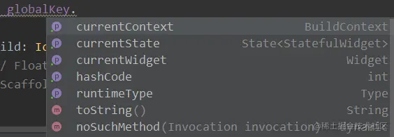

### ParentDataWidget

`ParentDataWidget`作为 `Proxy` 型 `Widget`，其功能主要是为其他 `Widget` 提供`ParentData`信息。

1. 在挂载`RenderObjectElement`过程中，会调用`attachRenderObject`方法。在该方法中会先将`Element`对应的`RenderObject`挂在到`RenderTree`上
2. 然后会寻找到最近祖先`ParentDataElement`。
3. 如果存在，那么通过 `ParentDataElement.widget` 获取祖先的 `renderObject`，并将其传入到 `ParentDataWidget#applyParentData(RenderObject renderObject)`
4. 子组件通常要覆写该方法，根据需要修改祖先 `renderObject`的一些属性。

### InheritedWidget

`InheritedWidget`作为 `Proxy` 型 `Widget`，其功能主要是在树中从上向下传递数据。

例如`TextDefault`、`Theme`、`MediaQuery`等组件都是`InheritedWidget`的子类。这些组件一般会提供`of`方法。

~~~dart
static MediaQueryData of(BuildContext context, { bool nullOk = false }) {
  final MediaQuery query = context.dependOnInheritedWidgetOfExactType<MediaQuery>();
  if (query != null)
    return query.data;
  if (nullOk)
    return null;
}
~~~

`dependOnInheritedWidgetOfExactType()` 以及 `getElementForInheritedWidgetOfExactType()`在 Widget 树中都向上查找最近的、特定类型的祖先`InheritedWidget`，然后返回数据。

只不过在调用`dependOnInheritedWidgetOfExactType()`时，`InheritedWidget`和依赖它的子孙组件关系便完成了注册，之后当`InheritedWidget`发生变化时，就会更新依赖它的子孙组件，也就是会调这些子孙组件的`didChangeDependencies()`方法。而`getElementForInheritedWidgetOfExactType()` 却不会。

这个注册的具体过程，请见 Element 小节的依赖部分

### RenderObjectWidget

一切要渲染到屏幕上的`Widget`，都是`RenderObjectWidget`类型。它有四个关键方法

- `RenderObjectElement createElement()`：一个抽象方法，需要子类覆写它

- `RenderObject createRenderObject(BuildContext context)` ：创建 Render Widget 对应的 Render Object，同样子类需要重写该方法。

  ~~~dart
  @override
  RenderFlex createRenderObject(BuildContext context) {
    return RenderFlex(
      direction: direction,
  	//...
    );
  }
  ~~~
  
- `void updateRenderObject(BuildContext context, covariant RenderObject renderObject)`：在 Widget 更新后，修改对应的 Render Object。这是一种渲染优化手段

  ~~~dart
  @override
  void updateRenderObject(BuildContext context, covariant RenderFlex renderObject) {
    renderObject
      ..direction = direction
      ..mainAxisAlignment = mainAxisAlignment
      //...
  }
  ~~~
  
  这些都是访问器，在访问器内部会执行`markNeedsPaint()`，从而触发重绘操作
  
- `void didUnmountRenderObject(covariant RenderObject renderObject)`


## BuildOwner

BuildOwner的主要作用有：

1. 维护`dirty elements`。在有「dirty elements」时，及时通知引擎，以便在下一帧对「dirty elements」的 rebuild，从而去刷新 UI；
2. 维护 `inactive Element`

整棵「Element Tree」共享同一个`BuildOwner`实例 (全局的)，而`BuildOwner`实例由`WidgetsBinding`负责创建。然后在`Element#mount`中，将 `BuildOwner` 复制给每个 `Element` 对象的 `_owner` 属性

~~~dart
@mustCallSuper
void mount(Element? parent, Object? newSlot) {
    // ...
    if (parent != null) {
          // Only assign ownership if the parent is non-null. If parent is null
          // (the root node), the owner should have already been assigned.
          // See RootRenderObjectElement.assignOwner().
          _owner = parent.owner;
    }
}
~~~


那么`BuildOwner`是如何收集「Dirty Elements」的呢？

1. 对于需要更新 UI 的 Widget，首先调用 setState

   ~~~dart
   void setState(VoidCallback fn) {
     	final dynamic result = fn() as dynamic;
     	_element.markNeedsBuild();
   }
   ~~~

2. 然后执行 markNeedsBuild

   ~~~dart
   void markNeedsBuild() {
         if (!_active) return;
         if (dirty) return;
         _dirty = true;
         owner.scheduleBuildFor(this);
   }
   ~~~
   
3. 执行 scheduleBuildFor

   ~~~dart
   void scheduleBuildFor(Element element) {
         onBuildScheduled();			// 会通知 Engine 在下一帧需要做更新操作；
         _dirtyElements.add(element);	// 将「Dirty Elements」加入到_dirtyElements中。
         element._inDirtyList = true;
   }
   ~~~
   

`onBuildScheduled()`之后的调用链如下：`scheduleBuildFor` -> `onBuildScheduled` -> `ensureVisualUpdate` -> `scheduleFrame`。而`scheduleFrame` 会向平台发送一个帧调度的请求

~~~dart
   void scheduleFrame() {
       // ...
       window.scheduleFrame();
   }
~~~

> `GPU` 和 `屏幕` 两者是供给关系，其中 `GPU` 会生成图像放入缓存区， `屏幕` 则从缓存区中获取图像。这就是一个 `生产者-消费者模型` 。
   >
   > 比如，这样当 `GPU` 的帧率过快，可能屏幕只渲染了一半， `GPU` 就把下一帧的图片数据塞到缓存区了。接下来屏幕下一半拿的数据就是下一帧内容，就会导致画面显示的 `撕裂` 。而 `Vsync` 就是为了将 `屏幕刷新频率` 和 `渲染帧率` 进行同步的一种信号。当 `VSync` 信号产生时，`GPU` 才会开始绘制


此后，在新一帧绘制到来时，`WidgetsBinding.drawFrame`会调用`BuildOwner.buildScope`方法。主要做的相关工作有：

1. 对「dirty elements」按在「Element Tree」上的深度排序。确保 parent 先于 child 被 rebuild，以免 child 被重复 rebuild，因为 parent 在 rebuild 时会递归地 update child。
2. 对_dirtyElements中的元素依次调用 rebuild
3. 清理 _dirtyElements

## Element

 Widget 本质上是 UI 的配置数据 （静态、不可变），Element 则是通过 Widget 生成的『实例』。Element 有以下主要职责：

- 根据 UI (「Widget Tree」) 的变化来维护「Element Tree」
- 维护「Render Tree」
- Widget 与 RenderObject 间的协调者。

Element 根据特点可以分为 2 类：

- **「Component Element」** —— 组合型 Element，「Component Widget」、「Proxy Widget」对应的 Element 都属于这一类型
- **「Renderer Element」** —— 渲染型 Element，对应「Renderer Widget」，其不同的子类型包含的子节点个数也不一样：
  - LeafRenderObjectElement 没有子节点
  - RootRenderObjectElement、SingleChildRenderObjectElement 有一个子节点
  - MultiChildRenderObjectElement 有多个子节点


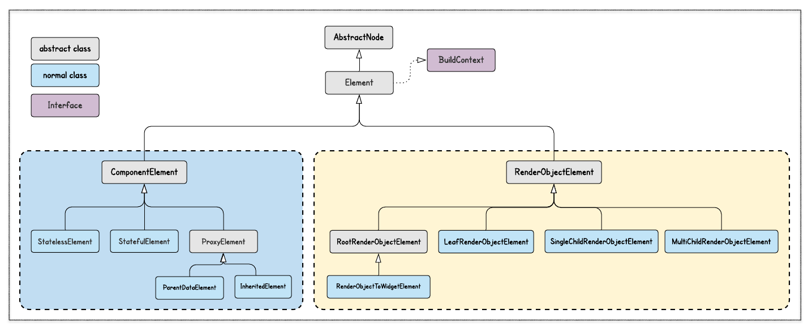


它的定义如下：

~~~dart
abstract class Element extends DiagnosticableTree implements BuildContext {
    Element? _parent;
  	Object? _slot;
}
~~~

父节点通过 `_slot` 来确定其下子节点的排列顺序。


Element 与其他几个核心元素间的关系：

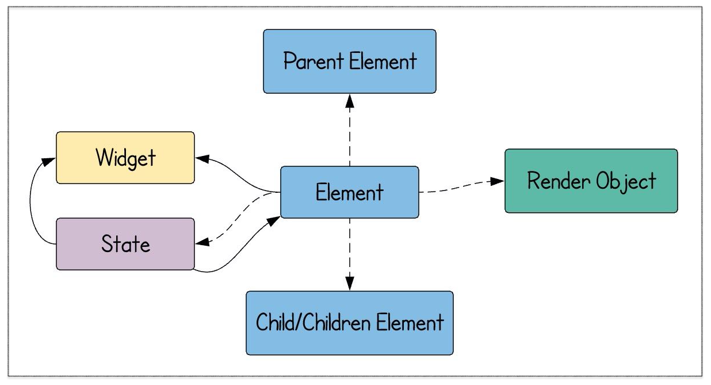

- Element 通过 parent、child 指针形成「Element Tree」
- Element 持有 Widget、「Render Object」
- State 是绑定在 Element 上的，而不是绑在「Stateful Widget」上

> 上述这些关系并Element 持有 Widget、「Render Object」不是所有类型的 Element 都有，如：「Render Object」只有「RenderObject Element」才有，State 只有「Stateful Element」才有。

### 生命周期

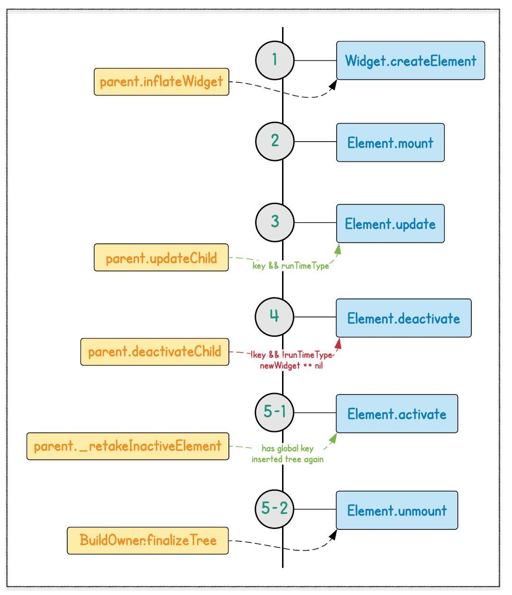

- Framework 调用`Widget.createElement` 创建一个 Element 实例
- Framework 调用 `element.mount(parentElement,newSlot)` ，mount 方法中首先调用`element`所对应 Widget 的`createRenderObject`方法，创建与`element`相关联的 RenderObjec t对象。然后调用`element.attachRenderObject`方法，将`element.renderObject`添加到渲染树中插槽指定的位置。插入到渲染树后的`element`就处于 active 状态。
- 当有父 Widget 的配置数据改变时，此时就需要重新构建对应的Element树。为了进行Element 复用，在 Element 重新构建前，会先尝试是否可以复用旧树上相同位置的element，即调用其对应Widget的`canUpdate`方法，如果返回`true`，则复用旧 Element，反之则会创建一个新的 Element。
- 当有祖先 Element 决定要移除`element` 时，这时该祖先 Element 就会调用`deactivateChild` 方法来移除它，移除后`element.renderObject`也会被从渲染树中移除，然后 Framework 会调用`element.deactivate` 方法，这时`element`状态变为 inactive 状态。
- inactive 态的 element 将不会再显示到屏幕。为了避免在一次动画执行过程中反复创建、移除某个特定 element， inactive 态的 element 在当前动画最后一帧结束前都会保留，如果在动画执行结束后它还未能重新变成 active 状态（重新插入到子树中），Framework 就会调用其`unmount`方法将其彻底移除，这时 element 的状态为`defunct`，它将永远不会再被插入到树中。


`BuildContext`就是 widget 对应的`Element`，所以我们可以通过`context`在`StatelessWidget`和`StatefulWidget`的`build`方法中直接访问`Element`对象。

### 核心方法

#### updateChild

`Element updateChild(Element child, Widget newWidget, dynamic newSlot)` ，根据传入参数的不同，有以下几种不同的行为（按顺序执行的）：

1. `newWidget` == `null` —— 说明子节点对应的 Widget 已被移除，直接调用`deactivateChild(child)` 来移除子树。
2. `child` == `null` —— 说明 newWidget 是新插入的，通过  `inflateWidget` 来创建新的 Element 并返回。
3. `child` != `null` —— 此时，分为 3 种情况（按顺序执行的）：
   1. 若 child.widget == newWidget，说明 child.widget 前后没有变化，若 child.slot != newSlot 表明子节点在兄弟结点间移动了位置，通过`updateSlotForChild`修改 child.slot 即可；然后立即返回 child
   2. 通过`Widget.canUpdate`判断是否可以用 newWidget 修改 child element，
      1. 若可以，则调用` child.update(newWidget)`方法；然后立即返回 child。
      2. 否则先调用`deactivateChild(child)` 来移除子树，然后通过  `inflateWidget` 来创建新的 Element 并返回。

#### update

在更新流程中，若`Widget.canUpdate`返回 `true`，则会走 `update` 方法，子类需要重写该方法以处理具体的更新逻辑：

1. Element 基类

   ~~~dart
   @mustCallSuper
   void update(covariant Widget newWidget) {
     _widget = newWidget;
   }
   ~~~

2. StatelessElement

   ~~~dart
   void update(StatelessWidget newWidget) {
     super.update(newWidget);
     _dirty = true;
     rebuild();
   }
   ~~~

   通过`rebuild`方法触发重建 child widget ，期间会调用到`StatelessWidget.build`方法 

3. StatefulElement，与 StatelessElement 类似，但需要处理 `State`

   1. 修改 State 的 `_widget`属性
   2. 调用`State.didUpdateWidget`

   最后，同样会触发`rebuild`操作，期间会调用到`State.build`方法。

4. ProxyElement：其主要通过 `notifyClients(oldWidget);` 通知关联对象 Widget 有更新。例如，`InheritedElement`会触发所有依赖者 rebuild

5. RenderObjectElement：调用了`widget.updateRenderObject`来更新「Render Object」

6. SingleChildRenderObjectElement

   ~~~json
   void update(SingleChildRenderObjectWidget newWidget) {
     super.update(newWidget);
     _child = updateChild(_child, widget.child, null);
   }
   ~~~

#### inflateWidget

`inflateWidget` 方法的主要职责：

- 通过 Widget 创建对应的 Element，并将其挂载 mount到「Element Tree」上。
- 如果 Widget 带有 GlobalKey，首先在 Inactive Elements 列表中查找是否有处于 inactive 状态的节点，如找到就直接调用 `updateChild()` 来复活该节点。

#### mount

当 Element 第一次被插入「Element Tree」上时，调用 mount 方法。，子类需要重写该方法以处理具体的挂载逻辑：

- Element：设置一些必要的属性例如，`_parent`、`_slot`、`_active`...，以及注册全局 Key
- ComponentElement：调用  `super.mount(parent, newSlot);` 以及 `rebuild();`
- RenderObjectElement：调用  `super.mount(parent, newSlot);`  ，再通过 `createRenderObject()`来创建 RenderObject，最后通过  `attachRenderObject()` 方法将其挂载在 RenderObject Tree 上
- SingleChildRenderObjectElement：在 `RenderObjectElement#mount()` 的基础上，调用`updateChild()`方法处理子节点

#### markNeedsBuild

markNeedsBuild 就是将当前 Element 加入`_dirtyElements`中，以便在下一帧可以`rebuild()`。下面这些场景会调用`markNeedsBuild()`：

- `State.setState`
- `Element.didChangeDependencies`
- ...

#### rebuild & performRebuild

在 rebuild 方法中，如果当前节点是活跃的、脏的，那么调用 `performRebuild()`:

~~~java
void rebuild() {
    if (_active && _dirty)
        performRebuild();
}
~~~


子类需要重写 `performRebuild()` 方法：

1. ComponentElement

   ~~~dart
   void performRebuild() {
     Widget built;
     built = build();
   
     _child = updateChild(_child, built, slot);
   }
   ~~~

   StatelessElement.build：`Widget build() => widget.build(this);`
   StatefulElement.build： `Widget build() => state.build(this);`
   ProxyElement.build：`Widget build() => widget.child;`

2. RenderObjectElement

   ~~~dart
   void performRebuild() {
     widget.updateRenderObject(this, renderObject);
     _dirty = false;
   }
   ~~~
   
   当然还有一些 RenderObjectElement 的继承类可能还做了其他逻辑，例如 updateChild

 

### 流程

根节点会调用 `inflateWidget`，随之被挂载到「Element Tree」上， 此后递归创建子节点；这里有一个基本假设，由于是在初始化树，所以对于 `updateChild()` 来说，它的 child 参数必定为 null，因此在存在 newChild 的情况下，一定会调用 `inflateWidget()`。

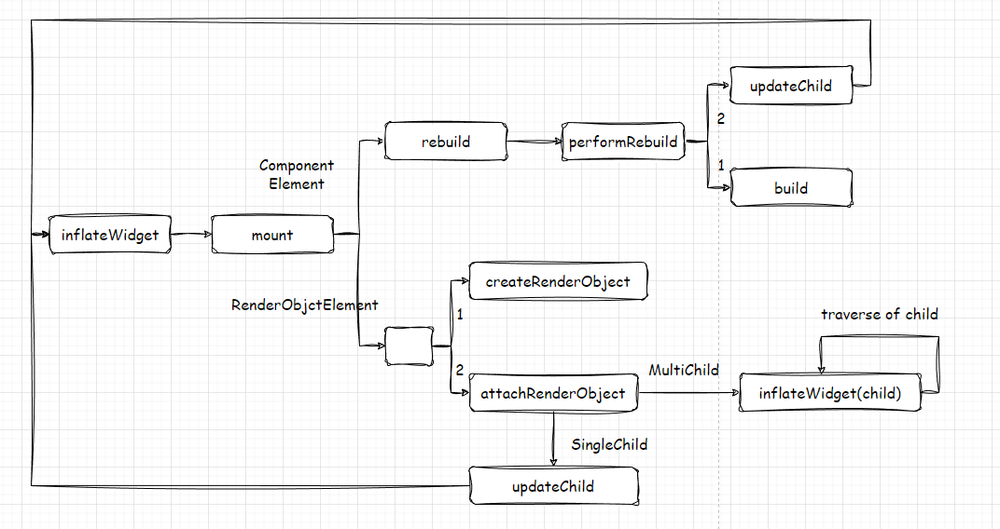


当调用 `markNeedsBuild()` 时，那么帧开始渲染时，对满足条件的节点调用 `rebuild`

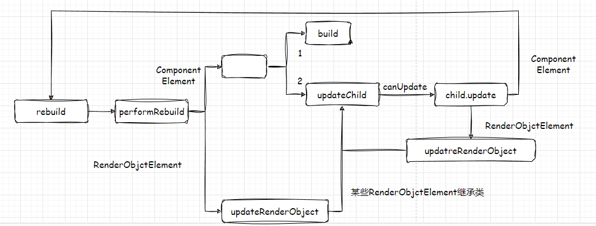

上图中并没有体现这一点：如果 `canUpdate()` 返回 false，那么调用 `inflateWidget()`


被销毁 —— element 节点所在的子树被移除。

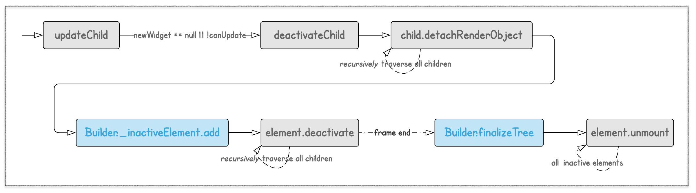

### 依赖

在 Element 基类中有这样两个成员：

```
Map<Type, InheritedElement> _inheritedWidgets;
Set<InheritedElement> _dependencies;
```

`_inheritedWidgets` 用来记录从当前节点到根节点这条路径上，代理节点有哪些。这样就避免每次注册时，都要遍历树来获取代理节点，这是一种优化手段。它的维护逻辑是这样的：在调用 `mount()` 挂载树时，会调用 `_updateInheritance`：

~~~dart
void _updateInheritance() {
  _inheritedWidgets = _parent?._inheritedWidgets;
}
~~~

在 `InheritedElement`类的实现中，其在父节点的基础上将自己加入到`_inheritedWidgets`中，以便其子孙节点的`_inheritedWidgets`包含它 

~~~dart
// 伪代码
void _updateInheritance() {
  final Map<Type, InheritedElement> incomingWidgets = _parent?._inheritedWidgets;
  _inheritedWidgets[widget.runtimeType] = this;
}
~~~


`_dependencies`用于记录当前节点依赖了哪些「Inherited Elements」，通常我们调用`context.dependOnInheritedWidgetOfExactType<T>`时就会在当前节点与目标 Inherited 节点间形成依赖关系。

## PaintingContext

`Painting Context`的主要职责包括

- 维护「Layer Tree」。
- 对 `Repaint Boundary`、`need Compositing` 的处理。
- 管理 `Canvas`，对底层细节进行抽象、封装。


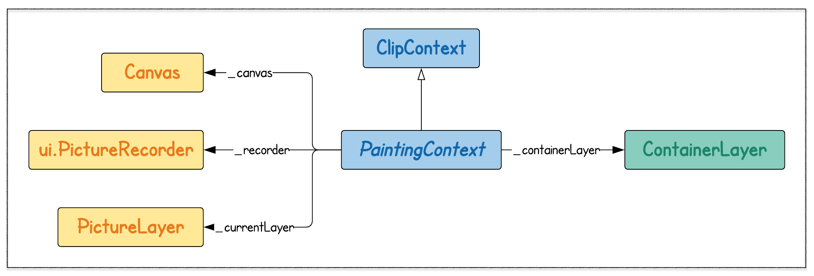

- `ClipContext`是抽象类，主要提供了几个与裁剪 (Clip) 有关的辅助方法；
- `PictureLayer _currentLayer`、`ui.PictureRecorder _recorder`以及`Canvas _canvas`都是用于具体的绘制操作；
- `ContainerLayer _containerLayer`：「Layer Subtree」的根节点

### 基础概念

#### Canvas

`Canvas`是 Engine(C++) 层向 Framework(Dart) 层暴露的接口，绘制在 Engine 层实现。`RenderObject` 正是通过`Canvas`来完成绘制任务的。

#### Picture

是一系列「graphical operations」的集合，对 Framework 层透明。在 Canvas 上执行的操作会映射会 graphical operations。

#### PictureRecorder

记录在`Canvas`上执行的「graphical operations」。

通过`PictureRecorder#endRecording`最终生成`Picture`。然后可以通过`Picture#toImage`来获取所有操作经光棚化后生成的 Image 对象

#### ScenBuilder

用于将多个图层(Layer)、Picture、Texture 合成为 Scene。通过`addPicture`、`addTexture`可以引入要合成的 Picture、Texture。

~~~dart
void addPicture(Offset offset, Picture picture, { bool isComplexHint = false, bool willChangeHint = false });

void addTexture(int textureId, { Offset offset = Offset.zero, double width = 0.0, double height = 0.0 , bool freeze = false});
~~~

同时，SceneBuilder 还会维护一个图形操作 stack：

```
pushTransform
pushOffset
pushClipRect
...
pop
```

这个 stack 与 canvas 的 save/restore 的作用类似

#### Scene

同样对 Framework 层透明，是一系列 Picture、Texture 合成的结果。它被送入 Engine 层，最终经 GPU 光栅化后显示在屏幕上。

#### 小案例

~~~dart
void main() {
  PictureRecorder recorder = PictureRecorder();
  Canvas canvas = Canvas(recorder);

  Paint circlePaint = Paint();
  circlePaint.color = Colors.blueAccent;

  canvas.drawCircle(Offset(400, 400), 300, circlePaint);

  Picture picture = recorder.endRecording();
  SceneBuilder sceneBuilder = SceneBuilder();
  sceneBuilder.pushOffset(-400, -400); // 定义屏幕左上角的坐标
  sceneBuilder.addPicture(Offset(0, 0), picture);
  sceneBuilder.pop();

  Scene scene = sceneBuilder.build();

  window.onDrawFrame = () {
    // 将 scene 送入 Engine 层进行渲染显示
    window.render(scene);
  };
  window.scheduleFrame();
}

~~~

为了支持多窗口，这个`window`对象已经`deprecated`了，推荐使用`View.of(context)`。

### 绘制流程

`PaintingContext` 与 `RenderObject`之间是**依赖关系**，即`PaintingContext` 作为参数出现在 `RenderObject` 的绘制方法中。`PaintingContext` 是一次性的，每次执行 `Paint` 时都会生成对应的 `PaintingContext`，当绘制完成时其生命周期也随之结束。

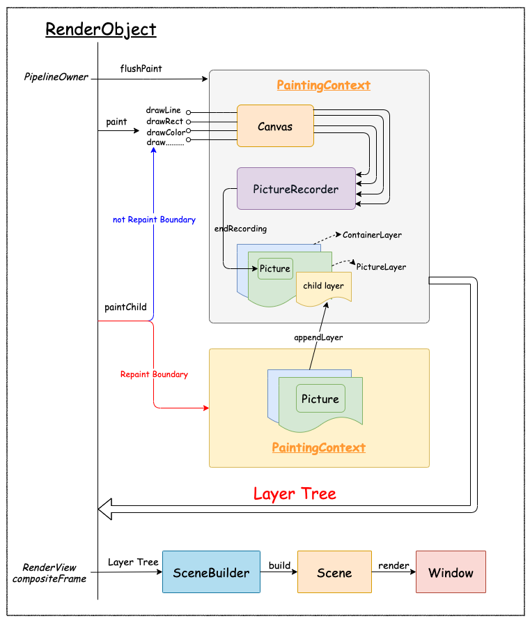

基本流程如下：

1. 在 UI Frame 刷新时，Flutter引擎通过`RendererBinding#drawFrame`->`PipelineOwner#flushPaint`来触发 `RenderObject#paint`；

2. `RenderObject#paint`调用`PaintingContext.canvas`所提供的图形操作接口(`draw*`、`clip*`、`transform`等)来完成绘制任务；

3. 上述绘制操作被 `PictureRecorder` 记录下来，在绘制结束时生成 `picture`，并被添加到 `PictureLayer` (`_currentLayer`)上；

   ~~~dart
   void _startRecording() {
       assert(!_isRecording);
       // 新的Layer
       _currentLayer = PictureLayer(estimatedBounds);
       
       _recorder = ui.PictureRecorder();
       // 初始化 Canvas，传入_recorder
       _canvas = Canvas(_recorder!);
       // 将_currentLayer插入以_containerLayer为根节点的子树上
       _containerLayer.append(_currentLayer!);
   }
   ~~~

   ~~~dart
   void stopRecordingIfNeeded() {
     // 在停止记录时，将结果 picture 加到 _currentLayer 上
     _currentLayer.picture = _recorder.endRecording();
      
     // 注意！此时_currentLayer、_recorder、_canvas 被释放，
     // 此后，若还要通过当前 PaintingContext 进行绘制，则会生成新的 _currentLayer、_recorder、_canvas
     // 即在 PaintingContext 的生命周期内 _canvas 可能会变
     _currentLayer = null;
     _recorder = null;
     _canvas = null;
   }
   ~~~

4. 随后，`RenderObject` 通过`PaintingContext#paintChild`递归地绘制子节点。在绘制子节点时，根据子节点是否是「Repaint Boundary」而采用不同的策略：

   1. 是「Repaint Boundary」— 为子节点生成新的 `PaintingContext`，从而子节点可以独立进行绘制，绘制结果就是一颗「Layer subTree」（此时会创建OffsetLayer），最后新创建的子树挂载到该节点的`Container Layer`上；

   2. 不是「Repaint Boundary」— 子节点直接绘制在当前`PaintingContext.canvas`上。此时多个 RenderObject 对应一个 Layer

      ~~~dart
      child._paintWithContext(this, offset);
      ~~~

5. 整个绘制流程结束时就得到了一棵「Layer Tree」，其后通过 SceneBuilder 生成 Scene，再经`window.render`送入 Engine 层，最终 GPU 对其进行光栅化处理，显示在屏幕上。


### 合成

`RenderObject.needCompositing`表示该 `RenderObject` 是否需要合成，即在`paint`方法中是否需要生成新的 `Layer`。

通常 `RenderObject`在`paint`时会通过`PaintingContext#push*`来处理 `Compositing`，也就是引入新的 Container Layer：

## Layer

Layer Tree 是 Flutter Framework 最终的输出产物，之后的流程就进入到 Flutter Engine 了。

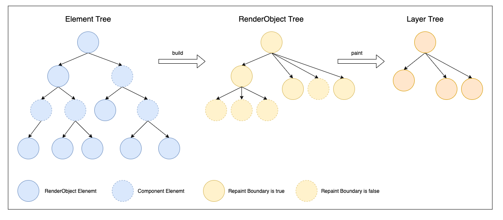

Layer 大致可以分为2类：

- Container Layer：作为 Layer 容器，用于管理一组 Layers。
- 非 Container Layer：真正用于承载渲染结果的 layer，在 Layer Tree 中属于叶结点。如：`PictureLayer`承载的是图片的渲染结果，`TextureLayer`承载的是纹理的渲染结果。

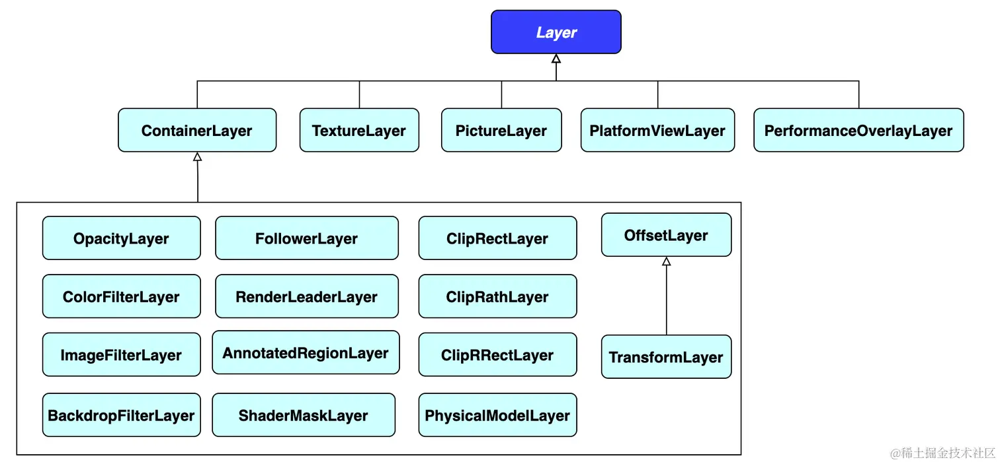


### EngineLayer

每个 Layer 实例都有一个与之对应的`EngineLayer`实例，它对 framework 透明，可以简单的理解为 engine 渲染的结果。`SceneBuilder`类有一系列的`push`方法 (如：`pushOffset`、`pushClipRect`等)，这些方法的返回值即为`EngineLayer`实例。例如：`ColorFilterLayer#addToScene`方法在调用`SceneBuilder#pushColorFilter`方法时就保存了其返回的`engineLayer`：

### needsAddToScene

在`Layer`内有一个非常重要的变量：`_needsAddToScene`，用于记录该 Layer 自上次渲染后(`addToScene`)是否发生了变化。可以表明该 layer 所持有的 EngineLayer 是否可以复用。它的维护见下图

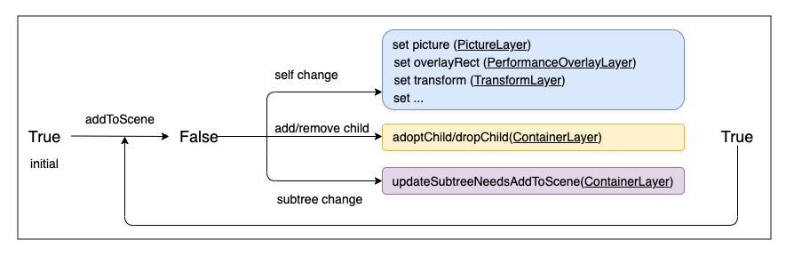

注意，当`Layer#alwaysNeedsAddToScene`为`true`时，表示该 layer 在每帧刷新时都需要重新渲染：

~~~dart
// Layer
@protected
@visibleForTesting
void updateSubtreeNeedsAddToScene() {
  	_needsAddToScene = _needsAddToScene || alwaysNeedsAddToScene;
}
~~~

### addToScene

`addToScene`方法可以说是`Layer`中最重要的方法之一，用于将 layer 送入 engin 进行渲染。

~~~dart
// Layer
@protected
void addToScene(ui.SceneBuilder builder);
~~~

## PipelineOwner

`PipelineOwner`在 Rendering Pipeline 中起到重要作用：

- 随着 UI 的变化而不断收集『 Dirty Render Objects 』
- 随之驱动 Rendering Pipeline 刷新 UI

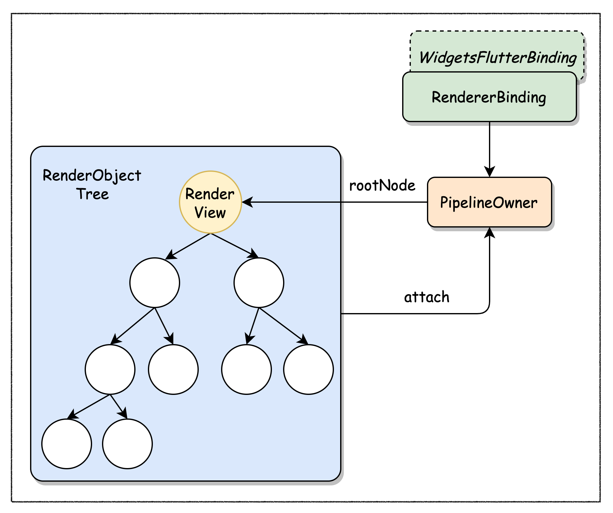


### Dirty RenderObjects

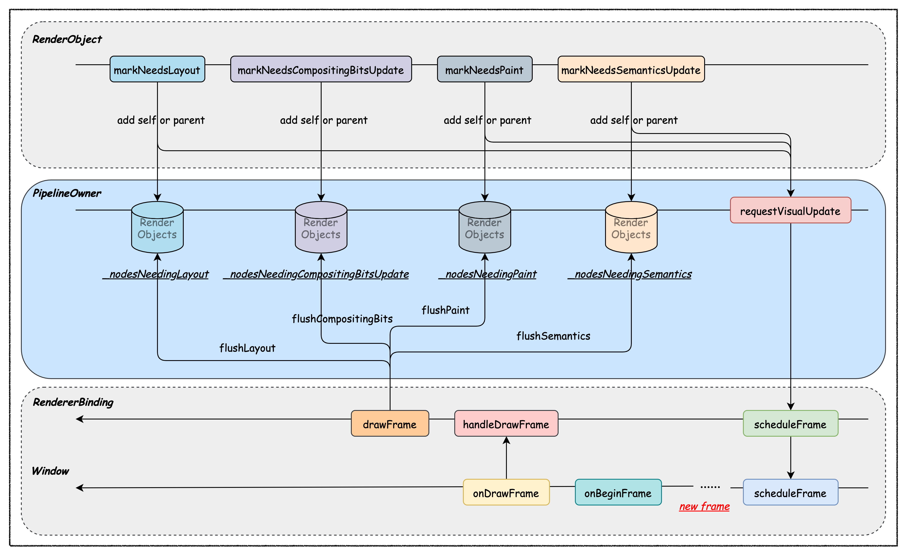

- 当 RenderObject 需要重新 layout 时，调用`markNeedsLayout`方法，该方法会将当前 RenderObject 加入 `PipelineOwner#_nodesNeedingLayout`
- 当 RenderObject 需要重新 paint 时，调用`markNeedsPaint`方法，该方法会将当前 RenderObject 加入`PipelineOwner#_nodesNeedingPaint`
- ...

可见 pelineOwner 收集所有 dirty 节点，并在下一帧刷新时批量处理，而不是实时更新 dirty ，从而避免不必要的重复 relaouy、repaint 等等。

## RenderObject

RenderObject 的职责概括起来主要有三点：

- Layout
- Paint
- Hit Testing

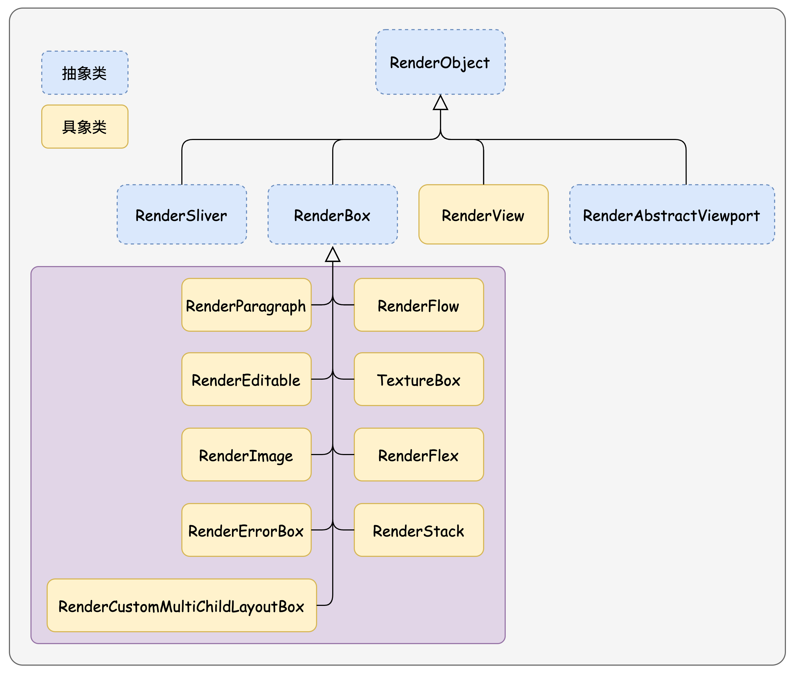

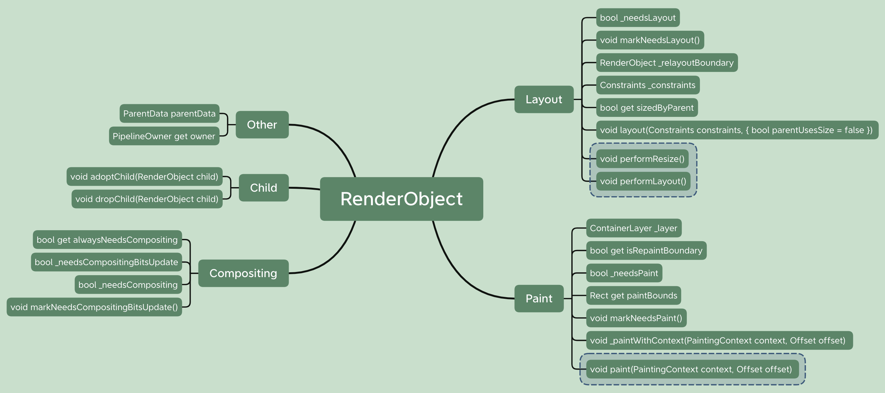


若某个 Render Object 的布局变化不会影响到其父节点的布局，则该 Render Object 就是『 Relayout Boundary 』。当某个 Render Object 是 Relayout Boundary 时，会切断 layout dirty 向父节点传播，即下一帧刷新时父节点无需 re-layout。

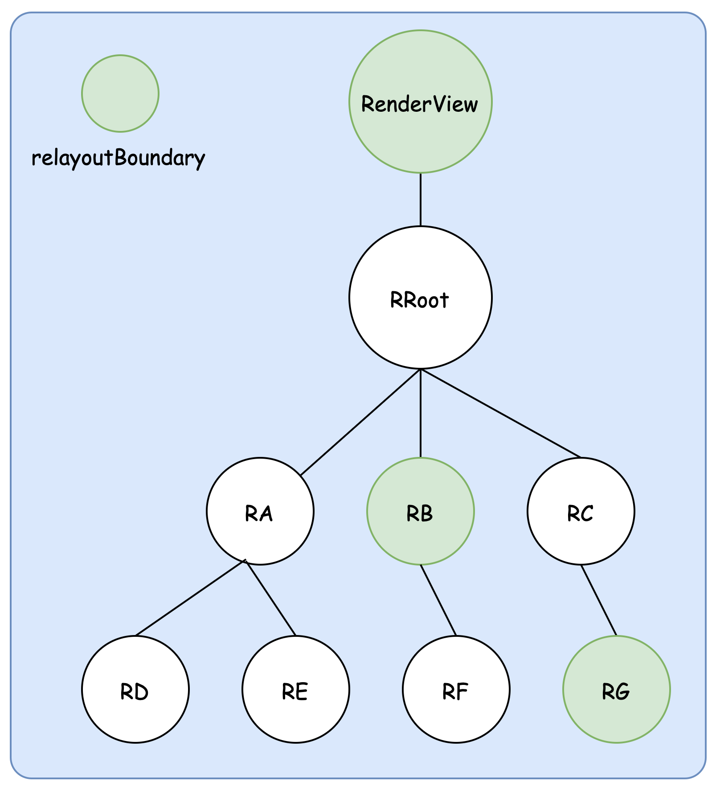

满足以下 4 个条件之一即可成为 Relayout Boundary：

- `parentUsesSize`为`false`，即父节点在 layout 时不会使用当前节点的 size 信息
- `sizedByParent`为`true`，即当前节点的 size 完全由父节点的 constraints 决定
- 传给当前节点的 constraints 是紧凑型 (Tight)
- 父节点不是 `RenderObject` 类型（处理根节点这种特殊情况，其父节点为nil）。


本质上，`layout`是一个模板方法，`RenderObject`的子类不应重写该方法。具体的布局工作由`performLayout`方法完成。一般情况下，由父节点在`performLayout`中调用子节点的`layout`方法来更新其整体布局。`RenderObject#performLayout`是一个抽象方法，子类需重写。

例如`RenderFlex#performLayout`：

~~~dart
// RenderFlex
void performLayout() {
  RenderBox child = firstChild;
  while (child != null) {
    final FlexParentData childParentData = child.parentData;
    BoxConstraints innerConstraints = BoxConstraints(minHeight: constraints.maxHeight, maxHeight: constraints.maxHeight);
    // 对所有子节点逐个调用layout方法；
    child.layout(innerConstraints, parentUsesSize: true);
    child = childParentData.nextSibling;
  }
  
  // 计算当前 Render Object 的 size
  size = constraints.constrain(Size(idealSize, crossSize));
  
  // ...
}
~~~


**Repaint Boundary** 有以下特点：

- 每个 **Repaint Boundary** 都有一个独属于自己的 OffsetLayer (ContainerLayer)，其自身及子孙节点的绘制结果都将 attach 到以该 layer 为根节点的子树上；
- 每个 Repaint Boundary 都有一个独属于自己的 PaintingContext (包括背后的 Canvas)，从而使得其绘制与父节点完全隔离开。

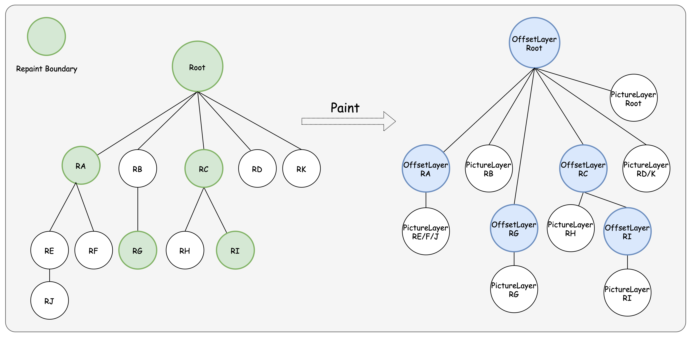

`RenderObject.isRepaintBoundary`属性决定了该渲染对象是否是**Repaint Boundary** 

~~~dart
bool get isRepaintBoundary => false;
~~~


Flutter Framework 为开发者预定义了`RepaintBoundary` widget，其继承自`SingleChildRenderObjectWidget`，在有需要时我们可以通过`RepaintBoundary` widget 来添加 Repaint Boundary。

~~~dart
// 对应的RenderObject对象
class RenderRepaintBoundary extends RenderProxyBox {
  @override
  bool get isRepaintBoundary => true;

	//,,,省略无关代码
}

~~~


抽象基类`RenderObject`中的`paint`是个空方法，需要子类重写。
`paint`方法主要有2项任务：

- 当前 Render Object 本身的绘制，如：`RenderImage`，其`paint`方法主要职责就是 image 的渲染

  ```
  void paint(PaintingContext context, Offset offset) {
    paintImage(
      canvas: context.canvas,
      rect: offset & size,
      image: _image,
      ...
    );
  }
  ```

- 绘制子节点，如：`RenderTable`，其`paint`方法主要职责是依次对每个子节点调用`PaintingContext#paintChild`方法进行绘制：

  ```dart
  void paint(PaintingContext context, Offset offset) {
    for (int index = 0; index < _children.length; index += 1) {
      final RenderBox child = _children[index];
      if (child != null) {
        final BoxParentData childParentData = child.parentData;
        context.paintChild(child, childParentData.offset + offset);
      }
    }
  }
  ```

此外，还可以通过在`PaintingContext#push*` 中根据`needCompositing`来决定是否引入新的`Container Layer`。

## runApp

|           | 顶级组件 Widget               | 顶级渲染对象 RenderObject | 顶级元素 Element              |
| --------- | ----------------------------- | ------------------------- | ----------------------------- |
| 类型      | `RenderObjectToWidgetAdapter` | `RenderView`              | `RenderObjectToWidgetElement` |
| 名称(get) | 匿名                          | `renderView`              | `_renderViewElement`          |
