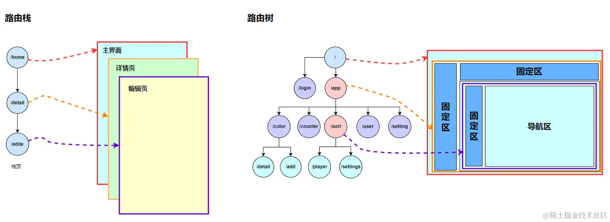
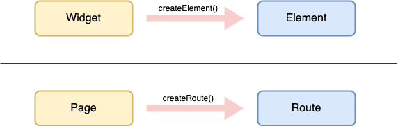

# 路由2.0

[TOC]

由于 Flutter 最初是针对移动端开发的，所以导航体系在最初是在维护路由栈的。 路由栈的全屏跳转是违反宽屏应用的交互习惯。所以 Flutter 在路由 2.0 中引入了路由树的概念。不仅可以实现局部跳转，而且可以基于数据来进行路由。此外，路由2.0 是声明式的，只需更新数据

~~~dart
class MyRouterDelegate extends RouterDelegate<List<RouteSettings>> with ChangeNotifier, PopNavigatorRouterDelegateMixin<List<RouteSettings>> {

  final List<Page> _pages = [];

  @override
  final GlobalKey<NavigatorState> navigatorKey = GlobalKey<NavigatorState>();

  @override
  Widget build(BuildContext context) {
    return Navigator(
      key: navigatorKey,
      pages: List.of(_pages),
      onPopPage: _onPopPage,
    );
  }

  @override
  Future<void> setNewRoutePath(List<RouteSettings> configuration) async {}

/// ……………省略部分代码………………
}
~~~

- 当路由被`pop`时，`onPopPage`会被回调

Page 对象从类结构来看，和 Widget 是非常类似的，都是提供配置信息的。但 Page 比 Widget 要简单地多：因为 Page 创建的 Route，所维护的结构是**线型的**（一维）；Widget 创建的 Element，所维护的结构是**树形的**（二维）。

