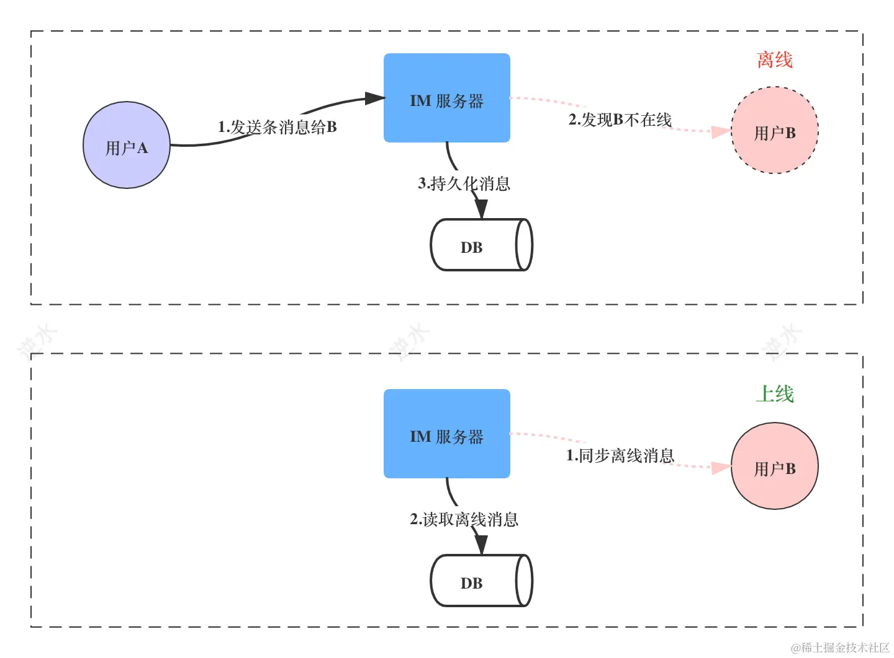
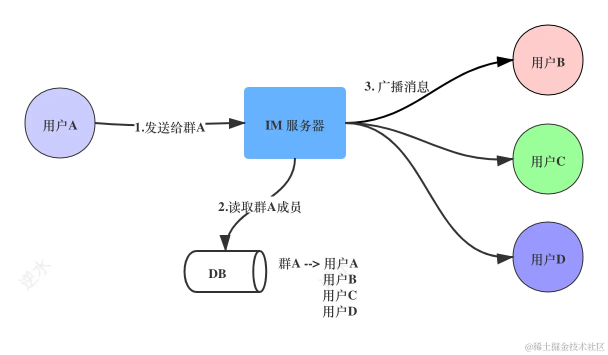
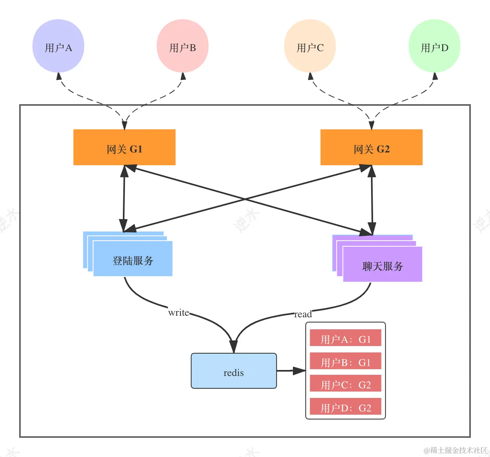
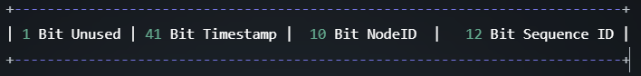
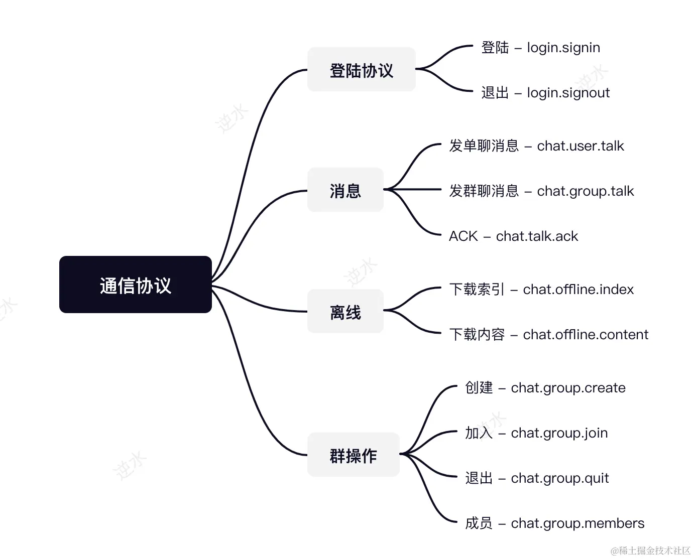

# 概述

[TOC]

单聊的实现逻辑：

群聊的实现逻辑：

## 如何维护长连接

影响长连接稳定的因素如下：

1. 在 NAT 网关中，它的地址转换表中有一个老化时间字段，如果连接空闲超过这个时间，转换记录就会被删除

   |          地区/网络           | NAT Aging-time |
   | :--------------------------: | :------------: |
   |         中国移动 4G          |     1分钟      |
   |       中国移动 3G、2G        |     5分钟      |
   |     中国联通 2G、3G、4G      |     5分钟      |
   |         中国电信 4G          |     5分钟      |
   |       中国电信 2G、3G        |   大于28分钟   |
   | 台湾和香港各大运营商  4G、3G |   大于28分钟   |
   |    美国各大运营商 4G、3G     |   大于28分钟   |

2. 防火墙会记录一条 tcp 会话数据，这个会话的也是有一个老化时间

3. 在 DHCP 协议中，如果租约到期，而不自动续租导致IP变更，连接也就中断。不过这种情况很少见。

4. 网络异常

5. 进程 Crash

**「心跳」**是指不间断的发送一个较小的数据包。通过心跳机制，可以解决因老化问题而导致的长连接丢失的问题。这就是心跳的**保活**作用。此外，心跳还可以用于检测连接是否存活，如果检测到失活，那么就立即**自动重连**。

TCP 协议也有心跳机制 —— tcp_keepalive ，它有三个关键参数：

~~~shell
# cat /proc/sys/net/ipv4/tcp_keepalive_time
7200
# cat /proc/sys/net/ipv4/tcp_keepalive_intvl
75
# cat /proc/sys/net/ipv4/tcp_keepalive_probes
9
~~~

在连接闲置 `tcp_keepalive_time`（2小时）后，发送探测包，如果收到回应ACK，便认为连接正常；否则间隔 `tcp_keepalive_intvl`（75秒） 后，持续发送探测包，一直到发送了 `tcp_keepalive_probes`（9）个探测包后，还未得到ACK回馈，便认为连接已经中断了。

像由于网络异常而导致的长连接丢失，只能不断尝试重连。如果服务器下线，那么不断的重连也无济于事。此时我们就要引入「智能路由」，将重连请求分发到一台正常运行的服务器上。这里有两种方案：

- 使用 **SLB（Server Load Balancer）**作为网关服务的负载层，例如使用 Nginx 等应用型负载均衡 ALB（Application Load Balancer）作为七层负载，或者使用传统型负载均衡 CLB（Classic Load Balancer）作为四层负载。

  

- **CLB（Client Load Balancer）**：把节点选择的逻辑放到了客户端，通过配置或者接口返回一批网关地址，由客户端选择一个正常的网关建立连接。

  

## 细节问题

### 字节序

因为不同机器类型可能采用不同标准的字节序，所以在设计通信层协议时必须要考虑大小端问题：

~~~go
a := uint32(0x01020304)
arr := make([]byte, 4)
binary.BigEndian.PutUint32(arr, a)	//[1 2 3 4]

binary.LittleEndian.PutUint32(arr, a)	//[4 3 2 1]
~~~

### 序列化

此外，我们还要考虑协议的序列化，下面是各个序列化的性能对比：

|   name   |     t.N     | ns/op | B/op | allocs/op |
| :------: | :---------: | :---: | :--: | :-------: |
|  自定义  | 290,041,615 | 4.299 |  0   |     0     |
| Protobuf |  5,633,020  | 205.6 |  56  |     2     |
|   Json   |  2,686,958  | 432.8 | 104  |     2     |

因此，强烈建议自定义序列化，虽然编码有点繁琐

### 粘包

当我们自己在 TCP 基础上设计私有二进制协议时，就需要考虑消息边界的问题了，即粘包问题。有两种解决方案：

- 使用分隔符
- 协议中定义一个长度字段

## 逻辑设计

两个设计要点：

- 使用缓存 redis 来存储登录会话，使服务变为无状态，达到水平扩展的目的。
- 在微服务体系中，通常都会有网关层。通过把鉴权、限流之类的通用逻辑分离到网关中，后端服务就只需要关注业务逻辑的实现。

但是「会话存储」与「逻辑服务」分离的后果，就是消息转发性能下降，特别是群消息转发。比如一个群成员有 500 人，一次消息转发就需要访问 500 次缓存。不过优化的方法还是有很多的，我们在后面章节再介绍。

## 系统架构

- SDK 层：
  1. `ApiGateway`: API 接口网关，对外开放 Service 提供的部分服务。
  2. `Router`：网关层智能路由，SDK 通过调用 Router 提供的接口路由到指定的网关
- 网关层：
  1. `WGateway/TGateway`：长连接网关，它们功能完全相同，WGateway 提供 Websocket 协议的连接服务，TGateway 提供 TCP 协议的连接服务。
- 逻辑服务层：
  1. `LoginServer`: 登录服务，提供登录、退出等服务，会话保存在 redis 中。
  2. `ChatServer`: 聊天服务，提供单聊、群聊、离线消息同步等功能。
  3. `Royal`: RPC 服务，提供了用户管理、群管理、消息管理、登录授权等服务。

## 技术选型

消息的存储必须有一个全局唯一 ID。这里我们使用**雪花算法**（https://github.com/bwmarrin/snowflake）来生成 ID

在使用 snowflake 时，有两点要注意：

- Make sure your system is keeping accurate system time
- Make sure you never have multiple nodes running with the same node ID

对于网络连接 ID 的生成，我们使用 `ksuid` 库。

我们使用 `Iris` 框架来开发 Restful 端口，作为各个组件之间的服务调用（可以使用 RPC 来代替）

对于协议的传输，除了使用自定义序列化外，我们还会使用 `protobuf`

对于 Websocket 框架，我们使用 [github.com/gobwas/ws](https://link.juejin.cn/?target=https%3A%2F%2Fgithub.com%2Fgobwas%2Fws) 

ORM 框架选用 `gorm`

注册中心选用 **Consul**

## 通讯协议

### 逻辑协议

协议的结构：

~~~go
type LogicPkt struct {
	Header
	Body []byte `json:"body,omitempty"`
}
~~~

Header 指消息头，在系统中我们直接使用 protobuf 来序列化 Header，格式如下：

|    属性    |  类型   |       说明       |
| :--------: | :-----: | :--------------: |
|  command   | string  |       指令       |
| channelId  | string  |     连接标识     |
|  sequence  | uint32  |      序列号      |
|    flag    |  enum   |                  |
|   status   |  enum   |      状态码      |
|    dest    | string  |  目标：群、用户  |
|    Meta    | []*Meta | Key-Value 元信息 |
| bodyLength | uint32  |   消息体的长度   |

- `command` ：它的格式为 `服务名.指令`，所有 command 如下：

  

- `sequence`：将响应与请求配对起来

- `channelId`：用户标识 ID 在空间维度是唯一的，但是在时间维度是不唯一。简单来说就是同一个用户账号存在同时登录的情况，我们可以使用 `channelId` 来解决这个问题。

  在会话管理中，将 `Account` 用户标识与 `{ChannelID， Gateway}` 关联起来。而在 Gateway 的连接管理中，将 `ChannelID` 与 `ip:port` 关联起来。

- `flag`

  - `Request`: 表示一条请求消息，通常是客户端发起
  - `Response`: 表示一条响应消息，通常是指令处理器返回
  - `Push`: 表示一条推送消息，通常是指令处理器转发出去

- `dest`：指定消息的接收方，在 IM 系统中有两类接收方：用户和群，分别用 Account 和 GroupId 表示

### 基础协议

如果我们直接在**逻辑协议**基础上添加心跳指令不太合适，这是因为：

- 心跳在网关层就返回，不转发给逻辑服务处理。
- 心跳包要尽量小，逻辑协议的Header太重。

因此，我们引入一个基础协议，来处理轻量的消息：

| 消息指令 Command | 消息长度 Length | 消息载体 Body |
| :--------------: | :-------------: | :-----------: |
|      2bytes      |     2bytes      |    n bytes    |

~~~go
type BasicPkt struct {
	Code   uint16
	Length uint16
	Body   []byte
}
~~~

**ping/pong的code设计如下**：

| 协议code | 说明 |
| :------: | :--: |
|    1     | ping |
|    2     | pong |

### 序列化

逻辑协议与基础协议都实现了 Packet 接口：

~~~go
type Packet interface {
	Decode(r io.Reader) error
	Encode(w io.Writer) error
}
~~~

我们通过魔数来区分两种不同的协议：

~~~go
type Magic [4]byte

var (
	MagicLogicPkt = Magic{0xc3, 0x11, 0xa3, 0x65} //逻辑协议
	MagicBasicPkt = Magic{0xc3, 0x15, 0xa7, 0x65} //基础协议
)
~~~

这个魔数并不在协议中体现，而是在发送时，自动添加在消息头部的前面。在接收时，判断完是何种协议后，在去除掉魔数。

