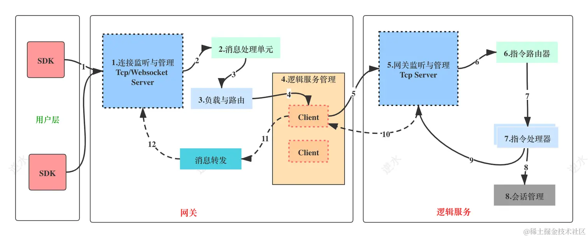
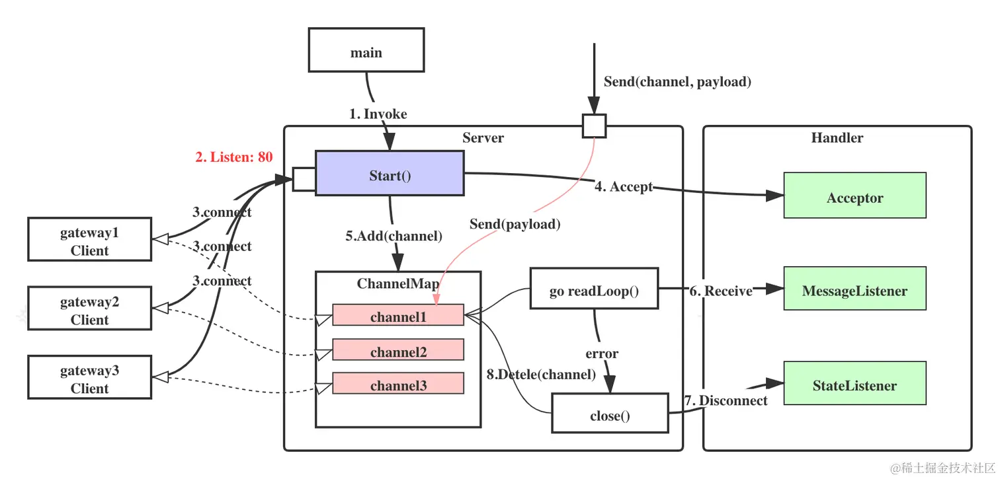
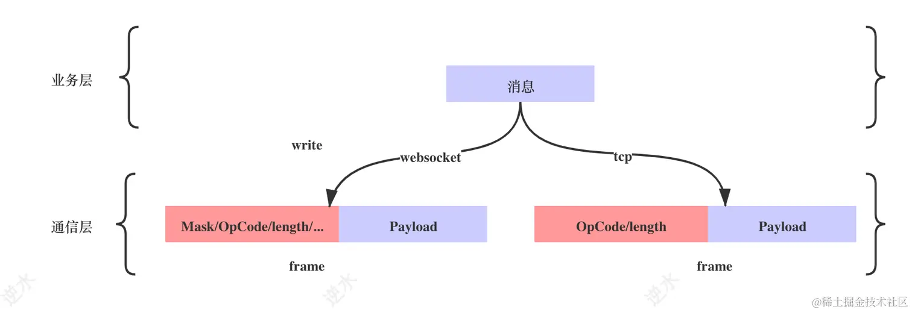
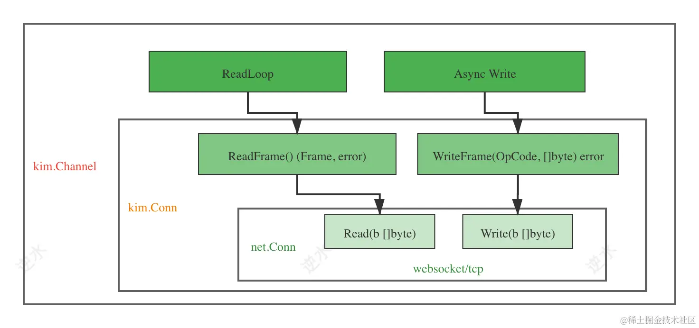
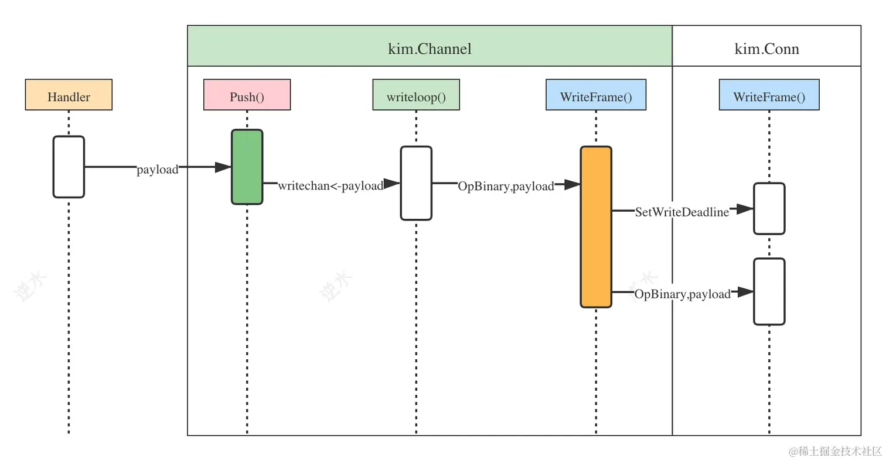

# 通讯层

[TOC]

把 websocket 和 tcp 协议封装到通信层内部，提供抽象接口给上层使用，达到业务逻辑与通信协议解耦的目的。同时，通信层封装了**端口监听、拨号连接、消息发送、消息接收、心跳、连接管理** 等逻辑，在不同协议上进行复用。

系统内部一个大致的逻辑关系如下：



从中我们可以抽象出来两个通讯层接口：

1. Server：定义服务端接口，监听并维护连接。
2. Client：定义客户端接口，与服务端建立连接，并提供消息收发功能。

## Server 接口

Server 接口处理的流程如下：



接口定义如下：

~~~go
type Server interface {
    ServiceRegistration
    SetAcceptor(Acceptor)
    SetMessageListener(MessageListener)
    SetStateListener(StateListener)
    SetReadWait(time.Duration)
    SetChannelMap(ChannelMap)
    Start() error
    Push(string, []byte) error
    Shutdown(context.Context) error
}
~~~

- `ServiceRegistration`：用于服务发现中，在容器层我们会讲解

- `SetAcceptor`：用于设置一个 Acceptor，在 Server 的 Start() 方法中监听到连接之后，就要调用这个 Accept 方法，让上层业务处理握手相关的工作。

  ~~~go
  type Acceptor interface {
      // 这里的 Conn 是我们对 net.Conn 的封装。
  	Accept(Conn, time.Duration) (string, error)
  }
  ~~~

  Accept 会返回以下对象

  - `channelID`：作为该连接的唯一标识
  - `error`：如果上层业务返回一个 error，那么连接就会被 Server 断开。

- `SetStateListener`：用于设置一个状态监听器，将连接断开的事件上报给业务层，让业务层可以实现一些逻辑处理。

  ~~~go
  type StateListener interface {
  	Disconnect(string) error
  }
  ~~~

- `SetReadWait`：设置连接读超时，用于心跳逻辑中。

- `SetChannelMap`： 设置一个连接管理器，Server 会自动在内部管理这些连接

  ~~~go
  type ChannelMap interface {
  	Add(channel Channel)
  	Remove(id string)
  	Get(id string) (Channel, bool)
  	All() []Channel
  }
  ~~~

  它管理的对象是 Channel，而不是具体的一个 Conn 连接对象。实际上，Channel 就是对 Conn 的封装。这里的 Conn 是我们对 net.Conn 的封装。

- `SetMessageListener`：用于设置一个消息监听器，当收到消息时，把消息回调给上层业务处理器。

  ~~~go
  type MessageListener interface {
  	Receive(Agent, []byte)
  }
  ~~~

  Agent 表示发送方，它定义了两个方法：

  ~~~go
  type Agent interface {
      ID() string
      Push([]byte) error
  }
  ~~~

  - Push：用于向发送方返回消息
  - ID : 返回当前连接的 channelID
  
- Push：发送消息到特定客户端

## 拆包

由于我们通信协议是以 TCP / WS 为载体的，所以`[]byte` 必须是完整的数据包，否则上层业务在解析协议时就会失败；但是 websocket 与 tcp 数据封包与拆包逻辑不同：

- TCP 协议是字节传输，通常需要上层业务处理拆包。
- Websocket 协议是基于 Frame，在底层 Server 中就可以区分出每一个 Frame，然后把 Frame 中的 Payload 交给上层。

因此，我们通过两个抽象，来解决 WS 与 TCP 拆包逻辑不同的问题。

首先对协议进行抽象。这里我们在 TCP 协议的基础上，直接封装一个类似于 WS 的协议，在这个简易协议上再承载我们的通讯协议。这样好统一接口。

~~~go
// 一个 Frame 中包括了 OpCode、Payload
type Frame interface {
	SetOpCode(OpCode)
	GetOpCode() OpCode
	SetPayload([]byte)
	GetPayload() []byte
}

// 简易协议的 OpCode 与 WS 保持一致，这样方便处理
const (
	OpContinuation OpCode = 0x0
	OpText         OpCode = 0x1
	OpBinary       OpCode = 0x2
	OpClose        OpCode = 0x8
	OpPing         OpCode = 0x9
	OpPong         OpCode = 0xa
)
~~~



然后通过对 net.Conn 进行二次包装，把读/写 Frame 的操作封装到 Conn 中

~~~go
type Conn interface {
	net.Conn
	ReadFrame() (Frame, error)
	WriteFrame(OpCode, []byte) error
	Flush() error
}
~~~


## Client 接口

客户端接口的定义：

```golang
type Client interface {
	ID() string
	Name() string
	Connect(string) error
	SetDialer(Dialer)
	Send([]byte) error
	Read() (Frame, error)
	Close()
}
```

- `Connect`：主动向一个服务器地址发起连接。

- `SetDialer`：设置一个拨号器，这个方法会在 Connect 中被调用，完成连接的建立和握手。由上层业务主动调用该方法，来注册一个 Dialer

  ~~~go
  type Dialer interface {
      // DialerContext 由 Client 回传到该方法中
  	DialAndHandshake(DialerContext) (net.Conn, error)
  }
  
  type DialerContext struct {
  	Id      string
  	Name    string
  	Address string
  	Timeout time.Duration
  }
  ~~~

- `Send`：发送消息到服务端。

- `Read`：读取一帧数据

- `Close`：断开连接，退出

## Channel、Conn

Conn 以及 Frame 的意义在于解决了 websocket/tcp 两种协议读、写逻辑上的差异。而 Channel 对 Conn 进行了再次封装，提供了异步写、读通知的功能。

Channel、Conn、net.Conn 这三者之间的关系见下图：




下面我们给出 Channel 的定义：

~~~go
type Channel interface {
	Conn   
	Agent
	Close() error // 重写net.Conn中的Close方法
	Readloop(lst MessageListener) error
	SetWriteWait(time.Duration)
	SetReadWait(time.Duration)
}

type Agent interface {
	ID() string
	Push([]byte) error
}
~~~

核心方法为：

1. Push：实现了消息的异步批量发送，它是线程安全的。
2. Readloop：它把消息的读取和心跳处理的逻辑封装在一起，它是阻塞的。

这里将从 Channel 读取的逻辑抽离到 Readloop 中了，而对 Channel 写入的逻辑抽象到 Agent#Push 方法上，这是因为我们并不希望 Channel 被上层业务直接操作，比如，误调用 Close()而导致连接关闭。

### Write

在 Channel 的 Write 逻辑中，我们主要做了如下两件事：

- 在 Channel 实现中，我们定义了一个名为 writechan 的管道。消息直接通过 writechan 发送给` goruntine writeloop()`执行，这样就使得 Push 变成了一个线程安全方法。
- Channel 实现重写了 Conn 中的 WriteFrame 方法，增加了重置写超时的逻辑。




~~~go
func (ch *ChannelImpl) Push(payload []byte) error {
	if ch.closed.HasFired() {
        // 该连接已被关闭，此时禁止发送消息
		return errors.New("channel has closed")
	}
	// 异步写
	ch.writechan <- payload
	return nil
}

// 对 conn 再次封装
func NewChannel(id string, conn Conn) Channel {
	log := logger.WithFields(logger.Fields{
		"module": "tcp_channel",
		"id":     id,
	})

	ch := &ChannelImpl{
		id:        id,
		Conn:      conn,
		writechan: make(chan []byte, 5),
	}

	go func() {
		err := ch.writeloop()
		if err != nil {
			log.Info(err)
		}
	}()

	return ch
}

func (ch *ChannelImpl) writeloop() error {
	for {
		select {
		case payload := <-ch.writechan:
			err := ch.WriteFrame(OpBinary, payload)
			if err != nil {
				return err
			}
            // 批量写
			chanlen := len(ch.writechan)
			for i := 0; i < chanlen; i++ {
				payload = <-ch.writechan
				err := ch.WriteFrame(OpBinary, payload)
				if err != nil {
					return err
				}
			}
			err = ch.Conn.Flush()
			if err != nil {
				return err
			}
         // 退出写线程
		case <-ch.closed.Done():
			return nil
		}
	}
}
~~~

### Read

~~~go
func (ch *ChannelImpl) Readloop(lst MessageListener) error {
	ch.Lock()
	defer ch.Unlock()
	log := logger.WithFields(logger.Fields{
		"struct": "ChannelImpl",
		"func":   "Readloop",
		"id":     ch.id,
	})

	for {
		_ = ch.SetReadDeadline(time.Now().Add(ch.readwait))
		frame, err := ch.ReadFrame()
		// 将心跳包和数据包一起读取的
		if err != nil {
			// 读超时
			return err
		}
		if frame.GetOpCode() == OpClose {
			return errors.New("remote side close the channel")
		}
		if frame.GetOpCode() == OpPing {
			// 处理心跳逻辑
			log.Trace("recv a ping; resp with a pong")
			_ = ch.WriteFrame(OpPong, nil)
			continue
		}

		payload := frame.GetPayload()
		if len(payload) == 0 {
			continue
		}
		
		go lst.Receive(ch, payload)
	}

}
~~~

## 通信层框架


## WS 实现

### Server

Server 的核心逻辑在 Start() 方法

~~~go
func (s *Server) Start() (err error) {
	mux := http.NewServeMux()
	// 省略 Server 等对象的初始化过程
	
    //  '/' 路径的请求转发到一个匿名处理器上
	mux.HandleFunc("/", func(w http.ResponseWriter, r *http.Request) {
        // 将 HTTP 升级到 WebSocket 协议
		rawConn, _, _, err := ws.UpgradeHTTP(r, w)
		if err != nil {
            // 告知客户端，协议升级失败
			resp(w, http.StatusBadRequest, err.Error())
			return
		}
		
        // 将  WebSocket Conn 封装为 im.Conn
		conn := NewConn(rawConn)
		
         // 回调给上层业务，完成权限认证之类的逻辑处理
         // 同时返回一个 ID， 用于标识连接
		id, err := s.Accept(conn, s.options.loginwait)
		if err != nil {
			_ = conn.WriteFrame(im.OpClose, []byte(err.Error()))
			conn.Close()
			return 
		}
		
        // 如果连接 ID 尚不存在，则通过 s.Add(channel) 将 im.Channel 添加到 im.ChannelMap 连接管理器中。否则调用`conn.WriteFrame(im.OpClose, []byte("..."))` 通知对端关闭连接
		if _, ok := s.Get(id); ok {
			log.Warnf("channel %s existed", id)
			_ = conn.WriteFrame(im.OpClose, []byte("channelId is repeated"))
			conn.Close()
			return
		}
		
        // 将 im.Conn 封装为 im.Channel
		channel := im.NewChannel(id, conn)
		channel.SetWriteWait(s.options.writewait)
		channel.SetReadWait(s.options.readwait)
		s.Add(channel)
		
         // 在一个协程中，开启 Readloop 来死循环读取消息
		go func(ch im.Channel) {
			err := ch.Readloop(s.MessageListener)
			if err != nil {
				log.Info(err)
			}
			s.Remove(ch.ID())
			// 回调上层，通知关闭事件
			err = s.Disconnect(ch.ID())
			if err != nil {
				log.Warn(err)
			}
			ch.Close()
		}(channel)
	})
	log.Infoln("started")
	return http.ListenAndServe(s.listen, mux)
}
~~~

### Client

client 主要逻辑有四个：

- `Connect`：回调  Dialer.DialAndHandshake 方法建立并返回连接。同时开启 heartbeatLoop 协程来维护心跳
- `heartbeatLoop`：定期发送一个 ping 的心跳包给服务端，如果读超时后仍未获取响应，那么退出 heartbeatLoop 协程。注意，这是一个双向机制，因为在服务端，读取逻辑是将心跳包和消息一并处理的，如果服务端读超时，那么就会断开连接。
- `Read`：读取消息，简单封装了 ws.ReadFrame
- `Send`：发送消息，简单封装了 wsutil.WriteClientMessage、

## Shutdown

Client Shutdown 逻辑是 `c.conn.Close()`，即直接关闭底层连接。而 Server Shutdown 逻辑是对每个连接调用 Channel#Close()，该方法仅仅关闭 `ch.writechan` 而已。

Client 先 Shutdown 后的流程

1. Client 关闭底层连接
2.  Server 的 Readloop 因读超时而异常退出，此时将连接从 ChannelMap 中剔除，然后调用 Channel#Close()，在该方法中发送  ch.closed，这又导致 writeloop 协程退出

Server 先 Shutdown 后的流程

1. 调用 Channel#Close()，在该方法中发送  ch.closed，这又导致 writeloop 协程退出
2. Client 此时调用 Read()、Send() 直接返回错误。

## TCP 实现

Server 接口的实现和 WS 类似，这里就不给出代码。

而 Client 的 Connet 方法与 websocket 中 Connect 唯一不同之处是`c.conn = NewConn(rawconn)`。这是因为 Client 发起的是 TCP 连接，我们必须封装一下，来兼容我们的 Frame 帧格式，否则 Server 无法直接在 TCP 连接上直接解析 Conn 接口所规定的协议。

当然，我们也可以直接在 TCP 流上写入，但是这无疑增大工作量，不如复用现有的逻辑。


## 通讯协议

### 逻辑协议

协议的结构：

~~~go
type LogicPkt struct {
	Header
	Body []byte `json:"body,omitempty"`
}
~~~

Header 指消息头，在系统中我们直接使用 protobuf 来序列化 Header，格式如下：

|   属性    |  类型   |       说明       |
| :-------: | :-----: | :--------------: |
|  command  | string  |       指令       |
| channelId | string  |     连接标识     |
| sequence  | uint32  |      序列号      |
|   flag    |  enum   |                  |
|  status   |  enum   |      状态码      |
|   dest    | string  |  目标：群、用户  |
|   Meta    | []*Meta | Key-Value 元信息 |


- `command` ：它的格式为 `服务名.指令`，所有 command 如下：

  

- `sequence`：将响应与请求配对起来

- `channelId`：同一个用户账号存在同时登录的情况，我们可以使用 `channelId` 来解决这个问题。

  在会话管理中，将 `Account` 用户标识与 `{ChannelID， Gateway}` 关联起来。而在 Gateway 的连接管理中，将 `ChannelID` 与 `ip:port` 关联起来。

- `flag`

  - `Request`: 表示一条请求消息，通常是客户端发起
  - `Response`: 表示一条响应消息，通常是指令处理器返回
  - `Push`: 表示一条推送消息，通常是指令处理器转发出去

- `dest`：指定消息的接收方，在 IM 系统中有两类接收方：用户和群，分别用 Account 和 GroupId 表示

**Body 部分的前 4 个字节是 bodyLength**，要自定义编解码逻辑。部分指令可选 proto 来编解码。

因为头部是使用 proto 编码的，所以它无需指定长度。

### 基础协议

> 这里的心跳是客户端与网关之间的心跳

如果我们直接在**逻辑协议**基础上，添加心跳指令不太合适，这是因为：

- 心跳在网关层就返回，不转发给逻辑服务处理。
- 心跳包要尽量小，逻辑协议的 Header 太重。

因此，我们引入一个基础协议，来处理轻量的消息：

| 消息指令 Command | 消息长度 Length | 消息载体 Body |
| :--------------: | :-------------: | :-----------: |
|      2bytes      |     2bytes      |    n bytes    |

~~~go
type BasicPkt struct {
	Code   uint16
	Length uint16
	Body   []byte
}
~~~

**ping/pong的code设计如下**：

| 协议code | 说明 |
| :------: | :--: |
|    1     | ping |
|    2     | pong |

### 序列化

逻辑协议与基础协议都实现了 Packet 接口：

~~~go
type Packet interface {
	Decode(r io.Reader) error
	Encode(w io.Writer) error
}
~~~

我们通过魔数来区分两种不同的协议：

~~~go
type Magic [4]byte

var (
	MagicLogicPkt = Magic{0xc3, 0x11, 0xa3, 0x65} //逻辑协议
	MagicBasicPkt = Magic{0xc3, 0x15, 0xa7, 0x65} //基础协议
)
~~~

这个魔数并不在协议中体现，而是在发送时，自动添加在消息头部的前面。在接收时，判断完是何种协议后，在去除掉魔数。

相关的逻辑如下：

~~~go
// 从 io.Reader 中返回 LogicPkt 或者 BasicPkt
func Read(r io.Reader) (interface{}, error) {
	magic := wire.Magic{}
	// 这里将 magic 读出了，所以之后调用 read 就是读取消息了
	_, err := io.ReadFull(r, magic[:])
	if err != nil {
		return nil, err
	}
	switch magic {
	case wire.MagicLogicPkt:
		p := new(LogicPkt)
		if err := p.Decode(r); err != nil {
			return nil, err
		}
		return p, nil
	case wire.MagicBasicPkt:
		p := new(BasicPkt)
		if err := p.Decode(r); err != nil {
			return nil, err
		}
		return p, nil
	default:
		return nil, fmt.Errorf("magic code %s is incorrect", magic)
	}
}

func Marshal(p Packet) []byte {
	buf := new(bytes.Buffer)
	kind := reflect.TypeOf(p).Elem()

	if kind.AssignableTo(reflect.TypeOf(LogicPkt{})) {
		_, _ = buf.Write(wire.MagicLogicPkt[:])
	} else if kind.AssignableTo(reflect.TypeOf(BasicPkt{})) {
		_, _ = buf.Write(wire.MagicBasicPkt[:])
	}
	_ = p.Encode(buf)
	return buf.Bytes()
}
~~~

