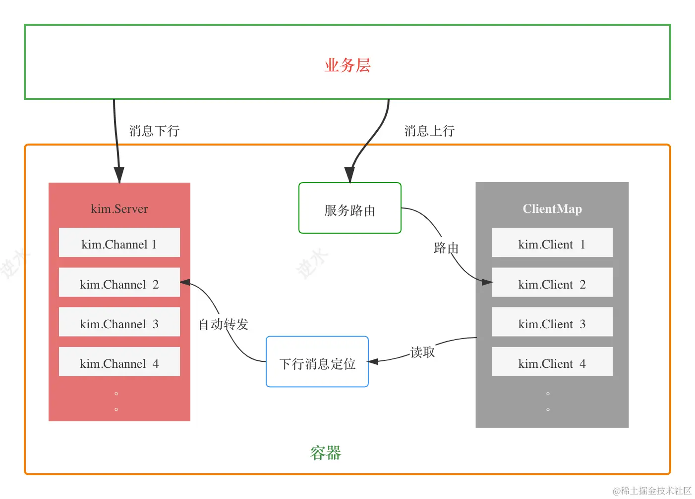
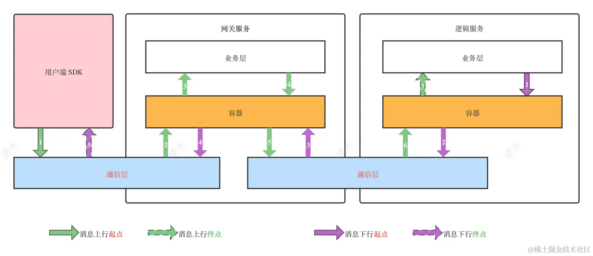

# 容器层

## Container

容器对通讯层的 Client 端做了一层封装，当通讯层作为 Client 向其所依赖的服务建立连接时，它会根据服务名，自动完成服务发现与连接建立的工作。并且在消息下行时，即 Server 向 Client 回复消息时，Client 可以自动寻址和转发，无需业务层的介入。可以说，容器极大减少了业务层（网关与逻辑服务）的重复性工作，而不需要手动管理 Server 与 Client 之间的连接。

容器的定义如下：

~~~go
type Container struct {
	sync.RWMutex
	Naming     naming.Naming
	Srv        im.Server
	state      uint32
	srvclients map[string]ClientMap
	selector   Selector
	dialer     im.Dialer
	deps       map[string]struct{}
}
~~~

- `im.Server`：Server 是上层实例化之后注入到 Container，一个服务只允许一个容器。

- `ClientMap`：用于消息下行时，自动寻址与转发。

  在下游服务（网关）的 Container 中，作为连接的 Client，与依赖的服务（如 Login Server）建立的连接就被包装为 Client 接口。而在 Login Server 中，作为连接的 Server，与网关建立的连接就被包装为 Channel。同一条连接，在不同地方封装为不同接口。
  
  这里的 Client 接口正是在通讯层介绍的，它的实现类通常在底层维护一条连接，可以是 Channel，也可以是 net.Conn。Server 实现类也在底层通过 Map 维护一组连接，一般是 Channel。ClientMap 与 Server 接口中的 ChannelMap 类似，因此 ClientMap 可以视为在客户端上维护一组 Client 连接。
  
  im.Client 的整个生命周期都是在 Container 内部自动处理，无需上层业务关心。唯一需要上层业务参与的地方，就是创建 Client 时的拨号与握手，它是通过 im.Dialer 接口暴露给上层的。显然，上层业务失去了直接通过连接来发送与接收消息的权利。但是容器暴露了 Forward 接口，用于向 Server 发送消息，
  
- `SetSelector`：由上层业务注册的一个服务路由器。在消息上行时，用于从一批服务列表中选择一个合适的服务

  ~~~go
  type Selector interface {
      // Header 是逻辑协议的头部
  	Lookup(*pkt.Header, []im.Service) string
  }
  ~~~

注意，我们在通讯层的 Client、Server 接口上做了增强，用于支持

~~~go
type ServiceRegistration interface {
	Service
	PublicAddress() string
	PublicPort() int
	DialURL() string
	GetTags() []string
	GetProtocol() string
	GetNamespace() string
	String() string
}

// 定义了基础服务的抽象接口
type Service interface {
	ServiceID() string			// 每一个服务实例的标识
	ServiceName() string		// 服务名，对应多个服务实例
	GetMeta() map[string]string  // 关于该服务实例的元信息，例如健康信息
}

type Client interface {
	Service
	// ...
}

type Server interface {
	ServiceRegistration
	// ...
}
~~~

### Start

在容器启动时 Start()，主要完成了以下几件事：

1. 启动 Server

   ~~~go
   go func(server im.Server) {
       err := server.Start()
       if err != nil {
           log.Errorln(err)
       }
   }(c.Srv)
   ~~~

2. 服务注册：

   ~~~go
   for service := range c.deps {
       go func(service string) {
           // 与依赖服务建立连接，服务发现
           err := connectToService(service)
           if err != nil {
               log.Errorln(err)
           }
       }(service)
   }
   
   // 服务注册
   if c.Srv.PulibcAddress() != "" && c.Srv.PublicPort() != 0 {
       err := c.Naming.Register(c.Srv)
       if err != nil {
           log.Errorln(err)
       }
   }
   ~~~

3. 监听系统信号：

   ~~~go
   c := make(chan os.Signal, 1)
   signal.Notify(c, syscall.SIGHUP, syscall.SIGINT, syscall.SIGTERM, syscall.SIGQUIT)
   
   log.Infoln("shutdown", <-c)
   // 退出
   return shutdown()
   ~~~

### 建立连接

在 `Start()` 方法中，通过调用 `connectToService()` 方法，作为 Client 与依赖服务建立起连接。

~~~go
func connectToService(serviceName string) error {
    // 为服务创建一个 Client 连接池
	clients := NewClients(10)
	c.srvclients[serviceName] = clients

	delay := time.Second * 10
	err := c.Naming.Subscribe(serviceName, func(services im.ServiceRegistration) {
		// services 是根据 ServiceName 返回的服务实例
		for _, service := range services {
			if _, ok := clients.Get(service.ServiceID()); ok {
				continue
			}
			log.WithField("func", "connectToService").Infof("Watch a new service: %v", service)
			// 给服务添加健康元信息
			service.GetMeta()[KeyServiceState] = StateYoung
            
			// 与所依赖的服务实例建立连接
			_, err := buildClient(clients, service)
			if err != nil {
				logger.Warn(err)
			}
		}
	})

	if err != nil {
		return err
	}

	// 再查询已经存在的服务
	services, err := c.Naming.Find(serviceName)
	if err != nil {
		return err
	}
    
	log.Info("find service ", services)
	for _, service := range services {
		// 标记为 StateAdult
		service.GetMeta()[KeyServiceState] = StateAdult
		_, err := buildClient(clients, service)
		if err != nil {
			logger.Warn(err)
		}
	}
	return nil
}
~~~

~~~go
// service 表示所依赖的服务实例
func buildClient(clients ClientMap, service im.ServiceRegistration) (im.Client, error) {
	c.Lock()
	defer c.Unlock()
	var (
		id   = service.ServiceID()
		name = service.ServiceName()
		meta = service.GetMeta()
	)

	// 1. 检测连接是否已经存在
	if _, ok := clients.Get(id); ok {
		return nil, nil
	}
	
    // 2. 必须以 TCP 协议建立起连接
	if service.GetProtocol() != string(wire.ProtocolTCP) {
		return nil, fmt.Errorf("unexpected service Protocol: %s", service.GetProtocol())
	}

	cli := tcp.NewClientWithProps(id, name, meta, tcp.ClientOptions{
		Heartbeat: im.DefaultHeartbeat,
		ReadWait:  im.DefaultReadWait,
		WriteWait: im.DefaultWriteWait,
	})

    // 将握手逻辑回调给上层来处理
	if c.dialer == nil {
		return nil, fmt.Errorf("dialer is nil")
	}

	cli.SetDialer(c.dialer)
	err := cli.Connect(service.DialURL())
	if err != nil {
		return nil, err
	}
    
	// 4. 读取消息
	go func(cli im.Client) {
		err := readLoop(cli)
		if err != nil {
			log.Debug(err)
		}
		clients.Remove(id)
		cli.Close()
	}(cli)
	
	clients.Add(cli)
	return cli, nil
}
~~~

### 销毁

在容器销毁时，主要完成以下工作：

~~~go
// 1. 优雅关闭服务器
err := c.Srv.Shutdown(ctx)
if err != nil {
    log.Error(err)
}

// 2. 从注册中心注销服务
err = c.Naming.Deregister(c.Srv.ServiceID())
if err != nil {
    log.Warn(err)
}

// 3. 退订服务变更
for dep := range c.deps {
    _ = c.Naming.Unsubscribe(dep)
}
~~~

## 消息上下行

- 上行时：消息会穿过容器，交给业务层处理，第2到5步。
- 下行时：消息直接在容器内部（网关）被转发，不会交给业务层，第3和4步。

### 消息下行

在 Server 端，上层业务手动调用的 Push 方法，把消息发送给网关的，这是消息下行的开始。

~~~go
func Push(server string, p *pkt.LogicPkt) error {
	p.AddStringMeta(wire.MetaDestServer, server)
	return c.Srv.Push(server, pkt.Marshal(p))
}

package wire
const (
	// 表明通过 ServiceID，来指定消息将要送达的服务
	MetaDestServer = "dest.server"
	// 表明通过 channelID， 来指定消息将要送达的 channel
	MetaDestChannels = "dest.channels"
)
~~~

在连接的 Client 一端，容器执行`readLoop()`来读取服务端响应的消息，然后调用核心方法`pushMessage` 。该方法根据我们的定位规则，把消息写到指定的 Channel 中，从而推送到自己的客户端。这就完成了自动转发与路由的工作。

每一条 Client 连接都有对应的 readLoop 来读取消息

~~~go
func readLoop(cli im.Client) error {
	log := logger.WithFields(logger.Fields{
		"module": "container",
		"func":   "readLoop",
	})
	log.Infof("readLoop started of %s %s", cli.ID(), cli.Name())
	for {
        // 这里直接使用 Client 接口中的 Read 阻塞方法来获取 Frame
        // 在该方法的内部，会自动发送心跳检测包
		frame, err := cli.Read()
		if err != nil {
			return err
		}
        
		if frame.GetOpCode() != im.OpBinary {
			continue
		}
        
		buf := bytes.NewBuffer(frame.GetPayload())

		packet, err := pkt.MustReadLogicPkt(buf)
		if err != nil {
			log.Info(err)
			continue
		}
        
        // 开始自动转发工作
		err = pushMessage(packet)
		if err != nil {
			log.Info(err)
		}
	}
}

func pushMessage(packet *pkt.LogicPkt) error {
	server, _ := packet.GetMeta(wire.MetaDestServer)
    // 检测消息是否要发送到本服务中
	if server != c.Srv.ServiceID() {
		return fmt.Errorf("dest_server is incorrect, %s != %s", server, c.Srv.ServiceID())
	}
    
	channels, ok := packet.GetMeta(wire.MetaDestChannels)
	if !ok {
		return fmt.Errorf("dest_channels is nil")
	}
    
	// 获取要转发的客户端
	channelIds := strings.Split(channels.(string), ",")
	packet.DelMeta(wire.MetaDestServer)
	packet.DelMeta(wire.MetaDestChannels)
	payload := pkt.Marshal(packet)
	log.Debugf("Push to %v %v", channelIds, packet)

	for _, channel := range channelIds {
        // 将消息转发出去
		err := c.Srv.Push(channel, payload)
		if err != nil {
			log.Debug(err)
		}
	}
	return nil
}
~~~

这里的关键就是 packet 的 Header 中 Meta 信息，它附带的两个值，这个值会在发送时设置（逻辑服务中）：

- `wire.MetaDestServer`: 消息抵达的服务
- `wire.MetaDestChannels`：消息接收方，这是一个列表，也就是一个消息是可以推送给多个用户。这个元信息是在逻辑服务的 `ServerDispather` 中注入的，这部分内容会在「消息处理链路」一章介绍。

### 消息上行

消息上行主要用于下游服务（网关） 发送消息到上游服务（如 LoginServer） 。因此容器开放了`Forward`方法

~~~go
func Forward(serviceName string, packet *pkt.LogicPkt) error {
	// 一些条件检测
	return ForwardWithSelector(serviceName, packet, c.selector)
}

func ForwardWithSelector(serviceName string, packet *pkt.LogicPkt, selector Selector) error {
	cli, err := lookup(serviceName, &packet.Header, selector)
	if err != nil {
		return err
	}
	// add a tag in packet
	packet.AddStringMeta(wire.MetaDestServer, c.Srv.ServiceID())
	log.Debugf("forward message to %v with %s", cli.ID(), &packet.Header)
	return cli.Send(pkt.Marshal(packet))
}
~~~

~~~go
func lookup(serviceName string, header *pkt.Header, selector Selector) (im.Client, error) {
	// 根据 serviceName 获取服务实例
	clients, ok := c.srvclients[serviceName]
	if !ok {
		return nil, fmt.Errorf("service %s not found", serviceName)
	}

	// 获取健康的服务实例
	srvs := clients.Services(KeyServiceState, StateAdult)
	if len(srvs) == 0 {
		return nil, fmt.Errorf("no services found for %s", serviceName)
	}
	// 返回服务实例的 ID
	id := selector.Lookup(header, srvs)
	if cli, ok := clients.Get(id); ok {
		// 根据 Service ID 返回 Client 连接
		return cli, nil
	}
	return nil, fmt.Errorf("no client found")
}
~~~

## 服务发现

