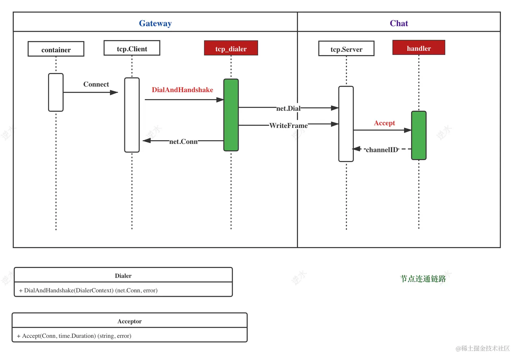
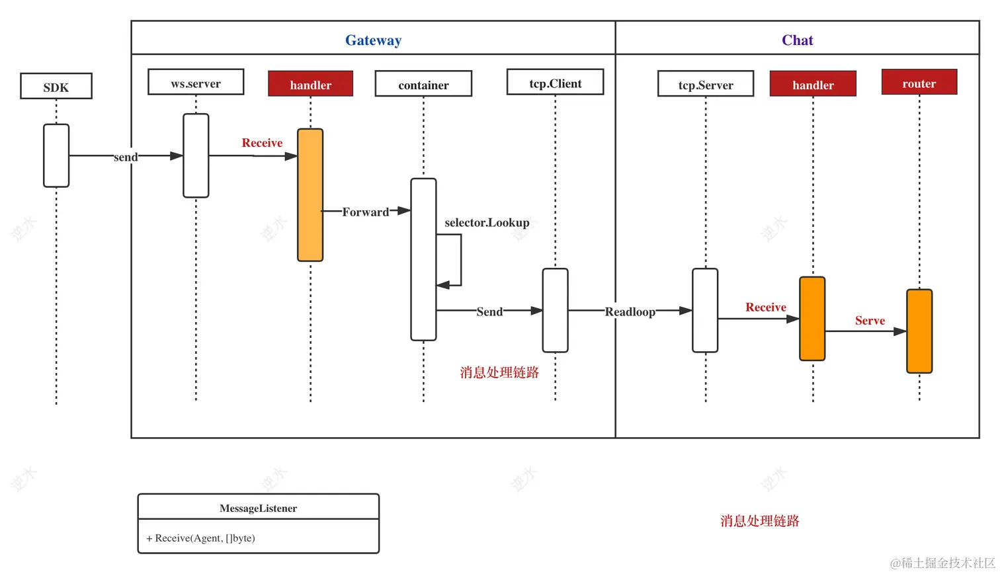
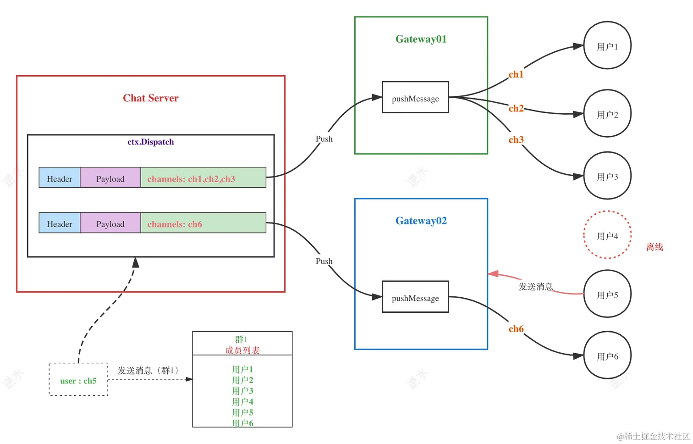
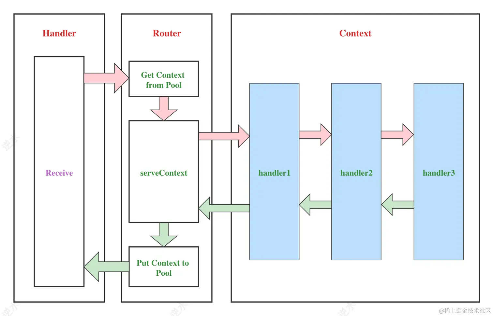
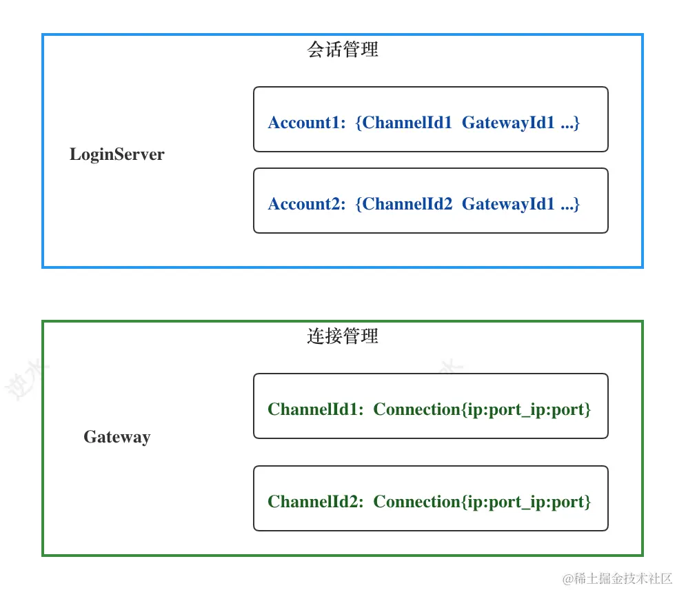

# 链路层

[TOC]

## 链路

链路主要包括两种主干链路：`节点连通链路`和`消息处理链路`

### 节点连通链路

节点指一个具体的服务，如 Gateway 和 Chat。它们之间的连接是基于内网可靠性设计，因此在这里并没有做复杂的权限认证。对 Server 端（如 Chat ）来说，它只需要知道 Client 的 ServiceID 即可。

在 Gateway 的 DialAndHandshake 逻辑中，将自己的 ServiceID 发送给 Chat。而 Chat 的 Accept 将这个 ServiceID 当作 ChannelID 返回。在这个过程中传输的消息包是 pkt.InnerHandshakeReq 类型：

~~~go
req := &pkt.InnerHandshakeReq{
    ServiceId: d.ServiceId,
}
~~~

### 消息处理链路

网关作为连接的 Server 端，它的 Receive 方法用于接收 SDK 发来的请求。

~~~go
// Handler 对象实现了 Server 接口的各种回调方法
func (h *Handler) Receive(ag kim.Agent, payload []byte) {
	buf := bytes.NewBuffer(payload)
	packet, err := pkt.Read(buf)
	if err != nil {
		return
	}
    
    // 如果是 BasicPkt，就处理心跳包。
	if basicPkt, ok := packet.(*pkt.BasicPkt); ok {
		if basicPkt.Code == pkt.CodePing {
			_ = ag.Push(pkt.Marshal(&pkt.BasicPkt{Code: pkt.CodePong}))
		}
		return
	}
    
     // 如果是 LogicPkt，就转发给逻辑服务处理。
	if logicPkt, ok := packet.(*pkt.LogicPkt); ok {
        // 这里将用户在这台设备的连接标识为 ChannelID
		logicPkt.ChannelId = ag.ID()
		// 通过容器层的 Client 连接，将请求转发出去
		err = container.Forward(logicPkt.ServiceName(), logicPkt)
		if err != nil {
			logger.WithFields(logger.Fields{
				"module": "handler",
				"id":     ag.ID(),
				"cmd":    logicPkt.Command,
				"dest":   logicPkt.Dest,
			}).Error(err)
		}
	}
}
~~~

## 指令路由

在逻辑服务的 `Receive()` 回调方法中，首先进行一个会话管理，然后通过 `h.r.Serve(packet, h.dispatcher, h.cache, session)` 将消息发给指令路由。指令路由与 web 服务中 http 的路由是类似的，一个最简单的版本包括如下几个部分：

- `type HandlerFunc func(Context)` - 处理器
- `type HandlersChain []HandlerFunc` - 处理链
- `type Context interface` - 处理器中的上下文
- `type Router struct` - 路由器

### 上下文

表示当前请求对应的上下文，包括请求对应的处理器等

~~~go
type Context interface {
	Dispatcher
	SessionStorage
	Header() *pkt.Header
	ReadBody(val proto.Message) error
	Session() Session
	RespWithError(status pkt.Status, err error) error
	Resp(status pkt.Status, body proto.Message) error
	Dispatch(body proto.Message, recvs ...*Location) error
}
~~~

主要方法有两个：

- Resp：给「发送方」返回一条消息。具体逻辑是：
  1. 复制`request.Header`生成一条新的消息包，然后修改了`Status`和`Flag`信息。调用 `pkt.NewFrom()`，
  2. 调用 `Context.Dispatcher#Push` ，向发送方返回 LogicPkt
- Dispatch：向指定的接收方 Location 派发消息，它也会调用 `Context.Dispatcher#Push` ，向发送方返回 LogicPkt

Location 表示一个用户的位置：网关 ID 和 ChannelId，通过这两个信息就可以定位用户。

~~~go
type Location struct {
	ChannelId string
	GateId    string
}
~~~

- `GateId`，正是 Gate 的 ServiceID，用于标识网关与逻辑服务之间的连接。
- `ChannelId`：它有两个作用：
  - 标识网关与客户端之间的连接
  - 在整个 IM 系统中，唯一地标识在单台设备上的用户，用于转发定位

在逻辑服务中，消息的派发给网关需要考虑「单聊」和「群聊」两种情况：

- 在单聊情况下，如果不考虑同账号多设备，那么 Dispatch 只会有一个接收方
- 在群聊情况下，接收方的数量就是群中所有在线的用户数。

在派发群聊消息时，有两种处理方式：

- 分包转发：每个消息都单独转发给网关，即使消息内容都是一样的
- 合包转发：将发送同一个网关的 Location 合并在一起发送，在网关中再拆分成多个包。

分包转发的实现逻辑简单，但是对带宽的浪费很大。所以这里我们采用合并转发方式。

~~~go
func (c *ContextImpl) Dispatch(body proto.Message, recvs ...*Location) error {
	if len(recvs) == 0 {
		return nil
	}

	packet := pkt.NewFrom(&c.request.Header)
	packet.Flag = pkt.Flag_Push
	packet.WriteBody(body)

	logger.Debugf("<-- Dispatch to %d users command:%s", len(recvs), &c.request.Header)
	// 根据网关 ID 来分组
	group := make(map[string][]string)
	for _, recv := range recvs {
		if recv.ChannelId == c.session.GetChannelId() {
			// 没必要向自己发送消息
			continue
		}
		if _, ok := group[recv.GateId]; !ok {
			group[recv.GateId] = make([]string, 0)
		}
		group[recv.GateId] = append(group[recv.GateId], recv.ChannelId)
	}
	for gateway, ids := range group {
		err := c.Push(gateway, ids, packet)
		if err != nil {
			logger.Error(err)
		}
		return err
	}
	return nil
}
~~~

~~~go

type ServerDispather struct {}

func (d *ServerDispather) Push(gateway string, channels []string, p *pkt.LogicPkt) error {
	p.AddStringMeta(wire.MetaDestChannels, strings.Join(channels, ","))
    // 就是调用 c.Srv.Push(server, pkt.Marshal(p))
	return container.Push(gateway, p)
}
~~~

### 路由器

~~~go
type Router struct {
	middlewares []HandlerFunc
	handlers    *FuncTree
	pool        sync.Pool
}
~~~

- `handlers`：保存指令对应的处理器链。
- `pool`： 对象池，用于减少内存的申请与回收
- `middlewares`: 中间件

它的核心方法就是 Serve，它的工作如下：

-  从 pool 中取一个 ContextImpl 对象，然后就是注入
  - 请求包： pkt.LogicPkt
  - 消息分发器：Dispather
  - 会话管理器：SessionStorage
  - 发送方会话：Session
- 执行 `serveContext(ctx)`
- 将 ContextImpl 放回 pool 中

~~~go
func (s *Router) serveContext(ctx *ContextImpl) {
	// 获取指令对应的处理器链
	chain, ok := s.handlers.Get(ctx.Header().Command)
    
	if !ok {
		// 添加一个 NoFound 处理器，向发送者报告错误
		ctx.handlers = []HandlerFunc{handleNoFound}
		ctx.Next()
		return
	}
    
	// 执行处理器链
	ctx.handlers = chain
	ctx.Next()
}

// 责任链模式
func (c *ContextImpl) Next() {
	if c.index >= len(c.handlers) {
		return
	}
	f := c.handlers[c.index]
	c.index++
	if f == nil {
		logger.Warn("arrived unknown HandlerFunc")
		return
	}
	f(c)
}
~~~

### 处理器

处理器的定义如下：

~~~go
type HandlerFunc func(Context)
~~~

处理器的注册：

~~~go
// Handle regist a commond handler
func (r *Router) Handle(commond string, handlers ...HandlerFunc) {
	r.handlers.Add(commond, r.middlewares...)
	r.handlers.Add(commond, handlers...)
}

// handlers 的类型为 FuncTree
type FuncTree struct {
	nodes map[string]HandlersChain
}
type HandlersChain []HandlerFunc
~~~

## 服务初始化

### 网关

1. 环境变量与配置加载，ServerID 就在此配置

2. Handler 结构体初始化，用于注册 Server 各种回调函数，例如 Accept、Disconnet、Receive

3. 向容器注册依赖服务，以及封装 Server

   ~~~go
   _ = container.Init(srv, wire.SNChat, wire.SNLogin)
   ~~~

4. 服务发现初始化：

   ~~~go
   ns, err := consul.NewNaming(config.ConsulURL)
   ~~~

5. Containter 初始化

   ~~~go
   container.SetServiceNaming(ns)
   	container.SetDialer(serv.NewDialer(config.ServiceID))
   ~~~

6. 运行

   ~~~go
   return container.Start()
   ~~~

### 逻辑服务

它比网关就多了「指令路由」与「会话管理器」两个模块

~~~go
// 指令路由
r := kim.NewRouter()
loginHandler := handler.NewLoginHandler()
r.Handle(wire.CommandLoginSignIn, loginHandler.DoSysLogin)
r.Handle(wire.CommandLoginSignOut, loginHandler.DoSysLogout)

// 会话管理
rdb, err := conf.InitRedis(config.RedisAddrs, "")
if err != nil {
    return err
}
cache := storage.NewRedisStorage(rdb)

// 注册
servhandler := serv.NewServHandler(r, cache)
~~~

## 登录

首先在授权服务器中获取 Token，然后在网关处验证 Token 是否合法：

- 合法：往 login Service 中发送一条登录包（command:`login.signin`），在 login 的登录包指令处理器中就会把会话存储起来，然后返回一条登录成功的消息，并带有用户的唯一 ChannelID。 这里的 ChannelID 在消息元信息中保存，作为用户的标识。而不是底层连接的标识。
- 非法：直接返回一个`Status_Unauthorized`的消息包，然后关掉连接。

该逻辑在网关的 Accept 中实现，步骤如下：

1. 读取登陆包

2. 反序列化 Body

3. 使用默认的 DefaultSecret 解析 token，如果解析失败，那么就发送 `Status_Unauthorized`的消息包。

4. 生成一个全局唯一的 ChannelID

5. 把消息转发给 Login 服务

   ~~~go
   req.WriteBody(&pkt.Session{
       Account:   tk.Account,
       ChannelId: id,
       GateId:    h.ServiceID,
       App:       tk.App,
       RemoteIP:  getIP(conn.RemoteAddr().String()),
   })
   err = container.Forward(wire.SNLogin, req)
   ~~~

下面编写在指令路由中使用的登录处理器，它的实现逻辑如下：

1. 序列化消息
2. 查当前账号是否已经登陆在其它地方，如果是，那么通知这个用户（连接）下线
3. 添加到会话管理器中
4. 返回一个登陆成功的消息

## 会话管理

Session 记录了用户登录的会话：

~~~go
message Session {
    string channelId = 1;  // session id
    string gateId = 2;     // gateway ID
    string account = 3;
    string zone = 4;
    string isp = 5;
    string remoteIP = 6;
    string device = 7;
    string app = 8;
    repeated string tags = 9;
}
~~~

这里再次强调：

- `GateId`，正是 Gate 的 ServiceID，用于标识网关与逻辑服务之间的连接。
- `ChannelId`：它有两个作用：
  - 标识网关与客户端之间的连接
  - 在整个 IM 系统中，唯一地标识在单台设备上的用户，用于转发定位

注意到，Session 包括了 Location 的信息，但是 Location 可以减少内存空间占用，提高寻址内容序列化速度与内存分配。下面是直接用 Session 来定位用户，和使用 Loaction 之间的对比：

| name        | t.N    | ns/op     | B/op | allocs/op |
| ----------- | ------ | --------- | ---- | --------- |
| getLocation | `3896` | `345,814` | 458  | 14        |
| getSession  | `2948` | `366,065` | 725  | 18        |

会话管理的定义如下：

~~~go
type SessionStorage interface {
	// Add a session
	Add(session *pkt.Session) error
	// Delete a session
	Delete(account string, channelId string) error
	// Get session by channelId
	Get(channelId string) (*pkt.Session, error)
	//  批量读取位置信息，主要用于群聊
	GetLocations(account ...string) ([]*Location, error)
	// device 是一个预留参数，用于支持多设备登陆情况
	GetLocation(account string, device string) (*Location, error)
}
~~~

## 登出

`正常断开连接`或者`心跳超时`等情况时网关就会发出连接断开通知，在 Handler 中就会处理这个断开事件：

~~~go
func (h *Handler) Disconnect(id string) error {
	log.Infof("disconnect %s", id)
	logout := pkt.New(wire.CommandLoginSignOut, pkt.WithChannel(id))
	err := container.Forward(wire.SNLogin, logout)
	if err != nil {
		logger.WithFields(logger.Fields{
			"module": "handler",
			"id":     id,
		}).Error(err)
	}
	return nil
}
~~~

