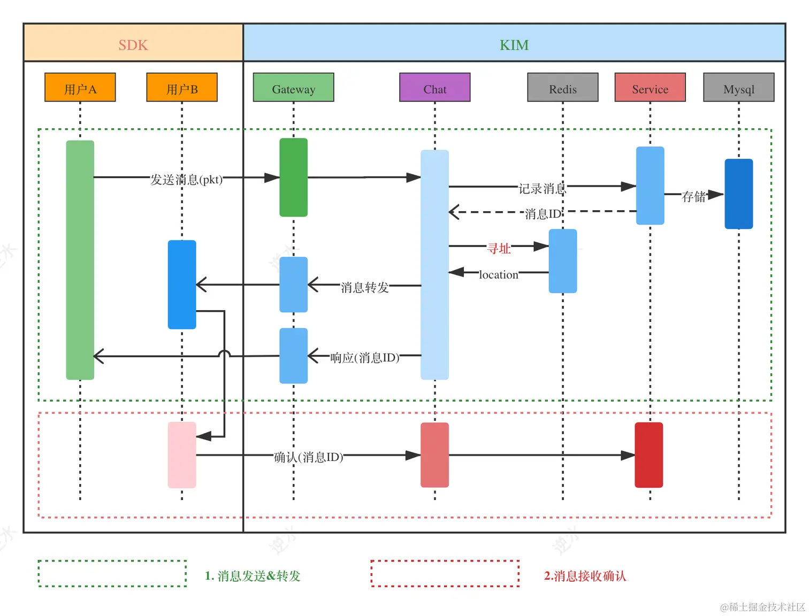
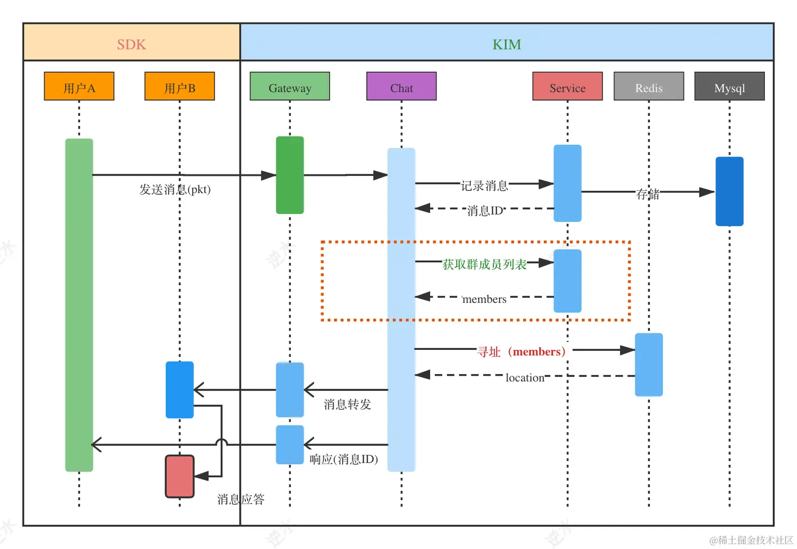

# 控制层

## 协议格式

在消息的收发中，由于我们在消息头中有一个 dest 字段，它可以表示收消息的群或用户。因此，单聊与群聊的消息 Body 的格式，就可以使用相同的结构体：

~~~go
message MessageReq {
    int32 type = 1; // 消息类型
    string body = 2; // 消息内容
    string extra = 3; // 消息额外信息
}
~~~

- type：

  ~~~go
  const (
  	MessageTypeText  = 1 // 文本消息
  	MessageTypeImage = 2 // 图片
  	MessageTypeVoice = 3 // 语音
  	MessageTypeVideo = 4 // 视频
  )
  ~~~

消息的响应包：

~~~go
message MessagePush {
    int64 messageId = 1;
    int32 type = 2;
    string body = 3;
    string extra = 4;
    string sender = 5; // 消息发送者
    int64 sendTime = 6;
}
~~~

## 单聊

需要说明的是，发送时间是取的是服务端的当前时间，`sendTime := time.Now().UnixNano()`，而不是SDK端的时间。

在分布式系统中，全局时钟分为两类：`物理时间`与`逻辑时钟`。物理时间使用简单，但是在分布式服务中无法绝对可靠，比如上面`sendTime`就是使用的物理时间。而逻辑时钟则与时间无关，它只关心事情发生的先后顺序。

## 群聊

实际上它与单聊的逻辑差异不大，因为批量推送消息的逻辑封装在了 im.Context 及容器 container 这些底层逻辑中，所以在群聊与单聊的转发逻辑就一致了。

群聊中通常会有权限控制的逻辑，比如禁言时只有管理员可以发言。但是这里我们并不实现这一点。

## 消息存储

> 消息存储的逻辑与设计上的权衡密切相关，这里给出的存储逻辑只适用于中型 IM 系统。

对于消息收发，我们有三种场景要考虑：

- 读取**历史消息**
- 同步**离线消息**
- 收发**在线消息**

首先要说明的是，除了在服务端中存储历史消息外，客户端也在本地数据库中存储历史数据。这样再浏览已获取的消息时，就无需再查询服务器了，算是一种缓存优化的手段。

对于读取历史消息，直接从本地数据库中读取。在读取到当前会话在本地数据库中的最后一条消息时，如果消息被标记了 END ，那么就提示用户这是最后一条消息。否则，去服务器拉取更多的消息，并保存在本地。

服务器维护着会话第一条消息的 ID，这样方便客户端判断某条消息是否为 END。

然后考虑收发在线消息的逻辑：

1. 发送方把消息投递到服务端后，服务端将消息存储到 HBase，只要存储成功，那么发送方就认为消息投递成功，而无需关心这条消息是否真正被对端接收。

   如果给发送方回复确认时，连接断开了，那么发送方那端显示发送失败，但是已经投递给了离线队列。在这种情况下，什么也不做就是最好的解决方案 :)，无需考虑消息幂等性的保证（Exactly Once）

2. 如果接收方在线，那么直接投递消息给接收方。否则，将消息存放在离线队列中

   

离线消息的同步有两种策略：

1. 推（Push）：指用户登陆之后，服务端主动把离线消息 Push 过去
2. 拉（Pull）：指用户登陆之后，主动拉离线消息。

服务端在同时消息时，要将离线消息批量打包发送，减少请求的次数。同时，为了优化 IO 性能，服务端先返回消息的索引，然后客户端根据索引去**惰性**地获取消息内容。这样可以一次性快速同步大量（1w+）离线消息。

- 消息索引

| message_id | receiver | sender |  sendTime  |
| :--------: | :------: | :----: | :--------: |
|   11111    |  user_b  | user_a | 1232354345 |
|   11112    |  user_b  | user_a | 1234234345 |

- 消息内容

| message_id | type | body  | extra |
| :--------: | :--: | :---: | :---: |
|   11111    | text | hello |       |
|   11112    | text | world |       |

在数据库中，我们通常设置一个`delivered`字段来表示**消息是否已确认被投递到了接收方**。当要同步消息时，直接拉取 receiver = me 且 delivered = 0 的消息。当收到接收方的 ACK 后，就将消息的 `delivered` 设置 `1`

| message_id | `receiver` | sender | type | body | `delivered` |
| ---------- | ---------- | ------ | ---- | ---- | ----------- |
| 11111      | user_b     | user_a | text | a    | 1           |
| 11112      | user_b     | user_a | text | b    | 0           |
| 11113      | user_b     | user_a | text | c    | 0           |
| 11114      | user_b     | user_a | text | d    | 0           |

以上述例子来说，当接收方发送同步离线消息的 ACK 时，必须确认 ID 为 11112、11113 和 11114 这三条消息，而数据库的更新操作也是一个较耗时的 IO 操作，这对 IM 系统的性能影响是非常大的。

我们可以使用读索引来优化一下，即仅在本地记录上次所同步消息的最大 ID，下次再同步时，直接拉取 receiver = me 且 ID > Last_Message_ID  的消息。这里有个重要的假设，即消息之间的因果顺序是与 ID 顺序是相关的。

但是这里有一个小细节，就是登录到新的设备时，默认 Last_Message_ID 为当前离线消息中的最大 ID，这样避免同时拉取所有的消息。将同步消息逻辑交给读取历史消息来做。

在上面的讨论中，我们总是假定消息的顺序性得以保障，而这一点依赖于唯一的、递增的序列号。一个简单粗暴生成递增序列号的方式就是利用时间戳，但是如果时钟回拨，那么系统的行为就得不到保证。而且在高并发场景下，很容易产生 ID 重复的情况。

在复杂分布式系统中，往往需要对大量的数据和消息进行唯一标识。这个标识应该满足：

1. **全局唯一性**
2. **趋势递增**：由于多数 RDBMS 使用 B-tree 的数据结构来存储索引数据，在主键的选择上面，我们应该尽量使用有序的主键，来保证写入性能；
3. **单调递增**：保证下一个ID一定大于上一个ID，例如事务版本号、IM聊天中的增量消息、排序等特殊需求
4. **信息安全**：如果ID是连续的，恶意用户的扒取工作就非常容易做了，直接按照顺序下载指定URL即可；**注意，3 和 4 之间是互斥的。**

下面我们来看一些常见的解决方案：

UUID	

- 信息不安全：基于MAC地址生成UUID的算法可能会造成MAC地址泄露
- 不易于存储：UUID 太长，16字节，而且这对主键索引很不友好

Snowflake

- 强依赖机器时钟，如果机器上时钟回拨，会导致发号重复或者服务会处于不可用状态

数据库自增 ID

- 系统水平扩展比较困难
- ID 没有了单调递增的特性，只能趋势递增

目前主流的分布式 ID 生成方式，大致都是基于`数据库号段模式`和`雪花算法（snowflake）`

美团的 Leaf-segment 方案，实际上是在数据库自增 ID 方案上的一种改进

|    Field    |     Type     |
| :---------: | :----------: |
|   biz_tag   | varchar(128) |
|   max_id    |  bigint(20)  |
|    step     |   int(11)    |
|    desc     | varchar(256) |
| update_time |  timestamp   |

- biz_tag：用来区分业务；
- max_id：表示该 biz_tag 目前所被分配的 ID 号段的最大值；
- step：表示每次分配的号段长度。

原来在获取 ID 时，每次都需要写数据库，现在只需要把 step 设置得足够大，比如 1000,那么只有当 1000 个号被消耗完了之后，才会去重新读写一次数据库。这就是号段模式的思想。实际上，Leaf 在当前号段消费到某个点时，就异步的把下一个号段加载到内存中。而不需要等到号段用尽的时候才去更新号段。当为了高可用而部署多个 Leaf 实例时，那么全局有序性就得不到保证了。

 实际上，除了「单点集中部署」以及「分布式强一致性」，其他算法都不能保证全局有序；所以在消息的 ID 生成中，我们使用雪花算法。
