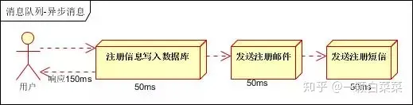
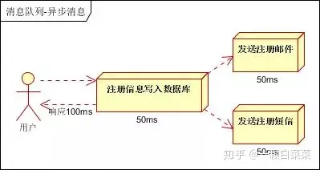
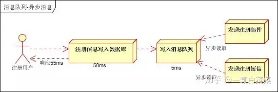
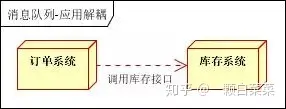
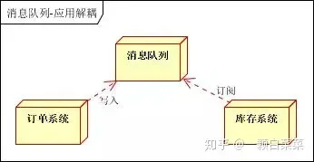
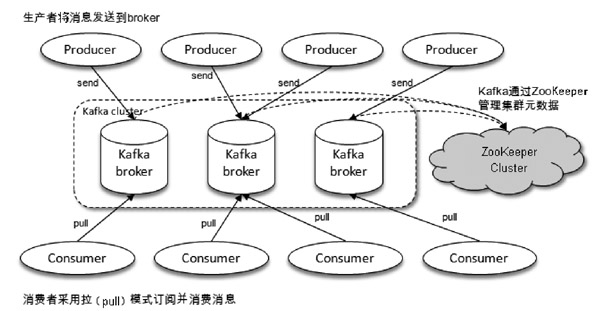
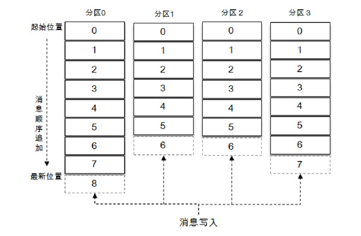
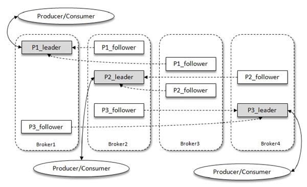
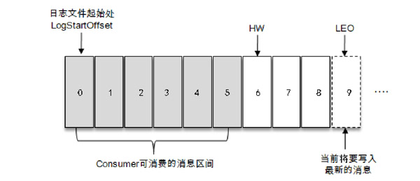

# 初识Kafka

[TOC]

## 概述

Kafka 定位为一个「分布式流式处理」平台，它以高吞吐、可持久化、可水平扩展、支持流数据处理等多种特性而被广泛使用。它所扮演的三大角色：

- **消息系统**：Kafka 和传统的消息系统（也称作消息中间件）都具备「系统解耦」、「冗余存储」、「流量削峰」、「缓冲」、「异步通信」、「扩展性」、「可恢复性等功能」。与此同时，Kafka 还提供了大多数消息系统难以实现的「消息顺序性保障」及「回溯消费」的功能。

- **存储系统**：Kafka 把消息持久化到磁盘，有效地降低了数据丢失的风险

- **流式处理平台**：Kafka 不仅为每个流行的流式处理框架提供了可靠的数据来源，还提供了一个完整的流式处理类库，比如窗口、连接、变换和聚合等各类操作。

应用场景：

1. **异步处理**

   

   

   

2. 应用解耦

   

   

3. 流量削锋

   

4. **日志处理**

   

一个典型的 Kafka 体系架构包括：

- **Producer 生产者**：将消息发送到 Broker
- **Broker 服务代理节点**：对于 Kafka 而言，Broker 可以简单地看作一个独立的 Kafka 服务节点或Kafka服务实例。
- **Consumer 消费者**：负责从 Broker 订阅并消费消息
- **ZooKeeper集群**：负责集群元数据的管理、控制器的选举等操作。ZooKeeper 是一个开源的分布式协调服务。分布式应用程序可以基于 ZooKeeper 实现诸如数据发布/订阅、负载均衡、命名服务、分布式协调/通知、集群管理、Master 选举、配置维护等功能。

在 Kafka 中还有两个特别重要的概念—**主题（Topic）**与**分区（Partition）**：

- Kafka 中的消息以主题为单位进行归类，生产者负责将消息发送到特定的主题，而消费者负责订阅主题并进行消费。

- 主题是一个逻辑上的概念，它还可以细分为多个分区，一个分区只属于单个主题。

  每一条消息被发送到 broker 之前，会根据分区规则选择存储到哪个具体的分区。如果分区规则设定得合理，所有的消息都可以均匀地分配到不同的分区中。如果一个主题只对应一个文件，那么这个文件所在的机器 I/O 将会成为这个主题的性能瓶颈，而分区解决了这个问题。Kafka 中的分区可以分布在不同的服务器（broker）上。

  **分区主要解决的是水平扩展问题**

  同一主题下的不同分区所包含的消息是不同的，分区在存储层面可以看作一个可追加的日志（Log）文件，消息在被追加到分区日志文件的时候，都会分配一个特定的偏移量（offset）。这是消息在分区中的唯一标识，Kafka 通过它来保证消息在分区内的顺序性。不过offset并不跨越分区，也就是说，Kafka 保证的是分区有序而不是主题有序。

  ·
  
  

**Kafka 中的生产者与消费者都可以指定某个（些）分区来操作，但最好由 Kafka 来决定使用哪个分区（负载均衡）。**

Kafka 为分区引入了**多副本（Replica）**机制，通过增加副本数量可以提升容灾能力（故障的自动转移）。副本之间是「一主多从」的关系，其中 leader 副本负责处理读写请求，而 follower 副本只负责消息的同步。当 leader 出现故障时，从 follower 中重新选举新的 leader。

Kafka 消费端也具备一定的容灾能力。Consumer 使用**拉（Pull）模式**从服务端获取消息，并且保存消费的具体位置。当消费者宕机后恢复上线时，可以根据之前保存的消费位置，重新拉取需要的消息进行消费，这样就不会造成消息丢失。

分区中的所有副本统称为**AR（Assigned Replicas）**，与保持一定程度同步的副本（包括 leader 副本在内）组成**ISR（In-Sync Replicas）**，而同步滞后过多的副本（不包括leader副本）组成**OSR（Out-of-Sync Replicas）**。可见，`AR = ISR + OSR`。

默认情况下，当 leader 副本发生故障时，只有在 ISR 集合中的副本才有资格被选举为新的 leader，原则上不考虑OSR集合中的副本。

ISR 与 HW 和 LEO 有着紧密的关系。

- HW 是 High Watermark 的缩写，俗称高水位，它标识了一个特定的消息偏移量（offset），消费者只能拉取到这个 offset 之前的消息。
- LEO 是 Log End Offset 的缩写，它标识当前日志文件中下一条待写入消息的 offset

分区 ISR 集合中的每个副本都会维护自身的 LEO，而 ISR 集合中最小的 LEO 即为分区的 HW，对消费者而言只能消费 HW 之前的消息。

可见，Kafka 消息的复制机制既有同步，也有异步

- 同步是指，ISR 中的 follower 副本都复制完这条消息，它才会被确认为已成功提交，才可以被消费者消费。
- 异步是指，follower 副本**异步地、主动地**从 leader 中拉取消息，来做同步工作。

ES 高性能的原因：

- 分区

- 网络传输上减少开销

  - 批量发送
  - 端到端压缩

- 顺序读写：kafka 将消息追加到日志文件中，利用了磁盘的顺序读写特性，来提高读写效率

- 零拷贝技术

  

## 安装与配置

### Kafka & Zookeeper

首先要安装 ZooKeeper（不再介绍）。下面启动一个 Kafka 服务

1. 配置 ZooKeeper

2. 下载 https://downloads.apache.org/kafka/3.8.0/kafka_2.13-3.8.0.tgz，并将安装包解压到指定目录

   ~~~shell
   $ tar -zxvf kafka_2.12-2.4.1.tgz 
   ~~~

3. 修改配置文件`conf/server.properties`

   ~~~shell
   broker.id=0
   
   #端口号
   port=9092
   
   #broker对外提供的服务地址
   listeners=PLAINTEXT://localhost:9092
   
   #日志存放路径
   log.dirs=/mnt/soft/kafka_data/log/kafka 
   
   #zookeeper地址和端口
   zookeeper.connect=localhost:2181/kafka
   ~~~
   
   `zookeeper.connect=localhost:2181/kafka` 这一行配置定义了Kafka如何连接到 ZooKeeper 集群。其中`/kafka`表示在`ZooKeeper`中使用`/kafka`这个节点来存储和获取数据。
   
   - `message.max.bytes`，该参数用来指定broker所能接收消息的最大值，默认值为1000012（B），约等于976.6KB。如果 Producer 发送的消息大于这个参数所设置的值，那么（Producer）就会报出RecordTooLargeException的异常
   - log.dir和log.dirs：这两个参数用来配置Kafka 日志文件存放的根目录。log.dirs 的优先级比 log.dir 高
   - `broker.id`：该参数用来指定 Kafka 集群中 broker 的唯一标识
   - `listeners`：broker 对外提供的服务地址
   - `zookeeper.connect`:该参数指明 broker 要连接的 ZooKeeper 集群的服务地址。如果ZooKeeper集群中有多个节点，则可以用逗号将每个节点隔开，类似于 `localhost1：2181，localhost2：2181，localhost3：2181`这种格式。
   
4. 启动服务

   ~~~shell
    bin/kafka-server-start.sh config/server.properties &
   ~~~

   可以通过`jps -l`命令查看 Kafka 服务进程是否已经启动

### Kraft

Kafka 在 2.8 版本之后，就不再依赖 Zookeeper

1. 修改 Kraft 协议配置文件`${kafka}/config/kraft/server.properties`

   ~~~properties
   node.id=1
   process.roles=broker,controller 
   listeners=PLAINTEXT://192.168.58.130:9092,CONTROLLER://192.168.58.130:9093
   advertised.listeners = PLAINTEXT://192.168.58.130:9092
   controller.quorum.voters=1@192.168.0.93:9093,4@192.168.0.137:9093,5@192.168.0.221:9093
   log.dirs=/home/myokuuu/kafka/logs
   ~~~

   - `node.id`：这将作为集群中的节点 ID，唯一标识。
   - `process.roles`：一个节点可以充当 broker 或 controller 。
   - `listeners`：broker 将使用 9092 端口，而 kraft controller 控制器将使用 9093 端口。注意：公网 EIP 是没有绑定到网卡上面的，这里仍要填写内网地址网卡。
   - `advertised.listeners`：这里指定 kafka 通过代理暴漏的地址，如果都是在局域网中使用，就配置`PLAINTEXT://192.168.58.130:9092`即可。这里一定要填写公网地址！
   - `controller.quorum.voters`：这个配置用于指定 **controller 主控**选举的投票节点，所有`process.roles`包含 controller 角色的规划节点都要参与，即：zimug1、zimug2、zimug3。其配置格式为:`node.id1@host1:9093,node.id2@host2:9093`
   - `log.dirs`：kafka 将存储数据的日志目录，在准备工作中创建好的目录。

2. 生成一个唯一的集群 ID（在一台 Kafka 实例上执行即可）

   ~~~shell
    $bin/kafka-storage.sh random-uuid
   nUGThgotT7uhpBo9s8xZPg
   ~~~

   然后在每个节点上执行
   ~~~shell
   $ bin/kafka-storage.sh format \
   -t apzYbkooSEKdSSniKSoQmg \
   -c /root/kafka/config/kraft/server.properties
   ~~~

   `log.dirs`目录下多出一个 meta.properties 文件

   ~~~pro
   node.id=1
   version=1
   cluster.id=SzIhECn-QbCLzIuNxk1A2A
   ~~~

3. 启动节点：

   ~~~shell
   $ bin/kafka-server-start.sh -daemon /root/kafka/config/kraft/server.properties  # 相当于 nohup + &
   
   $ bin/kafka-server-stop.sh
   ~~~

   

## 生产与消费

Kafka 提供了许多实用的脚本工具，位于`${KAFKA_HOME}/bin`下，其中与主题有关的就是 kafka-topics.sh 脚本。如果脚本的路径过深，那么报错「命令语法不正确」

~~~shell
$ bin/kafka-topics.sh --bootstrap-server localhost:9092 --create --topic topic-demo --replication-factor 1 --partitions 1
~~~

上述命令创建一个分区数为 1、副本因子为 1 的主题 topic-demo。其中

- `--zookeeper`指定了 Kafka 所连接的 ZooKeeper 服务地址
- `--topic`指定了所要创建主题的名称
- `--replication-factor` 指定了副本因子（不得大于 Broker 的数量）
- `--partitions` 指定了分区个数
- `--create`是创建主题的动作指令

> 新版本中，zookeeper 选项已经被废除了，用 --bootstrap-server 选项指定 Kafka broker的地址和端口

查看分区

~~~shell
./kafka-topics.sh --list --bootstrap-server localhost:9092
~~~

通过 `kafka-console-consumer.sh` 脚本来订阅主题

~~~shell
$ bin/kafka-console-consumer.sh --bootstrap-server 192.168.0.143:9092 --topic topic-demo
~~~

使用 `kafka-console-producer.sh` 脚本发送一条消息

~~~shell
$ bin/kafka-console-producer.sh --broker-list 192.168.0.143:9092 --topic topic-demo
~~~

Kafka 引入了动态 broker 参数，将配置项分为三类：`read-only`、`per-broker` 和 `cluster-wide`，第一类跟原来一样需重启才生效，而后面两类都是动态生效的，只是影响范围不同

优先级：**per-broker 参数 > cluster-wide 参数 > static 参数 > Kafka 默认值。**
