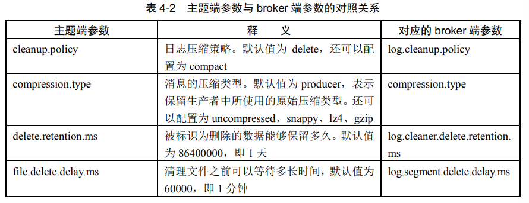
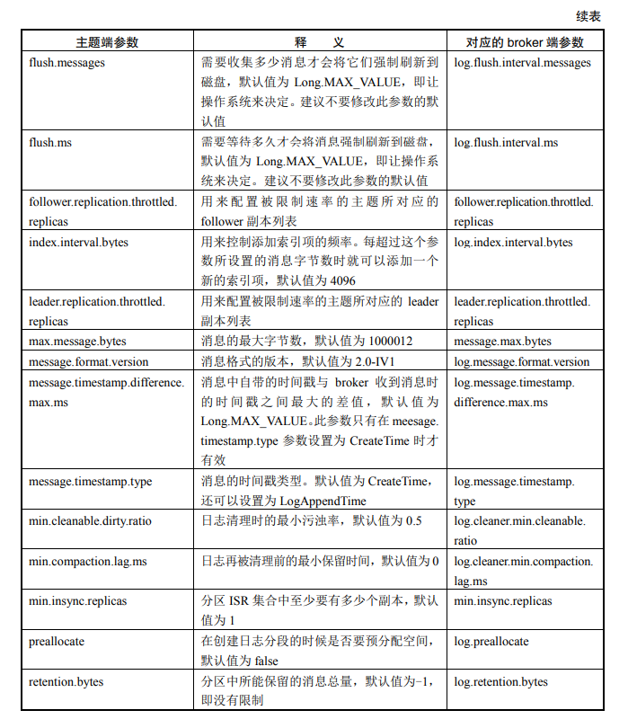
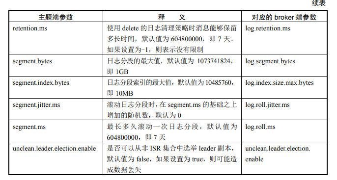
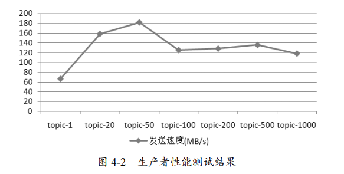

# 主题和分区

[TOC]

主题作为消息的归类，而分区的划分不仅为 Kafka 提供了可伸缩性、水平扩展的功能，还通过多副本机制来为 Kafka 提供数据冗余以提高数据可靠性。

**使用分区的一个基本假设是，业务逻辑与分区位置是无关的。**

从 Kafka 的底层实现来说，主题和分区都是逻辑上的概念。分区可以有一至多个副本，每个副本对应一个日志文件，每个日志文件对应一至多个日志分段（LogSegment），每个日志分段还可以细分为索引文件、日志存储文件和快照文件等

## 主题管理

### 创建主题

如果 broker 端配置参数 auto.create.topics.enable 设置为 true（默认值为true），那么当生产者向一个尚未创建的主题发送消息时，会自动创建一个分区数为 num.partitions （默认值为 1）、副本因子为 default.replication.factor（默认值为 1）的主题。

推荐使用 kafka-topics.sh 脚本来创建主题

~~~bash
bin/kafka-topics.sh --zookeeper localhost:2181/kafka
--create --topic topic-create --partitions 4 --replication-factor 2
~~~

在执行完脚本之后，Kafka 会在 log.dir 或 log.dirs 参数所配置的目录下创建相应的主题分区。同时在 ZooKeeper 的 /brokers/topics/ 目录下创建一个同名的实节点，该节点中记录了该主题的分区副本分配方案：

~~~bash
get /brokers/topics/topic-create
# {"version":1,"partitions":{"2":[1,2],"1":[0,1],"3":[2,1],"0":[2,0]}}

# "2":[1,2]表示分区 2 分配了 2 个副本，分别在 brokerId 为 1 和 2 的 broker 节点中
~~~

主题、分区、副本和日志的关系如下图所示：

可以通过 kafka-topics.sh 脚本的 describe 指令来查看分区副本的分配细节：

~~~bash
$ bin/kafka-topics.sh --zookeeper localhost:2181/kafka --describe --topic topic-create

Topic: topic-create Partition: 0 Leader: 2 Replicas: 2,0 Isr: 2,0
Topic: topic-create Partition: 1 Leader: 0 Replicas: 0,1 Isr: 0,1
Topic: topic-create Partition: 2 Leader: 1 Replicas: 1,2 Isr: 1,2
Topic: topic-create Partition: 3 Leader: 2 Replicas: 2,1 Isr: 2,1
~~~

kafka-topics.sh 脚本中还提供了一个 `replica-assignment` 参数来手动指定分区副本的分配方案，分区与分区之间用逗号`,` 隔开，分区内多个副本用冒号`:`隔开

~~~bash
bin/kafka-topics.sh --zookeeper localhost:2181/
kafka --create --topic topic-create-same --replica-assignment 2:0,0:1,1:2,2:1
~~~

在创建主题时我们还可以通过 config 参数，来设置所要创建主题的相关参数：

~~~bash
bin/kafka-topics.sh --zookeeper localhost:2181/kafka --create ... --config cleanup.policy=compact --config max.message.bytes=10000
~~~

主题的命名不推荐（虽然可以这样做）使用双下画线“__”开头，因为它一般是 Kafka 内部主题的命令格式

如果指定了机架信息 broker.rack ，则在分区副本分配时，会尽可能地让分区副本分配到不同的机架上。要使用机架信息，必要在 Broker 中都必须设置 borker.rack 参数，否则抛出异常。

~~~bash
broker.rack=RACK1
~~~

分区副本的分配策略

- 使用了 replica-assignment 参数
- 没有使用 replica-assignment 参数
  - 如果集群中所有的 broker 节点都没有配置 broker.rack 参数，或者使用 disable-rack-aware 参数来创建主题
  - 配置了broker.rack 参数

### 管理主题

kafka-topics.sh 脚本有 5 种指令类型：create、list、describe、alter 和 delete。

查看所有主题 `--list`：

~~~bash
bin/kafka-topics.sh --zookeeper localhost:2181/kafka –list
# __consumer_offsets
# topic-create
# topic-demo
# topic-config
~~~

查看单个主题 `--describe`

- `--topics-with-overrides`：找出具有特殊配置覆盖的主题

  ~~~bash
  bin/kafka-topics.sh --zookeeper localhost:2181/kafka --describe --topics-with-overrides
  # Topic:__consumer_offsets PartitionCount:50 ReplicationFactor:1
  # Configs:segment.bytes=104857600,cleanup.policy=compact,compression.type=proucer
  ~~~

- `--under-replicated-partitions`：找出所有包含失效副本的分 区

- `--unavailable-partitions`：找出没有 leader 副本的分区

删除主题：

~~~bash
bin/kafka-topics.sh --zookeeper localhost:2181/kafka --delete --topic topic-delete
~~~

如果 delete.topic.enable 参数配置为 false，那么删除主题的操作将会被忽略。使用 kafka-topics.sh 脚本来删除主题，只是在 ZooKeeper 中的 /admin/delete_ topics 路径下创建一个与删除主题同名的节点，即标记该主题为待删除的状态。真正删除主题的动作是由 Kafka 控制器来完成的。

还可以手动删除主题：

1. 删除 ZooKeeper 中的节点/config/topics/${topic}。

2. 删除 ZooKeeper 中的节点/brokers/topics/${topic} 及其子节点

3. 删除集群中所有与主题 ${topic} 有关的文件

   ~~~bash
   rm -rf ${kafka_log}/${topic}
   ~~~

   

修改主题：

- 增加主题的分区数

  ~~~bash
  bin/kafka-topics.sh --zookeeper localhost:2181/kafka --alter --topic topic-config --partitions 3
  ~~~

  Kafka 不会重新对已有的消息进行散列再分配。现在 Kafka 并不支持减少分区数。

- 变更主题的配置

  ~~~bash
  bin/kafka-topics.sh --zookeeper 1ocalhost:2181/kafka --alter --topic topic-config --config max.message.bytes=20000
  ~~~

  我们可以通过 delete-config 参数来删除之前覆盖的配置，使其恢复原有的默认值

  ~~~bash
  bin/kafka-topics.sh --zookeeper localhost:2181/kafka --alter --topic topic-config --delete-config max.message.bytes --delete-config cleanup.policy
  ~~~

更推荐使用 kafka-configs.sh 脚本来管理配置。

~~~bash
bin/kafka-configs.sh --zookeeper localhost:2181/kafka --describe --entity-type topics --entity-name topic-config
~~~

kafka-configs.sh 脚本包含 alter 和 describe 这两种指令类型。使用 alter 指令变更配置时，需要配合 add-config 和 delete-config 这两个参数一起使用

~~~bash
bin/kafka-configs.sh --zookeeper localhost:2181/kafka --alter --entity-type topics --entity-name topic-config --add-config
cleanup.policy=compact,max.message.bytes=10000  --delete-config
cleanup.policy,max.message.bytes
~~~

在变更配置时，会在 ZooKeeper 中创建一个命名形式为为`/config/<entity-type>/<entity-name>`的节点

如果没有修改过主题的任何配置参数， 那么主题就会使用 broker 端的对应参数作为其默认值。

## KafkaAdminClient

除了用脚本来管理主题，还可以通过 KafkaAdminClient API 来管理。Maven依赖如下：

~~~xml
<dependency>
    <groupId>org.apache.kafka</groupId>
    <artifactId>kafka_2.11</artifactId>
    <version>2.0.0</version>
</dependency>
~~~

一些重要的方法：

- 创建主题：`CreateTopicsResult createTopics(Collection newTopics)`
- 删除主题：`DeleteTopicsResult deleteTopics(Collection topics)`
- 列出所有可用的主题：`ListTopicsResult listTopics()`
- 查看主题的信息：`DescribeTopicsResult describeTopics(Collection topicNames)`
- 查询配置信息：`DescribeConfigsResult describeConfigs(Collection resources)`
- 修改配置信息：`AlterConfigsResult alterConfigs(Map configs)`
- 增加分区：`CreatePartitionsResult createPartitions(Map newPartitions)`

创建主题的示例：

~~~java
String brokerList = "localhost:9092";
String topic = "topic-admin";

Properties props = new Properties();
props.put(AdminClientConfig.BOOTSTRAP_SERVERS_CONFIG, brokerList);
props.put(AdminClientConfig.REQUEST_TIMEOUT_MS_CONFIG, 30000);

AdminClient client = AdminClient.create(props);
NewTopic newTopic = new NewTopic(topic, 4, (short)1);
CreateTopicsResult result = client.createTopics(Collections.singleton(newTopic));

try {
    result.all().get();
} catch (InterruptedException | ExecutionException e) {
    e.printStackTrace();
}
client.close();
~~~

上述代码中的 NewTopic 用来设定所要创建主题的具体信息，关键参数如下：

~~~java
private final String name; 				//主题名称
private final int numPartitions; 		//分区数
private final short replicationFactor; 	//副本因子
private final Map<Integer, List<Integer>> replicasAssignments; //分配方案
private Map<String, String> configs = null; //配置
~~~

NewTopic 也可以指定分区副本的具体分配方案：

~~~java
Map<Integer, List<Integer>> replicasAssignments = new HashMap<>();
replicasAssignments.put(0, Arrays.asList(0));
replicasAssignments.put(1, Arrays.asList(0));
replicasAssignments.put(2, Arrays.asList(0));
replicasAssignments.put(3, Arrays.asList(0));
NewTopic newTopic = new NewTopic(topic, replicasAssignments);
~~~

NewTopic 也可以在创建主题时指定需要覆盖的配置

~~~java
Map<String, String> configs = new HashMap<>();
configs.put("cleanup.policy", "compact");
newTopic.configs(configs);
~~~

CreateTopicsResult 的实现：
~~~java
public class CreateTopicsResult {
    // key 是主题名称
    // value 是主题创建后的返回值类型，这里为空类型
    private final Map<String, KafkaFuture<Void>> futures;
    
    CreateTopicsResult(Map<String, KafkaFuture<Void>> futures) {
    	this.futures = futures;
    }
    
    public Map<String, KafkaFuture<Void>> values() {
    	return futures;
    }
    
    public KafkaFuture<Void> all() {
    	return KafkaFuture
            .allOf(futures.values().toArray(new KafkaFuture[0]));
    }
}
~~~

`alterConfigs()` 方法的使用示例

~~~java
ConfigResource resource = new ConfigResource(ConfigResource.Type.TOPIC, topic);
ConfigEntry entry = new ConfigEntry("cleanup.policy", "compact");
Config config = new Config(Collections.singleton(entry));
Map<ConfigResource, Config> configs = new HashMap<>();
configs.put(resource, config);

AlterConfigsResult result = client.alterConfigs(configs);
result.all().get();
~~~

检验主题的创建是否合法：

1. 实现org.apache.kafka.server.policy.CreateTopicPolicy 接口
2. 在 broker 端的配置文件 config/server.properties 中，将配置参数 create.topic.policy.class. name 的值（默认为 null）设置为实现类的全限定名

主题合法性验证示例

~~~java
public class PolicyDemo implements CreateTopicPolicy {
    public void configure(Map<String, ?> configs) {}
    public void close() throws Exception {}
    
	public void validate(RequestMetadata requestMetadata) throws PolicyViolationException {
        if (requestMetadata.numPartitions() != null || requestMetadata.replicationFactor() != null) {
            if (requestMetadata.numPartitions() < 5) {
                throw new PolicyViolationException("Topic should have at " + "least 5 partitions, received: "+
    requestMetadata.numPartitions());
            }
            if (requestMetadata.replicationFactor() <= 1) {
                throw new PolicyViolationException("Topic should have at " + "least 2 replication factor, recevied: "+ requestMetadata.replicationFactor());
            }
        }
	}
}
~~~

如果是非法的，那么客户端会抛出 PolicyViolationException 异常，并且会在Kafka 服务端日志上记录。

## 分区管理

### 优先副本的选举

分区使用多副本机制来提升可靠性，但只有 leader 副本对外提供读写服务，而 follower 副本只负责在内部进行消息的同步。

**Kafka 集群的一个 broker 中最多只能有某个分区的一个副本**。

Kafka 集群的 broker 节点不可避免地会遇到宕机或崩溃的问题，当分区的 leader 节点发生故障时，其中一个 follower 节点就会成为新的 leader 节点，这样就会导致集群的负载不均衡（某个Broker 需要承担额外的 Leader 节点）。

为了能够有效地治理负载失衡的情况，Kafka 引入了**优先副本（preferred replica）**，即在 AR 集合列表中的第一个副本。

~~~bash
Topic: topic-partitionsPartition: 0 Leader: 1 Replicas: 1,2,0 Isr: 1,0,2
 Topic: topic-partitionsPartition: 1 Leader: 2 Replicas: 2,0,1 Isr: 0,1,2
 Topic: topic-partitionsPartition: 2 Leader: 0 Replicas: 0,1,2 Isr: 0,1,2
~~~

优先副本的选举是指，在选举分区 leader 副本时，尽可能让优先副本成为 leader 副本，这一行为也可以称为**「分区平衡」**。这使得因故障而下线的 Leader，在恢复上线后，**经优先副本选举**，又重新成为 Leader，从而保证了所有分区的 leader 均衡分布。

`auto.leader.rebalance.enable` 参数（默认为 true）决定是否开启自动平衡的功能。当开该功能时，Kafka 控制器会启动一个定时任务，它计算每个 broker 节点的分区不平衡率（非优先副本的 leader 个数 / 分区总数）是否超过 `leader.imbalance.per.broker.percentage` 参数配置的比值（默认 10%），如果超过该比值，那么执行优先副本的选举。执行周期由参数 `leader.imbalance.check.interval.seconds` 控制，默认值为 300 秒。

不建议将 `auto.leader.rebalance.enable` 设置为默认的 true，原因：

1. 性能问题，选举可能有有业务阻塞、频繁超时之类的风险
2. **分区平衡并不意味着 Kafka 集群的负载均衡**

`kafka-perferred-replica-election.sh` 脚本提供了分区平衡的功能（手动平衡）：

~~~bash
bin/kafka-preferred-replica-election.sh --zookeeperlocalhost:2181/kafka
~~~

该脚本还支持 `path-to-json-file` 参数，来小批量地对某些分区执行分区平衡：

~~~bash
bin/kafka-preferred-replica-election.sh --zookeeper localhost:2181/kafka --path-to-json-file election.json
~~~

其中 election.json 内容如下：

~~~json
{
    "partitions":[
        {
            "partition":0,
            "topic":"topic-partitions"
        },
        {
            "partition":1,
            "topic":"topic-partitions"
        },
        {
            "partition":2,
            "topic":"topic-partitions"
        }
    ]
}
~~~

### 分区重分配

当我们计划下线某些节点时，希望将该节点上的分区副本迁移到其他的可用节点。或者当我们新增 broker 节点，希望将之前主题分区的副本分配到新加入的节点。这都是为了负载平衡。我们可以通过「分区重分配」来实现这一点。 

分区重分配并不改变分区的副本数

`kafka-reassign-partitions.sh` 脚本执行分区重分配的工作：

1. 包含主题清单的 JSON 文件

   ~~~json
   {
       "topics":[
           {
           	"topic":"topic-reassign"
           }
       ],
       "version":1
   }
   ~~~

2. 根据这个 JSON 文件和指定所要分配的 broker 节点列表，来生成一份候选的重分配方案。

   ~~~shell
   bin/kafka-reassign-partitions.sh --zookeeper localhost:2181/kafka --generate --topics-to-move-json-file ${reassign.json} --broker-list 0, 2
   ~~~

   - `broker-list` 用来指定主题所要重分配的 broker 节点列表

   此时会输出两个 json

   - Current partition replica assignment：描述当前分配的情况，用于回滚操作
   - Proposed partition reassignment configuration：描述重分配的情况

3. 将 Proposed partition reassignment configuration 保存为 json 文件（假定为 project.json ），然后运行以下命令

   ~~~bash
   bin/kafka-reassign-partitions.sh --zookeeper localhost:2181/kafka --execute --reassignment-json-file project.json
   ~~~

4. 查看分区重分配的进度

   ~~~bash
   bin/kafka-reassign-partitions.sh --zookeeper localhost:2181/kafka --verify --reassignment-json-file project.json
   ~~~

   

分区重分配的基本原理是

1. 控制器为每个分区**临时**添加新副本
2. 新的副本将从分区的 leader 副本那里复制所有的数据
3. 在复制完成之后，控制器将旧副本从副本清单里移除

### 复制限流

分区重分配对集群的性能有很大的影响，需要占用额外的资源，比如网络和磁盘。在实际 操作中，我们将降低重分配的粒度，分成多个小批次来执行。此外，我们还可以通过复制限流，来减少分区重分配对集群性能的影响。

kafka-config.sh 脚本可以做到副本间的复制限流

在 broker 级别有两个与复制限流相关的配置参数：

- `follower.replication.throttled.rate`：设置 follower 副本复制的速度
- `leader.replication. throttled.rate`：设置 leader 副本传输的速度

下面的示例中将 broker 1 中 的 leader 副本和 follower 副本的复制速度限制在 1024B/s 之内，即 1KB/s：

~~~bash
bin/kafka-configs.sh --zookeeper localhost:2181/kafka --entity-type brokers --entity-name 1 --alter --add-config follower.replication.
throttled.rate=1024, leader.replication.throttled.rate=1024
~~~

在主题级别也有两个相关的参数来限制复制的速度：`leader.replication.throttled.replicas` 和 `follower.replication.throttled.replicas`

来看一个例子，我们有一个分区数为 3、副本数为 2 的主题 topic-throttle

~~~bash
Topic:topic-throttle PartitionCount:3 ReplicationFactor:2 Configs:
Topic: topic-throttle Partition: 0 Leader: 0 Replicas: 0,1 Isr: 0,1
Topic: topic-throttle Partition: 1 Leader: 1 Replicas: 1,2 Isr: 1,2
Topic: topic-throttle Partition: 2 Leader: 2 Replicas: 2,0 Isr: 2,0
~~~

相应的限流操作：

~~~bash
bin/kafka-configs.sh --zookeeper localhost:
2181/kafka --entity-type topics --entity-name topic-throttle --alter --add-config leader.replication.throttled.replicas [0:0,1:1,2:2],follower.replication.throttled.replicas=[0:1,1:2,2:0]
~~~

leader.replication.throttled.replicas 参数中的 [0:0]，表示分区 0 的 leader 在 broker 0 处，而 follower.replication.throttled.replica 参数中的 [0:1]，表示分区 0 的 follower 在 broker1 处。

在分区重分配时复制限流的处理：如果分区重分配会引起某个分区 AR 集合的变更，那么这个分区中与 leader 有关的限制，会用于重分配前的所有副本，因为任何一个副本都可能是 leader。而与 follower 有关的限制，会应用于所有新增的目的地。

举个例子：分区 0 的原 AR 为 [0,1]，重分配后的 AR 为 [0,2]，那么这里的目的地就是新增的 2。也就是说，对分区 0 而言，leader.replication.throttled.replicas 配置为 [0:0, 0:1]， follower.replication.throttled.replicas 配置为 [0:2]。

注意，`kafka-configs.sh` 命令可动态调整参数，因此，可以在复制期间修改限流参数。

kafka-reassign-partitions.sh 脚本也提供了限流的功能（推荐），只需一个 throttle 参数即可

~~~bash
bin/kafka-reassign-partitions.sh --zookeeper localhost:2181/kafka --execute --reassignment-json-file project.json --throttle 10
~~~

可以在重分配期间修改 throttle 参数

~~~bash
bin/kafka-reassign-partitions.sh --zookeeper localhost:2181/kafka --execute --reassignment-json-file project.json --throttle 1024
~~~

### 修改副本因子

kafka-reassign-partition.sh 脚本可以修改该副本因子

考察之前示例使用的 project.json 文件：

~~~json
"topic": "topic-throttle",
"partition": 1,
"replicas": [
    2,
    0
],
"log_dirs": [
    "any",
    "any"
]
~~~

修改内容如下：

~~~json
 "topic": "topic-throttle",
 "partition": 1,
 "replicas": [
     2,
     1,
     0
 ],
 "log_dirs": [
     "any",
     "any",
     "any"
 ]
~~~

执行 kafka-reassign-partition.sh 脚本：

~~~json
bin/kafka-reassign-partitions.sh --zookeeper localhost:2181/kafka --execute --reassignment-json-file project.json
~~~

## 选择合适的分区数

生产者性能测试脚本 `kafka-producerperf-test.sh` 

~~~bash
bin/kafka-producer-perf-test.sh --topic topic-1 --num-records 1000000 --record-size 1024 --throughput -1 --producer-props bootstrap.servers=localhost:9092 acks=1
~~~

- num-records 指定发送消息的总条数
- record-size 设置每条消息的字节数
- producer-props 指定生产者的配置
- throughput 进行限流控制
- print-metrics 打印性能指标

消费者性能测试脚本 `kafka-consumer-perf-test.sh`

~~~bash
bin/kafka-consumer-perf-test.sh --topic topic-1 --messages 1000000 --broker-list localhost:9092
~~~

并不是分区数越多，吞吐量越大。具体吞吐量的数值和磁盘、文件系统、I/O 调度策略相关。下面我们通过一个实验来认识这一点。

在3 节点的 Kafka 集群中，创建分区数为 1、20、 50、100、200、500、1000 的主题，对应的主题名称分别为 topic-1、topic-20、topic-50、topic-100、 topic-200、topic-500、topic-1000，所有主题的副本因子都设置为 1。 

