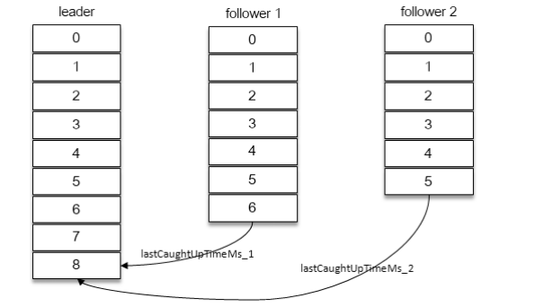
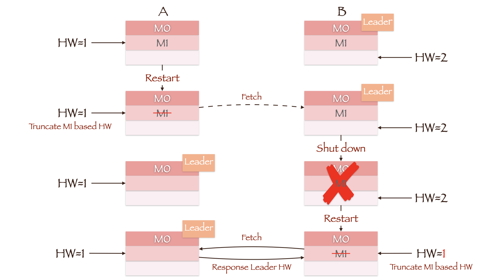

# 可靠性研究

[TOC]

## 副本

正常情况下，分区的所有副本都处于 ISR 集合中。在 ISR 集合之外的副本，称为失效副本，失效副本所对应的分区称为**同步失效分区**，即 **under-replicated 分区**。

当 ISR 集合中的一个 follower 副本滞后 leader 副本的时间超过 `replica.lag.time.max.ms`（Broker端参数，默认为 10000），则判定为同步失败，此时将此 follower 副本剔除出 ISR 集合。

具体来说就是，当 follower 副本同步到 leader 副本 LEO（LogEndOffset）时，就更新该副本的 `lastCaughtUpTimeMs` 标识。Kafka 的副本管理器会启动一个副本过期检测的定时任务，周期性检查当前时间与副本的 `lastCaughtUpTimeMs` 差值是否大于参数 `replica.lag.time.max.ms`。

一般有两种情况会导致副本失效：

- follower 副本进程卡住，在一段时间内根本没有向 leader 副本发起同步请求
- follower 副本进程同步过慢，在一段时间内都无法追赶上 leader 副本，比如 I/O 开销过大。

此外，如果一个 follower 副本滞后 leader 副本的消息数超过 `replica.lag.max.messages`（默认为 4000），则同样判定它处于同步失效的状态。由于该参数不好设置，因此从 0.9.x版本开始，Kafka 就彻底移除了该参数。

当 ISR 集合发生变更时，会更新 ZooKeeper 中的 `/brokers/topics/<topic>/ partition/<partition> /state` 节点，Kafka 还会将变更后的记录缓存到 isrChangeSet 中。`isr-change-propagation` 任务会周期性（固定值为 2500ms）地检查 isrChangeSet。如果发现 isrChangeSet 中有 ISR 集合的变更记录，那么它会在 ZooKeeper 的 /isr_change_notification 路径下创建一个以 isr_change_ 开头的持久顺序节点，并将 isrChangeSet 中的信息保存到这个节点中。

Kafka 控制器为/isr_change_ notification 添加了一个 Watcher，当这个节点中有子节点发生变化时，会触发 Watcher 的动作，以此通知控制器更新相关元数据信息，然后控制器向它管理的 broker 节点发送更新元数据的请求，最后删除在 /isr_change_notification 路径下已经处理过的节点。 

对于同步失效副本，如果它的 LEO 大于 leader 副本的 HW，那么就有资格进入 ISR 集合。SR 扩充之后，同样会更新 ZooKeeper 中的 `/brokers/topics/<topic>/ partition/<partition> /state` 节点和 isrChangeSet，之后的步骤就和 ISR 收缩时的相同。

每一个副本都保存了其 HW 值和 LEO 值

下面来看看 HW 是如何更新的：

1. follower 副本向 leader 副本拉取消息，在拉取的请求中会带有自身的 LEO 信息，这个 LEO 信息对应的是 FetchRequest 请求中的 fetch_offset。leader 副本选取 LEO 的最小值作为 HW。同时由于 Leader HW 只能单调递增，这个最小值还要与 HW 取一次最大值。
2. leader 副本将消息返回给 follower 副本，并且还带有自身的 HW 信息。这个 HW 信息对应的是 FetchResponse 中的 high_watermark。follower 取当前 LEO 和 leader 副本中传送过来的 HW 中的最小值，作为 HW

举例来说，如果一开始 Leader 和 Follower 中没有任何数据，即所有值均为 0。那么当Prouder 向 Leader 写入第一条消息，上述几个值的变化顺序如下：

| Leader LEO         | Remote LEO | Leader HW | Follower LEO | Follower HW |      |
| ------------------ | ---------- | --------- | ------------ | ----------- | ---- |
| Producer Write     | 1          | 0         | 0            | 0           | 0    |
| Follower Fetch     | 1          | 0         | 0            | 0           | 0    |
| Leader Update HW   | 1          | 0         | 0            | 0           | 0    |
| Leader Response    | 1          | 0         | 0            | 1           | 0    |
| Follower Update HW | 1          | 0         | 0            | 1           | 0    |
| Follower Fetch     | 1          | 1         | 0            | 1           | 0    |
| Leader Update HW   | 1          | 1         | 1            | 1           | 0    |
| Leader Response    | 1          | 1         | 1            | 1           | 0    |
| Follower Update HW | 1          | 1         | 1            | 1           | 1    |

Follower 往往需要进行两次 Fetch 请求才能成功更新 HW。

Kafka 中会有三个定时任务与 LEO、HW、XXXX-checkpoint有关，它们的作用分别是

1. 将所有分区的 LEO 刷写到 recovery-pointoffset-checkpoint 中。定时周期由 broker 端参数 `log.flush.offset.checkpoint.interval.ms` 来配置，默认值为 60000。
2. 将所有分区的 HW 刷写到 replication-offset-checkpoint 中，定时周期由 broker 端参数 `replica.high.watermark.checkpoint.interval.ms` 来配置，默认值为 5000。
3. 将所有分区的 logStartOffset 刷写到 log-start-offset-checkpoint 中，定时周期由broker端参数`log.flush.start.offset.checkpoint.interval.ms` 来配置，默认值为 60000。

HW 在切换 Leader 时有两个问题需要解决：

- 数据丢失问题
- 数据一致性问题

我们首先来看问题是怎么产生的

为了解决上述两种问题，Kafka 从 0.11.0.0 开始引入了 leader epoch 的概念，**Leader epoch 机制解决由于 HW 以及网络分区（Leader 切换）而造成的数据不一致性/数据丢失问题**

leader epoch 代表 leader 的纪元信息（epoch），初始值为 0。每当 leader 变更一次，leader epoch 的值就会加 1。与此同时，每个副本还会向 leader-epoch-checkpoint 文件增加一个元组` <LeaderEpoch，StartOffset>`来持久化纪元信息，其中 StartOffset 表示当前 LeaderEpoch 下写入的第一条消息的偏移量。

当一个 Follower 副本从故障中恢复重新加入ISR中，它将：

1. 向 Leader 发送 LeaderEpochRequest，请求中包含了 Follower 的 Epoch 信息；
2. Leader 将返回其 Follower 所在 Epoch 的 Last Offset
   1. 如果 Leader 与 Follower 处于同一 Epoch，那么 Last Offset 显然等于Leader LEO；
   2. 如果 Follower 的 Epoch 落后于 Leader，则 Last Offset 等于 Follower Epoch + 1 所对应的 Start Offset
3. Follower 接收响应后，根据返回的 Last Offset 来截断数据；

**Kafka 并不支持主写从读，只支持主写主读**。主写从读有一个明显的缺点——数据一致性问题，即数据从主节点转到从节点**必然**会有一个延时的时间窗口，这个时间窗口会导致主从节点之间的数据不一致。主写主读可以简化代码的实现逻辑，减少出错的可能

Kafka 又何必再去实现对它而言毫无收益的主写从读的功能呢？这一切都得益于 Kafka 优秀的 架构设计，**从某种意义上来说，主写从读是由于设计上的缺陷而做出的权宜之计。**

## 可靠性分析

副本数越多也会引起磁盘、网络带宽的浪费，同时会引起性能的下降。一般而言，设置副本数为 3，即可满足绝大多数场景对可靠性的要求。而对可靠性要求更高的场景下，比如国内部分银行在使用 Kafka 时就会设置副本数为 5

考虑这样一个场景：leader 副本的消息流入速度很快，而 follower 副本的同步速度很慢，在某个临界点时所有的 follower 副本都被剔除出了 ISR 集合，那么 ISR 中只有一个 leader 副本，最终 acks = -1 演变为 acks = 1 的情形。Kafka 也考虑到了这种情况，并为此提供了 `min.insync.replicas` 参数（默认值为 1），它指定了 ISR 集合中最小的副本数，如果不满足条件，就会抛出 NotEnoughReplicasException

与可靠性和 ISR 集合有关的还有一个参数—`unclean.leader.election.enable`。 这个参数的默认值为 false，如果设置为 true ，就意味着当 leader 下线时候，可以从非 ISR 集合中选举出新的 leader。

