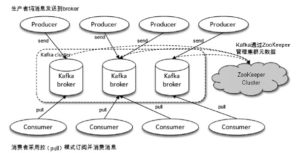
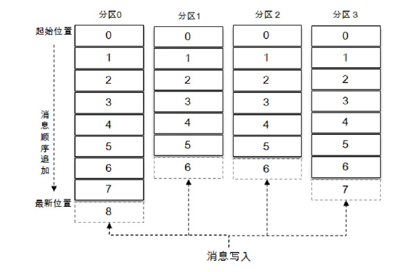
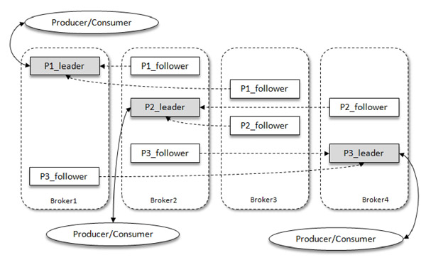
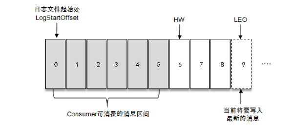

# 初识Kafka

[TOC]

## 概述

Kafka定位为一个「分布式流式处理」平台，它以高吞吐、可持久化、可水平扩展、支持流数据处理等多种特性而被广泛使用。它所扮演的三大角色：

- **消息系统**：Kafka 和传统的消息系统（也称作消息中间件）都具备「系统解耦」、「冗余存储」、「流量削峰」、「缓冲」、「异步通信」、「扩展性」、「可恢复性等功能」。与此同时，Kafka 还提供了大多数消息系统难以实现的「消息顺序性保障」及「回溯消费」的功能。
- **存储系统**：Kafka 把消息持久化到磁盘，有效地降低了数据丢失的风险
- **流式处理平台**：Kafka 不仅为每个流行的流式处理框架提供了可靠的数据来源，还提供了一个完整的流式处理类库，比如窗口、连接、变换和聚合等各类操作。

一个典型的 Kafka 体系架构包括：

- **Producer 生产者**：将消息发送到Broker
- **Broker 服务代理节点**：对于Kafka而言，Broker可以简单地看作一个独立的Kafka服务节点或Kafka服务实例。
- **Consumer 消费者**：负责从Broker订阅并消费消息
- **ZooKeeper集群**：负责集群元数据的管理、控制器的选举等操作。ZooKeeper是一个开源的分布式协调服务。分布式应用程序可以基于ZooKeeper实现诸如数据发布/订阅、负载均衡、命名服务、分布式协调/通知、集群管理、Master选举、配置维护等功能。

在Kafka中还有两个特别重要的概念—**主题（Topic）**与**分区（Partition）**：

- Kafka中的消息以主题为单位进行归类，生产者负责将消息发送到特定的主题，而消费者负责订阅主题并进行消费。

- 主题是一个逻辑上的概念，它还可以细分为多个分区，一个分区只属于单个主题。

  每一条消息被发送到 broker 之前，会根据分区规则选择存储到哪个具体的分区。如果分区规则设定得合理，所有的消息都可以均匀地分配到不同的分区中。如果一个主题只对应一个文件，那么这个文件所在的机器 I/O 将会成为这个主题的性能瓶颈，而分区解决了这个问题。Kafka中的分区可以分布在不同的服务器（broker）上。

  同一主题下的不同分区所包含的消息是不同的，分区在存储层面可以看作一个可追加的日志（Log）文件，消息在被追加到分区日志文件的时候，都会分配一个特定的偏移量（offset）。这是消息在分区中的唯一标识，Kafka通过它来保证消息在分区内的顺序性。不过offset并不跨越分区，也就是说，Kafka保证的是分区有序而不是主题有序。

  

  

Kafka 为分区引入了**多副本（Replica）**机制，通过增加副本数量可以提升容灾能力（故障的自动转移）。副本之间是「一主多从」的关系，其中leader副本负责处理读写请求，而follower副本只负责消息的同步。当leader出现故障时，从follower中重新选举新的leader。

Kafka 消费端也具备一定的容灾能力。Consumer 使用**拉（Pull）模式**从服务端拉取消息，并且保存消费的具体位置，当消费者宕机后恢复上线时可以根据之前保存的消费位置重新拉取需要的消息进行消费，这样就不会造成消息丢失。

分区中的所有副本统称为**AR（Assigned Replicas）**，与保持一定程度同步的副本（包括leader副本在内）组成**ISR（In-Sync Replicas）**，而同步滞后过多的副本（不包括leader副本）组成**OSR（Out-of-Sync Replicas）**。可见，`AR = ISR + OSR`。

默认情况下，当leader副本发生故障时，只有在ISR集合中的副本才有资格被选举为新的leader，原则上不考虑OSR集合中的副本。

ISR与HW和LEO有着紧密的关系。

- HW是High Watermark的缩写，俗称高水位，它标识了一个特定的消息偏移量（offset），消费者只能拉取到这个offset之前的消息。
- LEO是Log End Offset的缩写，它标识当前日志文件中下一条待写入消息的offset

分区ISR集合中的每个副本都会维护自身的LEO，而ISR集合中最小的LEO即为分区的HW，对消费者而言只能消费HW之前的消息。

可见，Kafka的复制机制既有同步，也有异步

- 同步是指， follower 副本都复制完这条消息，它才会被确认为已成功提交。
- 异步是指，follower 副本异步地从leader中复制消息

## 安装与配置

### Kafka

首先配置ZooKeeper

1. 将安装包解压到指定目录

   ~~~shell
   $ tar -zxvf kafka_2.12-2.4.1.tgz 
   ~~~

2. 修改配置文件`conf/server.properties`

   ~~~shell
   broker.id=0
   
   #端口号
   port=9092
   
   #服务器IP地址
   host.name=172.30.200.98  
   
   #broker对外提供的服务地址
   listeners=PLAINTEXT://localhost:9092
   
   #日志存放路径
   log.dirs=/mnt/soft/kafka_data/log/kafka 
   
   #zookeeper地址和端口
   zookeeper.connect=localhost:2181/kafka
   ~~~

   `zookeeper.connect=localhost:2181/kafka` 这一行配置定义了Kafka如何连接到ZooKeeper集群。其中`/kafka`表示在`ZooKeeper`中使用`/kafka`这个节点来存储和获取数据。

   - `message.max.bytes`，该参数用来指定broker所能接收消息的最大值，默认值为1000012（B），约等于976.6KB。如果 Producer 发送的消息大于这个参数所设置的值，那么（Producer）就会报出RecordTooLargeException的异常
   - log.dir和log.dirs：这两个参数用来配置Kafka 日志文件存放的根目录。log.dirs 的优先级比 log.dir 高
   - `broker.id`：该参数用来指定Kafka集群中broker的唯一标识
   - `listeners`：broker对外提供的服务地址
   - `zookeeper.connect`:该参数指明broker要连接的ZooKeeper集群的服务地址。如果ZooKeeper集群中有多个节点，则可以用逗号将每个节点隔开，类似于 `localhost1：2181，localhost2：2181，localhost3：2181`这种格式。

3. 启动服务

   ~~~shell
    bin/kafka-server-start.sh config/server.properties &
   ~~~

   可以通过`jps -l`命令查看Kafka服务进程是否已经启动

   

Kafka在2.8版本之后，就不再依赖Zookeeper

1. 修改 Kraft 协议配置文件`${kafka}/config/kraft/server.properties`

   ~~~properties
   node.id=1
   process.roles=broker,controller
   listeners=PLAINTEXT://localhost:9092,CONTROLLER://localhost:9093
   advertised.listeners = PLAINTEXT://:9092
   controller.quorum.voters=1@localhost:9093,2@localhost:9095,3@localhost:9097
   log.dirs=/home/myokuuu/kafka/logs
   ~~~

   - `node.id`：这将作为集群中的节点 ID，唯一标识。
   - `process.roles`：一个节点可以充当 broker 或 controller 
   - `listeners`：broker 将使用 9092 端口，而 kraft controller 控制器将使用 9093 端口。
   - `advertised.listeners`：这里指定 kafka 通过代理暴漏的地址，如果都是局域网使用，就配置`PLAINTEXT://:9092`即可。
   - `controller.quorum.voters`：这个配置用于指定 **controller 主控**选举的投票节点，所有`process.roles`包含 controller 角色的规划节点都要参与，即：zimug1、zimug2、zimug3。其配置格式为:`node.id1@host1:9093,node.id2@host2:9093`
   - `log.dirs`：kafka 将存储数据的日志目录，在准备工作中创建好的目录。

2. 生成一个唯一的集群 ID（在一台Kafka实例上执行即可）

   ~~~shell
   $ /home/kafka/kafka_2.13-3.1.0/bin/kafka-storage.sh random-uuid
   SzIhECn-QbCLzIuNxk1A2A
   ~~~

   然后运行
   ~~~shell
    /home/kafka/kafka_2.13-3.1.0/bin/kafka-storage.sh format \
   -t SzIhECn-QbCLzIuNxk1A2A \
   -c /home/kafka/kafka_2.13-3.1.0/config/kraft/server.properties
   ~~~

   `log.dirs`目录下多出一个 meta.properties 文件

   ~~~pro
   node.id=1
   version=1
   cluster.id=SzIhECn-QbCLzIuNxk1A2A

## 生产与消费

Kafka提供了许多实用的脚本工具，位于`${KAFKA_HOME}/bin`下，其中与主题有关的就是 kafka-topics.sh 脚本

~~~shell
$ bin/kafka-topics.sh --bootstrap-server localhost:9092 --create --topic topic-demo --replication-factor 1 --partitions 4
~~~

上述命令创建一个分区数为 4、副本因子为 1 的主题topic-demo。其中

- `--zookeeper`指定了Kafka所连接的ZooKeeper服务地址
- `--topic`指定了所要创建主题的名称
- `--replication-factor` 指定了副本因子
- `--partitions` 指定了分区个数（不得大于Broker的数量）
- `--create`是创建主题的动作指令

> 新版本中，zookeeper选项已经被废除了，用--bootstrap-server选项指定Kafka broker的地址和端口

查看分区

~~~shell
./kafka-topics.sh --list --bootstrap-server localhost:9092
~~~

通过kafka-console-consumer.sh脚本来订阅主题

~~~shell
$ bin/kafka-console-consumer.sh --bootstrap-server localhost:9092 --topic topic-demo
~~~

使用kafka-console-producer.sh脚本发送一条消息

~~~shell
$ bin/kafka-console-producer.sh --broker-list localhost:9092 --topic topic-demo
~~~

Kafka的Java客户端依赖如下：

~~~xml
<dependency>
    <groupId>org.apache.kafka</groupId>
    <artifactId>kafka-clients</artifactId>
    <version>2.0.0</version>
</dependency>
~~~

它还要log4j的实现

~~~xml
<!-- Log4j API and Core implementation required for binding -->
<dependency>
    <groupId>org.apache.logging.log4j</groupId>
    <artifactId>log4j-api</artifactId>
    <version>2.13.3</version>
</dependency>
<dependency>
    <groupId>org.apache.logging.log4j</groupId>
    <artifactId>log4j-core</artifactId>
    <version>2.13.3</version>
</dependency>
<!-- SLF4J Binding -->
<dependency>
    <groupId>org.apache.logging.log4j</groupId>
    <artifactId>log4j-slf4j-impl</artifactId>
    <version>2.13.3</version>
</dependency>
~~~

