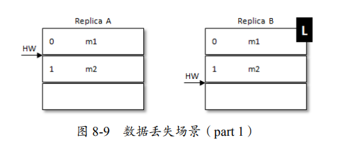
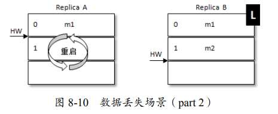
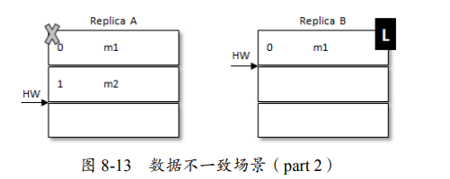
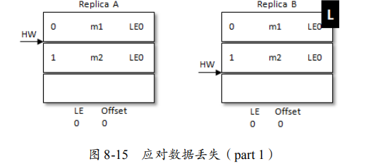
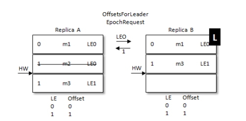
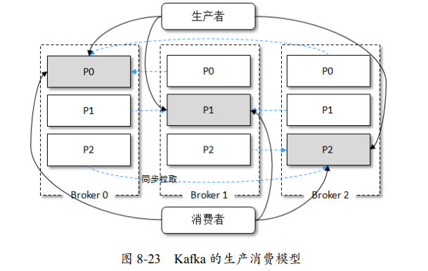

# 可靠性研究

[TOC]

## 副本

正常情况下，分区的所有副本都处于 ISR 集合中。在 ISR 集合之外的副本，称为失效副本，失效副本所对应的分区称为**同步失效分区**，即 **under-replicated 分区**。

当 ISR 集合中的一个 follower 副本滞后 leader 副本的时间超过 `replica.lag.time.max.ms`（Broker端参数，默认为 10000），则判定为同步失败，此时将此 follower 副本剔除出 ISR 集合。

具体来说就是，当 follower 副本同步到 leader 副本 LEO（LogEndOffset）时，就更新该副本的 `lastCaughtUpTimeMs` 标识。Kafka 的副本管理器会启动一个副本过期检测的定时任务，周期性检查当前时间与副本的 `lastCaughtUpTimeMs` 差值是否大于参数 `replica.lag.time.max.ms`。

一般有两种情况会导致副本失效：

- follower 副本进程卡住，在一段时间内根本没有向 leader 副本发起同步请求
- follower 副本进程同步过慢，在一段时间内都无法追赶上 leader 副本，比如 I/O 开销过大。

此外，如果一个 follower 副本滞后 leader 副本的消息数超过 `replica.lag.max.messages`（默认为 4000），则同样判定它处于同步失效的状态。由于该参数不好设置，因此从 0.9.x版本开始，Kafka 就彻底移除了该参数。

当 ISR 集合发生变更时，会更新 ZooKeeper 中的 `/brokers/topics/<topic>/ partition/<partition> /state` 节点，Kafka 还会将变更后的记录缓存到 isrChangeSet 中。`isr-change-propagation` 任务会周期性（固定值为 2500ms）地检查 isrChangeSet。如果发现 isrChangeSet 中有 ISR 集合的变更记录，那么它会在 ZooKeeper 的 /isr_change_notification 路径下创建一个以 isr_change_ 开头的持久顺序节点，并将 isrChangeSet 中的信息保存到这个节点中。

Kafka 控制器为/isr_change_ notification 添加了一个 Watcher，当这个节点中有子节点发生变化时，会触发 Watcher 的动作，以此通知控制器更新相关元数据信息，然后控制器向它管理的 broker 节点发送更新元数据的请求，最后删除在 /isr_change_notification 路径下已经处理过的节点。 

对于同步失效副本，如果它的 LEO 大于 leader 副本的 HW，那么就有资格进入 ISR 集合。SR 扩充之后，同样会更新 ZooKeeper 中的 `/brokers/topics/<topic>/ partition/<partition> /state` 节点和 isrChangeSet，之后的步骤就和 ISR 收缩时的相同。

下面来看看 HW 是如何更新的：

1. follower 副本向 leader 副本拉取消息，在拉取的请求中会带有自身的 LEO 信息，这个 LEO 信息对应的是 FetchRequest 请求中的 fetch_offset。leader 副本选取LEO的最小值作为新的 HW
2. leader 副本 返回给 follower 副本相应的消息，并且还带有自身的 HW 信息。这个 HW 信息对应的是 FetchResponse 中的 high_watermark。follower 取当前 LEO 和 leader 副本中传送过来的 HW 中的最小值，作为 HW

leader 副本收到 follower 副本的 FetchRequest 请求之后，它首先会从自己的日志文件中读取数据，然后在返回给 follower 副本数据前， 先更新 follower 副本的 LEO。

在一个分区中，leader 副本所在的节点会记录所有副本的 LEO，而 follower 副本所在的节点只会记录自身的 LEO。

Kafka 中会有三个定时任务与 LEO、HW、XXXX-checkpoint有关，它们的作用分别是

1. 将所有分区的 LEO 刷写到 recovery-pointoffset-checkpoint 中。定时周期由 broker 端参数 `log.flush.offset.checkpoint.interval.ms` 来配置，默认值为 60000。
2. 将所有分区的 HW 刷写到 replication-offset-checkpoint 中，定时周期由 broker 端参数 `replica.high.watermark.checkpoint.interval.ms` 来配置，默认值为 5000。
3. 将所有分区的 logStartOffset 刷写到 log-start-offset-checkpoint 中，定时周期由broker端参数`log.flush.start.offset.checkpoint.interval.ms` 来配置，默认值为 60000。

我们来考虑这样一个场景：

1. 

   

2. 在 A 写入消息 m2 之后（LEO 更新为 2）需要再一轮的 FetchRequest/ FetchResponse 才能更新自身的 HW 为 2。如果在这个时候 A 宕机了，那么在 A 重启之后，会根据之前 HW 位置进行日志截断，这样便会将 m2 这条消息删除

   

3. 此时若 B 再宕机，那么 A 就会被选举为新的 leader。B 恢复之后会成为 follower，由于 follower 副本 HW 不能比 leader 副本的 HW 高，所以还会做一次日志截断，以此将 HW 调整为 1。这样一来 m2 这条消息就丢失了

   

再来看一种情形：

1. 当前 leader 副本为 A，follower 副本为 B，A 中有 2 条消息 m1 和 m2，并 且 HW 和 LEO 都为 2，B 中有 1 条消息 m1，并且 HW 和 LEO 都为 1。

   

2. 假设 A 和 B 同时“挂掉”，然后 B 第一个恢复过来并成为 leader

   

3. 之后 B 写入消息 m3，并将 LEO 和 HW 更新至 2。此时 A 也恢复过来了，它会被赋予 follower 的角色。不过此时 A 的 HW 正好也为 2， 那么就可以不做截断。

   

如此一来，出现了数据不一致的情况。为了解决上述两种问题，Kafka 从 0.11.0.0 开始引入了 leader epoch 的概念，在需要截断数据时，使用 leader epoch 作为参考依据，而不是原本的 HW。

leader epoch 代表 leader 的纪元信息（epoch），初始值为 0。每当 leader 变更一次，leader epoch 的值就会加 1。与此同时，每个副本还会向 leader-epoch-checkpoint 文件增加一个元组` <LeaderEpoch，StartOffset>`，其中 StartOffset 表示当前 LeaderEpoch 下写入的第一条消息的偏移量。

我们再来考察第一个示例：

同样 A 发生重启，之后 A 不是先忙着截断日志，而是先发送 `OffsetsForLeaderEpochRequest` 请求（其中包含 A 当前的 LeaderEpoch 值）给 B。B在收到请求之后，如果 A 中的 LeaderEpoch（假设为 LE_A）和 B 中的不相同，那么 B 会查找 LeaderEpoch 为 LE_A + 1 对应的 StartOffset 并返回给 A。这里由于没有 LE_A + 1，所以返回B的 LEO。此时，A无需截断日志了，数据丢失的问题就解决了。

下面我们看第二个示例：假设 A 和 B 同时挂掉

然后 B 第一个恢复过来，并成为新的 leader

之后 B 写入消息 m3，并将 LEO 和 HW 更新至 2，注意此时的 LeaderEpoch 已经从 LE0 增至 LE1 了。紧接着 A 也恢复过来成为 follower 并向 B 发送 OffsetsForLeaderEpochRequest 请求，此时 A 的 LeaderEpoch 为 LE0。B 根据 LE0 查询到对应的 offset 为 1 并返回给 A，A 就截断日志并删除了消息 m2

**Kafka 并不支持主写从读，只支持主写主读**。主写从读有一个明显的缺点——数据一致性问题，即数据从主节点转到从节点**必然**会有一个延时的时间窗口，这个时间窗口会导致主从节点之间的数据不一致。为什么 Kafka 不支持主写从读呢？我们先来看这样一个理想场景

我们很明显地可以看出，每个 broker 上的读写负载都是一样的，无需主写从读。有以下几种情况会造成一定程度上的负载不均衡：

- broker 端的分区分配不均
- 生产者写入消息不均
- 消费者消费消息不均
- ...

对于第二和第三种情况，主写从读也无法解决。总的来说，Kafka 只支持主写主读有几个优点:

1. 可以简化代码的实现逻辑，减少出错的可能
2. 在副本稳定的情况下，不会出现数据不一致问题。
3. ...

Kafka 又何必再去实现对它而言毫无收益的主写从读的功能呢？这一切都得益于 Kafka 优秀的 架构设计，**从某种意义上来说，主写从读是由于设计上的缺陷而做出的权宜之计。**

## 可靠性分析

副本数越多也会引起磁盘、网络带宽的浪费，同时会引起性能的下降。一般而言，设置副本数为 3，即可满足绝大多数场景对可靠性的要求。而对可靠性要求更高的场景下，比如国内部分银行在使用 Kafka 时就会设置副本数为 5

考虑这样一个场景：leader 副本的消息流入速度很快，而 follower 副本的同步速度很慢，在某个临界点时所有的 follower 副本都被剔除出了 ISR 集合，那 么 ISR 中只有一个 leader 副本，最终 acks = -1 演变为 acks = 1 的情形。Kafka 也考虑到了这种情况，并为此提供了 `min.insync.replicas` 参数（默认值为 1），它指定了 ISR 集合中最小的副本数，如果不满足条件，就会抛出 NotEnoughReplicasException

与可靠性和 ISR 集合有关的还有一个参数—`unclean.leader.election.enable`。 这个参数的默认值为 false，如果设置为 true ，就意味着当 leader 下线时候，可以从非 ISR 集合中选举出新的 leader。

