# Netty

## 概述

Netty 是一个异步事件驱动的网络应用框架，用于快速开发可维护的高性能服务器和客户端。它封装了难用的 JDK  NIO，而且解决了它的空轮询 Bug。这个Bug是这样的，即使当前没有就绪的事件，但 NIO 还不断 wake up 本应该阻塞的Selector.select() / Selector.select(timeout) ，从而导致 CPU 飙到100%问题。官方给出的复现Bug的方法：

1. client connects and write message
2. server accepts and register OP_READ
3. server reads message and remove OP_READ from interest op set
4. client close the connection
5. server write message (without any reading.. surely OP_READ is not set)
6. server’s select wakes up infinitely with return value 0

这是因为 poll 和 epoll 对于突然中断的连接 socket ，会在 eventSet 事件集合中标记 EPOLLHUP 或者 EPOLLERR，也就是说，**eventSet 事件集合发生了变化**，这就会导致 Selector 被唤醒。

>epoll感兴趣的事件集合
>
>| 符号         | 描述                                                         |
>| ------------ | ------------------------------------------------------------ |
>| EPOLLIN      | 表示对应的文件描述符可以读（包括对端SOCKET正常关闭)          |
>| EPOLLOUT     | 表示对应的文件描述符可以写；                                 |
>| EPOLLPRI     | 表示对应的文件描述符有紧急的数据可读（这里应该表示有带外数据到来）； |
>| EPOLLERR     | 表示对应的文件描述符发生错误；                               |
>| EPOLLHUP     | 表示对应的文件描述符被挂断；                                 |
>| EPOLLET      | 将 EPOLL设为边缘触发(Edge Triggered)模式（默认为水平触发），这是相对水平触发(Level Triggered)来说的。 |
>| EPOLLONESHOT | 只监听一次事件，当监听完这次事件之后，如果还需要继续监听这个socke的话，需要再次把这个socket加入到EPOLL队列里 |

Netty 的解决方案是通过记录空轮询次数，来判断是否发生了空轮询 Bug（Netty 默认是 512次），若发生空轮询Bug则重建 Selector。

## 入门

`Maven` 依赖：

~~~xml
<dependency>
    <groupId>io.netty</groupId>
    <artifactId>netty-all</artifactId>
    <version>4.1.107.Final</version>
</dependency>
~~~

`AbstractBootstrap` 类是 `Netty` 提供的一个的工厂类，简化组装 `Channel`、`EventLoop` 等组件的过程。它有两个默认实现类，一个是`ServerBootstrap`用于服务端的，而另一个是 `Bootstrap` 用于客户端的。

一个 `ServerBootstrap` 例子：

~~~java
public class NettyDiscardServer {
    private final int serverPort;
    ServerBootstrap b = new ServerBootstrap();

    public NettyDiscardServer(int port) {
        this.serverPort = port;
    }
    public void runServer() {
        // boss 相当于 Accept Reactor 中的线程池
        EventLoopGroup bossLoopGroup = new NioEventLoopGroup(1);
        
        // worker 相当于处理业务数据的 Reactor中的线程池
        EventLoopGroup workerLoopGroup = new NioEventLoopGroup();

        try {
            // 1. 设置 Reactor 轮询组
            b.group(boosLoopGroup, workerLoopGroup);
            
            //2. 设置父通道的类型，就是以什么类型封装底层的 Java Nio 的 Channel
            b.channel(NioServerSocketChannel.class);
            
            //3. 设置监听端口
            b.localAddress(serverPort);
            
            //4. 设置通道的参数
            // option() 为每一个父通道进行配置，而 childOptio() 为每一个子通道进行配置
            b.option(ChannelOption.SO_KEEPALIVE, true);
            
            //5. 装配 Channel 流水线
            b.childHandler(new ChannelInitializer<SocketChannel>() {
                protected void initChannel(SocketChannel ch) {
                    // 给流水线添加一个 Handler 处理器
                    ch.pipeline().addLast(new NettyDiscardHandler());
                }
            });
            
            //6. 开始绑定服务器
            ChannelFuture channelFuture = b.bind().sync();
            
            //7. 等待通道关闭的异步任务结束
            ChannelFuture closeFuture = channelFuture.channel().closeFuture();
            closeFuture.sync();
        } catch (Exception e) {
            e.printStackTrace();
        } finally {
            // 释放掉所有资源，包括创建的线程
            workerLoopGroup.shutdownGracefully();
            boosLoopGroup.shutdownGracefully();
        }
    }

    public static void main(String[] args) {
        int port = NettyDemoConfig.SOCKET_SERVER_PORT;
        new NettyDiscardServer(port).runServer();
    }
}
~~~

一个 `Bootstrap` 的例子：

~~~java
NioEventLoopGroup workerGroup = new NioEventLoopGroup();
Bootstrap bootstrap = new Bootstrap();
bootstrap
    .group(workerGroup)							      // 1. 指定线程模型
    .channel(NioSocketChannel.class)				   // 2. 指定通道的 IO 类型
    .handler(new ChannelInitializer<SocketChannel>() {	// 3. IO 处理逻辑
        @Override
        public void initChannel(SocketChannel ch) {}
    });

// 4.建立连接
bootstrap.connect("juejin.cn", 80).addListener(future -> {
    if (future.isSuccess()) {
        System.out.println("连接成功!");
    } else {
        System.err.println("连接失败!");
    }
});
~~~

`NioEventLoopGroup` 内部维护了一个线程池，线程对象就是 `NioEventLoop`，`NioEventLoopGroup` 构造函数可以指定内部线程数，默认是 $2 * CPU$。而`NioEventLoop` 是 Netty 中对本地线程的抽象。通常来说，NioEventLoop 肩负着两种任务

- 作为 IO 线程，执行与 Channel 相关的 IO 操作，包括调用 select 等待就绪的 IO 事件、读写数据与数据的处理等；

- 作为任务队列, 执行 `taskQueue` 中的任务。 例如,用户调用 `eventLoop.schedule` 提交的定时任务，正是这个线程执行的。

  ~~~java
  EventLoopGroup group = new NioEventLoopGroup();
  EventLoop loop = group.next();
  final Future<?> future = loop.schedule(...);
  ~~~

  ~~~java
  bootstrap.config().group().schedule(...);
  ~~~

  

Netty 中, 每个 Channel 都有且仅有一个 EventLoop 与之关联。注意，EventLoop 和 NettyChannel 是一对多的关系。

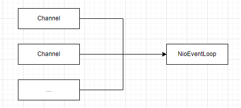

实际上，服务器端的 ServerSocketChannel 只绑定到了 bossGroup 中的一个线程，在大多数情况下，给 bossGroup 设置多个线程是无意义的。但当我们绑定多个端口时，bossGroup 的线程池就有意义了：

~~~java
EventLoopGroup bossGroup = new NioEventLoopGroup(2);
ServerBootstrap b = new ServerBootstrap();
ChannelFuture f1 = b.bind(8001).sync();
ChannelFuture f2 = b.bind(8002).sync();
~~~

`Handler` 就是负责业务逻辑的处理，它被挂载到流水线上。

~~~java
class NettyDiscardHandler extends ChannelInboundHandlerAdapter {
    @Override
    public void channelRead(ChannelHandlerContext ctx, Object msg) throws Exception {
        ByteBuf in = (ByteBuf) msg;
        try {
            while (in.isReadable()) {
                in.readByte();
            }
        } finally {
            ReferenceCountUtil.release(msg);
        }
    }
}
~~~

如果 `Handler` 被阻塞的话，那么会阻塞整条流水线，从而严重影响 `Reactor` 模式的性能。解决方案如下：

- 新开一个 JDK 线程（不推荐，原因见下）。

- 在我们向 `pipeline` 添加 `ChannelHandler` 的时候可以通过`ChannelPipeline#addLast(EventExecutorGroup, ChannelHandler)` 方法指定执行该 `ChannelHandler` 的 `executor`。

`DefaultEventExecutorGroup` 线程池持有的是 `DefaultEventExecutor` 线程。为 `ChannelHandler` 指定了 `EventExecutorGroup` 之后，那么在创建 `ChannelHandlerContext` 上下文时，会从 `EventExecutorGroup` 中选择一个 `EventExecutor` 绑定到该 `ChannelHandler` 实例上。降低了锁竞争

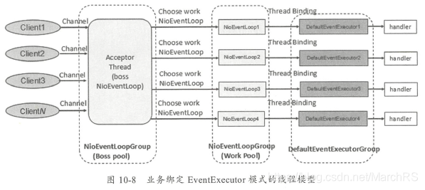

而 JDK 自带的线程池，内部使用了一个阻塞队列，因此当 Client 较多时，就会形成激烈的锁竞争。

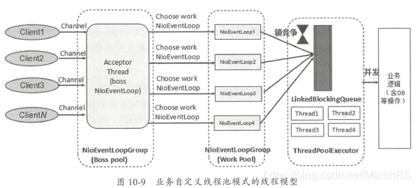

Netty 的 `Channel` 对 Java NIO 的 `SelectableChannel` 进行了封装和扩展。支持多种通信协议，常见通道类型（Nio异步非阻塞，Oio同步阻塞式）如下：

- NioSocketChannel：TCP Socket 传输通道。 
- NioServerSocketChannel：TCP Socket 服务端监听通道。 
- NioDatagramChannel：UDP 传输通道。 
- NioSctpChannel：Sctp 传输通道。 
- NioSctpServerChannel：Sctp 服务端监听通道。 

- OioSocketChannel：TCP Socket 传输通道。 
- OioServerSocketChannel：TCP Socket 服务端监听通道。 
- OioDatagramChannel：UDP 传输通道。 
- OioSctpChannel：Sctp 传输通道。 
- OioSctpServerChannel：Sctp 服务端监听通道。

操作系统底层的 socket 文件描述符分为两类：

- 连接监听类型
- 数据传输类型

在 Netty 中，负责连接监听的通道（例如，NioServerSocketChannel）称为父通道，而负责数据传输的通道称为子通道。每个 SocketChannel 代表了 TCP 一个连接。

`ChannelOption` 提供的选项：

- `SO_RCVBUF` 和 `SO_SNDBUF`：设置接收缓冲区以及发送缓冲区的大小

- `TCP_NODELAY`：是否关闭 Nagle 算法。Nagle 算法将小的碎片数据连接成更大的报文（或数据包）来最小化所发送报文的数量。

- `SO_KEEPALIVE`：默认值为 false，TCP 会主动探测空闲连接的有效性。默认的心跳间隔是 7200 秒

- `SO_REUSEADDR`：默认值为 false，true 表示地址复用。有四种情况需要设置为 true

  - 当有一个地址和端口相同的连接 socket1 处于 TIME_WAIT 状态时，而又希望启动一个新的连接 socket2要占用该地址和端口
  - ...

- `SO_LINGER`：控制 socket.close() 方法的行为。

  - -1（默认值）：socket.close() 方法在调用后立即返回，但操作系统底层会将发送缓冲区的数据全部发送到对端
  - 0：socket.close() 方法在调用后会立即返回，但是操作系统会放弃发送缓冲区数据，直接向对端发送RST包
  - 正数：socket.close() 同步阻塞，若超时，则立即返回并发送 RST 包。

- `SO_BACKLOG`：设置存放握手连接的队列的长度。

  具体来说，服务端对完成第二次握手的连接放在一个队列（暂时称A队列），如果进一步完成第三次握手，再把连接从 A 队列移动到新队列（暂时称 B 队列），接下来应用程序会通过调用 accept() 方法取出握手成功的连接，而系统则会将该连接从 B 队列移除。A 和 B 队列的长度之和是 `SO_BACKLOG` 指定的值，当 A 和 B 队列的长度之和大于 `SO_BACKLOG` 值时，新连接将会被拒绝。

- `SO_BROADCAST`：设置为广播模式

`serverBootstrap.bind(8000)` 是一个异步的方法，返回 `ChannelFuture`，我们可以给`ChannelFuture`添加一个监听器`GenericFutureListener`，然后我们在`GenericFutureListener`的`operationComplete`方法里面，我们可以监听端口是否绑定成功：

~~~java
// 自动绑定递增端口
serverBootstrap.bind(port).addListener(new GenericFutureListener<Future<? super Void>>() {
    public void operationComplete(Future<? super Void> future) {
        if (future.isSuccess()) {
            System.out.println("端口[" + port + "]绑定成功!");
        } else {
            // 继续绑定
            bind(serverBootstrap, port + 1);
        }
    }
});
~~~

`ChannelPipeline` 用于处理 `Channel` 和 `Handler` 之间的绑定关系。

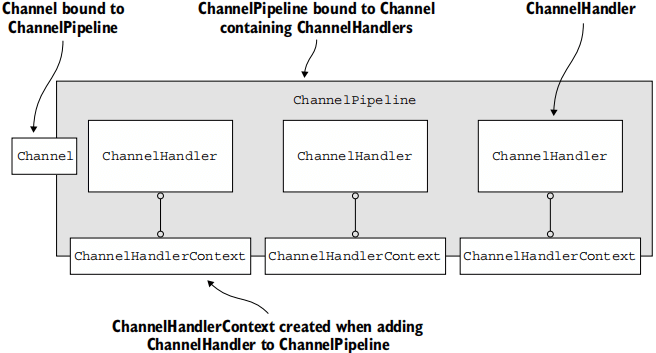

`ChannelHandlerContext` 和 `Channel` 都提供了 `attr` 方法。在 4.1 之前，每一个 `ChannelHandlerContext` 都自己独自维护一份 AttributeMap，而且在 `Channel` 中有一个被所有 `Handler` 共享的 `AtrributeMap`。但在 Netty 4.1 之后，它们设置的属性作用域都是 `Channel` 的，也就是说，在 `ChannelHanderContext` 上设置的属性，实际上是在 `Channel` 上设置的。

我们可以通过 `ServerBootstrap` 或 `Boostrap` 的 `attr` 方法，来初始化父 `Channel` 的 `AttributeMap`。`childAttr` 类似，是用于初始化子通道的 `AttributeMap`。此外，通过 `channel.attr(key).set/get` 来访问 `AttributeMap`

~~~java
serverBootstrap.attr(AttributeKey.newInstance("serverName"), "nettyServer");
serverBootstrap.childAttr(AttributeKey.newInstance("clientKey"), "clientValue");

public class MyHandler extends ChannelInboundHandlerAdapter {
    private static final AttributeKey<String> KEY = AttributeKey.valueOf("clientKey");
    @Override
    public void channelActive(ChannelHandlerContext ctx) throws Exception {
        // 如果在子通道中，因此访问的是 childAttr 中初始化的属性
        String attr = ctx.channel().attr(KEY).get();
        
       	// 动态设置 AttributeMap
        ctx.channel().attr(SESSION_KEY).set(session)
    }
}
~~~

## ByteBuf

Netty 提供了 ByteBuf 缓冲区组件来替代 Java NIO 的 ByteBuffer 缓冲区组件，以便更加快捷和高效地操纵内存缓冲区。ByteBuf 内部是一个字节数组，可以分为四个部分

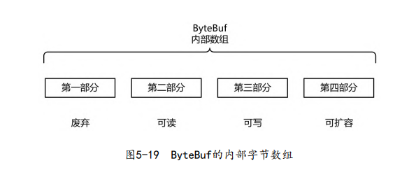

有三个关键属性定义在`AbstractByteBuf`抽象类中

- `readerIndex`（读指针）：指示读取的起始位置。
- `writerIndex`（写指针）：指示写入的起始位置。
- `maxCapacity`（最大容量）

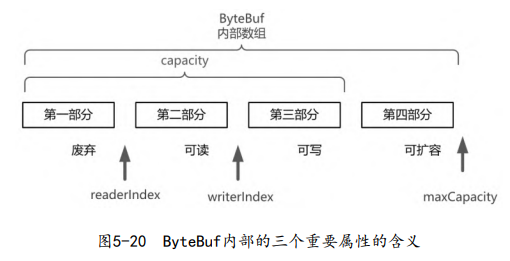

满足的约束：
$$
readerIndex \leq writerIndex \leq capacity \leq maxCapacity
$$

当 `writerIndex = capacity` 且 $capacity \not= maxCapacity$ 时，会进行扩容

有关 `Capacity` 的 API

- `capacity()`：表示 ByteBuf 底层占用了多少字节的内存（包括丢弃的字节、可读字节、可写字节）

- `maxCapacity()`：表示 ByteBuf 底层最多能够占用多少字节的内存

- `readableBytes()`：表示 `ByteBuf` 当前可读的字节数，它的值等于 `writerIndex-readerIndex`

- `isReadable()`：表示是否可读， `readableBytes` 返回 `0` 当且仅当 `isReadable` 返回 `false`

- `writableBytes()`：表示 ByteBuf 当前可写的字节数，它的值等于 `capacity-writerIndex`。

- `isWritable()`：表示是否可写，`writableBytes` 返回 `0` 当且仅当 `isWritable` 返回 `false`

- `maxWritableBytes()` 就表示可写的最大字节数，它的值等于 `maxCapacity-writerIndex`

  

有关读写指针的 API：

- `readerIndex()`：返回当前的读指针

- `readerIndex(int)`：设置读指针

- `writeIndex()`：返回当前的写指针

- `writeIndex(int)`：设置写指针

- `markReaderIndex()`：把当前的读指针保存起来

- `resetReaderIndex()`：把当前的读指针恢复到之前保存的值

  下面两端代码是等价的：

  ~~~Java
  // 代码片段1
  int readerIndex = buffer.readerIndex();
  buffer.readerIndex(readerIndex);
  
  // 代码片段二
  buffer.markReaderIndex();
  buffer.resetReaderIndex();
  ~~~

- `discardReadBytes()`：释放 `0～readerIndex` 这部分空间

  ~~~
      +-------------------+------------------+------------------+
      | discardable bytes |  readable bytes  |  writable bytes  |
      +-------------------+------------------+------------------+
      |                   |                  |                  |
      0               readerIndex=M    writerIndex=N       capacity
  
  调用 discardReadBytes() 后
  
      +------------------+----------------------+
      |  readable bytes  |    writable bytes    |
      +------------------+----------------------+
      |                  |                      |
   readerIndex=0   writerIndex=N-M           capacity
  ~~~

- `clear()`：将读写指针都设置为 0

有关读写的 API：

- `writeBytes(byte[] src)`：把字节数组 src 里面的数据全部写到 ByteBuf

- `readBytes(byte[] dst)`：把 ByteBuf 里面的数据全部读取到字节数组 dst

- `writeByte()` ：往 ByteBuf 中写一个字节

- `readByte()`：从 ByteBuf 中读取一个字节

  

类似的 API 还有 writeBoolean()、writeChar()、writeShort()、writeInt()、writeLong()、writeFloat()、writeDouble() 与 readBoolean()、readChar()、readShort()、readInt()、readLong()、readFloat()、readDouble() ，这里就不一一赘述了

与读写 API 类似的 API 还有 getBytes()、getByte() 与 setBytes()、setByte() 系列，唯一的区别就是 get/set 不会改变读写指针，而 read/write 会改变读写指针

Netty 提供的 ByteBuf 有多种实现类，每种都有不同的特性和使用场景，主要分为三种类型：

1. Pooled 和 Unpooled：Pooled 就是从预先分配好的内存中取出来，使用完成后又放回 ByteBuf 内存中，等待下一次分配。而 Unpooled 是直接调用系统 API 来申请内存的，使用完成后需要立刻销毁的。
2. Heap 和 Direct：Heap 就是在 JVM 堆内分配的，其生命周期受 JVM 管理，我们不需要主动回收他们。而 Direct 则由操作系统管理，使用完成后需要主动释放这部分内存，否则容易造成内存溢出
3. Safe 和 Unsafe：Unsafe 表示每次调用 JDK 的 Unsafe 对象操作物理内存的，而 Safe 则不需要依赖 JDK 的 Unsafe 对象，直接通过数组下标的方式来操作。

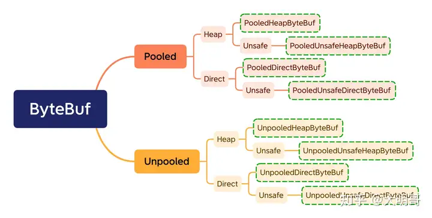

注：本笔记所有的 ByteBuf 默认都是 Safe 的。

Heap ByteBuf 可以直接获取内部数组，而 Direct ByteBuf 却不可以访问。

~~~java
// Direct ByteBuf 的 hasArray() 会返回 false
if (heapBuf.hasArray()) {
    byte[] array = heapBuf.array();
    // 在某些情况下，Netty 的 ByteBuf 可能会使用字节数组的其中一部分，而不是使用整个数组。此时，arrayOffset() 会返回 ByteBuf 开始的数组内的偏移量。
    int offset = heapBuf.arrayOffset() + heapBuf.readerIndex();
    int length = heapBuf.readableBytes();
}
~~~

Netty 的通过引用计数方式来管理 ByteBuf 的生命周期的。ByteBuf 实例的`retain()`方法将引用计数`+1`，而`release()`方法将引用计数 `-1`。如果引用计数为`0`，那么就不可以访问该`ByteBuf`（包括调用`retain()` & `release()`方法），否则抛出`IllegalReferenceCountException`异常。当 ByteBuf 的引用计数为 0 时，Netty 会分情况对 ByteBuf 进行回收：

- 如果属于池化的 ByteBuf 内存，直接放回 ByteBuf 池中（堆或者直接内存）
- 如果**非**池化的 ByteBuf 内存 
  - 如果在堆上分配的，那么由 JVM 回收
  - 如果在直接内存的，那么调用本地方法（`unsafe.freeMemory`）来释放内存

Netty 还提供了一组用于增加和减少引用计数的静态方法

- ReferenceCountUtil.retain(Object)
- ReferenceCountUtil.release(Object)

Netty 在 HeadContext 以及 TailContext 这两个处理器中自动释放一次 ByteBuf。但是如果截断了传播，即没有调用 super.channelRead 。那么必须手动释放 ByteBuf

~~~java
public class DemoHandler extends ChannelInboundHandlerAdapter {
    @Override
    public void channelRead(
        ChannelHandlerContext ctx, 
        Object msg){
    	ByteBuf byteBuf = (ByteBuf) msg;
        
        //调用父类的入站方法，默认的动作是将 msg 向下一个入站传递，一直到末端
        super.channelRead(ctx, msg);
        
        // 如果不调用 super.channelRead，那么就手动释放 ByteBuf
        // byteBuf.release(); 
    }
}
~~~

子类可以继承`SimpleChannelInboundHandler`，此时，子类应该覆写`channelRead0`方法，而不是`channelRead`方法。这样无论是否截断传播，都自动释放一次 ByteBuf，它的源码如下：

~~~java
public abstract class SimpleChannelInboundHandler<I> extends ChannelInboundHandlerAdapter {
    @Override
 	public void channelRead(ChannelHandlerContext ctx, Object msg) {
        boolean release = true;
        try {
            if (acceptInboundMessage(msg)) {
                // 注意这里的泛型参数
            	I imsg = (I) msg;
                channelRead0(ctx, imsg);
            } else {
                release = false;
                ctx.fireChannelRead(msg);
            }
        } finally {
           	if (autoRelease && release) {
                ReferenceCountUtil.release(msg);
            }
        }
    }
}
~~~

`slice()`方法可以获取到一个 ByteBuf 的切片，即将`ByteBuf`分解为多个共享同一个底层数组的 ByteBuf，避免了内存的拷贝。

- `public ByteBuf slice()`，等价于`slice(readerIndex, readableBytes())`

  该方法所返回的切片：

  - readerIndex（读指针）初始值为 0
  - writerIndex（写指针）初始值为源 ByteBuf 的 readableBytes()
  - maxCapacity（最大容量）初始值为源 ByteBuf 的 readableBytes()

- `public ByteBuf slice(int index, int length)`

由于返回的切片是浅复制的，所以与源 BufByte 共享一个底层数组，而且并不会改变源`ByteBuf`的引用计数。

`duplicate()` 也返回整个源 ByteBuf 的浅复制，但是初始读写指针、最大容量值与源 ByteBuf 的相同。

`copy()` 是返回整个源 ByteBuf 的深复制，也就是说，它的底层数组和源 ByteBuf 的无关，初始读写指针、最大容量值与源 ByteBuf 的相同。

这三个方法所返回的 `ByteBuf` 都维护着各自的读写指针，与源 ByteBuf 的互不影响。

 

Netty 通过`ByteBufAllocator`分配器来创建缓冲区，并提供了两种实现：`PoolByteBufAllocator`和 `UnpooledByteBufAllocator`。在 Netty 中，`ByteBufAllocator.DEFAULT`为默认分配器。该分配器是否要池化，可以通过`io.netty.allocator.type`系统参数进行配置，可取值为：`unpooled`，`pooled`（默认值）。

~~~bash
java -Dio.netty.allocator.type=pooled ...
~~~

下面来创建一个 ByteBuf

~~~java
//初始容量为 9、最大容量为 100 的缓冲区
buffer = ByteBufAllocator.DEFAULT.buffer(9, 100);

//初始容量为 256、最大容量为 Integer.MAX_VALUE 的缓冲区
buffer = ByteBufAllocator.DEFAULT.buffer();

//方法3：非池化分配器，分配在 Java 堆
buffer = UnpooledByteBufAllocator.DEFAULT.heapBuffer();

//方法4：池化分配器，分配在直接内存缓冲区中
buffer = PooledByteBufAllocator.DEFAULT.directBuffer();

//方法4：池化分配器，分配在 Java 堆
buffer = PooledByteBufAllocator.DEFAULT.heapBuffer()
~~~

可以通过 `ChannelHandlerContext#alloc().buffer()`来创建缓冲区

~~~java
class AllocDemoHandler 
    extends ChannelInboundHandlerAdapter {
    @Override
 	public void channelRead(
        ChannelHandlerContext ctx, 
        Object msg) throws Exception {
        ByteBuf buf = ctx.alloc().buffer();
    }
}
~~~

该分配器可以通过`Bootstrap`引导类来设置，也可以通过`channel.config().setAllocator()`来设置。默认就是 `ByteBufAllocator.DEFAULT`

`Unpooled`提供了静态的辅助方法来创建未池化的`ByteBuf`实例：

- buffer() / buffer(int initialCapacity) / buffer(int initialCapacity, int maxCapacity)

- directBuffer() 

- wrappedBuffer()：将 byte[] 包装成为一个`UnpooledHeapByteBuf`对象, 而在包装的过程中, 是不会有拷贝操作的。对 byte[] 的修改也会反映到`ByteBuf`对象中。

  ~~~java
  public static ByteBuf wrappedBuffer(byte[] array)
  public static ByteBuf wrappedBuffer(byte[] array, int offset, int length)
  public static ByteBuf wrappedBuffer(byte[]... arrays)
  ~~~

  ~~~java
  // 传统方法
  byte[] bytes = ...
  ByteBuf byteBuf = Unpooled.buffer();
  byteBuf.writeBytes(bytes);
  
  // 零拷贝技术
  byte[] bytes = ...
  ByteBuf byteBuf = Unpooled.wrappedBuffer(bytes);
  ~~~

  ~~~java
  // 返回 CompositeByteBuf
  public static ByteBuf wrappedBuffer(ByteBuffer buffer)
  public static ByteBuf wrappedBuffer(ByteBuf buffer)
  public static ByteBuf wrappedBuffer(ByteBuf... buffers)
  public static ByteBuf wrappedBuffer(ByteBuffer... buffers)
  ~~~

- copiedBuffer()

此外，Netty 提供了`CompositeByteBuf`类, 它可以将多个`ByteBuf`合并为一个逻辑上的`ByteBuf`, 避免了各个`ByteBuf`之间的拷贝。实际上，`wrappedBuffer(ByteBuf... buffers)` 也返回一个 `CompositeByteBuf`

~~~java
// 将 header 和 body 合并为一个ByteBuf 的代码

// 不使用 CompositeByteBuf
ByteBuf headerBuf = …
ByteBuf bodyBuf = …
    
long length=headerBuf.readableBytes() + bodyBuf.readableBytes()；
ByteBuf allBuf = Unpooled.buffer(length);
allBuf.writeBytes(headerBuf);		// 拷贝header数据
allBuf.writeBytes(body);			// 拷贝body数据

// 使用
ByteBuf headerBuf = …
ByteBuf bodyBuf = …
    
CompositeByteBuf compositeByteBuf = Unpooled.compositeBuffer();
compositeByteBuf.addComponents(headerBuf, bodyBuf);			// 无需拷贝
~~~

## 零拷贝

Netty 的 `Zero-copy` 在以下几个方面体现

- `Unpooled.wrappedBuffer`
- Netty中使用`FileRegion`实现文件传输的零拷贝, 不过在底层`FileRegion`是依赖于 Java NIO的 `FileChannel.transfer`的零拷贝功能。
- `CompositeByteBuf`
- `slice` 

## Handler & Pipeline

### ChannelHandler   API

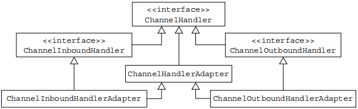

ChannelHandlerAdapter 在事件传播中介绍

ChannelHandler 在 Netty 中的作用只是负责处理 IO 逻辑。它并不会感知到它在 pipeline 中的位置，更不会感知和它相邻的两个 ChannelHandler。这样设计就使得 ChannelHandlerContext 和 ChannelHandler 的职责单一，各司其职，具有高度的可扩展性。

`ChannelHandler` 中的方法

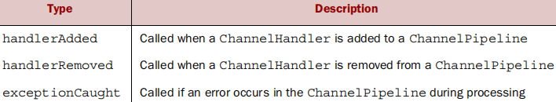

ChannelInboundHandler 的方法：

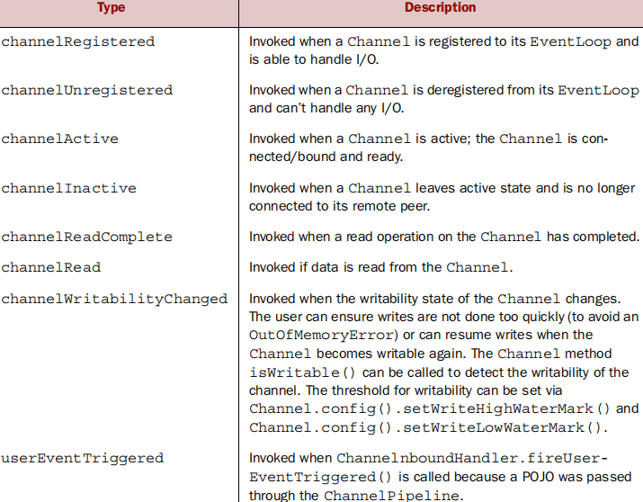

ChannelOutboundHandler 的方法：

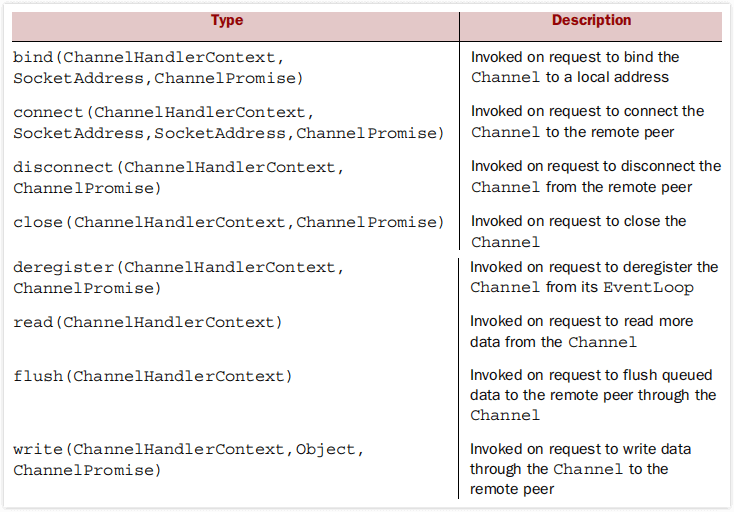

In Netty, the write methods are basically asynchronous.，so most of the methods in `ChannelOutboundHandler` take a `ChannelPromise` argument to be notified when the operation completes.

The write operation will write the messages through the [`ChannelPipeline`](https://netty.io/4.1/api/io/netty/channel/ChannelPipeline.html). Those are then ready to be flushed to the actual [`Channel`](https://netty.io/4.1/api/io/netty/channel/Channel.html) once [`Channel.flush()`](https://netty.io/4.1/api/io/netty/channel/Channel.html#flush--) is called

通过 ChannelInitializer，向 Channel 注册处理器。

~~~java
b.childHandler(new ChannelInitializer<SocketChannel>() {
   protected void initChannel(SocketChannel ch) {
       ch.pipeline().addLast(new NettyDiscardHandler());
   } 
});
~~~

### ChannelPipeline

**Every new `Channel` that’s created is assigned a new `ChannelPipeline`. This association is permanent.**

A `ChannelHandler` can modify the layout of a `ChannelPipeline` in real time by adding, removing, or replacing other `ChannelHandlers`

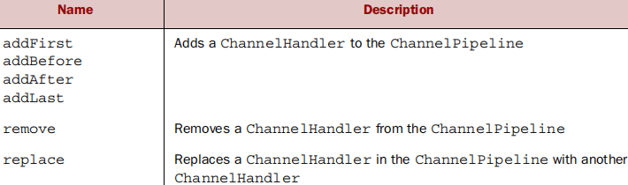

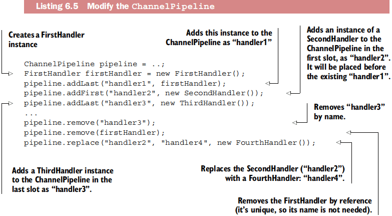

> Normally each `ChannelHandler` in the `ChannelPipeline` processes events that are passed to it by its `EventLoop` (the I/O thread). It’s critically important not to block this thread as it would have a negative effect on the overall handling of I/O.

`@ChannelHandler.Sharable`注解一个 Handler 实例可以被多个通道安全地共享（这个Handler必须是无状态的），即多个通道的流水线可以加入同一个 Handler 实例。这种共享操作，Netty 默认是不允许的，违反则抛出异常。

~~~java
@ChannelHandler.Sharable
public class NettyEchoServerHandler extends ChannelInboundHandlerAdapter {
    // 必须持有一个 ChannelHandlerContext，否则进行流水线上的事件传播
    private ChannelHandlerContext ctx;	
    @Override
    public void handlerAdded(ChannelHandlerContext ctx) {
        this.ctx = ctx;
    }
}
~~~

`isSharable()`可以检查Handler是否可共享。

~~~java
ChannelInboundHandlerAdapter handler = new NettyDiscardHandler();
b.childHandler(new ChannelInitializer<SocketChannel>() {
    protected void initChannel(SocketChannel ch) {
    	if (handler.isSharable()) {}
    		ch.pipeline().addLast(handler);
    	}	
    }
});
~~~

The following table shows the `ChannelPipeline` operations for accessing `ChannelHandlers`. 这些方法在热插拔 Handler 时十分有用。
[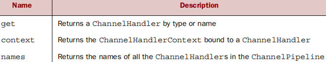](https://mindawei.github.io/images/00014/14.png)

The ChannelPipeline API exposes additional methods for invoking inbound and outbound operations

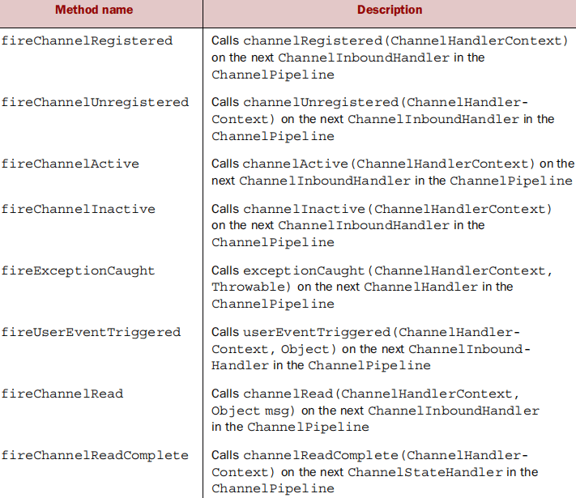

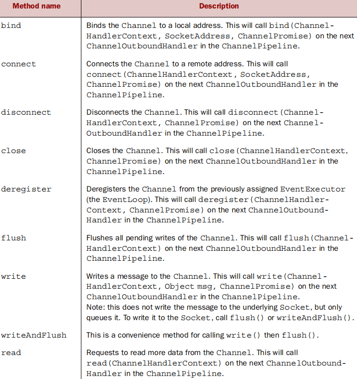

**这里的 next 应当理解为首个 Handler**

### ChannelHandlerContext

A `ChannelHandlerContext` represents an association between a `ChannelHandler` and a `ChannelPipeline` and is created whenever a `ChannelHandler` is added to a `ChannelPipeline`.

The following table summarizes the `ChannelHandlerContext` API.
[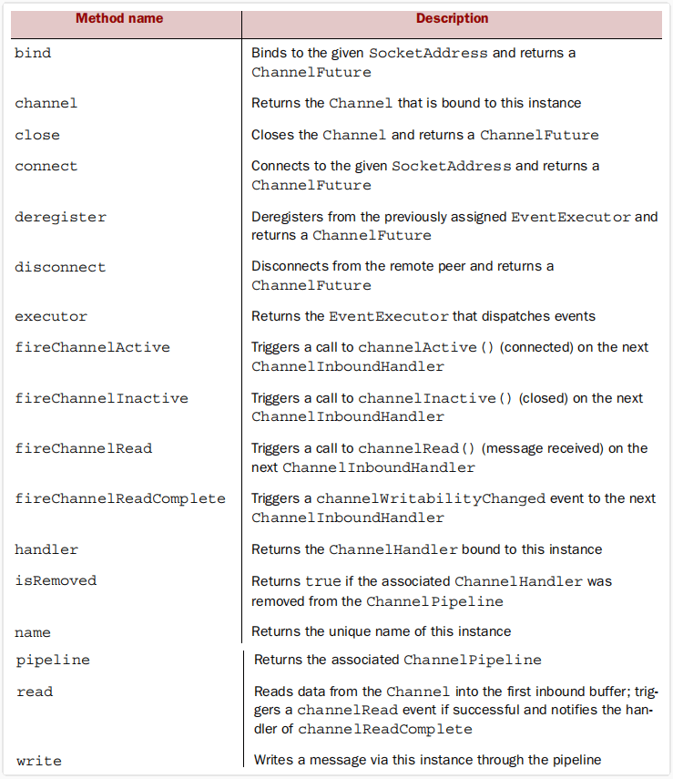](https://mindawei.github.io/images/00014/17.png)

**这里的 next 应当理解为下一个 Handler**

### 事件传播

If you want to propagate an event starting at a specific point in the `ChannelPipeline`, the following listing and figure 6.6 illustrate this use.
[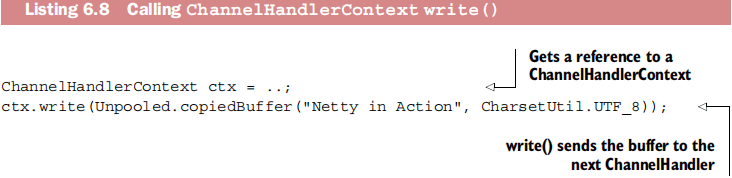](https://mindawei.github.io/images/00014/22.png)

As shown in figure 6.6, the message flows through the `ChannelPipeline` starting at the *next* `ChannelHandler`, bypassing all the preceding ones.
[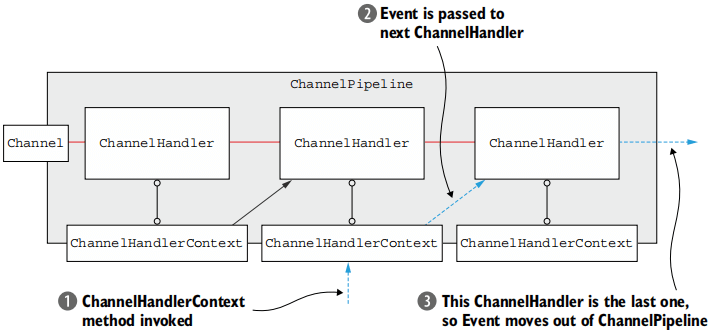](https://mindawei.github.io/images/00014/23.png)

The method bodies provided in `ChannelInboundHandlerAdapter` and `ChannelOutboundHandlerAdapter` call the equivalent methods on the associated `ChannelHandlerContext`, thereby forwarding events to the next `ChannelHandler` in the pipeline。

~~~java
// 以 ChannelInboundHandlerAdapter#channelRead 为例
@Override
public void channelRead(ChannelHandlerContext ctx, Object msg) throws Exception {
    ctx.fireChannelRead(msg);
}
~~~

~~~java
class FirstClientHandler extends ChannelInboundHandlerAdapter {
    @Override
    public void channelRead(ChannelHandlerContext ctx, Object msg) {
        super.channelRead();   // 传播事件
        // 无需 ctx.fireChannelRead(msg);
    }
}
~~~

### 异常

我们在 Handler 的 exceptionCaught 方法中，来自定义处理异常的逻辑。

~~~java
@Override
public void exceptionCaught(ChannelHandlerContext ctx, Throwable cause) throws Exception {
    // 不传播异常
    System.out.println(cause.getMessage());
    
    // 从当前节点继续传播异常
    ctx.fireChannelRead(cause);
}
~~~

从 ChannelInboundHandlerAdapter 的 exceptionCaught 方法可知，如果用户没有重写`exceptionCaught`方法，则默认会传播到下一个Handler。

~~~java
public void exceptionCaught(ChannelHandlerContext ctx, Throwable cause) throws Exception {
    ctx.fireExceptionCaught(cause);
}
~~~

在异常事件播的过程中是不区分`inbound`还是`outbound`的，相关代码如下：

~~~java
public ChannelHandlerContext fireExceptionCaught(final Throwable cause) {
    // 传播异常事件的时候, 直接拿了当前节点的下一个节点
    invokeExceptionCaught(next, cause);
    return this;
}
~~~

 outbound 类异步事件发生异常时，**则不会触发 exceptionCaught 事件传播**。一般只是通知相关 ChannelFuture。但如果 flush 事件在传播过程中发生异常，则会触发当前发生异常的 ChannelHandler 中的 exceptionCaught 事件回调。
