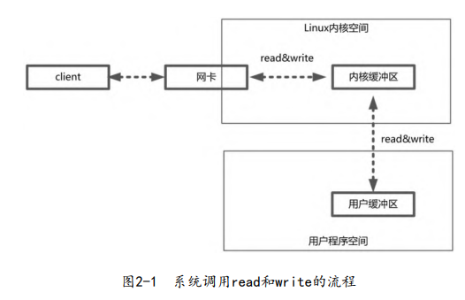
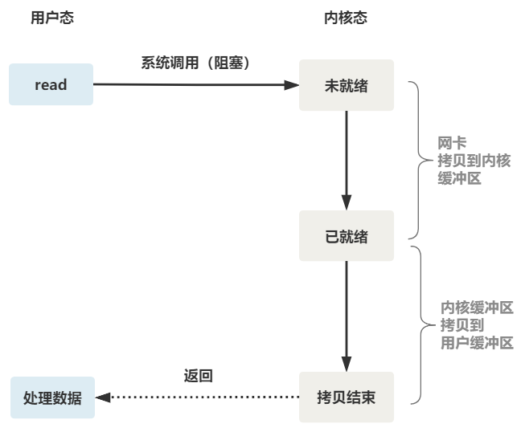
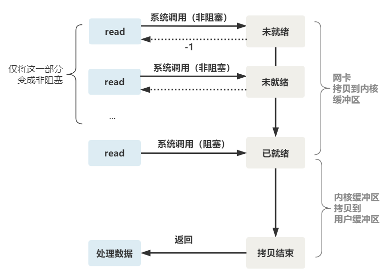
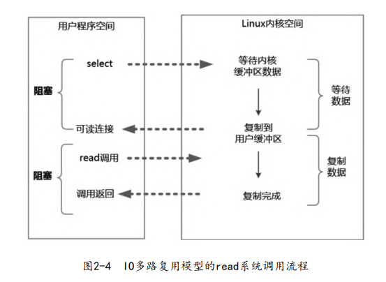
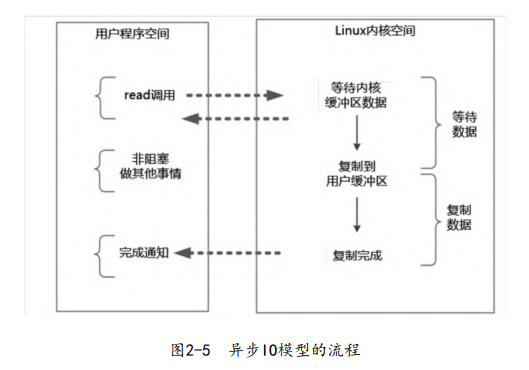
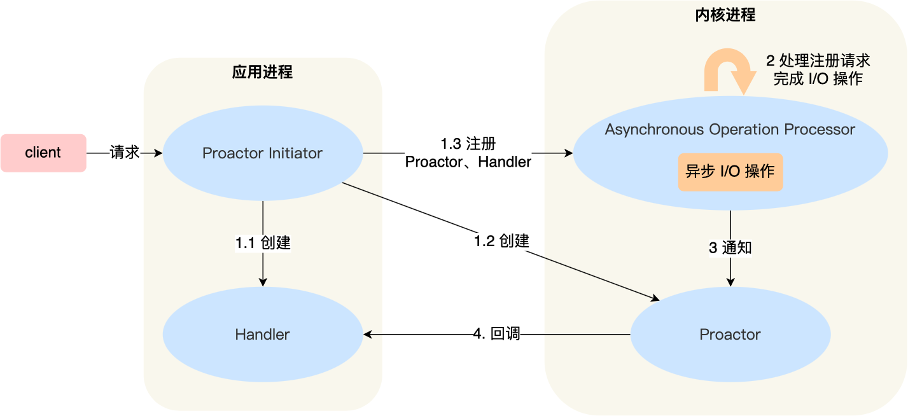
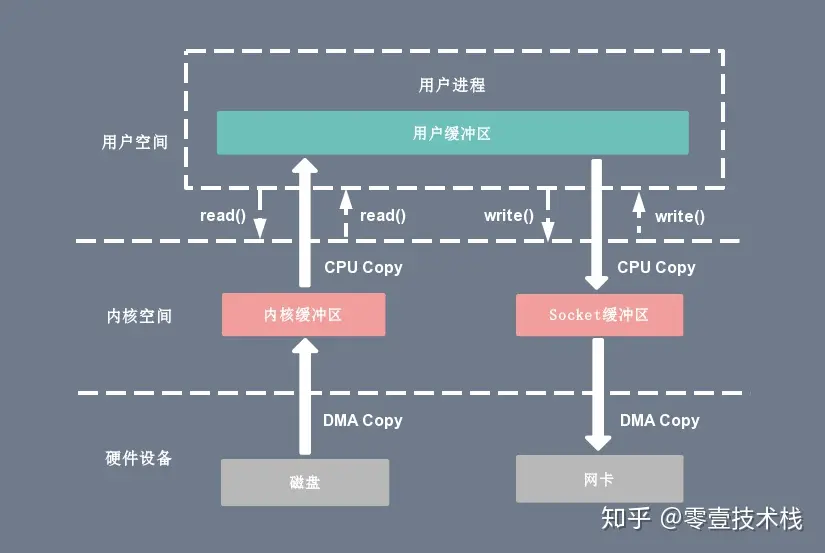
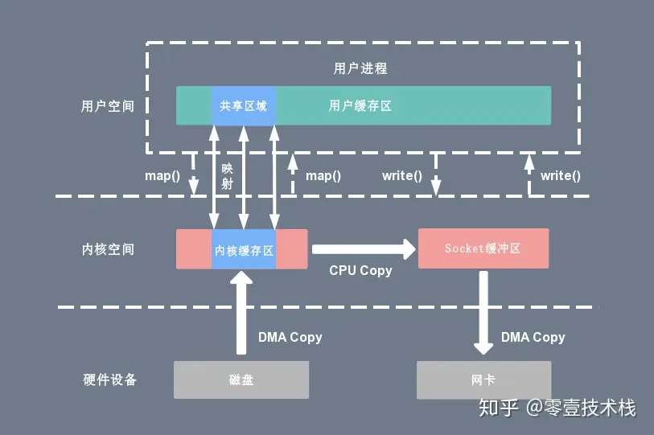
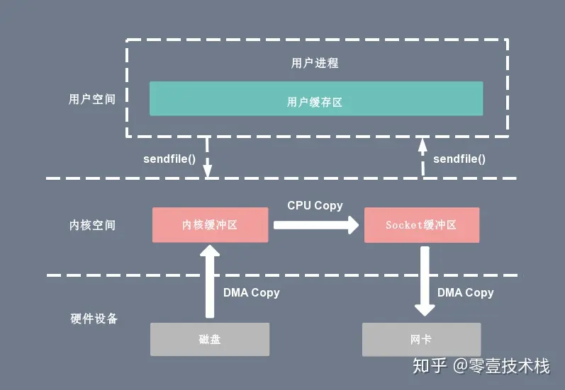

## IO

操作系统将虚拟内存划分为两部分：一部分是内核空间（KernelSpace），另一部分是用户空间（User-Space）。程序通过系统调用 syscall，来访问操作系统所提供的服务。并且操作系统禁止应用程序直接访问操作系统的资源（内存、设备）。

read、write 系统调用并不直接读写物理设备，而是直接访问对应的缓冲区。以`read()`调用为例，它把数据从内核缓冲区复制到应用程序的进程缓冲区。而内核缓冲区与物理设备之间的数据传输由内核来完成。

为了弥补CPU与设备之间的性能鸿沟，以及解决频繁的中断而造成的上下文切换、缓存冲刷的性能问题，操作系统引入了内核缓冲区。操作系统会监控着内核缓冲区，当满足条件时，会集中处理IO 写请求操作。

中断的处理分为上下两个部分：

- **上半部**(top half)：运行中断处理程序，需要运行快，处理重要的事务。
- **下半部**(bottom half)：允许稍后完成的工作会推迟到下半部中。下半部可以被中断

四种IO模型

- 同步阻塞IO

  

- 同步非阻塞（NIO）

  

- IO 多路复用，它可以避免同步非阻塞 IO 模型中轮询等待问题，核心思路是由内核来负责轮询等待的工作。我们以 select 系统调用为例

  ~~~c
  int select(
      int fd_max, 
      fd_set *readfds, 
      fd_set *writefds, 
      fd_set *exceptfds, 
      struct timeval *timeout);
  ~~~

  - `readfds`：文件描述符集合，检查该组文件描述符的可读性。
  - `writefds`：文件描述符集合，检查该组文件描述符的可写性。
  - `exceptfds`：文件描述符集合，检查该组文件描述符的异常条件。
  - `timeout`
    - 值为 NULL，则将 select() 函数置为阻塞状态，当监视的文件描述符集合中的某一个描述符发生变化才会返回结果并向下执行。
    - 值等于 0，则将 select() 函数置为非阻塞状态，执行 select() 后立即返回，无论文件描述符是否发生变化。
    - 值大于 0，则将 select() 函数的超时时间设为这个值，超时后立即返回，无论文件描述符是否发生变化。

  

  ~~~c
  #include <sys/time.h>
  #include <stdio.h>
  #include <fcntl.h>
  
  int main()
  {
      int fd_key, ret;
      char value;
      fd_set readfd;
      fd_key = open("/dev/tty", O_RDONLY);
      
      struct timeval timeout;
      timeout.tv_sec = 1;
      timeout.tv_usec = 0;
  
      while(1){
          FD_ZERO(&readfd);                       /* 清空文件描述符集合 */
          FD_SET(fd_key, &readfd);                /* 添加文件描述符到集合 */
          ret = select(fd_key + 1, &readfd, NULL, NULL, &timeout);
          /* 测试fd_key是否在描述符集合中 */
          if(FD_ISSET(fd_key, &readfd)){          
              read(fd_key, &value, 1);  
  			if('\n' == value){
  				continue;
  			}
  			printf("ret = %d, fd_key = %d, value = %c\n", ret, fd_key, value);
          }
      }
  }
  ~~~

  

  

  可以看出几个细节：

  1. select 在内核层仍然是以遍历的方式来检查文件描述符的就绪状态
  2. select 仅仅返回可读文件描述符的个数，具体哪个可读还是要用户自己遍历
  3. select 调用需要传入 fd 数组，需要拷贝一份到内核，高并发场景下这样的拷贝所消耗的资源是不可接受的。

  也就是说，操作系统提供了 IO 多路复用，使得原来的 while 循环里多次系统调用，变成了一次系统调用 + 内核层遍历这些文件描述符。

  

  

  epoll 系统调用针对上述提及的三个细节做了改进

  - 内核中保存一份文件描述符集合，无需用户每次都重新传入，只需告诉内核修改的部分即可。
  - 内核不再通过轮询的方式找到就绪的文件描述符，而是通过异步 IO 事件唤醒。
  - 内核仅会将有 IO 事件的文件描述符返回给用户，用户也无需遍历整个文件描述符集合。

  

- 异步 IO（Asynchronous IO）

  异步IO模型的基本流程是：用户线程通过系统调用向内核注册某个 IO 操作。内核在整个IO操作（包括数据准备、数据复制）完成后通知用户程序，用户执行后续的业务操作。

  

阻塞和非阻塞描述的是，执行函数时是否立即直接返回。而同步异步是指，当数据就绪时处理数据的逻辑在哪里执行

## Reactor

Reactor 模式由以下两个部分组成

- Reactor 负责响应 IO 事件，并且分发到 Handlers 处理器。
- Handler 非阻塞地执行业务处理逻辑。

Reactor 模式通过应用 IO 多路复用技术，可以使用少量固定的线程（通常与 CPU 核数相等）来处理所有的客户端连接。而 Connection Per Thread 模式为每个请求分配一个线程，开销过大。

Reactor 有几种基本的模式：

- 基本的 Reactor模式（单线程Reactor）

  

  - Reactor 对象通过 select （IO 多路复用接口） 监听事件，收到事件后通过 dispatch 进行分发，具体分发给 Acceptor 对象还是 Handler 对象，还要看收到的事件类型；
  - 如果是连接建立的事件，则交由 Acceptor 对象进行处理，Acceptor 对象会通过 accept 方法获取连接，并创建一个 Handler 对象来处理后续的响应事件；
  - 如果不是连接建立事件， 则交由当前连接对应的 Handler 对象来进行响应；

  在 Redis 6.0 版本之前采用的正是「单 Reactor 单进程」的方案。缺点如下：

  - 因为只有一个进程，**无法充分利用 多核 CPU 的性能**；
  - Handler 对象在业务处理时，整个进程是无法处理其他连接的事件的，**如果业务处理耗时比较长，那么就造成响应的延迟**；

  单 Reactor 多线程 / 多进程

  

  - Handler 对象不再负责业务处理，只负责数据的接收和发送，Handler 对象通过 read 读取到数据后，会将数据发给子线程里的 Processor 对象进行业务处理；
  - 子线程里的 Processor 对象就进行业务处理，处理完后，将结果发给主线程中的 Handler 对象，接着由 Handler 通过 send 方法将响应结果发送给 client；

  「单 Reactor」的模式还有个问题，**因为一个 Reactor 对象承担所有事件的监听和响应，而且只在主线程中运行，在面对瞬间高并发的场景时，容易成为性能的瓶颈的地方**。

-  多 Reactor 多进程 / 线程

  

  - 主线程中的 MainReactor 对象通过 select 监控连接建立事件，收到事件后通过 Acceptor 对象中的 accept 获取连接，将新的连接分配给某个子线程；
  - 子线程中的 SubReactor 对象将 MainReactor 对象分配的连接加入 select 继续进行监听，并创建一个 Handler 用于处理连接的响应事件。
  - 如果有新的事件发生时，SubReactor 对象会调用当前连接对应的 Handler 对象来进行响应。
  - Handler 对象通过 read -> 业务处理 -> send 的流程来完成完整的业务流程。

  主线程和子线程分工明确，主线程只负责接收新连接，子线程负责完成后续的业务处理。主线程和子线程的交互很简单，主线程只需要把新连接传给子线程，子线程无须返回数据，直接就可以在子线程将处理结果发送给客户端。

  大名鼎鼎的两个开源软件 Netty 和 Memcache 都采用了「多 Reactor 多线程」的方案。

## Proactor

**Reactor 是非阻塞同步网络模式**，而 **Proactor 是异步网络模式**

介绍一下 Proactor 模式的工作流程：

- Proactor Initiator 负责创建 Proactor 和 Handler 对象，并将 Proactor 和 Handler 都通过 Asynchronous Operation Processor 注册到内核；
- Asynchronous Operation Processor 负责处理注册请求，并处理 I/O 操作；
- Asynchronous Operation Processor 完成 I/O 操作后通知 Proactor；
- Proactor 根据不同的事件类型回调不同的 Handler 进行业务处理；
- Handler 完成业务处理；

## 零拷贝

在 Linux 中零拷贝技术主要有 3 个实现思路：

- 用户态直接 I/O

  |                             传统                             |                            零拷贝                            |
  | :----------------------------------------------------------: | :----------------------------------------------------------: |
  |  |  |

- 减少数据拷贝次数

  - 使用 mmap + write 代替原来的 read + write 方式

    ~~~c
    tmp_buf = mmap(file_fd, len);
    write(socket_fd, tmp_buf, len);
    ~~~

    

  - sendfile

    ~~~c
    sendfile(socket_fd, file_fd, len);
    ~~~

    

- 写时复制技术

  

