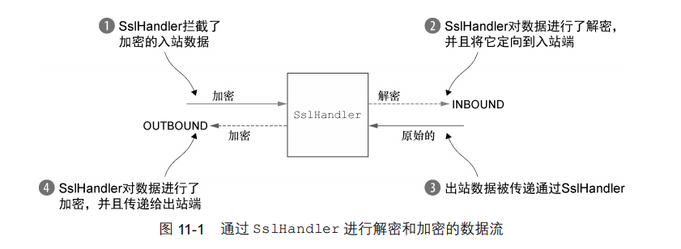
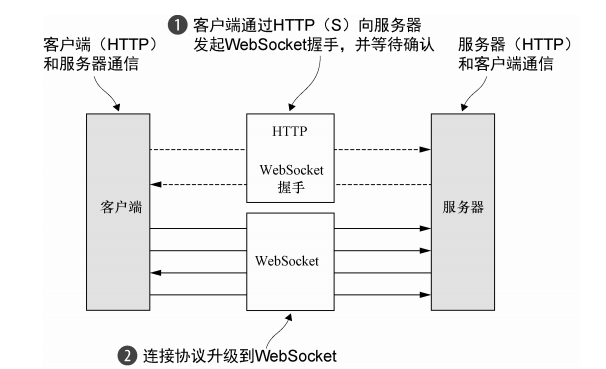

# 编解码器

每个网络应用程序都必须定义如何解析在两个节点之间来回传输的原始字节，以及如何将其和应用程序中的数据格式做相互转换。这正是编解码器解决的问题。

解码器继承了 ChannelInboundHandler，而编码器继承了 ChannelOutboundHandler。它们都会进行事件传播。

## 解码器

Netty 提供了一个解码器的抽象基类 `ByteToMessageDecoder`，来将字节序列解码为一条消息。它有两个方法：

- `decode(ChannelHandlerContext ctx,ByteBuf in,List<Object> out)`：一个抽象方法，您必须将解码的结果放在 out 列表中，从 in 读取字节序列。
- `decodeLast(ChannelHandlerContext ctx,ByteBuf in,List<Object> out)`：Netty 提供的默认实现是简单地调用 decode() 方法。当Channel的状态变为非活动时，这个方法将会被调用一次。

下面我们以解码 int 类型来说明怎么使用 ByteToMessageDecoder ：

~~~java
public class ToIntegerDecoder extends ByteToMessageDecoder {
    @Override
    public void decode(
        ChannelHanlderContext ctx, 
        ByteBuf in, 
        List<Object> out) throws Exception {
        if (in.readableBytes() >= 4) {
            out.add(in.readInt());
        }
    }
}
~~~

这里我们还需要调用 `readableBytes` 方法来判断是否有足够多的字节来解码消息，这有点繁琐。我们可以使用 `ReplayingDecoder` 类，它扩展了 `ByteToMessageDecoder` 类，并且将 `ByteBuf` 封装成 `ReplayingDecoderByteBuf`。

~~~java
public class ToIntegerDecoder2 extends ReplayingDecoder<Void> {
    @Override
    public void decode(ChannelHandlerContext ctx, ByteBuf in, List<Object> out) throws Exception {
        out.add(in.readInt());
    }
}
~~~

如果没有足够的字节可用，这个 readInt() 方法的实现将会抛出一个Error。其将在基类中被捕获并处理。当有更多的数据可供读取时，该 decode() 方法将会被再次调用

请注意 `ReplayingDecoderByteBuf` 并不支持所有的 ByteBuf 操作。如果调用了一个不被支持的方法，将会抛出一个 `UnsupportedOperationException`

此外，Netty 还提供了 `MessageToMessageDecoder`，用于在两个消息格式之间进行转换。下面给出一个使用实例

~~~java
public class IntegerToStringDecoder extends MessageToMessageDecoder<Integer> {
    // 类型参数 I 指定了 decode() 方法中参数 msg 的类型
    @Override
    public void decode(ChannelHandlerContext ctx, Integer msg
List<Object> out) throws Exception {
        out.add(String.valueOf(msg));
    }
}
~~~

为了避免解码器缓冲大量的数据，以至于耗尽可用的内存。Netty 提供了TooLongFrameException 类。当帧大小超出指定限制后，程序员需手动抛出 TooLongFrameException。随后会在 `ChannelHandler.exceptionCaught()` 方法中捕获，程序员可以覆写该方法，来实现帧大小溢出的逻辑

~~~java
public class SafeByteToMessageDecoder extends ByteToMessageDecoder {
    private static final int MAX_FRAME_SIZE = 1024;
    @Override
    public void decode(ChannelHandlerContext ctx, ByteBuf in, List<Object> out) throws Exception {
        int readable = in.readableBytes();
        if (readable > MAX_FRAME_SIZE) {
            in.skipBytes(readable);
            throw new TooLongFrameException("Frame too big!");
        }
    }
}
~~~

## 编码器

Netty 提供了一个编码器的抽象基类 `MessageToByteEncoder`，来将一条消息转换为字节。它只有一个可覆写的方法：

- `encode(ChannelHandlerContext ctx,I msg,ByteBuf out)`

下面给出一个示例：

~~~java
public class ShortToByteEncoder extends MessageToByteEncoder<Short> {
    @Override
    public void encode(ChannelHandlerContext ctx, Short msg, ByteBuf out) throws Exception {
        out.writeShort(msg);
    }
}
~~~

同时也提供了 MessageToMessageEncoder，将从一种消息格式解码为另一种。使用示例：

~~~java
public class IntegerToStringEncoder extends MessageToMessageEncoder<Integer> {
    @Override
    public void encode(ChannelHandlerContext ctx, Integer msg, List<Object> out) throws Exception {
        out.add(String.valueOf(msg));
    }
}
~~~

## 编解码器类

我们需要将字节解码为某种形式的消息，可能是 POJO，随后再次对它进行编码。ByteToMessageCodec 将为我们处理好这一切，它同时实现了 ChannelInboundHandler 和 ChannelOutboundHandler 接口，方法如下：

- `decode(ChannelHandlerContext ctx,ByteBuf in,List<Object>)`
- `decodeLast(ChannelHandlerContext ctx,ByteBuf in,List<Object> out)`
- `encode(ChannelHandlerContext ctx,I msg,ByteBuf out)`

同样地，还有 `MessageToMessageCodec<INBOUND_IN,OUTBOUND_IN>`：

- `protected abstract decode(ChannelHandlerContext ctx,INBOUND_IN msg,List<Object> out)`
- `protected abstract encode(ChannelHandlerContext ctx,OUTBOUND_IN msg,List<Object> out)`

编解码器类对可重用性造成了不好的影响。我们可以使用 `CombinedChannelDuplexHandler<I extends ChannelInboundHandler, O extends ChannelOutboundHandler>` 类来避免这种影响。

下面给出一个使用示例：

~~~java
public class CombinedByteCharCodec extends  CombinedChannelDuplexHandler<ByteToCharDecoder, CharToByteEncoder> {
    public CombinedByteCharCodec() {
        super(new ByteToCharDecoder(), new CharToByteEncoder());
    }
}
~~~

这样就将编码器与解码器以松耦合的方式绑定在了一起，提高了可重用性。

## SSL/TLS

Netty 还提供了使用 OpenSSL 工具包（www.openssl.org）的 SSLEngine 实现。这个 OpenSslEngine 类提供了比 JDK 提供的 SSLEngine 实现更好的性能。

添加对 SSL 的支持：

~~~java
public class SslChannelInitializer extends ChannelInitializer<Channel>{
    private final SslContext context;
    private final boolean startTls;
    
    public SslChannelInitializer(SslContext context,boolean startTls) {
        this.context = context;
		this.startTls = startTls;
    }
    
    @Override
    protected void initChannel(Channel ch) throws Exception {
        SSLEngine engine = context.newEngine(ch.alloc());
        ch.pipeline().addFirst("ssl", new SslHandler(engine, startTls));
    }
}
~~~

## HTTP

1. HTTP Request 第一部分是包含的头信息
2. HttpContent 里面包含的是数据，可以后续有多个 HttpContent 部分
3. LastHttpContent 标记是 HTTP request 的结束，同时可能包含头的尾部信息
4. 完整的 HTTP request

1. HTTP response 第一部分是包含的头信息
2. HttpContent 里面包含的是数据，可以后续有多个 HttpContent 部分
3. LastHttpContent 标记是 HTTP response 的结束，同时可能包含头的尾部信息
4. 完整的 HTTP response

所有类型的 HTTP 消息（FullHttpRequest、LastHttpContent等等）都实现了 HttpObject 接口。

| 名称                | 描述                                                         |
| ------------------- | ------------------------------------------------------------ |
| HttpRequestEncoder  | Encodes HttpRequest , HttpContent and LastHttpContent messages to bytes. |
| HttpResponseEncoder | Encodes HttpResponse, HttpContent and LastHttpContent messages to bytes. |
| HttpRequestDecoder  | Decodes bytes into HttpRequest, HttpContent and LastHttpContent messages. |
| HttpResponseDecoder | Decodes bytes into HttpResponse, HttpContent and LastHttpContent messages. |

添加 HTTP 协议

~~~java
public class HttpPipelineInitializer extends ChannelInitializer<Channel> {
    private final boolean client;
    public HttpPipelineInitializer(boolean client) {
		this.client = client;
	}
    @Override
    protected void initChannel(Channel ch) throws Exception {
        ChannelPipeline pipeline = ch.pipeline();
        if (client) {
        	pipeline.addLast("decoder", new HttpResponseDecoder());
        	pipeline.addLast("encoder", new HttpRequestEncoder());
        } else {
        	pipeline.addLast("decoder", new HttpRequestDecoder());
        	pipeline.addLast("encoder", new HttpResponseEncoder());
        }
    }
}
~~~

`HttpRequestDecoder` 负责将 `ByteBuf` 解码成为 `HttpRequest` 和 `HttpContent` 内容，`HttpRequestDecoder` 也是同理。你需要聚合他们形成完整的消息，为了消除这种繁琐任务， Netty 提供了一个聚合器 `HttpObjectAggregator`

~~~java
pipeline.addLast("aggegator", new HttpObjectAggregator(512 * 1024));
// 指定 HTTP 报文的最大大小为 512KB，超出此限制返回 413 状态码
~~~

使用 HTTP 时建议压缩数据以减少传输流量，压缩数据会增加 CPU 负载：

~~~java
if (isClient) {
    pipeline.addLast("codec", new HttpClientCodec()); //1
    pipeline.addLast("decompressor",new HttpContentDecompressor()); //2
} else {
    pipeline.addLast("codec", new HttpServerCodec()); //3
    pipeline.addLast("compressor",new HttpContentCompressor()); //4
}
~~~

启用 HTTPS 只需要将 SslHandler 添加到 ChannelPipeline 的 ChannelHandler 组合中：

~~~java
ChannelPipeline pipeline = ch.pipeline();
SSLEngine engine = context.newEngine(ch.alloc());
pipeline.addFirst("ssl", new SslHandler(engine));
if (isClient) {
	pipeline.addLast("codec", new HttpClientCodec());
} else {
	pipeline.addLast("codec", new HttpServerCodec());
}
~~~

## 空闲连接以及超时

| 名称                | 描述                                                         |
| ------------------- | ------------------------------------------------------------ |
| IdleStateHandler    | 如果连接闲置时间过长，则会触发 IdleStateEvent 事件。在 ChannelInboundHandler 中可以覆盖 userEventTriggered(...) 方法来处理 IdleStateEvent。 |
| ReadTimeoutHandler  | 在指定的时间间隔内没有接收到入站数据则会抛出 ReadTimeoutException 并关闭 Channel。ReadTimeoutException 可以通过覆盖 ChannelHandler 的 exceptionCaught(…) 方法检测到。 |
| WriteTimeoutHandler | WriteTimeoutException 可以通过覆盖 ChannelHandler 的 exceptionCaught(…) 方法检测到。 |

~~~java
public IdleStateHandler(
        int readerIdleTimeSeconds,
        int writerIdleTimeSeconds,
        int allIdleTimeSeconds) {

    this(readerIdleTimeSeconds, writerIdleTimeSeconds, allIdleTimeSeconds,
         TimeUnit.SECONDS);
}

~~~

- readerIdleTimeSeconds：读超时。即当在指定的时间间隔内没有从 Channel 读取到数据时，会触发一个 READER_IDLE 的 IdleStateEvent 事件
- writerIdleTimeSeconds: 写超时。即当在指定的时间间隔内没有数据写入到 Channel 时，会触发一个 WRITER_IDLE 的 IdleStateEvent 事件
- allIdleTimeSeconds: 读/写超时。即当在指定的时间间隔内没有读或写操作时，会触发一个 ALL_IDLE 的 IdleStateEvent 事件

下面来看一个例子：测试远端是否还活着，如果不是就关闭连接释放资源。

~~~java
public class IdleStateHandlerInitializer extends ChannelInitializer<Channel> {

    @Override
    protected void initChannel(Channel ch) throws Exception {
        ChannelPipeline pipeline = ch.pipeline();
        pipeline.addLast(new IdleStateHandler(0, 0, 60, TimeUnit.SECONDS));  //1
        pipeline.addLast(new HeartbeatHandler());
    }

    public static final class HeartbeatHandler extends ChannelInboundHandlerAdapter {
        private static final ByteBuf HEARTBEAT_SEQUENCE = Unpooled.unreleasableBuffer(
                Unpooled.copiedBuffer("HEARTBEAT", CharsetUtil.ISO_8859_1)); 

        @Override
        public void userEventTriggered(ChannelHandlerContext ctx, Object evt) throws Exception {
            // 超时了，给对端发送心跳检测信息
            if (evt instanceof IdleStateEvent) {
                 ctx.writeAndFlush(HEARTBEAT_SEQUENCE.duplicate())
                         .addListener(ChannelFutureListener.CLOSE_ON_FAILURE);  // 给对端发送心跳检测信息。如果发送失败，那么关闭连接
            } else {
                super.userEventTriggered(ctx, evt);  //4
            }
        }
    }
}
~~~

## 消息边界

| 名称                       | 描述                      |
| -------------------------- | ------------------------- |
| DelimiterBasedFrameDecoder | 指定分隔符                |
| LineBasedFrameDecoder      | 以 \n"和"\r\n" 作为分割符 |

| 名称                         | 描述                       |
| ---------------------------- | -------------------------- |
| FixedLengthFrameDecoder      | 提取固定长度               |
| LengthFieldBasedFrameDecoder | 读取头部长度并提取帧的长度 |

~~~java
public LengthFieldBasedFrameDecoder(
            int maxFrameLength,
            int lengthFieldOffset, int lengthFieldLength,
            int lengthAdjustment, int initialBytesToStrip)
~~~

- maxFrameLength：最大帧长度。
- lengthFieldOffset：长度域偏移
- lengthFieldLength：长度域字节数。表示从 Length 字段往后需要读取的字节数
- lengthAdjustment：数据长度修正。
- initialBytesToStrip：跳过的字节数。如果你需要接收 header+body 的所有数据，此值就是 0，如果你只想接收 body 数据，那么需要跳过 header 所占用的字节数。

我们来通过一个例子来认识：

~~~shell
 *  BEFORE DECODE (16 bytes)                      
 * +------+--------+------+----------------+      
 * | HDR1 | Length | HDR2 | Actual Content |		
 * | 0xCA | 0x000C | 0xFE | "HELLO, WORLD" |      
 * +------+--------+------+----------------+      
 
  AFTER DECODE (13 bytes)
  +------+----------------+
  | HDR2 | Actual Content |
  | 0xFE | "HELLO, WORLD" |
  +------+----------------+
~~~

- lengthFieldOffset=1
- lengthFieldLength=2
- lengthAdjustment=1：我们要读取 hdr2+body，而 Length 表示 body 的长度，所以数据长度需要加 1。
- initialBytesToStrip=3：接收的数据不包括 hdr1 和 Length

## 大数据处理

在需要将数据从文件系统复制到用户内存中时，可以使用 ChunkedWriteHandler，它支持异步写大型数据流，而又不会导致大量的内存消耗。这个关键是 ChunkedInput 接口，它的实现如下：

| 名称             | 描述                                                         |
| ---------------- | ------------------------------------------------------------ |
| ChunkedFile      | 当你使用平台不支持 zero-copy 或者你需要转换数据，从文件中一块一块的获取数据 |
| ChunkedNioFile   | 与 ChunkedFile 类似，处理使用了NIOFileChannel                |
| ChunkedStream    | 从 InputStream 中一块一块的转移内容                          |
| ChunkedNioStream | 从 ReadableByteChannel 中一块一块的转移内容                  |

~~~java
public class ChunkedWriteHandlerInitializer extends ChannelInitializer<Channel> {
    private final File file;

    public ChunkedWriteHandlerInitializer(File file) {
        this.file = file;
    }

    @Override
    protected void initChannel(Channel ch) throws Exception {
        ChannelPipeline pipeline = ch.pipeline();
        pipeline.addLast(new ChunkedWriteHandler());// 添加 ChunkedWriteHandler 用来处理作为 ChunkedInput 传进的数据
        pipeline.addLast(new WriteStreamHandler());//3
    }

    public final class WriteStreamHandler extends ChannelInboundHandlerAdapter {  //4

        @Override
        public void channelActive(ChannelHandlerContext ctx) throws Exception {
            super.channelActive(ctx);
            ctx.writeAndFlush(new ChunkedStream(new FileInputStream(file)));
        }
    }
}
~~~

## WebSocket

WebSocket 定义了六种不同的 frame; Netty 给他们每个都提供了一个 POJO 实现 ：

| 名称                       | 描述                                                         |
| -------------------------- | ------------------------------------------------------------ |
| BinaryWebSocketFrame       | contains binary data                                         |
| TextWebSocketFrame         | contains text data                                           |
| ContinuationWebSocketFrame | contains text or binary data that belongs to a previous BinaryWebSocketFrame or TextWebSocketFrame |
| CloseWebSocketFrame        | represents a CLOSE request and contains close status code and a phrase |
| PingWebSocketFrame         | requests the transmission of a PongWebSocketFrame            |
| PongWebSocketFrame         | sent as a response to a PingWebSocketFrame                   |

握手升级成功后 `WebSocketServerProtocolHandler` 替换 `HttpRequestDecoder` 为 `WebSocketFrameDecoder`，替换 `HttpResponseEncoder` 为`WebSocketFrameEncoder`。 为了最大化性能，`WebSocket` 把移除不需要的 `ChannelHandler` ，其中就包括了 `HttpObjectAggregator`。

~~~java
public class WebSocketServerInitializer extends ChannelInitializer<Channel> {
    @Override
    protected void initChannel(Channel ch) throws Exception {
        ch.pipeline().addLast(
                new HttpServerCodec(),
                new HttpObjectAggregator(65536),  //1
                new WebSocketServerProtocolHandler("/websocket"),  //2
                new TextFrameHandler(),  //3
                new BinaryFrameHandler(),  //4
                new ContinuationFrameHandler());  //5
    }

    public static final class TextFrameHandler extends SimpleChannelInboundHandler<TextWebSocketFrame> {
        @Override
        public void channelRead0(ChannelHandlerContext ctx, TextWebSocketFrame msg) throws Exception {
            // Handle text frame
        }
    }

    public static final class BinaryFrameHandler extends SimpleChannelInboundHandler<BinaryWebSocketFrame> {
        @Override
        public void channelRead0(ChannelHandlerContext ctx, BinaryWebSocketFrame msg) throws Exception {
            // Handle binary frame
        }
    }

    public static final class ContinuationFrameHandler extends SimpleChannelInboundHandler<ContinuationWebSocketFrame> {
        @Override
        public void channelRead0(ChannelHandlerContext ctx, ContinuationWebSocketFrame msg) throws Exception {
            // Handle continuation frame
        }
    }
}
~~~

1. 添加 HttpObjectAggregator，用于提供在握手时聚合 HttpRequest
2. 添加 WebSocketServerProtocolHandler，当升级完成后，它将会处理  Ping, Pong 和 Close 帧。
3. TextFrameHandler 将会处理 TextWebSocketFrames
4. BinaryFrameHandler 将会处理 BinaryWebSocketFrames
5. ContinuationFrameHandler 将会处理 ContinuationWebSocketFrames

