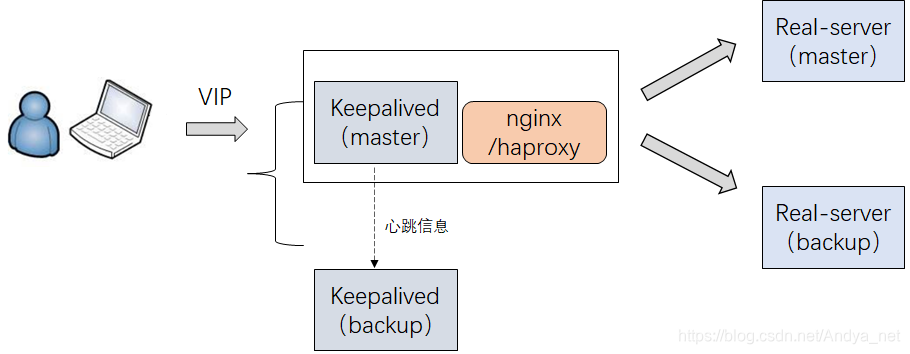

# 入门

[toc]

## 安装

源码的下载地址：[nginx: download](https://link.zhihu.com/?target=https%3A//nginx.org/en/download.html)

~~~bash
tar -zxvf nginx-1.25.4.tar.gz 
mv nginx-1.25.4 nginx

# 安装与编译相关的模块
sudo apt install gcc
sudo apt install make
sudo apt install libpcre3 libpcre3-dev
sudo apt install zlib1g zlib1g-dev

sudo mkdir /usr/local/nginx
./configure --prefix=/usr/local/nginx

make
sudo make install
~~~

~~~bash
# /usr/local/nginx/sbin

./nginx 			# 启动
./nginx -s stop 	 # 快速停止
./nginx -s quit 	 # 优雅关闭，在退出前完成已经接受的连接请求
./nginx -s reload    # 重新加载配置
~~~

安装系统服务：

1. 创建服务脚本

   ~~~bash
   vi /usr/lib/systemd/system/nginx.service
   ~~~

2. 服务脚本内容

   ~~~bash
   [Unit]
   Description=nginx - web server
   After=network.target remote-fs.target nss-lookup.target
   [Service]
   Type=forking
   PIDFile=/usr/local/nginx/logs/nginx.pid
   ExecStartPre=/usr/local/nginx/sbin/nginx -t -c /usr/local/nginx/conf/nginx.conf
   ExecStart=/usr/local/nginx/sbin/nginx -c /usr/local/nginx/conf/nginx.conf
   ExecReload=/usr/local/nginx/sbin/nginx -s reload
   ExecStop=/usr/local/nginx/sbin/nginx -s stop
   ExecQuit=/usr/local/nginx/sbin/nginx -s quit
   PrivateTmp=true
   [Install]
   WantedBy=multi-user.target
   ~~~

3. 重新加载系统服务

   ~~~shell
   sudo systemctl daemon-reload
   ~~~

4. 启动服务

   ~~~bash
   sudo systemctl start nginx.service
   ~~~

   ~~~bash
   sudo systemctl status nginx	# 查看服务的状态
   sudo systemctl reload nginx	# 重启服务，用于更新配置
   ~~~

5. 开机启动

   ~~~bash
   sudo systemctl enable nginx.service
   ~~~

`/usr/local/nginx/`中的目录结构

- conf：用来存放配置文件
- htm：存放静态文件
- sbin：nginx的主程序
- logs：日志文件

## Nginx配置

在 Nginx 在启动后，主进程 Master 会为请求 fork 出一个子进程 Worker，用于读取配置文件来响应请求。而 Master 进程负责协调/管理 Worker 进程。

`${nginx}/conf/nginx.conf` 配置文件的内容：

~~~nginx
worker_processes  1;
events {
    worker_connections  1024;
}

http {
    include       mime.types;
    default_type  application/octet-stream;
    sendfile        on;
    keepalive_timeout  65;
    server {
        listen       80;			# 监听的端口号
        server_name  localhost;		 # 监听的域名（站点名）
        
        location / {				
            root   html;			# 实际资源的根目录
            index  index.html index.htm; 
        }
        
        error_page   500 502 503 504  /50x.html; 	 # 报错编码对应页面
        location = /50x.html {
            root html;
        }
    }
}

~~~

1. worker_processes：开启多少个 Worker 进程，默认为1。最好与 CPU 核数相等。
2. worker_connections：单个 Worker 进程可接受的连接数
3. include mime.types：引入 mime.types 配置文件 
4. default_type application/octet-stream：如果 mime 类型没匹配上，则使用二进制流的方式传输。
5. sendfile on：使用 linux 的 `sendfile(socket, file, len)` 系统调用来做到零拷贝

多个域名（站点）可以绑定到一个IP上，而 Nginx 可以将多个站点解析到不同的资源目录下。推荐在 Aliyun 上购买域名。在测试环境中，甚至可以将域名绑定到局域网中的私有IP地址上。域名的设置

| 主机记录 | 记录类型 |  记录值   |                           含义                            |
| :------: | :------: | :-------: | :-------------------------------------------------------: |
|    @     |    A     | 127.0.0.1 |                `wiki.com `解析到127.0.0.1                 |
|   www    |    A     | 127.0.0.1 |              `www.wiki.com` 解析到127.0.0.1               |
|    *     |    A     | 127.0.0.1 | `wwww.wiki.com`   `api.wiki.com` ... 都会解析到 127.0.0.1 |

当一个请求到来时，Nginx 会按顺序考察 server 中的 server_name 是否与请求域名匹配。如果都不匹配，那么将该请求转发到一个 server 中。

server_name 的匹配规则：

1. 完整匹配

   ~~~bash
   server_name vod.mmban.com www1.mmban.com;
   ~~~

2. 通配符匹配

   ~~~bash
   server_name vod.*;
   ~~~

3. 正则匹配

   ~~~bash
   server_name ~^[0-9]+\.mmban\.com$;
   ~~~

location 匹配规则

~~~bash
location [=|~|~*|^~] /uri/ { … }
~~~

- `/` 通用匹配，任何请求都会匹配到
- `= /uri`，精确匹配
- `^~ /uri`，前缀匹配
- `~ pattern` 区分大小写正则匹配
- `~* pattern`，不区分大小写正则匹配
- `/uri` 前缀匹配

匹配的顺序： 

1. 精确匹配 `=`
2. 前缀匹配 `^~`，并且最大前缀匹配
3. 按文件中出现的顺序，逐个正则匹配。
4. 不带任何修饰的前缀匹配，并且最大前缀匹配
5.  通用匹配

root 与 alias 主要区别在于 nginx 如何解释 location 后面的 uri ，这会使两者分别以不同的方式将请求映射到服务器文件上。我们直接来看一个例子：

~~~nginx
location ^~ /123/abc/ {
	root /data/www;
}
~~~

当请求 `http://blog.whsir.com/123/abc/logo.png` 时，将会返回服务器上的 `/data/www/123/abc/logo.png` 文件

~~~nginx
location ^~ /123/abc/ {
	alias /data/www;
}
~~~

当请求 `http://blog.whsir.com/123/abc/logo.png `时，将会返回服务器上的`/data/www/logo.png`文件

通过 `rewrtie` 命令，我们可以重写 URL。

~~~nginx
location / {
    rewrite ^/([0-9]+).html$ /index.jsp?pageNum=$1 break;
    proxy_pass http://192.168.44.104:8080;
}
~~~

~~~bash
rewrite <regex> <replacement> [flag];
关键字    正则     替代内容    flag标记
~~~

- flag

  - last 
  - break 
  - redirect 返回 302 临时重定向
  - permanent 返回 301 永久重定向

  rewrite 命令执行完成后，会根据新的 URL 重新启动请求处理。last、break 是内部重定向，而 redirect、permanent 是外部重定向。在内部重定向中，last 不再执行 rewrite 命令，而 break 会执行 rewrite 命令。

  对于 redirect、permanent 来说，它们会向用户返回真实的 URI 地址，也就是替换后的。而301、302 仅对爬虫来说有意义。

- replacement，使用 `$num` 来获取到第 num 个匹配的正则表达式的内容。此外，可以通过`$args`或`$query_string`变量获取到查询参数

## 反向代理

**正向代理**是为了服务内部局域网用户。比如，公司内部的员工可能需要访问一些外部的互联网资源。**反向代理**是为了服务互联网上的用户。总的来说，正向代理隐藏的是真实的客户端，而反向代理隐藏的是真实的服务端。

~~~nginx
server_name  localhost;	
location / {
    # 当 localhost:80/XXXX 请求打到 Nginx 服务器时， Nginx 会代理请求 http://atguigu.com/XXXX，并将数据返回给客户端。
    # 如果响应报文的状态码不是302，此时客户端的域名仍是 localhost，而不是 http://atguigu.com/。
	proxy_pass http://atguigu.com/;
    # root / index 与 proxy_pass 只能二选一
}
~~~

## 负载均衡

~~~nginx
http {
    server {
        location / {
            # 反向代理到一个名为 httpds 的 upstream 群组
            # 而不是直接代理到 http://httpds 域名
            proxy_pass http://httpds;
        }
    }
    
    upstream httpds {
        # 轮询
        server 192.168.44.102:80
        server 192.168.44.103:80
    }
}
~~~

为负载均衡指定一个权重：

~~~nginx
upstream httpd {
	server 127.0.0.1:8050 weight=10 down;
	server 127.0.0.1:8060 weight=1;
	server 127.0.0.1:8060 weight=1 backup;
}
~~~

- weight，它与访问次数成正比
- down：表示当前的 server 暂时不参与负载
- backup：当所有其他非 backup 服务器处于 down 或者 busy 时，会请求该服务器

显然，带权重轮询是无法保持住会话（session）。推荐基于 Token 来保持会话

此外还有几个负载均衡策略：

1. ip_hash 
2. least_conn
3. url_hash
4. fair

## 防盗链

`Http Request` 中通过 Refer 请求头告知服务器该请求是从哪个页面发起的。在 Nginx 中，防盗链的设计如下：

~~~bash
location / {
	valid_referers none blocked www.baidu.com juejin.cn;
	if ($invalid_referer) {
		return 403;
	}
	proxy_pass http://httpds;
}
~~~

- **none**：允许没有 Referer 请求头 
- **server_names** ，设置一个或多个 URL ，检测 Referer 是否匹配这些 URL 中的某一个。

通过 **$invalid_referer** 变量获取检测结果

返回一个盗链的错误页面：

~~~nginx
location / {
	if ($invalid_referer) {
		return 401;
	}
}

error_page 401 /401.html
location = /401.html {
    root html;
}
~~~

返回一个盗链的错误图片

~~~nginx
if ($invalid_referer) {
    rewrite ^/ /img/x.png break;
}
~~~

## 高可用

VIP（虚拟 IP）屏蔽掉了物理 IP。这样方便将 VIP 来回绑定到不同的物理机上。

1. 安装

   ~~~bash
   https://keepalived.org/software/keepalived-2.2.8.tar.gz
   tar -zxf keepalived-2.2.8.tar.gz
   mv keepalived-2.2.8.tar.gz keepalived
   cd keepalived
   ./configure --sysconf=/etc --prefix=/usr/local
   make && make install
   ~~~

2. 修改配置文件`/etc/keepalived/keepalived.conf`

   ~~~bash
   第1台服务器（192.168.200.133）
   
   # global全局部分：
   global_defs {
       # 通知邮件的配置（可以直接删除）
       nitification_email {
           tom@abc.com
           jerry@abc.com
       }
       notification_email_from zhangsan@abc.com
       smtp_server 192.168.200.1
       smtp_connect_timeout 30
       
       # 当前 keepalived 的标识
       router_id keepalived1
       
       # vrrp 协议的配置
       vrrp_skip_check_adv_addr
       vrrp_strict
       vrrp_garp_interval 0
       vrrp_gna_interval 0
   }
   
   vrrp_instance VI_1 {
       state MASTER
       interface eth0
       virtual_router_id 51
       priority 100	# 优先级设置
       advert_int 1
       authentication {
           auth_type PASS
           auth_pass 1111
       }
       virtual_ipaddress {
           192.168.200.222
       }
   }
   ~~~

   

虚拟IP（VIP）会在 MASTER 节点上，当 MASTER 节点上的 keepalived 出问题后，因为 BACKUP 无法收到 MASTER 发出的 VRRP 状态通过信息，就会直接升为 MASTER。VIP 也会“漂移”到新的 MASTER。如果之前的 MASTER 节点恢复，由于它的优先级高，所以它会再次成为MASTER，VIP 也会“漂移”过去。

如果其他业务挂掉了（例如，Nginx），keepalived 是感知不到的。因此我们可以编写一个监控脚本。

~~~bash
# ck_nginx.sh：

#!/bin/bash
num=`ps -C nginx --no-header | wc -l`
if [ $num -eq 0 ];then
 /usr/local/nginx/sbin/nginx
 sleep 2
 if [ `ps -C nginx --no-header | wc -l` -eq 0 ];then
  killall keepalived
 fi
fi
~~~

将脚本添加到 keepalived 中

~~~shell
vrrp_script ck_nginx {
    script "/etc/keepalived/ck_nginx.sh" # 执行脚本的位置
    interval 2 # 执行脚本的周期，秒为单位
    weight -20 # 权重的计算方式
}

vrrp_instance VI_1 {
    state MASTER
    interface ens33
    virtual_router_id 10
    priority 100
    ...
    
    track_script {
        ck_nginx
    }
}
~~~

## keepalive

HTTP 协议的 Keep-Alive 意图在于短时间内连接复用，希望可以短时间内在同一个连接上进行多次请求/响应。TCP 的 KeepAlive 机制意图在于保活、心跳，检测连接错误。

Nginx 服务器中对于客户端 keepalive 的配置：

- **keepalive_time**：Limits the **maximum time** during which requests can be processed through one keepalive connection. After this time is reached, the connection is closed following the subsequent request processing. 

- **keepalive_timeout**：Sets a timeout during which an idle keepalive connection to an upstream server will stay open.

  ~~~bash
  keepalive_timeout timeout [header_timeout];
  ~~~

  - `timeout`：空闲连接保持开放的时长
  - `header_timeout`：让客户端知道服务器将何时关闭空闲连接。

- **send_timeout**： 向客户端发送响应报文的时间间隔大于 `send_timeout` ，则关闭连接，默认60s。

- **keepalive_requests**：Sets the maximum number of requests that can be served through one keepalive connection. After the maximum number of requests is made, the connection is closed.

Nginx 服务器对于服务端 keepalive 的配置：

- **keepalive**：为上游服务器的保留连接数

  ~~~bash
  upstream memcached_backend {
      server 127.0.0.1:11211;
      server 10.0.0.2:11211;
  
      keepalive 32;
  }
  ~~~

  When this number is exceeded, the least recently used idle connections are closed.

- **keepalive_timeout  **：连接保留时间

## 配置

### 缓冲

缓冲客户端

- `proxy_request_buffering`

  - `on`：完全读完请求体后，再向上流服务器发送请求

  - `off`：一边读请求头，一边向上游服务器发送
- `client_body_buffer_size`：缓冲多少客户端请求中的 Body 
- `client_header_buffer_size`：缓冲多少客户端请求中的 Header
- `client_max_body_size 1000M;`：限制客户请求最多在 Body 中上传的数据。如果超过此限制，那么会返回413 （request Entity Too Large）错误给客户端。如果此参数为 0，禁用该参数。 原理是通过请求头 Content-Length 来进行检查。
- `client_body_timeout`：如果客户端在指定时间内没有发送任何内容，Nginx 返回 HTTP 408（Request Timed Out）
- `client_header_timeout`：如果客户端在指定时间内没有发送一个完整的 request header，Nginx 返回 HTTP 408（Request Timed Out）
- `client_body_temp_path`：设置临时文件的路径

缓冲上游服务器

- `proxy_buffer_size` 缓冲上游服务器传来的响应头

- `proxy_buffering`  是否缓冲上游服务器的请求体

- `proxy_buffers` ：指定缓冲多少上游服务器的请求体，一个参数指定缓冲块的个数，第二个参数指定缓冲块的大小。

- `proxy_max_temp_file_size 1024m;`：当缓冲上游服务器的请求体溢出时，向临时文件写入。这个参数就是指定临时文件的大小。

- `proxy_temp_file_write_size 8k`：每次向文件写入的块大小

- `proxy_temp_path` ：设置临时文件的路径

### 请求/响应

`proxy_set_header`指定 `Nginx` 向上游服务器添加的额外请求头

`add_header` 指定 `Nginx` 向浏览器添加的额外响应头

~~~bash
add_header 'Access-Control-Allow-Origin' '*';
add_header 'Access-Control-Allow-Headers' 'X-Requested-With';
~~~

## 重试机制

通过 proxy_next_upstream 命令，可以指定出现何种情况后，进行重试：

~~~nginx
upstream nginxretry {
    server 127.0.0.1:9030 weight=10;
	server 127.0.0.1:9031 weight=10;
}
server {
    listen 9039;
    location / {
        proxy_pass http://nginxretry;
        proxy_next_upstream error timeout http_500;
    }
}
~~~

当 127.0.0.1:9030 返回状态码 500 后，Nginx 会向 127.0.0.1:9031 重新发送请求。

像 POST、PATCH 等非幂等方法，Nginx 默认是不重试的。如果确实有对这些方法进行重试的需求，可以添加 `non_idemponent` 选项：

~~~nginx
 proxy_next_upstream error timeout http_500 non_idemponent;
~~~

## 获取IP

通过  `X-Forwarded-For` 请求头，向服务器暴露客户端的 IP。但有安全隐患，不推荐使用。

~~~nginx
proxy_set_header X-Forwarded-For $remote_addr;
~~~

## GZip

客户端通过 `accept-encoding` 请求头说明支持的压缩方式

服务端通过 `content-encoding` 请求头指定接受的压缩方式

~~~nginx
server{
    gzip  on;  			# 开启gzip
    gzip_types      text/plain application/xml; # 进行压缩的类型
    gzip_proxied    no-cache no-store private expired auth; # 根据某些头部决定是否压缩
    gzip_min_length 1000; # 最小的压缩长度

    ...
}
~~~

`gzip on`：开启 Gzip 压缩算法

`gzip_buffers 32 4k`：指定缓冲区有多少缓冲块，每个块有多大

`gzip_comp_level 1`；指定压缩等级 1 - 9，数字越大，压缩比越高，压缩越慢。

`gzip_http_version 1.1`：支持 gzip 最低的版本号

`gzip_min_length`：如果大于该值，那么开始压缩。如果小于，则直接传输，不启用压缩

`gzip_proxied`：指定压缩哪些响应

| 参数名           | 描述                                                      |
| ---------------- | --------------------------------------------------------- |
| off              | 不压缩所有被代理的请求                                    |
| expired          | 如果返回头包含`Expires`，则开启压缩                       |
| no-cached        | 如果返回头包含`Cache-Control`，值为`no-cache`，则开启压缩 |
| no-store         | 如果返回头包含`Cache-Control`，值为`no-store`，则开启压缩 |
| private          | 如果返回头包含`Cache-Control`，值为`private`，则开启压缩  |
| no_last_modified | 如果返回头没有包含`Last-Modified`，则开启压缩             |
| no_etag          | 如果返回头没有包含`ETag`，则开启压缩                      |
| auth             | 如果请求头包含`Authorization`，则开启压缩                 |
| any              | 压缩所有被代理请求                                        |

`gzip_types`：支持压缩哪些mime类型文件

## 资源同步

`rsync`是一种文件同步工具，它可以有效地在多台服务器之间复制文件和目录。我们使用它来向 Nginx 推送静态资源。

rsync 可以处理文件创建、文件内容改动、文件删除（可选）、文件名改动等情况

~~~bash
$ sudo apt-get install rsync
~~~

下面我们来看看客户端 `rsyncA` 主动拉取服务端 `rsyncB`

1. 服务端 `rsyncB` 的配置文件（在 `/etc` 下）

   ~~~bash
   # 资源组的名称
   [ftp]
   	# 要同步资源的路径
   	path = /home/myokuuu
   ~~~

- 以 daemon 方式来启动服务端 `rsyncB`

  ~~~bash
  rsync --daemon 
  ~~~

- 客户端 `rsyncA` 主动拉取内容

  ~~~bash
  rsync -avz 192.168.44.101::ftp/ /root/w
  # 从 192.168.44.101::ftp/ 中拉取内容到 /root/w
  # 这里的 ip 是 rsync 源的
  # ::ftp 指定要同步的资源组
  ~~~

  

  

| 选项       | 含义                                            |
| :--------- | :---------------------------------------------- |
| `-a`       | 即 `-rtplgoD` 选项                              |
| `-r`       | 同步目录                                        |
| `-v`       | 显示同步过程                                    |
| `-l`       | 保留软连接                                      |
| `-L`       | 加上该选项后，同步软链接时会把源文件给同步      |
| `-p`       | 保持文件的权限属性                              |
| `-o`       | 保持文件的属主                                  |
| `-g`       | 保持文件的属组                                  |
| `-D`       | 保持设备文件信息                                |
| `-t`       | 保持文件的时间属性                              |
| `–delete`  | 删除DEST中SRC没有的文件                         |
| `–exclude` | 过滤指定文件                                    |
| `-P`       | 显示同步过程，比-v更加详细                      |
| `-u`       | 加上该选项后，如果DEST中的文件比SRC新，则不同步 |
| `-z`       | 传输时压缩                                      |

安全

1. 在服务端中，创建密码文件 `/etc/rsync.password`

   ~~~bash
   hello:123
   ~~~

2. 修改权限（必须的）

   ~~~bash
   chmod 600 /etc/rsync.password
   ~~~

3. 在配置文件中添加：

   ~~~bash
   auth users = sgg		
   secrets file = /etc/rsyncd.pwd
   ~~~

4. 在目的 `rsync` 中，命令要指定用户

   ~~~bash
   rsync --list-only sgg@192.168.44.101::ftp/
   > password: 
   ~~~

目的 `rsync`的免密：

1. ~~~bash
   echo "111" >> /etc/rsyncd.passwd.client
   chmod 600 /etc/rsyncd.passwd.client
   ~~~

2. ~~~bash
   rsync --list-only sgg@192.168.44.101::ftp/ --password-file=/etc/rsyncd.passwd.client 
   ~~~

推模式，Nginx 所在的主机作为服务端开启。然后客户端使用下述命令来推送内容。

~~~bash
rsync -avz --password-file=/etc/rsyncd.passwd.client /usr/local/nginx/html/ rsync://sgg@192.168.44.105:/www
# 从 /usr/local/nginx/html/ 推送到 rsync://sgg@192.168.44.105:/www上
~~~

可以在客户端安装 inotify ，来监听目录的变化。

~~~bash
wget http://github.com/downloads/rvoicilas/inotify-tools/inotify-tools-3.14.tar.gz
./configure --prefix=/usr/local/inotify
make && make install
~~~

然后编写自动化脚本，实时进行推送：

~~~bash
${inotify}/bin/inotifywait -mrq --timefmt '%d/%m/%y %H:%M' --format '%T %w%f %e' -e close_write,modify,delete,create,attrib,move //usr/local/nginx/html/ | while read file
do
       rsync -az --delete --password-file=/etc/rsyncd.passwd.client /usr/local/nginx/html/ sgg@192.168.44.102::ftp/
done
~~~

| 参数       | 含义                             |
| ---------- | -------------------------------- |
| -r         | 递归查询目录                     |
| -q         | 仅仅打印监控事件信息             |
| -m         | 始终保持事件监听状态             |
| --excludei | 排除文件或目录时，不区分大小写   |
| --timefmt  | 指定事件输出格式                 |
| --format   | 打印使用指定的输出类似格式字符串 |
| -e         | 通过此参数可以指定要监控的事件   |

## 缓存

浏览器会将资源缓存在内存或者硬盘中。

强制缓存：在有效期内（以操作系统的本地时间为准）的请求，只会从本地获取内容，并不会向服务器发送请求。在超时后的请求，会打到服务器上。

协商缓存：客户端向服务器发送请求，携带文件修改时间或者文件的哈希。如果服务器判定文件并没有被修改，那么返回 304 Not Modified ，表示浏览器在本地缓存中获取内容。否则服务器向浏览器返回所请求的内容。

Nginx 中的强制缓存：

~~~nginx
# 在 Chrome 中，在标签页中首次加载资源时，会使用缓存。但是刷新会重新请求服务器。
location / {
    expires 30s;   # 缓存 30 秒
    expires 30m;   # 缓存 30 分钟   
    expires 2h;    # 缓存 2 小时
    expires 30d;   # 缓存 30 天
}

location ~* \.(js|css|png|jpg|jpeg|gif|ico)$ {
    expires 2d;
    add_header Cache-Control "public, no-transform";
}
~~~

Cache-Control 的值：

- max-age：文件可以在浏览器中缓存多少时间。与 expires 的情况一样。
- no-cache
- no-stroe
- public
- private
- no-transform

请求报文中的协商缓存：

- If-None-Match：在本地缓存中的文件的哈希值
- If-Modified-Since：在本地缓存中的文件的上次修改时间

响应报文中的协商缓存：

- ETag：在服务器中文件的哈希值。注意，在计算 ETag 的时候，会产生CPU的耗费。在`nginx` 中 `etag` 由响应头的 `Last-Modified` 与 `Content-Length` 的十六进制组合
- Last-Modified ：在服务器中的文件的上次修改时间

在 Nginx 中关闭协商缓存功能（默认是开启的）：

~~~nginx
# 方式一
location / {
    etag off;
    add_header Last_Modified "";
}

# 方式二
location / {
    etag off;
    if_modified_since off;	# 忽略对于 if_modified_since 的处理
}
~~~

## Lua
