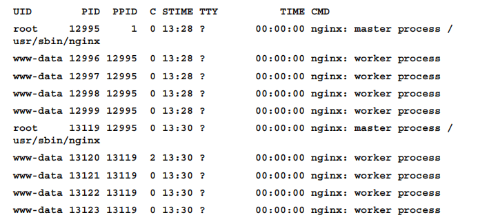
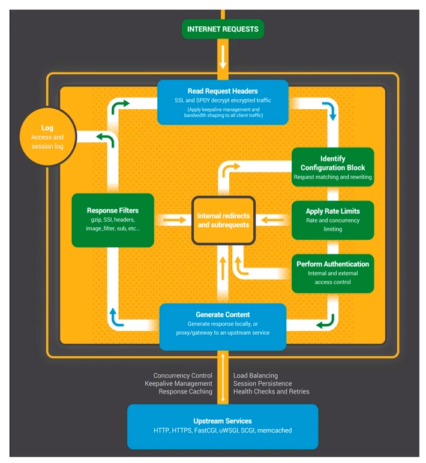
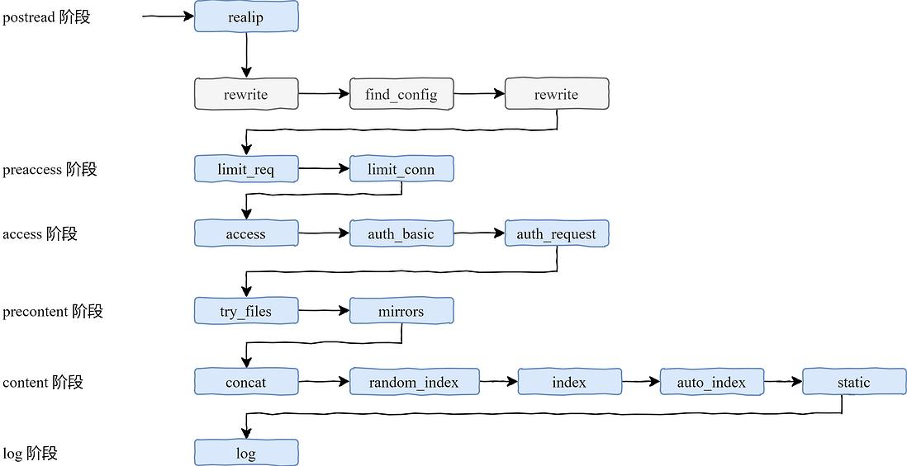
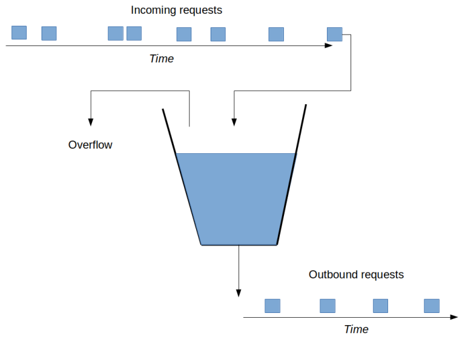
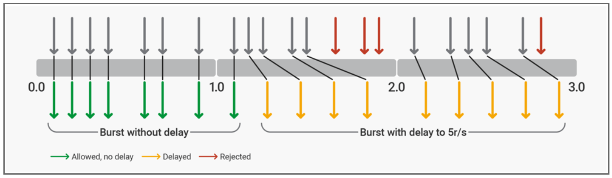

# 技术文档

[TOC]

## 安装

~~~shell
sudo apt-get install nginx
~~~

| 配置文件       | 路径                       |
| -------------- | -------------------------- |
| 配置文件       | `/etc/nginx/nginx.conf`    |
| 虚拟机配置文件 | `/etc/nginx/sites-enabled` |
| 自定义配置文件 | `/etc/nginx/conf.d`        |
| 日志文件       | `/var/log/nginx`           |
| 临时文件       | `/var/lib/nginx`           |

其中配置文件夹 `/etc/nginx/` 下该包括其他配置文件，例如 mime.types 、fastcgi_params、naxsi.rules 等

启动 Nginx 服务

~~~shell
sudo service nginx start
~~~

我们也可以从源文件中安装 Nginx，下面给出一个示例：

~~~shell
$ wget -q http://nginx.org/download/nginx-1.7.9.tar.gz
$ tar xf nginx-1.7.9.tar.gz
$ cd nginx-1.7.9
$ ./configure		# 运行脚本
$ make
$ make install
$ /usr/local/nginx/sbin/nginx		# 启动 Nginx
~~~

|    配置文件    |             路径              |
| :------------: | :---------------------------: |
|    配置文件    | `/usr/local/nginx/nginx.conf` |
| 自定义配置文件 |   `/usr/local/nginx/conf.d`   |
|    日志文件    |    `/usr/local/nginx/logs`    |
|    临时文件    |      `/usr/local/nginx/`      |

## 架构基础

Nginx 有四种进程：

- Master 进程

- worker 进程：处理具体的 HTTP 请求。

  如果 Nginx 采用多线程模型，那么各个线程会共享地址空间，当某一个第三方模块引发了一个段错误时，就会导致整个 Nginx 进程挂掉。而采用多进程模型不会出现这个问题，保证了高可用性

  每个工作进程同时可处理的连接数，可以通过 worker_connections 参数（默认 512）来指定。而工作进程的个数可以通过 worker_processes 参数来设置。

- cache manager 和 cache loader 进程。


Nginx 支持以下控制信号：

|   信号    |         功能概述         |
| :-------: | :----------------------: |
| TERM、INT |      Fast shutdown       |
|   QUIT    |    Graceful shutdown     |
|    HUP    |     Reconfiguration      |
|   USR1    |    Log file reopening    |
|   USR2    |   Nginx binary upgrade   |
|   WINCH   | Graceful worker shutdown |

示例：

~~~nginx
# 4754 是 Nginx 主进程的 PID
kill -HUP 4754
~~~

当 Nginx 接收到 QUIT 信号后，它不再接收新的请求，但仍会处理当前正在执行的请求。待请求处理结束后，再释放资源、退出进程。

当 Nginx 接收到 HUP 信号后，主进程尝试加载配置文件，若加载成功，那么它优雅地关闭工作进程，然后再重启它们，以应用最新的配置。


在 Nginx 中，分割日志文件的步骤：

1. 将当前日志文件重命名或者移动到别的位置，这并不影响当前日志的写入，因为 Nginx  仍持有这些文件的描述符
2. 向 Nginx 发送 USR1 信号，Nginx 关闭旧文件，打开新文件


Nginx 通过 USR2 信号可以实现零停机升级，步骤如下：

1. When the new binary is built, rename the old one and put the new binary into 

   its place

2. send the USR2 signal to the master process of the running instance



升级完成后，我们可以看到两个主进程，新的主进程继承旧主进程的监听套接字。此时两个进程都正常对外提供服务。然后我们向旧的主进程发送 WINCH 信号，这使得它的工作进程优雅地关闭，并拒绝新来的请求。

当确定新的主进程能正常工作后，向旧的主进程发送 QUIT 信号。否则（新的出现了问题），向旧的主进程发送 HUP 信号，使之工作进程重新启动。之后将旧二进制文件移回原来的位置。最后，向新的主进程发送 TERM 信号，使之彻底关闭。

## 指令基础

参数的值类型有：

|   值类型   |           格式            |
| :--------: | :-----------------------: |
|    标志    |        `[on|off]`         |
| 有符号整数 |        `-?[0-9]+`         |
|    大小    |   `[0-9]+([mM]|[kK])?`    |
|   偏移量   | `[0-9]+([mM]|[kK]|[gG])?` |
|    毫秒    |    `[0-9]+[yMwdhms]?`     |

变量通过其名称引用，前缀为美元符号（$）。 另外，变量引用可以用大括号括起变量名称，以防止与周围文本合并。

~~~shell
proxy_set_header Host $http_host;
proxy_set_header Host ${http_host}_squirrel;
~~~

还有一些特殊的变量名：

- `$1`~ `$9`：引用正则表达式中的捕获组

  ~~~nginx
  location ~ /(.+)\.php$ {
      [...]
      proxy_set_header X-Script-Name $1;
  }
  ~~~

- `$arg_`：引用 HTTP 请求中对应的查询参数

  ~~~nginx
  proxy_set_header X-Version-Name $arg_ver;
  ~~~

- `$http_`：引用 HTTP 请求中对应的 HTTP 头

- `$upstream_http_`：HTTP 响应中对应的 HTTP 头

- `$cookie_` 

- `$upstream_cookie_`

- ...

可以使用 set 指令来定义变量：

~~~nginx
set $fruit "apple";
~~~

在当前配置文件中，可以通过 include 指令包含其他配置文件：

~~~nginx
# 相对路径，相对于当前配置文件的位置
include mime.types;

# 绝对路径
include /etc/nginx/conf/site-defaults.conf;

# 带有通配符的 glob 路径
include /etc/nginx/sites-enabled/*.conf;
~~~


一个典型的 Nginx 配置文件示例

~~~nginx
error_log logs/error.log;		# 将错误日志写入 logs/error.log

events {
    use epoll;				   #  使用 epoll 事件处理方法
    worker_connections 1024;	# 并为每个 worker 分配 1024 个连接
}

http {
    include mime.types;			# 导入配置文件
    default_type application/octet-stream;
    
    # 创建一个虚拟主机
    server {
        # 监听  0.0.0.0:80
        listen 80;
        # 设置虚拟主机的域名
        server_name example.org www.example.org;	
        
        location / {
            # 将请求路由到 http://localhost:8080
            proxy_pass http://localhost:8080;
            include proxy_params;
        }
        
        location ~ ^(/images|/js|/css) {
            root html;
            expires 30d;
        }
    }
}
~~~

在 Nginx 中，指令分为两种：

- 值指令：可以继承
  - 子配置不存在时，直接使用父配置块的指令
  - 子配置存在时，覆盖父配置块
- 动作指令：不可继承


`server_name` 指令用来说明该 server 块处理哪些域名下的 HTTP 请求。server_name 指令后可以跟多个域名，第一个是主域名，多个域名之间空格分隔。域名支持正则表达式匹配。当多个 server_name 都匹配到某个域名时，优先级如下：

- 精确匹配
- \* 在前的泛域名
- \* 在后的泛域名
- 正则表达式域名

`server_name_in_redirect` 指令默认关闭，当开启时，匹配的域名重定向到主域名上。

`listen` 指令在 server 块中生效，用来指定监听哪些端口。

## 阶段概述

Nginx 处理 HTTP 请求的全过程



- Read Request Headers：解析请求头。
- Identify Configuration Block：识别由哪一个 location 进行处理，匹配 URL。
- Apply Rate Limits：判断是否限速。例如可能这个请求并发的连接数太多超过了限制，或者 QPS 太高。
- Perform Authentication：连接控制，验证请求。例如可能根据 Referrer 头部做一些防盗链的设置，或者验证用户的权限。
- Generate Content：生成返回给用户的响应。为了生成这个响应，做反向代理的时候可能会和上游服务（Upstream Services）进行通信，然后这个过程中还可能会有些子请求或者重定向，那么还会走一下这个过程（Internal redirects and subrequests）。
- Response Filters：过滤返回给用户的响应。比如压缩响应，或者对图片进行处理。


Nginx 处理 HTTP 请求的 11 个阶段如下：


Nginx 是分 phase 的，并不像 C 这种编程语言一样顺序执行。不同阶段的指令执行顺序和书写的顺序没有太大关系。如果某个模块不把请求向下传递，后面的模块是接收不到请求的。


部分阶段所涉及到的模块和先后顺序如下图所示：



## POST_READ

该阶段仅仅读取请求头部，并未对其做任何处理。因此我们可以从中获取原始信息

HTTP 协议中，有两个头部可以用来获取用户 IP：

- `X-Forwardex-For`：记录所经过节点的 IP 
- `X-Real-IP`：记录用户真实的 IP 地址

realip 模块默认不会编译进 Nginx，需要通过 `--with-http_realip_module` 启用功能。它所涉及的指令有

- set_real_ip_from：用于指定可信地址
  
  ~~~shell
  - Syntax: real_ip_header field | X-Real-IP | X-Forwarded-For | proxy_protocol;
  - Default: real_ip_header X-Real-IP; 
  - Context: http, server, location
  ~~~
  
- real_ip_header field：指定从哪个头部取真实的 IP 地址，如果如果设置从 `X-Forwarded-For` 中取，那么取最后一个 IP 
  
  ~~~shell
  - Syntax: real_ip_header field | X-Real-IP | X-Forwarded-For | proxy_protocol;
  - Default: real_ip_header X-Real-IP; 
  - Context: http, server, location
  ~~~
  
- real_ip_recursive：如果 real_ip_recursive 为 on，那么将从右到左依次比较，直到找到一个不是信任 IP （不在 set_real_ip_from 中）为止。
  
  ~~~shell
  - Syntax: real_ip_recursive on | off;
  - Default: real_ip_recursive off; 
  - Context: http, server, location
  ~~~
  
  


 `X-Real-IP` 是 Nginx 独有的，不是 RFC 规范。如果客户端与服务器之间还有其他非 Nginx 软件实现的代理，就有可能取不到 `X-Real-IP` 头部。

如果使用 `X-Forwarded-For` 获取 realip 的话，推荐打开 `real_ip_recursive`。下面我们来看一个例子：

~~~nginx
set_real_ip_from 192.168.0.108; # 本机地址
real_ip_recursive off;
real_ip_header X-Forwarded-For;

location / {
    return 200 "Client real ip: $remote_addr\n";
}
# Client real ip: 192.168.0.108

# 如果是 real_ip_recursive on;
# 那么结果为 Client real ip: 2.2.2.2
~~~

但是如果客户端通过代理服务器进行连接，服务器就只能看到最后一个代理服务器的 IP 地址，这个 IP 通常没什么用。`X-Forwarded-For` 的出现，就是为了向服务器提供更有用的客户端 IP 地址。

~~~xml
X-Forwarded-For: <client>, <proxy1>, <proxy2>
X-Forwarded-For: 203.0.113.195, 2001:db8:85a3:8d3:1319:8a2e:370:7348, 150.172.238.178
~~~

## FIND_CONFIG

该阶段寻找 URL 对应的 location 。

location 匹配规则

```
location [=|~|~*|^~] /uri/ { … }
```

- `/` 通用匹配，任何请求都会匹配到

- `= /uri`，精确匹配

- `^~ /uri`，前缀匹配，与 `/uri` 的区别是，它的优先级高。

- `/uri` 前缀匹配，这里给一个前缀的例子：

  ~~~nginx
  location /store {
      root /var/www/mall/store;    
      ...
  }
  # `http://localhost/store/yalu-river.html` -> `/var/www/mall/store/store/yalu-river.html`
  ~~~

- `~ pattern` 区分大小写正则匹配

- `~* pattern`，不区分大小写正则匹配

匹配的顺序：

1. 精确匹配 `=`
2. 前缀匹配 `^~`，并且最大前缀匹配
3. 按文件中出现的顺序，逐个正则匹配。
4. 不带任何修饰的前缀匹配，并且最大前缀匹配
5. 通用匹配

一般情况下，location 指令**不会**对是否有斜杠结尾这个场景（这表示我们正在访问目录）做特殊处理，除非满足以下条件：

- location 指令为前缀匹配
- 最后一个字符为斜杠 /
- 指令内嵌入了其它代理类指令。这些代理类指令有：[proxy_pass](http://nginx.org/en/docs/http/ngx_http_proxy_module.html#proxy_pass)、[fastcgi_pass](http://nginx.org/en/docs/http/ngx_http_fastcgi_module.html#fastcgi_pass)、[uwsgi_pass](http://nginx.org/en/docs/http/ngx_http_uwsgi_module.html#uwsgi_pass)、[scgi_pass](http://nginx.org/en/docs/http/ngx_http_scgi_module.html#scgi_pass)、[memcached_pass](http://nginx.org/en/docs/http/ngx_http_memcached_module.html#memcached_pass)、[grpc_pass](http://nginx.org/en/docs/http/ngx_http_grpc_module.html#grpc_pass)

~~~nginx
location /films/nature/ { 
    proxy_pass http://film-server;
}
~~~

此外我们访问 `/films/nature`，那么就会 301 重定向到 `/films/nature/`。如果我们想避免重定向，那么就使用精准匹配：

~~~nginx
location /films/nature/ { 
    proxy_pass http://film-server;
}
location = /films/nature {           # 通过精确匹配，可避免重定向
    proxy_pass http://film-server;
}
~~~

## REWRITE 模块

rewrite 模块涉及两个阶段：`server_rewrite`、`rewrite`。

在 server 块中 rewrite 指令在 server-rewrite 阶段中执行。

### return

在 rewrite 模块中，如果遇到 return 指令，那么直接向客户端返回响应，不再继续执行下面的阶段。

~~~nginx
Syntax: return code [text];
        return code URL;
        return URL;
Default: —
Context: server, location, if
~~~

返回状态码包括以下几种：

- Nginx 自定义
  - 444：立刻关闭连接，用户收不到响应
- HTTP 1.0 标准
  - 301：永久重定向
  - 302：临时重定向，禁止被缓存
- HTTP 1.1 标准
  - 303：临时重定向，允许改变方法，禁止被缓存
  - 307：临时重定向，不允许改变方法，禁止被缓存
  - 308：永久重定向，不允许改变方法


`error_page` 实现**错误页面重定向**，即当 Nginx 响应状态码与 code 匹配时，则返回由 uri 指定的错误页面。

~~~nginx
Syntax: error_page code ... [=[response]] uri | @named_location;
Default: —
Context: http, server, location, if in location
~~~

~~~nginx
error_page 404 /404.html; 
error_page 500 502 503 504 /50x.html;
error_page 404 =200 /empty.gif; 
error_page 404 = @location; 
~~~

这里 `=` 表明如果 uri 指定的页面存在，那么状态码重新设置为 response（默认 200），而不是原先的错误码。注意 return 与 error_page 并不在一个模块中。如果它俩同时出现，那么仅执行 return 语句。

### rewrite

`rewrite` 指令用于修改用户传入 Nginx 的 URL。

~~~nginx
Syntax: rewrite regex replacement [flag];
Default: —
Context: server, location, if
~~~

- `replacement`，使用 `$num` 来获取到第 num 个正则表达式的分组。此外，可以通过`$args`或`$query_string`变量获取到查询参数。

- 当 `replacement` 以 http:// 、 https:// 、 $schema 开头时，则直接返回 302 重定向

- flag：

  - 缺省：仅仅改写 URL。
  - break：本条重写规则匹配完成后（跳转到新的 location 后），终止匹配后续重写规则。
  - last：本条规则匹配完成后，继续匹配重写规则。
  - permanent 返回 301 永久重定向
  - redirect 返回 302 临时重定向

  last、break 是内部重定向，客户端是感知不到资源路径的变化。而 redirect、permanent 是外部重定向

「内部跳转」本质上其实就是把当前 rewrite 阶段强行倒退到 find-config 阶段，以便重新进行请求 URI 与 location 配置块的配对。


Rewrite 的执行顺序为

1. 执行 server 块的 rewrite 指令
2. 执行 location 匹配
3. 执行选定的 location 中的 rewrite 指令

如果其中某步 URI 被重写，则重新循环执行 2-3，直到找到真实存在的文件；循环超过 10次，则返回 500 Internal Server Error 错误。

### break

停止执行 ngx_http_rewrite_module 的指令集，但是其他模块指令是不受影响的

### if

Nginx 的 `if` 指令被认为是“邪恶”的，就和 C 语言的 `goto` 一样。甚至官方有一篇 *[If is Evial](https://www.nginx.com/resources/wiki/start/topics/depth/ifisevil/)* 来警告你不要使用 `if` 。

**尽量只在 if block 内使用 rewrite 模块的指令，例如 return、set 指令。**

在 content 阶段，只会执行最后一个匹配 if 中的 content 阶段命令。如果其中没有，那么就从执行 outer block 中的 content 阶段的命令。下面我们来看几个例子来加深印象：

~~~nginx
location /proxy {
    set $a 32;
    if ($a = 32) {
        set $a 56;
        # 这里匹配到了 if，但是没有 content 阶段的语句
        # 于是在 content 阶段，执行在 outer block 中的 proxy_pass 指令
    }
    set $a 76;
    proxy_pass http://127.0.0.1:$server_port/$a;
}

location ~ /(\d+) {
    echo $1;
}
# 输出 76
~~~

~~~nginx
location /proxy {
    set $a 32;
    if ($a = 32) {
        set $a 56;
        # 这个指令在 content 阶段执行
        # 于是并不会执行 outer block 中的 proxy_pass 指令。
        echo "a = $a";
    }
    set $a 76;		# 这个 set 指令在 rewrite 阶段中执行
    proxy_pass http://127.0.0.1:$server_port/$a;
}

location ~ /(\d+) {
    echo $1;
}
# 输出 a = 76
~~~

If 的使用示例：

~~~nginx
if ($file_present) {
    limit_rate 256k;
}

# A unary expression
if ( -d "${path}" ) {
    try_files "${path}/default.png" "${path}/default.jpg";
}

# A Binary expression
if ($http_user_agent ~ MSIE) {
	rewrite ^(.*)$ /msie/$1 break;
}

if ( $request_method = POST ) {
    set $c1 "yes";
}
if ( $scheme = "https" ) {
    set $c2 "yes";
}
~~~

| 一元运算符 |                   说明                   | 否定 |
| :--------: | :--------------------------------------: | :--: |
|     -f     |         如果指定文件存在，则为真         | !-f  |
|     -d     |        如果指定的目录存在，则为真        | !-d  |
|     -e     |  如果指定文件存在，且为符号链接，则为真  | !-e  |
|     -x     | 如果指定文件存在，且为可执行文件，则为真 | !-x  |

| 二元运算符 |                    说明                    | 否定 |
| :--------: | :----------------------------------------: | :--: |
|     =      |          匹配指定字符串，则为真!=          |  !=  |
|     ~      |         匹配指定正则表达式，则为真         |  !~  |
|     ~*     | 匹配指定正则表达式，但不区分大小写，则为真 | !~*  |


If 块并不直接支持 AND 逻辑。但是可以通过 set 语句来间接解决这一问题：

~~~nginx
if ($request_method = POST && $http_cookie ~* "CCCC=.+(?:;|$)")
# 等价于

if ($request_method = POST) {
	set $test  P;
}

if ($http_cookie ~* "CCCC=.+(?:;|$)" ) {
	set $test  "${test}C";
}

if ($test = PC) {
	#rewrite rule goes here.
}
~~~


如果请求方法不匹配 `limit_except` 中指定的，那么就激活其中的配置：

~~~nginx
limit_except GET {
    return 405;
}
~~~

## 流量管理

### 入站

 `limit_req_zone` 指令可以限制请求数

~~~nginx
limit_req_zone <key> zone=<name>:<size> rate=<rate>;
~~~

- `key`：通常要将请求映射到 key 变量，然后以 key 作为依据**分别**进行限速。
- `name`： defines the name of the zone
- `size`：defines the size of the zone
- `rate`：设定允许的最大请求速率，具有毫秒级别的控制粒度。例如 10r/s 表示，在发出请求的 100 ms 内，拒绝发送新的请求。

a rate-limiting state will be retrieved from the specified shared memory segment and Nginx will apply the **Leaky Bucket** algorithm to manage the request rate：



According to this algorithm, incoming requests can arrive at an arbitrary rate, but the outbound request rate will never be higher than the specified one. Incoming requests "fill the bucket" and if the "bucket" overflows, excessive requests will get the HTTP status 503 (Service Temporarily Unavailable) response.


To enable request rate limiting in a location, use the `limit_req` directive:

~~~nginx
limit_req zone=name [burst=number] [nodelay | delay=number];

# 例子
limit_req_zone $binary_remote_addr zone=one:10m rate=2r/m;
location / {
    limit_req one;
}
~~~

- `burst` ：定义了令牌桶的大小，默认值为 0。

- `nodelay`：burst 虽然可以平滑地处理流量突发的情况，不过增加了在令牌桶等待的请求的响应时间。此时，我们可以使用 nodelay 参数，它直接将令牌桶中的请求立即发送出去，然后在桶中标记槽（slot）为已使用的，然后按 rate 频率来释放插槽。显然，这又失去了**均匀平滑**的特性

- `delay`：实现了两阶段限速，假定 burst 为 N，而 delay 为 M，那么桶里前 M 个请求应用 nodelay 参数，而剩下的 N - M 个就在桶里等待发送。

  


可以使用 `limit_conn_zone` 来限制连接数（limit_req 在 limit_conn 处理之前。）

~~~nginx
limit_conn_zone <key> zone=<name>:<size>;
~~~

这些参数的含义见 `limit_req_zone`。然后使用 `limit_conn` 来启用连接限制：

~~~nginx
location /download {
    limit_conn conn_limit1 5;
}
~~~

如果连接数超出限制，那么就返回 503。


 使用 `limit_rate` 来限制传输速率，而 `limit_rate_after` 指定了用户在发送多少数据后，开始进行限速。

~~~nginx
location /download {
    limit_rate 100k;
}
~~~

### 出站

通过 upstream 来定义一个逻辑服务器：

~~~nginx
http {
    upstream backend {
        server server1.example.com;
        server server2.example.com;
        server server3.example.com;
    }
    [...]
}
~~~

而 server 指令来定义一个物理服务器：

~~~nginx
server <address> [<parameters>];
~~~

- address：物理服务器的域名或者 IP 地址

- parameters 如下：
  - `weight=<number>`：This specifies the numerical weight of the server. It is used for distributing connections among the servers. The default value is 1.
  
  - `max_fails=<number>`：This specifies the maximum number of connection attempts after which the server is considered as unavailable. The default value is 1.
  
  - `fail_timeout=<number>`
  
  - `backup`：This labels a server as a backup server. 当所有主要服务器都不可用时，才会考虑 backup 服务器
  
  - `down`：This labels a server as unavailable.
  
  - `max_conns=<number>`：This limits the number of simultaneous connections to the server.
  
    


可以在 location 中使用 upstream

~~~nginx
http {
    upstream my-cluster {
        server server1.example.com;
        server server2.example.com;
        server server3.example.com;
    }
    […]
        server {
        […]
            location @proxy {
            proxy_pass http://my-cluster;
        }
    }
}
~~~

默认情况下，对于可用上游服务器的负载均衡策略是轮询算法。我们可以使用 weight 参数来指定一个权重，当然也可以使用一个 Hash 算法：

~~~nginx
upstream my-cluster {
    ip_hash;
    server server1.example.com;
    server server2.example.com;
    server server3.example.com;
}

# 使用别的参数作为 hash 的依据
upstream my-cluster {
    hash "$cookie_uid";
    # hash "$remore_addr$http_user_agent";
    server server1.example.com;
    server server2.example.com;
    server server3.example.com;
}
~~~


## 访问控制（ACCESS）

Nginx allows you to permit or deny access to a virtual host or a location by IP address

~~~nginx
allow <IP address> | <IP address>/<prefix size> | all;
deny <IP address> | <IP address>/<prefix size> | all;
~~~

会顺序执行 allow、deny，直到有一个匹配成功。


当请求到达 Nginx，geo 指令会让第一个参数 `$address` 与每行的地址进行匹配，如果匹配成功，则将该行地址对应的值赋值给结果变量 `$variable`。

~~~nginx
 geo [$address] $variable { ... }
~~~

- `$address` 默认值为 `$remote_addr`
- `$variable`：为结果变量

~~~nginx
# 如果 $address 匹配了第二行，那么$admin_access 被赋值为 allow
geo $admin_access {
    default deny;
    10.129.1.0/24 allow;
    10.144.25.0/24 allow;
    10.132.3.0/24 allow;
}
~~~

在每行地址映射中，还可以使用以下内部指令：

- `default`：Specifies a value that is returned when no match is found in the IP address mapping.

- `proxy`：Consider Nginx receives HTTP traffic from an application-level load balancer or an inbound proxy located at IP 10.200.0.1. Since all requests will originate from this IP, we need to examine the "X-Forwarded-For" header in order to obtain the real IP address of the client. 

  ~~~nginx
  geo $example {
      default deny;
      proxy 10.200.0.1; # 如果 IP 为 10.200.0.1，那么从 X-Forwarded-For 中获取真实 IP 然后再匹配
      10.129.1.0/24 allow;
  }
  ~~~

- `proxy_recursive`：If a request originates from an address specified by one of proxy directives, geo will process addresses in the "X-Forwarded-For" header from right-to-left in search of an address outside of the list specified by the proxy directive. In other words, this directive makes geo make a better effort in the search for a real IP address.

- `ranges`：Enables IP address ranges in the mapping list.

  ~~~nginx
  geo $example {
      default deny;
      ranges;
      10.129.1.0-10.129.1.255 allow;
      10.144.25.0-10.144.25.255 allow;
      10.132.3.0/24 allow;
  }
  ~~~

- `delete`：Removes the specified sub network from the mapping.

- `include`： 导入一个定义地址映射的文件


下面使用 geo 模块来实现白名单功能：

~~~nginx
http {
    # $whiteiplist 值为 0 表示不受限制
    geo $whiteiplist  {
        default 1;
        127.0.0.1 0;
        192.0.0.0/8 0;
        103.20.102.0/24 0;
    }

    map $whiteiplist  $limit {
        1 $binary_remote_addr;
        0 "";
    }

    limit_conn_zone $limit zone=limit:10m;

    server {
        listen       80;
        server_name  test.huanqiu.com;

        location ^~ /download/ {
            limit_conn limit 4;
            limit_rate 200k;
            alias /data/www.huanqiu.com/data/download/;
        }
    }
}
~~~

使用 geo 模块来实现**负载均衡**功能：

~~~nginx
geo $geo {
    default default;
    113.110.86.19/32   uk;
    113.110.86.51/32   us;
}


upstream  uk.server {
    server 113.110.86.28:9090;
}

upstream  us.server {
    server 113.110.86.25:9090;
}

upstream  default.server {
    server 188.84.155.239:9090;
}

server {
    listen    80;
    server_name 188.84.155.239;
    index index.html index.htm;
    root /var/www/html/80;

    location / {
        proxy_redirect off;
        proxy_set_header Host $host;
        proxy_set_header X-Real-IP $remote_addr;
        proxy_set_header X-Forwarded-For $proxy_add_x_forwarded_for;
        proxy_pass http://$geo.server$request_uri; # 这里实现了负载均衡
    }
}
~~~


## 静态文件

下面用 Nginx 来缓存静态文件（推荐使用 CDN）：

~~~nginx
server {
    listen 80;
    server_name static.example.com;
    
    # 下面都是优化读取静态文件的参数
    sendfile on;
    sendfile_max_chunk 1M;
    tcp_nopush on;
    gzip_static on;
    aio on;
    directio 4k;
    output_buffers 1 256k;
    
    # 当请求未匹配到任何一个 location 时
    # 从 /usr/local/www/static.example.com 获取静态文件
    root /usr/local/www/static.example.com;
}
~~~

- `sendfile`：用于启用或禁用 Linux 下的 `sendfile()` 系统调用。
- `tcp_nopush`：在使用 `sendfile` 发送数据时，不要立即发送 HTTP 响应头，而是等到整个 HTTP 响应体就绪后再一起发送，这样做可以减少网络包的数量，提高网络的传输效率。
- `tcp_nodelay`：控制 Nagle 算法的应用。Nagle 算法通过减少需要发送的小数据包数量来优化 TCP/IP 网络的效率，但这可能会增加数据到达的延迟
- 


root 与 alias 两个指令都是用来映射文件路径的。 它们主要区别在于 nginx 如何解释 location 后面的 uri ，这会使两者分别以不同的方式将请求映射到服务器文件上。我们直接来看一个例子：

~~~nginx
# 访问 /img/ 目录里面的文件时，ningx 会自动去 /var/www/image/ 目录找文件
location /img/ {
    alias /var/www/image/;
}

# 访问 /img/ 目录下的文件时，nginx 会去 /var/www/image/img/ 目录下找文件
location /img/ {
    root /var/www/image;
}
~~~


## 缓存

### 协商缓存

缓存对象是 Nginx 本地中的资源文件

~~~nginx
# 设置 Cache-Control 头，指定资源可以在客户端缓存 2 天
add_header Cache-Control "public, max-age=172800";

# 设置资源过期时间为1天后
expires 24h;

# 开启ETag
etag on;

# Nginx 默认会设置 Last-Modified 头
~~~


完全禁用缓存：

~~~nginx
# 完全禁止缓存
add_header Cache-Control "no-store, no-cache, must-revalidate, max-age=0";
add_header Pragma "no-cache";
add_header Expires "0";
~~~


### 内容缓存

Nginx 内容缓存（NGINX Content Caching）是用于缓存用户响应结果的

引起缓存过期的因素：

1. proxy_cache_path 中的 inactive 参数
2. 源服务器响应头中的 Expires
3. 源服务器响应头中的 Cache-Control
4. proxy_cache_valid

优先级：proxy_cache_path > Expires > Cache-Control > proxy_cache_valid 。可以通过 proxy_ignore_headers 来忽略 Expires、Cache-Control 响应头的影响


By default, NGINX respects other directives in the `Cache-Control` header: it does not cache responses when the header includes the `Private`, `No-Cache`, or `No-Store` directive. It also doesn’t cache responses with the `Set-Cookie` header. Further, it only caches responses to `GET` and `HEAD` requests. 

A cache can be declared using the proxy_cache_path directive:

~~~nginx
proxy_cache_path <path> keys_zone=<name>:<size> [other parameters...];

# 例子
http {
    proxy_cache_path /var/www/cache keys_zone=my_cache:8m;
    [...]
}
~~~

在指定路径`path`下，创建一个名为 `name`、大小为`size`的共享内存段。proxy_cache_path 指令的相关参数如下：

- path：定义缓存文件存放位置
- levels：定义缓存路径的目录层级
- keys_zone
  - name 是共享内存名字，由 proxy_cache 指令使用
  - size 是共享内存大小，1MB 大约可以存放 8000 个 key
- inactive：在 inactive 时间内没有被访问的缓存，会被淘汰掉，默认 10 分钟
- max_size：设置最大的缓存文件大小，超出后由 cache manager 进程按 LRU 链表淘汰
- manager_files：cache manager 进程在 1 次淘汰过程中，淘汰的最大文件数，默认 100
- manager_sleep：执行一次淘汰循环后 cache manager 进程的休眠时间，默认 200 毫秒
- manager_threshold：执行一次淘汰循环的最大耗时，默认 50 毫秒
- loader_files：cache loader 进程载入磁盘中缓存文件至共享内存，每批最多处理的文件数，默认 100
- loader_sleep：执行一次缓存文件至共享内存后，进程休眠的时间，载入默认 200 毫秒
- loader_threshold：每次载入缓存文件至共享内存的最大耗时，默认 50 毫秒

缓存中还涉及两个额外的 NGINX 进程：

- cache manager：周期性地启动，检查高速缓存的状态，并按规则删除缓存
- **cache loader** 只运行一次，NGINX 开始之后。它将有关以前缓存的元数据加载到共享内存区域。一次加载整个缓存可能会消耗大量资源，导致在最初几分钟内降低 NGINX 的性能。要避免这种情况，请使用 `loader_XXXX` 等参数


使用 proxy_cache 来启用缓存：

~~~nginx
location @proxy {
    proxy_pass http://192.168.0.1:8080;
    proxy_cache my_cache;
}
~~~


可以通过 `proxy_cache_valid` 指令，根据响应码来指定过期时间：

~~~nginx
location @proxy {
    proxy_pass http://192.168.0.1:8080;
    proxy_cache my_cache;
    proxy_cache_valid 200 301 302 1h;
    proxy_cache_valid 404 1m;
}
~~~

`proxy_cache_key` 指令用来指定缓存的 Key 名，默认是以 `$scheme$proxy_host$request_uri` 作为 Key 名。

~~~nginx
location @proxy {
    proxy_pass http://192.168.0.1:8080;
    proxy_cache my_cache;
    # 将查询参数作为缓存依据
    proxy_cache_key "$host$uri$is_args$args";
}
~~~


`proxy_cache_min_uses` 指令的作用是，当客户端发送相同请求达到规定次数后，nginx 才对响应数据进行缓存

~~~nginx
location @proxy {
    proxy_pass http://192.168.0.1:8080;
    proxy_cache my_cache;
    proxy_cache_min_uses 5;
}
~~~


一旦发现缓存过期，可以通过 `proxy_cache_revalidate` 指令来重新缓存。原理是 Nginx  向上游服务器发送  If-Modified-Since / If-None-Match 请求头，如果响应 304 Not Modified，那么缓存继续保留。

~~~nginx
location @proxy {
    proxy_pass http://192.168.0.1:8080;
    proxy_cache my_cache;
    proxy_cache_revalidate on;
}
~~~


`proxy_cache_lock` 指令对于相同的请求，只允许至多一个请求同时发往后端。 其他请求将一直等待，直到缓存中出现相应的内容，或者锁在 proxy_cache_lock_timeout 超时后被释放。如果不启用 proxy_cache_lock，则所有未命中的请求都会直接与服务器通信。

~~~nginx
location @proxy {
    proxy_pass http://backend;
    proxy_cache my_cache;
    proxy_cache_lock on;
}
~~~


如果后端服务器返回异常，Nginx 可以使用过期的缓存来响应：

~~~nginx
location @proxy {
    proxy_pass http://backend;
    proxy_cache my_cache;
    proxy_cache_use_stale error timeout http_500 http_502 http_503
        http_504;
}
~~~


`proxy_cache_bypass`定义 nginx 不从缓存中**读取**的条件。当至少一个参数不为空字符串，或者为 0，那么条件就成立

~~~nginx
if ($http_cookie ~* "comment_author_|wordpress_|wp-postpass_" ) {
	set $do_not_cache 1;
}

location @proxy {
    proxy_pass http://backend;
    proxy_cache my_cache;
    proxy_cache_bypass $do_not_cache $arg_nocache;
}
~~~

`proxy_no_cache `定义 nginx 不写入**缓存**的条件

~~~nginx
location @proxy {
    proxy_pass http://backend;
    proxy_cache my_cache;
    proxy_no_cache $do_not_cache $arg_nocache;
}
~~~


清除缓存的步骤：

1. 在 `http {}` 上下文中创建新变量

   ~~~nginx
   http {
       geo $purge_allowed {
           default 0;
           49.235.28.88 1;
           192.168.1.100/24 1;
       }
       map $request_method $purge_method {
           PURGE 1;
           default 0;
       }
   }
   ~~~

2. 引入 `proxy_cache_purge` 参数来指定清除缓存请求的条件。例如在上一步指定的 `$request_method`

   ~~~nginx
   server {
       listen      80;
       server_name www.example.com;
   
       location / {
           proxy_pass  https://localhost:8002;
           proxy_cache mycache;
   
           proxy_cache_purge $purge_method;
       }
   }
   ~~~

3. 这样可以发送一条 purge 请求来让缓存失效了

   ~~~shell
   curl -X PURGE -D – "https://www.example.com/*"
   ~~~

4. 高速缓存数据不会立即从缓存中删除，它们将保留在磁盘上，直到它们被删除为非活动状态，或由缓存清除进程处理。我们可以在 proxy_cache_path 添加参数 purger，使得删除缓存时，立即从磁盘上也删除它们

   ~~~nginx
   proxy_cache_path /data/cache keys_zone=a:10m purger=on;
   ~~~


## SSL

~~~nginx
server {
    listen 443;
    # The name of the domain in the server_name directive must match the value of the common name field in your certificate signing request.
    server_name your.domain.com;
    ssl on;
    ssl_certificate /etc/ssl/your_domain_name.crt;
    ssl_certificate_key /etc/ssl/your_domain_name.key;
    [… the rest of the configuration ...]
}
~~~

为了避免潜在的安全问题，推荐 HTTP 请求重定向到 HTTPS 请求

~~~nginx
server {
    listen 80;
    server_name your.domain.com;
    rewrite ^/(.*)$ https://your.domain.com/$1 permanent;
}
~~~


如果要验证上游服务器的证书，那么就使用 `proxy_ssl_verify` 指令：

~~~nginx
location @proxy {
    proxy_pass https://192.168.0.1;
    proxy_ssl_verify on;
}
~~~

如果上游服务器持有的证书是自己签名的，那么就无法通过 `proxy_ssl_verify` 指令的验证。此时我们可以使用 `proxy_ssl_trusted_certificate` 来解决这个问题：

~~~nginx
location /upstream {
    ...
    proxy_ssl_trusted_certificate /etc/nginx/trusted_ca_cert.crt;
    proxy_ssl_verify       on;
    ...
}
~~~

如果 Nginx 需要向上游服务器进行身份验证，可以使用下面的命令：

~~~nginx
location @proxy {
    proxy_pass https://192.168.0.1;
    proxy_ssl_certificate /etc/nginx/client.pem;
    proxy_ssl_certificate_key /etc/nginx/client.key;
}
~~~

## 代理

**正向代理**是为了服务内部局域网用户。比如，公司内部的员工可能需要访问一些外部的互联网资源。**反向代理**是为了服务互联网上的用户。总的来说，正向代理隐藏的是真实的客户端，而反向代理隐藏的是真实的服务端。

反向代理可以将 Web 应用服务器从前端服务器中解耦出来，可以让开发人员专注于实现应用逻辑，而不是处理入站流量。一个解耦的例子就是 SSL，Nginx 接收并处理入站的 SSL 连接，然后将请求以 HTTP 协议发送给应用服务器，然后将服务器返回的 HTTP 响应重新包装为 SSL。

其他解耦的例子如下：

- 静态文件的缓存
- 速率、连接的限制
- 压缩
- ...


一个反向代理的例子：

~~~nginx
location /example {
    # upstream_server_name 是上游服务器的主机名
    # 如果上游服务器没有主机名，可以改用 IP 地址
    # proxy_pass http://192.168.0.1:7070;
    proxy_pass http://upstream_server_name;
    
}
~~~

proxy_pass 指令**不会**对其配置是否有斜杠结尾做任何特殊处理。更严格而准确地说法是：proxy_pass 指令会针对其配置是否包含有 uri 做特殊处理，具体如下 ：

- 不带 uri 时（如`http://localhost:8379`，则带上 location 中匹配的路径
- 配置了 uri 时（如`http://localhost:8379/` 或 `http://localhost:8379/foo` ），不携带 location 中完全匹配的路径。如果 location 是正则表达式，那么甚至不携带整个 URL。

下面给出一个例子：

~~~nginx
location /films/ {
    proxy_pass http://film-server/;               # 配置A
}
location /comments/ {
    proxy_pass http://comment-server;             # 配置B
location /comments/top/ {
    proxy_pass http://comment-server/top/;        # 配置C
}
location /feedbacks/ {
    proxy_pass http://feekback-server/center      # 配置D
}
~~~

| 请求                                                         | 匹配的location | 生成的代理地址                          | 说明                                                         |
| ------------------------------------------------------------ | -------------- | --------------------------------------- | ------------------------------------------------------------ |
| `http://localhost/films/wandering-earth`                     | 配置 A         | `http://film-server/wandering-earth`    | 由于 proxy_pass 的配置指定了 uri，新的代理地址将不包含 location 的配置（即 /films/） |
| `http//localhost/comments/list`                              | 配置 B         | `http://comment-server/comments/list`   | 由于 proxy_pass 的配置不带 uri，新的代理地址会保留 location 的配置（即 /comments/ ） |
| `http://localhost/comments/top/asc100`                       | 配置 C         | `http://comment-server/top/asc100`      | 新的代理地址将不包含location的配置, 其中的top来自proxy_pass的配置，而非location |
| `[http://localhost/comments/top/..//desc50](http://localhost/comments//desc50)` | 配置 B         | `http://comment-server/comments/desc50` | 请求的uri经过规范化处理后变成了`http://localhost/comments/desc50`，然后才开始匹配，因此匹配的location为配置B |
| `http://localhost/feedbacks/list`                            | 配置 D         | `http://comment-server/centerlist`      | 新的代理地址将不包含location 的配置, 由于proxy_pass 的配置末尾没有斜杠，所以直接拼接后，会得到 centerlist 这个串 |


`try_files` 指令按顺序查找资源，直至找到一个存在的资源。查找路径是相对 root 或者 alias 的

~~~nginx
location /images/ {
    root /opt/html/;
    try_files $uri  $uri/  /images/default.gif; 
}


location / {
    try_files $uri $uri/index.html $uri.html @mongrel;
}
location @mongrel {
    proxy_pass http://mongrel;
}
~~~


当反向代理时，可能丢失一些信息，例如客户端的 IP 地址。我们可以使用 proxy_set_header 指令来为上游服务器获取原始请求中的缺失信息。

~~~nginx
location @proxy {
    proxy_pass http://192.168.0.1;
    proxy_set_header Host $host;
    proxy_set_header X-Real-IP $remote_addr;
    proxy_set_header X-Forwarded-For $proxy_add_x_forwarded_for;
}
~~~


当上游服务器发出临时或永久重定向（HTTP 状态代码 301或 302）时，Nginx 服务器可以使用 proxy_redirect 指令来设置重定向地址：

~~~nginx
location @proxy {
    proxy_pass http://localhost:8080;
    # 第一个参数是前缀匹配的
    proxy_redirect http://localhost:8080/app http://www.example.com;
}
~~~

假设 web 应用程序发出临时重定向到 `http://localhost:8080/app/login`，那么 Nginx 将重定向地址改为`http://www.example.com/login`。如果省略第二个参数，则 Nginx 将域名和协议修改为 `$scheme://$host/`，其他不改变。


为了使 cookies 正常工作（同源策略），需要由 Nginx 代理重写 cookies 中的域名。为此，可以使用 `proxy_cookie_domain` 指令：

~~~nginx
location @proxy {
    proxy_pass http://localhost:8080;
    # 将上游响应的 cookie 域从 localhost:8080 改为 www.example.com
    proxy_cookie_domain localhost:8080 www.example.com;
}
~~~


首先介绍下 cookie 的 path，它在 domain 的基础上进一步控制 cookie 的访问。当 path=/ 时， 当前域的所有请求都可以访问到这个 cookie。 如果 path=/test，那么只有 /test 下面的请求可以访问到这个cookie。

cookie 的 path 与地址栏上的 path 不一致, 浏览器就不会接受这个 cookie，我们可以使用 `proxy_cookie_path` 来解决这个问题。

~~~nginx
# /my_webapp 是一个前缀匹配，会替换为 /
proxy_cookie_path /my_webapp/ /
~~~

如果有多个指令都可以匹配上 cookie 的路径，nginx 会选择第一个匹配的指令。


当代理服务器有多个网络接口时，可以通过 proxy_bind 指令来指定一个出站 IP 地址

~~~nginx
location @proxy {
    proxy_pass https://192.168.0.1;
    #  Nginx 将出站套接字绑定到 IP 地址 192.168.0.2
    proxy_bind 192.168.0.2;
}
~~~


Nginx 虽然存储了静态资源，但这些资源的权限访问、统计等功能还需要涉及到业务服务器。为此，Nginx 提供了 `X-Accel-Redirect` 等响应头来配合。具体过程如下：

1. 首先将请求正常打到业务服务器上，做一些权限检查、统计等工作
2. 然后业务服务器在响应头中设置 `X-Accel-Redirect`等
3. Nginx 在响应头中发现 `X-Accel-Redirect`，再执行一次内部转发
4. Nginx 接管后续的处理，并根据 `X-Accel-Limit-Rate` 等响应头来做相应的处理。

~~~nginx
location ~* (script1|script2|script3)\.php$ {
    proxy_pass https://192.168.0.1;
}
location /internal-media/ {
    internal;
    alias /var/www/media/;
}
~~~


