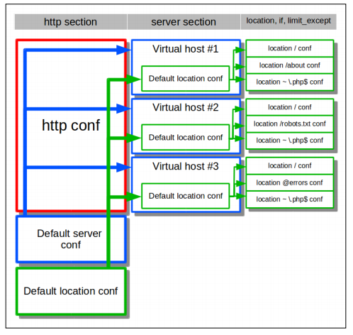
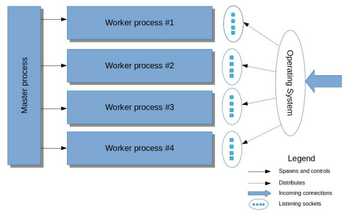
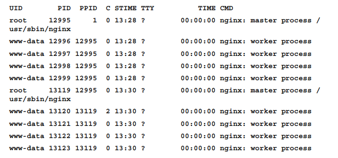
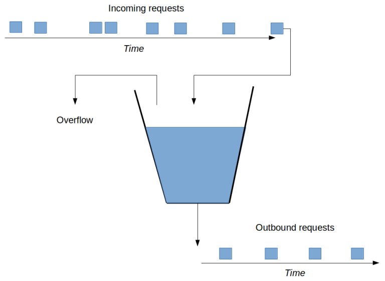
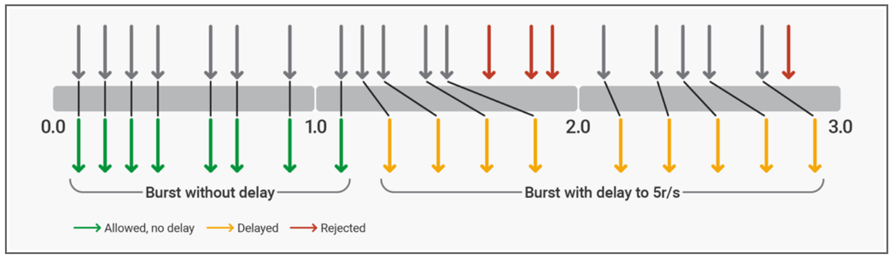

Nginx 是按 phase 来执行的，并不像 C 这种编程语言是按顺序执行的。

## 安装

~~~shell
sudo apt-get install nginx
~~~

| 配置文件       | 路径                       |
| -------------- | -------------------------- |
| 配置文件       | `/etc/nginx/nginx.conf`    |
| 虚拟机配置文件 | `/etc/nginx/sites-enabled` |
| 自定义配置文件 | `/etc/nginx/conf.d`        |
| 日志文件       | `/var/log/nginx`           |
| 临时文件       | `/var/lib/nginx`           |

其中配置文件夹 `/etc/nginx/` 下该包括其他配置文件，例如 mime.types 、fastcgi_params、naxsi.rules 等

启动 Nginx 服务

~~~shell
sudo service nginx start
~~~


我们也可以从源文件中安装 Nginx，下面给出一个示例：

~~~shell
wget -q http://nginx.org/download/nginx-1.7.9.tar.gz
tar xf nginx-1.7.9.tar.gz
cd nginx-1.7.9
./configure		# 运行脚本
make
make install
/usr/local/nginx/sbin/nginx		# 启动 Nginx
~~~

|    配置文件    |             路径              |
| :------------: | :---------------------------: |
|    配置文件    | `/usr/local/nginx/nginx.conf` |
| 自定义配置文件 |   `/usr/local/nginx/conf.d`   |
|    日志文件    |    `/usr/local/nginx/logs`    |
|    临时文件    |      `/usr/local/nginx/`      |


## 基础

参数的值类型有：

|   值类型   |           格式            |
| :--------: | :-----------------------: |
|    标志    |        `[on|off]`         |
| 有符号整数 |        `-?[0-9]+`         |
|    大小    |   `[0-9]+([mM]|[kK])?`    |
|   偏移量   | `[0-9]+([mM]|[kK]|[gG])?` |
|    毫秒    |    `[0-9]+[yMwdhms]?`     |


变量通过其名称引用，前缀为美元符号（$）。 另外，变量引用可以用大括号括起变量名称，以防止与周围文本合并。

~~~shell
proxy_set_header Host $http_host;
proxy_set_header Host ${http_host}_squirrel;
~~~

还有一些特殊的变量名：

- `$1`~ `$9`：引用正则表达式中的捕获参数

  ~~~nginx
  location ~ /(.+)\.php$ {
      [...]
      proxy_set_header X-Script-Name $1;
  }
  ~~~

- `$arg_`：引用 HTTP 请求中对应的查询参数

  ~~~nginx
  proxy_set_header X-Version-Name $arg_ver;
  ~~~

- `$http_`：引用 HTTP 请求中对应的 HTTP 头

- `$upstream_http_`：HTTP 响应中对应的 HTTP 头

- `$cookie_` 

- `$upstream_cookie_`

- ...

可以使用 set 指令来定义变量：

~~~nginx
set $fruit "apple";
~~~


在当前配置文件中，可以通过 include 指令包含其他配置文件：

~~~nginx
# 相对路径，相对于当前配置文件的位置
include mime.types;

# 绝对路径
include /etc/nginx/conf/site-defaults.conf;

# 带有通配符的 glob 路径
include /etc/nginx/sites-enabled/*.conf;
~~~


块（Section）包含了其他的指令，或者包含其他块。下面我们快速介绍一些常用的 Section。http 块为 HTTP 服务提供默认配置。 它通常包含一个 server 块，用于处理 HTTP 请求。

~~~nginx
http {
	[...]
	server {
		[...]
	}
}
~~~

一个 server 块可以包括多个 location 块。在 server 中设置的指令，实际上是在默认的 location 中设置的。当请求打到监听地址时，请求首先通过 server_name 路由到特定 server 块上，然后紧接着根据匹配规则路由到特定 location 块。如果未匹配到任何一个 location 块，那么就路由到默认 location 块上（server 块）


location 匹配规则

```
location [=|~|~*|^~] /uri/ { … }
```

- `/` 通用匹配，任何请求都会匹配到

- `= /uri`，精确匹配

- `^~ /uri`，前缀匹配，与 `/uri` 的区别是，它的优先级高。

- `/uri` 前缀匹配，这里给一个前缀的例子：

  ~~~nginx
  location /store {
      root /var/www/mall/store;    
      ...
  }
  # `http://localhost/store/yalu-river.html` -> `/var/www/mall/store/store/yalu-river.html`
  
  # `http://localhost/store-central.html` ->  `/var/www/mall/store**/store-central.html`
  ~~~

- `~ pattern` 区分大小写正则匹配

- `~* pattern`，不区分大小写正则匹配

匹配的顺序：

1. 精确匹配 `=`
2. 前缀匹配 `^~`，并且最大前缀匹配
3. 按文件中出现的顺序，逐个正则匹配。
4. 不带任何修饰的前缀匹配，并且最大前缀匹配
5. 通用匹配

一般情况下，location 指令**不会**对是否有斜杠结尾这个场景（这表示我们正在访问目录）做特殊处理，除非满足以下条件：

- location 指令为前缀匹配
- 最后一个字符为斜杠 /
- 指令内嵌入了其它代理类指令。这些代理类指令有：[proxy_pass](http://nginx.org/en/docs/http/ngx_http_proxy_module.html#proxy_pass)、[fastcgi_pass](http://nginx.org/en/docs/http/ngx_http_fastcgi_module.html#fastcgi_pass)、[uwsgi_pass](http://nginx.org/en/docs/http/ngx_http_uwsgi_module.html#uwsgi_pass)、[scgi_pass](http://nginx.org/en/docs/http/ngx_http_scgi_module.html#scgi_pass)、[memcached_pass](http://nginx.org/en/docs/http/ngx_http_memcached_module.html#memcached_pass)、[grpc_pass](http://nginx.org/en/docs/http/ngx_http_grpc_module.html#grpc_pass)

~~~nginx
location /films/nature/ { 
    proxy_pass http://film-server;
}
~~~

假设我们访问 `/films/nature`，那么就会 301 重定向到 `/films/nature/`。如果我们想避免重定向，那么就使用精准匹配：

~~~nginx
location /films/nature/ { 
    proxy_pass http://film-server;
}
location = /films/nature {           # 通过精确匹配，可避免重定向
    proxy_pass http://film-server;
}
~~~

~~~text
                  location内是否有代理类指令
               +--------------------------------+ 
WebRequest --> | Does contains proxy instruct ? |---- No ---> 返回服务器磁盘上的文件  ★
               +--------------------------------+
                               |
                              Yes
                               |
                               +---------> 代理到其它WEB服务
~~~


在 rewrite 模块中的 server 块或者 location 块支持 if 块。

~~~nginx
if ($file_present) {
    limit_rate 256k;
}

# A unary expression
if ( -d "${path}" ) {
    try_files "${path}/default.png" "${path}/default.jpg";
}

# A Binary expression
if ($http_user_agent ~ MSIE) {
	rewrite ^(.*)$ /msie/$1 break;
}

if ( $request_method = POST ) {
    set $c1 "yes";
}
if ( $scheme = "https" ) {
    set $c2 "yes";
}
~~~

| 一元运算符 |                   说明                   | 否定 |
| :--------: | :--------------------------------------: | :--: |
|     -f     |         如果指定文件存在，则为真         | !-f  |
|     -d     |        如果指定的目录存在，则为真        | !-d  |
|     -e     |  如果指定文件存在，且为符号链接，则为真  | !-e  |
|     -x     | 如果指定文件存在，且为可执行文件，则为真 | !-x  |

| 二元运算符 |                    说明                    | 否定 |
| :--------: | :----------------------------------------: | :--: |
|     =      |          匹配指定字符串，则为真!=          |  !=  |
|     ~      |         匹配指定正则表达式，则为真         |  !~  |
|     ~*     | 匹配指定正则表达式，但不区分大小写，则为真 | !~*  |

再次强调一遍，Nginx 是按 phase 来执行的，并不像 C 这种编程语言是按顺序执行的。If 是属于 rewrite 模块的，所以对于 if 来讲，会和其他的 rewrite 模块执行全部执行完之后再进行下一阶段。下面给出四个例子来认识 if 的工作原理。注意还有 server-rewrite 阶段在 rewrite 前，这里我们暂不讨论。

首先，rewrite 阶段的执行顺序和指令的顺序是一样的。如果 if 块中并没有 content 阶段的指令，那么它会继承 outer block 的 content 阶段的命令。所以下面示例的执行流程如下：

1. `$a` 被设为 32
2. 进入 if block，`$a` 在这里被设为 56
3.  `$a` 被设为 76
4. if block 生效。但是 if block 中没有任何 content 阶段的指令，所以会继承 outer block，即 `ngx_proxy` 模块的 `proxy_pass` 

~~~nginx
location /proxy {
    set $a 32;
    if ($a = 32) {
        set $a 56;
    }
    set $a 76;
    proxy_pass http://127.0.0.1:$server_port/$a;
}
# 返回 76
~~~

而下面这个例子由于里面有 content 阶段的命令，所以只会执行 `echo`，而不会继承外部的 `proxy_pass` 

~~~java
location /proxy {
    set $a 32;
    if ($a = 32) {
        set $a 56;
        echo "a = $a";
    }
    set $a 76;
    proxy_pass http://127.0.0.1:$server_port/$a;
}
~~~

Rewrite 阶段的 `break` 可以终止 rewrite 阶段的执行，因此下面这个例子执行完 `if ($a = 32)` 之后执行 `set $a 56` ，此时下一行是 `break` ，然后 rewrite 阶段就停止了，进行下一阶段。`set $a 76` 并没有被执行到。所以最后 `$a` 的值是 `56`。由于 if 块已被激活，所以会执行 echo 指令

~~~nginx
location /proxy {
    set $a 32;
    if ($a = 32) {
        set $a 56;
        break;
        echo "a = $a";
    }
    set $a 76;
    proxy_pass http://127.0.0.1:$server_port/$a;
}
~~~

**尽量只在 if block 内使用 rewrite 模块的指令，例如 return、set 指令。**如果有多个激活的 if 块，那么 rewrite 阶段的指令都会被执行，而只有最后一个激活的 if 块中的 content 阶段的指令会被执行。

If 块并不直接支持 AND 逻辑，。但是可以通过 set 语句来间接解决这一问题：

~~~nginx
if ($request_method = POST && $http_cookie ~* "CCCC=.+(?:;|$)")
# 等价于

if ($request_method = POST) {
	set $test  P;
}

if ($http_cookie ~* "CCCC=.+(?:;|$)" ) {
	set $test  "${test}C";
}

if ($test = PC) {
	#rewrite rule goes here.
}
~~~


如果在 location 中需要直接返回 HTTP 响应，可以通过 `return` 指令来实现：

~~~nginx
location / {
    return 301 "https://www.example.com$uri";
}

location /disabled {
    default_type text/plain;
    return 200 "OK";
}
~~~

如果在 server-rewrite （server 块）或者 rewrite 阶段（location 块）中执行到 return 语句，那么就立即向客户端返回响应。


如果请求方法不匹配 limit_except 中指定的，那么就激活其中的配置：

~~~nginx
limit_except GET {
    return 405;
}
~~~


有些配置允许从外层的 Section 继承到内层的，这在配置 Nginx 时节省了很多时间。



- 有些指令，例如 `variables_hash_max_size`， 并没有任何继承规则，所以它们只能在 http 部分中指定，并应用于整个HTTP服务。
- 而 `client_header_timeout` 等指令可以从 http 中继承，它们只能在 http 或者 server 中指定。如果直接从 server 中指定，那么会覆盖掉那些继承值。
- 其他指令可以从任何地方继承下来。

下面给出一个示例：

~~~nginx
location / {
    # 外部部分
    root /var/www/example.com;
    gzip on;
    location ~ \.js$ {
       	# 继承 root
        # 覆盖掉 gzip 的继承值
        gzip off;	
    }
    location ~ \.css$ {
        # 继承 root、gzip
    }
}
~~~

如果并没有指定某个参数，也就是说无法获取到继承值，那么就使用内置的默认值。此外，有几种情况会屏蔽掉继承值。


下面给出一个示例配置：

~~~nginx
error_log logs/error.log;		# 将错误日志写入 logs/error.log

events {
    use epoll;				   #  使用 epoll 事件处理方法
    worker_connections 1024;	# 并为每个 worker 分配 1024 个连接
}
http {
    include mime.types;			# 导入配置文件
    default_type application/octet-stream;
    
    # 创建一个虚拟主机
    server {
        # 监听  0.0.0.0:80
        listen 80;
        # 设置虚拟主机的域名
        server_name example.org www.example.org;	
        
        location / {
            # 将请求路由到 http://localhost:8080
            proxy_pass http://localhost:8080;
            include proxy_params;
        }
        
        location ~ ^(/images|/js|/css) {
            root html;
            expires 30d;
        }
    }
}
~~~


## 管理 Nginx

单个 Nginx 实例由「主进程」和「工作进程」组成，它的架构设计如下：



每个工作进程同时可处理的连接数，可以通过 worker_connections 参数（默认 512）来指定。而工作进程的个数可以通过 worker_processes 参数来设置。

Nginx 支持以下控制信号：

|   信号    |         功能概述         |
| :-------: | :----------------------: |
| TERM、INT |      Fast shutdown       |
|   QUIT    |    Graceful shutdown     |
|    HUP    |     Reconfiguration      |
|   USR1    |    Log file reopening    |
|   USR2    |   Nginx binary upgrade   |
|   WINCH   | Graceful worker shutdown |

示例：

~~~nginx
# 4754 是 Nginx 主进程的 PID
kill -HUP 4754
~~~

Nginx 快速关闭时，所有资源立即释放，工作进程立即退出。

当 Nginx 接收到 QUIT 信号后，它不再接收新的请求，但仍会处理当前正在执行的请求。待请求处理结束后，再释放资源、退出进程。

当 Nginx 接收到 HUP 信号后，主进程尝试加载配置文件，若加载成功，那么它优雅地关闭工作进程，然后再重启它们，以应用最新的配置。

在 Nginx 中，分割日志文件的步骤：

1. 将当前日志文件重命名或者移动到别的位置，这并不影响当前日志的写入，因为 Nginx  仍持有这些文件的描述符
2. 向 Nginx 发送 USR1信号，Nginx 关闭旧文件，打开新文件

Nginx 通过 USR2 信号可以实现零停机升级，步骤如下：

1. When the new binary is built, rename the old one and put the new binary into 

   its place:

2. send the USR2 signal to the master process of the running instance



升级完成后，我们可以看到两个主进程，新的主进程继承旧主进程的监听套接字。此时两个进程都正常对外提供服务。然后我们向旧的主进程发送 WINCH 信号，这使得它的工作进程优雅地关闭，并拒绝新来的请求。

当确定新的主进程能正常工作后，向旧的主进程发送 QUIT 信号。否则（新的出现了问题），向旧的主进程发送 HUP 信号，使之工作进程重新启动。之后将旧二进制文件移回原来的位置。最后，向新的主进程发送 TERM 信号，使之彻底关闭。


## 静态文件

下面用 Nginx 来缓存静态文件（推荐使用 CDN）：

~~~nginx
server {
    listen 80;
    server_name static.example.com;
    access_log /var/log/nginx/static.example.com-access.log main;
    
    # 下面都是优化读取静态文件的参数
    sendfile on;
    sendfile_max_chunk 1M;
    tcp_nopush on;
    gzip_static on;
    
    # 当请求未匹配到任何一个 location 时
    # 上/usr/local/www/static.example.com 获取静态文件
    root /usr/local/www/static.example.com;
}
~~~


~~~nginx
location /media {
    sendfile off;
    aio on;
    directio 4k;
    output_buffers 1 256k;
    [...]
}
~~~


root 与 alias 主要区别在于 nginx 如何解释 location 后面的 uri ，这会使两者分别以不同的方式将请求映射到服务器文件上。我们直接来看一个例子：

~~~nginx
# 访问 /img/ 目录里面的文件时，ningx 会自动去 /var/www/image/ 目录找文件
location /img/ {
    alias /var/www/image/;
}

# 访问 /img/ 目录下的文件时，nginx 会去 /var/www/image/img/ 目录下找文件
location /img/ {
    root /var/www/image;
}
~~~


## SSL

~~~nginx
server {
    listen 443;
    # The name of the domain in the server_name directive must match the value of the common name field in your certificate signing request.
    server_name your.domain.com;
    ssl on;
    ssl_certificate /etc/ssl/your_domain_name.crt;
    ssl_certificate_key /etc/ssl/your_domain_name.key;
    [… the rest of the configuration ...]
}
~~~

为了避免潜在的安全问题，推荐 HTTP 请求重定向到 HTTPS 请求

~~~nginx
server {
    listen 80;
    server_name your.domain.com;
    rewrite ^/(.*)$ https://your.domain.com/$1 permanent;
}
~~~


如果要验证上游服务器的证书，那么就使用 `proxy_ssl_verify` 指令：

~~~nginx
location @proxy {
    proxy_pass https://192.168.0.1;
    proxy_ssl_verify on;
}
~~~

如果上游服务器持有的证书是自己签名的，那么就无法通过 `proxy_ssl_verify` 指令的验证。此时我们可以使用 `proxy_ssl_trusted_certificate` 来解决这个问题：

~~~nginx
location /upstream {
    ...
    proxy_ssl_trusted_certificate /etc/nginx/trusted_ca_cert.crt;
    proxy_ssl_verify       on;
    ...
}
~~~


如果 Nginx 需要向上游服务器进行身份验证，可以使用下面的命令：

~~~nginx

location @proxy {
    proxy_pass https://192.168.0.1;
    proxy_ssl_certificate /etc/nginx/client.pem;
    proxy_ssl_certificate_key /etc/nginx/client.key;
}
~~~

## 代理

**正向代理**是为了服务内部局域网用户。比如，公司内部的员工可能需要访问一些外部的互联网资源。**反向代理**是为了服务互联网上的用户。总的来说，正向代理隐藏的是真实的客户端，而反向代理隐藏的是真实的服务端。

反向代理可以将 Web 应用服务器从前端服务器中解耦出来，可以让开发人员专注于实现应用逻辑，而不是处理入站流量。一个解耦的例子就是 SSL，Nginx 接收并处理入站的 SSL 连接，然后将请求以 HTTP 协议发送给应用服务器，然后将服务器返回的 HTTP 响应重新包装为 SSL。

其他解耦的例子如下：

- 静态文件的缓存
- 速率、连接的限制
- 压缩
- ...


一个反向代理的例子：

~~~nginx
location /example {
    # upstream_server_name 是上游服务器的主机名
    # 如果上游服务器没有主机名，可以改用 IP 地址
    # proxy_pass http://192.168.0.1:7070;
    proxy_pass http://upstream_server_name;
    
}
~~~

proxy_pass 指令**不会**对其配置是否有斜杠结尾做任何特殊处理。更严格而准确地说法是：proxy_pass 指令会针对其配置是否包含有 uri 做特殊处理，具体如下 ：

- 不带 uri 时（如`http://localhost:8379`，则带上 location 中匹配的路径
- 配置了 uri 时（如`http://localhost:8379/` 或 `http://localhost:8379/foo` ），不携带 location 中匹配的路径。如果 location 是正则表达式，那么甚至不携带整个 URL。

下面给出一个例子：

~~~nginx
location /films/ {
    proxy_pass http://film-server/;               # 配置A
}
location /comments/ {
    proxy_pass http://comment-server;             # 配置B
location /comments/top/ {
    proxy_pass http://comment-server/top/;        # 配置C
}
location /feedbacks/ {
    proxy_pass http://feekback-server/center      # 配置D
}
~~~

| 请求                                                         | 匹配的location | 生成的代理地址                          | 说明                                                         |
| ------------------------------------------------------------ | -------------- | --------------------------------------- | ------------------------------------------------------------ |
| `http://localhost/films/wandering-earth`                     | 配置 A         | `http://film-server/wandering-earth`    | 由于 proxy_pass 的配置指定了 uri，新的代理地址将不包含 location 的配置（即 /films/） |
| `http//localhost/comments/list`                              | 配置 B         | `http://comment-server/comments/list`   | 由于 proxy_pass 的配置不带 uri，新的代理地址会保留 location 的配置（即 /comments/ ） |
| `http://localhost/comments/top/asc100`                       | 配置 C         | `http://comment-server/top/asc100`      | 新的代理地址将不包含location的配置, 其中的top来自proxy_pass的配置，而非location |
| `[http://localhost/comments/top/..//desc50](http://localhost/comments//desc50)` | 配置 B         | `http://comment-server/comments/desc50` | 请求的uri经过规范化处理后变成了`http://localhost/comments/desc50`，然后才开始匹配，因此匹配的location为配置B |
| `http://localhost/feedbacks/list`                            | 配置 D         | `http://comment-server/centerlist`      | 新的代理地址将不包含location 的配置, 由于proxy_pass 的配置末尾没有斜杠，所以直接拼接后，会得到 centerlist 这个串 |


`try_files` 指令按顺序查找资源，直至找到一个存在的资源。查找路径是相对 root 或者 alias 的

~~~nginx
location /images/ {
    root /opt/html/;
    try_files $uri  $uri/  /images/default.gif; 
}


location / {
    try_files $uri $uri/index.html $uri.html @mongrel;
}
location @mongrel {
    proxy_pass http://mongrel;
}
~~~


当反向代理时，可能丢失一些信息，例如客户端的 IP 地址。我们可以使用 proxy_set_header 指令来为上游服务器获取原始请求中的缺失信息。

~~~nginx
location @proxy {
    proxy_pass http://192.168.0.1;
    proxy_set_header Host $host;
    proxy_set_header X-Real-IP $remote_addr;
    proxy_set_header X-Forwarded-For $proxy_add_x_forwarded_for;
}
~~~


当上游服务器发出临时或永久重定向（HTTP 状态代码 301或 302）时，Nginx 服务器可以使用 proxy_redirect 指令来设置重定向地址：

~~~nginx
location @proxy {
    proxy_pass http://localhost:8080;
    # 第一个参数是前缀匹配的
    proxy_redirect http://localhost:8080/app http://www.example.com;
}
~~~

假设 web 应用程序发出临时重定向到 `http://localhost:8080/app/login`，那么 Nginx 将重定向地址改为`http://www.example.com/login`。如果省略第二个参数，则 Nginx 将域名和 协议修改为 `$scheme://$host/`，其他不改变。


为了使 cookies 正常工作（同源策略），需要由 Nginx 代理重写 cookies 中的域名。为此，可以使用 `proxy_cookie_domain` 指令：

~~~nginx
location @proxy {
    proxy_pass http://localhost:8080;
    # 将上游响应的 cookie 域从 localhost:8080 改为 www.example.com
    proxy_cookie_domain localhost:8080 www.example.com;
}
~~~


首先介绍下 cookie 的 path，它在 domain 的基础上进一步控制 cookie 的访问。当 path=/ 时， 当前域的所有请求都可以访问到这个 cookie。 如果 path=/test，那么只有 /test 下面的请求可以访问到这个cookie。

cookie 的 path 与地址栏上的 path 不一致, 浏览器就不会接受这个 cookie，我们可以使用 `proxy_cookie_path` 来解决这个问题。

~~~nginx
# /my_webapp 是一个前缀匹配，会替换为 /
proxy_cookie_path /my_webapp/ /
~~~

如果有多个指令都可以匹配上 cookie 的路径，nginx 会选择第一个匹配的指令。


可以使用 error_page 指令处理上游服务器的响应错误：

~~~nginx
location ~* (script1|script2|script3)\.php$ {
    proxy_pass http://192.168.0.1;
    # 在发生上游响应错误时，返回文件 50x.html，并将状态码改为 200
    error_page 500 502 503 504 =200  /50x.html;
}

# 更复杂的例子
location ~* (script1|script2|script3)\.php$ {
    proxy_pass http://upstreamA;
    error_page 500 502 503 504 @retry;
}
location @retry {
    proxy_pass http://upstreamB;
    error_page 500 502 503 504 =200 /50x.html;
}
~~~


当代理服务器有多个网络接口时，可以通过 proxy_bind 指令来指定一个出站 IP 地址

~~~nginx
location @proxy {
    proxy_pass https://192.168.0.1;
    #  Nginx 将出站套接字绑定到 IP 地址 192.168.0.2
    proxy_bind 192.168.0.2;
}
~~~


Nginx 虽然存储了静态资源，但这些资源的权限访问、统计等功能还需要涉及到业务服务器。为此，Nginx 提供了 `X-Accel-Redirect` 等响应头来配合。具体过程如下：

1. 首先将请求正常打到业务服务器上，做一些权限检查、统计等工作
2. 然后业务服务器在响应头中设置 `X-Accel-Redirect`等
3. Nginx 在响应头中发现 `X-Accel-Redirect`，再执行一次内部转发
4. Nginx 接管后续的处理，并根据 `X-Accel-Limit-Rate` 等响应头来做相应的处理。

~~~nginx
location ~* (script1|script2|script3)\.php$ {
    proxy_pass https://192.168.0.1;
}
location /internal-media/ {
    internal;
    alias /var/www/media/;
}
~~~


## 缓存

A cache can be declared using the proxy_cache_path directive:

~~~nginx
proxy_cache_path <path> keys_zone=<name>:<size> [other parameters...];

# 例子
http {
    proxy_cache_path /var/www/cache keys_zone=my_cache:8m;
    [...]
}
~~~

在指定路径`path`下，创建一个名为 `name`、大小为`size`的共享内存段。每个缓存项大约占用 128 Bytes。所以 8 MB 的缓存可以保存大约  64,000 个缓存项。

proxy_cache_path 指令的相关参数如下：

| 参数             | 说明                                                         |
| ---------------- | ------------------------------------------------------------ |
| levels           | Specifies hierarchy levels of the cache directory            |
| inactive         | Specifies the time after which a cache item will be removed from the cache if it was not used, regardless of freshness。<br> |
| max_size         | Specifies maximum size (total size) of all cache items。当达到配额后，就会触发 Nginx 的淘汰机制，删除最少使用的 cache item |
| loader_files     | Specifies the number of files a **cache loader** process loads in  each iteration |
| loader_sleep     | Specifies the time interval a cache loader process sleeps between each iteration |
| loader_threshold | Specifies the time limit for each iteration of a cache loader process |

使用 proxy_cache 来启用缓存：

~~~nginx
location @proxy {
    proxy_pass http://192.168.0.1:8080;
    proxy_cache my_cache;
}
~~~


The primary source for the expiration interval for Nginx is the upstream itself. The following table explains which upstream response header influences caching and how:

| Upstream response header |                  How it influences caching                   |
| :----------------------: | :----------------------------------------------------------: |
|     X-Accel-Expires      | This specifies the cache item expiration interval in seconds. If the value starts from @, then the number following it is UNIX timestamp when the item is due to expire. This header |
|         Expires          |     This specifies the cache item expiration time stamp      |
|      Cache-Control       |               This enables or disables caching               |
|        Set-Cookie        |                    This disables caching                     |
|           Vary           |             The special value * disables caching             |

对于过期的 Cache，只有 inactive、max_size 以及惰性策略等才会考虑删除它。


此外，还可以通过 `proxy_cache_valid` 指令，根据响应码过期来指定过期时间：

~~~nginx
location @proxy {
    proxy_pass http://192.168.0.1:8080;
    proxy_cache my_cache;
    proxy_cache_valid 200 301 302 1h;
    proxy_cache_valid 404 1m;
}
~~~


`proxy_cache_key` 指令用来指定缓存的 Key 名，默认是以 `$scheme$proxy_host$request_uri` 作为 Key 名。

~~~nginx
location @proxy {
    proxy_pass http://192.168.0.1:8080;
    proxy_cache my_cache;
    # 将查询参数作为缓存依据
    proxy_cache_key "$host$uri$is_args$args";
}
~~~


`proxy_cache_min_uses` 指令的作用是，当客户端发送相同请求达到规定次数后，nginx 才对响应数据进行缓存

~~~nginx
location @proxy {
    proxy_pass http://192.168.0.1:8080;
    proxy_cache my_cache;
    proxy_cache_min_uses 5;
}
~~~


一旦发现缓存过期，可以通过 `proxy_cache_revalidate` 指令来重新缓存。原理是 Nginx  向上游服务器发送  If-Modified-Since / If-None-Match 请求头，如果响应 304 Not Modified，那么缓存继续保留。

~~~nginx
location @proxy {
    proxy_pass http://192.168.0.1:8080;
    proxy_cache my_cache;
    proxy_cache_revalidate on;
}
~~~


`proxy_cache_lock` 指令对于相同的请求，只允许至多一个请求同时发往后端。 其他请求将一直等待，直到缓存中出现相应的内容，或者锁在 proxy_cache_lock_timeout 超时后被释放。如果不启用 proxy_cache_lock，则所有未命中的请求都会直接与服务器通信。

~~~nginx
location @proxy {
    proxy_pass http://backend;
    proxy_cache my_cache;
    proxy_cache_lock on;
}
~~~


如果后端服务器返回异常，Nginx 可以使用过期的缓存来响应：

~~~nginx
location @proxy {
    proxy_pass http://backend;
    proxy_cache my_cache;
    proxy_cache_use_stale error timeout http_500 http_502 http_503
        http_504;
}
~~~


`proxy_cache_bypass`定义 nginx 不从缓存中**读取**的条件。当至少一个参数不为空字符串，或者为0，那么条件就成立

~~~nginx
if ($http_cookie ~* "comment_author_|wordpress_|wp-postpass_" ) {
	set $do_not_cache 1;
}

location @proxy {
    proxy_pass http://backend;
    proxy_cache my_cache;
    proxy_cache_bypass $do_not_cache $arg_nocache;
}
~~~

`proxy_no_cache `定义 nginx 不写入**缓存**的条件

~~~nginx

location @proxy {
    proxy_pass http://backend;
    proxy_cache my_cache;
    proxy_no_cache $do_not_cache $arg_nocache;
}
~~~

同时使用 `proxy_cache_bypass` 和 `proxy_no_cache` 会完全禁用缓存

## 重写

通过 `rewrtie` 命令，我们可以重写 URL。

```nginx
location / {
    rewrite ^/([0-9]+).html$ /index.jsp?pageNum=$1 break;
    # 这样 /XXX.html 被改为 index.jsp
    # 然后在代理 URL 上携带这个路径
    proxy_pass http://192.168.44.104:8080;
}
```

```
rewrite <regex> <replacement> [flag];
关键字    正则     替代内容    flag标记
```

- replacement，使用 `$num` 来获取到第 num 个匹配的正则表达式的内容。此外，可以通过`$args`或`$query_string`变量获取到查询参数。

  如果 replacement 以 ”http://” 或 ”https://” 或 “$scheme” 开始，那么处理过程将终止，并要求客户端重定向到 replacement

- flag：

  - break：本条重写规则匹配完成后，终止匹配后续重写规则。如果不指定，那么依次应用 rewrite 指令。
  - last：本条重写规则匹配完成后，终止匹配后续重写规则，并重新发起请求继续匹配新的 location URI 规则
  - permanent 返回 301 永久重定向
  - redirect 返回 302 临时重定向

  last、break 是内部重定向，客户端是感知不到资源路径的变化。而 redirect、permanent 是外部重定向


Rewrite 的执行顺序为

1. 执行 server 块的 rewrite 指令
2. 执行 location 匹配
3. 执行选定的 location 中的 rewrite 指令

如果其中某步 URI 被重写，则重新循环执行 1-3，直到找到真实存在的文件；循环超过 10次，则返回 500 Internal Server Error 错误。

## 访问控制

Nginx allows you to permit or deny access to a virtual host or a location by IP address

~~~nginx
allow <IP address> | <IP address>/<prefix size> | all;
deny <IP address> | <IP address>/<prefix size> | all;
~~~

会顺序执行 allow、deny，直到有一个匹配成功。

 

语法：

~~~nginx
 geo [$address] $variable { ... }
~~~

- `$address` 默认值为 `$remote_addr`
- `$variable`：为结果变量

当请求到达 Nginx，geo 指令会让第一个参数 `$address` 与每行的地址进行匹配，如果匹配成功，则将该行地址对应的值赋值给结果变量 `$variable`。

~~~nginx
# 如果 $address 匹配了第二行，那么$admin_access 被赋值为 allow
geo $admin_access {
    default deny;
    10.129.1.0/24 allow;
    10.144.25.0/24 allow;
    10.132.3.0/24 allow;
}
~~~

在每行地址映射中，还可以使用以下内部指令：

- `default`：Specifies a value that is returned when no match is found in the IP address mapping.

- `proxy`：Consider Nginx receives HTTP traffic from an application-level load balancer or an inbound proxy located at IP 10.200.0.1. Since all requests will originate from this IP, we need to examine the "X-Forwarded-For" header in order to obtain the real IP address of the client. 

  ~~~nginx
  geo $example {
      default deny;
      proxy 10.200.0.1; # 如果 IP 为 10.200.0.1，那么从X-Forwarded-For中获取真实 IP 然后再匹配
      10.129.1.0/24 allow;
  }
  ~~~

- `proxy_recursive`：If a request originates from an address specified by one of proxy directives, geo will process addresses in the "X-Forwarded-For" header from right-to-left in search of an address outside of the list specified by the proxy directive. In other words, this directive makes geo make a better effort in the search for a real IP address.

- `ranges`：Enables IP address ranges in the mapping list.

  ~~~nginx
  geo $example {
      default deny;
      ranges;
      10.129.1.0-10.129.1.255 allow;
      10.144.25.0-10.144.25.255 allow;
      10.132.3.0/24 allow;
  }
  ~~~

- `delete`：Removes the specified sub network from the mapping.

- `include`： 导入一个定义地址映射的文件


下面使用 geo 模块来实现白名单功能：

~~~nginx
http {
    # $whiteiplist 值为 0 表示不受限制
    geo $whiteiplist  {
        default 1;
        127.0.0.1 0;
        192.0.0.0/8 0;
        103.20.102.0/24 0;
    }

    map $whiteiplist  $limit {
        1 $binary_remote_addr;
        0 "";
    }

    limit_conn_zone $limit zone=limit:10m;

    server {
        listen       80;
        server_name  test.huanqiu.com;

        location ^~ /download/ {
            limit_conn limit 4;
            limit_rate 200k;
            alias /data/www.huanqiu.com/data/download/;
        }
    }
}
~~~

使用 geo 模块来实现**负载均衡**功能：

~~~nginx
geo $geo {
    default default;
    113.110.86.19/32   uk;
    113.110.86.51/32   us;
}


upstream  uk.server {
    server 113.110.86.28:9090;
}

upstream  us.server {
    server 113.110.86.25:9090;
}

upstream  default.server {
    server 188.84.155.239:9090;
}

server {
    listen    80;
    server_name 188.84.155.239;
    index index.html index.htm;
    root /var/www/html/80;

    location / {
        proxy_redirect off;
        proxy_set_header Host $host;
        proxy_set_header X-Real-IP $remote_addr;
        proxy_set_header X-Forwarded-For $proxy_add_x_forwarded_for;
        proxy_pass http://$geo.server$request_uri; # 这里实现了负载均衡
    }
}
~~~


## 流量管理

### 入站

 `limit_req_zone` 指令可以限制请求数

~~~nginx
limit_req_zone <key> zone=<name>:<size> rate=<rate>;
~~~

- `key`：通常要将请求映射到 key 变量，然后以 key 作为依据**分别**进行限速。
- `name`： defines the name of the zone
- `size`：defines the size of the zone
- `rate`：设定允许的最大请求速率，具有毫秒级别的控制粒度。例如 10r/s 表示，在发出请求的 100 ms 内，拒绝发送新的请求。

a rate-limiting state will be retrieved from the specified shared memory segment and Nginx will apply the **Leaky Bucket** algorithm to manage the request rate：



According to this algorithm, incoming requests can arrive at an arbitrary rate, but the outbound request rate will never be higher than the specified one. Incoming requests "fill the bucket" and if the "bucket" overflows, excessive requests will get the HTTP status 503 (Service Temporarily Unavailable) response.


To enable request rate limiting in a location, use the `limit_req` directive:

~~~nginx
limit_req zone=name [burst=number] [nodelay | delay=number];

# 例子
location / {
    limit_req zone=rate_limit1;
}
~~~

- `burst` ：定义了令牌桶的大小，默认值为 0。

- `nodelay`：burst 虽然可以平滑地处理流量突发的情况，不过增加了在令牌桶等待的请求的响应时间。此时，我们可以使用 nodelay 参数，它直接将令牌桶中的请求立即发送出去，然后在桶中标记槽（slot）为已使用的，然后按 rate 频率来释放插槽。显然，这又失去了**均匀平滑**的特性

- `delay`：实现了两阶段限速，假定 burst 为 N，而 delay 为 M，那么桶里前 M 个请求应用 nodelay 参数，而剩下的 N - M 个就在桶里等待发送。

  


可以使用 `limit_conn_zone` 来限制连接数

~~~nginx
limit_conn_zone <key> zone=<name>:<size>;
~~~

这些参数的含义见 `limit_req_zone`。然后使用 `limit_conn` 来启用连接限制：

~~~nginx
location /download {
    limit_conn conn_limit1 5;
}
~~~

如果连接数超出限制，那么就返回 503.


 使用 `limit_rate` 来限制传输速率，而 `limit_rate_after` 指定了用户在发送多少数据后，开始进行限速。

~~~nginx
location /download {
    limit_rate 100k;
}
~~~

### 出站

通过 upstream 来定义一个逻辑服务器：

~~~nginx
http {
    upstream backend {
        server server1.example.com;
        server server2.example.com;
        server server3.example.com;
    }
    [...]
}
~~~

而 server 指令来定义一个物理服务器：

~~~nginx
server <address> [<parameters>];
~~~

- address：物理服务器的域名或者 IP 地址
- parameters 如下：
  - `weight=<number>`：This specifies the numerical weight of the server. It is used for distributing connections among the servers. The default value is 1.
  - `max_fails=<number>`：This specifies the maximum number of connection attempts after which the server is considered as unavailable. The default value is 1.
  - `fail_timeout=<number>`
  - `backup`：This labels a server as a backup server. 当所有主要服务器都不可用时，才会考虑 backup 服务器
  - `down`：This labels a server as unavailable.
  - `max_conns=<number>`：This limits the number of simultaneous connections to the server.
  - `resolve`


可以在 location 中使用 upstream

~~~nginx
http {
    upstream my-cluster {
        server server1.example.com;
        server server2.example.com;
        server server3.example.com;
    }
    […]
        server {
        […]
            location @proxy {
            proxy_pass http://my-cluster;
        }
    }
}
~~~

默认情况下，对于可用上游服务器的负载均衡策略是轮询算法。我们可以使用 weight 参数来指定一个权重，当然也可以使用一个 Hash 算法：

~~~nginx
upstream my-cluster {
    ip_hash;
    server server1.example.com;
    server server2.example.com;
    server server3.example.com;
}
# 使用别的参数作为 hash 的依据
upstream my-cluster {
    hash "$cookie_uid";
    # hash "$remore_addr$http_user_agent";
    server server1.example.com;
    server server2.example.com;
    server server3.example.com;
}
~~~


## 性能调优

