# Redis基础

[TOC]

## 概述

**Redis**（REmote Dictionary Server）是一种基于**键值对（key-value）**的 NoSQL 数据库

它具有以下特性：

1. 访问速度快，这得益于：

   1. 基于 RAM 访问
   2. IO 多路复用
   3. 高效数据结构

   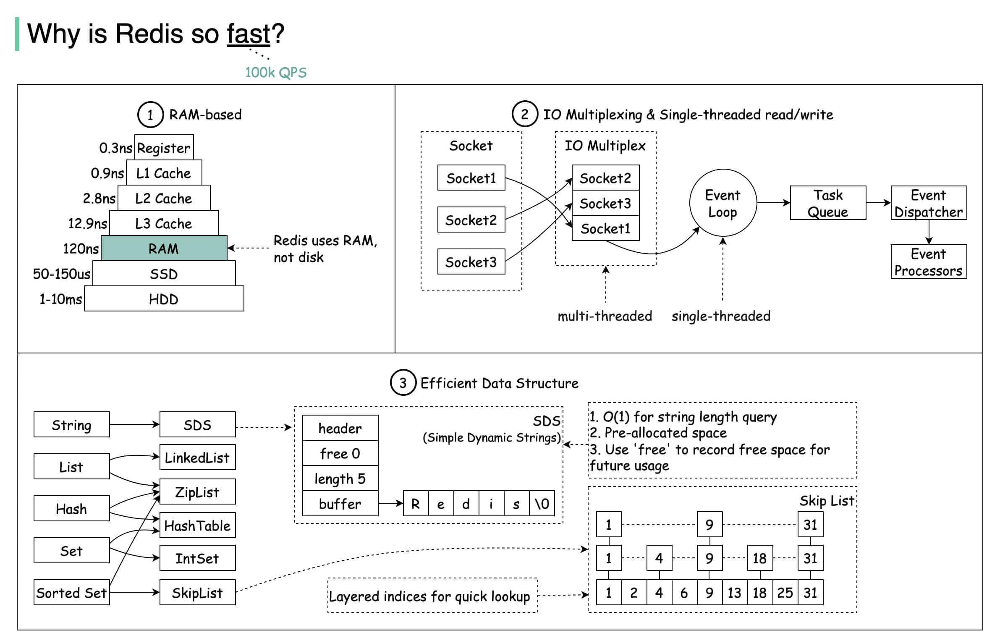

2. 它在 key-value 基础上，提供了以下数据结构：字符串、哈希、列表、集合、有序集合、位图（Bitmaps）、HyperLogLog，GEO（地理信息定位）等等

3. 提供了许多额外的功能

   1. 提供了键过期功能，可以用来实现缓存。
   2. 提供了基本的发布订阅功能，可以用来实现简单的消息系统。
   3. 提供了简单的事务功能，能在一定程度上保证事务特性。
   4. 提供了流水线（Pipeline）功能，这样客户端能将一批命令一次性传到 Redis，减少了网络的开销。

4. 简单稳定，Redis 的简单主要表现在三个方面：

   1. Redis 的源码行数在 4 万行左右
   2. 使用单线程模型
   3. 只依赖 C 语言提供的标准库

5. 提供了两种持久化方式：RDB 和 AOF

6. 主从复制

7. Redis Sentine 能够保证「故障发现」和「故障自动转移」

8. 提供了 Redis 分布式实现 —— Redis Cluster 

在 Redis 中，Key 的类型都是 String，而 value 可以是二进制数据，也可以是字符串，甚至是 Map 等等。

**由于内存的特性，Redis适用于小规模、热点数据集。**Redis 作为缓存层，MySQL 作为存储层，Redis 缓存起到「加速读写」和「降低后端压力」的作用。最根本的作用是「降低 IO 开销」。

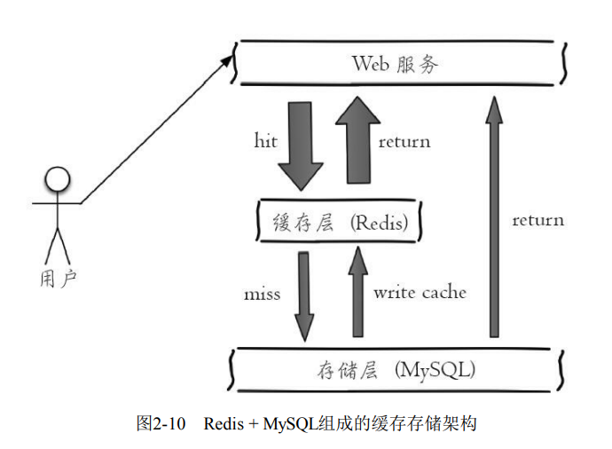

作为缓存层时，推荐将 Key 命名为`业务名:对象名:id:[属性]`。例如 MySQL 的数据库名为 vs，用户表名为 user，那么对应的键可以用`vs:ser:1`或者`vs:user:1:name`来表示。

## 安装

~~~shell
$ wget http://download.redis.io/releases/redis-3.0.7.tar.gz
$ tar xzf redis-3.0.7.tar.gz
$ ln -s redis-3.0.7 redis
$ cd redis
$ make
$ make test
$ make install # 它将 Redis 的相关运行文件放到 /usr/local/bin 下，这样就可以在任意目录下执行 Redis 的命令
~~~

**真正的 Redis 数据库操作发生在 RedisServer 中，而 RedisClient 仅仅负责与 RedisServer 进行通信，发送命令而已。**通过 redis-server 命令来启动 Redis 服务端：

~~~shell
$ redis-server
~~~

Redis 服务端的默认端口是 6379，可以通过 `--port` 来指定端口。`redis-server`默认会读取`Redis`安装根目录下的`redis.conf`配置文件。如果想要使用其他配置文件，那么输入以下命令：

~~~shell
$ redis-server /opt/redis/redis.conf
~~~

注意， redis-server 默认会忽略掉 SIGHUP 信号，也就是说即使退出终端，Redis 也会在后台运行。

推荐通过 apt 来安装 redis：

~~~shell
apt-get install redis
~~~

此时，配置文件在 `/etc/redis/redis.conf`，而 service 文件在 `/lib/systemd/system/redis-server.service`中。

Redis 支持动态修改部分参数，

~~~shell
config set requirepass 'password'   #
config set masterauth 'password'	
config rewrite						#  刷新配置
~~~

通过`redis-cli`命令来启动 Redis 客户端：

- 交互式方式。通过`redis-cli -h {host}-p{port}`的方式连接到Redis 服务，之后所有的操作都是通过交互的方式实现，不需要每次都输入redis-cli
- 命令方式用`redis-cli  ip -h {host} -p{port} {command}`就可以直接得到命令的返回结果

注意，如果没有 `-h` 参数，那么默认连接 127.0.0.1；如果没有 -p ，那么默认 6379 端口。 `-a` 指定密码

客户端通过 shutdown 命令来断开与 Redis 服务端的连接：

~~~shell
$ redis-cli shutdown
~~~

不建议使用用`kill-9`强制结束 Redis 服务端。因为这种方式不仅不会做持久化操作，还会造成缓冲区等资源不能被优雅关闭，极端情况下会造成 AOF 和复制丢失数据的情况。

## 原理初步

Redis使用了「**单线程架构**」和「**I/O多路复用模型**」来实现高性能的内存数据库服务。需要强调的是，Redis 只有CPU 计算部分是单线程模型，而对磁盘、网络的访问是多线程模型。

Redis 为什么采用单线程模型：

- Redis 性能瓶颈在 IO 上，而不是在 CPU 上。而且服务器的体系架构一般是多核共享一块内存（MCU）。此时多线程技术并不能提高 CPU 访问内存的效率。如果是多个 MCU 架构的处理器，那么 Redis 在 CPU 利用率上有很大的提升空间。
- 单线程避免了线程切换和竞争条件所产生的消耗。

但是单线程对响应时间来说，是不友好的。例如一条命令的执行时间过长，那么就会阻塞其他命令的执行。

## 字符串

- **创建一个字符串**

  ~~~shell
  $ set key value [ex seconds] [px milliseconds] [nx|xx]
  ~~~

  set  命令有几个选项：

  - `ex seconds`：为键设置秒级过期时间。
  - `px milliseconds`：为键设置毫秒级过期时间。
  - `nx`：键必须不存在，才可以设置成功
  - `xx`：与 nx 相反，键必须存在，才可以设置成功，用于更新。

  除了 set 命令，Redis 还提供了 setex 和 setnx 两个命令，它们的作用和 ex 和 nx 选项是一样的。

  ~~~shell
  $ setex key seconds value
  $ setnx key value
  ~~~

  由于 Redis 的单线程命令处理机制，如果有多个客户端同时执行 setnx key value， 根据 setnx 的特性只有一个客户端能设置成功，setnx 可以作为分布式锁的一种实现方案，Redis 官方给出了使用 setnx 实现分布式锁的方法：http://redis.io/topics/distlock。

- **获取值**

  ~~~shell
  $ get key
  ~~~

- **批量设置值**

  ~~~shell
  $ mset key value [key value ...]
  ~~~

- **批量获取值**

  ~~~shell
  $ mget key [key ...]
  ~~~

  批量操作可以减少客户端与服务端进行网络通信的次数，但是批量操作可能会在服务端阻塞其他命令的执行

- **自增操作**

  ~~~shell
  $ incr key
  ~~~

  incr 命令用于对值做自增操作，返回结果分为三种情况：

  - 值不是整数，返回错误。(error) ERR value is not an integer or out of range

  - 值是整数，返回自增后的结果。

  - 键不存在，按照值从 0 开始自增。下面的 qwe 键是不存在的

    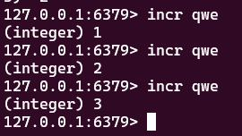

  除了 incr 命令，Redis提供了decr（自减）、incrby（自增指定数字）、 decrby（自减指定数字）、incrbyfloat（自增浮点数）

- **向字符串尾部追加值**

  ~~~shell
  $ append key value
  ~~~

- **获取字符串长度**

  ~~~shell
  $ strlen key
  ~~~

- **设置并返回原值**

  ~~~shell
  $ getset key value
  ~~~

- **设置指定位置的字符**

  ~~~shell
  $ setrange key offeset value
  ~~~

  偏移量从 0 开始计算

  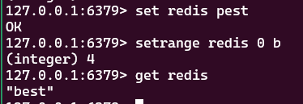
  
- **获取子串**

  ~~~shell
  $ getrange key start end
  ~~~

  start 和 end 分别是开始和结束的偏移量，偏移量从 0 开始计算

字符串命令的时间复杂度基本是是$\Omicron(1)$的，批量操作的时间复杂度是$\Omicron(k)$，其中$k$是键的个数。而`getrange`的时间复杂度是$\Omicron(n)$，其中$n$是子串的长度

## 哈希

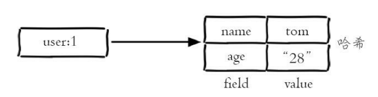

- **设置值**

  ~~~shell
  $ hset key field value
  ~~~

- **获取值**

  ~~~shell
  $ hget key field
  ~~~

  如果键或 field 不存在，会返回 nil

- **删除 field**
- 
  ~~~shell
  hdel key field [field...]
  ~~~

  返回结果为成功删除field的个数。

- **计算 field 个数**

  ~~~shell
  $ hlen key
  ~~~

- **批量设置或获取 field-value**

  ~~~shell
  $ hmget key field [field ...]
  $ hmset key field value [field value ...]
  ~~~

- **判断 field/key 是否存在**

  ~~~shell
  $ hexists key field
  ~~~

- **获取所有 field**

  ~~~shell
  $ hkeys key
  ~~~

- **获取所有 value**

  ~~~shell
  $ hvals key
  ~~~

  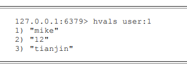

- **获取所有的 field-value**

  ~~~shell
  $ hgetall key
  ~~~

  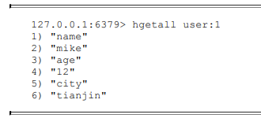

- **增加操作**，增加键所对应的值

  ~~~shell
  $ hincrby key field increnment_value
  $ hincrbyfloat key field increnment_value
  ~~~

  如果值的类型不符合条件，那么(error) ERR hash value is not an integer

- **计算 value 的字符串长度**

  ~~~shell
  $ hstrlen key field
  ~~~

 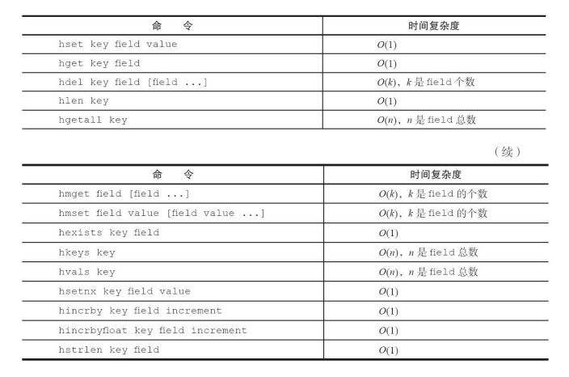

我们可以使用**「哈希类型」**来缓存**「关系型数据库表」**。

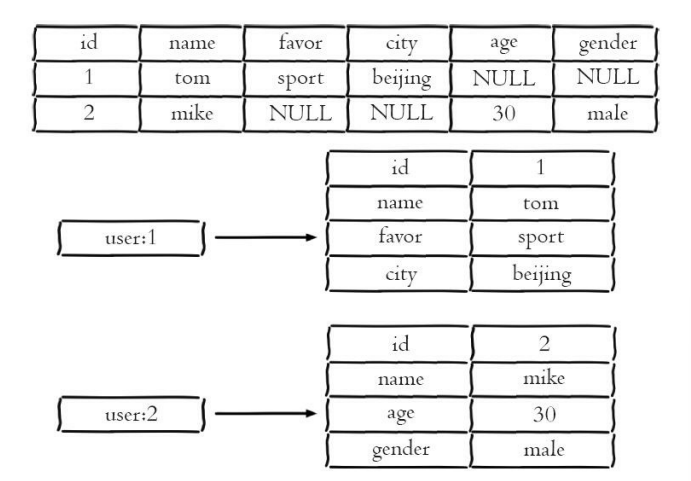

注意，Redis 中的哈希可以不存储表中值为 NULL 的属性，这种特性称为**稀疏性**。

此外，还有两种方法来缓存关系型数据库表（都不推荐使用）

- **原生字符串类型**：为每一个属性设置一个键

  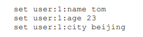

  这样简单直观，而但是数据内聚性比较差

- **序列化字符串类型**：用一个键来保存序列化后的数据。

  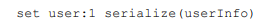

  序列化和反序列化有一定的开销，同时每次更新属性都需要把全 部数据取出进行反序列化，更新后再序列化到Redis中。

像 json 这样的数据可以使用 hash 结构，而不是作为一个字符串整体来存储。

## 列表

列表（list）类型是用来存储多个有序的字符。在 Redis 中，可以对列表两端插入（push）和弹出（pop），而且列表中的元素可以是重复的。

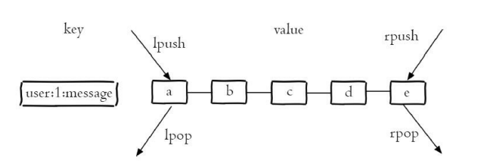

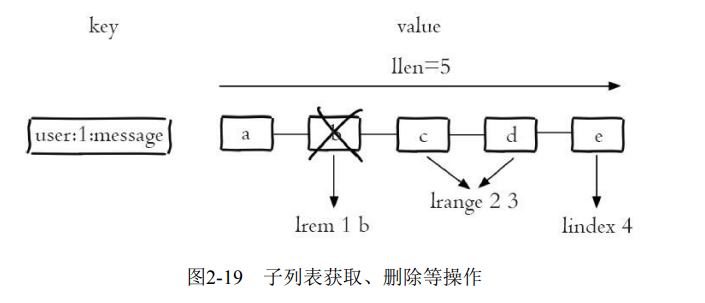

- **从右边插入元素**：

  ~~~shell
  $ rpush key value [value ...]
  ~~~

  返回成功插入的元素个数。

- **范围获取元素**：

  ~~~shell
  $ lrange key start end
  ~~~

  索引下标从左到右分别是 0 到 N-1，但是从右到左分别是 -1 到 -N。而且查询区间是**「左闭右闭」**的，这和大部分编程语言左闭右开的约定不同。

  lrange 命令在列表两端性能较好，但是如果列表较大，获取列表中间范围的元素性能会变差。此时可以使用 Redis3.2 的 quicklist 内部编码实现， 它结合 ziplist 和 linkedlist 的特点，可以高效完成获取「列表中间范围元素」的操作。

- **向某个元素前或者后插入元素**：

  ~~~shell
  $ linsert key before|after pivot value
  ~~~

  这里的`privot`就是元素值，而 value 是新插入的元素值。如果在同一个列表中有多个相同的元素，`LINSERT`指令只会在找到的第一个匹配的元素`pivot`的前面或后面进行插入。

- **获取列表指定索引下标的元素**

  ~~~shell
  $ lindex key index
  ~~~

- **获取列表长度**

  ~~~shell
  $ llen key
  ~~~

- **从列表左侧弹出元素**

  ~~~shell
  $ lpop key
  ~~~

- **删除指定元素**

  ~~~shell
  $ lrem key count value
  ~~~

  lrem 命令会从列表中找到等于 value 的元素进行删除，根据 count 的不同分为三种情况： 

  - `count>0`，从左到右，删除最多`count`个元素。 
  - `count<0`，从右到左，删除最多`count`绝对值个元素。 
  - `count=0`，删除所有。

- **按照索引范围保留列表**

  ~~~shell
  $ ltrim key start end
  ~~~

- **修改指定索引下标的元素：**

  ~~~shell
  $ lset key index newValue
  ~~~

- **阻塞操作**

  ~~~shell
  $ blpop key [key ...] timeout
  $ brpop key [key ...] timeout
  ~~~

  - 如果是多个键，那么 brpop 会从左至右遍历键，一旦有一个键能弹出元素，客户端立即返回。这包括 brpop 被阻塞的情况。
  - 如果多个客户端对同一个键执行 brpop，那么最先执行 brpop 命令的客户端可以获取到弹出的值。
  - `timeout`：这是阻塞时间的上限

  注意，这里的阻塞是指网络上的阻塞，而不是单线程中计算部分的阻塞。如果`timeout`为 0，那么在弹出失败后则无限期等待。

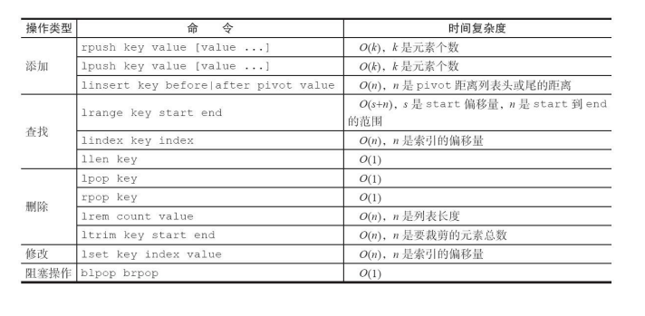

列表命令的常用用法：

- lpush + lpop = Stack（栈） 

- lpush + rpop = Queue（队列） 

- lpush + ltrim = Capped Collection（有限队列） 

  ~~~redis
  PUSH mylist "newValue"
  LTRIM mylist 0 99
  ~~~

  在这个例子中，`mylist`的长度被保持在100个元素。当添加新元素时，最旧的元素（在列表的右端）会被自动删除。

- lpush + brpop = Message Queue（消息队列）

Redis的 `lpush+brpop `命令组合即可实现阻塞队列，生产者客户端使用`lrpush`从列表左侧插入元素，多个消费者客户端使用`brpop`命令阻塞式地「抢」列表尾部的元素，

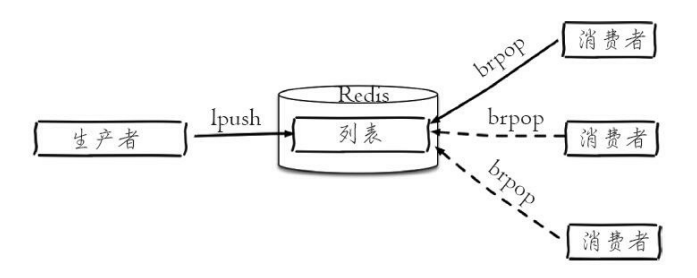

## 集合

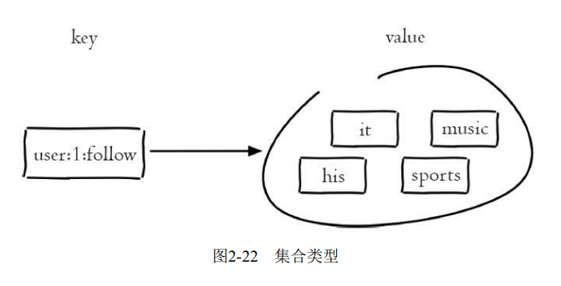

集合不支持重复元素，而且不支持列表的下标查询操作。

- **添加元素**

  ~~~shell
  $ sadd key element [element ...]
  ~~~

  返回结果为添加成功的元素个数。

- **删除元素**

  ~~~shell
  $ srem key element [element ...]
  ~~~

- **计算元素个数**

  ~~~shell
  $ scard key
  ~~~

  scard 的时间复杂度为$\Omicron(1)$，它不会遍历集合所有元素，而是直接用 Redis内部的变量

- **判断元素是否在集合中**

  ~~~shell
  $ sismember key element
  ~~~

  如果给定元素 element 在集合内返回 1，反之返回 0

- **随机从集合返回指定个数元素**

  ~~~shell
  $ srandmember key [count]
  ~~~

  [count] 是可选参数，如果不写默认为 1

- **从集合随机弹出元素**

  ~~~shell
  $ spop key
  ~~~

  spop 操作可以从集合中随机弹出一个元素

- **获取某个集合中所有的元素**

  ~~~shell
  $ smembers key
  ~~~

- **求多个集合的交集**

  ~~~shell
  $ sinter key [key ...]
  ~~~

- **求多个集合的并集**

  ~~~shell
  $ suinon key [key ...]
  ~~~

- **求多个集合的差集**

  ~~~shell
  $ sdiff key [key ...]
  ~~~

- **将交集、并集、差集的结果保存**

  ~~~shell
  $ sinterstore destination key [key ...]
  $ suionstore destination key [key ...]
  $ sdiffstore destination key [key ...]
  ~~~

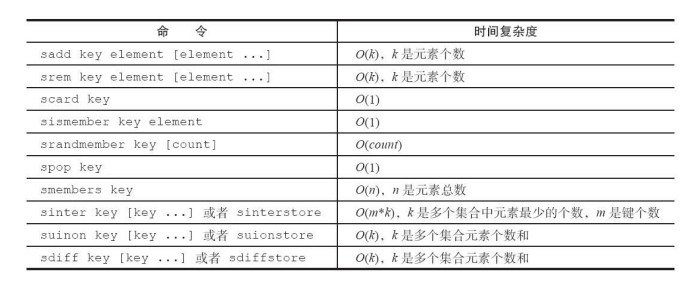

## 有序集合

它和普通集合一样不支持包含重复元素，但是它可以给每个元素设置一个**分数（score）**作为排序的依据。

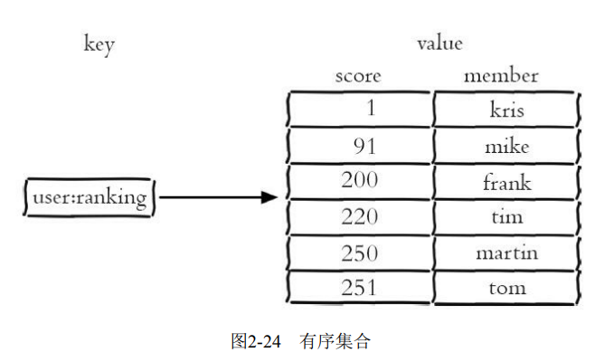

- **添加成员**

  ~~~shell
  zadd key score member [score member ...]
  ~~~

  返回结果代表成功添加成员的个数。

  Redis3.2 为 zadd 命令添加了 nx、xx、ch、incr 四个选项： 

  - nx：member 必须不存在，才可以设置成功，用于添加。 
  - xx：member 必须存在，才可以设置成功，用于更新。 
  - ch：返回此次操作后，有序集合元素和分数发生变化的个数 
  - incr：对 score 做增加，相当于后面介绍的 zincrby。

- **获取成员个数**

  ~~~shell
  $ zcard key
  ~~~

- **获取某个成员的分数**

  ~~~shell
  $ zscore key member
  ~~~

  如果成员不存在则返回 nil

- **获取成员的排名**

  ~~~shell
  $ zrank key member
  $ zrevrank key member
  ~~~

  zrank 是从分数从低到高返回排名，zrevrank 反之。排名从 0 开始计算

- **删除成员**

  ~~~shell
  $ zrem key member [member ...]
  ~~~

- **增加成员的分数**

  ~~~shell
  $ zincrby key increment member
  ~~~

  increment 是一个整数值

- **返回指定排名范围的成员**

  ~~~shell
  $ zrange key start end [withscores]
  $ zrevrange key start end [withscores]
  ~~~

  如果加上`withscores`选项，则会返回成员的分数。

- **返回指定分数范围的成员**

  ~~~shell
  $ zrangebyscore key min max [withscores] [limit offset count]
  $ zrevrangebyscore key max min [withscores] [limit offset count]
  ~~~

  `[limit offset count]`选项可以限制输出的起始位置和个数：

  同时，min 和 max 还支持

  - 开区间（小括号）和闭区间（中括号）
  - -inf 和 +inf 分别代表无限小和无限大：

- **返回指定分数范围成员个数**：

  ~~~shell
  $ zcount key min max
  ~~~

- **删除指定排名内的升序元素**

  ~~~shell
  $ zremrangebyrank key start end
  ~~~

- **删除指定分数范围的成员**:

  ~~~shell
  $zremrangebyscore key min max
  ~~~

- **获取交集**

  ~~~ shell
  $ zinterstore destination numkeys key [key ...] [weights weight [weight ...]] [aggregate sum|min|max]
  ~~~

  - destination：交集计算结果保存到这个键。
  - numkeys：需要做交集计算键的个数。
  - key[key...]：需要做交集计算的键
  - weights weight[weight...]：每个键的权重，在做交集计算时，每个键中 的每个member会将自己分数乘以这个权重，每个键的权重默认是1。
  - 计算成员交集后，分值可以按照sum（和）、 min（最小值）、max（最大值）做汇总，默认值是sum

- **获取并集**

  ~~~shell
  $ zunionstore destination numkeys key [key ...] [weights weight [weight ...]]
  [aggregate sum|min|max]
  ~~~

  

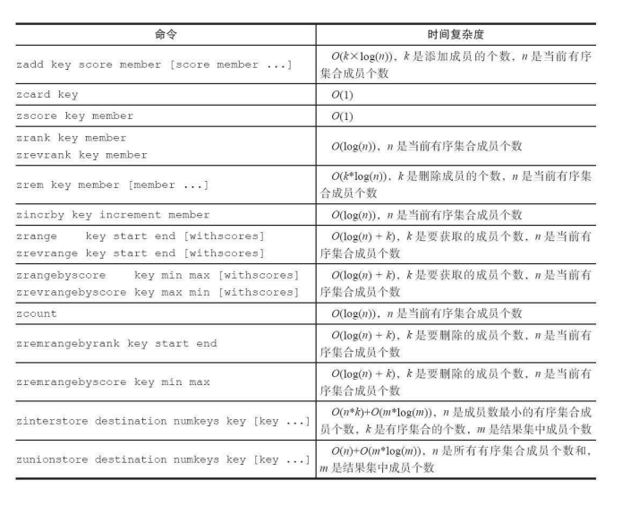

## 键管理

前面已经介绍过一些重要命令了，例如：type、del、object、exists、expire

- **键重命名**

  ~~~shell
  $ rename key newkey
  ~~~

  如果键重命名为一个已有名字的键，那么就会覆盖该值。为了防止被强行 rename，Redis提供了`renamenx`命令，确保只有 newKey 不存在时候才被覆盖

- **随机返回一个键**

  ~~~shell
  $ randomkey
  ~~~

- **查看所有键**

  ~~~shell
  $ keys *
  ~~~

- **获取键总数**，dbsize 命令会返回当前数据库中键的总数，时间复杂度为`O(1)`。而 keys 命令会遍历所有键，所以它的时间复杂度是 `O(n)`

  ~~~shell
  $ dbsize
  ~~~

- **检查键是否存在**

  ~~~shell
  exists key
  ~~~

  如果键存在则返回 1，否则返回 0

- **删除键**

  ~~~shell
  $ del key [key ...]
  ~~~

  返回结果为成功删除键的个数

- **键过期**，Redis 支持对键添加过期时间，当超过过期时间后，会自动删除键。

  ~~~shell
  $ expire key seconds
  ~~~

- **查看过期时间**

  ~~~shell
  $ ttl hello
  ~~~

  `ttl` 命令会返回键的剩余过期时间，它有 3 种返回值： 

  - `>0`：键剩余的过期时间。 

  - `-1`：键没设置过期时间。 

  - `-2`：键不存在

- **查看键的数据结构类型**

  ~~~shell
  $ type key
  ~~~

  如果键不存在，则返回 none

- **查看键的内部编码**：

  ~~~shell
  $ object encoding mylist
  ~~~

  每个键的数据结构类型都由各自的内部编码实现。这些不同的内部编码为了就是应对不同的负载场景，而且修改内部编码，而对外的数据结构和命令没有影响。

### 过期时间

除了 expire、ttl 命令以外，Redis 还提供了 expireat、pexpire、pexpireat、pttl、persist 等一系列命令来处理键值对的过期时间。

ttl 命令和 pttl 都可以查询键的剩余过期时间，但是 pttl 精度更高可以达到毫秒级别，有3种返回值： 

- 大于等于 0 的整数：键剩余的过期时间（ttl是秒，pttl是毫秒）。 
- -1：键没有设置过期时间。 
- -2：键不存在。

expireat 命令可以设置键的**秒级过期时间戳**，例如如果需要将键 hello 在 2016-08-0100：00：00（秒级时间戳为1469980800）过期，可以执行如下操作：

~~~shell
$ expireat hello 1469980800
~~~

如果过期时间为负值，键会立即被删除，犹如使用 del 命令一样。除此之外，Redis2.6 版本后提供了毫秒级的过期方案： 

- `pexpire key milliseconds`：键在 milliseconds 毫秒后过期。 
- `pexpireat key milliseconds-timestamp`：键在毫秒级时间戳 timestamp 后过期。

但无论是使用过期时间还是时间戳，秒级还是毫秒级，在 Redis 内部最终使用的都是 `pexpireat`。`PERSIST`命令用来移除给定 key 的过期时间，使得 key 永不过期。

对于字符串类型键，执行 set 命令会移除过期时间。但是对于`LPUSH` (List)、 `SADD` (Set)、 `ZADD` (Sorted Set) 或者 `HSET` (Hash) ，这些操作不会影响键的过期时间。

如下是 Redis 源码中，set 命令的函数 setKey，可以看到最后执行了 removeExpire（db，key）函数去掉了过期时间：

~~~c
void setKey(redisDb *db, robj *key, robj *val) {
    if (lookupKeyWrite(db,key) == NULL) {
    	dbAdd(db,key,val);
    } else {
    	dbOverwrite(db,key,val);
    }
    incrRefCount(val);
    // 去掉过期时间
    removeExpire(db,key);
    signalModifiedKey(db,key);
}
~~~

### 迁移

有时候我们只想把部分数据由一个 Redis 迁移到另一个 Redis（例如从生产环境迁移到测试环境）。Redis 提供了 move、dump+restore、migrate 三组迁移键的方法：

- **move**

  ~~~shell
  $ move key db
  ~~~

  Redis 内部可以有多个数据库，该命令正是在这些数据库中进行迁移。move key db 就是把指定的键从源数据库移动到目标数据库中。

- **dump + restore**

  dump + restore 可以实现在不同的 Redis 服务器实例之间，进行数据迁移的功能，整个迁移的过程分为两步：
  
  1. 在源 Redis 上，dump 命令会将键值序列化，格式采用的是 RDB 格式。
  
     ~~~shell
     $ set hello world
     # OK
     $ dump hello
     # "\x00\x05world\x06\x00\x8f<T\x04%\xfcNQ"
     ~~~
  
  2. 在目标 Redis 上，`restore key ttl value` 命令将上面序列化的值进行复原，其中 ttl 参数代表过期时间，如果 ttl=0 代表没有过期时间。value 就是 RDB 结果
  
     ~~~shell
     $ get hello
     # (nil)
     $ restore hello 0 "\x00\x05world\x06\x00\x8f<T\x04%\xfcNQ"
     # OK
     $ get hello
     # "world"
     ~~~
  
  整个迁移过程并非原子性的，而是通过客户端分步完成的。
  
- **migrate**：实现过程和 dump + restore 基本类似，但整个过程是原子执行的
  
  ~~~shell
  $ migrate host port key|"" destination-db timeout [copy] [replace] [keys key [key
  ~~~
  
  - `host`：目标 Redis 的 IP 地址
  - `port`：目标 Redis 的端口
  - `key|""`：在 Redis3.0.6 版本之前，migrate 只支持迁移一个键，所以此处是要迁移的键，但 Redis3.0.6版本之后支持迁移多个键，如果当前需要迁移多个键，此处为空字符串""
  - `destination-db`：目标 Redis 的数据库索引，例如要迁移到 0 号数据库，这里就写 0
  - `timeout`：迁移的超时时间
  - `[copy]`：如果添加此选项，迁移后并不删除源键
  - `[replace]`：如果添加此选项，migrate 不管目标 Redis 是否存在该键，都会正常迁移进行数据覆盖。如果没有添加该选项，而且目标 Redis 有该键，那么就会返回错误提示。
  - `[keys key[key...]]`：迁移多个键，例如要迁移 key1、key2、key3，此处填 写“keys key1 key2 key3”

### 遍历键

**全量遍历键**

~~~shell
$ keys pattern
~~~

其中，`pattern`是`glob`风格的通配符

- `*` 代表匹配任意字符
- `?`  代表匹配一个字符
- `[]` 代表匹配部分字符
- \x用来做转义，例如要匹配星号、问号需要进行转义

想删除所有以 video 字符串开头的键，可以 执行如下操作：

~~~shell
$ redis-cli keys video* | xargs redis-cli del
~~~

如果 Redis 包含了大量的键，执行 keys 命令很可能会造成 Redis 阻塞，所以一般建议不要在生产环境下使用 keys 命令。如果确实又该需求该怎么办？

- 使用 scan 命令，渐进式遍历所有键
- 在一个不对外提供服务的 Redis 从节点上执行，这样不会阻塞到客户端的请求，但是会影响到主从复制。

scan 采用渐进式遍历的方式来解决 keys 命令可能带来的阻塞问题，每次 scan 命令的时间复杂度是$\Omicron(1)$。但是要真正实现 keys 的功能，需要执行多次 scan。

~~~shell
$ scan cursor [match pattern] [count number]
~~~

- cursor 是必需参数，实际上 cursor 是一个游标。第一次遍历从 0 开始，每次 scan 遍历完都会返回当前游标的值，直到游标值为 0，表示遍历结束。游标值并不与 key 的个数对应。

  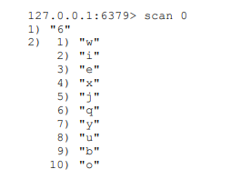

  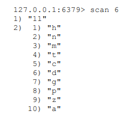

  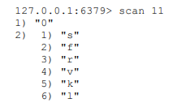

- match pattern 类似 keys 命令的 pattern

- count number 是可选参数，它的作用是表明每次要遍历的键个数，默认值是 10

除了 scan 以外，Redis 提供了面向哈希类型、集合类型、有序集合的扫描遍历命令，解决诸如`hgetall`、`smembers`、`zrange`可能产生的阻塞问题，对应的命令分别是`hscan`、`sscan`、`zscan`

如果在多次 scan 的过程中如果有键的变化（增加、删除、修改），那么这些变化可能被 scan 忽略掉。也就是说 scan 并不能保证完整的遍历出来所有的键，这些是我们在开发时需要考虑的。

### 数据库管理

**切换数据库**

~~~shell
$ select dbIndex
~~~

Redis 默认配置中是有 16 个数据库，客户端默认使用 0 号数据库。我们很自然地想将生产环境中的数据放在 0 号数据库，测试环境中的数据放在 1 号数据库？但是这样做真的欠妥吗？

Redis3.0 中已经逐渐弱化这个功能，例如 Redis 的分布式实现 Redis Cluster 只允许使用 0 号数据库，只不过为了向下兼容老版本的数据库功能， 该功能没有完全废弃掉。

- Redis是单线程的。如果使用多个数据库，那么这些数据库仍然是使用一个CPU，彼此之间还是会受到影响的。
-  假如有一个慢查询存在，依然会影响其他数据库，这样会使得别的业务方定位问题非常的困难。

如果要使用多个数据库功能，完全可以在一台机器上部署多个 Redis 实例，彼此用端口来做区分，因为现代计算机或者服务器通常是有多个 CPU 的。这样既保证了业务之间不会受到影响，又合理地使用了 CPU 资源。

flushdb/flushall 命令用于清除数据库，两者的区别的是 flushdb 只清除当前数据库，flushall 会清除所有数据库。

## 慢查询分析

Redis 提供了慢查询分析功能，所谓慢查询日志就是系统在命令执行前后计算每条命令的执行时间，当超过预设阀值，就将这条命令的相关信息记录下来。

在 Redis 中，慢查询记录有 4 个属性组成，分别是

- 慢查询日志的标识 id
- 发生时间戳
- 命令耗时
- 所执行的命令。

Redis 客户端执行一条命令分为如下 4 个部分：发送命令、排队、执行命令、返回结果

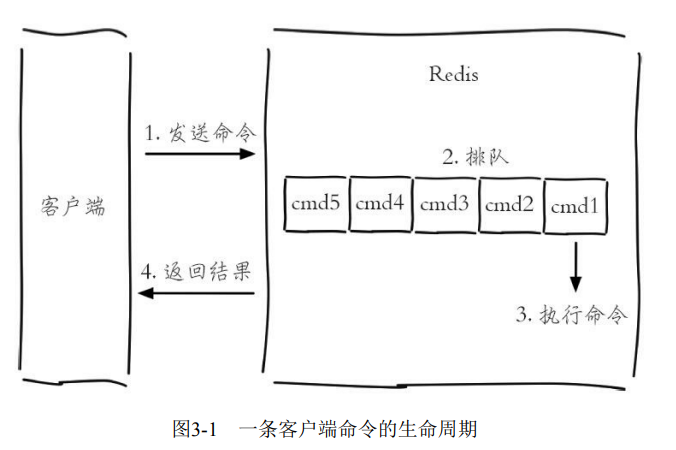

注意，慢查询只统计步骤3）的时间。也就是说，慢查询只记录命令执行时间，并不包括命令排队和网络传输时间。

`slowlog-log-slower-than`预设阀值，单位为微秒，默认值是 10000（10ms）。`slowlog-log-slower-than=0`会记录所有的命令，`slowlog-log-slowerthan<0`对于任何命令都不会进行记录。

`slowlog-max-len`说明了慢查询日志最多存储多少条。

在 Redis 中有两种修改配置的方法

- 修改配置文件

- `config set`命令动态修改

  ~~~shell
  $ config set slowlog-log-slower-than 20000
  $ config set slowlog-max-len 1000
  $ config rewrite
  ~~~

  如果要`Redis`将配置持久化到本地配置文件，需要执行`config rewrite`命令

**获取慢查询日志**

~~~shell
$ slowlog get [n]
~~~

可选参数`n`可以指定条数

**获取慢查询日志列表当前的长度**

~~~shell
$ slowlog len
~~~

**慢查询日志重置**

~~~shell
$ slowlog reset
~~~

慢查询日志并不会永久保存，当 Redis 服务器重启时，慢查询日志会被清空。

## Redis Shell

### 客户端

- `-r`（repeat）选项代表将命令执行多次

  ~~~shell
  $ redis-cli -r 3 ping
  ~~~

- `-i`（interval）选项代表每隔几秒执行一次命令，必须配合`-r`选项使用

  ~~~shell
  $ redis-cli -r 5 -i 1 ping
  ~~~

  注意 -i 的单位是秒，是如果想以每隔10毫秒执行 一次，可以用`-i 0.01`

- `-x`选项表示从标准输入（stdin）中所读取的数据作为redis-cli的最后一个参数

  ~~~shell
  $ echo "world" | redis-cli -x set hello
  ~~~

- `-c`（cluster）选项是连接Redis Cluster节点时需要使用的，以后再介绍

- `-a`（auth）选项用于输入密码（如果有的话）

- `--slave`选项指定当前Redis客户端为从节点

- `--rdb`选项与持久化有关，以后再介绍

- `--pipe`选项发送批量命令

- `--bigkeys`选项，使用scan命令对Redis的键进行采样，从中找到内存占用比较大的键值

- `--eval`选项，用于执行指定Lua脚本

- `--latency`选项，用于检测网络延迟

  - `--latency`：该选项可以测试客户端到目标Redis的网络延迟

    ~~~shell
    $ redis-cli -h {machineB} --latency
    ~~~

    

  - `--latency-history`：周期性地（默认每15秒）测试从Redis服务器接收到回应的延迟

    ~~~shell
    $ redis-cli -h 10.10.xx.xx --latency-history
    min: 0, max: 1, avg: 0.28 (1330 samples) -- 15.01 seconds range…
    min: 0, max: 1, avg: 0.05 (1364 samples) -- 15.01 seconds range
    
    ~~~

    延时信息默认每15秒输出一次，可以通过-i参数控制间隔时间。

  - `--latency-dist`,使用统计图表的形式从控制台输出延迟统计信息。
  
- `--stat`选项，可以实时获取Redis的重要统计信息

  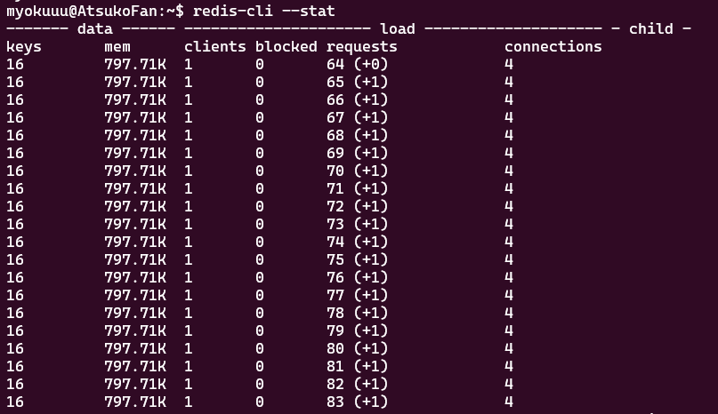

- `--raw`返回原始格式

  可以看到如果正常执行get或者使用--no-raw选项，那么返回的结果是二进制格 式

  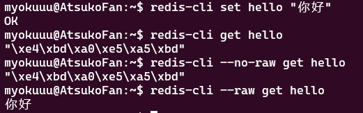

### 服务端

`redis-server`还有一个`--test-memory`选项，用来检测当前操作系统能否稳定地分配指定容量的内存给 Redis

~~~shell
$ redis-server --test-memory 1024
# 检测当前操作系统能否提供1G的内存给Redis
~~~

整个内存检测的时间比较长。当输出`passed this test`时说明内存检测完毕。

### 性能测试

`redis-benchmark`可以为 Redis 做基准性能测试

- `-c`（clients）选项代表客户端的并发数量（默认是50）

- `-n`（num）选项代表客户端请求总量（默认是100000）

  `redis-benchmark -c 100 -n 20000`代表100个客户端同时请求Redis，每个客户端请求20000次。

- `-q`选项表示仅显示 redis-benchmark 的 requests per second 信息

- -r，表示使用随机key数量。

## Pipeline

Redis 提供了几条批量操作命令（例如 mget、mset 等），但是大部分命令是不支持批量操作的。好在我们可以通过 `redis-cli --pipe` 来解决这个问题

~~~shell
# 这里的格式为 RESP
$ echo -en '*3\r\n$3\r\nSET\r\n$5\r\nhello\r\n$5\r\nworld\r\n*2\r\n$4\r\nincr\r\
n$7\r\ncounter\r\n' | redis-cli --pipe
~~~

我们之后介绍如何通过 Java 的 Redis 客户端 Jedis 来使用 Pipeline 功能。

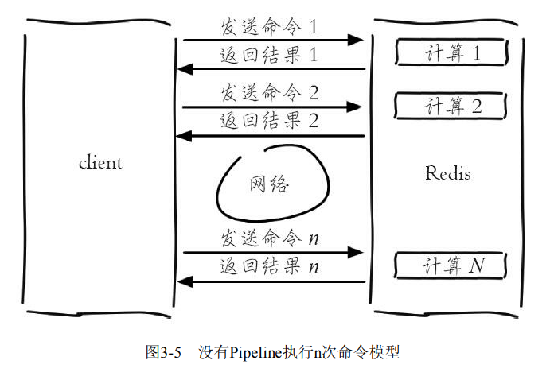

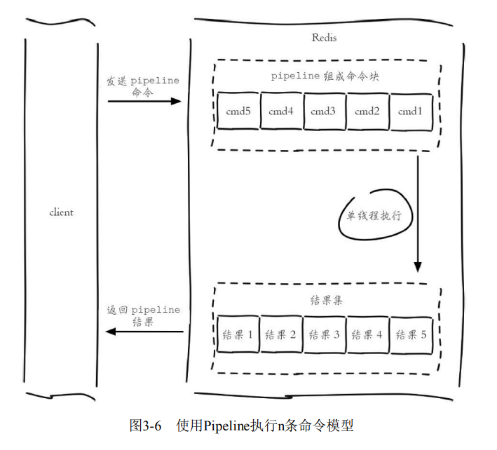

Pipeline 和原生批量命令（mset）还是有所区别的，即原生批量命令是原子的，Pipeline 是非原子的。

## 事务与 Lua

为了保证多条命令组合的原子性，Redis 提供了简单的事务功能以及集成 Lua 脚本来解决这个问题。

Redis 提供了简单的事务功能，将一组需要一起执行的命令放到`multi`和`exec`两个命令之间。`multi`命令开始事务，命令首先放入事务队列中，当执行`exec`命令来提交事务时，此时才会真正**原子地**执行命令。

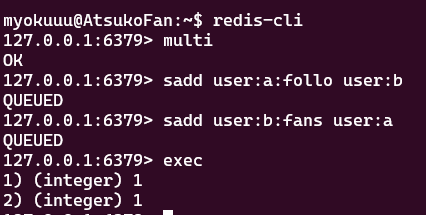

可以看到`sadd`命令此时的返回结果是`QUEUED`，代表命令并没有真正执行，而是暂时保存在 Redis 中，直到执行`exec`命令。以下几种情况会回滚事务

- **命令错误**（语法错误），例如将`set`写成了`sett`，此时会回滚整个事务（不会执行到 exec 命令的）。

- 使用`discard`命令主动回滚事务

- 但是对于运行时错误并不会触发回滚，这是因为命令是在执行 exec 提交事务命令之后才开始执行的。例如对集合使用`zadd`命令

  

有些应用场景需要在提交事务之前，确保事务中的 key 没有被其他客户端修改过，才执行事务，否则不执行（类似乐观锁）。Redis提供了`watch`命令来解决这类问题。当你使用`WATCH`命令监视一个或多个 key 后，如果在提交事务之前，被监视的 key 被其他命令改动，那么事务将被打断，`EXEC`命令会返回`nil`，意味着事务执行失败。

Lua 语言是在 1993 年由巴西一个大学研究小组发明，其设计目标是作为嵌入式程序移植到其他应用程序，它是由 C 语言实现的。它的应用场景如下：

- 暴雪公司将 Lua 语言引入到「魔兽世界」这款游戏中
- Web 服务器 Nginx 将Lua语言作为扩展

Lua 语言提供了如下几种数据类型：booleans（布尔）、numbers（数值）、strings（字符串）、tables（表格）

~~~lua
-- local 定义一个局部变量
local strings val = "world"

-- tables 类型可以模拟， 下标从1开始
local tables myArray = {"redis", "jedis", true, 88.0}
myArray[3]

-- 获取数组的长度
 #myArray

-- tables类型也可以模拟hash
local tables user_1 = {age = 28, name = "tome"}
print("user_1 age is " .. user_1["age"])
~~~

在Lua语言中，for语句有两种形式：数值 for 循环和范围 for 循环。

- **范围for循环**

  ~~~lua
  for var=start, stop, step do
    -- statements to be repeated
  end
  ~~~

  其中，`var` 为变量，`start` 是变量的初始值，`stop` 是变量的结束值，`step` 是变量的变化值。如果省略，则默认为1

- **范围for循环**

  ~~~lua
  -- myArray、user_1都是表
  for index,value in ipairs(myArray)
  do
      print(index)
      print(value)
  end
  
  for key, value in pairs(user_1)
  	-- .. 用于拼接字符串
  	do print(key .. value)
  end
  ~~~

**while语句**

~~~lua
local int sum = 0
local int i = 0
while i <= 100
do
    sum = sum +i
    i = i + 1
end
--输出结果为5050
~~~

`if else`语句

~~~lua
local tables myArray = {"redis", "jedis", true, 88.0}
for i = 1, #myArray
do
    if myArray[i] == "jedis"
    then
        print("true")
        break
    else
        --do nothing
    end
end
~~~

函数定义

~~~lua
function contact(str1, str2)
	return str1 .. str2
end

print(contact("hello ", "world"))
~~~

在 Redis 中执行 Lua 脚本有两种方法：

- `eval`：

  ~~~shell
  $eval 脚本内容 key个数 key列表 参数列表
  ~~~

  其中 key 列表传递给 KEYS[ ]，而参数列表传递给`VALUE[]`

  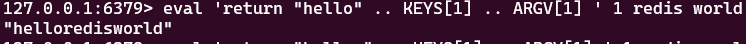

  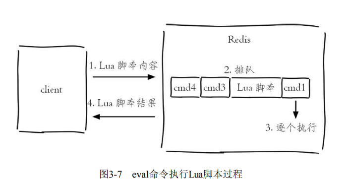

- `evalsha`：首先使用`script load`命令将脚本内容加载到 Redis 内存中，得到该脚本的 SHA1 校验和。

  ~~~shell
  $ redis-cli script load "$(cat lua_get.lua)"
  "7413dc2440db1fea7c0a0bde841fa68eefaf149c"
  ~~~
  
  然后执行 evalsha 命令，将 SHA1 作为参数直接执行对应 Lua 脚本，避免每次发送 Lua 脚本的开销
  
  ~~~shell
  $ evalsha 脚本SHA1值 key个数 key列表 参数列表
  ~~~
  
  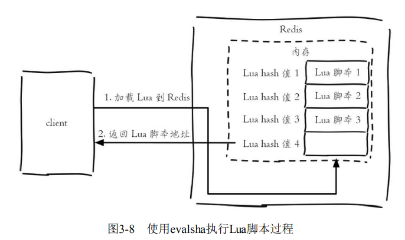
  
  

Lua 可以使用 redis.call 函数实现对 Redis 的访问

~~~lua
redis.call("set", "hello", "world")
redis.call("get", "hello")
~~~

- Lua 脚本在Redis中是原子执行的，执行过程中间不会插入其他命令
- Lua 脚本可以将多条命令一次性打包，有效地减少网络开销
- Lua 脚本可以帮助开发和运维人员创造出自己定制的命令

Redis 提供了4个命令实现对 Lua 脚本的管理

- **script load**：将 Lua 脚本加载到 Redis 内存中

- **script exists**：用于判断 sha1 是否已经加载到 Redis 内存中

  ~~~shell
  script exists a5260dd66ce02462c5b5231c727b3f7772c0bcc5
  ~~~

- **script flush**：用于清除所有在 Redis 内存中加载的 Lua 脚本

  ~~~shell
  script flush
  ~~~

- **script kill**：杀掉正在执行的Lua脚本

  Redis提供了一个 lua-time-limit 参数，默认是 5s 。当脚本运行时间超过参数预设的值后，Server 会向所有客户端发送 BUSY 信号，但是并不会终止脚本的执行。

  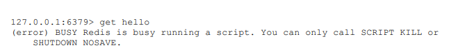

  此时在客户端使用`script kill`命令即可。如果当前 Lua 脚本正在执行写操作（调用Redis函数），那么 script kill 将不会生效。

## Bitmaps

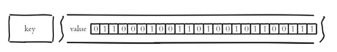

- **设置值**

  ~~~shell
  $ setbit key offset value
  
  # 例子，偏移量从0开始
  $ setbit unique:users:2016-04-05 0 1
  ~~~

- **获取值**

  ~~~shell
  $ gitbit key offset
  ~~~

- **获取 Bitmaps 指定范围值为 1 的个数**

  ~~~shell
  bitcount [start][end]
  ~~~

- 位运算

  ~~~shell
  $ bitop op destkey key[key....]
  ~~~

  op 可以取值为`and`、`or`、`not`、`xor`，并将计算结果保存在`destkey`中，`destkey`并不参与运算。

## HyperLogLog

HyperLogLog 是一种高性能基数统计的算法。在 Redis 里面，每个 HyperLogLog 键最多需要花费 12 KB 内存。基数估计的结果是一个带有 **0.81% 标准错误**（standard error）的近似值。

- `pfadd`用于向 HyperLogLog 添加元素，如果添加成功返回 1：

  ~~~shell
  $ pfadd key element [element …]
  
  # 例子
  $ pfadd 2016_03_06:unique:ids "uuid-1" "uuid-2" "uuid-3" "uuid-4"
  ~~~

- **计算独立用户数**

  ~~~shell
  $ pfcount key [key …]
  
  # 在这个例子中， PFCOUNT 命令会分别计算 key1 和 key2 的基数估计值，然后将这两个估计值相加，返回最后的结果。
  $ PFCOUNT key1 key2
  ~~~

- **合并**

  pfmerge 可以求出多个 HyperLogLog 的并集并赋值给 destkey

  ~~~shell
  $ pfmerge destkey sourcekey [sourcekey ...]
  ~~~

## 发布订阅

Redis提供了基于“发布/订阅”模式的消息机制。发布者客户端向指定的**频道（channel）**发布消息，订阅该频道的每个客户端都可以收到该消息。

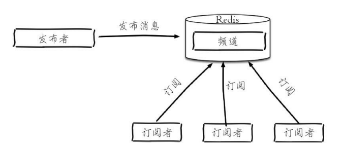

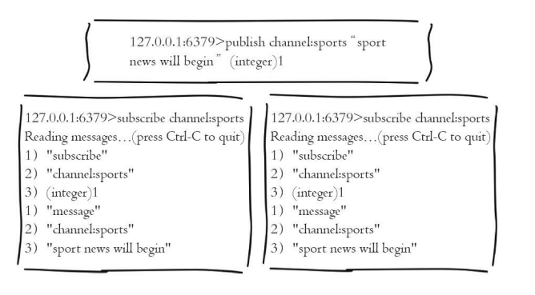

- **发布消息**

  ~~~shell
  $ publish channel message
  
  # 例子
  $ publish channel:sports "Tim won the championship"
  ~~~

- **订阅消息**

  ~~~shell
  $ subscribe channel [channel ...]
  
  # 例子
  $ subscribe channel:sports
  ~~~

  客户端在执行订阅命令之后进入了订阅状态，只能使用`subscribe`、 `psubscribe`、`unsubscribe`、`punsubscribe`的四个命令。

  UNSUBSCRIBE 命令的行为和 SUBSCRIBE 命令的行为正好相反，当一个客户端退订某个或某些频道的时候，服务器将从 pubsub_channels 中解除客户端与被退订频道之间的关联：

- **按照模式订阅和取消订阅**

  ~~~shell
  $ psubscribe pattern [pattern...]
  $ punsubscribe [pattern [pattern ...]]
  ~~~

  - 使用 punsubscribe 只能退订通过 psubscribe 命令订阅的规则，不会影响直接通过 subscribe 命令订阅的频道；
  - 同样 unsubscribe 命令也不会影响通过 psubscribe 命令订阅的规则。
  -  punsubscribe 命令退订规则时，不会将其中的通配符展开，而是对 pattern 进行严格的字符串匹配，匹配的对象是 psubscribe 订阅的 pattern，不是的具体的 channel 名。所以`punsubscribe *` 无法退订通过 psubscribe 订阅的`c*`规则，而是必须使用`punsubscribe c*`才可以退订。
  - 如果 punsubscribe 命令没有参数，则会退订所有规则。
  - 使用 psubscribe 命令可以重复订阅同一个频道，如客户端执行了`psubscribe c? c?*`。这时向 c1 发布消息客户端会接受到两条消息，而同时 publish 命令的返回值是 2 而不是 1 。

- **查看活跃的频道**

  ~~~shell
  $ pubsub channels [pattern]
  ~~~

- **查看频道订阅数**

  ~~~shell
  $ pubsub numsub [channel ...]
  ~~~

## GEO

Redis3.2版本提供了GEO（地理信息定位）功能，支持存储地理位置信息

- **设置键**

  ~~~shell
  $ geoadd key longitude latitude member [longitude latitude member ...]
  
  $ geoadd cities:locations 116.28 39.55 beijing
  ~~~

  `longitude`、`latitude`、`member`分别是该地理位置的经度、纬度、成员（对于该地点的一个标识）

- **获取地理位置信息**

  ~~~shell
  $ geopos key member [member ...]
  ~~~

- **获取两个地理位置的距离**

  ~~~shell
  $ geodist key member1 member2 [unit]
  ~~~

  其中 unit 代表返回结果的单位，包含以下四种：

  - m（meters）
  - km（kilometers）
  - mi（miles）
  - ft（feet）

- **获取指定位置范围内的地理信息位置集合**

  ~~~shell
  $ georadius key longitude latitude radiusm|km|ft|mi [withcoord] [withdist]
  [withhash] [COUNT count] [asc|desc] [store key] [storedist key]
  
  
  $ georadiusbymember key member radiusm|km|ft|mi [withcoord] [withdist]
  [withhash] [COUNT count] [asc|desc] [store key] [storedist key]
  ~~~

  `georadius`和`georadiusbymember`两个命令的作用是一样的，都是以一个地理位置为中心算出指定半径内的其他地理信息位置，不同的是`georadius`命令的通过具体的经纬度来给出中心，`georadiusbymember` 只需给出成员即可。

  - `withcoord`：返回结果中包含经纬度。
  - `withdist`：返回结果中包含离中心节点位置的距离。
  - `withhash`：返回结果中包含 `geohash`。
  - `COUNT count`：指定返回结果的数量。
  - `asc|desc`：返回结果按照离中心节点的距离做升序或者降序。
  - `store key`：将返回结果的地理位置信息保存到指定键。
  - `storedist key`：将返回结果离中心节点的距离保存到指定键。

  `store key` 以及 `storedist key` 所对应的键类型是有序集合（zset）

  Redis 使用 geohash [3] 将二维经纬度转换为一维字符串

  ~~~shell
  $ geohash key member [member ...]
  ~~~

  GEO 的数据类型为 zset，Redis 将所有地理位置信息的 geohash 存放在 zset 中

- **删除地理位置信息**

  ~~~shell
  zrem key member
  ~~~
